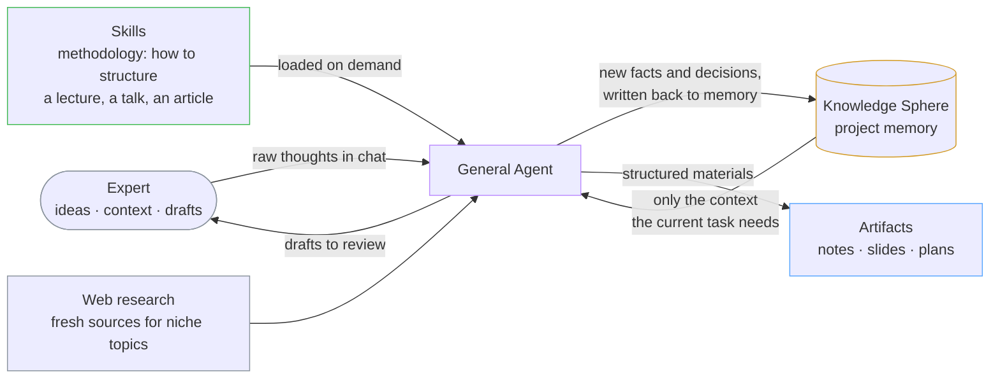
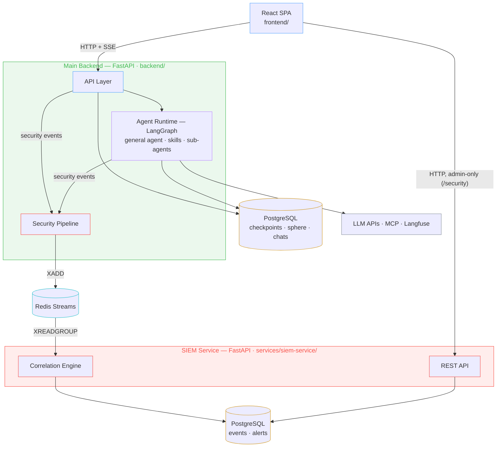

<picture>
  <source media="(prefers-color-scheme: dark)" srcset="doc/assets/readme/banner-dark.png">
  
</picture>

<p align="center"><a href="README.md">Русский</a> · <b>English</b></p>

<p align="center">
  <a href="#what-is-learnflow-ai">About</a> ·
  <a href="#screenshots">Screenshots</a> ·
  <a href="#features">Features</a> ·
  <a href="#how-the-agent-works">Agent</a> ·
  <a href="#architecture">Architecture</a> ·
  <a href="#roadmap">Roadmap</a> ·
  <a href="#quick-start">Quick Start</a> ·
  <a href="#documentation">Docs</a>
</p>

## What is LearnFlow AI

University teachers, tech speakers, and course authors all share the same routine: you have deep expertise and a head full of context, but turning it into a lecture, a course handbook, or a talk eats hours. Ordinary LLM chats don't really help — context evaporates between sessions, every new chat starts from zero, and you spend the first ten minutes re-explaining what you already told the model last week.

LearnFlow AI is built around a different core idea: **the project as a sphere of context**. You create a project (a course, a talk, an article series) and work inside it through chats. As you work, the agent accumulates a **Knowledge Sphere** — a structured memory of the project: decisions made, terminology agreed on, materials produced. The next session picks up exactly where you left off, and the agent loads only the context relevant to the current task instead of drowning in the full history. Memory is not limited to the project either: the agent also remembers the user — style, preferences, standing instructions. And that memory is transparent — you can see what the agent knows and correct it by hand.

On top of that memory sits an agent with **skills** — methodology written by humans: how to structure a lecture, how to format a report to a standard, how to build a narrative arc for a talk. The agent produces real artifacts: course notes, handbooks, slide decks, curriculum plans — not just chat replies.

## Screenshots

<p align="center">
  
  <br><em>Projects workspace</em>
</p>

<p align="center">
  
  <br><em>The agent writes to the Knowledge Sphere right from the chat — every write is visible and editable</em>
</p>

<p align="center">
  
  <br><em>Knowledge Sphere — structured project memory</em>
</p>

## Features

- **Project workspace** — chats, memory, and artifacts live together: materials stay consistent with each other (the practice sheet sees the lecture, the slides see the course notes) instead of being scattered across isolated generators.
- **Agent memory** — the agent remembers both the project and the user. The Knowledge Sphere accumulates the project's decisions, terminology, and materials; user memory holds style, preferences, and standing instructions. Long work runs for weeks without losing the thread, and only what's relevant to the task is loaded into context.
- **Transparency and control** — you can see what the agent is doing and what it knows: a live activity feed (tool calls, sub-agent runs, memory writes — not a spinner), and every write to the Sphere is a reviewable patch you can edit.
- **Methodology skills** — pluggable packages of practitioner knowledge ("how to structure a lecture", "how to format a report to a standard") that work in the context of the project: they see the Sphere and the artifacts. The library grows and is open for contribution.
- **Artifacts** — course notes, handbooks, plans, and slide decks live inside the project next to the chats, not buried in the transcript.
- **Your own infrastructure** — self-hosted deployment, any OpenAI-compatible endpoint (from cloud providers to on-prem vLLM), full Langfuse tracing with per-request cost accounting, built-in prompt-injection defense.

## How the agent works

The product requirement behind the runtime is flexibility: preparing a talk, a course, and an article series are different workflows, and every expert brings their own. So instead of hardcoded pipelines there is **one general agent** (plain LangGraph ReAct loop, no LangChain wrappers) whose behavior is extended through configuration, not code:



The loop between the agent and its memory is the core of the product: every session both *draws on* accumulated project memory and *grows* it — so the context never resets to zero.

- **Skills** — pluggable methodology packages ("how to structure a lecture", "how to write a tech article") loaded on demand. Human-authored knowledge, open for contribution — this is how the product stays specialized without freezing into one workflow.
- **Tools** — reading and patching the Knowledge Sphere, generating artifacts, web research via MCP, image generation.
- **Sub-agents** — heavy work (judging output quality, deep web research) runs in isolated contexts so the main agent's context stays lean.
- **Context engineering** — the agent starts with a minimal slice of project memory and drills deeper only when the task needs it; long threads are compacted automatically.
- **Guarded execution** — every tool result passes a security checkpoint before re-entering the loop; prompt-injection defenses are layered, not bolted on.
- **Persistence** — conversation state lives in PostgreSQL checkpoints: any thread resumes exactly where it stopped, which is the whole point of the product.

## Architecture



**Stack:** Python 3.12 · FastAPI · LangGraph (plain, no LangChain wrappers) · PostgreSQL · Redis · React + TypeScript (Feature-Sliced Design) · uv workspace monorepo · Langfuse.

The project is developed with **AIDD (AI-Driven Development)**: the architect defines contracts and architecture in `doc/`, and LLM agents implement against that documented context. The full decision trail lives in [ADRs](doc/tech/adr/) and iteration artifacts — the repository doubles as a working example of the methodology.

## Roadmap

The core product is built — agent runtime, Knowledge Sphere, artifacts, security, observability. What's ahead:

- **Now · dogfooding on real content.** An author's mini-course on defending LLM applications (lectures, slide decks, course notes) is being prepared entirely through the product. Exit criterion: the author relies on the product by habit instead of escaping to generic tools.
- **Next · first external users.** OAuth sign-in, cost-optimal model selection, affordable web search, per-user spending caps.
- **Then · educators channel.** Ready-made teaching materials (lecture notes, slides, practice tasks) built from expert context — for university teachers who have the expertise but not the time to package it.
- **Ongoing tracks.** Agent evaluation (LLM-as-judge + deterministic checks on real-case datasets), model portability (any OpenAI-compatible endpoint, including on-prem vLLM), Telegram bot as a second delivery channel.

The full picture with phases and exit conditions lives in [doc/product/roadmap.md](doc/product/roadmap.md).

## Quick Start

### Prerequisites

- Docker and Docker Compose v2
- For local dev: Python 3.12+, [uv](https://docs.astral.sh/uv/), Node.js 20+

### Docker (full stack)

```bash
git clone https://github.com/Bbar0n234/learnflow-ai.git
cd learnflow-ai

cp .env.example .env
# Edit .env — set your LLM API keys

make docker-build && make docker-up
# App available at http://localhost:8000
```

### Local dev (DB in Docker, app locally)

```bash
uv sync
cd frontend && npm install && cd ..

cp .env.local.example .env.local

make docker-up-db   # PostgreSQL + Redis
make dev            # backend at http://localhost:8000
make dev-fe         # frontend at http://localhost:5173
```

### Useful commands

| Command | Description |
|---------|-------------|
| `make check` / `make check-fe` | All backend / frontend checks (CI gate) |
| `make test` | Run pytest |
| `make migrate` | Apply DB migrations |
| `make docker-logs` | Tail app container logs |

The full command list is in the [Makefile](Makefile).

## Documentation

All project documentation lives in [`doc/`](doc/index.md) (in Russian):

- [idea.md](doc/idea.md) — problem, ICP, JTBD, product boundaries
- [vision.md](doc/vision.md) — system architecture and MVP criteria
- [doc/product/](doc/product/) — use cases, roadmap, versioned scope
- [doc/tech/](doc/tech/) — component docs, conventions, [ADRs](doc/tech/adr/)
- [doc/tasks/](doc/tasks/) — task lists and iteration artifacts
