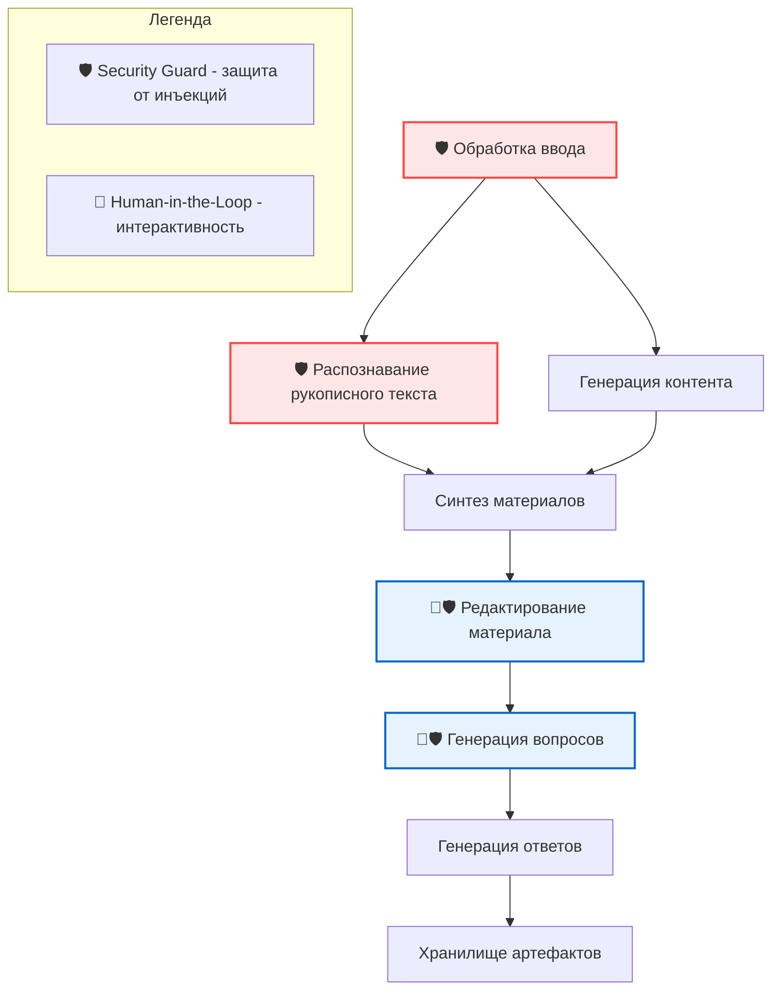
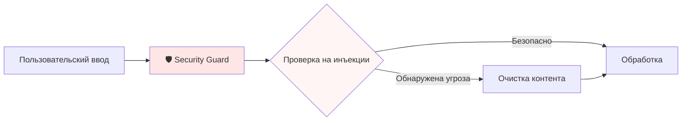
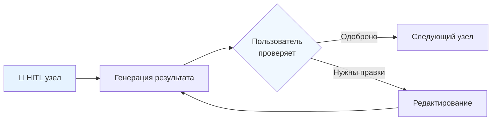

# LearnFlow AI

**[English](README_EN.md) | Русский**

[](LICENSE)
[](https://www.python.org/downloads/)
[](https://github.com/langchain-ai/langgraph)
[](docker-compose.yml)

Универсальная система генерации образовательного контента на основе LangGraph для любой предметной области и уровня образования. Преобразует учебные темы и рукописные заметки в комплексные образовательные материалы с вопросами для проверки усвоения и ответами.

## 📹 Демо


### Смотреть демо на YouTube

[](https://youtu.be/bkBHdkRn2Ao)

## 🎯 Зачем LearnFlow AI?

LearnFlow AI решает универсальную образовательную проблему: преобразование разрозненных учебных вопросов и рукописных заметок в структурированные, всесторонние учебные материалы - от математики и физики до литературы и истории, от начальной школы до университетского уровня.

### Ключевые возможности

#### Для пользователей (преподаватели, репетиторы, методисты, студенты)
- **🎯 Исключительное качество контента** - Продвинутые техники промпт-инжиниринга с XML-структурированием и семантическими ключевыми словами обеспечивают глубину и точность генерируемых материалов
- **🔧 Универсальная гибкость** - Адаптация под любой домен знаний (от математики до литературы), уровень аудитории (от школы до университета), объем материала и количество проверочных вопросов
- **💬 Удобный Telegram-интерфейс** - Полноценная работа с системой через привычный мессенджер с поддержкой изображений и интерактивных команд
- **✏️ Интерактивное редактирование** - Итеративное улучшение материалов через диалог с возможностью точечных правок
- **📝 Распознавание рукописного текста** - Автоматическая обработка как печатных, так и рукописных заметок для создания персонализированных учебных материалов

#### Для разработчиков и архитекторов
- **🔄 Production-ready LangGraph** - Эталонная реализация многоузлового workflow с HITL (Human-in-the-Loop) интеграцией и мультимодальной обработкой
- **🤖 AI-Driven Development** - Практический пример делегирования написания кода LLM-агентам при сохранении архитектурного контроля. Вся проектная документация в `docs/` используется для эффективной работы с LLM
- **🛡️ Встроенная безопасность** - Защита от prompt injection и jailbreak-атак на уровне архитектуры
- **🔐 Multi-tenancy ready** - JWT авторизация и изоляция данных для корпоративного использования
- **🎨 Модульная архитектура** - Clean Architecture с четким разделением слоев, микросервисная структура (FastAPI, Telegram Bot, внешние интеграции)
- **📊 Observability** - Интеграция с LangFuse для полной трассировки и мониторинга AI-операций
- **🐳 Docker-first подход** - Полная контейнеризация с orchestration через docker-compose

### 📚 Примеры генерируемых материалов

Изучите, как система адаптирует подачу одной темы — **векторная база Qdrant** — под разные уровни аудитории:

- 🟢 **[Начальный](_examples/beginner/)** — Интуитивное объяснение через аналогии. От проблемы поиска по смыслу до практического применения.
- 🟡 **[Средний](_examples/intermediate/)** — Архитектурное понимание: как работает HNSW, почему именно так, оптимизации производительности.
- 🔴 **[Продвинутый](_examples/advanced/)** — Академическая глубина: формальные определения, доказательства, математический аппарат.

Каждый комплект: заметки → материал → вопросы → ответы. Эта адаптивность делает LearnFlow AI универсальным для любого образовательного контекста.

## 🚀 Быстрый старт

### Предварительные требования

- Docker и Docker Compose
- Python 3.11+ (для локальной разработки)
- API-ключи для выбранного вами LLM-провайдера (см. [руководство по быстрому старту](docs/quick_start.md) для получения ключей)

### Запуск через Docker (рекомендуется)

1. **Клонировать репозиторий**
```bash
git clone https://github.com/Bbar0n234/learnflow-ai.git
cd learnflow-ai
```

2. **Настроить окружение**
```bash
cp env.example .env
# Отредактируйте .env с вашими API-ключами
```

3. **Запустить все сервисы**
```bash
docker compose up -d
```

Сервисы будут доступны по адресам:
- FastAPI: http://localhost:8000
- Веб-интерфейс: http://localhost:3001
- LangFuse: http://localhost:3000
- API Документация: http://localhost:8000/docs
- Сервис артефактов: http://localhost:8001
- Сервис конфигурации промптов: http://localhost:8002

### Локальная разработка

1. **Настроить окружение для локальной разработки**
```bash
cp .env.local.example .env.local
# Отредактируйте .env.local с вашими API-ключами
```

2. **Запустить все сервисы одной командой (рекомендуется)**
```bash
make local-dev
```

Этот скрипт автоматически:
- Устанавливает зависимости через `uv sync`
- Запускает PostgreSQL в Docker
- Создает базы данных и применяет миграции
- Запускает все сервисы с логированием
- Проверяет health status каждого сервиса
- Обрабатывает Ctrl+C для корректной остановки

**Дополнительные команды:**
```bash
./local-reset.sh  # Полный сброс окружения
```

Подробнее о настройке окружения см. [docs/overview.md](docs/overview.md)

### Использование локальных LLM

LearnFlow AI поддерживает локальные LLM-провайдеры из коробки:

```bash
# С Ollama
OPENAI_API_BASE=http://localhost:11434/v1
OPENAI_API_KEY=ollama
MODEL_NAME=llama3

# С LM Studio
OPENAI_API_BASE=http://localhost:1234/v1
OPENAI_API_KEY=lm-studio
MODEL_NAME=local-model
```

## 🏗️ Архитектура

LearnFlow AI использует модульную, событийно-ориентированную архитектуру, построенную на LangGraph:



#### Как работает Security Guard



#### Как работает Human-in-the-Loop (HITL)



### Основные компоненты

- **Workflow Engine** - Оркестрация на основе LangGraph с управлением состоянием
- **Node Architecture** - Модульные узлы обработки, расширяющие `BaseWorkflowNode`
- **Security Layer** - Защитные механизмы для валидации ввода и обнаружения угроз
- **Storage Layer** - Управление артефактами на основе потоков с интеграцией GitHub
- **Prompt Configuration Service** - Динамическая персонализированная генерация промптов с пользовательскими предпочтениями
- **Observability** - Интеграция LangFuse для трассировки и мониторинга

## 🛡️ Функции безопасности

LearnFlow AI включает комплексную защиту от инъекций промптов:

- **Универсальная валидация ввода** - Обнаружение на основе LLM со структурированным выводом для всех точек входа
- **Плавная деградация** - Безопасность никогда не блокирует выполнение workflow, всегда сохраняет пользовательский опыт
- **Нечёткая очистка контента** - Умное удаление вредоносного контента с сохранением легитимного образовательного материала
- **Учёт образовательного контекста** - Адаптация к различным предметным областям и снижение ложных срабатываний
- **Конфигурационное управление** - Промпты безопасности и настройки управляются через YAML-конфиги
- **Полное покрытие** - Защищает вопросы, распознанный контент, HITL-обратную связь и запросы на редактирование

## 📚 Документация

### Для пользователей
- [Обзор системы](docs/overview.md) - Детальное описание возможностей и архитектуры
- [Бизнес-модель](docs/business_model.md) - Стратегия монетизации и развития

### Для разработчиков
- [Архитектурный обзор](docs/ADR/001-architecture-overview.md) - Ключевые архитектурные решения
- [Безопасность LLM](docs/ADR/002-llm-guardrails.md) - Защита от prompt injection
- [C4 Container Diagram](docs/architecture/c4-container-diagram.md) - Архитектура системы
- [Нефункциональные требования](docs/architecture/NFR.md) - Производительность и ограничения
- [Руководство разработчика](docs/conventions.md) - Стандарты кодирования и процессы
- [Дорожная карта](docs/planning/roadmap.md) - Планы развития проекта

## 📊 Метрики и мониторинг

LearnFlow AI включает комплексную наблюдаемость:

- **LangFuse** - Трассировка каждого взаимодействия с LLM
- **Структурированное логирование** - ID корреляции для отслеживания запросов
- **Health Checks** - Endpoint `/health` для мониторинга
- **Метрики производительности** - Время отклика и использование токенов

## 🌍 Универсальная образовательная поддержка

LearnFlow AI адаптируется к любому образовательному контексту:

### Предметные области
- **STEM**: Математика, физика, химия, биология, информатика
- **Гуманитарные науки**: Литература, история, философия, языки
- **Социальные науки**: Психология, экономика, политология
- **Профессиональные**: Юриспруденция, медицина, инженерия, бизнес

### Образовательные уровни
- **K-12**: От начальной до старшей школы
- **Высшее образование**: Университетские и аспирантские программы
- **Профессиональное развитие**: Сертификация и непрерывное образование
- **Самообучение**: Личное обучение и развитие навыков

### Примеры использования
- Преобразование задач по математическому анализу в пошаговые учебные материалы
- Конвертация исторических эссе в комплексные учебные пособия
- Синтез лабораторных заметок по химии с теоретическими концепциями
- Создание материалов для литературного анализа на основе вопросов для обсуждения книг

## 📝 Лицензия

Этот проект лицензирован под Apache 2.0 - см. [LICENSE](LICENSE) для деталей.

## 🙏 Благодарности

Создано с использованием:
- [LangGraph](https://github.com/langchain-ai/langgraph) - Оркестрация workflow
- [FastAPI](https://fastapi.tiangolo.com/) - API-фреймворк
- [React](https://react.dev/) - UI-фреймворк
- [LangFuse](https://langfuse.com/) - LLM Observability

## 👨‍💻 Автор

**Феоктистов Станислав** - T-shaped GenAI / LLM инженер

[](https://t.me/Bbar0n234)
[](https://github.com/Bbar0n234)
[](mailto:vilnus1337@gmail.com)

## 📧 Контакты

- Проблемы: [GitHub Issues](https://github.com/Bbar0n234/learnflow-ai/issues)
- Обсуждения: [GitHub Discussions](https://github.com/Bbar0n234/learnflow-ai/discussions)

---

<p align="center">
  Сделано с ❤️ Феоктистовым Станиславом
</p>