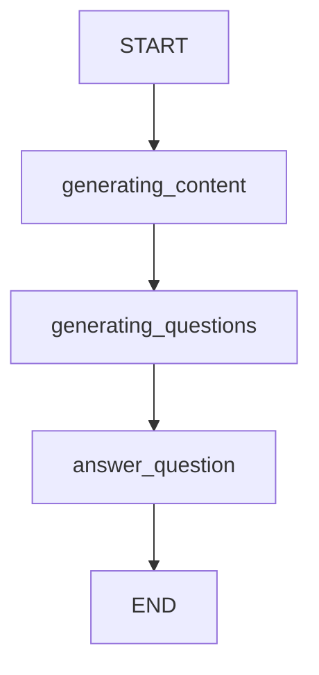

# LearnFlow AI - Генератор образовательного контента по криптографии

Этот проект автоматически генерирует всесторонние учебные материалы по криптографии на основе экзаменационных вопросов с использованием LangGraph и OpenAI.

## Возможности

- 📚 Генерация исчерпывающих учебных материалов по криптографии
- 🤔 Автоматическое выявление пробелов в знаниях и создание дополнительных вопросов
- 💡 Подробные ответы на дополнительные вопросы с математическими выводами
- 🔄 Параллельная обработка множественных вопросов через LangGraph
- 📝 Экспорт результатов в формате Markdown

## Установка

### Предварительные требования

- Python 3.13+
- Poetry для управления зависимостями

### Шаги установки

1. **Клонирование репозитория**
   ```bash
   git clone <repository-url>
   cd learnflow-ai
   ```

2. **Установка зависимостей**
   ```bash
   poetry install
   ```

3. **Настройка переменных окружения**
   ```bash
   cp env.example .env
   ```
   
   Отредактируйте `.env` файл и добавьте ваши API ключи:
   ```
   OPENAI_API_KEY=your_openai_api_key_here
   TAVILY_API_KEY=your_tavily_api_key_here
   LANGSMITH_API_KEY=your_langsmith_api_key_here
   NEWS_FIREWORKS_API_KEY=your_fireworks_api_key_here
   PERPLEXITY_API_KEY=your_perplexity_api_key_here
   ```

4. **Активация виртуального окружения**
   ```bash
   poetry shell
   ```

5. **Запуск Jupyter**
   ```bash
   jupyter notebook main.ipynb
   ```

## Структура проекта

```
learnflow-ai/
├── main.ipynb              # Основной notebook
├── utils.py                # Утилиты и конфигурация
├── config/
│   ├── prompts.yaml        # Шаблоны промптов
│   └── graph.yaml          # Конфигурация LangGraph
├── data/
│   └── outputs/            # Выходные файлы
├── env.example             # Пример файла окружения
├── pyproject.toml          # Зависимости проекта
└── README.md
```

## Использование

### Базовое использование

1. Откройте `main.ipynb` в Jupyter Notebook
2. Выполните все ячейки по порядку
3. Система автоматически обработает список экзаменационных вопросов
4. Результаты будут сохранены в `data/outputs/`

### Настройка вопросов

Отредактируйте список `questions` в notebook для добавления ваших экзаменационных вопросов:

```python
questions = [
    "Ваш вопрос по криптографии...",
    "Другой вопрос...",
]
```

### Настройка промптов

Отредактируйте `config/prompts.yaml` для изменения системных промптов:

- `generating_content_system_prompt` - для генерации основного материала
- `gen_question_system_prompt` - для создания дополнительных вопросов  
- `gen_answer_system_prompt` - для ответов на дополнительные вопросы

### Настройка модели

Измените `MODEL_NAME` в `.env` файле для использования другой модели:

```
MODEL_NAME=gpt-4o
# или
MODEL_NAME=gpt-4-turbo
```

## Архитектура

Проект использует LangGraph для создания workflow с тремя основными узлами:

1. **generating_content** - Генерирует основной учебный материал
2. **generating_questions** - Анализирует материал и создает дополнительные вопросы
3. **answer_question** - Отвечает на дополнительные вопросы (параллельно)



## Выходные файлы

Каждый обработанный вопрос создает Markdown файл со структурой:

```markdown
# Экзаменационный вопрос
[Исходный вопрос]

## Общий материал
[Всесторонний учебный материал]

## Дополнительные вопросы и ответы
1. [Дополнительный вопрос и подробный ответ]
2. [Следующий дополнительный вопрос и ответ]
...
```

## Мониторинг

Проект интегрирован с LangSmith для отслеживания выполнения. Установите `LANGSMITH_API_KEY` для включения трассировки.

## Устранение неполадок

### Ошибки API ключей
- Убедитесь, что все необходимые API ключи указаны в `.env` файле
- Проверьте лимиты использования на платформах API

### Ошибки установки зависимостей
```bash
poetry lock --no-update
poetry install
```

### Проблемы с кодировкой
Убедитесь, что ваша система поддерживает UTF-8 кодировку для корректного отображения русского текста.

## Лицензия

Apache 2.0

## Поддержка

Для вопросов и поддержки создайте issue в репозитории.