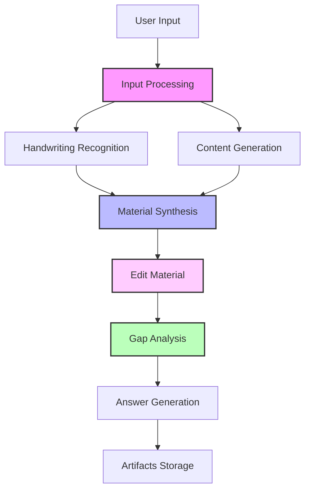

# LearnFlow AI

[](LICENSE)
[](https://www.python.org/downloads/)
[](https://github.com/langchain-ai/langgraph)
[](docker-compose.yml)

A production-ready, LangGraph-based educational content generation system that transforms unstructured notes into comprehensive study materials. Built with a focus on clean architecture, security, and extensibility.


## 🎯 Why LearnFlow AI?

LearnFlow AI demonstrates modern AI-driven development practices while solving a real problem: transforming scattered exam questions and handwritten notes into structured, comprehensive study materials.

### Key Features

- **🔄 LangGraph Workflow Pipeline** - Multi-node processing with configurable HITL (Human-in-the-Loop) capabilities
- **✏️ Interactive Material Editing** - Iterative refinement of synthesized content with fuzzy text matching
- **🛡️ LLM Security** - Built-in Guardrails against prompt injection and jailbreak attacks
- **🤖 Universal LLM Support** - Works with any OpenAI-compatible API (including local models)
- **📝 OCR & Handwriting Recognition** - Process both typed and handwritten materials
- **🎨 Modern Web UI** - React-based interface with real-time updates
- **🤖 Telegram Bot** - Conversational interface for on-the-go access
- **🐳 Docker-First** - One command deployment with `docker compose up`

## 🚀 Quick Start

### Prerequisites

- Docker and Docker Compose
- Python 3.13+ (for local development)
- API keys for your chosen LLM provider

### Installation

1. **Clone the repository**
```bash
git clone https://github.com/yourusername/learnflow-ai.git
cd learnflow-ai
```

2. **Configure environment**
```bash
cp env.example .env
# Edit .env with your API keys and configuration
```

3. **Start with Docker Compose**
```bash
docker compose up
```

The services will be available at:
- FastAPI: http://localhost:8000
- Web UI: http://localhost:3000
- API Docs: http://localhost:8000/docs

### Using Local LLMs

LearnFlow AI supports local LLM providers out of the box:

```bash
# With Ollama
OPENAI_API_BASE=http://localhost:11434/v1
OPENAI_API_KEY=ollama
MODEL_NAME=llama3

# With LM Studio
OPENAI_API_BASE=http://localhost:1234/v1
OPENAI_API_KEY=lm-studio
MODEL_NAME=local-model
```

## 🏗️ Architecture

LearnFlow AI uses a modular, event-driven architecture built on LangGraph:



### Core Components

- **Workflow Engine** - LangGraph-based orchestration with state management
- **Node Architecture** - Modular processing nodes extending `BaseWorkflowNode`
- **Security Layer** - Guardrails for input validation and threat detection
- **Storage Layer** - Thread-based artifact management with GitHub integration
- **Observability** - LangFuse integration for tracing and monitoring

## 🛡️ Security Features

LearnFlow AI includes comprehensive prompt injection protection:

- **Universal Input Validation** - LLM-based detection with structured output across all entry points
- **Graceful Degradation** - Security never blocks workflow execution, always maintains user experience
- **Fuzzy Content Cleaning** - Smart removal of malicious content while preserving legitimate educational material
- **Educational Context Aware** - Reduces false positives for cryptography and security topics
- **Configuration-Driven** - Security prompts and settings managed through YAML configs
- **Complete Coverage** - Protects exam questions, OCR content, HITL feedback, and edit requests

## 📚 Documentation

- [Architecture Overview](docs/ADR/001-architecture-overview.md)
- [LLM Security](docs/ADR/002-llm-guardrails.md)
- [API Reference](http://localhost:8000/docs)
- [Development Guide](docs/conventions.md)
- [Roadmap](docs/planning/roadmap.md)

## 🤝 Contributing

We welcome contributions! LearnFlow AI is designed to be extensible:

### Good First Issues

Check out our [good first issues](https://github.com/yourusername/learnflow-ai/labels/good%20first%20issue) for ways to get started.

### Adding New Disciplines

1. Create a new prompt configuration in `configs/prompts/`
2. Extend the base workflow node if needed
3. Add tests for your changes
4. Submit a pull request

See [CONTRIBUTING.md](CONTRIBUTING.md) for detailed guidelines.

## 🧪 Development

### Local Setup

```bash
# Install dependencies with UV
uv sync

# Run tests
uv run pytest

# Start development server
uv run --package learnflow python -m learnflow.main
```

### Running Tests

```bash
# Unit tests
uv run pytest tests/unit

# Integration tests
uv run pytest tests/integration

# Coverage report
uv run pytest --cov=learnflow --cov-report=html
```

## 📊 Metrics & Monitoring

LearnFlow AI includes comprehensive observability:

- **LangFuse** - Trace every LLM interaction
- **Structured Logging** - Correlation IDs for request tracking
- **Health Checks** - `/health` endpoint for monitoring
- **Performance Metrics** - Response times and token usage

## 🗺️ Roadmap

### Q1 2025 - Pre-OSS Release
- [x] Docker Compose deployment
- [x] Local LLM support
- [ ] Guardrails implementation
- [ ] English documentation

### Q2 2025 - Community Growth
- [ ] Static prompt library for multiple disciplines
- [ ] PDF/DOCX export
- [ ] Jupyter demo notebook
- [ ] YouTube tutorial series

See our [detailed roadmap](docs/planning/roadmap.md) for more information.

## 📝 License

This project is licensed under Apache 2.0 with Commons Clause - see [LICENSE](LICENSE) for details.

This is a source-available project: you can use, modify, and distribute the code for non-commercial purposes.

## 🙏 Acknowledgments

Built with:
- [LangGraph](https://github.com/langchain-ai/langgraph) - Workflow orchestration
- [FastAPI](https://fastapi.tiangolo.com/) - API framework
- [React](https://react.dev/) - UI framework
- [LangFuse](https://langfuse.com/) - LLM observability

## 📧 Contact

- Issues: [GitHub Issues](https://github.com/yourusername/learnflow-ai/issues)
- Discussions: [GitHub Discussions](https://github.com/yourusername/learnflow-ai/discussions)
- Email: learnflow-ai@example.com

---

<p align="center">
  Made with ❤️ by the LearnFlow AI team
</p>