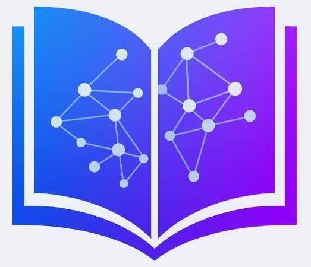
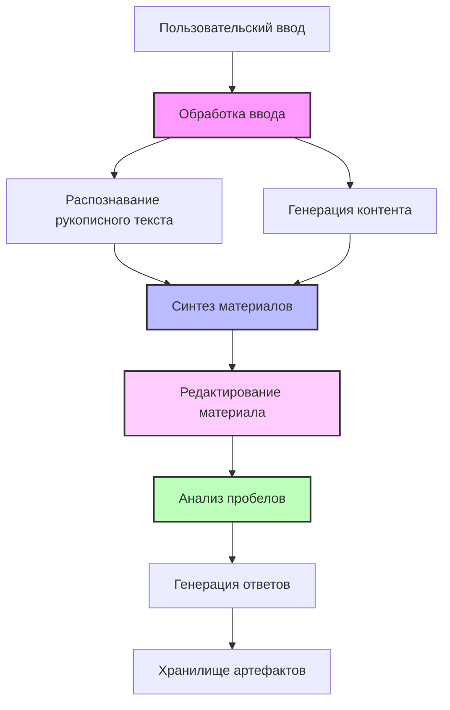

# LearnFlow AI

[](LICENSE)
[](https://www.python.org/downloads/)
[](https://github.com/langchain-ai/langgraph)
[](docker-compose.yml)

Универсальная система генерации образовательного контента на основе LangGraph для любой предметной области и уровня образования. Преобразует учебные вопросы и рукописные заметки в комплексные учебные материалы с вопросами для анализа пробелов и ответами.

## 🎯 Зачем LearnFlow AI?

LearnFlow AI решает универсальную образовательную проблему: преобразование разрозненных учебных вопросов и рукописных заметок в структурированные, всесторонние учебные материалы - от математики и физики до литературы и истории, от начальной школы до университетского уровня.

### Ключевые возможности

- **🔄 LangGraph Workflow Pipeline** - Многоузловая обработка с настраиваемыми возможностями HITL (Human-in-the-Loop)
- **✏️ Интерактивное редактирование материалов** - Итеративное улучшение синтезированного контента с нечётким сопоставлением текста
- **🛡️ Безопасность LLM** - Встроенная защита от инъекций промптов и jailbreak-атак
- **🤖 Универсальная поддержка LLM** - Работает с любым OpenAI-совместимым API (включая локальные модели)
- **📝 Распознавание рукописного текста** - Обработка как печатных, так и рукописных материалов
- **🎨 Современный веб-интерфейс** - React-интерфейс с обновлениями в реальном времени
- **🤖 Telegram-бот** - Диалоговый интерфейс для доступа в пути
- **🎯 Персонализированные промпты** - Динамическая генерация промптов с пользовательскими настройками
- **🐳 Docker-First** - Развёртывание одной командой с помощью `docker compose up`

## 👥 Кому полезен этот проект

### 🎓 Образование и обучение
**Преподаватели, репетиторы, методисты** — автоматическая генерация учебных материалов, тестов и вопросов для gap-анализа знаний. Система обрабатывает как текстовые запросы, так и рукописные конспекты, создавая персонализированные обучающие материалы.

### 👨‍💻 Разработчикам и архитекторам
**AI-Driven Development** — практический пример делегирования написания кода LLM-агентам при сохранении архитектурного контроля. В директории `docs/` ведется вся проектная документация, используемая для эффективной работы с LLM.

**Production-ready архитектура** на базе LangGraph:
- Многоузловая агентная система с HITL (Human-in-the-Loop)
- Мультимодальная обработка (текст + изображения)
- Микросервисы: FastAPI, Telegram Bot, внешние интеграции
- Observability через LangFuse
- Clean Architecture с четким разделением слоев

Проект демонстрирует современные подходы к построению AI-систем, готовых к production-использованию.

## 🚀 Быстрый старт

### Предварительные требования

- Docker и Docker Compose
- Python 3.13+ (для локальной разработки)
- API-ключи для выбранного вами LLM-провайдера

### Установка

1. **Клонировать репозиторий**
```bash
git clone https://github.com/Bbar0n234/learnflow-ai.git
cd learnflow-ai
```

2. **Настроить окружение**
```bash
cp env.example .env
# Отредактируйте .env с вашими API-ключами и настройками
```

3. **Запустить с Docker Compose**
```bash
docker compose up
```

Сервисы будут доступны по адресам:
- FastAPI: http://localhost:8000
- Веб-интерфейс: http://localhost:3000
- API Документация: http://localhost:8000/docs
- Сервис конфигурации промптов: http://localhost:8002
- Документация Prompt Config API: http://localhost:8002/docs

### Использование локальных LLM

LearnFlow AI поддерживает локальные LLM-провайдеры из коробки:

```bash
# С Ollama
OPENAI_API_BASE=http://localhost:11434/v1
OPENAI_API_KEY=ollama
MODEL_NAME=llama3

# С LM Studio
OPENAI_API_BASE=http://localhost:1234/v1
OPENAI_API_KEY=lm-studio
MODEL_NAME=local-model
```

## 🏗️ Архитектура

<div align="center">
  
</div>

LearnFlow AI использует модульную, событийно-ориентированную архитектуру, построенную на LangGraph:



### Основные компоненты

- **Workflow Engine** - Оркестрация на основе LangGraph с управлением состоянием
- **Node Architecture** - Модульные узлы обработки, расширяющие `BaseWorkflowNode`
- **Security Layer** - Защитные механизмы для валидации ввода и обнаружения угроз
- **Storage Layer** - Управление артефактами на основе потоков с интеграцией GitHub
- **Prompt Configuration Service** - Динамическая персонализированная генерация промптов с пользовательскими предпочтениями
- **Observability** - Интеграция LangFuse для трассировки и мониторинга

## 🛡️ Функции безопасности

LearnFlow AI включает комплексную защиту от инъекций промптов:

- **Универсальная валидация ввода** - Обнаружение на основе LLM со структурированным выводом для всех точек входа
- **Плавная деградация** - Безопасность никогда не блокирует выполнение workflow, всегда сохраняет пользовательский опыт
- **Нечёткая очистка контента** - Умное удаление вредоносного контента с сохранением легитимного образовательного материала
- **Учёт образовательного контекста** - Адаптация к различным предметным областям и снижение ложных срабатываний
- **Конфигурационное управление** - Промпты безопасности и настройки управляются через YAML-конфиги
- **Полное покрытие** - Защищает экзаменационные вопросы, OCR-контент, HITL-обратную связь и запросы на редактирование

## 📚 Документация

- [Обзор архитектуры](docs/ADR/001-architecture-overview.md)
- [Безопасность LLM](docs/ADR/002-llm-guardrails.md)
- [Справочник API](http://localhost:8000/docs)
- [Руководство разработчика](docs/conventions.md)
- [Дорожная карта](docs/planning/roadmap.md)


## 🧪 Разработка

### Локальная настройка

```bash
# Установка зависимостей с помощью UV
uv sync

# Запуск тестов
uv run pytest

# Запуск сервера разработки
uv run --package learnflow python -m learnflow.main
```

### Запуск тестов

```bash
# Unit-тесты
uv run pytest tests/unit

# Интеграционные тесты
uv run pytest tests/integration

# Отчёт о покрытии
uv run pytest --cov=learnflow --cov-report=html
```

## 📊 Метрики и мониторинг

LearnFlow AI включает комплексную наблюдаемость:

- **LangFuse** - Трассировка каждого взаимодействия с LLM
- **Структурированное логирование** - ID корреляции для отслеживания запросов
- **Health Checks** - Endpoint `/health` для мониторинга
- **Метрики производительности** - Время отклика и использование токенов

## 🌍 Универсальная образовательная поддержка

LearnFlow AI адаптируется к любому образовательному контексту:

### Предметные области
- **STEM**: Математика, физика, химия, биология, информатика
- **Гуманитарные науки**: Литература, история, философия, языки
- **Социальные науки**: Психология, экономика, политология
- **Профессиональные**: Юриспруденция, медицина, инженерия, бизнес

### Образовательные уровни
- **K-12**: От начальной до старшей школы
- **Высшее образование**: Университетские и аспирантские программы
- **Профессиональное развитие**: Сертификация и непрерывное образование
- **Самообучение**: Личное обучение и развитие навыков

### Примеры использования
- Преобразование задач по математическому анализу в пошаговые учебные материалы
- Конвертация исторических эссе в комплексные учебные пособия
- Синтез лабораторных заметок по химии с теоретическими концепциями
- Создание материалов для литературного анализа на основе вопросов для обсуждения книг

## 📝 Лицензия

Этот проект лицензирован под Apache 2.0 - см. [LICENSE](LICENSE) для деталей.

## 🙏 Благодарности

Создано с использованием:
- [LangGraph](https://github.com/langchain-ai/langgraph) - Оркестрация workflow
- [FastAPI](https://fastapi.tiangolo.com/) - API-фреймворк
- [React](https://react.dev/) - UI-фреймворк
- [LangFuse](https://langfuse.com/) - Наблюдаемость LLM

## 👨‍💻 Автор

**Феоктистов Станислав** - T-shaped GenAI инженер

[](https://t.me/Bbar0n234)
[](https://github.com/Bbar0n234)
[](mailto:vilnus1337@gmail.com)

## 📧 Контакты

- Проблемы: [GitHub Issues](https://github.com/Bbar0n234/learnflow-ai/issues)
- Обсуждения: [GitHub Discussions](https://github.com/Bbar0n234/learnflow-ai/discussions)

---

<p align="center">
  Сделано с ❤️ Феоктистовым Станиславом
</p>