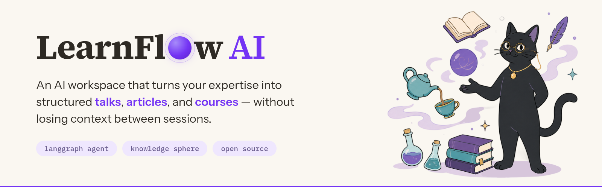
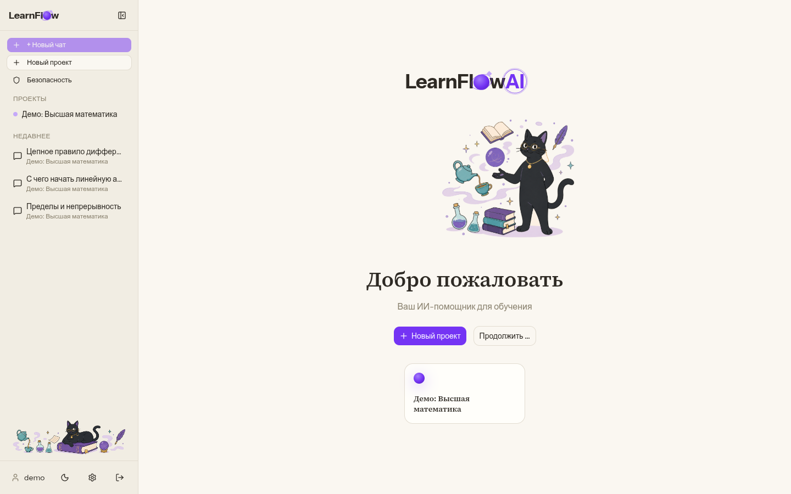
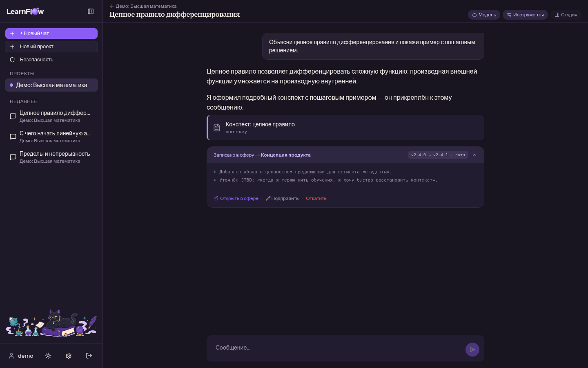
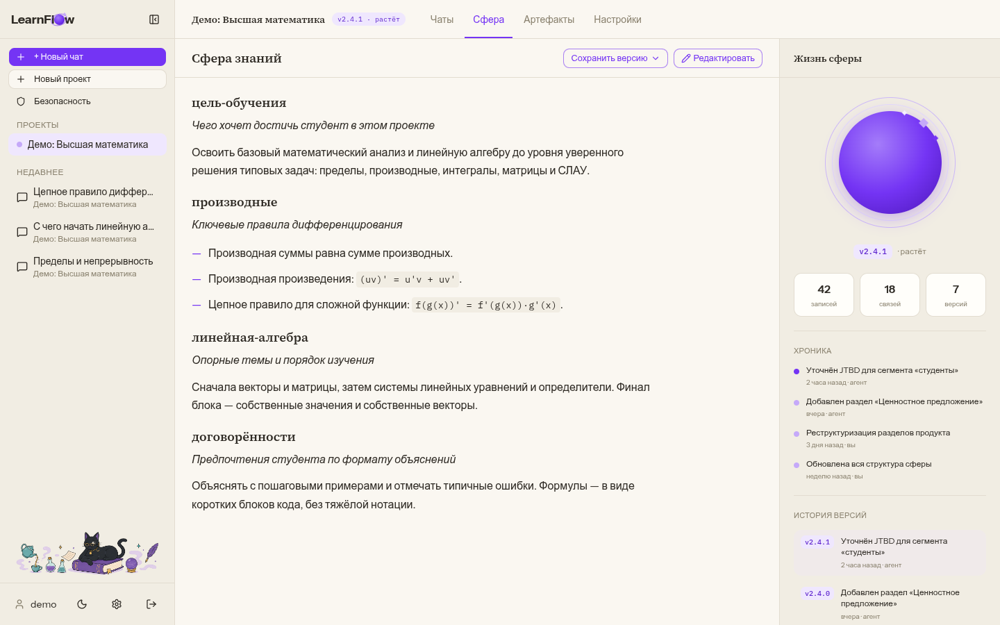
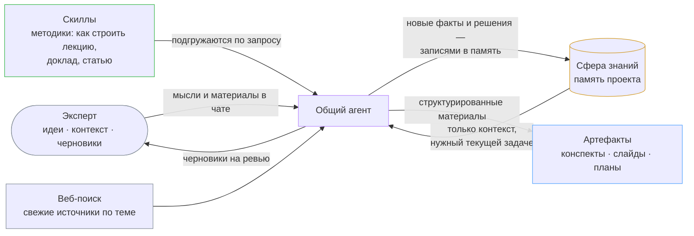
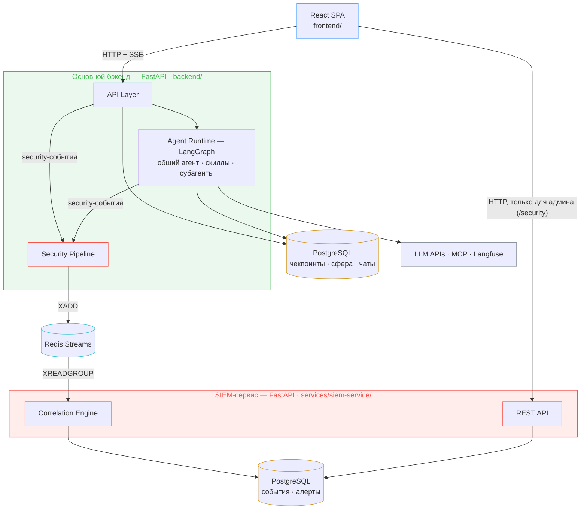

<picture>
  <source media="(prefers-color-scheme: dark)" srcset="doc/assets/readme/banner-dark.png">
  
</picture>

<p align="center"><b>Русский</b> · <a href="README.en.md">English</a></p>

<p align="center">
  <a href="#что-такое-learnflow-ai">О проекте</a> ·
  <a href="#скриншоты">Скриншоты</a> ·
  <a href="#возможности">Возможности</a> ·
  <a href="#как-работает-агент">Агент</a> ·
  <a href="#архитектура">Архитектура</a> ·
  <a href="#дорожная-карта">Дорожная карта</a> ·
  <a href="#быстрый-старт">Быстрый старт</a> ·
  <a href="#документация">Документация</a>
</p>

## Что такое LearnFlow AI

Преподаватели, технические спикеры и авторы курсов делят одну рутину: экспертиза есть, контекст в голове, а превращение их в лекцию, методичку или доклад съедает часы. Обычные чаты с LLM не спасают — контекст испаряется между сессиями, каждый новый чат начинается с нуля, и первые десять минут уходят на то, чтобы заново объяснить модели рассказанное на прошлой неделе.

LearnFlow AI построен вокруг другой идеи: **проект как сфера контекста**. Вы создаёте проект — курс, доклад, серию статей — и работаете внутри него. По ходу работы агент накапливает **Сферу знаний** — структурированную память проекта: принятые решения, согласованную терминологию, готовые материалы. Следующая сессия продолжается ровно с того места, где закончилась прошлая, а в контекст агент берёт только то, что нужно текущей задаче. Память не ограничивается проектом: агент помнит и самого пользователя — стиль, предпочтения, постоянные инструкции. И эта память прозрачна — видно, что агент знает, и это можно поправить руками.

Поверх памяти работает агент со **скиллами** — методиками, написанными людьми: как строить лекцию, как оформить отчёт по ГОСТ, как собрать нарратив доклада. На выходе — реальные артефакты: конспекты, методички, слайды, планы курса, — а не просто ответы в чате.

## Скриншоты

<p align="center">
  
  <br><em>Рабочее пространство проектов</em>
</p>

<p align="center">
  
  <br><em>Агент пишет в Сферу знаний прямо из чата — каждая запись видна и доступна для правки</em>
</p>

<p align="center">
  
  <br><em>Сфера знаний — структурированная память проекта</em>
</p>

## Возможности

- **Рабочее пространство проекта** — чаты, память и артефакты живут вместе: материалы согласованы между собой (практика видит лекцию, слайды видят конспект), а не разбросаны по отдельным генераторам.
- **Память агента** — агент помнит проект и пользователя. Сфера знаний накапливает решения, терминологию и материалы проекта; память о пользователе — стиль, предпочтения, постоянные инструкции. Длинная работа идёт неделями без потери нити, а в контекст подгружается только относящееся к задаче.
- **Прозрачность и контроль** — видно, что агент делает и что он знает: живая лента действий (вызовы инструментов, запуски субагентов, записи в память — не спиннер), а каждая запись в Сферу — просматриваемый патч, который можно отредактировать.
- **Скиллы-методики** — подключаемые пакеты знаний методистов («как строить лекцию», «как оформить отчёт по ГОСТ»), работающие в контексте проекта: они видят Сферу и артефакты. Библиотека под вузовские задачи растёт и открыта для вклада.
- **Артефакты** — конспекты, методички, планы, слайды живут в проекте рядом с чатами, а не похоронены в переписке.
- **Свой контур** — self-hosted развёртывание, любой OpenAI-совместимый endpoint (от облачных провайдеров до on-prem vLLM), Langfuse-трейсинг с учётом затрат на каждый запрос, встроенная защита от prompt-injection.

## Как работает агент

Продуктовое требование к рантайму — гибкость: подготовка доклада, курса и серии статей — разные процессы, и у каждого эксперта они свои. Поэтому вместо жёстко зашитых конвейеров — **один общий агент** (чистый LangGraph ReAct-цикл, без LangChain-обёрток), чьё поведение расширяется конфигурацией, а не кодом:


```mermaid
graph LR
    EXPERT(["Эксперт<br/>идеи · контекст · черновики"])
    AGENT["Общий агент"]
    SPHERE[("Сфера знаний<br/>память проекта")]
    SKILLS["Скиллы<br/>методики: как строить лекцию,<br/>доклад, статью"]
    WEB["Веб-поиск<br/>свежие источники по теме"]
    OUT["Артефакты<br/>конспекты · слайды · планы"]

    EXPERT -->|"мысли и материалы в чате"| AGENT
    AGENT -->|"черновики на ревью"| EXPERT
    SPHERE -->|"только контекст,<br/>нужный текущей задаче"| AGENT
    AGENT -->|"новые факты и решения —<br/>записями в память"| SPHERE
    SKILLS -->|"подгружаются по запросу"| AGENT
    WEB --> AGENT
    AGENT -->|"структурированные материалы"| OUT

    style AGENT stroke:#bc8cff
    style SPHERE stroke:#d29922
    style SKILLS stroke:#3fb950
    style OUT stroke:#58a6ff
    style WEB stroke:#8b949e
    style EXPERT stroke:#8b949e
```

Петля между агентом и памятью — ядро продукта: каждая сессия и опирается на накопленную память проекта, и растит её — контекст никогда не обнуляется.

- **Скиллы** — подключаемые пакеты методик («как строить лекцию», «как написать техническую статью»), загружаемые по запросу. Знания, написанные людьми и открытые для вклада, — так продукт остаётся специализированным, не застывая в одном сценарии.
- **Инструменты** — чтение и обновление Сферы знаний, генерация артефактов, веб-поиск через MCP, генерация изображений.
- **Субагенты** — тяжёлая работа (оценка качества результата, глубокий веб-поиск) выполняется в изолированных контекстах, чтобы контекст основного агента оставался компактным.
- **Работа с контекстом** — агент стартует с минимального среза памяти проекта и углубляется, только когда этого требует задача; длинные диалоги сжимаются автоматически.
- **Защищённое выполнение** — каждый результат инструмента проходит security-checkpoint перед возвратом в цикл; защита от prompt-injection построена слоями, а не приклеена сверху.
- **Персистентность** — состояние диалога живёт в PostgreSQL-чекпоинтах: любой тред продолжается ровно с места остановки, в этом и есть смысл продукта.

## Архитектура


```mermaid
graph TD
    Frontend["React SPA<br/>frontend/"]

    subgraph Backend["Основной бэкенд — FastAPI · backend/"]
        API["API Layer"]
        Runtime["Agent Runtime — LangGraph<br/>общий агент · скиллы · субагенты"]
        SecPipe["Security Pipeline"]
    end

    subgraph SIEM["SIEM-сервис — FastAPI · services/siem-service/"]
        SiemAPI["REST API"]
        Correlation["Correlation Engine"]
    end

    MainDB[("PostgreSQL<br/>чекпоинты · сфера · чаты")]
    SiemDB[("PostgreSQL<br/>события · алерты")]
    Redis[("Redis Streams")]
    External["LLM APIs · MCP · Langfuse"]

    Frontend -->|HTTP + SSE| API
    Frontend -->|"HTTP, только для админа (/security)"| SiemAPI
    API --> Runtime
    API --> MainDB
    Runtime --> MainDB
    Runtime --> External
    API -->|security-события| SecPipe
    Runtime -->|security-события| SecPipe
    SecPipe -->|XADD| Redis
    Redis -->|XREADGROUP| Correlation
    Correlation --> SiemDB
    SiemAPI --> SiemDB

    style Backend fill:#3fb9501a,stroke:#3fb950,color:#3fb950
    style SIEM fill:#f851491a,stroke:#f85149,color:#f85149
    style Frontend stroke:#58a6ff
    style API stroke:#58a6ff
    style Runtime stroke:#bc8cff
    style SecPipe stroke:#f85149
    style SiemAPI stroke:#f85149
    style Correlation stroke:#f85149
    style MainDB stroke:#d29922
    style SiemDB stroke:#d29922
    style Redis stroke:#39c5cf
    style External stroke:#8b949e
```

**Стек:** Python 3.12 · FastAPI · LangGraph (чистый, без LangChain-обёрток) · PostgreSQL · Redis · React + TypeScript (Feature-Sliced Design) · uv workspace monorepo · Langfuse.

Проект разрабатывается по **AIDD (AI-Driven Development)**: архитектор определяет контракты и архитектуру в `doc/`, а LLM-агенты реализуют по этому документационному контексту. Полный след решений живёт в [ADR](doc/tech/adr/) и артефактах итераций — репозиторий заодно служит рабочим примером методологии.

## Дорожная карта

Ядро продукта построено — рантайм агента, Сфера знаний, артефакты, безопасность, наблюдаемость. Что впереди:

- **Сейчас · обкатка на реальном контенте.** Авторский мини-курс по защите LLM-приложений (лекции, слайды, конспекты) готовится целиком через продукт. Критерий выхода: автор по привычке опирается на продукт, а не сбегает в универсальные инструменты.
- **Дальше · первые внешние пользователи.** Вход через OAuth, экономичный выбор моделей, доступный веб-поиск, потолок затрат на пользователя.
- **Затем · канал преподавателей.** Готовые учебные материалы (конспекты лекций, слайды, практические задания) из экспертного контекста — для преподавателей вузов, у которых есть экспертиза, но нет времени её упаковывать.
- **Сквозные треки.** Оценка качества агента (LLM-as-judge + детерминированные проверки на датасетах из реальных кейсов), портируемость моделей (любой OpenAI-совместимый endpoint, включая on-prem vLLM), Telegram-бот как второй канал доставки.

Полная картина с фазами и критериями выхода — в [doc/product/roadmap.md](doc/product/roadmap.md).

## Быстрый старт

### Предварительные требования

- Docker и Docker Compose v2
- Для локальной разработки: Python 3.12+, [uv](https://docs.astral.sh/uv/), Node.js 20+

### Docker (полный стек)

```bash
git clone https://github.com/Bbar0n234/learnflow-ai.git
cd learnflow-ai

cp .env.example .env
# Отредактируйте .env — укажите API-ключи LLM

make docker-build && make docker-up
# Приложение доступно на http://localhost:8000
```

### Локальная разработка (БД в Docker, приложение локально)

```bash
uv sync
cd frontend && npm install && cd ..

cp .env.local.example .env.local

make docker-up-db   # PostgreSQL + Redis
make dev            # бэкенд на http://localhost:8000
make dev-fe         # фронтенд на http://localhost:5173
```

### Полезные команды

| Команда | Назначение |
|---------|------------|
| `make check` / `make check-fe` | Все проверки бэкенда / фронтенда (CI gate) |
| `make test` | Запуск pytest |
| `make migrate` | Применение миграций БД |
| `make docker-logs` | Логи контейнера приложения |

Полный список команд — в [Makefile](Makefile).

## Документация

Вся документация проекта живёт в [`doc/`](doc/index.md):

- [idea.md](doc/idea.md) — проблема, целевая аудитория, границы продукта
- [vision.md](doc/vision.md) — архитектура системы и критерии MVP
- [doc/product/](doc/product/) — сценарии использования, дорожная карта, scope по версиям
- [doc/tech/](doc/tech/) — документация компонентов, конвенции, [ADR](doc/tech/adr/)
- [doc/tasks/](doc/tasks/) — тасклисты и артефакты итераций

## Лицензия

[Apache 2.0](LICENSE)

This product includes IP geolocation data by [IPinfo](https://ipinfo.io), licensed under [CC BY-SA 4.0](https://creativecommons.org/licenses/by-sa/4.0/).
