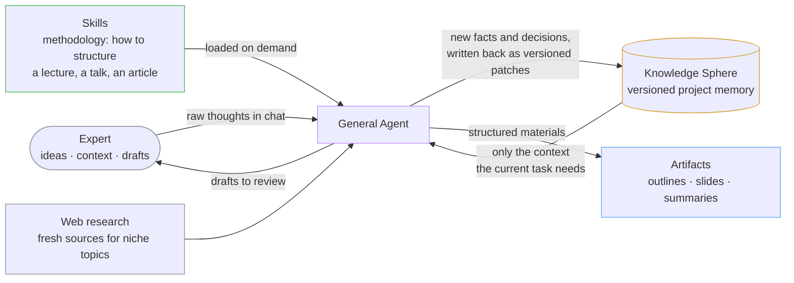
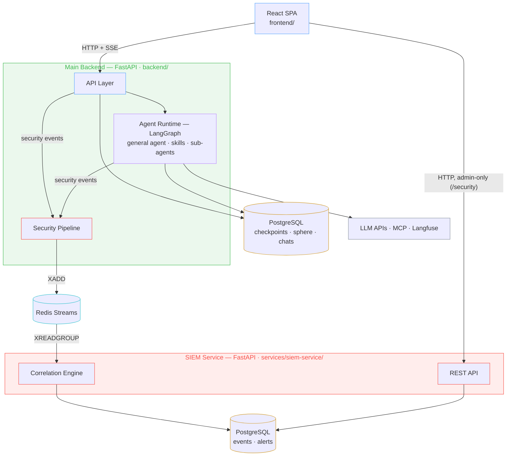

<picture>
  <source media="(prefers-color-scheme: dark)" srcset="doc/assets/readme/banner-dark.png">
  
</picture>

<p align="center">
  <a href="#what-is-learnflowai">About</a> ·
  <a href="#screenshots">Screenshots</a> ·
  <a href="#features">Features</a> ·
  <a href="#how-the-agent-works">Agent</a> ·
  <a href="#architecture">Architecture</a> ·
  <a href="#roadmap">Roadmap</a> ·
  <a href="#quick-start">Quick Start</a> ·
  <a href="#documentation">Docs</a>
</p>

## What is LearnFlowAI

Tech speakers, educators, and course authors all share the same routine: you have deep expertise and a head full of context, but turning it into a structured talk, article, or course eats hours. Generic LLM chats don't really help — context evaporates between sessions, every new chat starts from zero, and you spend the first ten minutes re-explaining what you already told the model last week.

LearnFlowAI is an open-source AI workspace built around a different core idea: **the project as a sphere of context**. You create a project (a talk, a course, an article series) and work inside it through chats. As you work, the agent accumulates a **Knowledge Sphere** — a versioned, structured memory of the project: decisions made, terminology agreed on, materials produced. The next session picks up exactly where you left off, and the agent loads only the context relevant to the current task instead of drowning in the full history.

On top of that memory sits a **general LangGraph agent with pluggable skills** — methodology knowledge contributed by humans (how to structure a lecture, how to build a narrative arc) that the agent loads on demand. The agent produces real artifacts: outlines, summaries, slide decks — not just chat replies.

## Screenshots

<p align="center">
  
  <br><em>Projects workspace</em>
</p>

<p align="center">
  
  <br><em>Agent writes to the Knowledge Sphere right from the chat — every write is a versioned, reviewable patch</em>
</p>

<p align="center">
  
  <br><em>Knowledge Sphere — versioned project memory with chronicle and version history</em>
</p>

## Features

- **Knowledge Sphere** — versioned project memory. Every agent write is a reviewed patch with a diff, a version bump, and one-click rollback. Progressive disclosure keeps the agent's context lean.
- **General agent + skills** — a single LangGraph agent extended through pluggable skills and tools instead of hardcoded pipelines. Sub-agents isolate heavy work with their own context.
- **Live agent activity** — the UI streams what the agent is actually doing over SSE: tool calls, sub-agent runs, sphere writes — a real-time activity feed, not a spinner.
- **Artifacts** — structured outputs (summaries, study plans, slide decks) live alongside chats inside the project, not buried in the transcript.
- **Security built in** — prompt-injection defense pipeline plus a dedicated SIEM service that consumes security events through Redis Streams, correlates them, and raises alerts.
- **Observability** — full Langfuse tracing with per-request cost accounting and prompt management (dev/prod prompt lifecycles).

## How the agent works

The product requirement behind the runtime is flexibility: preparing a talk, a course, and an article series are different workflows, and every expert brings their own. So instead of hardcoded pipelines there is **one general agent** (plain LangGraph ReAct loop, no LangChain wrappers) whose behavior is extended through configuration, not code:


```mermaid
graph LR
    EXPERT(["Expert<br/>ideas · context · drafts"])
    AGENT["General Agent"]
    SPHERE[("Knowledge Sphere<br/>versioned project memory")]
    SKILLS["Skills<br/>methodology: how to structure<br/>a lecture, a talk, an article"]
    WEB["Web research<br/>fresh sources for niche topics"]
    OUT["Artifacts<br/>outlines · slides · summaries"]

    EXPERT -->|"raw thoughts in chat"| AGENT
    AGENT -->|"drafts to review"| EXPERT
    SPHERE -->|"only the context<br/>the current task needs"| AGENT
    AGENT -->|"new facts and decisions,<br/>written back as versioned patches"| SPHERE
    SKILLS -->|"loaded on demand"| AGENT
    WEB --> AGENT
    AGENT -->|"structured materials"| OUT

    style AGENT stroke:#bc8cff
    style SPHERE stroke:#d29922
    style SKILLS stroke:#3fb950
    style OUT stroke:#58a6ff
    style WEB stroke:#8b949e
    style EXPERT stroke:#8b949e
```

The loop between the agent and the sphere is the core of the product: every session both *draws on* accumulated project memory and *grows* it — so the context never resets to zero.

- **Skills** — pluggable methodology packages ("how to structure a lecture", "how to write a tech article") loaded on demand. Human-authored knowledge, open for contribution — this is how the product stays specialized without freezing into one workflow.
- **Tools** — reading and patching the Knowledge Sphere, generating artifacts, web research via MCP, image generation.
- **Sub-agents** — heavy work (judging output quality, deep web research) runs in isolated contexts so the main agent's context stays lean.
- **Context engineering** — the agent starts with a minimal slice of project memory and drills deeper only when the task needs it; long threads are compacted automatically.
- **Guarded execution** — every tool result passes a security checkpoint before re-entering the loop; prompt-injection defenses are layered, not bolted on.
- **Persistence** — conversation state lives in PostgreSQL checkpoints: any thread resumes exactly where it stopped, which is the whole point of the product.

## Architecture


```mermaid
graph TD
    Frontend["React SPA<br/>frontend/"]

    subgraph Backend["Main Backend — FastAPI · backend/"]
        API["API Layer"]
        Runtime["Agent Runtime — LangGraph<br/>general agent · skills · sub-agents"]
        SecPipe["Security Pipeline"]
    end

    subgraph SIEM["SIEM Service — FastAPI · services/siem-service/"]
        SiemAPI["REST API"]
        Correlation["Correlation Engine"]
    end

    MainDB[("PostgreSQL<br/>checkpoints · sphere · chats")]
    SiemDB[("PostgreSQL<br/>events · alerts")]
    Redis[("Redis Streams")]
    External["LLM APIs · MCP · Langfuse"]

    Frontend -->|HTTP + SSE| API
    Frontend -->|"HTTP, admin-only (/security)"| SiemAPI
    API --> Runtime
    API --> MainDB
    Runtime --> MainDB
    Runtime --> External
    API -->|security events| SecPipe
    Runtime -->|security events| SecPipe
    SecPipe -->|XADD| Redis
    Redis -->|XREADGROUP| Correlation
    Correlation --> SiemDB
    SiemAPI --> SiemDB

    style Backend fill:#3fb9501a,stroke:#3fb950,color:#3fb950
    style SIEM fill:#f851491a,stroke:#f85149,color:#f85149
    style Frontend stroke:#58a6ff
    style API stroke:#58a6ff
    style Runtime stroke:#bc8cff
    style SecPipe stroke:#f85149
    style SiemAPI stroke:#f85149
    style Correlation stroke:#f85149
    style MainDB stroke:#d29922
    style SiemDB stroke:#d29922
    style Redis stroke:#39c5cf
    style External stroke:#8b949e
```

**Stack:** Python 3.12 · FastAPI · LangGraph (plain, no LangChain wrappers) · PostgreSQL · Redis · React + TypeScript (Feature-Sliced Design) · uv workspace monorepo · Langfuse.

The project is developed with **AIDD (AI-Driven Development)**: the architect defines contracts and architecture in `doc/`, and LLM agents implement against that documented context. The full decision trail lives in [ADRs](doc/tech/adr/) and iteration artifacts — the repository doubles as a working example of the methodology.

## Roadmap

The core product is built — agent runtime, Knowledge Sphere, artifacts, security, observability. What's ahead:

- **Now · dogfooding on real content.** An author's mini-course on defending LLM applications (lectures, slide decks, summaries) is being prepared entirely through the product. Exit criterion: the author relies on the product by habit instead of escaping to generic tools.
- **Next · first external users.** OAuth sign-in, cost-optimal model selection, affordable web search, per-user spending caps.
- **Then · educators channel.** Ready-made teaching materials (lecture notes, slides, practice tasks) built from expert context — for university teachers who have the expertise but not the time to package it.
- **Ongoing tracks.** Agent evaluation (LLM-as-judge + deterministic checks on real-case datasets), model portability (any OpenAI-compatible endpoint, including on-prem vLLM), Telegram bot as a second delivery channel.

The full picture with phases and exit conditions lives in [doc/product/roadmap.md](doc/product/roadmap.md).

## Quick Start

### Prerequisites

- Docker and Docker Compose v2
- For local dev: Python 3.12+, [uv](https://docs.astral.sh/uv/), Node.js 20+

### Docker (full stack)

```bash
git clone https://github.com/Bbar0n234/learnflow-ai.git
cd learnflow-ai

cp .env.example .env
# Edit .env — set your LLM API keys

make docker-build && make docker-up
# App available at http://localhost:8000
```

### Local dev (DB in Docker, app locally)

```bash
uv sync
cd frontend && npm install && cd ..

cp .env.local.example .env.local

make docker-up-db   # PostgreSQL + Redis
make dev            # backend at http://localhost:8000
make dev-fe         # frontend at http://localhost:5173
```

### Useful commands

| Command | Description |
|---------|-------------|
| `make check` / `make check-fe` | All backend / frontend checks (CI gate) |
| `make test` | Run pytest |
| `make migrate` | Apply DB migrations |
| `make docker-logs` | Tail app container logs |

The full command list is in the [Makefile](Makefile).

## Documentation

All project documentation lives in [`doc/`](doc/index.md) (in Russian):

- [idea.md](doc/idea.md) — problem, ICP, JTBD, product boundaries
- [vision.md](doc/vision.md) — system architecture and MVP criteria
- [doc/product/](doc/product/) — use cases, roadmap, versioned scope
- [doc/tech/](doc/tech/) — component docs, conventions, [ADRs](doc/tech/adr/)
- [doc/tasks/](doc/tasks/) — task lists and iteration artifacts

## License

[Apache 2.0](LICENSE)
