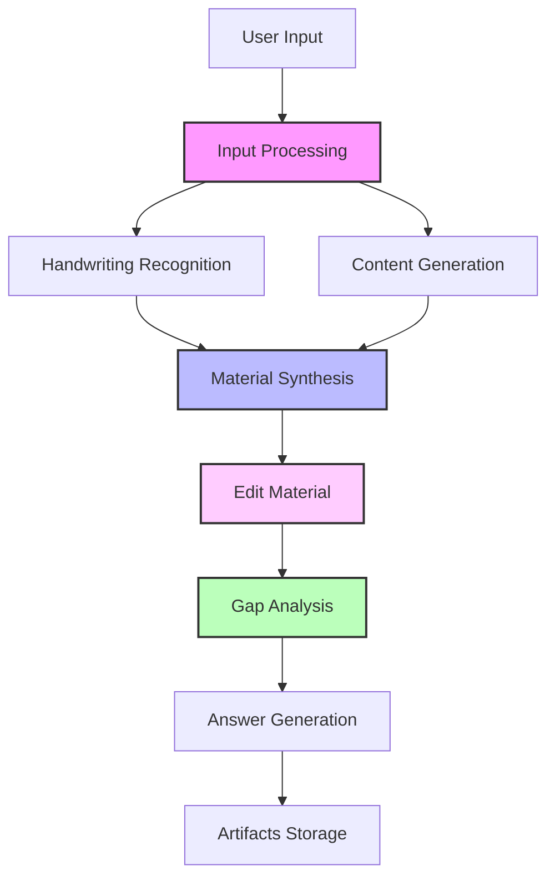

# LearnFlow AI

[](LICENSE)
[](https://www.python.org/downloads/)
[](https://github.com/langchain-ai/langgraph)
[](docker-compose.yml)

A universal, LangGraph-based educational content generation system for any subject area and education level. Transform educational questions and handwritten notes into comprehensive study materials with gap analysis questions and answers.


## 🎯 Why LearnFlow AI?

LearnFlow AI solves a universal educational problem: transforming scattered educational questions and handwritten notes into structured, comprehensive study materials - from mathematics and physics to literature and history, from elementary school to university level.

### Key Features

- **🔄 LangGraph Workflow Pipeline** - Multi-node processing with configurable HITL (Human-in-the-Loop) capabilities
- **✏️ Interactive Material Editing** - Iterative refinement of synthesized content with fuzzy text matching
- **🛡️ LLM Security** - Built-in Guardrails against prompt injection and jailbreak attacks
- **🤖 Universal LLM Support** - Works with any OpenAI-compatible API (including local models)
- **📝 OCR & Handwriting Recognition** - Process both typed and handwritten materials
- **🎨 Modern Web UI** - React-based interface with real-time updates
- **🤖 Telegram Bot** - Conversational interface for on-the-go access
- **🎯 Personalized Prompts** - Dynamic prompt generation with user-specific configurations
- **🐳 Docker-First** - One command deployment with `docker compose up`

## 👥 Who This Project Is For

### 🎓 Education and Learning
**Teachers, tutors, instructional designers** — automatic generation of educational materials, tests, and gap-analysis questions. The system processes both text queries and handwritten notes, creating personalized learning content.

### 👨‍💻 Developers and Architects
**AI-Driven Development** — practical example of delegating code writing to LLM agents while maintaining architectural control. The `docs/` directory contains all project documentation used for effective LLM collaboration.

**Production-ready architecture** based on LangGraph:
- Multi-node agent system with HITL (Human-in-the-Loop)
- Multimodal processing (text + images)
- Microservices: FastAPI, Telegram Bot, external integrations
- Observability via LangFuse
- Clean Architecture with clear separation of concerns

The project demonstrates modern approaches to building production-ready AI systems.

## 🚀 Quick Start

### Prerequisites

- Docker and Docker Compose
- Python 3.13+ (for local development)
- API keys for your chosen LLM provider

### Installation

1. **Clone the repository**
```bash
git clone https://github.com/bbaron/learnflow-ai.git
cd learnflow-ai
```

2. **Configure environment**
```bash
cp env.example .env
# Edit .env with your API keys and configuration
```

3. **Start with Docker Compose**
```bash
docker compose up
```

The services will be available at:
- FastAPI: http://localhost:8000
- Web UI: http://localhost:3000
- API Docs: http://localhost:8000/docs
- Prompt Config Service: http://localhost:8002
- Prompt Config API Docs: http://localhost:8002/docs

### Using Local LLMs

LearnFlow AI supports local LLM providers out of the box:

```bash
# With Ollama
OPENAI_API_BASE=http://localhost:11434/v1
OPENAI_API_KEY=ollama
MODEL_NAME=llama3

# With LM Studio
OPENAI_API_BASE=http://localhost:1234/v1
OPENAI_API_KEY=lm-studio
MODEL_NAME=local-model
```

## 🏗️ Architecture

<div align="center">
  
</div>

LearnFlow AI uses a modular, event-driven architecture built on LangGraph:



### Core Components

- **Workflow Engine** - LangGraph-based orchestration with state management
- **Node Architecture** - Modular processing nodes extending `BaseWorkflowNode`
- **Security Layer** - Guardrails for input validation and threat detection
- **Storage Layer** - Thread-based artifact management with GitHub integration
- **Prompt Configuration Service** - Dynamic personalized prompt generation with user preferences
- **Observability** - LangFuse integration for tracing and monitoring

## 🛡️ Security Features

LearnFlow AI includes comprehensive prompt injection protection:

- **Universal Input Validation** - LLM-based detection with structured output across all entry points
- **Graceful Degradation** - Security never blocks workflow execution, always maintains user experience
- **Fuzzy Content Cleaning** - Smart removal of malicious content while preserving legitimate educational material
- **Educational Context Aware** - Adapts to different subject areas and reduces false positives
- **Configuration-Driven** - Security prompts and settings managed through YAML configs
- **Complete Coverage** - Protects exam questions, OCR content, HITL feedback, and edit requests

## 📚 Documentation

- [Architecture Overview](docs/ADR/001-architecture-overview.md)
- [LLM Security](docs/ADR/002-llm-guardrails.md)
- [API Reference](http://localhost:8000/docs)
- [Development Guide](docs/conventions.md)
- [Roadmap](docs/planning/roadmap.md)


## 🧪 Development

### Local Setup

```bash
# Install dependencies with UV
uv sync

# Start development server
uv run --package learnflow python -m learnflow.main
```

## 📊 Metrics & Monitoring

LearnFlow AI includes comprehensive observability:

- **LangFuse** - Trace every LLM interaction
- **Structured Logging** - Correlation IDs for request tracking
- **Health Checks** - `/health` endpoint for monitoring
- **Performance Metrics** - Response times and token usage

## 🌍 Universal Educational Support

LearnFlow AI adapts to any educational context:

### Subject Areas
- **STEM**: Mathematics, Physics, Chemistry, Biology, Computer Science
- **Humanities**: Literature, History, Philosophy, Languages
- **Social Sciences**: Psychology, Economics, Political Science
- **Professional**: Law, Medicine, Engineering, Business

### Educational Levels
- **K-12**: Elementary through High School
- **Higher Education**: University and Graduate programs
- **Professional Development**: Certification and continuing education
- **Self-Learning**: Personal study and skill development

### Example Use Cases
- Transform calculus problems into step-by-step learning materials
- Convert historical essay questions into comprehensive study guides
- Synthesize chemistry lab notes with theoretical concepts
- Create literature analysis materials from book discussion questions

## 📝 License

This project is licensed under Apache 2.0 - see [LICENSE](LICENSE) for details.

## 🙏 Acknowledgments

Built with:
- [LangGraph](https://github.com/langchain-ai/langgraph) - Workflow orchestration
- [FastAPI](https://fastapi.tiangolo.com/) - API framework
- [React](https://react.dev/) - UI framework
- [LangFuse](https://langfuse.com/) - LLM observability

## 👨‍💻 Author

**Stanislav Feoktistov** - T-shaped GenAI Engineer

[](https://t.me/Bbar0n234)
[](https://github.com/Bbar0n234)
[](mailto:vilnus1337@gmail.com)

## 📧 Contact

- Issues: [GitHub Issues](https://github.com/Bbar0n234/learnflow-ai/issues)
- Discussions: [GitHub Discussions](https://github.com/Bbar0n234/learnflow-ai/discussions)

---

<p align="center">
  Made with ❤️ by Stanislav Feoktistov
</p>