# LearnFlow AI

**English | [Русский](README.md)**

[](LICENSE)
[](https://www.python.org/downloads/)
[](https://github.com/langchain-ai/langgraph)
[](docker-compose.yml)

A universal, LangGraph-based educational content generation system for any subject area and education level. Transform educational questions and handwritten notes into comprehensive study materials with analysis questions and answers.

## 🎯 Why LearnFlow AI?

LearnFlow AI solves a universal educational problem: transforming scattered educational questions and handwritten notes into structured, comprehensive study materials - from mathematics and physics to literature and history, from elementary school to university level.

### Key Features

#### For Users (Teachers, Tutors, Instructors, Students)
- **🎯 Exceptional Content Quality** - Advanced prompt engineering techniques with XML structuring and semantic keywords ensure depth and accuracy of generated materials
- **🔧 Universal Flexibility** - Adapts to any knowledge domain (from mathematics to literature), audience level (from school to university), material volume, and number of assessment questions
- **💬 Convenient Telegram Interface** - Full system functionality through familiar messenger with image support and interactive commands
- **✏️ Interactive Editing** - Iterative material improvement through dialogue with point corrections
- **📝 Handwritten Text Recognition** - Automatic processing of both printed and handwritten notes for creating personalized educational materials

#### For Developers and Architects
- **🔄 Production-ready LangGraph** - Reference implementation of multi-node workflow with HITL (Human-in-the-Loop) integration and multimodal processing
- **🤖 AI-Driven Development** - Practical example of delegating code writing to LLM agents while maintaining architectural control. All project documentation in `docs/` is used for effective LLM collaboration
- **🛡️ Built-in Security** - Protection against prompt injection and jailbreak attacks at the architecture level
- **🔐 Multi-tenancy Ready** - JWT authentication and data isolation for enterprise use
- **🎨 Modular Architecture** - Clean Architecture with clear layer separation, microservice structure (FastAPI, Telegram Bot, external integrations)
- **📊 Observability** - LangFuse integration for complete AI operations tracing and monitoring
- **🐳 Docker-first Approach** - Full containerization with orchestration via docker-compose

### 📚 Examples of Generated Materials

Explore how the system adapts one topic — **Qdrant vector database** — for different audience levels:

- 🟢 **[Beginner](_examples/beginner/)** — Intuitive explanation through analogies. From the semantic search problem to practical application.
- 🟡 **[Intermediate](_examples/intermediate/)** — Architectural understanding: how HNSW works, why exactly this way, performance optimizations.
- 🔴 **[Advanced](_examples/advanced/)** — Academic depth: formal definitions, proofs, mathematical apparatus.

Each set: notes → material → questions → answers. This adaptability makes LearnFlow AI universal for any educational context.

## 🚀 Quick Start

### Prerequisites

- Docker and Docker Compose
- Python 3.11+ (for local development)
- API keys for your chosen LLM provider (see [Quick Start Guide](docs/quick_start.md) for details on obtaining keys)

### Docker Deployment (Recommended)

1. **Clone the repository**
```bash
git clone https://github.com/Bbar0n234/learnflow-ai.git
cd learnflow-ai
```

2. **Configure environment**
```bash
cp env.example .env
# Edit .env with your API keys
```

3. **Start all services**
```bash
docker compose up -d
```

The services will be available at:
- FastAPI: http://localhost:8000
- Web UI: http://localhost:3001
- LangFuse: http://localhost:3000
- API Docs: http://localhost:8000/docs
- Artifacts Service: http://localhost:8001
- Prompt Config Service: http://localhost:8002

### Local Development

1. **Configure local environment**
```bash
cp .env.local.example .env.local
# Edit .env.local with your API keys
```

2. **Start all services with one command (recommended)**
```bash
make local-dev
```

This script automatically:
- Installs dependencies via `uv sync`
- Starts PostgreSQL in Docker
- Creates databases and runs migrations
- Starts all services with logging
- Checks health status of each service
- Handles Ctrl+C for graceful shutdown

**Additional commands:**
```bash
./local-reset.sh  # Full environment reset
```

For more details on environment setup, see [docs/overview.md](docs/overview.md)

### Using Local LLMs

LearnFlow AI supports local LLM providers out of the box:

```bash
# With Ollama
OPENAI_API_BASE=http://localhost:11434/v1
OPENAI_API_KEY=ollama
MODEL_NAME=llama3

# With LM Studio
OPENAI_API_BASE=http://localhost:1234/v1
OPENAI_API_KEY=lm-studio
MODEL_NAME=local-model
```

## 🏗️ Architecture

LearnFlow AI uses a modular, event-driven architecture built on LangGraph:

```mermaid
graph TD
    subgraph "Legend"
        L1[🛡️ Security Guard - injection protection]
        L2[👤 Human-in-the-Loop - interactivity]
    end
    
    A[🛡️ Input Processing] --> B[Content Generation]
    A --> C[🛡️ Handwriting Recognition]
    C --> D[Material Synthesis]
    B --> D
    D --> E[👤🛡️ Material Editing]
    E --> F[👤🛡️ Question Generation]
    F --> G[Answer Generation]
    G --> H[Artifacts Storage]
    
    style A fill:#ffe6e6,stroke:#ff4444,stroke-width:2px
    style C fill:#ffe6e6,stroke:#ff4444,stroke-width:2px
    style E fill:#e6f3ff,stroke:#0066cc,stroke-width:2px
    style F fill:#e6f3ff,stroke:#0066cc,stroke-width:2px
```



#### How Security Guard Works

```mermaid
graph LR
    Input[User Input] --> Guard[🛡️ Security Guard]
    Guard --> Check{Injection Check}
    Check -->|Safe| Process[Processing]
    Check -->|Threat Detected| Clean[Content Cleanup]
    Clean --> Process
    
    style Guard fill:#ffe6e6
    style Check fill:#fff5f5
```



#### How Human-in-the-Loop (HITL) Works

```mermaid
graph LR
    Node[👤 HITL Node] --> Generate[Generate Result]
    Generate --> Review{User<br/>Reviews}
    Review -->|Approved| Next[Next Node]
    Review -->|Needs Edits| Edit[Edit]
    Edit --> Generate
    
    style Node fill:#e6f3ff
    style Review fill:#f0f8ff
```



### Core Components

- **Workflow Engine** - LangGraph-based orchestration with state management
- **Node Architecture** - Modular processing nodes extending `BaseWorkflowNode`
- **Security Layer** - Guardrails for input validation and threat detection
- **Storage Layer** - Thread-based artifact management with GitHub integration
- **Prompt Configuration Service** - Dynamic personalized prompt generation with user preferences
- **Observability** - LangFuse integration for tracing and monitoring

## 🛡️ Security Features

LearnFlow AI includes comprehensive prompt injection protection:

- **Universal Input Validation** - LLM-based detection with structured output across all entry points
- **Graceful Degradation** - Security never blocks workflow execution, always maintains user experience
- **Fuzzy Content Cleaning** - Smart removal of malicious content while preserving legitimate educational material
- **Educational Context Aware** - Adapts to different subject areas and reduces false positives
- **Configuration-Driven** - Security prompts and settings managed through YAML configs
- **Complete Coverage** - Protects exam questions, OCR content, HITL feedback, and edit requests

## 📚 Documentation

### For Users
- [System Overview](docs/overview.md) - Detailed description of features and architecture
- [Business Model](docs/business_model.md) - Monetization and development strategy

### For Developers
- [Architecture Overview](docs/ADR/001-architecture-overview.md) - Key architectural decisions
- [LLM Security](docs/ADR/002-llm-guardrails.md) - Protection against prompt injection
- [C4 Container Diagram](docs/architecture/c4-container-diagram.md) - System architecture
- [Non-Functional Requirements](docs/architecture/NFR.md) - Performance and limitations
- [Development Guide](docs/conventions.md) - Coding standards and processes
- [Roadmap](docs/planning/roadmap.md) - Development plans

## 📊 Metrics & Monitoring

LearnFlow AI includes comprehensive observability:

- **LangFuse** - Trace every LLM interaction
- **Structured Logging** - Correlation IDs for request tracking
- **Health Checks** - `/health` endpoint for monitoring
- **Performance Metrics** - Response times and token usage

## 🌍 Universal Educational Support

LearnFlow AI adapts to any educational context:

### Subject Areas
- **STEM**: Mathematics, Physics, Chemistry, Biology, Computer Science
- **Humanities**: Literature, History, Philosophy, Languages
- **Social Sciences**: Psychology, Economics, Political Science
- **Professional**: Law, Medicine, Engineering, Business

### Educational Levels
- **K-12**: Elementary through High School
- **Higher Education**: University and Graduate programs
- **Professional Development**: Certification and continuing education
- **Self-Learning**: Personal study and skill development

### Example Use Cases
- Transform calculus problems into step-by-step learning materials
- Convert historical essay questions into comprehensive study guides
- Synthesize chemistry lab notes with theoretical concepts
- Create literature analysis materials from book discussion questions

## 📝 License

This project is licensed under Apache 2.0 - see [LICENSE](LICENSE) for details.

## 🙏 Acknowledgments

Built with:
- [LangGraph](https://github.com/langchain-ai/langgraph) - Workflow orchestration
- [FastAPI](https://fastapi.tiangolo.com/) - API framework
- [React](https://react.dev/) - UI framework
- [LangFuse](https://langfuse.com/) - LLM observability

## 👨‍💻 Author

**Stanislav Feoktistov** - T-shaped GenAI Engineer

[](https://t.me/Bbar0n234)
[](https://github.com/Bbar0n234)
[](mailto:vilnus1337@gmail.com)

## 📧 Contact

- Issues: [GitHub Issues](https://github.com/Bbar0n234/learnflow-ai/issues)
- Discussions: [GitHub Discussions](https://github.com/Bbar0n234/learnflow-ai/discussions)

---

<p align="center">
  Made with ❤️ by Stanislav Feoktistov
</p>