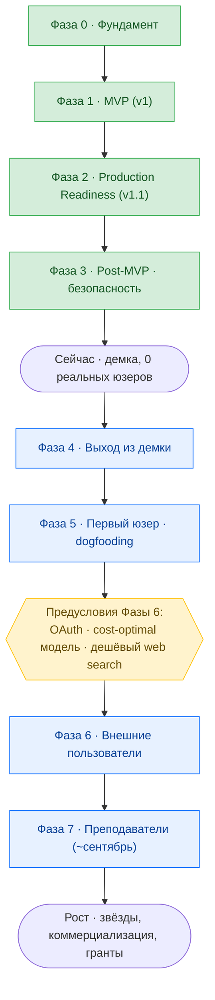
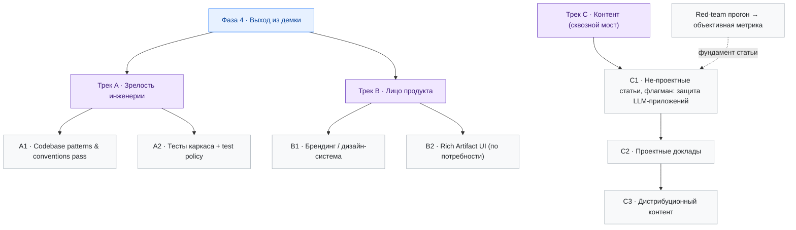

# Roadmap

Продуктово-стратегическая карта проекта: что сделано, что впереди и в каком порядке.

**Как читать.** Roadmap оперирует двумя понятиями:

- **Фаза** — последовательный этап проекта. Фазы 0–3 пройдены, 4–7 впереди; у каждой будущей фазы есть цель и условие завершения. Фазы нумеруются сквозно — это единая линия времени. «Рост» в конце — не фаза, а постоянный режим.
- **Трек** — направление работ. Бывает *внутри фазы* (Фаза 4 идёт двумя треками — инженерия и продукт) и *сквозным* (треки идут поверх фаз, без привязки к одной — контент, maintenance и др.).

Фазы — это эпики: детали задач живут в [backlog.md](../backlog.md) и не дублируются здесь; технический уровень (итерации) — в [tasks/](../tasks/). Связь уровней — [workflow.md](../workflow.md).

**Горизонт.** Выход из демо-стадии к реальному использованию: первый пользователь (я) → внешние пользователи → вузовский канал → рост.

## Общая картина

## Легенда статусов

📋 Planned · 🚧 In Progress · ✅ Done · ⏸️ Paused · ❌ Cancelled

## Сделано

История проекта по фазам — реконструирована из [tasks/](../tasks/).

### Фаза 0 — Фундамент ✅

Monorepo (uv workspace), Docker, окружение, code quality tooling (ruff / mypy / eslint / prettier), Makefile + dev workflow.
→ [tasklist-infra](../tasks/tasklist-infra.md)

### Фаза 1 — MVP · v1 ✅

Рабочее ядро продукта:

- **Backend Core** — app skeleton, конфигурация, ORM-модели + Alembic-миграции, repository / service / API слои, SSE-каркас.
- **Agent Runtime** — LangGraph-граф (ReAct loop, AgentRunner, streaming), Knowledge Sphere, skills + artifacts, MCP-инструменты (Firecrawl), context engineering.
- **Frontend** — chat-first SPA, sidebar + проекты, chat UI, SSE-стриминг, sphere + artifacts.
- **Integration** — замена стабов реальными реализациями, SSE E2E, Docker full stack, E2E-сценарии.

→ [tasklist-backend-core](../tasks/tasklist-backend-core.md), [tasklist-agent](../tasks/tasklist-agent.md), [tasklist-frontend](../tasks/tasklist-frontend.md), [tasklist-integration](../tasks/tasklist-integration.md)

### Фаза 2 — Production Readiness · v1.1 ✅

- Аутентификация (JWT + refresh tokens, замена `X-User-Name`).
- Structured logging (backend structlog + frontend logger + Docker log rotation).
- Langfuse (tracing, cost tracking, user feedback).
- CI/CD (GitHub Actions) + автодеплой.

→ [tasklist-production](../tasks/tasklist-production.md)

### Фаза 3 — Post-MVP · безопасность и стабилизация ✅

- Agent observability & tooling, runtime agent configuration.
- Многослойная защита агента: prompt injection protection → Security Event Pipeline (SIEM Core: сбор, корреляция, алертинг, monitoring UI) → Security 2.0 (Universal I/O Guard + Boundary Enforcement).
- Promptfoo Red Team Scan — baseline-прогон (инструмент + первый поверхностный прогон).

Остаются точечные planned-итерации (Chat UX polish, SIEM Extensions) — это уже не отдельная фаза, а обычный триаж backlog.
→ [tasklist-post-mvp](../tasks/tasklist-post-mvp.md)

## Сейчас

Проект на демо-стадии: всё работает, развёрнуто — но **ни одного реального пользователя**. Дальше — выход из демки и переход к реальному использованию.

## План

### Фаза 4 — Выход из демки 📋

**Цель.** Проект перестаёт быть демкой — о нём не стыдно рассказывать и его не стыдно показать.

**Условие завершения.**

- Codebase Pass завершён: кодовая база консистентна, конвенции зафиксированы в [conventions.md](../tech/conventions.md).
- Базовый каркас приложения покрыт автоматическими тестами.
- Брендинг готов — у продукта есть визуальное лицо.

Фаза набирается двумя треками, идущими параллельно (Трек A и Трек B). Сквозной Трек C (контент) стартует здесь же.

**Трек A — Зрелость инженерии.** Поднять кодовую базу с демо-уровня до уровня, о котором можно честно говорить.

- **A1 · Codebase patterns & conventions pass.** Проход по кодовой базе (backend / agent runtime / frontend): выявление неконсистентностей, приведение к единым паттернам, закрытие техдолга. Включает погружение архитектора в код — это **единая работа**, не отдельный трек: апрувить конвенции и тесты без понимания кода нельзя. Срез по Парето, без многонедельного чтения. Конвенции и инварианты фиксируются в `conventions.md` *по ходу* итерации. → backlog: «Codebase-wide patterns & conventions pass»
- **A2 · Тесты каркаса.** Автоматические тесты на базовый каркас приложения, чтобы не перепроверять всю систему руками при каждом изменении. Test policy (как и зачем пишем) вырабатывается *по ходу*. Тесно связан с A1 — понимание кода рождает и конвенции, и тесты, — но отдельная итерация. → backlog (заводится при триаже)

Защита LLM не входит в Трек A: в проекте это артефакт исследования, не продуктовая потребность. Фундаментальный red-team прогон ради объективной метрики переехал в Трек C (зависимость флагманской статьи), а в проде LLM-защита гасится флагом — backlog «Kill-switch LLM-защиты».

**Трек B — Лицо продукта.** Дать продукту визуальную идентичность и выразительный UI.

- **B1 · Брендинг / дизайн-система.** Уход от generic-стилей: дизайн, инфографика, ассеты, баннеры, визуальная идентичность. → backlog P2 «Design system»
- **B2 · Rich Artifact UI.** Специализированное представление разных типов материалов — например, аудио, графиков и презентаций. Развивается по реальным потребностям и не входит в жёсткое условие завершения Фазы 4. → backlog P3 «Rich Artifact UI»

**Generative UI** — отдельная более дальняя идея: агент сам выбирает или компонует интерфейс. Для текущего сценария подготовки материалов подтверждённой ценности нет; вернуться к ней имеет смысл при развитии продукта в платформу для студентов с адаптивными учебными интерфейсами. → backlog P3 «Generative UI» (+ research-репорт)

### Фаза 5 — Первый реальный пользователь · dogfooding 📋

**Цель.** Я — пользователь №1: готовлю свой технический контент через систему. Разблокирует проектные доклады — рассказывать про сам проект можно только после выхода из демки.

Скиллы всплывают по реальным потребностям: часть → обязательный bundle для всех пользователей, часть — project-specific или внешние. Генерация слайдов всплывает здесь как скилл / MCP. Конкретные скиллы заводятся в backlog по мере появления.

### Фаза 6 — Внешние пользователи 📋

**Цель.** Первые пользователи извне — через каналы дистрибуции и медиа.

**Предусловия — до открытия на массу:**

- **OAuth** (Google / GitHub) — требование заводить отдельный пароль убивает конверсию. → backlog P1
- **Cost-optimal модель** — оптимум качество/стоимость для массового использования; фронтир-модели не масштабируются по токенам. → backlog P1
- **Дешёвый или self-hosted web search MCP** — Firecrawl free tier не выдержит нагрузку. → backlog P2

**Кандидат фазы.** Telegram-бот как второй канал доставки: диалог с агентом и потребление материалов полноценно (Rich Markdown + LaTeX, нативный стриминг, топики как сессии), продвинутые возможности остаются в вебе. Не предусловие — направление внутри фазы. → backlog P2, ресерч: [research/telegram-bot-platform.md](../research/telegram-bot-platform.md)

### Фаза 7 — Преподаватели / вузовский канал 📋 (~сентябрь)

**Цель.** Преподаватели как канал: контент-заготовки (лекции, конспекты, практики) под реальную боль — нет времени превращать материал в конспекты. Конкретные вузы и люди — не здесь (приватно, вне репозитория).

### Рост 📋

Постоянный режим, а не фаза с условием завершения: звёзды на GitHub, возможная коммерциализация и сопровождение, opensource-гранты за вклад в учебную деятельность.

## Сквозные треки

Идут вне фаз — без условия завершения, это режимы, а не этапы.

- **Трек C — Контент (мост).** Не привязан к одной фазе. C1 — не-проектные тех-статьи (флагман — статья о многослойной защите LLM-приложений; зависит от фундаментального red-team прогона — backlog «Fundamental red-team eval»; фундамент — [security/](../security/)). C2 — проектные доклады (открываются на Фазе 5). C3 — дистрибуционный контент (с Фазы 6). Черновики — [content/](../content/).
- **Maintenance.** Регулярный разбор мелких багов и улучшений из backlog — ориентир 2–3 пункта в неделю. Не требует выделенной фазы.
- **Meta / Agent Harness.** Развитие dev-workflow: doc feedback loop, AIDD skill, async/cloud-агенты, arch-checker. Async/cloud-агенты уже в работе; полная формализация трека — позже. См. секции Meta и Agent Harness в [backlog.md](../backlog.md).
- **Context engineering optimization.** Оптимизация наполненного агента (работа с контекстом, токены). Включается, когда агент реально нагружен реальным использованием.
