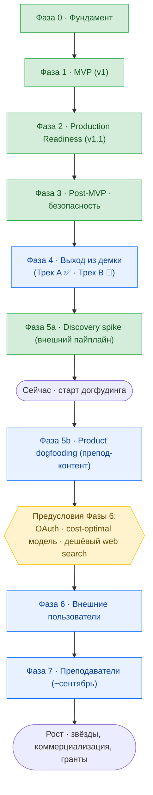
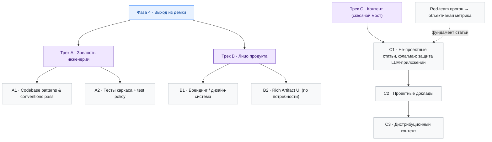

# Roadmap

Продуктово-стратегическая карта проекта: что сделано, что впереди и в каком порядке.

**Как читать.** Roadmap оперирует двумя понятиями:

- **Фаза** — последовательный этап проекта. Фазы 0–3 пройдены, 4–7 впереди; у каждой будущей фазы есть цель и условие завершения. Фазы нумеруются сквозно — это единая линия времени. «Рост» в конце — не фаза, а постоянный режим.
- **Трек** — направление работ. Бывает *внутри фазы* (Фаза 4 идёт двумя треками — инженерия и продукт) и *сквозным* (треки идут поверх фаз, без привязки к одной — контент, maintenance и др.).

Фазы — это эпики: детали задач живут в [backlog.md](../backlog.md) и не дублируются здесь; технический уровень (итерации) — в [tasks/](../tasks/). Связь уровней — [workflow.md](../workflow.md).

**Горизонт.** Выход из демо-стадии к реальному использованию: первый пользователь (я) → внешние пользователи → вузовский канал → рост.

## Общая картина

## Легенда статусов

📋 Planned · 🚧 In Progress · ✅ Done · ⏸️ Paused · ❌ Cancelled

## Сделано

История проекта по фазам — реконструирована из [tasks/](../tasks/).

### Фаза 0 — Фундамент ✅

Monorepo (uv workspace), Docker, окружение, code quality tooling (ruff / mypy / eslint / prettier), Makefile + dev workflow.
→ [tasklist-infra](../tasks/tasklist-infra.md)

### Фаза 1 — MVP · v1 ✅

Рабочее ядро продукта:

- **Backend Core** — app skeleton, конфигурация, ORM-модели + Alembic-миграции, repository / service / API слои, SSE-каркас.
- **Agent Runtime** — LangGraph-граф (ReAct loop, AgentRunner, streaming), Knowledge Sphere, skills + artifacts, MCP-инструменты (Jina), context engineering.
- **Frontend** — chat-first SPA, sidebar + проекты, chat UI, SSE-стриминг, sphere + artifacts.
- **Integration** — замена стабов реальными реализациями, SSE E2E, Docker full stack, E2E-сценарии.

→ [tasklist-backend-core](../tasks/tasklist-backend-core.md), [tasklist-agent](../tasks/tasklist-agent.md), [tasklist-frontend](../tasks/tasklist-frontend.md), [tasklist-integration](../tasks/tasklist-integration.md)

### Фаза 2 — Production Readiness · v1.1 ✅

- Аутентификация (JWT + refresh tokens, замена `X-User-Name`).
- Structured logging (backend structlog + frontend logger + Docker log rotation).
- Langfuse (tracing, cost tracking, user feedback).
- CI/CD (GitHub Actions) + автодеплой.

→ [tasklist-production](../tasks/tasklist-production.md)

### Фаза 3 — Post-MVP · безопасность и стабилизация ✅

- Agent observability & tooling, runtime agent configuration.
- Многослойная защита агента: prompt injection protection → Security Event Pipeline (SIEM Core: сбор, корреляция, алертинг, monitoring UI) → Security 2.0 (Universal I/O Guard + Boundary Enforcement).
- Promptfoo Red Team Scan — baseline-прогон (инструмент + первый поверхностный прогон).

Остаются точечные planned-итерации (Chat UX polish, SIEM Extensions) — это уже не отдельная фаза, а обычный триаж backlog.
→ [tasklist-post-mvp](../tasks/tasklist-post-mvp.md)

## Сейчас

Инженерный трек Фазы 4 (Трек A) и discovery-спайк Фазы 5a завершены; активы спайка перенесены в продукт (многофайловые скиллы, генерация изображений, субагенты, skill-context). Закрытие версии (chore-001) на финале — merge `develop` → `main` и деплой ближайшим шагом. Показ преподавателям сдвинут влево: ~середина августа вместо ~сентября (полная занятость на проекте в августе). План итераций до показа — [tasklist-dogfooding](../tasks/tasklist-dogfooding.md).

## План

### Фаза 4 — Выход из демки 📋

**Цель.** Проект перестаёт быть демкой — о нём не стыдно рассказывать и его не стыдно показать.

**Условие завершения.**

- Codebase Pass завершён: кодовая база консистентна, конвенции зафиксированы в [conventions.md](../tech/conventions.md).
- Базовый каркас приложения покрыт автоматическими тестами.
- Брендинг готов — у продукта есть визуальное лицо.

Фаза набирается двумя треками, идущими параллельно (Трек A и Трек B). Сквозной Трек C (контент) стартует здесь же.

**Гейт публичного показа.** Брендинг (B1) — это гейт «публичный показ проекта»: его пересекают проектные доклады (C2) и внешние пользователи (Фаза 6), но **не** discovery-спайк Фазы 5a (не-проектный контент C1). Поэтому брендинг идёт параллельно спайку и его не блокирует. Трек A (зрелость инженерии) — завершён.

**Трек A — Зрелость инженерии.** Поднять кодовую базу с демо-уровня до уровня, о котором можно честно говорить.

- **A1 · Codebase patterns & conventions pass.** Проход по кодовой базе (backend / agent runtime / frontend): выявление неконсистентностей, приведение к единым паттернам, закрытие техдолга. Включает погружение архитектора в код — это **единая работа**, не отдельный трек: апрувить конвенции и тесты без понимания кода нельзя. Срез по Парето, без многонедельного чтения. Конвенции и инварианты фиксируются в `conventions.md` *по ходу* итерации. → backlog: «Codebase-wide patterns & conventions pass»
- **A2 · Тесты каркаса.** Автоматические тесты на базовый каркас приложения, чтобы не перепроверять всю систему руками при каждом изменении. Test policy (как и зачем пишем) вырабатывается *по ходу*. Тесно связан с A1 — понимание кода рождает и конвенции, и тесты, — но отдельная итерация. → backlog (заводится при триаже)

Защита LLM не входит в Трек A: в проекте это артефакт исследования, не продуктовая потребность. Фундаментальный red-team прогон ради объективной метрики переехал в Трек C (зависимость флагманской статьи), а в проде LLM-защита гасится флагом — backlog «Kill-switch LLM-защиты».

**Трек B — Лицо продукта.** Дать продукту визуальную идентичность и выразительный UI.

- **B1 · Брендинг / дизайн-система.** Уход от generic-стилей: дизайн, инфографика, ассеты, баннеры, визуальная идентичность. → backlog P2 «Design system»
- **B2 · Rich Artifact UI.** Специализированное представление разных типов материалов — например, аудио, графиков и презентаций. Развивается по реальным потребностям и не входит в жёсткое условие завершения Фазы 4. → backlog P3 «Rich Artifact UI»

**Generative UI** — отдельная более дальняя идея: агент сам выбирает или компонует интерфейс. Для текущего сценария подготовки материалов подтверждённой ценности нет; вернуться к ней имеет смысл при развитии продукта в платформу для студентов с адаптивными учебными интерфейсами. → backlog P3 «Generative UI» (+ research-репорт)

### Фаза 5 — Первый реальный пользователь · dogfooding 📋

**Определяется исходом, а не запуском.** В начале фазы я — пользователь №1 в смысле «впервые сажусь готовить реальный контент через LearnFlow AI», и продукт сырой — это начало гринда, а не достижение. Фаза **закрыта**, когда я — пользователь №1, который реально *полагается* на продукт: готовлю контент через него по привычке, и это не больно. Рабочая метрика — «перестал убегать из продукта в Claude Code».

Фаза разбивается на два под-этапа: 5a — разведка на внешнем пайплайне (добываю требования), 5b — честный догфудинг через продукт.

#### Фаза 5a — Discovery spike (внешний пайплайн) ✅

Завершена: первый контент (техстатья) подготовлен на голом Claude Code (Opus) мимо продукта, требования добыты и оттриажены, извлечённые активы перенесены в продукт итерациями post-mvp feat-009…feat-012 (многофайловые скиллы + `tech-article-writing`, генерация изображений, субагенты judge/web-research, skill-scoped user context). Паттерн ввода инструментов зафиксирован в [ADR-026](../tech/adr/ADR-026-tool-introduction-pattern.md).

Спайк также вскрыл разрыв исходного плана 5b: догфудинг «пишу статьи через продукт» валидирует не тот JTBD, который продаётся преподавателям (Фаза 7), и требует фронтир-качества, экономически недоступного по API. Фаза 5b переопределена под преподавательский контент.

#### Фаза 5b — Product dogfooding (преподавательский контент)

**Содержание догфудинга — авторский мини-курс «Защита LLM-приложений»** (лекции, презентации, конспекты, практики), а не статьи. Сырьё — собственные материалы проекта: `doc/security/` (threat model, архитектура защиты), security-ADR, red-team отчёты Promptfoo. Первый получатель — реальный преподаватель со сформулированной потребностью (детали приватно, `doc/strategy.local.md`). Это одновременно нулевой пилот Фазы 7: материал преподавательского формата, сделанный через продукт, для реального использования в вузе.

Почему курс, а не статьи: (1) валидируется ровно тот пайплайн, что нужен Фазе 7; (2) планка качества совместима с cost-efficient моделями — заодно валидируется предусловие Фазы 6 «cost-optimal модель»; (3) работа не в стол гарантирована структурой — у каждого материала ≥2 применения. Полка побочных выходов курса (не планируются, срабатывают оппортунистически): фундамент флагманской статьи C1 о защите LLM (курс, в отличие от статьи, не блокирован red-team прогоном), SOFA Blueprint «многослойная защита LLM», конференц-доклад, грантовая доказательная база (грант — следствие Фазы 7, база производится реальным использованием), референс-кейс для показа любым преподавателям, фундамент диплома. Хабр-статьи остаются треком C и перестают быть содержанием догфудинга.

Механика прежняя: догфудинг идёт **100% через дев-сервер** — не локально, не через Claude Code. Предусловие старта: выкатить накопленный `develop` в `main` и на сервер, иначе брендинг и реальные косяки не вылезут. Побег в Claude Code = логируемое требование (пометка `[dogfood]` в backlog); если большинство работы остаётся в Claude Code — затея провалена. Рабочая метрика закрытия фазы прежняя — «перестал убегать из продукта».

Скиллы всплывают по реальным потребностям: личный стиль/воркфлоу кристаллизуется в скиллы, часть → обязательный bundle, часть — project-specific или внешние. План итераций фазы — [tasklist-dogfooding](../tasks/tasklist-dogfooding.md): инструменты догфудинга (PDF-экспорт, слайды, модели) на фундаменте execution runtime (изолированное исполнение кода, файловый workspace, вложения пользователя), ГОСТ-скилл (первый bundle-скилл со студенческим оффером), OAuth; кастомные скиллы, web search, voice — за гейтом показа.

#### Доклады и гейт публичного показа

Контент-темы делятся гейтом «публичный показ проекта» (= брендинг, Трек B1) — полный реестр в [content/talks.md](../content/talks.md):

- **C1 — не-проектные, гейта нет, публикуются сейчас.** Работа не в стол: SOFA (опыт early adopter; скоропортится — статус и лидерборд обесцениваются, делать раньше), GOST-скилл (мелкий, без зависимостей — разогрев пайплайна), Security (флагман; блокирован фундаментальным red-team прогоном — backlog; фундамент нарабатывается мини-курсом Фазы 5b).
- **C2 — проектные, за гейтом.** Раскрывают проект публично → публикуются только после брендинга. *Готовить* их через продукт можно раньше (это и есть 5b), публиковать — после. Серия: видение системы, «зачем инженеру пет-проект», AIDD-оркестратор / процесс разработки, доклады по фичам (генеративный UI и т.п.) в maintenance-режиме.

### Фаза 6 — Внешние пользователи 📋

**Цель.** Первые пользователи извне — через каналы дистрибуции и медиа.

**Предусловия — до открытия на массу:**

- **OAuth** (Google / GitHub) — требование заводить отдельный пароль убивает конверсию.
- **Cost-optimal модель** — оптимум качество/стоимость для массового использования; фронтир-модели не масштабируются по токенам.
- **Дешёвый или self-hosted web search MCP** — текущий hosted-провайдер (Jina) экономичен на нынешнем масштабе, но при кратном росте нагрузки потребует пересмотра экономики или перехода на self-hosted (SearXNG + Crawl4AI).
- **Потолок затрат на пользователя** — без per-user budget любой аккаунт неограниченно жжёт LLM-бюджет владельца. → backlog § Backend

Предусловия закрываются раньше открытия фазы: OAuth — плановая итерация [tasklist-dogfooding](../tasks/tasklist-dogfooding.md) (до показа), web search — за гейтом показа, cost-optimal модель подобрана (dogfooding feat-003) и валидируется догфудингом 5b, потолок затрат — гейт первой же внешней волны.

**Ранний канал фазы — студенческая волна через ГОСТ-скилл.** Сразу после показа преподавателям: оффер «отчёт по ГОСТ 7.32» одногруппникам (~30 чел), затем Хабр-статья про скилл (C1) с CTA в продукт. Гипотеза и волновая модель — backlog § Product / Distribution; скилл — tasklist-dogfooding feat-012.

**Кандидат фазы.** Telegram-бот как второй канал доставки: диалог с агентом и потребление материалов полноценно (Rich Markdown + LaTeX, нативный стриминг, топики как сессии), продвинутые возможности остаются в вебе. Не предусловие — направление внутри фазы. → backlog P2, ресерч: [research/telegram-bot-platform.md](../research/telegram-bot-platform.md)

### Фаза 7 — Преподаватели / вузовский канал 📋 (~сентябрь)

**Цель.** Преподаватели как канал: контент-заготовки (лекции, конспекты, практики) под реальную боль — нет времени превращать материал в конспекты. Нулевой пилот подготавливается в Фазе 5b: мини-курс для реального преподавателя, сделанный через продукт, работает на показе как референс-кейс. Конкретные вузы и люди — не здесь (приватно, вне репозитория).

### Рост 📋

Постоянный режим, а не фаза с условием завершения: звёзды на GitHub, возможная коммерциализация и сопровождение, opensource-гранты за вклад в учебную деятельность.

> **Тактика продвижения — приватно.** Грантовая логика, механика внедрения преподавателям, конкретные вузы и люди, обрамление метрик живут в локальном `doc/strategy.local.md` (в `.gitignore`, не коммитится). Здесь — только инженерно-продуктовые треки. Зависимость, зафиксированная там: грант — следствие Фазы 7 (доказательная база производится реальным использованием), не отдельный ранний трек.

## Сквозные треки

Идут вне фаз — без условия завершения, это режимы, а не этапы.

- **Трек C — Контент (мост).** Не привязан к одной фазе. C1 — не-проектные тех-статьи (флагман — статья о многослойной защите LLM-приложений; зависит от фундаментального red-team прогона — backlog «Fundamental red-team eval»; фундамент — [security/](../security/)). C2 — проектные доклады (готовятся через продукт на Фазе 5b, публикуются после брендинга — гейт публичного показа). C3 — дистрибуционный контент (с Фазы 6). Реестр тем — [content/talks.md](../content/talks.md); черновики — [content/](../content/).
- **Design-branding.** Визуальная идентичность продукта: брендовый язык, иллюстрации, прозрачные ассеты, бренд-кит, оформление репозитория/платформ. Идёт параллельно фазам. PoC завершён (идентичность, пак иллюстраций, dark-адаптация, подход к cutout); далее — массовое вырезание фона, SVG, доводка+интеграция, бренд-кит. См. [tasklist-design-branding.md](../tasks/tasklist-design-branding.md).
- **Maintenance.** Регулярный разбор мелких багов и улучшений из backlog — ориентир 2–3 пункта в неделю. Не требует выделенной фазы.
- **Meta / Agent Harness.** Развитие dev-workflow: doc feedback loop, AIDD skill, async/cloud-агенты, arch-checker. Async/cloud-агенты уже в работе; полная формализация трека — позже. См. секции Meta и Agent Harness в [backlog.md](../backlog.md).
- **Context engineering optimization.** Оптимизация наполненного агента (работа с контекстом, токены). Включается, когда агент реально нагружен реальным использованием.
- **Evaluation.** Спроектированная система оценки качества агента: LLM-as-judge + детерминированные проверки на размеченных датасетах. Метрики отражают, насколько хорошо система решает задачу с конкретной моделью и конкретными промптами. Включается **после Фазы 5** (догфудинг) — хороший датасет берётся из реальных кейсов, раньше намеряет шум. Тройная отдача: воспроизводимые per-model метрики (Frontier / open-source / российские модели), самостоятельный доклад про eval, и self-insight для выбора модели. Технический дизайн — позже; здесь фиксируется верхнеуровнево.
- **Model portability.** Развязка от конкретного провайдера inference: смена base URL OpenAI-совместимого API (on-prem — vLLM; GigaChat / YandexGPT — тонкий адаптер при необходимости). Сам свап тривиален и едет поверх Evaluation — без per-model метрик выбор модели слепой. Обслуживает три цели: cost-optimal для массы (предусловие Фазы 6), отечественный / on-prem inference для вуза (Фаза 7, compliance), демо на open-source модели как аргумент «нет вендор-лока».
