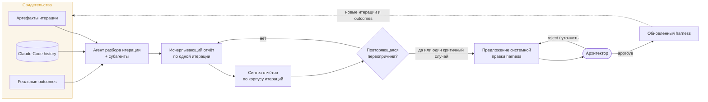

# Meta Harness для AIDD

Исследовательская рамка для будущего пересмотра AIDD harness в LearnFlowAI. Документ
фиксирует, какие свидетельства накапливать и как по ним искать системные недостатки
оркестратора. Это не спецификация реализации: формат отчётов, автоматизация анализа и
инструментарий будут спроектированы отдельно, когда накопится опыт реальной разработки и
эксплуатации.

## Зачем нужен Meta Harness

Текущий AIDD harness автоматизирует планирование, реализацию, независимое написание и ревью
тестов, верификацию, code review и актуализацию документации. Его устройство зафиксировано в
[AIDD Orchestrator](../../.claude/skills/aidd-orchestrator/SKILL.md), а периодический разбор
качества обвязки уже предусмотрен [ретро-контуром](../tech/conventions/review.md#ретро-контур).

Этого достаточно для автономного выполнения итераций, но сам harness неизбежно содержит
непроверенные предположения:

- достаточно ли точно сформулированы инструкции ролей;
- правильно ли разделены ответственности между ролями;
- оправдан ли порядок фаз и набор ревьюеров;
- соответствуют ли модели сложности задач;
- находят ли тесты и reviewers ошибки до архитектора и production;
- не расходуется ли контекст на повторное чтение и дублирующую работу.

Meta Harness нужен не для ревью каждого шага каждой итерации в момент выполнения. Он
периодически анализирует накопленный опыт, находит повторяющиеся первопричины и предлагает
изменения самой обвязки. Решение о применении изменений остаётся за архитектором.

## Источники свидетельств

Будущий анализ опирается на три взаимодополняющих источника.

### Артефакты итерации

`design-brief.md`, per-track `plan.md`, `summary.md`, `test-cases.md`, отчёты reviewers,
финальный код, документация и git history показывают намерение и зафиксированный результат:
что планировали, что сделали, какие решения приняли, что проверили и какие проблемы нашли.

Артефакты остаются основным семантическим контекстом. Они компактнее conversation history и
позволяют восстановить ход итерации без чтения всего transcript.

### Claude Code conversation history

Claude Code сохраняет полную историю main session и отдельные transcripts субагентов в
`~/.claude/projects/`. В ней доступны сообщения, tool calls, tool results и служебные данные
сессии; это позволяет восстановить фактическое исполнение там, где итоговые Markdown-артефакты
сохранили только результат.

Conversation history особенно важна для анализа:

- фактических prompts и ответов ролей;
- решений оркестратора о переходах между фазами;
- повторных вызовов, попыток исправления и эскалаций;
- чтения файлов и дублирования контекста разными агентами;
- фактически использованных моделей и token usage;
- промежуточных ошибок, которые не попали в финальный summary.

Transcript — внутренний JSONL-формат Claude Code и может меняться между версиями. Это не мешает
сохранить исходные данные сейчас; способ надёжного извлечения и нормализации будет выбран при
проектировании анализа.

### Реальные outcomes

Самое сильное свидетельство качества harness появляется после завершения итерации:

- баг или неожиданное поведение при реальном использовании;
- замечание архитектора, которое пропустили тесты и LLM-reviewers;
- ложноположительные или бесполезные findings;
- регрессия после исправления;
- чрезмерная длительность или стоимость итерации;
- повторяющееся ручное вмешательство архитектора.

Известный outcome передаётся агенту, разбирающему соответствующую итерацию. Его задача —
проследить причинную цепочку назад: где возникла ошибка, кто и каким способом должен был её
обнаружить, и относится ли первопричина к product-коду или к harness.



## Хранение Claude Code history

Полные transcripts хранятся вне репозитория и worktree. Путь проекта кодируется в имени
директории под `~/.claude/projects/`, поэтому разные worktree одного репозитория представлены
отдельными директориями. Удаление Git worktree удаляет его checkout, но не transcript из
`~/.claude/projects/`; lifecycle соответствующей Git-ветки управляется отдельно. Если исходный
worktree больше не существует, Claude Code может возобновить сохранённую сессию из директории,
в которой выполнен resume.

Claude Code автоматически удаляет session files, subagent transcripts и связанные application
data старше `cleanupPeriodDays` при запуске. Для пользовательского окружения установлен срок
`365` дней в `~/.claude/settings.json`. Этого достаточно, чтобы сохранить материал до
проектирования Meta Harness; отдельное копирование существующих transcripts и hooks для
архивирования сейчас не требуются.

Retention не является резервным копированием. Ручной `claude project purge`, потеря диска или
повреждение данных остаются за пределами этой гарантии. Нужен ли отдельный backup, будет решено
вместе с остальной реализацией. Transcript хранится в plaintext и может содержать исходный код,
вывод команд и прочитанные инструментами секреты, поэтому его нельзя коммитить в репозиторий
или помещать в публично синхронизируемое хранилище.

## Разбор одной итерации

Одна итерация рассматривается отдельным агентом, который при необходимости делегирует
независимые направления субагентам. Полный состав ролей и чек-лист не фиксируются заранее:
они должны следовать из накопленных данных и первых пробных разборов.

На верхнем уровне разбор отвечает на вопросы:

1. Что намеревались построить и какой результат получили?
2. Какие отклонения, ошибки и неожиданные события возникли по ходу работы?
3. Какие роли должны были предотвратить или обнаружить каждую проблему?
4. Были ли нужные правила в conventions и prompts, и соблюдались ли они?
5. Где агенты дублировали чтение, проверки или рассуждения без дополнительной ценности?
6. Насколько оправданными были выбранные модели, повторные вызовы и объём контекста?
7. Какие реальные outcomes появились после завершения итерации?
8. Является ли проблема единичным product-багом или свидетельством недостатка harness?

Результат — самостоятельный, исчерпывающий и проверяемый отчёт по итерации. Утверждения отчёта
ссылаются на артефакты, git history или конкретные участки transcript, чтобы последующий
синтез не зависел от доверия к пересказу reviewer'а.

## Синтез по корпусу итераций

Отчёты отдельных итераций образуют уровень, на котором можно искать повторяемость. Агент
синтеза не читает все raw transcripts монолитно: он начинает с готовых отчётов и обращается к
исходным traces только для проверки спорной причинной связи.

Типовой вывод выглядит не как локальная инструкция для одного кейса, а как паттерн:

```text
Наблюдение:
в нескольких итерациях test-author не выводит негативные кейсы из контрактов.

Первопричина:
чек-лист test-author проверяет форму теста, но не требует пройти каждый контракт
через позитивный, негативный и граничный сценарии.

Системная правка:
уточнить общий принцип дизайна покрытия и согласовать с ним prompts test-author
и test-reviewer.
```

Возможные места исправления зависят от первопричины:

- общая повторяемая норма — conventions;
- ошибка поведения одной роли — prompt этой роли;
- потеря контекста между ролями — context bus или порядок фаз;
- лишняя или отсутствующая проверка — состав pipeline;
- несоответствие сложности роли — выбор модели;
- детерминируемый инвариант — автоматический gate;
- единичный product-баг без системного пробела — harness не меняется.

Каждый инцидент не должен порождать новое правило. Для изменения harness требуется либо
повторяемый паттерн, либо один критичный случай с ясной причинной связью. Правка должна
устранять первопричину на уровне класса задач, а не кодировать частный пример.

## Оценка улучшений в personal-scale

Полноценная reward-функция и benchmark разработки не являются предусловием. Для проекта
достаточен longitudinal feedback: сравнение качества и стоимости реальных итераций до и после
изменений harness.

Оценка остаётся многокритериальной:

- стало ли меньше ошибок, дошедших до архитектора и реального использования;
- уменьшилось ли число повторных исправлений и ручных вмешательств;
- быстрее ли проходит сопоставимая работа;
- снизилось ли token usage там, где оптимизировалась стоимость;
- сохранилась ли полнота тестов и reviewers после упрощения;
- не выросли ли объём и противоречивость инструкций.

Для локальных оптимизаций используются прямые метрики: token usage, длительность, число
вызовов или retries. Основное качество оценивается по накопленным outcomes и причинному разбору,
а не по искусственному единому score. Benchmark или набор эталонных итераций можно добавить
позже, если появятся воспроизводимые сценарии и его стоимость будет оправдана.

## Граница автоматизации

Агенты могут собирать свидетельства, писать отчёты, находить повторяемость и предлагать diff.
Они не меняют цели оценки и не применяют правки harness автономно. Архитектор:

- определяет, что считать улучшением;
- проверяет обобщение от инцидента к правилу;
- выбирает между conventions, prompt, pipeline, model и deterministic gate;
- отклоняет skill bloat и частные костыли;
- апрувит применение и при необходимости откат.

Это сохраняет понимание системы человеком и защищает от оптимизации под удобную для агента
метрику вместо качества разработки.

## Что спроектировать при возвращении

Перед первым полноценным прогоном нужно будет определить:

- формат и место хранения отчёта по одной итерации;
- способ связать worktree/session IDs с конкретной итерацией;
- чек-лист reviewer'а и состав его субагентов;
- способ передавать поздние production outcomes;
- размер корпуса и периодичность синтеза;
- извлечение token usage и других данных из Claude Code history;
- критерии достаточной повторяемости для изменения harness;
- протокол proposal → architect review → apply → наблюдение → keep/revert;
- необходимость backup, hooks, отдельной telemetry или эталонного benchmark.

Эти решения намеренно отложены: сначала накапливаются raw history, iteration artifacts и
реальные outcomes. Они покажут, какой инструментарий действительно нужен, и не позволят
преждевременно построить обвязку вокруг предположений.

## Источники

- [Meta-Harness: End-to-End Optimization of Model Harnesses](https://arxiv.org/abs/2603.28052)
  — filesystem как feedback channel, выборочный доступ к полным execution traces.
- [Claude Code: application data](https://code.claude.com/docs/en/claude-directory#application-data)
  — состав локально сохраняемых данных и правила очистки.
- [Claude Code: sessions](https://code.claude.com/docs/en/sessions)
  — расположение transcripts, resume и связь с worktree.
- [Claude Code: worktrees](https://code.claude.com/docs/en/worktrees)
  — удаление и возобновление worktree sessions.
- [Claude Code: settings](https://code.claude.com/docs/en/settings#available-settings)
  — семантика `cleanupPeriodDays`.
