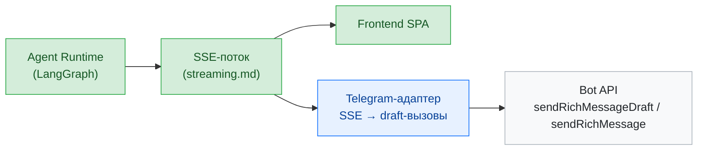

# Telegram как платформа доставки LLM-агента

Ресерч возможностей Telegram Bot API для LearnFlow AI. Снапшот: июнь 2026, Bot API 10.1.

**Вывод.** За период декабрь 2025 — июнь 2026 Telegram выпустил серию релизов Bot API (9.3 → 10.1), которую сам называет «AI Bot revolution». Обе причины, по которым платформа раньше не подходила для LLM-бота — отсутствие нормального рендеринга Markdown/LaTeX и отсутствие стриминга, — закрыты официальными механизмами. Telegram стал жизнеспособным вторым каналом доставки LearnFlow AI поверх существующего agent runtime.

## Почему пересматриваем

На старте проекта Telegram отпадал не как платформа (дистрибуция и привычность аудитории отличные), а как рендер-цель: ответы агента — это Markdown с таблицами, заголовками и LaTeX-формулами, а классический `parse_mode` (MarkdownV2/HTML) ничего из этого не поддерживал. Стриминг приходилось имитировать циклом `editMessageText` с риском rate limits. Оба ограничения сняты на уровне платформы.

## Хронология релизов

| Дата | Bot API | Ключевое для LLM-ботов |
|---|---|---|
| 2025-10-10 | — (клиент) | Анонс threads и streaming для AI-ботов; подписочная монетизация LLM-ботов |
| 2025-12-31 | 9.3 | `sendMessageDraft` — нативный стриминг; топики в личных чатах с ботом |
| 2026-02-09 | 9.4 | `createForumTopic` в личках, стилизация кнопок (цвет, custom emoji) |
| 2026-03-01 | 9.5 | `sendMessageDraft` открыт всем ботам; entity `date_time`; Login with Telegram |
| 2026-04-03 | 9.6 | Managed Bots — боты создают и управляют другими ботами |
| 2026-05-08 | 10.0 | Bot-to-Bot Communication, Guest Bots, Secretary Bots |
| 2026-06-11 | 10.1 | Rich Messages (`sendRichMessage`), `sendRichMessageDraft`, AI Guardians (`answerChatJoinRequestQuery`) |

## Возможности

### Rich Messages — полноценное форматирование

Отдельный механизм отправки, не новый `parse_mode`: методы `sendRichMessage` / `sendRichMessageDraft` принимают `InputRichMessage` со строкой `markdown` **или** `html`. Rich Markdown заявлен как «compatible with GitHub Flavored Markdown where possible» — то, что LLM генерирует из коробки, рендерится почти без преобразований:

- заголовки `#`–`######`, GFM-таблицы с выравниванием, списки, task lists, сноски `[^id]`, спойлеры, collapsible-блоки (`<details>`);
- **LaTeX**: `$...$`, `$$...$$`, ` ```math ` — формулы рендерятся нативно во всех клиентах;
- inline-медиа, карусели (`<tg-collage>`, `<tg-slideshow>`), якоря.

Лимиты: 32 768 UTF-8 символов на сообщение (клиент сворачивает после ~8 000 кнопкой «Show More»), до 500 блоков, до 16 уровней вложенности, до 20 столбцов в таблице, медиа — только отдельным блоком по HTTP(S) URL. Обычный `sendMessage` остался прежним (4096 символов, без таблиц и заголовков) — всё новое живёт только в rich-методах. Демо: `@richtextdemobot`.

### Стриминг — `sendMessageDraft`

Нативная замена паттерну «`editMessageText` каждые N секунд». Бот шлёт частичные обновления драфта (`draft_id`, изменения анимируются клиентом); пустой текст рендерится как плейсхолдер «Thinking…» (в rich-варианте — блок `RichBlockThinking` / `<tg-thinking>`). Семантика, которую важно учесть в адаптере: драфт **эфемерный, живёт 30 секунд** как превью — финальный ответ обязательно отправляется обычным `sendMessage` / `sendRichMessage`, иначе в истории чата ничего не останется. С 10.1 стримится и rich-форматированный текст (`sendRichMessageDraft`). Только приватные чаты.

### Топики — мультисессионность

Бот может вести личный чат в режиме форумных топиков: несколько параллельных диалогов с историей, как треды в ChatGPT. Бот управляет топиками сам (`createForumTopic` / `editForumTopic`, `message_thread_id` во всех send-методах) и может запретить пользователю создавать их вручную (`allows_users_to_create_topics`). Естественный маппинг: один топик = один тред/сессия LearnFlow.

### Агентные фичи

- **Bot-to-Bot Communication** (10.0) — боты пишут друг другу (opt-in с обеих сторон через BotFather). Telegram прямо позиционирует под «fully autonomous agents» и требует от разработчика защиту от петель: дедупликация, rate limits, ограничение глубины.
- **Guest Bots** (10.0) — бота зовут по `@username` в любой чужой чат; он видит только сообщение с упоминанием и реплаи (privacy by design), отвечает через `answerGuestQuery`. Канал дистрибуции: бот попадает в групповые чаты студентов без добавления в участники.
- **Managed Bots** (9.6) — бот программно создаёт и администрирует других ботов (`getManagedBotToken`, `BotAccessSettings`).
- **Secretary Bots** (10.0) — пользователь подключает бота отвечать от своего имени (через BusinessConnection, Premium больше не требуется).
- **AI Guardians** (10.1) — формализованная роль обработчика заявок на вступление: `supports_join_request_queries`, `answerChatJoinRequestQuery` (approve / decline / queue), скрининг заявителя через Mini App (`sendChatJoinRequestWebApp`). Сами заявки боты умели обрабатывать с 2021 года — новое здесь выделенная роль и query-механика.

### Монетизация

Подписки через Telegram Stars: инвойс с `subscription_period` (30 дней), автопродление, баланс бота — `getMyStarBalance`, вывод через Fragment в TON или расход на рекламу/платные рассылки (`allow_paid_broadcast` — до 1000 msg/s за 0.1 Star/сообщение). Telegram явно адресует это LLM-платформам как способ окупать inference.

### Контекст: AI-стратегия Telegram

Telegram строит собственную inference-инфраструктуру **Cocoon Network** (децентрализованный confidential compute на TON) — на ней работают встроенные AI Summaries, AI Text Editor и поиск стикеров. Позиционирование платформы — «открытая экосистема, где конкурируют любые AI-модели», без эксклюзивных интеграций. Для сторонних LLM-ботов это означает: платформа развивает примитивы (стриминг, rich-рендер, монетизация), не конкурируя с ботами собственным ассистентом.

## Маппинг на LearnFlow AI

Новые примитивы Telegram ложатся на существующую архитектуру почти один-в-один — адаптер получается тонким:

| LearnFlow AI | Telegram-примитив |
|---|---|
| SSE-стриминг ответа агента | Обновления `sendRichMessageDraft` + финализация `sendRichMessage` |
| Markdown-ответы агента (GFM + LaTeX) | Rich Markdown — без преобразований |
| Треды / сессии | Форумные топики в личке с ботом |
| Auth (JWT + refresh) | Login with Telegram как мост идентичностей |
| Длинные материалы | Лимит 32k + нативный «Show More» |



## Позиционирование канала

Telegram-бот — не паритетный интерфейс и не урезанная демка, а полноценно используемый канал с сознательно ограниченным скоупом. Ядро продукта — диалог с агентом и потребление подготовленных материалов (текст, таблицы, формулы) — покрывается полностью: именно это раньше было невозможно (Markdown-таблицы и LaTeX не рендерились), а теперь поддерживается даже с запасом. Продвинутые возможности — редактирование Knowledge Sphere, rich-артефакты, специализированный UI — остаются в вебе; бот не пытается их воспроизводить. Часть из них со временем может оказаться достижимой через Mini Apps, но это не входит в базовый скоуп канала.

## Ограничения и открытые вопросы

- **HITL.** Механика interrupt/resume агента в Telegram выражается inline-кнопками, а не формами веб-UI. Либо упрощать сценарии подтверждения, либо смотреть на Mini Apps.
- **Knowledge Sphere.** Просмотр — реализуем (rich-сообщения), полноценное редактирование — нет; остаётся в вебе (см. «Позиционирование канала»).
- **Draft-семантика.** 30-секундный TTL драфта и обязательная финализация требуют аккуратной обработки обрывов генерации и отмены.
- **Свежесть API.** Rich Messages вышли 11 июня 2026; aiogram уже поддерживает draft-методы, но обвязка экосистемы вокруг 10.1 ещё догоняет — закладывать запас на сырость.
- **Лимиты rich-сообщений.** 500 блоков / 20 столбцов / медиа только по URL — длинные материалы с большим числом иллюстраций потребуют нарезки или выноса медиа в хранилище с публичными URL.

## Источники

- [Bot API changelog](https://core.telegram.org/bots/api-changelog) — канонические даты и API-поверхность
- [Rich Message Formatting Options](https://core.telegram.org/bots/api#rich-message-formatting-options)
- [Bot Features: guest bots, bot-to-bot, secretary, managed](https://core.telegram.org/bots/features)
- Анонсы в блоге Telegram (русские версии — добавить `/ru` к URL):
  - [Threads and Streaming Responses for AI Bots](https://telegram.org/blog/comments-in-video-chats-threads-for-bots) (10.10.2025)
  - [Subscription Plans](https://telegram.org/blog/fullscreen-miniapps-and-more#subscription-plans)
  - [AI Bot revolution: Guest Bots, Bot-to-Bot, Chat Automation](https://telegram.org/blog/ai-bot-revolution-11-new-features) (07.05.2026)
  - [Rich Text for Bots, AI Guardians](https://telegram.org/blog/watch-apps-and-more) (11.06.2026)
  - [Managed Bots](https://telegram.org/blog/ai-editor-mighty-polls-and-more) (31.03.2026)
- [Cocoon Network](https://cocoon.org/developers)
