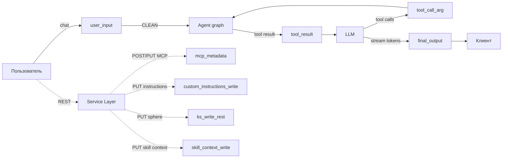
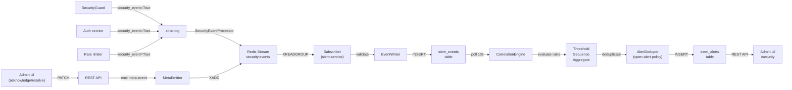

# Security

Защита AI-агента от prompt injection и от утечки внутренней реализации в выходные данные. Восемь точек проверки покрывают входы, выходы и точки записи: пользовательский ввод, результаты инструментов, аргументы tool-вызовов, финальный ответ, регистрация MCP-серверов, запись custom instructions, прямая запись Knowledge Sphere через REST, прямая запись Skill Context через REST.

Логика защиты живёт в Agent Layer и в service-методах, выполняющих запись. API Layer пробрасывает события: `security_block` через SSE, HTTP 403 на заблокированном thread'е, HTTP 422 на отклонённой записи. Обоснование — [ADR-017](../tech/adr/ADR-017-prompt-injection-defense.md) (Sec 1.0: sync guard, fail-open), [ADR-022](../tech/adr/ADR-022-protected-disclosable-boundary.md) (confidentiality boundary), [ADR-023](../tech/adr/ADR-023-two-level-detection.md) (detection layers), [ADR-024](../tech/adr/ADR-024-streaming-security-guard.md) (streaming guard), [ADR-029](../tech/adr/ADR-029-operational-kill-switches.md) (`LLM_DEFENSE_ENABLED` как операционный тумблер); модель угроз — [threat-model.md](threat-model.md).

Вся защита, описанная на этой странице, — под операционным тумблером `LLM_DEFENSE_ENABLED` (дефолт `true`, в проде `false`). При выключении `SecurityGuard` не строится (`app.state.security_guard = None`) и не эмитит ни одного checkpoint'а из Coverage map ниже; hardening-преамбула, canary и обёртки границы доверия не попадают в system prompt. Auth, rate limiting, RBAC, SSRF- и схема-валидация MCP тумблером не затрагиваются — это обычная app-security, а не предмет этого документа. Треды, уже заблокированные (`security_blocked=true`), остаются заблокированными и при выключенном тумблере — блокировка исторический факт, а не runtime-решение.

## Принципы

- **Defense in depth.** На каждой точке — несколько независимых детекторов: substring и LLM classifier. Отказ одного слоя не обнуляет остальные.
- **Граница PROTECTED / DISCLOSABLE.** Бинарный признак на content. PROTECTED — наш код: системный промпт, имена / параметры / схемы internal non-MCP инструментов. DISCLOSABLE — внешнее: MCP (built-in и user-installed) и пользовательский content (Knowledge Sphere, custom instructions, memory). Capability раскрывается всегда, implementation — никогда.
- **Trust ≠ Disclosure.** Trust определяет, оборачивать ли content в untrusted-теги при composition (для модели). Disclosure определяет, можно ли отдавать content на выход (runtime-детектор). Internal tools — TRUSTED + PROTECTED. Built-in MCP — TRUSTED + DISCLOSABLE. User MCP — UNTRUSTED + DISCLOSABLE.
- **Classifier isolation.** Промпт classifier'а не знает о других слоях защиты. Калибровка через FN/FP формулируется внутри промпта, без апелляции к «следующему уровню».
- **Fail-open на guard LLM.** Недоступен или не вернул валидный verdict — CLEAN + WARNING в логах. Доступность приоритетнее отказа.
- **Единое правило для всех.** Нет ролевых exemption'ов, debug-mode ослаблений, admin override'ов.

## Coverage map



| Checkpoint | Где срабатывает | Направление | Действие при INJECTION |
|------------|-----------------|-------------|------------------------|
| `user_input` | Runner, до запуска графа | inbound | Reject, `security_block` SSE, thread blocked |
| `tool_result` | Узел `tools`, на каждом результате отдельно — до отчёта о вызове и до возврата из узла | inbound | Заглушка-`ToolMessage`, thread blocked (исключение — unicode на выводе исполняющих инструментов, см. § Unicode) |
| `tool_call_arg` | `agent_node`, после ответа LLM | outbound | `tool_calls=[]` + redacted `AIMessage`, thread blocked, граф уходит в END |
| `final_output` | Runner, mid-stream и end-of-stream | outbound | Redacted `AIMessage`, thread blocked, `security_block` SSE |
| `mcp_metadata` | Service, регистрация user MCP + built-in startup | add-time | HTTP 422 (для built-in — disable конкретного сервера) |
| `custom_instructions_write` | Service, PUT instructions | add-time | HTTP 422 |
| `ks_write_rest` | Service, PUT sphere | add-time | HTTP 422 |
| `skill_context_write` | Service, PUT skill context document | add-time | HTTP 422 |

Knowledge Sphere через agent-tool попадает в `tool_call_arg`; через REST — в `ks_write_rest`. Skill Context — симметрично: agent-tool (`save_skill_context`) покрыт `tool_call_arg`, REST-путь — отдельным `skill_context_write` (проверка идёт только для уже существующего документа — 404 на отсутствующем коротким замыканием пропускает guard). Каждый путь к записи — свой checkpoint.

## Detectors

Четыре детерминированных детектора + LLM classifier. Применимость к checkpoint'у фиксируется в коде, пороги — в `configs/security.yaml`.

| Детектор | user_input | tool_result | tool_call_arg | final_output | mcp_metadata | custom_instructions_write | ks_write_rest | skill_context_write |
|----------|:---:|:---:|:---:|:---:|:---:|:---:|:---:|:---:|
| Canary | ✓ | ✓ | ✓ | ✓ | ✓ | ✓ | ✓ | ✓ |
| Unicode | ✓ | ✓ | — | — | ✓ | ✓ | ✓ | ✓ |
| Fragment | ✓ | ✓ | ✓ | ✓ | — | — | — | — |
| Paired | — | — | ✓ | ✓ | — | — | — | — |
| LLM Classifier | ✓ | ✓ | ✓ | ✓ | ✓ | ✓ | ✓ | ✓ |

Детерминированные срабатывания — short-circuit: classifier не запускается, если deterministic detector уже вернул INJECTION.

### Canary

HMAC-токен от `(CANARY_SECRET, thread_id)`. Embedded в system prompt при composition; substring match на любом checkpoint'е → INJECTION. Появление токена в data — признак скомпрометированного потока. Токен не генерируется при `LLM_DEFENSE_ENABLED=false` (guard не построен — детектору нечего проверять).

### Unicode

Невидимые / форматирующие символы (категории Cf, Co, Cn). Применяется только к inbound и add-time content — модель не генерирует такие символы как атаку. Сработавшие кодпоинты уезжают в `details` события (`codepoints`, `distinct_codepoints`) — без них по событию не восстановить, какой символ стрельнул.

**Исключение по реакции: вывод исполняющих инструментов.** `execute_code` / `run_command` отдают в `tool_result` произвольный stdout чужой программы, где невидимый символ — обычное дело (BOM из файла, мягкие переносы из извлечённого PDF, PUA-глифы шрифта). Для этих двух инструментов unicode-срабатывание отвечает **санитайзом**: символы удаляются из `ToolMessage` до его выхода из узла `tools`, заглушки нет, `security_redacted` не ставится — тред не блокируется. Очищенный текст перепроверяется guard'ом заново: первая проверка ушла коротким замыканием на unicode-слое, и fragment-детектор с классификатором этот буфер ещё не судили. Событие и его severity не меняются — меняется только реакция. Список инструментов — `_INVISIBLE_CHAR_SANITIZED_TOOLS` в `backend/app/agent/tool_guards.py`; для всех прочих инструментов и всех прочих детекторов действует общая политика из таблицы checkpoint'ов.

### Fragment

Sliding-window substring match (60 символов, шаг 30, минимум два уникальных совпадения) против корпуса PROTECTED-материала. Корпус собирается на старте: hardening preamble, security instructions, base prompt prose, descriptions internal non-MCP tools. Не входит: descriptions MCP (DISCLOSABLE), пользовательский content.

### Paired

Two-list match: имя internal non-MCP tool **И** ≥1 параметр из его сигнатуры. Tool помечается скомпрометированным при совпадении пары; checkpoint INJECTION при ≥3 скомпрометированных tools. Применяется только на outbound — модель сама знает имена.

### LLM Classifier

Один composite-промпт `security-classifier` в Langfuse. Per-checkpoint специфика подставляется через переменные `checkpoint_description` и `checkpoint_specifics_section` из `configs/security.yaml`. Промпт работает как security boundary classifier: оценивает факт пересечения границы, не «попытку атаки» — legitimate-looking запрос с PROTECTED-материалом на выход всё равно даёт INJECTION.

Verdict: CLEAN / SUSPICIOUS / INJECTION. SUSPICIOUS только логируется (уровень WARNING) — отдельной реакции на него в контуре нет. Невалидный ответ → retry до `max_retries`, исчерпаны → CLEAN + WARNING (graceful degradation).

Все substring-детекторы нормализуют content одинаково: lowercase, схлопывание `_-` → `_`, схлопывание whitespace.

## Trust boundaries в system prompt

System prompt собирается секционно (Python, не Jinja-template). Структура (текст `<system_instructions>` и обёртки границы доверия живут в `configs/prompt_fragments.yaml`; вырезаются целиком при `LLM_DEFENSE_ENABLED=false` — секция становится пустой, остальные секции не меняются):

```
<system_instructions> ... </system_instructions>
[base prose]
<tools>
  <internal_tools> ... </internal_tools>          ← TRUSTED + PROTECTED
  <builtin_mcp_tools> ... </builtin_mcp_tools>    ← TRUSTED + DISCLOSABLE
  <user_installed_mcp_tools>
    <untrusted_tool_description>...</untrusted_tool_description>
    ...
  </user_installed_mcp_tools>                      ← UNTRUSTED + DISCLOSABLE
</tools>
<knowledge_sphere> ... </knowledge_sphere>
<custom_instructions> ... </custom_instructions>
[guidelines]
<instruction_reminder> ... </instruction_reminder>
```

При composition LLM-сообщений `HumanMessage` и `ToolMessage` оборачиваются в `<user_message>` и `<tool_output>`. В checkpointer сообщения сохраняются без обёрток — обёртки нужны только модели и применяются при сборке prompt'а на каждый вызов.

Маркировка не security-by-obscurity: даже зная структуру, атакующий не сможет вынести PROTECTED-материал без обхода runtime-детекторов.

## Block mechanics

### Runtime checkpoints

Два уровня блокировки:

- **Thread-level.** Поле `security_blocked` в `thread_views`. Маркируется при первом INJECTION на любом из четырёх runtime-checkpoint'ов. FastAPI-зависимость `require_unblocked_thread` на POST `/messages` отдаёт 403, пока флаг стоит.
- **Message-level.** Маркер `additional_kwargs.security_redacted` на `AIMessage` / `ToolMessage`: по нему DTO-mapper при чтении истории отдаёт заглушку и выставляет `redacted: true` для UI. Где именно исчезает отравленный текст, зависит от checkpoint'а: `tool_result` заменяет сообщение прямо в узле `tools`, до его выхода, поэтому сырой результат не доезжает ни до провода, ни до чекпоинтера (→ [ADR-030](../tech/adr/ADR-030-per-call-tool-result-guard.md)); `final_output` подменяет ассистентское сообщение по `id`; `tool_call_arg` оставляет текст ответа модели в состоянии, срезая `tool_calls`, — там заглушку подставляет только маппер истории.

Подмена сообщения работает через reducer `add_messages` и synthetic-сообщение с тем же `id`. Отдельная нода-interceptor не вводится — это сохраняет встроенный `tools_condition`.

Frontend на `security_block` SSE event делает оптимистичный patch `chat.security_blocked=true` + invalidate кеша; input блокируется, заглушка остаётся в истории при reload. Подробнее — [streaming.md](../tech/streaming.md), [frontend.md](../tech/frontend.md).

### Add-time checkpoints

Guard вызывается первым в service-методе, до endpoint-специфичных валидаций (SSRF, schema). При INJECTION — HTTP 422, запись не сохраняется, thread-флаг не выставляется (операция вне chat-контекста). Frontend показывает inline-сообщение под формой; конкретная причина детекции в UI не раскрывается.

### Built-in MCP startup validation

Для каждого remote built-in MCP-сервера (`enabled`, не stdio) при старте выполняется `tools/list` + проверка blob'а через `mcp_metadata`. INJECTION или ошибка fetch → сервер попадает в `app.state.disabled_builtin_mcp` и не экспонируется в runtime tools. Приложение стартует.

## Субагенты: переиспользование границы

Субагент — тот же trust-контур, что основной агент; отдельный периметр не строится (полное обоснование — [ADR-028](../tech/adr/ADR-028-product-subagents.md), исполняющее ядро — [agent-runtime.md § Субагенты](../tech/agent-runtime.md#субагенты)).

- **На границе вызова** переиспользуются существующие checkpoint'ы: `task` + `input_artifact_ids` — аргументы tool-вызова `run_subagent`, проверяемые `tool_call_arg`; результат субагента становится `ToolMessage`, проверяемым `tool_result` до следующего вызова LLM.
- **Внутри цикла субагента** переиспользуется тот же guard-код (`backend/app/agent/tool_guards.py`), что в основном графе — та же fail-safe redact-семантика, не блокировка. Каждый субагент — ReAct-агент с инструментами, проверки стоят в тех же узлах: `tool_call_arg` — в llm-узле, `tool_result` — в узле `tools`; в прогоне без tool-вызовов они структурно бездействуют — untrusted-источников внутри цикла тогда нет, единственный вход уже проверен на границе.
- **Toolset субагента** строится только из `internal_tools` + built-in MCP — user-installed MCP не резолвится в него ни при каких обстоятельствах, что сохраняет trust-границу между продуктовыми и пользовательскими интеграциями.

## Observability

Единая точка эмиссии в Langfuse — `GuardObserver`, два режима:

- **Nested.** Guard-observation вкладывается в текущий agent-trace (runtime checkpoints).
- **Top-level.** Guard создаёт собственный trace `security.<checkpoint>` (add-time checkpoints в service-слое).

На уровне trace — score `security_verdict` (CLEAN / SUSPICIOUS / INJECTION) и metadata (`blocked`, `checkpoint`, `detection_layer`). На guardrail observation — модель classifier'а, raw verdict, reasoning, детали детекторов. Подробнее — [observability.md](../tech/observability.md).

Деградация guard наблюдаема на всех дорогах — не только внутри движка, но и в enforcement-адаптерах. Узел `tools`, который не смог прочитать историю диалога из состояния (проверка идёт, но без контекста для классификатора) или получил от `ToolNode` выход без батча `ToolMessage` (проверять нечего — форма ответа `Command`), пишет тот же `agent.guard.degraded` с `severity=critical` и `detection_layer=graceful_degradation`, что и деградация самого классификатора. Молчаливого fail-open в контуре нет — [conventions.md § Восстановление](../tech/conventions.md).

structlog-processor помечает security-логи стабильным shape (`identifiers`, `metadata`) для SIEM-pipeline. SIEM потребляет events через Redis Streams, коррелирует и отображает в admin UI — [ADR-018](../tech/adr/ADR-018-siem-service-topology.md).

## Security Observability: SIEM Pipeline

Дополнительный слой мониторинга, ортогональный Langfuse. SIEM наблюдает за самой системой безопасности: собирает events из всех источников (SecurityGuard checkpoints, auth operations, rate limits, SIEM-администраторы), коррелирует их по правилам (Threshold/Sequence/Aggregate strategies), генерирует alerts, предоставляет REST API и admin UI.

**Data Flow:**



**Producer-Side (Main App):**
- Security checkpoints (user_input, tool_result, tool_call_arg, final_output) → log с `security_event=True` и canonical `event_type`
- Context binding (ip, user_id, thread_id, project_id и т.д.) вытягивается из contextvars
- `SecurityEventProcessor` нормализует в `SecurityEvent`, публирует в Redis Stream
- Event contract — shared Pydantic models в `packages/siem-contracts/` (vocabulary, SecurityEvent, AlertDTO, RuleConfig)

**Consumer-Side (SIEM Service):**
- `Subscriber` читает Redis Stream (XREADGROUP), валидирует, deduplicate по event_id
- `EventWriter` записывает в `siem_events` (immutable, JSONB identifiers + metadata, dual timestamps)
- `CorrelationEngine` polls включённые rules каждые 10 сек:
  - Per-rule: выбрать events за window, apply strategy, check threshold
  - Threshold: COUNT(event_type LIKE pattern) >= threshold, optional group_key
  - Sequence: Event A THEN Event B within window
  - Aggregate: COUNT without grouping (no group_key)
- `AlertDeduper` применяет open-alert policy: один alert per (rule_id, group_key) за 24h
- Alerts пишутся в `siem_alerts` с status='new'

**Admin Operations (SIEM REST API):**
- GET `/api/security/events` — список всех events с фильтрами и пагинацией
- GET `/api/security/alerts` — список alerts (фильтры: severity, status)
- PATCH `/api/security/alerts/:id` — change status (new → acknowledged → resolved) → emit `siem.alert.acknowledged` / `siem.alert.resolved` event
- GET/POST/PATCH/DELETE `/api/security/rules` — CRUD rules → emit `siem.rule.*` meta-events

**Baseline Rules:**
1. `brute_force_auth`: 5+ auth.login.failed in 60s, group by ip, severity=critical
2. `injection_spike`: 10+ agent.guard.%.injection in 300s, severity=critical
3. `targeted_user_attack`: 3+ agent.guard.% in 600s, group by user_id, severity=warning
4. `mass_suspicious`: 15+ agent.guard.%.suspicious in 600s, severity=critical

**Role-Based Access Control:**
- All SIEM endpoints admin-only
- JWT validation: shared `JWT_SECRET` with main app
- Claim `is_admin: true` required → 403 Forbidden if false
- Admin promotion: deliberate operator action (`make grant-admin USER=<name>`) over the `users.is_admin` column added by migration. No automatic promotion at startup.

**Forward Compatibility:**
- Vocabulary-soft mode: unknown event_type accepted, logged as metric
- Adding new event_type requires no SIEM migrations
- Rule config stored as JSONB (no schema lock per rule_type)

Подробнее: [ADR-018](../tech/adr/ADR-018-siem-service-topology.md) (topology), [ADR-019](../tech/adr/ADR-019-security-event-transport.md) (transport), [ADR-020](../tech/adr/ADR-020-security-event-contract.md) (contract), [ADR-021](../tech/adr/ADR-021-siem-correlation-engine.md) (correlation), [security-events.md](../tech/security-events.md) (vocabulary).

## Конфигурация

| Файл | Содержимое |
|------|-----------|
| `configs/security.yaml` | Per-checkpoint config (description, specifics, classifier_enabled), пороги детекторов, llm_classifier (модель, retries, reasoning), user-facing messages |
| `configs/pricing.yaml` | Pricing моделей, включая guard-модель (shared с agent для cost tracking в Langfuse) |
| `configs/prompt_fragments.yaml` | Hardening-преамбула `<system_instructions>`, XML-обёртки `<user_message>`, `<tool_output>`, `<custom_instructions>` и заголовки секций — все security-ключи гасятся разом при `LLM_DEFENSE_ENABLED=false` |
| `configs/prompts.yaml` | Реестр промптов с указанием source-файла |
| `configs/error_messages.yaml` | Нормализованные сообщения SSE error events и заглушки |
| `configs/prompts/security-classifier.txt` | Composite classifier prompt (seed + fallback) |

| Env | Назначение |
|-----|-----------|
| `LLM_DEFENSE_ENABLED` | Операционный тумблер: `false` выключает весь inline-defense разом — `SecurityGuard` (детекторы + LLM classifier) и security-часть композиции промпта (canary, hardening-преамбула, обёртки границы доверия). Читается один раз в lifespan, переключение требует рестарта контейнера. Дефолт `true`; в проде — `false` |
| `CANARY_SECRET` | HMAC-secret для canary-токена; пусто при включённой защите → canary отключён + warning. При `LLM_DEFENSE_ENABLED=false` секрет не используется вовсе, warning не эмитится |

## Связанные документы

- [threat-model.md](threat-model.md) — модель угроз
- [ADR-017](../tech/adr/ADR-017-prompt-injection-defense.md) — Sec 1.0: sync guard, fail-open, hardening wrapper
- [ADR-022](../tech/adr/ADR-022-protected-disclosable-boundary.md) — PROTECTED / DISCLOSABLE boundary, MCP trust hierarchy
- [ADR-023](../tech/adr/ADR-023-two-level-detection.md) — deterministic detectors + LLM classifier, composite prompt
- [ADR-024](../tech/adr/ADR-024-streaming-security-guard.md) — streaming guard, block mechanics, replace-by-id
- [ADR-029](../tech/adr/ADR-029-operational-kill-switches.md) — `LLM_DEFENSE_ENABLED` как операционный тумблер: почему один флаг на подсистему, а не per-checkpoint env-переменные
- [ADR-018](../tech/adr/ADR-018-siem-service-topology.md) — SIEM topology: separate service, identity, data isolation
- [ADR-020](../tech/adr/ADR-020-security-event-contract.md) — event contract: vocabulary, identifiers, strictness
- [ADR-028](../tech/adr/ADR-028-product-subagents.md) — субагенты: subagent-as-tool, переиспользование границы вместо нового периметра
- [ADR-030](../tech/adr/ADR-030-per-call-tool-result-guard.md) — `TOOL_RESULT` внутри узла `tools`, повызовно: размен стоимости классификатора на непроверенный текст в ленте
- [agent-runtime.md](../tech/agent-runtime.md) — ReAct-граф, system message, MCP integration
- [observability.md](../tech/observability.md) — Langfuse traces и scores
- [streaming.md](../tech/streaming.md) — SSE-протокол, terminal events
