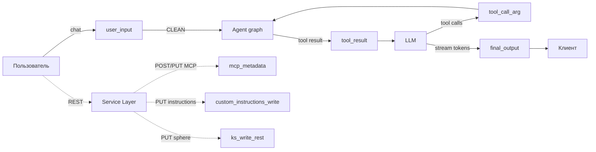

# Security

Защита AI-агента от prompt injection и от утечки внутренней реализации в выходные данные. Семь точек проверки покрывают входы, выходы и точки записи: пользовательский ввод, результаты инструментов, аргументы tool-вызовов, финальный ответ, регистрация MCP-серверов, запись custom instructions, прямая запись Knowledge Sphere через REST.

Логика защиты живёт в Agent Layer и в service-методах, выполняющих запись. API Layer пробрасывает события: `security_block` через SSE, HTTP 403 на заблокированном thread'е, HTTP 422 на отклонённой записи. Обоснование — [ADR-017](../tech/adr/ADR-017-prompt-injection-defense.md) (Sec 1.0: sync guard, fail-open), [ADR-022](../tech/adr/ADR-022-protected-disclosable-boundary.md) (confidentiality boundary), [ADR-023](../tech/adr/ADR-023-two-level-detection.md) (detection layers), [ADR-024](../tech/adr/ADR-024-streaming-security-guard.md) (streaming guard); модель угроз — [threat-model.md](threat-model.md).

## Принципы

- **Defense in depth.** На каждой точке — несколько независимых детекторов: substring и LLM classifier. Отказ одного слоя не обнуляет остальные.
- **Граница PROTECTED / DISCLOSABLE.** Бинарный признак на content. PROTECTED — наш код: системный промпт, имена / параметры / схемы internal non-MCP инструментов. DISCLOSABLE — внешнее: MCP (built-in и user-installed) и пользовательский content (Knowledge Sphere, custom instructions, memory). Capability раскрывается всегда, implementation — никогда.
- **Trust ≠ Disclosure.** Trust определяет, оборачивать ли content в untrusted-теги при composition (для модели). Disclosure определяет, можно ли отдавать content на выход (runtime-детектор). Internal tools — TRUSTED + PROTECTED. Built-in MCP — TRUSTED + DISCLOSABLE. User MCP — UNTRUSTED + DISCLOSABLE.
- **Classifier isolation.** Промпт classifier'а не знает о других слоях защиты. Калибровка через FN/FP формулируется внутри промпта, без апелляции к «следующему уровню».
- **Fail-open на guard LLM.** Недоступен или не вернул валидный verdict — CLEAN + WARNING в логах. Доступность приоритетнее отказа.
- **Единое правило для всех.** Нет ролевых exemption'ов, debug-mode ослаблений, admin override'ов.

## Coverage map



| Checkpoint | Где срабатывает | Направление | Действие при INJECTION |
|------------|-----------------|-------------|------------------------|
| `user_input` | Runner, до запуска графа | inbound | Reject, `security_block` SSE, thread blocked |
| `tool_result` | `agent_node`, до вызова LLM | inbound | Заглушка-`ToolMessage`, thread blocked |
| `tool_call_arg` | `agent_node`, после ответа LLM | outbound | `tool_calls=[]` + redacted `AIMessage`, thread blocked, граф уходит в END |
| `final_output` | Runner, mid-stream и end-of-stream | outbound | Redacted `AIMessage`, thread blocked, `security_block` SSE |
| `mcp_metadata` | Service, регистрация user MCP + built-in startup | add-time | HTTP 422 (для built-in — disable конкретного сервера) |
| `custom_instructions_write` | Service, PUT instructions | add-time | HTTP 422 |
| `ks_write_rest` | Service, PUT sphere | add-time | HTTP 422 |

Knowledge Sphere через agent-tool попадает в `tool_call_arg`; через REST — в `ks_write_rest`. Каждый путь к записи — свой checkpoint.

## Detectors

Четыре детерминированных детектора + LLM classifier. Применимость к checkpoint'у фиксируется в коде, пороги — в `configs/security.yaml`.

| Детектор | user_input | tool_result | tool_call_arg | final_output | mcp_metadata | custom_instructions_write | ks_write_rest |
|----------|:---:|:---:|:---:|:---:|:---:|:---:|:---:|
| Canary | ✓ | ✓ | ✓ | ✓ | ✓ | ✓ | ✓ |
| Unicode | ✓ | ✓ | — | — | ✓ | ✓ | ✓ |
| Fragment | ✓ | ✓ | ✓ | ✓ | — | — | — |
| Paired | — | — | ✓ | ✓ | — | — | — |
| LLM Classifier | ✓ | ✓ | ✓ | ✓ | ✓ | ✓ | ✓ |

Детерминированные срабатывания — short-circuit: classifier не запускается, если deterministic detector уже вернул INJECTION.

### Canary

HMAC-токен от `(CANARY_SECRET, thread_id)`. Embedded в system prompt при composition; substring match на любом checkpoint'е → INJECTION. Появление токена в data — признак скомпрометированного потока.

### Unicode

Невидимые / форматирующие символы (категории Cf, Co, Cn). Применяется только к inbound и add-time content — модель не генерирует такие символы как атаку.

### Fragment

Sliding-window substring match (60 символов, шаг 30, минимум два уникальных совпадения) против корпуса PROTECTED-материала. Корпус собирается на старте: hardening preamble, security instructions, base prompt prose, descriptions internal non-MCP tools. Не входит: descriptions MCP (DISCLOSABLE), пользовательский content.

### Paired

Two-list match: имя internal non-MCP tool **И** ≥1 параметр из его сигнатуры. Tool помечается скомпрометированным при совпадении пары; checkpoint INJECTION при ≥3 скомпрометированных tools. Применяется только на outbound — модель сама знает имена.

### LLM Classifier

Один composite-промпт `security-classifier` в Langfuse. Per-checkpoint специфика подставляется через переменные `checkpoint_description` и `checkpoint_specifics_section` из `configs/security.yaml`. Промпт работает как security boundary classifier: оценивает факт пересечения границы, не «попытку атаки» — legitimate-looking запрос с PROTECTED-материалом на выход всё равно даёт INJECTION.

Verdict: CLEAN / SUSPICIOUS / INJECTION. SUSPICIOUS пока только логируется; graduated response — feat-007. Невалидный ответ → retry до `max_retries`, исчерпаны → CLEAN + WARNING (graceful degradation).

Все substring-детекторы нормализуют content одинаково: lowercase, схлопывание `_-` → `_`, схлопывание whitespace.

## Trust boundaries в system prompt

System prompt собирается секционно (Python, не Jinja-template). Структура:

```
<system_instructions> ... </system_instructions>
[base prose]
<tools>
  <internal_tools> ... </internal_tools>          ← TRUSTED + PROTECTED
  <builtin_mcp_tools> ... </builtin_mcp_tools>    ← TRUSTED + DISCLOSABLE
  <user_installed_mcp_tools>
    <untrusted_tool_description>...</untrusted_tool_description>
    ...
  </user_installed_mcp_tools>                      ← UNTRUSTED + DISCLOSABLE
</tools>
<knowledge_sphere> ... </knowledge_sphere>
<custom_instructions> ... </custom_instructions>
[guidelines]
<instruction_reminder> ... </instruction_reminder>
```

При composition LLM-сообщений `HumanMessage` и `ToolMessage` оборачиваются в `<user_message>` и `<tool_output>`. В checkpointer сообщения сохраняются без обёрток — обёртки нужны только модели и применяются при сборке prompt'а на каждый вызов.

Маркировка не security-by-obscurity: даже зная структуру, атакующий не сможет вынести PROTECTED-материал без обхода runtime-детекторов.

## Block mechanics

### Runtime checkpoints

Два уровня блокировки:

- **Thread-level.** Поле `security_blocked` в `thread_views`. Маркируется при первом INJECTION на любом из четырёх runtime-checkpoint'ов. FastAPI-зависимость `require_unblocked_thread` на POST `/messages` отдаёт 403, пока флаг стоит.
- **Message-level.** Маркер `additional_kwargs.security_redacted` на `AIMessage` / `ToolMessage`. Checkpointer хранит оригинал; при чтении истории DTO-mapper подставляет заглушку и выставляет `redacted: true` для UI.

Подмена сообщения работает через reducer `add_messages` и synthetic-сообщение с тем же `id`. Отдельная нода-interceptor не вводится — это сохраняет встроенный `tools_condition`.

Frontend на `security_block` SSE event делает оптимистичный patch `chat.security_blocked=true` + invalidate кеша; input блокируется, заглушка остаётся в истории при reload. Подробнее — [streaming.md](../tech/streaming.md), [frontend.md](../tech/frontend.md).

### Add-time checkpoints

Guard вызывается первым в service-методе, до endpoint-специфичных валидаций (SSRF, schema). При INJECTION — HTTP 422, запись не сохраняется, thread-флаг не выставляется (операция вне chat-контекста). Frontend показывает inline-сообщение под формой; конкретная причина детекции в UI не раскрывается.

### Built-in MCP startup validation

Для каждого remote built-in MCP-сервера (`enabled`, не stdio) при старте выполняется `tools/list` + проверка blob'а через `mcp_metadata`. INJECTION или ошибка fetch → сервер попадает в `app.state.disabled_builtin_mcp` и не экспонируется в runtime tools. Приложение стартует.

## Observability

Единая точка эмиссии в Langfuse — `GuardObserver`, два режима:

- **Nested.** Guard-observation вкладывается в текущий agent-trace (runtime checkpoints).
- **Top-level.** Guard создаёт собственный trace `security.<checkpoint>` (add-time checkpoints в service-слое).

На уровне trace — score `security_verdict` (CLEAN / SUSPICIOUS / INJECTION) и metadata (`blocked`, `checkpoint`, `detection_layer`). На guardrail observation — модель classifier'а, raw verdict, reasoning, детали детекторов. Подробнее — [observability.md](../tech/observability.md).

structlog-processor помечает security-логи стабильным shape (`identifiers`, `metadata`) для SIEM-pipeline (feat-005). SIEM потребляет events через Redis Streams, коррелирует и отображает в admin UI — [ADR-018](../tech/adr/ADR-018-siem-service-topology.md).

## Конфигурация

| Файл | Содержимое |
|------|-----------|
| `configs/security.yaml` | Per-checkpoint config (description, specifics, classifier_enabled), пороги детекторов, llm_classifier (модель, retries, reasoning), user-facing messages |
| `configs/pricing.yaml` | Pricing моделей, включая guard-модель (shared с agent для cost tracking в Langfuse) |
| `configs/prompt_fragments.yaml` | XML-обёртки `<user_message>`, `<tool_output>`, `<custom_instructions>` и заголовки секций |
| `configs/prompts.yaml` | Реестр промптов с указанием source-файла |
| `configs/error_messages.yaml` | Нормализованные сообщения SSE error events и заглушки |
| `configs/prompts/security-classifier.txt` | Composite classifier prompt (seed + fallback) |

| Env | Назначение |
|-----|-----------|
| `CANARY_SECRET` | HMAC-secret для canary-токена; пусто → canary отключён + warning |

## Связанные документы

- [threat-model.md](threat-model.md) — модель угроз
- [ADR-017](../tech/adr/ADR-017-prompt-injection-defense.md) — Sec 1.0: sync guard, fail-open, hardening wrapper
- [ADR-022](../tech/adr/ADR-022-protected-disclosable-boundary.md) — PROTECTED / DISCLOSABLE boundary, MCP trust hierarchy
- [ADR-023](../tech/adr/ADR-023-two-level-detection.md) — deterministic detectors + LLM classifier, composite prompt
- [ADR-024](../tech/adr/ADR-024-streaming-security-guard.md) — streaming guard, block mechanics, replace-by-id
- [ADR-018](../tech/adr/ADR-018-siem-service-topology.md) — SIEM topology: separate service, identity, data isolation
- [ADR-020](../tech/adr/ADR-020-security-event-contract.md) — event contract: vocabulary, identifiers, strictness
- [agent-runtime.md](../tech/agent-runtime.md) — ReAct-граф, system message, MCP integration
- [observability.md](../tech/observability.md) — Langfuse traces и scores
- [streaming.md](../tech/streaming.md) — SSE-протокол, terminal events
