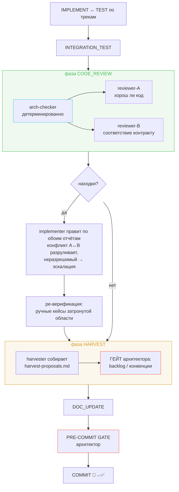
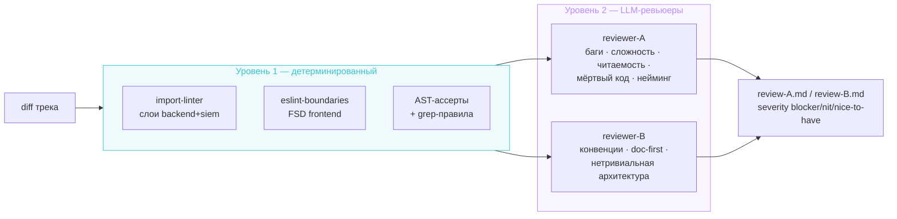
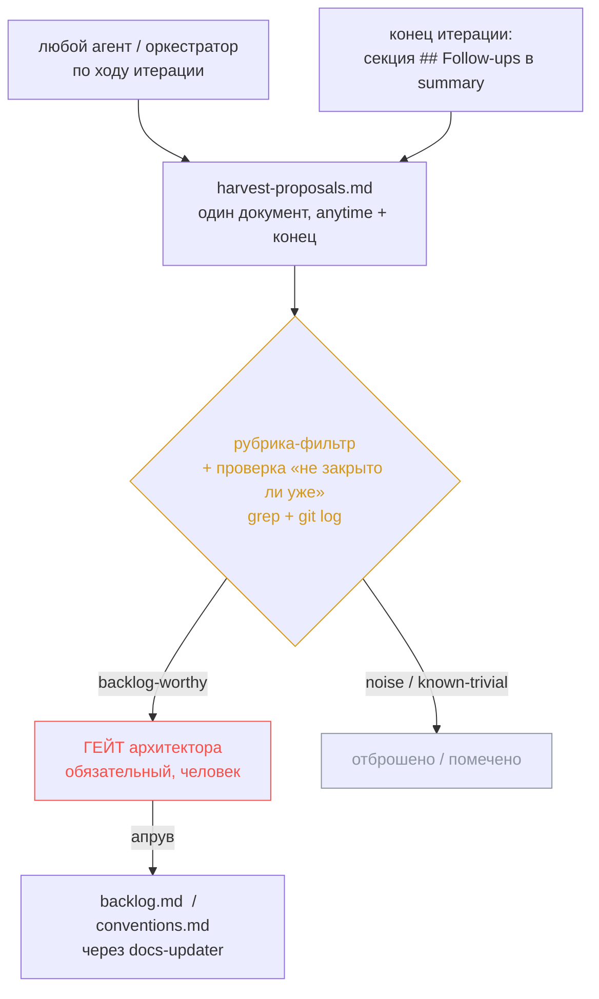
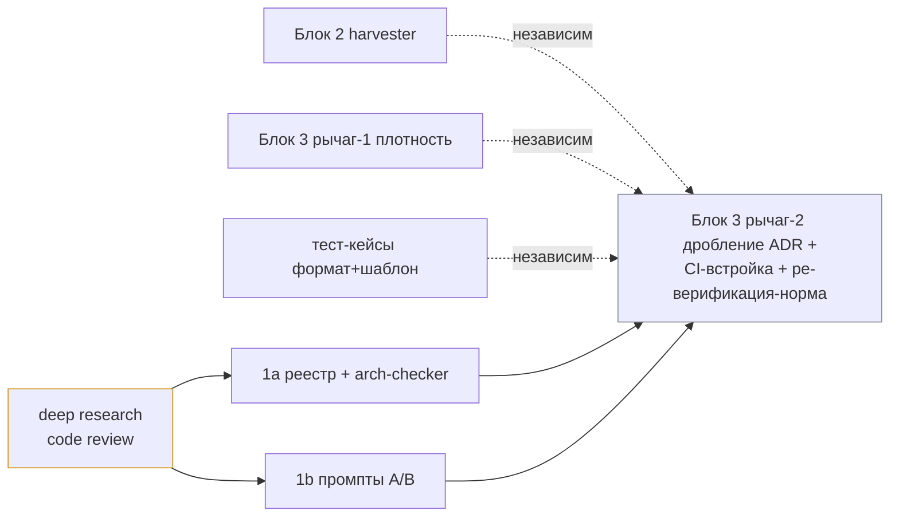

# Design Brief: feat-008 — Enforcement & надёжность петель обратной связи

**Статус:** 🚧 In Progress
**Scope:** enforcement (workflow / CI)
**Зависимости:** feat-001…feat-007 (накопленные конвенции и Layers-диаграмма)
**Tasklist:** [feat-008](../../../tasklist-codebase-maturity.md#feat-008-enforcement--arch-checker--reviewer-prompts)

## Контекст и рамка

Семь slice-итераций выработали конвенции, но соблюдал их только агент-реализатор (и оркестратор) — **одним проходом, без взгляда со стороны**. Реализатор по природе упускает: правило, которое он не удержал в голове, никто не ловит до прода.

feat-008 заводит **слой обратной связи**. Но по ходу проработки рамка расширилась: это итерация не про «enforcement кода», а про **надёжность петель обратной связи во всём процессе разработки**. Общий знаменатель — *ничто ценное не теряется по дороге*:

- **арх-нарушение** — ловит детерминированный checker;
- **хвост-долг** в post-implementation summary — поднимает в backlog harvest-механизм;
- **регрессия после фикса** — ловит норма ре-верификации.

Это три разные течи одной природы, и закрываются они тремя блоками. Базовый паттерн под всеми — **ревью как переиспользуемая обратная связь**: интерактивное улучшение с внешним взглядом надёжнее прямого прохода.

## Принципы решения

1. **Детерминированное вперёд LLM.** Всё, что машина проверяет точно и без галлюцинаций, уходит в детерминированную проверку; LLM остаётся нетривиальное и адаптивное. Это не «или-или», а разгрузка: import-linter ловит регрессии на известных инвариантах дёшево, LLM-ревьюер — новые арх-запахи, которые в правило не зашьёшь.
2. **Системность, не точечность.** Детерминированный слой строится как **реестр инвариантов** (исчерпывающий проход по конвенциям → механизм на каждую проверяемую норму), а не как набор cherry-picked ассертов.
3. **Человек на гейте необратимого.** Пополнение backlog и конвенций проходит через апрув архитектора — но гейт должен быть *неизбежным* (встроен в конвейер), а не держаться на ручном пинке.
4. **Ревью вставляется с целью.** Паттерн ревью-шага переиспользуем в произвольной точке пайплайна; в feat-008 усиливаем ревью кода, дальше (feat-009) — ревью тестов.

## Архитектура решения

### Встройка в пайплайн оркестратора

Усиление садится в **существующую фазу `CODE_REVIEW`** конвейера `aidd-orchestrator` (между интеграционными тестами и pre-commit-гейтом). Severity-модель (blocker / nit / nice-to-have), эскалация blocker'а в whitelist и изоляция фазы перед гейтом — **уже есть** и переиспользуются; FSM меняется минимально (одиночный `code-reviewer` → веер на двоих + детерминированный под-шаг; добавляется фаза `HARVEST` перед коммитом).



### Блок 1 — Enforcement-ревью

Три уровня по убыванию детерминизма: детерминированный checker → LLM-ревьюер A → LLM-ревьюер B. Checker кормит обоих ревьюеров своими находками.



**1a. Arch-checker — реестр инвариантов.** Системность достигается не выбором «3-4 интересных ассертов», а исчерпывающим проходом по `conventions.md` + Layers-диаграмме: по каждой норме решаем «проверяемо ли детерминированно?» и назначаем механизм. Два AST-ассерта из feat-007 — это лишь две записи класса «самописный AST», а не вся история.

| Класс инварианта | Механизм | Состояние |
|------------------|----------|-----------|
| Направление зависимостей по слоям (backend + siem) | import-linter `layers`/`forbidden` | новое |
| FSD-границы + публичный API через `index.ts` (frontend) | eslint-plugin-boundaries | новое |
| Запрет module-level singletons (`=None`+`global`, `lru_cache`-фабрики) | AST (обобщённо, узко по паттерну) | новое |
| Запрет транспорта в домене (`HTTPException` в service/agent) | import-linter forbidden-import / AST | новое |
| Logging-дисциплина (`logging.getLogger`✗, `console.*`✗) | ruff / eslint / grep-правило | частично |
| Schema-дисциплина (`String(n)`✗→`Text`, `datetime.utcnow()`✗) | ruff / grep | новое |
| Зеркала между сервисами (`problem.py`, база `AppError`) | AST-нормализация + diff | новое (ассерт-2) |
| Framework-ordering (generic-`Exception` middleware внутри CORS) | AST | новое (ассерт-1) |
| Top-level импорты (`PLC0415`), Annotated-style (`B008`) | ruff | **уже покрыто** |

Реестр — системный костяк: каждая детерминированно выразимая конвенция получает страж. Он же даёт вход для рычага-3 реформы конвенций в будущем (что *можно будет* убрать из прозы) и для чек-листа ревьюера-B (что НЕ детерминированно → остаётся LLM).

Раскладка: один лёгкий пакет `tools/arch-checker/` (Python-AST-ассерты + grep-правила + конфиг import-linter); frontend-границы — нативно в `frontend/eslint.config.mjs`. Прогон сводится в `make check` (Python) и `make check-fe` (frontend) → автоматически работает и в pre-commit, и в CI.

**Известные нарушения сейчас (вскрыты при аудите):** роуты `settings.py` / `mcp_servers.py` / `feedback.py` инстанцируют репозитории напрямую (нарушение `API ↛ Repository`); `services/mcp_server.py → api/schemas` (документированное исключение, кодируется как единственный allowlist). Тривиальные (роут → существующий сервис) чиним здесь; нетривиальные → harvest в backlog.

**1b. Два ревьюера — по когнитивным режимам.** Группировка по принципу когезии: режим A («хорош ли код сам по себе» — суждение о коде) и режим B («соответствует ли наш контракт» — сверка с нормами и `doc/`) — это разные задачи и разный контекст (B нужен свод конвенций и документация, A — нет). Плодить по ревьюеру на чек-лист не нужно; двух режимов достаточно.

Ревьюеры **могут конфликтовать** (A: «вынеси в хелпер ради читаемости» ↔ B: «конвенция держит инлайн по причине X»). Формат: оба пишут отчёт в отдельные файлы (`review-A.md` / `review-B.md`); оркестратор тыкает имплементатора в оба; конфликт имплементатор разруливает сам, неразрешимый — эскалация архитектору через существующий whitelist-триггер. Содержание режима A берётся из deep research (предшаг); режим B — из реестра «что не ушло в детерминированное».

### Блок 2 — Harvest (систематический сбор хвостов)

Хвост-долг в post-implementation summary — могила: туда не заходят при планировании, его никто не возьмёт. Хвост в backlog — возьмут. Прогон по семи summary показал точный диагноз: **дисциплина почти есть** (≈24 из ≈40 хвостов уже в backlog/отслеживаются), течёт **узкий хвост из 4-6**, и причина — не процесс, а **отсутствие гейта и канона формата** (хвосты живут под шестью разными именами секций).



Механизм структурно копирует уже работающий `sofa-contributor` (читает артефакты → предлагает кандидатов → действие под апрувом архитектора, вне автономного конвейера). Решения:

- **Один шаг, два стока.** Хвост-долг → backlog; «это правило» → конвенции. Один сбор, разная адресация; параллелить незачем (общий контекст невелик). Отдельный агент на конвенции — только если объём кандидатов велик.
- **`harvest-proposals.md`** — единый документ: anytime-кандидаты (любой агент по ходу) и финальный сбор пишутся в него же, без отдельного `candidates.md`.
- **Рубрика** (готова из прогона). *Достоин backlog:* подтверждённый дефект вне скоупа (особенно security/correctness), отложенный рефактор с целевой моделью, оптимизация с триггером активации, незакрытая верификация / помеченный ре-прогон, признанный known-debt, неточность контракта. *Шум:* осознанное «не делаем», дрейф исправленный на месте, SKIP из-за среды стенда, уже делегировано в конкретную итерацию, гипотетический проверочный пункт, локально-корректное поведение. Плюс класс **`known-trivial`** (архитектор велел пропустить, но это реальный мелкий баг).
- **Проверка «не закрыто ли уже»** — обязательна перед заведением (grep по символу + `git log`). Урок расследования: хвост может быть закрыт под другим именем в смежной итерации (feat-006 эскалировал симптом `security_block`, корень устранил feat-005 коммитом `3141097` за день до этого). Без проверки в backlog попадёт фантом.
- **Канон формата** — одна секция `## Follow-ups` в summary (эталон feat-002: ссылка + приоритет + тип), вместо шести разных имён.
- **Роль** `harvester` — отдельная лёгкая (своя причина меняться, не путать с docs-updater).
- **Гейт — человек, обязательный**: оркестратор обязан принести proposals до закрытия.

### Блок 3 — Реформа `conventions.md` (три рычага)

| Рычаг | Решение | Почему |
|-------|---------|--------|
| 1. Плотность / стиль | **Сейчас** | Формат конвенции = норматив (high-signal, без хардкодов) + одна фраза «почему» + опц. канонический пример. «Почему» даёт агенту экстраполировать на непокрытый кейс, а не следовать вслепую. Режем многословие, «на всякий случай»-оговорки, перечни частных случаев. |
| 2. Дробление (progressive disclosure) | **Последним** (ADR) | Ядро (Git, code quality, error handling, logging, naming, typing, docs) против доменных кластеров (DB / agent / backend+REST / frontend). Обслуживает ревьюера-B: ревью фронтенд-диффа подгружает фронтенд-конвенции, не 90 строк про индексы Postgres. Раскладку финализируем, когда форма ревьюеров и реестр готовы. |
| 3. Удаление норм, ушедших в checker | **Отложено** | Defense in depth: пока import-linter и ассерты не доказали надёжность, LLM-ревьюер дублирует их как страховку. Удалим, когда уверены. |

Принципы плотности взяты из skill `prompt-engineering`: конечный attention budget → каждый токен несёт сигнал; объяснять «как и почему», не только «что»; канонический пример плотнее перечня edge-кейсов; объём растёт только по реальным failure modes.

### Тест-кейсы: формат run-log + шаблон

Текущий формат тест-кейсов одностатусный (`- [x]` + результат, пишется один раз) — не держит многошаговую цикличную историю (кейс был зелёный → фикс → красный → пофикшен). Под надёжную ре-верификацию нужен **лёгкий run-log**: у каждого кейса текущий статус плюс опциональная строка-лог, копящая *флипы* с причиной. Общий случай (один прогон) не страдает; лог обрастает, только если кейс перепрогоняли.

```
TC-X: ✅ (current)
  └─ runs: r1 ✅ → r2 ❌ (после фикса code-review #3: регрессия инвалидации) → r3 ✅
```

Отдельно — проблема, что **агент-тестировщик обычно не смотрит в `conventions.md`**. Решение: **шаблон `test-cases.md`** с форматом и тест-конвенциями инлайн (тестировщик читает кейс-документ, по которому проходит). В workflow/оркестраторе фиксируется механика: документ тест-кейсов заводится копированием шаблона. По природе тест-конвенции принадлежат `conventions.md`, но дублируются в шаблон ради того, чтобы тестировщик их реально видел.

### Ре-верификация и CI

**Норма ре-верификации:** правка кода (по итогам code-review или фидбэка тестировщика) аннулирует прошлый зелёный статус затронутого — тривиальность правки гарантий не даёт. Баланс дёшево/дорого:

- **Детерминированный гейт** (`make check` + `make test`) — перепрогонять всегда после правки (цена ≈ ноль). Полная активация — с тестовой инфрой **feat-009** (сейчас тестов нет, потому в CI `make test` стоит `continue-on-error` — это пока ок).
- **Ручные / UI тест-кейсы** — перепрогон только затронутой области (полный прогон дорог и неоправдан) — **действует сейчас**.

**CI/pre-commit:** import-linter → `make check`, eslint-boundaries → `make check-fe`, AST-ассерты → `make check`. DRY: один make-target, два триггера (pre-commit + CI на PR в develop/main).

## Предшаг — Deep research по code review

Питает режим A (фундаментальное качество) и таксономию детерминируемого. Разбор вендорских наработок (Anthropic Claude Code, Cursor, GitHub/OpenAI, CodeRabbit, Google eng-practices, известные code-review скиллы): какие классы проблем проверяют, где граница детерминированное/LLM, какие severity-модели. Findings — артефакт `research-code-review.md`. Первый по очереди (блокирует промпты ревьюеров).

## Граница: feat-009 / backlog

- **feat-009:** ревью написания тестов (против тест-конвенций, рождающихся там); полная активация детерминированной ре-верификации (нужна тестовая инфра).
- **backlog:** обобщённая вставка ревью-шага в произвольную фазу оркестратора; ревью шага docs-updater; рычаг-3 реформы конвенций (удаление норм после доказанной надёжности checker).

## Параллелизация работы



Research — первым (блокирует ревьюеров и таксономию). Дальше arch-checker, промпты ревьюеров, harvester, рычаг-1, тест-кейсы — независимые скоупы (разные агенты, минимальные конфликты). Дробление конвенций (рычаг-2, ADR), CI-встройка и финальная сборка — последними.

## Открытые вопросы

Закрыты на этапе проработки (см. историю обсуждения). Решения зафиксированы выше: arch-checker одним пакетом; формат тест-кейсов делаем в feat-008; промпты ревьюеров и роль harvester — в `.claude/skills/aidd-orchestrator/prompts/`; скоуп не режем (кроме явно вынесенного в feat-009/backlog), работу параллелим.

## Definition of Done

- [ ] Deep research по code review проведён, findings зафиксированы (`research-code-review.md`): вендорские наработки, фундаментальные принципы, граница детерминированное/LLM, severity-модели.
- [ ] Реестр инвариантов составлен исчерпывающим проходом по `conventions.md` + Layers-диаграмме; каждая детерминированно выразимая норма имеет назначенный механизм.
- [ ] Arch-checker настроен (`tools/arch-checker/` + eslint-boundaries), активны правила направлений зависимостей (backend+siem+frontend), module-level state, транспорт-в-домене, два AST-ассерта feat-007; сведён в `make check` / `make check-fe`, работает в pre-commit и CI.
- [ ] Известные R1-нарушения: тривиальные пофикшены, нетривиальные заведены в backlog через harvest.
- [ ] Два LLM-ревьюера (A/B) оформлены промптами в `.claude/skills/aidd-orchestrator/prompts/`; чек-листы покрывают режим A (фундаментальное качество из research) и режим B (конвенции / error returns / error handling / logging / doc-first / нетривиальная архитектура); формат отчётов и разрешение конфликтов A↔B описаны; FSM-встройка в фазу `CODE_REVIEW`.
- [ ] Harvest-механизм: роль `harvester`, `harvest-proposals.md` (anytime + конец), рубрика с классом `known-trivial` и проверкой «не закрыто ли уже», канон секции `## Follow-ups`, обязательный гейт архитектора; встроен в `workflow.md` + FSM оркестратора.
- [ ] Норма ре-верификации зафиксирована (ручные кейсы — затронутая область сейчас; детерминированный перепрогон — вход feat-009).
- [ ] Формат тест-кейсов (run-log) + шаблон `test-cases.md` с инлайн-конвенциями; механика копирования шаблона прописана в workflow/оркестраторе.
- [ ] Реформа конвенций: рычаг-1 (плотность) применён; рычаг-2 (дробление) применён последним, решение оформлено ADR; рычаг-3 (удаление норм) отложено явно.
- [ ] Документация: как добавлять правила в arch-checker, как обновлять reviewer-чек-листы, как ведётся harvest.
- [ ] Тест-кейсы на затронутые участки (arch-checker ловит заведомые нарушения; harvest/ре-верификация-нормы прогнаны на сценарии) составлены и пройдены.
