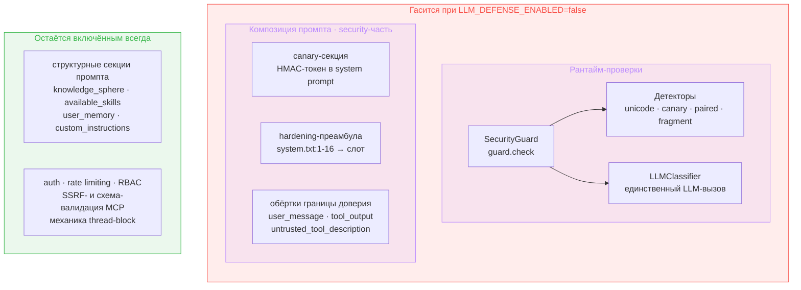
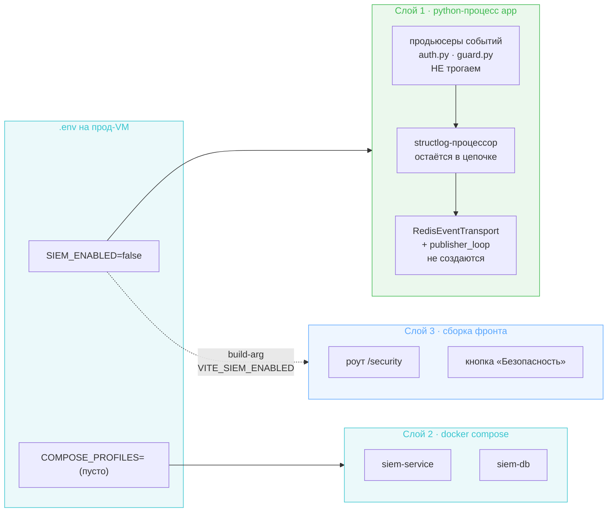
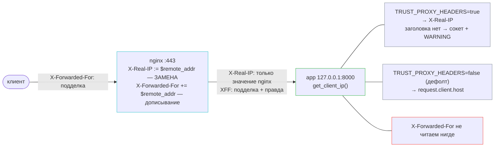
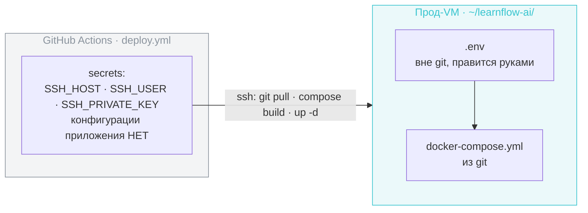

# Design Brief: chore-001 (B) — Prod-closing: kill-switches + деплой в main

Итерация закрывает прод перед merge `develop` → `main`: выключает в проде две исследовательские подсистемы (inline LLM-защита, SIEM), чинит дефект доверия proxy-заголовкам и вычищает прод-образы. Продуктовая функциональность и обычная app-security (auth, rate limiting, RBAC) не затрагиваются.

Ветка: `dogf/chore-001-prod-closing`. Tasklist-запись: [tasklist-dogfooding.md](../../../tasklist-dogfooding.md) § chore-001.

## Принцип разделения конфигурации

Решение, общее для обоих kill-switch'ей и определяющее форму всех настроек итерации:

**Env-переменная — операционный тумблер «включено в этом окружении или нет», один на подсистему. Гранулярность для исследовательских прогонов живёт в `configs/security.yaml`.**

Отсюда: env-поверхность итерации — три новые переменные (`LLM_DEFENSE_ENABLED`, `SIEM_ENABLED`, `TRUST_PROXY_HEADERS`) плюс штатная `COMPOSE_PROFILES`. Существующий per-checkpoint `classifier_enabled` в `configs/security.yaml` остаётся как есть — не расширяем и не выпиливаем.

---

## 1. Kill-switch inline LLM-защиты

### Что гасим

Подсистема распадается на два блока: рантайм-проверки (`SecurityGuard` с детекторами и LLM-классификатором) и security-часть композиции промпта. Под тумблер уходят оба; структурные секции системного промпта не трогаются никогда.

Обоснование по canary: детектор утечки токена живёт внутри guard'а. Оставить генерацию токена при выключенном guard означало бы вшивать секрет в каждый системный промпт и никогда не проверять, утёк ли он, — строго хуже, чем не вшивать.

Обоснование по hardening-преамбуле: помимо ~100 токенов в каждом запросе она запрещает агенту называть внутренние инструменты и требует «описывать возможности функционально». В продукте для техспикеров это исследовательский артефакт, портящий продуктовое поведение.

### Точка врезки

Ключевой факт: seam `SecurityGuard | None` уже существует в коде — все потребители guard'а (граф, subagent-граф, `RuntimeSecurityEnforcer`, четыре add-time сервиса) написаны с проверкой на `None`. Достаточно не строить guard в composition root.

| Что | Где | Действие |
|-----|-----|----------|
| Сборка guard'а | `backend/app/main.py:399-448` и `:535` (вызывается дважды из-за цикла `run_subagent` ↔ корпус) | под флагом не создавать guard-LLM, классификатор, детекторы; `app.state.security_guard = None` — согласованно в обеих ветках |
| Startup-валидация built-in MCP | `backend/app/main.py:114-165`, `guard.check` на `:143` | **не** скипать функцию целиком: fetch-часть и отсев по сетевым ошибкам должны остаться; обходится только вызов guard'а |
| Депс guard'а | `backend/app/api/deps.py:42` | добавить fallback на `None` (единственный депс без `getattr`-защиты) |
| SSE review-события | `backend/app/agent/runner.py:281-286` | не эмитить `final_output_review_started` / `..._complete` при выключенной защите — иначе фронт показывает фазу «проверка ответа», которой нет |
| canary-токен | `backend/app/agent/security/canary.py:5`, `prompt_builder.py:32` | не генерировать токен; `render_canary_section` уже возвращает `""` для пустого токена — новой механики не нужно |
| hardening-преамбула | `configs/prompts/system.txt:1-16` | вынести в слот `{{ hardening_section }}` по образцу `{{ canary_section }}` — один промпт вместо двух вариантов в Langfuse |
| Обёртки границы доверия | `configs/prompt_fragments.yaml` | собирать `PromptFragmentsConfig` без security-ключей; `wrap` и `_wrap_section` (`agent/config.py:96-109`, `prompt_builder.py:24`) уже возвращают текст как есть при отсутствии ключа — правок в местах вызова нет |

### Принятые следствия

- Треды с `security_blocked=true` остаются заблокированными и при выключенной защите. Это дизайн, а не недоделка: блокировка — исторический факт, зафиксированный когда защита работала.
- Пропадают guard-события в SIEM (`AGENT_GUARD_*`), Langfuse-observation'ы guard'а и score `security_verdict`, cost guard-модели. Вокабуляр `siem-contracts` не меняется — константы остаются, их просто никто не эмитит.
- Fail-open в guard'е (`guard.py:149-200`: ошибка или таймаут LLM → `CLEAN`) означает, что «выключено» и «LLM недоступен» пропускают трафик одинаково. Разница в том, что fail-open всё ещё платит таймаутом и эмитит `AGENT_GUARD_DEGRADED` — это подтверждает, что правильная точка тумблера «не строить guard», а не «заставить классификатор отвечать CLEAN».
- Флаг читается один раз в lifespan → переключение требует рестарта контейнера.

---

## 2. SIEM kill-switch

Развилка «kill-switch или допил до продакшна» решена архитектором в пользу kill-switch: SIEM реализован под учебную цель и её закрывает, для продакшна не годится (невалидируемый `config` правил, RBAC-guard пропускает не-админов). Возврат — при реальной потребности (диплом, прод-нагрузка), см. backlog «SIEM → SOC evolution».

### Три слоя, три механизма

Одной точкой погасить нельзя: слои исполняются разными системами, и ни одна не видит переменные другой.

| Слой | Точка | Механизм |
|------|-------|----------|
| Эмиссия | `backend/app/main.py:317-325` (создание transport + `publisher_loop`), shutdown `:609-617` уже защищён `hasattr` | под `SIEM_ENABLED` не создавать transport → holder пуст → процессор молча дропает всё. Продьюсеры и процессор не трогаются |
| Контейнеры | `docker-compose.yml:103-163` | `profiles: ["siem"]` на `siem-service` и `siem-db`; в проде `COMPOSE_PROFILES` пуст → сервисы не поднимаются **и не собираются** |
| UI | `frontend/src/app/router.tsx:35`, `frontend/src/app/components/Sidebar.tsx:96` | build-time `VITE_SIEM_ENABLED`; требует `ARG`/`ENV` в стадии `frontend-build` (`backend/Dockerfile:1-7`) и `build.args` в compose |
| Эндпоинты SIEM в backend | — | гасить нечего: их не существует, back-channel из ADR-018 не реализован |

Две строки в `.env` — один смысловой переключатель; `COMPOSE_PROFILES` — механизм самого compose, его нельзя вывести из `SIEM_ENABLED`.

### Границы и следствия

- **Redis не выключаем.** Тот же инстанс питает `TraceStore` (Langfuse feedback): `deps.py:107`, `routes/feedback.py`, `services/chat.py`, `storage/trace_store.py`. Отключение SIEM через пустой `redis_url` сломало бы feedback.
- Volume `siem_pgdata` сохраняется — данные не теряются, обратное включение стоит строки в `.env`.
- Код, тесты, mypy, import-linter и arch-checker (`tools/arch-checker`: `problem_mirrors`, `middleware_order`) остаются на месте. Kill-switch — чисто runtime/deploy-уровня; иначе теряется обратимость, ради которой выбран вариант A.
- CI (`ci.yml`) не трогается: там `uv sync --all-packages` с dev-группой — так и надо.
- Baseline-корреляции `injection_spike`, `targeted_user_attack`, `mass_suspicious` завязаны на `agent.guard.%` и станут no-op ещё и от первого kill-switch'а. `brute_force_auth` продолжила бы работать, но SIEM выключен целиком. Правила остаются в БД как есть.

---

## 3. Доверие proxy-заголовкам

### Дефект

`backend/app/api/routes/auth.py:76-80` и `backend/app/main.py:644-661` берут **левый** элемент `X-Forwarded-For`. Nginx настроен на `$proxy_add_x_forwarded_for`, то есть **дописывает** свой `$remote_addr` в конец, не трогая присланное клиентом. Клиент может прислать сколько угодно значений (одним заголовком через запятую или несколькими заголовками — nginx их склеит), поэтому левый элемент полностью подконтролен клиенту.

Следствия: обход per-IP rate-лимитов (`register:{ip}` 3/час, `refresh:{ip}` 10/мин — воспроизведено в feat-002 и feat-004), подмена `ip` в логах и SIEM-событиях.

Инвариант, из которого следует решение: **число элементов слева контролирует клиент; прокси всегда дописывает ровно один элемент справа.**

### Решение: `X-Real-IP` под явным флагом

`proxy_set_header X-Real-IP $remote_addr` **заменяет** заголовок целиком, поэтому присланное клиентом значение уничтожается: в `X-Real-IP` нет ни одного байта, подконтрольного атакующему. `request.client.host` — адрес TCP-соединения, каким его видит приложение (в docker — gateway bridge-сети): бесполезен как клиентский IP, но неподделываем, поэтому годится как безопасный fallback.

**Почему не «N-й элемент XFF справа».** Фиксированный отступ корректен, только если весь трафик идёт одним путём с одинаковым числом дописывающих прокси. При смешанной топологии (часть трафика через CDN, часть напрямую на nginx) запросы короткого пути содержат меньше настоящих элементов, и отступ `N` попадает **внутрь подконтрольной клиенту части** — дыра открывается заново. `X-Real-IP` в той же ситуации может дать неверный ответ (адрес прокси), но никогда — выбранный атакующим. Разница между «неточно» и «управляется атакующим» решает выбор. Аргумент «XFF легче адаптировать при росте топологии» снимается тем, что чтение IP централизуется в одном хелпере: сменить источник потом — правка одной функции.

**Дефолт `false`** выбран по характеру отказа. Забыли выставить на проде → все клиенты схлопываются в адрес docker-gateway и упираются в общий rate-limit: шумно, видно в первые минуты. Обратный дефолт дал бы тихую уязвимость в любом развёртывании без nginx.

| Что | Где | Действие |
|-----|-----|----------|
| Хелпер | новый, единая точка чтения клиентского IP | `X-Real-IP` при `TRUST_PROXY_HEADERS=true`, иначе сокет; заголовок отсутствует при включённом доверии → сокет + WARNING (делает дрейф nginx видимым) |
| Rate-limit и auth-события | `backend/app/api/routes/auth.py:76-80`, вызовы `:128`, `:168`, `:207` | заменить `_get_client_ip` на хелпер |
| structlog contextvar `ip` | `backend/app/main.py:644-661` | заменить дублирующую логику на хелпер |
| Правило | `doc/tech/conventions.md` | «`X-Forwarded-For` в коде не читаем» — grep-абельный запрет, снимающий риск повторного наивного `xff.split(",")[0]` |

### Референсная копия nginx-конфига

Корневая проблема шире выбора заголовка: безопасность периметра держится на файле `/etc/nginx/sites-enabled/learnflow`, которого нет ни в репозитории, ни в документации, правится он руками и уже один раз разъезжался (`sites-available` против `sites-enabled`, см. summary `production/chore-001`).

Кладём санитизированную копию в `doc/tech/setup/production.md` (директория уже существует): плейсхолдеры вместо `server_name` и путей к сертификатам, содержимое ключей не переносится. Документируется контракт: ingress ровно один; `X-Real-IP` устанавливается, а не дописывается; приложение доверяет ему только при `TRUST_PROXY_HEADERS=true`; порты приложения опубликованы на loopback, обойти nginx снаружи нельзя.

Новый документ добавляется в навигацию: `doc/index.md:76-77`, блок «Setup manuals».

Отмечено при чтении конфига: `location = /health` не содержит ни одного `proxy_set_header`, то есть health-запросы приходят без proxy-заголовков вообще. С fallback на сокет это безопасно; расхождение фиксируется в референсной копии.

---

## 4. Прод-образы без dev-зависимостей

Две независимые проблемы в `backend/Dockerfile` (`:21-30`, `:43-44`) и `services/siem-service/Dockerfile` (`:12-21`, `:35-36`):

- `uv sync --locked --all-packages` без `--no-dev` ставит dev-группу: `pytest`, `mypy`, `ruff`, `pre-commit`, `learnflow-testing` → `testcontainers` с docker SDK внутри прод-контейнера. Это не только вес, но и поверхность атаки.
- `--all-packages` ставит всех членов workspace, поэтому в образ `siem-service` заезжает весь стек backend'а (`langchain`, `langgraph`, `langfuse`, `psycopg`), хотя его код туда не копируется.

Правка парная, иначе бесполезна: `uv run` в `entrypoint.sh` обоих сервисов пересинкает окружение при старте контейнера и возвращает dev-группу обратно.

| Файл | Правка |
|------|--------|
| `backend/Dockerfile` | `--no-dev` + `--package learnflow-backend` вместо `--all-packages` |
| `services/siem-service/Dockerfile` | `--no-dev` + `--package siem-service` |
| `backend/entrypoint.sh`, `services/siem-service/entrypoint.sh` | подавить пересинк (`UV_NO_SYNC=1` либо прямой вызов из `/app/.venv/bin`) |

Имена пакетов workspace сверены: `learnflow-backend`, `siem-service`, `siem-contracts`, `learnflow-testing`. `alembic` и `uvicorn` объявлены в основных зависимостях обоих пакетов — рантайм от `--no-dev` не ломается. Расхождение флагов между CI и Docker осознанное и фиксируется комментарием.

---

## Env-гигиена

Все четыре файла обновляются одновременно (`Settings`, `.env.example`, `.env.local.example`, `docker-compose.yml`).

| Переменная | Тип, дефолт | Назначение |
|------------|-------------|------------|
| `LLM_DEFENSE_ENABLED` | `bool`, `true` | inline LLM-защита: guard (детекторы + классификатор) и security-часть композиции промпта |
| `SIEM_ENABLED` | `bool`, `true` | эмиссия security-событий в Redis Stream; пробрасывается в `VITE_SIEM_ENABLED` как build-arg |
| `TRUST_PROXY_HEADERS` | `bool`, `false` | доверять ли `X-Real-IP` от прокси |
| `COMPOSE_PROFILES` | штатная переменная compose | `siem` в dev, пусто в проде |

Дефолты `true` у kill-switch'ей означают, что dev ведёт себя как сейчас, а прод выключает подсистемы явно. Забыть правку прод-`.env` = не достичь цели итерации, но ничего не сломать — безопасный характер отказа.

### Где физически живут переменные

Следствия, важные для эксплуатации: переключение тумблера — не деплой, а правка `.env` на VM плюс `docker compose up -d`; состояние прода не выводится из репозитория; прод-`.env` дрейфует от `.env.example` молча, поэтому его обновление входит в чек-лист завершения. Фронтовый флаг вшивается в бандл при сборке — его смена требует `docker compose build`, а не рестарта.

---

## Ручные шаги на прод-VM при выкатке

Автоматизации не подлежат, входят в чек-лист завершения итерации:

1. Остановить работающие SIEM-контейнеры **до** обновления: `docker compose --profile siem down`. После перевода сервисов в профиль compose перестаёт ими управлять, а `restart: unless-stopped` оставит их работать.
2. Обновить `~/learnflow-ai/.env`: три новых переменных плюс пустой `COMPOSE_PROFILES`.
3. Убедиться, что nginx-конфиг соответствует референсной копии (в частности, `proxy_set_header X-Real-IP $remote_addr` присутствует) — от этого зависит корректность `TRUST_PROXY_HEADERS=true`.

## Что НЕ входит в scope

- Допил SIEM до продакшна (валидация правил, рабочий RBAC, активное реагирование) — вариант B, возврат при реальной потребности.
- Механизм разблокировки тредов с `security_blocked=true`.
- Расширение вокабуляра `siem-contracts` и починка семи логов с `security_event=True` без `event_type` (`tool_guards.py:114,174`, `runtime_security.py:220`, `services/{skill_context,sphere,mcp_server,user_memory}.py`). Процессор их дропает; теряется подтверждение блокировки, но само обнаружение эмитится из `guard.py` с корректным `event_type` — это потеря избыточности, а не слепое пятно. Чинить в итерации, которая подсистему выключает, смысла нет.
- Выпиливание per-checkpoint `classifier_enabled` из `SecurityConfig` — решено оставить как есть.
- Удаление кода, тестов и arch-checks SIEM.

## Сопутствующие правки

- `.env.example:107`: `VITE_SIEM_API_URL=http://localhost:8001/siem/api` → `http://localhost:8001/api`. В проде nginx срезает префикс (`location /siem/` с `proxy_pass ...:8001/`), поэтому дефолт фронта `/siem/api` верен; сломан только dev-пример, где nginx нет. Однострочник, снимающий ложный след при будущей реактивации.
- `doc/tech/siem-service.md:147-156`: пути REST перечислены без префикса `/api` — дрейф от `APIRouter(prefix="/api/security")`.
