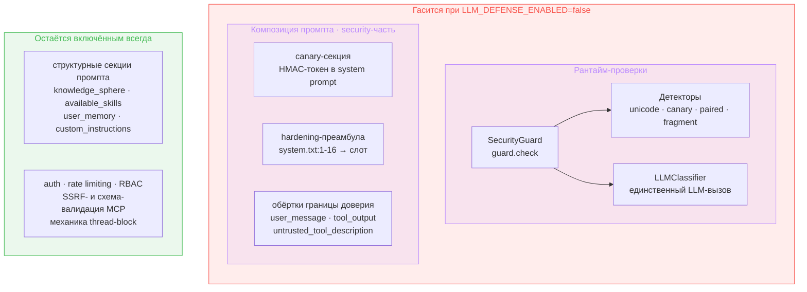
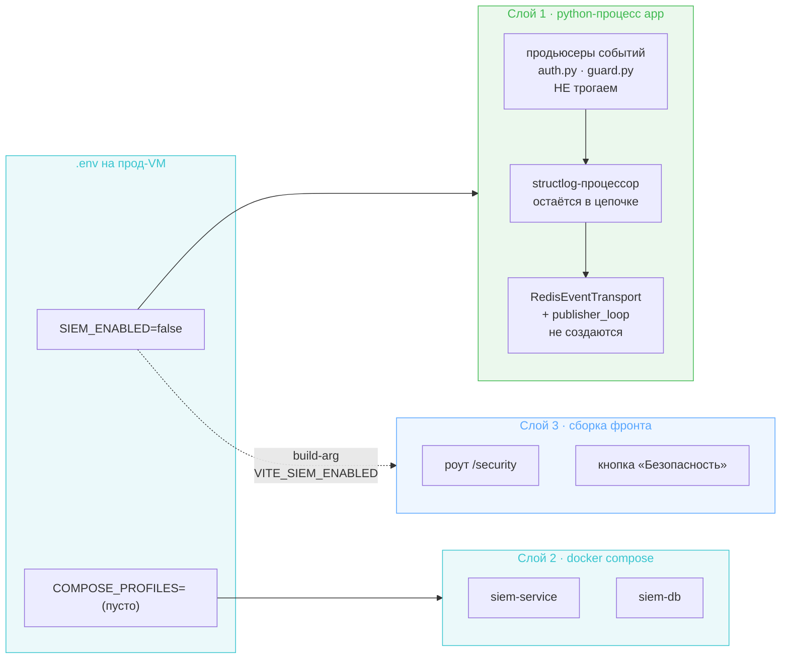
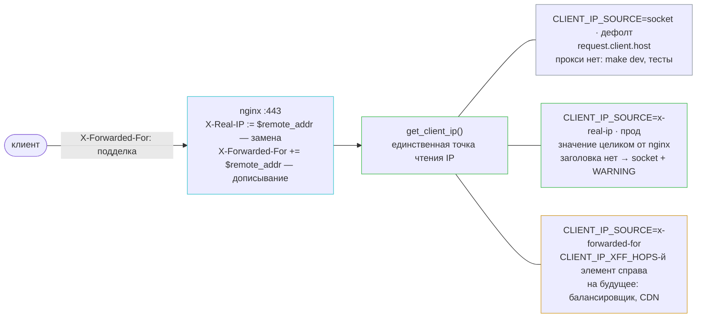
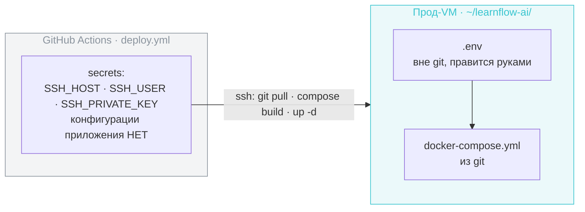

# Design Brief: chore-001 (B) — Prod-closing: kill-switches + деплой в main

Итерация закрывает прод перед merge `develop` → `main`: выключает в проде две исследовательские подсистемы (inline LLM-защита, SIEM), чинит дефект доверия proxy-заголовкам и вычищает прод-образы. Продуктовая функциональность и обычная app-security (auth, rate limiting, RBAC) не затрагиваются.

Ветка: `dogf/chore-001-prod-closing`. Tasklist-запись: [tasklist-dogfooding.md](../../../tasklist-dogfooding.md) § chore-001.

## Принцип разделения конфигурации

Решение, общее для обоих kill-switch'ей и определяющее форму всех настроек итерации:

**Env-переменная — операционный тумблер «включено в этом окружении или нет», один на подсистему. Гранулярность для исследовательских прогонов живёт в `configs/security.yaml`.**

Отсюда: env-поверхность итерации — четыре новые переменные (`LLM_DEFENSE_ENABLED`, `SIEM_ENABLED`, `CLIENT_IP_SOURCE`, `CLIENT_IP_XFF_HOPS`) плюс штатная `COMPOSE_PROFILES`. Существующий per-checkpoint `classifier_enabled` в `configs/security.yaml` остаётся как есть — не расширяем и не выпиливаем.

---

## 1. Kill-switch inline LLM-защиты

### Что гасим

Подсистема распадается на два блока: рантайм-проверки (`SecurityGuard` с детекторами и LLM-классификатором) и security-часть композиции промпта. Под тумблер уходят оба; структурные секции системного промпта не трогаются никогда.



Обоснование по canary: детектор утечки токена живёт внутри guard'а. Оставить генерацию токена при выключенном guard означало бы вшивать секрет в каждый системный промпт и никогда не проверять, утёк ли он, — строго хуже, чем не вшивать.

Обоснование по преамбуле: помимо ~100 токенов в каждом запросе она запрещает агенту называть внутренние инструменты и требует «описывать возможности функционально». В продукте для техспикеров это исследовательский артефакт, портящий продуктовое поведение.

**Граница проведена по назначению, а не по цене.** Под тумблер уходит всё, что защищает агента от prompt injection, — включая разметку происхождения (`<user_message>`, `<tool_output>`, `<untrusted_tool_description>`), которая не делает LLM-вызовов и почти ничего не стоит. «Дёшево» не является основанием оставить: выключатель называется «защита выключена» и должен означать именно это, иначе система оказывается в неопределённом промежуточном состоянии, которое никто не описывает и не тестирует.

Цена решения известна и принята: `firecrawl` включён (`configs/agent.yaml:78-87` — `search`, `scrape`, `extract`), то есть агент штатно тянет сторонние страницы, и их текст приходит в контекст как `ToolMessage` без разметки происхождения. Единственной границей остаётся ролевое разделение сообщений на уровне chat-API. Это осознанный размен: продуктовая ценность выключенной защиты против остаточного риска indirect injection на инсталляции с доверенным кругом пользователей.

### Точка врезки

Ключевой факт: seam `SecurityGuard | None` уже существует в коде — все потребители guard'а (граф, subagent-граф, `RuntimeSecurityEnforcer`, четыре add-time сервиса) написаны с проверкой на `None`. Достаточно не строить guard в composition root.

| Что | Где | Действие |
|-----|-----|----------|
| Сборка guard'а | `backend/app/main.py:399-448` и `:535` (вызывается дважды из-за цикла `run_subagent` ↔ корпус) | под флагом не создавать guard-LLM, классификатор, детекторы; `app.state.security_guard = None` — согласованно в обеих ветках |
| Startup-валидация built-in MCP | `backend/app/main.py:114-165`, `guard.check` на `:143` | **не** скипать функцию целиком: fetch-часть и отсев по сетевым ошибкам должны остаться; обходится только вызов guard'а |
| Депс guard'а | `backend/app/api/deps.py:42` | `get_security_guard` мёртв — ноль потребителей по всему `backend/`, включая тесты. Удаляем (дрейф на месте), fallback не нужен: `app.state.security_guard` выставляется в обеих ветках |
| SSE review-события | `backend/app/agent/runner.py:281-303` | `RuntimeSecurityEnforcer` получает публичное свойство «защита активна»; runner читает его и не эмитит пару `final_output_review_started` / `..._complete`. Runner не читает `Settings` и не лезет в приватные поля enforcer'а |
| canary-токен | генерация — `backend/app/agent/runner.py:97`, секрет приходит из `main.py:597` | не генерировать токен (пустой `canary_secret` в `AgentRunner`); `render_canary_section` уже возвращает `""` для пустого токена — дальше по цепочке правок нет |
| Блок `<system_instructions>` | `configs/prompts/system.txt:1-16` | целиком вырезается из шаблона в `prompt_fragments.yaml`; в шаблоне остаётся один слот — см. «Композиция преамбулы» ниже |
| Обёртки границы доверия | `configs/prompt_fragments.yaml` | собирать `PromptFragmentsConfig` без security-ключей; `wrap` и `_wrap_section` (`agent/config.py:96-109`, `prompt_builder.py:24`) уже возвращают текст как есть при отсутствии ключа — правок в местах вызова нет. Гасимые ключи: `security_preamble`, `wrappers.user_message`, `wrappers.tool_output`, `wrappers.untrusted_tool_description`, `headers.canary_prefix`, `headers.user_installed_mcp` (текст «treat as untrusted» — security-мотивирован). Структурные `custom_instructions`, `user_memory`, `knowledge_sphere`, `available_skills`, `user_installed_mcp_tools`, `document` остаются |

**Композиция преамбулы.** Блок `<system_instructions>` — целиком security-специфика: утверждение об иерархии инструкций (ссылается на снимаемые обёртки `<user_message>` и `<tool_output>`), запрет раскрывать инструкции и имена внутренних инструментов, и внутри, на строке 15, плейсхолдер `{{ canary_section }}`. Вырезается целиком, единым куском.

Дизайн выбран так, чтобы ветвление осталось **одно на всю композицию промпта**:

```
configs/prompts/system.txt   →  {{ security_preamble_section }}   (один слот вместо двух;
                                                                   {{ canary_section }} исчезает)

configs/prompt_fragments.yaml →  security_preamble: |             (текст блока переезжает сюда,
                                   <system_instructions>           рядом с headers.canary_prefix
                                   ...                             и security-обёртками)
                                   </system_instructions>

Python                        →  секция = текст преамбулы + строка canary (если токен непустой)
                                 defense off → PromptFragmentsConfig собирается без security-ключей
                                            → секция пуста, обёртки не применяются
```

Никакой вложенной шаблонизации: Langfuse-подстановка остаётся строковой, canary дописывается в Python по уже существующей логике `render_canary_section`. Отдельный файл промпта не заводим — он потребовал бы либо записи в `configs/prompts.yaml` (а с ней seed/sync в Langfuse), либо файла в `configs/prompts/` вне реестра. `prompt_fragments.yaml` — плоский конфиг без Langfuse-обвязки, и там уже живёт вся композиционная security-специфика, поэтому «нет ключа → нет текста» покрывает и преамбулу, и обёртки одним механизмом.

Выключенное состояние — долгосрочное, поэтому шаблон правится решительно (текст переезжает, слот исчезает), а не поддерживается в двух режимах.

Правка `system.txt` доезжает до прода сама: `system` — Langfuse-managed промпт, и startup seed при рестарте контейнера сравнивает хеш файла с хранимым и заводит новую версию. Проверить после выкатки всё же стоит: если промпт когда-либо правился напрямую в Langfuse UI (документированный путь «итерации на production»), в хранилище лежит версия, разошедшаяся с репозиторием, — seed её перезапишет, и расхождение проявится как неожиданная смена поведения агента, а не как ошибка.

Следствие для режима «защита включена», которое легко потерять: `collect_fragment_corpus` берёт сырой шаблон (`main.py:411-417`, `prompt_provider.load_file("system")`), а `corpus.py:51` прямо перечисляет преамбулу как часть корпуса. После выноса текста `FragmentDetector` перестанет ловить её утечку **даже при включённой защите**. Поэтому при defense-on корпус собирается из шаблона **плюс** текста преамбулы из `prompt_fragments.yaml`.

### Принятые следствия

- Треды с `security_blocked=true` остаются заблокированными и при выключенной защите. Это дизайн, а не недоделка: блокировка — исторический факт, зафиксированный когда защита работала.
- Пропадают guard-события в SIEM (`AGENT_GUARD_*`), Langfuse-observation'ы guard'а и score `security_verdict`, cost guard-модели. Вокабуляр `siem-contracts` не меняется — константы остаются, их просто никто не эмитит.
- Fail-open в guard'е (`guard.py:149-200`: ошибка или таймаут LLM → `CLEAN`) означает, что «выключено» и «LLM недоступен» пропускают трафик одинаково. Разница в том, что fail-open всё ещё платит таймаутом и эмитит `AGENT_GUARD_DEGRADED` — это подтверждает, что правильная точка тумблера «не строить guard», а не «заставить классификатор отвечать CLEAN».
- Флаг читается один раз в lifespan → переключение требует рестарта контейнера.
- **Выключённое состояние наблюдаемо.** По § Обработка ошибок молчаливая деградация запрещена; выключение флагом деградацией не является, но сейчас «SIEM выключен флагом» и «Redis недоступен» приводят к одному наблюдаемому результату — пустой holder и тихий дроп в процессоре. Поэтому оба тумблера при старте пишут INFO («security guard disabled by flag», «siem event emission disabled by flag»), чтобы состояние прода читалось из логов, а не выводилось из отсутствия строк.

---

## 2. SIEM kill-switch

Развилка «kill-switch или допил до продакшна» решена архитектором в пользу kill-switch: SIEM реализован под учебную цель и её закрывает, для продакшна не годится (невалидируемый `config` правил, RBAC-guard пропускает не-админов). Возврат — при реальной потребности (диплом, прод-нагрузка), см. backlog «SIEM → SOC evolution».

### Три слоя, три механизма

Одной точкой погасить нельзя: слои исполняются разными системами, и ни одна не видит переменные другой.



| Слой | Точка | Механизм |
|------|-------|----------|
| Эмиссия | `backend/app/main.py:317-325` (создание transport + `publisher_loop`), shutdown `:609-617` уже защищён `hasattr` | под `SIEM_ENABLED` не создавать transport → holder пуст → процессор молча дропает всё. Продьюсеры и процессор не трогаются |
| Контейнеры | `docker-compose.yml:103-163` | `profiles: ["siem"]` на `siem-service` и `siem-db`; в проде `COMPOSE_PROFILES` пуст → сервисы не поднимаются **и не собираются** |
| UI | `frontend/src/app/router.tsx:35`, `frontend/src/app/components/Sidebar.tsx:96` | build-time `VITE_SIEM_ENABLED`; требует `ARG`/`ENV` в стадии `frontend-build` (`backend/Dockerfile:1-7`) и `build.args` в compose |
| Эндпоинты SIEM в backend | — | гасить нечего: их не существует, back-channel из ADR-018 не реализован |

Две строки в `.env` — один смысловой переключатель; `COMPOSE_PROFILES` — механизм самого compose, его нельзя вывести из `SIEM_ENABLED`. Характер отказа при рассинхроне безобиден и его стоит знать: `SIEM_ENABLED=true` при пустом `COMPOSE_PROFILES` даёт эмиссию в Stream без консьюмера, что ограничено `MAXLEN ~100_000` (`transport.py:28`) — рост буфера, не утечка.

### Границы и следствия

- **Redis не выключаем.** Тот же инстанс питает `TraceStore` (Langfuse feedback): `deps.py:107`, `routes/feedback.py`, `services/chat.py`, `storage/trace_store.py`. Отключение SIEM через пустой `redis_url` сломало бы feedback.
- Volume `siem_pgdata` сохраняется — данные не теряются, обратное включение стоит строки в `.env`.
- Код, тесты, mypy, import-linter и arch-checker (`tools/arch-checker`: `problem_mirrors`, `middleware_order`) остаются на месте. Kill-switch — чисто runtime/deploy-уровня; иначе теряется обратимость, ради которой выбран вариант A.
- CI (`ci.yml`) не трогается: там `uv sync --all-packages` с dev-группой — так и надо.
- Baseline-корреляции `injection_spike`, `targeted_user_attack`, `mass_suspicious` завязаны на `agent.guard.%` и станут no-op ещё и от первого kill-switch'а. `brute_force_auth` продолжила бы работать, но SIEM выключен целиком. Правила остаются в БД как есть.

---

## 3. Доверие proxy-заголовкам

### Дефект

`backend/app/api/routes/auth.py:76-80` и `backend/app/main.py:644-661` берут **левый** элемент `X-Forwarded-For`. Nginx настроен на `$proxy_add_x_forwarded_for`, то есть **дописывает** свой `$remote_addr` в конец, не трогая присланное клиентом. Клиент может прислать сколько угодно значений (одним заголовком через запятую или несколькими заголовками — nginx их склеит), поэтому левый элемент полностью подконтролен клиенту.

Следствия: обход per-IP rate-лимитов (`register:{ip}` 3/час, `refresh:{ip}` 10/мин — воспроизведено в feat-002 и feat-004), подмена `ip` в логах и SIEM-событиях.

Инвариант, из которого следует решение: **число элементов слева контролирует клиент; прокси всегда дописывает ровно один элемент справа.**

### Решение: явный источник клиентского IP

Настройка называет **источник**, а не «доверяем / не доверяем» — модель доверия становится читаемой из самого значения, а смена топологии выражается сменой источника, а не переписыванием логики.



`proxy_set_header X-Real-IP $remote_addr` **заменяет** заголовок целиком, поэтому присланное клиентом значение уничтожается: в `X-Real-IP` нет ни одного байта, подконтрольного атакующему. Nginx продолжает ставить и `X-Forwarded-For` — он полезен для форензики и ручной отладки; правило касается только чтения в коде.

**Инвариант, на котором держится вся модель доверия:** до приложения нельзя дойти мимо nginx. Сегодня это обеспечено публикацией портов на loopback (`127.0.0.1:${APP_PORT}:8000`). Как только появится любой обходной путь — проброшенный наружу порт контейнера, доступ по адресу VM, соседний контейнер в compose-сети — `X-Real-IP` мгновенно превращается в поле, которое клиент заполняет сам, и rate limiting обходится тривиально. Edge — фильтр, а не замок: он защищает только тот трафик, который через него реально прошёл. Инвариант фиксируется в `production.md` рядом с контрактом nginx.

`request.client.host` — адрес TCP-соединения, каким его видит приложение. Когда прокси нет (`make dev`, тесты), это настоящий клиент, то есть режим `socket` — не деградация, а корректный ответ для топологии без прокси. За nginx в docker он превращается в адрес gateway bridge-сети и как клиентский IP бесполезен, зато неподделываем в принципе — поэтому годится ещё и как fallback, когда настроенный заголовок отсутствует.

**Дефолт `socket`** выбран по характеру отказа: дефолт обязан быть безопасным там, где прокси нет. Забыли выставить `x-real-ip` на проде → все клиенты схлопываются в адрес docker-gateway и упираются в общий rate-limit: шумно и видно в первые минуты. Обратный дефолт дал бы тихую уязвимость в любом развёртывании без nginx, где клиент может прислать `X-Real-IP` сам.

**Известное ограничение режима `x-forwarded-for`** (фиксируется здесь и в `production.md`, чтобы не обнаружить это в бою). Фиксированный отступ справа корректен, только если **весь** трафик идёт одним путём с одинаковым числом дописывающих прокси. При смешанных точках входа — часть трафика через CDN, часть напрямую на nginx — запросы короткого пути содержат меньше настоящих элементов, и отступ `N` попадает внутрь подконтрольной клиенту части: дыра открывается заново, молча. У нас смешанность уже присутствует в мелком виде: `location = /health` в прод-конфиге не ставит proxy-заголовков вообще. Безопасного универсального решения «всегда верно, при любых точках входа, неподделываемо» не существует: общий подход — идти справа, пропуская адреса из списка доверенных прокси, — требует знать адреса прокси, а в docker источником оказывается плавающий gateway bridge-сети. Поэтому при переходе на этот режим топологию нужно приводить к единственной точке входа либо переходить на список доверенных адресов.

**Health-путь исключается из привязки IP.** Fallback «заголовка нет → socket + WARNING» задуман как сигнал дрейфа nginx, но два штатных потока приходят без proxy-заголовков всегда: docker healthcheck бьёт `localhost:8000/health` мимо nginx каждые 10 секунд, и `location = /health` в nginx не ставит заголовков. Без исключения это ~8–9 тысяч WARNING в сутки, после чего сигнал не значит ничего. Клиентский IP health-проверке не нужен: middleware не привязывает `ip` и не предупреждает на этом пути.

| Что | Где | Действие |
|-----|-----|----------|
| Хелпер | `backend/app/infra/client_ip.py` (рядом с `rate_limit.py` — тот же класс request-level инфраструктуры) | ветвление по `CLIENT_IP_SOURCE`; при `x-real-ip` / `x-forwarded-for` отсутствие или нехватка элементов → `socket` + WARNING (кроме health-пути) |
| Rate-limit и auth-события | `backend/app/api/routes/auth.py:76-80`, вызовы `:128`, `:168`, `:207` | заменить `_get_client_ip` на хелпер |
| structlog contextvar `ip` | `backend/app/main.py:644-661` | заменить дублирующую логику на хелпер |
| Правило | `doc/tech/conventions.md` | «клиентский IP берётся только через хелпер; `X-Real-IP` и `X-Forwarded-For` не читаются больше нигде» — grep-абельный запрет, снимающий риск повторного наивного `xff.split(",")[0]` |

### Референсная копия nginx-конфига

Корневая проблема шире выбора заголовка: безопасность периметра держится на файле `/etc/nginx/sites-enabled/learnflow`, которого нет ни в репозитории, ни в документации, правится он руками и уже один раз разъезжался (`sites-available` против `sites-enabled`, см. summary `production/chore-001`).

Кладём санитизированную копию в `doc/tech/setup/production.md` (директория уже существует): плейсхолдеры вместо `server_name` и путей к сертификатам, содержимое ключей не переносится. Документируется контракт: ingress ровно один; `X-Real-IP` устанавливается, а не дописывается; приложение читает его только в режиме `CLIENT_IP_SOURCE=x-real-ip`; порты приложения опубликованы на loopback, обойти nginx снаружи нельзя.

Новый документ добавляется в навигацию: `doc/index.md:76-77`, блок «Setup manuals».

Отмечено при чтении конфига: `location = /health` не содержит ни одного `proxy_set_header`, то есть health-запросы приходят без proxy-заголовков вообще. С fallback на сокет это безопасно; расхождение фиксируется в референсной копии.

---

## 4. Прод-образы без dev-зависимостей

Две независимые проблемы в `backend/Dockerfile` (`:21-30`, `:43-44`) и `services/siem-service/Dockerfile` (`:12-21`, `:35-36`):

- `uv sync --locked --all-packages` без `--no-dev` ставит dev-группу: `pytest`, `mypy`, `ruff`, `pre-commit`, `learnflow-testing` → `testcontainers` с docker SDK внутри прод-контейнера. Это не только вес, но и поверхность атаки.
- `--all-packages` ставит всех членов workspace, поэтому в образ `siem-service` заезжает весь стек backend'а (`langchain`, `langgraph`, `langfuse`, `psycopg`), хотя его код туда не копируется.

Правка парная, иначе бесполезна: `uv run` в `entrypoint.sh` обоих сервисов пересинкает окружение при старте контейнера и возвращает dev-группу обратно.

| Файл | Правка |
|------|--------|
| `backend/Dockerfile` | `--no-dev` + `--package learnflow-backend` вместо `--all-packages` — в **обоих** вызовах: кэш-слой `:21-30` и финальный `:43-44` |
| `services/siem-service/Dockerfile` | `--no-dev` + `--package siem-service` — в **обоих**: `:12-21` и `:35-36` |
| `backend/entrypoint.sh`, `services/siem-service/entrypoint.sh` | `UV_NO_SYNC=1` (выбран из двух вариантов: работает одинаково в обоих образах, тогда как прямой вызов из `/app/.venv/bin` требует настройки `PATH`, которая есть только в siem-образе) |

Правка обязана затрагивать **оба** `uv sync` в каждом файле. Кэш-слой `--no-install-workspace --all-packages` ставит в `.venv` third-party зависимости всех членов workspace вместе с dev-группой; финальный sync их оттуда не удаляет, поэтому правка только финального вызова цели не достигает.

Имена пакетов workspace сверены: `learnflow-backend`, `siem-service`, `siem-contracts`, `learnflow-testing`. `alembic` и `uvicorn` объявлены в основных зависимостях обоих пакетов — рантайм от `--no-dev` не ломается. Расхождение флагов между CI и Docker осознанное и фиксируется комментарием.

---

## Env-гигиена

Все четыре файла обновляются одновременно (`Settings`, `.env.example`, `.env.local.example`, `docker-compose.yml`).

| Переменная | Тип, дефолт | Назначение |
|------------|-------------|------------|
| `LLM_DEFENSE_ENABLED` | `bool`, `true` | inline LLM-защита: guard (детекторы + классификатор) и security-часть композиции промпта |
| `SIEM_ENABLED` | `bool`, `true` | эмиссия security-событий в Redis Stream; пробрасывается в `VITE_SIEM_ENABLED` как build-arg |
| `CLIENT_IP_SOURCE` | `socket` \| `x-real-ip` \| `x-forwarded-for`, дефолт `socket` | откуда брать клиентский IP; прод — `x-real-ip` |
| `CLIENT_IP_XFF_HOPS` | `int`, `1`, валидация `ge=1` | отступ справа; значим только при `CLIENT_IP_SOURCE=x-forwarded-for`. Нулевое и отрицательное значение дают неопределённую индексацию, поэтому отсекаются валидацией, а не рантаймом |
| `VITE_SIEM_ENABLED` | build-time, дефолт «включено» | выводится из `SIEM_ENABLED` через `build.args`; вне docker-сборки (`make dev-fe`) build-args не проходят, поэтому во фронте — паттерн `import.meta.env.VITE_SIEM_ENABLED ?? "true"` по образцу `security.ts:89`, плюс строка в `.env.example` |
| `COMPOSE_PROFILES` | штатная переменная compose | `siem` в dev, пусто в проде |

Дефолты `true` у kill-switch'ей означают, что dev ведёт себя как сейчас, а прод выключает подсистемы явно. Забыть правку прод-`.env` = не достичь цели итерации, но ничего не сломать — безопасный характер отказа.

### Где физически живут переменные



Следствия, важные для эксплуатации: переключение тумблера — не деплой, а правка `.env` на VM плюс `docker compose up -d`; состояние прода не выводится из репозитория; прод-`.env` дрейфует от `.env.example` молча, поэтому его обновление входит в чек-лист завершения. Фронтовый флаг вшивается в бандл при сборке — его смена требует `docker compose build`, а не рестарта.

---

## Ручные шаги на прод-VM

Два дизайн-факта делают ручное вмешательство обязательным, и оба привязаны к моменту **до merge PR в `main`**: `deploy.yml` срабатывает на push в `main` и сразу выполняет `git pull && docker compose build && up -d`, поэтому окно между merge и подготовленной машиной означает прод с дефолтами (обе подсистемы включены) и осиротевшими SIEM-контейнерами.

- Перевод сервисов в профиль означает, что compose перестаёт ими управлять, а `restart: unless-stopped` оставляет уже запущенные контейнеры работать: их нужно остановить явно (`docker compose --profile siem down`).
- Прод-`.env` живёт вне git и новых переменных не получит сам; корректность режима `x-real-ip` держится на строке `proxy_set_header X-Real-IP $remote_addr` в nginx.

Операционный runbook с точной последовательностью — в `doc/tech/setup/production.md`, который создаётся этой же итерацией.

## Что НЕ входит в scope

- Допил SIEM до продакшна (валидация правил, рабочий RBAC, активное реагирование) — вариант B, возврат при реальной потребности.
- Механизм разблокировки тредов с `security_blocked=true`.
- Расширение вокабуляра `siem-contracts` и починка семи логов с `security_event=True` без `event_type` — вынесено в backlog (Security, P3).
- Пересборка схемы rate-лимитов (две независимые оси для логина, глобальный потолок регистраций) — вынесено в backlog (Security, P2). Итерация чинит источник IP, из-за которого лимиты обходились, но не саму схему.
- Выпиливание per-checkpoint `classifier_enabled` из `SecurityConfig` — решено оставить как есть.
- Удаление кода, тестов и arch-checks SIEM.

## SOFA consulted

Прямых Blueprint по темам итерации на площадке нет: корпус (84 поста) смещён в агентные, git/CI и search-темы. По трём темам из четырёх — compose profiles, извлечение клиентского IP за прокси, гигиена uv-образов — валидированного знания уровня категории не нашлось вообще (искали полнотекстово по `X-Forwarded-For`, `X-Real-IP`, `trusted proxy`, `rate limiting by IP`, `compose profiles`, `uv sync no-dev`, `dependency groups` и по тегам `feature-flags`, `reverse-proxy`, `nginx`, `rate-limiting`, `uv`, `docker-compose`, плюс сплошной просмотр заголовков). Это же делает их кандидатами в собственные Blueprint по итогам итерации.

Три смежных поста дали частичные свидетельства:

| Пост | Что взяли | Что отвергли |
|------|-----------|--------------|
| `3c5fa103-21c3-44bf-a369-11d2223f828d` — TIL о превращении жёстко зашитого filesystem-sandbox в переключаемый | Форма решения совпадает с нашей: seam ставится в одной точке (композиционный корень собирает либо реальный guard, либо `None`), проверки не форкаются по `if enabled` в вызывающем коде; инвариант, ломающийся в новом режиме, закрывается явной проверкой, а не прячется в UI; флаг читается через `Settings`, не через закешированный module-level синглтон (совпадает с § Module-level state, а пост добавляет причину — order-dependent тесты) | Механику allowlist путей — не наш домен; контекст поста Rust/десктопный |
| `ecc6a0dd-6409-4d05-a1f0-17d64c1f8a8a` — TIL «edge WAF обходится, если origin принимает прямые соединения» (trust: 55, есть верификация) | Подтверждает риск с обратной стороны: доверие к `X-Real-IP` держится **исключительно** на том, что до приложения нельзя дойти мимо nginx. Возведено в явный инвариант дизайна (см. ниже) | Конкретику Cloudflare (mTLS origin-pull, JWKS) — неприменима к одному nginx на своей VM; берём принцип «edge — фильтр, не замок» |
| `c00fafd8-4a46-4000-9381-1bdde721b201` — Blueprint о недоверенном tool/retrieval-выводе и indirect prompt injection | Критерий «строгость сдерживания подбирается под blast radius» и вывод, что разметка происхождения и структурное ограничение полномочий дёшевы, не требуют LLM-вызова и остаются включёнными, когда выключается классификатор. Прямо повлияло на границу kill-switch — см. § 1 | Спецификацию посуры целиком: пост не даёт ни механики флага, ни ответа «что деградирует при отключении» — этот раздел написан самостоятельно |

## Ревью брифа перед финализацией

Проведено свежим агентом с чистым контекстом (не участвовавшим в написании) по чек-листу § «Ревью дизайн-брифа перед финализацией»: cross-cutting-контуры, внутренние противоречия, места высокой вариативности, плюс сверка утверждений брифа с кодом. Находки внесены в бриф.

## Сопутствующие правки

- `.env.example:107`: `VITE_SIEM_API_URL=http://localhost:8001/siem/api` → `http://localhost:8001/api`. В проде nginx срезает префикс (`location /siem/` с `proxy_pass ...:8001/`), поэтому дефолт фронта `/siem/api` верен; сломан только dev-пример, где nginx нет. Однострочник, снимающий ложный след при будущей реактивации.
- `doc/tech/siem-service.md:147-156`: пути REST перечислены без префикса `/api` — дрейф от `APIRouter(prefix="/api/security")`.

## Партиция треков

Секцию заполняет оркестратор (фаза PARTITION). Порядок треков задан архитектором: клиентский IP → прод-образы → kill-switch LLM-защиты → SIEM kill-switch.

| Трек | Тема (§ брифа) | Файловый скоуп | Тест-скоуп |
|------|----------------|----------------|------------|
| T1 | Клиентский IP (§ 3) | новый `backend/app/infra/client_ip.py`; `backend/app/api/routes/auth.py`; `backend/app/main.py` (structlog contextvar `ip`); `backend/app/config.py` (`CLIENT_IP_SOURCE`, `CLIENT_IP_XFF_HOPS`); `.env.example`, `.env.local.example`, `docker-compose.yml`; `doc/tech/conventions.md` (правило чтения IP **плюс** строка § Dockerfile про `uv sync --locked --all-packages` — дрейф, вскрываемый § 4, правится здесь, чтобы не пересекать T1 ∥ T2 по одному файлу); `doc/tech/security-events.md` (строка про источник `ip` — `X-Forwarded-For or socket`); `doc/tech/setup/production.md` (создание: nginx-референс + контракт периметра); `doc/index.md` | `backend/tests/client_ip/` (новая директория) |
| T2 | Прод-образы (§ 4) | `backend/Dockerfile` (оба `uv sync`); `services/siem-service/Dockerfile` (оба `uv sync`); `backend/entrypoint.sh`; `services/siem-service/entrypoint.sh` | автотест-скоупа нет: верификация — `docker build` + инспекция содержимого через `docker run`; **не** `docker compose up/down` (уронит testcontainers-БД параллельного трека), ручные кейсы в `tracks/T2/test-cases.md` |
| T3 | Kill-switch LLM-защиты (§ 1) | `backend/app/main.py` (сборка guard ×2, startup-валидация MCP, canary secret); `backend/app/api/deps.py` (удаление `get_security_guard`); `backend/app/agent/runner.py`; `backend/app/agent/runtime_security.py`; `backend/app/agent/config.py`; `backend/app/agent/prompt_builder.py`; `backend/app/agent/security/corpus.py`; `configs/prompts/system.txt`; `configs/prompt_fragments.yaml`; `backend/app/config.py` (`LLM_DEFENSE_ENABLED`); `.env.example`, `.env.local.example`, `docker-compose.yml` | `backend/tests/security/` **кроме** SIEM-файлов (`test_event_processor.py`, `test_event_transport.py`, `test_event_vocabulary_contract.py` — владение T4); `backend/tests/agent/` (prompt_builder/config/runner завязаны на canary/fragments); `backend/tests/subagents/`; из `backend/tests/canary/` — только `test_llm_seam_canary.py` (fake-модель + `StubGuard`), остальные canary-тесты швов не затрагиваются |
| T4 | SIEM kill-switch (§ 2) + сопутствующие правки | `backend/app/main.py` (transport + `publisher_loop`); `backend/app/config.py` (`SIEM_ENABLED`); `docker-compose.yml` (profiles, `build.args`, `COMPOSE_PROFILES`); `backend/Dockerfile` (ARG/ENV `VITE_SIEM_ENABLED` в стадии `frontend-build`); `frontend/src/app/router.tsx`; `frontend/src/app/components/Sidebar.tsx`; `frontend/src/shared/config/feature-flags.ts` (существующий FSD-канон build-time флагов — флаг живёт там, паттерн чтения `?? "true"` из брифа сохраняется); `.env.example` (вкл. `VITE_SIEM_ENABLED`, фикс `VITE_SIEM_API_URL`), `.env.local.example`; SIEM-тесты в `backend/tests/security/` (см. T3); `doc/tech/siem-service.md` (дрейф `/api`); `doc/tech/setup/production.md` (runbook — дополнение) | `backend/tests/siem_toggle/` (новая директория) + колокация Vitest во frontend |
| final | Cross-cutting: смоук полного стека с выключенными тумблерами (dev-дефолты ведут себя как раньше; прод-профиль конфигурации гасит подсистемы) | — | INTEGRATION_TEST по `tracks/*/test-cases.md` |
Пересечения, определяющие порядок:

- `backend/app/main.py`, `backend/app/config.py`, `.env.example`, `.env.local.example`, `docker-compose.yml` — общие для T1/T3/T4 → эти треки строго последовательны: T1 → T3 → T4.
- `backend/Dockerfile` — общий для T2/T4 → T4 стартует после T2.
- `doc/tech/setup/production.md` — создаёт T1, дополняет T4 (последовательность обеспечена предыдущими пунктами).
- Архитектурная документация, описывающая гасимые подсистемы (`doc/security/architecture.md`, ADR-017/022/023/024, `doc/tech/agent-runtime.md`, `doc/tech/conventions/agent.md`, `doc/tech/backend.md`, `doc/tech/streaming.md`, `doc/tech/observability.md`), — **не** в per-track скоупах: актуализируется фазой DOC_UPDATE после барьера (последовательно, конфликтов нет).

Вердикт по параллельности: **T2 не пересекается ни с T1, ни с T3** (не трогает python-код, конфиги и env-файлы; транзитивных эффектов на `make check`/`make test` нет — проверено ревьюером партиции) → допустим fan-out T1 ∥ T2, и T3 может стартовать по завершении T1, не дожидаясь T2. T4 стартует после завершения T3 **и** T2. Внутри трека роли строго последовательны. Заданный архитектором порядок «IP → образы → LLM → SIEM» прочитан как приоритет/зависимости («второй ни от чего не зависит»), а не как запрет параллельности: нумерация и приоритет T1 сохранены, T2 стартует одновременно с T1.

Партиция проверена general-purpose ревьюером (Opus, свежий контекст); блокеры (неполный тест-скоуп T3, пересечение T1 ∥ T2 по `conventions.md` § Dockerfile) внесены в таблицу выше.
