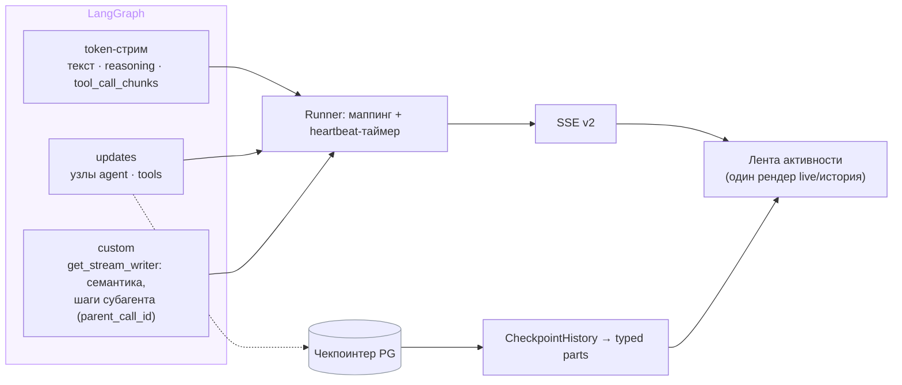

# Design Brief: feat-001 — Видимость работы агента

## Контекст

Комплексная переработка трансляции работы агента в чат: стрим-контракт, персистентный след действий, live-UI. Аудит «как есть» и решения Гейтов 1–2 — в [event-map.md](event-map.md); этот бриф фиксирует целевую архитектуру для реализации. Утверждённый визуальный язык — мокап [mockups/live-timeline-v3.html](mockups/live-timeline-v3.html) (лента активности, индикатор «Точки», разметка деталей «Метки»).

Два столпа (решение архитектора): **молчаливого UX не существует** (в любой момент генерации на экране что-то живёт) и **прозрачность по умолчанию** (показываем всё, что можно представить красиво; исключения — сознательные).

## Целевой UX: лента активности

Сообщение ассистента — последовательность typed parts, рендерящаяся одинаково в live и в истории. Действия агента — строки единой грамматики (иконка на тонкой соединительной нити, подпись из реестра, статус справа), разворот по клику открывает зоны «ВЫЗОВ» / «РЕЗУЛЬТАТ» с микро-заголовками. Активная строка живёт бегущими точками; до первого события в ленте живёт строка-пауза; у действия дольше ~3 с — счётчик времени (визуализация heartbeat). Субагент — строка с вложенной лентой его действий (лавандовая нить, тонированная подложка), вход (task) и ответ — зонами разворота. Большие данные — clamp в 3 строки с fade и «Показать полностью · ~N токенов», раскрытие в прокручиваемую зону. Отдельной статус-строки и группировки нет (отклонены на Гейте 2); отдельное `phase`-событие не нужно — фазы выражает сама лента.

## Контракт SSE v2

`streaming.md` переписывается целиком по итогам реализации. Целевой состав событий:

| Type | Payload | Источник | Терминальное |
|------|---------|----------|:---:|
| `stream_started` | `{}` | немедленно при открытии потока, до setup-фазы (резолв MCP, guard) | |
| `heartbeat` | `{}` | таймер: 5 с без других событий; шлётся в любой тишине (setup, исполнение инструмента, review) | |
| `reasoning_chunk` | `{content}` | token-стрим, `additional_kwargs["reasoning"]` (извлечение уже есть в `infra/llm.py`) | |
| `text_chunk` | `{content}` | как сейчас | |
| `tool_call_started` | `{call_id, tool, parent_call_id?}` | **ранний**: первый `tool_call_chunk` token-стрима (имя известно с первого чанка) | |
| `tool_call_args` | `{call_id, args, truncated}` | JSON аргументов дописан (конец генерации вызова), до исполнения; args усечены до лимита | |
| `tool_call_cancelled` | `{call_id}` | вызов срезан guard TOOL_CALL_ARG после генерации | |
| `tool_result` | `{call_id, tool, status, content, truncated, parent_call_id?}` | завершение исполнения; `status: success \| error`; content усечён | |
| `agent_event` | `{kind, payload, parent_call_id?}` | custom-канал (`get_stream_writer`) из наших инструментов: `sphere_write`, `memory_write`, `skill_context_write`, `compaction` | |
| `artifact_created` | `{id, title, artifact_type}` | по наличию `ToolMessage.artifact` (замена захардкоженного whitelist имён) | |
| `final_output_review_started` / `_complete` | `{}` | как сейчас; в проде с kill-switch LLM-защиты (chore-001) отсутствуют — фронт ничего не предполагает об их наличии | |
| `security_block` | `{}` | generic, без деталей (`reason`/`checkpoint`/`detection_layer` не эмитятся — остаются в Langfuse/SIEM) | ✔ |
| `cancelled` | `{}` | отмена пользователем (замена сегодняшнего `error {"Request was cancelled."}`) | ✔ |
| `error` | `{detail}` | как сейчас | ✔ |
| `done` | `{message_id, trace_id}` | как сейчас | ✔ |
| `trace_id` | `{trace_id}` | internal, перехватывается ChatService — как сейчас | |

Удаляются: `tool_start`, `tool_end` (заменены `tool_call_*` / `tool_result`).

**Вложенность субагента** — без отдельных типов событий: те же `tool_call_started` / `tool_call_args` / `tool_result` / `agent_event` с `parent_call_id` = call_id родительского `run_subagent`. Эмиссия — обёртка исполнения инструментов субагента пишет в stream writer, **захваченный в скоупе tool'а `run_subagent`** (он исполняется в родительском графе, где writer доступен) и переданный вниз явным аргументом; SubagentRunner остаётся на `ainvoke`.

Механизм проверен на langgraph 1.1.3: custom-события из вложенного *скомпилированного* графа в родительский поток **не всплывают** при `subgraphs=False` — contextvars хватает для обычных вложенных функций, но не для вложенного Pregel-графа. Альтернатива `astream(..., subgraphs=True)` даёт namespace вложенности, но меняет форму кортежа стрима на `(namespace, mode, data)` и требует пересмотра изоляции субагентных токенов по `SUBAGENT_TAG` — отклонена. Вход субагента (task) и его ответ — это args/result самого вызова `run_subagent`, отдельного канала не нужно.

**Лимиты и параметры:**

- Усечение `args` / `content` / task в SSE и API — **2 000 символов** + флаг усечения (бизнес-константа в коде, не env). На проводе каждое событие несёт свой `truncated`, поскольку описывает что-то одно; part истории покрывает и аргументы, и результат сразу, поэтому несёт два независимых флага — `args_truncated` и `result_truncated`.
- Heartbeat — **5 с** тишины; фронт-таймаут — **3 пропущенных heartbeat подряд** (заменяет first-byte-таймаут 300 с, который сегодня меряет только заголовки).
- Расширяемость: неизвестные типы событий фронт логирует и игнорирует (forward-compat; feat-002 добавит `title_updated` без ломки).

## Модель typed parts (история)

`MessageOut` расширяется полем `parts` — упорядоченный список:

| Part | Поля | Источник в чекпоинте |
|------|------|----------------------|
| `reasoning` | `content` | `AIMessage.additional_kwargs["reasoning"]` |
| `text` | `content` | `AIMessage.content` |
| `tool_call` | `call_id, tool, args, status, result_preview, args_truncated, result_truncated` | `AIMessage.tool_calls` + парный `ToolMessage` (status, content) |

- **Сборка — из чекпоинтера LangGraph** (решение архитектора): `CheckpointHistory` снимает фильтры «без ToolMessage / без AIMessage с tool_calls» и маппит последовательность сообщений треда в parts. Новой персистентности нет — один источник правды, ноль миграций.
- `content` (плоский текст), `artifacts`, `trace_id`, `feedback_score`, `redacted` — остаются как есть (совместимость); `parts` — дополнение, фронт рендерит parts, `content` остаётся для обратной совместимости и degraded-случаев.
- **Проверка на старте реализации:** доезжает ли `reasoning` из `additional_kwargs` до сохранённого в чекпоинт AIMessage (non-streaming путь `ReasoningChatOpenAI` его кладёт; убедиться для streaming-аккумуляции). Если нет — точечный дособор в узле графа, без изменения модели.
- **Осознанная граница:** вложенные шаги субагента и `agent_event`-семантика в чекпоинт основного графа не попадают (субагент — `persistence: none`, custom-события эфемерны) → в истории субагент отображается строкой с входом (args) и ответом (result), без вложенной хронологии; факт компакции в истории не виден. Live показывает всё. Детальная хронология остаётся в Langfuse.

## Frontend

- **Реестр подписей инструментов** — `shared/config` (FSD): имя → `{label, icon, argTemplate}`; примеры: `firecrawl_search` → «Ищу в интернете» + шаблон «· „{query}"», `run_subagent` → «{agent_type}-субагент», `update_section` → «Обновляю память проекта · раздел „{section}"». Для имён вне реестра (пользовательские MCP): label = сырое имя + пометка источника («инструмент MCP: {server}»). Сырое имя всегда доступно в развороте. Полноту реестра для built-in/internal инструментов сторожит тест против списка имён бэкенда: T1 выкладывает машиночитаемый фикстур имён, сгенерированный из реестра инструментов бэкенда, фронт-тест читает его (путь и генератор фиксирует план T1). Список на стороне фронта отклонён — он сторожил бы сам себя и не краснел бы на забытую подпись к новому инструменту.
- **Один компонент ленты** для live и истории: рендерит parts; live добавляет поверх состояния running (точки, счётчик), строку-паузу и review-строку.
- **Stream-store**: `activeTool`-скаляр заменяется аккумулятором parts + map активных вызовов по `call_id` (параллельные вызовы, вложенность по `parent_call_id`).
- Заменяются: `ThinkingIndicator` → строка-пауза ленты; `ToolIndicator` → строка действия. `ReviewIndicator` сохраняет текущий вид (строкой ленты). `GeneratingArtifactCard` — на данных `tool_call_args` (title картинки из args).
- `security_block`: existing-обработка (блокировка инпута, redacted) + явная generic-карточка в ленте в момент события.
- Таймаут стрима — от heartbeat (3×5 с), `VITE_SSE_FIRST_BYTE_TIMEOUT_MS` уходит.

## Backend: ключевые изменения

- **Runner**: переработка фильтра token-стрима (пропуск reasoning и tool_call_chunks вместо отбрасывания), `stream_mode=["messages","updates","custom"]`, heartbeat-таймер вокруг генератора, `stream_started` до setup-фазы, терминальный `cancelled`, маппинг custom-событий. Отмена дополнительно проверяется в heartbeat-таймере — становится отзывчивой и во время долгих исполнений инструментов (сегодня — только между итерациями astream).
- **Инструменты**: семантические `agent_event` через `get_stream_writer()` в KS/memory/skill-context tools; `artifact_created` по атрибуту `ToolMessage.artifact`.
- **Субагент**: обёртка резолва tools субагента эмитит `tool_call_*`/`tool_result` с `parent_call_id` (id вызова `run_subagent` — через injected tool call id).
- **CheckpointHistory**: снятие фильтров + сборка parts (см. выше).
- **Попутные фиксы из аудита** (обязательная часть scope): изоляция стрима суммаризатора (вызов без наследуемых callbacks — по образцу guard-классификатора; закрывает утечку токенов компакции в пользовательский стрим), утечка `_cancel_events` при раннем return/сбое setup-фазы, четыре неточности `streaming.md` (закрываются его переписыванием).

## Конвенции (фиксируются в реализации)

Чек-лист «добавляешь инструмент агенту» — в доменные конвенции (`conventions/agent.md`, `conventions/frontend.md`):

1. Подпись + иконка + argTemplate в реестре фронта (тест полноты — красный CI при пропуске).
2. Artifact-producing → `response_format="content_and_artifact"` (событие — по атрибуту, не по имени).
3. Доменное действие → `agent_event` через stream writer.
4. Содержимое результатов в UI — только raw-разворот с усечением; rich-рендер не вводится.

## Scope boundaries

Не входит: rich-рендер результатов по типам (raw-разворот — входит), вложенная хронология субагента в истории (live-only), полные неусечённые args/результаты в UI, персистентность рана при SSE-дисконнекте (backlog, отдельная итерация), `title_updated` (feat-002), изменение guard-политик и payload security-деталей, изменения Langfuse-трейсинга.

## Партиция треков

| Трек | Скоуп | Файловый/модульный скоуп |
|------|-------|--------------------------|
| T1 | Backend: контракт SSE v2, runner, custom-канал, субагентная обёртка, CheckpointHistory → parts, фикстур имён инструментов, попутные фиксы, переписывание `streaming.md`, конвенции agent | `backend/app/agent/**`, `backend/app/services/{chat.py, agent_runner.py}`, `backend/app/api/{routes/messages.py, routes/chats.py, schemas/chats.py}`, `backend/app/main.py` (сборка `internal_tools` — единый источник имён для фикстура), `backend/tests/**`, `scripts/` (генератор фикстура), сгенерированный фикстур имён инструментов (путь фиксирует план T1; потребитель — тест T2), `doc/tech/streaming.md`, `doc/tech/conventions/agent.md` |
| T2 | Frontend: лента активности (live+история), реестр подписей, stream-store, таймаут от heartbeat, конвенции frontend | `frontend/src/**`, `doc/tech/conventions/frontend.md` |

Треки последовательные (T2 стартует на готовом контракте T1); параллелизация отклонена — контрактная связность высокая, а форма событий стабилизируется только к концу T1. Вердикт непересечения по файлам: тривиален (backend/doc vs frontend).

## Тестовый scope (минимум)

- T1: unit на маппер событий (ранний `tool_call_started` из chunks, `tool_call_cancelled` при guard-срезе, `agent_event`, `parent_call_id`), обновление `test_stream_isolation` (reasoning/summarizer не текут, субагентные custom-события проходят), сборка parts из чекпоинта (включая redacted), heartbeat/cancelled.
- T2: реестр полноты, рендер parts (live=история), таймаут от heartbeat, параллельные вызовы.
- Финальная UI-валидация — архитектором локально (гейт ✅ по conventions § Lifecycle).
