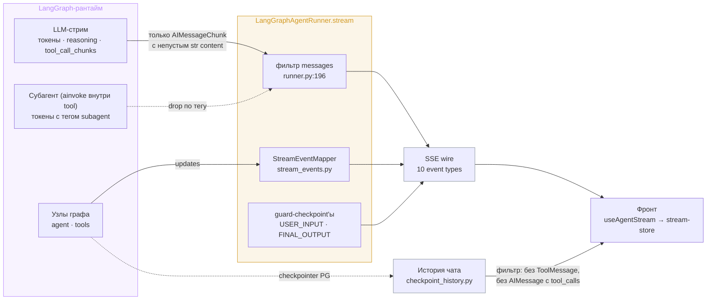

# Карта событий: feat-001 — Видимость работы агента

Артефакт фазы 1 итерации (аудит → карта событий). Полная инвентаризация пути LangGraph → SSE → фронт: что граф порождает, что доезжает до UI, что теряется, и предложение по составу целевой визуализации. Гейт 1 пройден — решения архитектора зафиксированы в секции «Решения Гейта 1» ниже; колонка «Предложение» в таблицах — исходная рекомендация агента, при расхождении приоритет у секции решений.

## Решения Гейта 1

Два принципа, от которых раскладывается весь состав:

1. **Молчаливого UX не существует.** В любой момент генерации на экране что-то живёт; тишина — ред-флаг дизайна.
2. **Прозрачность по умолчанию.** Показываем всё, что можно представить красиво; исключения (security-внутрянка, мысли суммаризатора, объёмные tool-результаты) вычёркиваются сознательно, а не по умолчанию.

По группам карты:

- **A (транспорт и фазы)** — берём целиком: ack, heartbeat, фазовые состояния, ранний `tool_start`, таймаут от heartbeat, отмена отдельным сигналом.
- **B (reasoning)** — стримим live и **сохраняем в истории**; секция сворачиваемая/разворачиваемая в обоих режимах.
- **C (tool-вызовы)** — стримим по максимуму: ранний старт, args, статус завершения, персистентный след. Rich-содержимое результатов не выводим — только статус и краткая мета (объёмные результаты в UI не попадают).
- **D (субагенты)** — берём; глубина прогресса (одна живая карточка vs вложенная хронология действий) — вкусовой выбор на мокапах Гейта 2, показываются оба варианта.
- **E (security)** — максимально абстрактно: пользователю никаких деталей (ни `detection_layer`, ни `checkpoint`), generic-сообщение; детали остаются в Langfuse/SIEM. Текущий вид review-индикатора («проверяем ответ») сохраняется без раскрытия внутрянки.
- **F (семантические события)** — берём: записи в Knowledge Sphere / память / skill context отображаются по-особому, с читаемыми подписями. Суммаризация: показываем **факт** компакции, мысли суммаризатора не стримим.

Механизмы:

- **Ранний `tool_start` — из token-стрима.** Имя инструмента приходит в первом `tool_call_chunk` → карточка появляется мгновенно; аргументы модель допечатывает токенами → карточка обогащается по завершении JSON (всё ещё до исполнения). Updates-поток перестаёт быть источником старта; за ним (или за custom-каналом) остаётся только «результат готов». Карточка обязана уметь состояние «вызов отменён» — guard TOOL_CALL_ARG может срезать вызов после генерации.
- **`stream_mode="custom"` (`get_stream_writer()`) одобрен** как канал всего, что не покрывается `messages`/`updates`: семантические события из tools, прогресс субагента (события всплывают из вложенности через contextvars), факт компакции.
- **Модель частей сообщения — typed parts** (`reasoning` | `text` | `tool_call` | `agent_event` | …) в API и фронте; live-рендер и рендер истории — один компонент над одной моделью данных. Выбрано «под рост» (файлы feat-004, слайды feat-006 лягут новыми типами частей).
- **Фазы — data-driven, без захардкоженной последовательности.** Следствие kill-switch LLM-защиты (chore-001): в проде guard/review-фазы отсутствуют — фронт рисует только фазы, пришедшие событиями.
- **Имена инструментов — двухуровневые.** Primary — человекочитаемое действие из реестра подписей на фронте («Ищу в интернете: „…"»); secondary — сырое имя моноширинным в развёрнутой карточке. Для инструментов вне реестра (пользовательские MCP) primary — сырое имя с пометкой источника («инструмент MCP: <server>»). Обоснование — ЦА (преподаватель, не разработчик).

Конвенции, рождающиеся из итерации (фиксируются в `conventions/` и `streaming.md` на этапе реализации) — чек-лист «добавляешь инструмент агенту»:

1. Подпись + иконка + шаблон отображения args в реестре фронта; полноту реестра сторожит тест против списка инструментов бэкенда.
2. Artifact-producing инструмент → `response_format="content_and_artifact"`; событие `artifact_created` — по наличию artifact, не по whitelist имён.
3. Доменное действие (сфера, память, скиллы) → семантическое событие через stream writer.
4. Содержимое tool-результатов в UI не выводится — только статус и краткая мета.

Метод: три параллельных аудита кода (агентный рантайм, SSE-слой бэкенда, потребление на фронте) по ветке `dogf/feat-001-agent-visibility`; все утверждения сверены с кодом, ссылки file:line даны по состоянию ветки.

## Пайплайн и точки потерь

Две магистральные потери:

1. **Фильтр messages-стрима** (`backend/app/agent/runner.py:196-201`): один `if` пропускает только `AIMessageChunk` со строковым непустым `content`. Отбрасываются: reasoning-токены (уже извлечённые `infra/llm.py:49-68` в `additional_kwargs["reasoning"]`), `tool_call_chunks` (инкрементальные имя+args вызова — основа раннего `tool_start`), полные `ToolMessage` (в LangGraph 1.1.3 они приходят и в messages-стрим), `usage_metadata`. Из `chunk_metadata` читается только `tags` (на предмет `subagent`) — `langgraph_node`, `ls_model_name` и прочая фазовая информация выбрасывается.
2. **Фильтр истории** (`backend/app/agent/checkpoint_history.py:58-82`): из чекпоинта наружу не выходят все `ToolMessage` и все `AIMessage` с `tool_calls`. Модель `Message` (`{id, role, content, artifacts, ...}`) не имеет места под tool-вызовы/reasoning — след работы агента структурно некуда положить, при том что сырьё лежит в `checkpoint_blobs`.

## Немые зоны (замеры из backlog: 13–15 с / 47 с тишины)

| Зона | Что происходит | События на проводе |
|---|---|---|
| Открытие стрима → первое событие | резолв модели (БД) → резолв user-MCP (сеть, таймаут до 30 с/сервер, кэш 300 с) → сборка графа → guard USER_INPUT (LLM-классификатор) → первый токен LLM (reasoning-модели молчат десятки секунд) | **ноль байт**; заголовки уходят сразу, так что first-byte-таймаут фронта (300 с) меряет заголовки, а не события |
| Внутри хода: `tool_start` → `tool_end` | исполнение инструмента; для `run_subagent` — весь ран субагента (минуты) | ничего |
| Генерация → `tool_start` | `tool_start` эмитится из updates-стрима, т.е. только **после полного завершения узла agent** (вся генерация + guard TOOL_CALL_ARG) | `text_chunk`-и, если модель писала текст; на tool-first ходе — ничего |
| Последний `text_chunk` → `done` | end-of-stream классификатор по всему ответу + резолв message_id + Redis | только пара `final_output_review_*` (и то лишь при непустом тексте) |

Ack/heartbeat отсутствуют полностью — ни служебного фрейма, ни comment-frame ping (grep пуст).

## Карта событий

Колонки: **Сейчас** — что реально доезжает до UI; **Целевая визуализация** — как должно выглядеть в чате; **Предложение** — берём / не берём / потом (решение — за архитектором на Гейте 1).

### A. Транспорт и фазы (закрывает P1 «live-обратная связь»)

| # | Сигнал | Сейчас | Целевая визуализация | Предложение |
|---|--------|--------|----------------------|-------------|
| A1 | Ack открытия стрима | нет (ноль байт до первого события LangGraph) | мгновенное «запрос принят» — индикатор оживает сразу | **берём** |
| A2 | Heartbeat в тишине | нет | elapsed-таймер честный («работает 0:47»), обрыв отличим от долгой работы | **берём** |
| A3 | Фазовые состояния (guard → рассуждает → инструмент → review) | только пара `final_output_review_*`; остальное фронт угадать не может | статусная строка фазы (мокап V2/V3); источник фаз — сервер, не эвристики фронта | **берём** |
| A4 | Ранний `tool_start` из `tool_call_chunks` | нет — `tool_start` после завершения узла | плашка инструмента появляется в момент, когда модель начала вызов, не через десятки секунд | **берём** |
| A5 | Таймаут фронта от heartbeat | first-byte 300 с меряет заголовки (приходят сразу) — фактически лимита нет | таймаут = N пропущенных heartbeat | **берём** (следствие A2) |
| A6 | Отмена как отдельный сигнал | `error {detail: "Request was cancelled."}` — смешана с ошибкой | нейтральное «остановлено», не красный error-бар | берём (дёшево при переработке контракта) |

### B. Reasoning (закрывает P3 «стриминг reasoning-токенов»)

| # | Сигнал | Сейчас | Целевая визуализация | Предложение |
|---|--------|--------|----------------------|-------------|
| B1 | Reasoning-токены | извлекаются в `AIMessageChunk.additional_kwargs["reasoning"]` (`infra/llm.py:49-68`), отбрасываются фильтром раннера | сворачиваемая секция «агент рассуждает» со стримом (мокап V3); закрывает основную долю воспринимаемой тишины | **берём** — дешевле, чем ожидалось: извлечение уже реализовано, нужен только новый event type + рендер |
| B2 | Reasoning в истории | нигде не сохраняется наружу | вопрос состава: хранить ли reasoning в истории сообщений или показывать только live | **вопрос архитектору** (§ Открытые вопросы, №3) |

### C. Tool-вызовы (закрывает P3 «интерактивность вывода», часть) 

| # | Сигнал | Сейчас | Целевая визуализация | Предложение |
|---|--------|--------|----------------------|-------------|
| C1 | Args tool-вызова | читаются и выбрасываются (`stream_events.py:28`) | человекочитаемая плашка: «Ищу в вебе: „изоляция контекста"», title генерируемой картинки, тип субагента | **берём** (селективно: не сырой JSON, а осмысленные поля по реестру инструментов) |
| C2 | Статус завершения (`ToolMessage.status`) | выбрасывается — ошибка инструмента неотличима от успеха | плашка завершённого вызова: успех/ошибка визуально различимы | **берём** |
| C3 | Человекочитаемые названия инструментов | сырое имя (`run_subagent`) в UI | реестр «имя → подпись + иконка» уровнем дизайн-системы | **берём** (дизайн-вопрос: где живёт реестр — фронт или сервер) |
| C4 | Параллельные tool-вызовы | `activeTool` — скаляр, вызовы перезаписывают друг друга, любой `tool_end` гасит плашку | список активных вызовов по `call_id` | **берём** (следствие переработки стора) |
| C5 | След tool-вызовов в истории | нет: `checkpoint_history` фильтрует, в `Message` места нет; после `done` след исчезает | персистентные карточки вызовов внутри сообщения ассистента, переживают перезагрузку | **берём** — самая крупная часть итерации: модель «частей сообщения» (API + фронт), снятие фильтра истории |
| C6 | Rich-результаты инструментов | нет | — | **не берём** (зафиксировано вне scope тасклиста) |

### D. Субагенты

| # | Сигнал | Сейчас | Целевая визуализация | Предложение |
|---|--------|--------|----------------------|-------------|
| D1 | `agent_type` субагента | существует только внутри tool (`tools/subagents.py:115`), в стрим не попадает нигде | плашка «Субагент: judge» с отличимым стилем (лавандовый маркер из мокапа) | **берём** (через C1 — args tool-вызова) |
| D2 | Прогресс внутри субагента (его tool-вызовы, итерации) | структурно недостижим: подграф вызывается `ainvoke` внутри tool | вложенная хронология «субагент ищет → читает страницу» | **потом** — требует перевода SubagentRunner на `astream` или custom-события; для v1 достаточно D1 + heartbeat |
| D3 | Старт/финиш субагента с метаданными (model, tool_count) | только логи | — | не берём (наблюдаемость — Langfuse) |

### E. Security (закрывает P2 «security_block SSE»)

| # | Сигнал | Сейчас | Целевая визуализация | Предложение |
|---|--------|--------|----------------------|-------------|
| E1 | Контракт `security_block` | тройной дрейф: док `{checkpoint, detection_layer}` ↔ прод `{reason}` (= detection_layer) ↔ фронт не читает ни одного поля | единый согласованный payload (состав — открытый вопрос №2), `streaming.md` переписывается | **берём** |
| E2 | Блокировка видна пользователю | инпут блокируется и текст редактируется, но при блокировке до первого текста явного сигнала нет | явный баннер/карточка «заблокировано системой безопасности» в ленте в момент события | **берём** |
| E3 | In-graph redaction (TOOL_RESULT/TOOL_CALL_ARG) в реальном времени | сигнал есть в updates (`security_redacted` в additional_kwargs), но детектится пост-фактум сканом чекпоинта — пользователь узнаёт в конце стрима | событие в момент срабатывания | берём (сигнал уже на проводе updates, нужен только маппинг) |
| E4 | SUSPICIOUS-вердикт guard | Langfuse/логи | — | не берём (не для пользователя) |

### F. Семантические события работы агента

| # | Сигнал | Сейчас | Целевая визуализация | Предложение |
|---|--------|--------|----------------------|-------------|
| F1 | Запись в Knowledge Sphere | generic `tool_start/end` с сырым именем | карточка «обновил память проекта: секция X» — на фронте уже есть стаб `SphereWriteCard` за флагом `SHOW_GROUP_B_STUBS` | **берём** — фронт этого события уже ждёт |
| F2 | User memory / skill context write | generic `tool_start/end` | та же карточка-семейство «агент запомнил» | берём заодно с F1 (один механизм) |
| F3 | `artifact_created` | работает, но whitelist имён захардкожен (`stream_events.py:45`) | без изменений UI; маппинг — по `ToolMessage.artifact`, не по имени tool | берём как тех-фикс |
| F4 | Артефакт обновлён | механизма нет (агент не умеет обновлять артефакты) | — | не берём |
| F5 | Compaction (сжатие контекста) | не видно | мелкий системный индикатор «сжимаю контекст» | потом (редкое событие, ценность мала) |
| F6 | `title_updated` | — (потребность feat-002 Chat UX) | — | не берём, но новый контракт проектируем расширяемым — feat-002 наследует его |

## Попутные находки (дефекты вне прямого scope, кандидаты на фикс той же итерацией)

1. **Утечка токенов суммаризатора в пользовательский стрим** (потенциальный баг): `graph.py:72` вызывает summarization-модель без `config` → callbacks наследуются, чанки идут в messages-стрим без тега `subagent` и без `nostream` → при срабатывании компакции (порог 75k токенов) её вывод уйдёт пользователю как `text_chunk` вперемешку с ответом. Guard-классификатор от этого защищён явно (`security/classifier.py:94-98`), суммаризатор — нет. Проверить и закрыть при переработке фильтра.
2. **Утечка `_cancel_events`**: очистка только в `finally` основного `try` (`runner.py:278-279`); ранний return на USER_INPUT-блоке и исключения setup-фазы оставляют запись навсегда.
3. **Отмена не замечается во время долгого tool-вызова**: `cancel_event` проверяется только между итерациями `astream` (`runner.py:172`) — во время рана субагента событий нет… по документации `streaming.md:127` отмена «остаётся отзывчивой» за счёт отфильтрованных чанков субагента, что верно лишь пока субагент стримит; на сетевом ожидании инструмента — нет.
4. **Неточности `streaming.md`** (править при переписывании): `security_block` может прийти **после** `final_output_review_complete` (четвёртая точка эмиссии, post-stream inspection), а не «вместо»; `final_output_review_*` не эмитятся на чисто tool-ходе без текста; не документирован pre-stream гейт 403 `require_unblocked_thread`; транспортный fallback `error {"Stream failed"}` мимо `error_messages.yaml`.
5. **Неизвестные SSE-события фронт молча глотает** (`useAgentStream.ts:173`, switch без default) — при эволюции контракта нужен явный лог/forward-compat политика.

## Решения Гейта 2 (вкусовой выбор архитектора по мокапам)

Мокапы итерации: `mockups/live-timeline.html` (v1, карточки — отклонён), `mockups/live-timeline-v2.html` (v2, варианты C/D/E), `mockups/live-timeline-v3.html` (v3, финал). Утверждено:

- **Стиль — «лента активности»** (вариант C из v2): все действия агента — единая визуальная грамматика: тонкая строка с иконкой на соединительной нити, без карточек-боксов; разворот по клику. Отклонены: верхняя статус-строка (вариант D — дублирует ленту), группировка действий в сворачиваемый узел (вариант E).
- **Следствие для контракта: отдельное `phase`-событие не нужно** — фазы выражаются самими событиями ленты (пауза-строка до первого события, активная строка, review-строка). Контракт упрощается.
- **Индикатор активности — «Точки»**: бегущие точки после подписи активной строки; строка-пауза с точками живёт с нулевой секунды до первого события; у действия дольше ~3 с появляется счётчик времени (визуализация heartbeat).
- **Разметка деталей — «Метки»**: в развороте зоны «ВЫЗОВ» / «РЕЗУЛЬТАТ» / «ОТВЕТ СУБАГЕНТА» микро-заголовками с тонким разделителем.
- **Субагент** — строка ленты с вложенной лентой его действий (лавандовая нить, тонированная подложка); шаги — lifecycle-события его инструментов, без отдельного генератора текстов; вход (task) и ответ (вердикт) — зонами в развороте.
- **Большие данные** — обрезка в 3 строки с fade + «Показать полностью · ~N токенов», раскрытие в прокручиваемую зону фиксированной высоты. Результаты инструментов показываются raw-текстом в развороте (уточнение решения C6: «rich-рендер» по типам результатов остаётся вне scope, raw-разворот — в scope).
