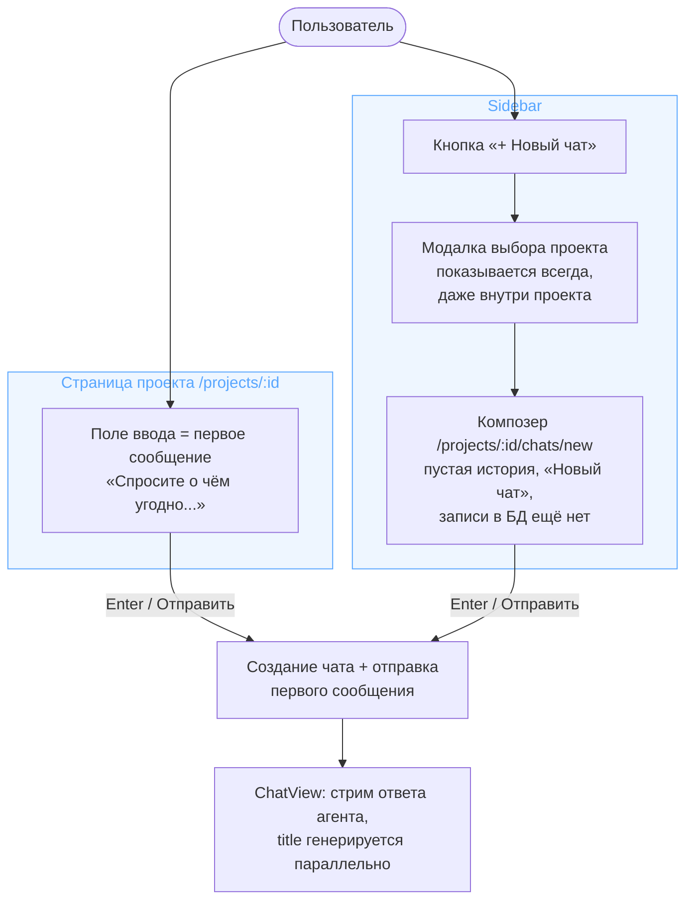
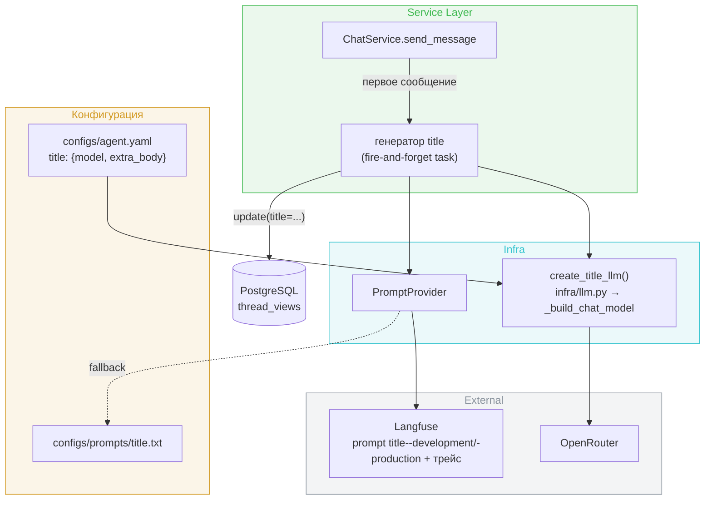
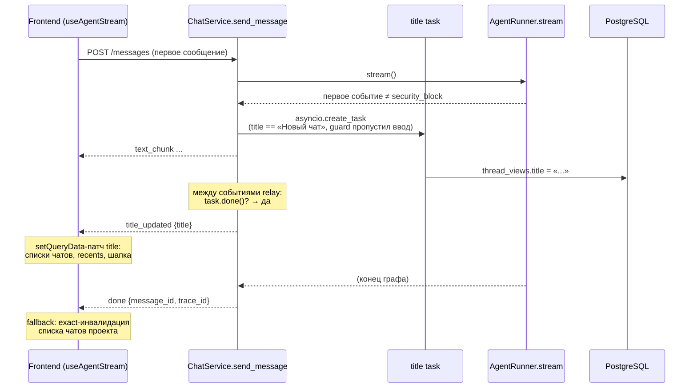

# Design Brief: Chat UX — первое сообщение вместо title, auto-title, управление чатами

**Итерация:** dogfooding feat-002 (C) — [tasklist-dogfooding.md](../../../tasklist-dogfooding.md)
**Scope:** cross-cutting (Frontend + Backend)

## Контекст и цель

Сегодня вход в чат перевёрнут относительно привычного паттерна: пользователь сначала придумывает **название** чата (поле «Название нового чата...» на странице проекта или кнопка «+ Новый чат» с хардкодом `"New Chat"`), попадает в пустой экран и только затем печатает вопрос. Итерация переворачивает это: пользователь сразу пишет **первое сообщение**, название генерирует дешёвая LLM. Заодно закрывается отсутствие управления чатами — их нельзя ни переименовать, ни удалить (у проектов обе операции есть, у чатов нет ни endpoint'ов, ни UI).

Три блока: вход через первое сообщение, auto-title модуль, rename/delete чатов.

## Целевой UX

Ключевые продуктовые решения (утверждены архитектором):

- **Нигде в продукте пользователь не вводит имя чата.** Имя появляется автоматически; изменить его можно только через rename.
- **Чат создаётся в БД только в момент отправки первого сообщения** — в обоих путях входа. «Висячих» пустых чатов не существует по построению.
- **Плейсхолдер названия — «Новый чат»** (записывается в БД при создании, заменяется сгенерированным).
- Чат всегда принадлежит проекту. Чаты без проекта — вне scope (backlog).

Два пути входа:

Пояснения к развилкам:

- **Модалка выбора проекта показывается всегда**, даже когда пользователь находится внутри проекта: пользователь может не осознавать текущий контекст и хотеть чат в другом проекте. Если проектов нет — модалка показывает empty-state со входом в создание проекта (переиспользуется `CreateProjectModal`). Кнопка «+ Новый чат» становится доступной с любого экрана (сейчас — только внутри проекта).
- **Композер** — это `ChatView` в draft-режиме: пустая история, заголовок «Новый чат», обычный `ChatInput`. Отдельного экрана не рисуем.
- **Rename и delete** доступны из двух мест: список чатов проекта и recents в сайдбаре. Паттерн UI — существующий `ProjectActions` (`frontend/src/app/components/ProjectActions.tsx`): dropdown по hover (`MoreHorizontal`) → пункт Rename (диалог с формой) и Delete (диалог-подтверждение «нельзя отменить», destructive-кнопка). При удалении открытого чата — переход на страницу проекта (аналог `navigate("/")` у проектов).

## Архитектура

### Создание чата и первое сообщение (frontend)

Обе точки входа сходятся в одну механику:

1. `POST /projects/{id}/chats` (тело пустое — см. § Контракты) → `thread_id`;
2. `navigate('/projects/{id}/chats/{thread_id}', { replace: true, state: { initialMessage } })`;
3. `ChatView` при монтировании видит `state.initialMessage` → однократно вызывает существующий send-путь (optimistic user message + `useAgentStream.send`).

Контракты поведения, закрывающие гонки:

- **Однократность авто-отправки.** После запуска отправки `ChatView` немедленно затирает router state (replace с `state: null`): refresh страницы или возврат по истории не переотправляют сообщение. Guard от двойного срабатывания эффекта — ref-флаг.
- **Гонка create → send** на бэке уже закрыта: `ChatService.create_chat` делает явный `commit` до возврата (`backend/app/services/chat.py`, зафиксировано в [conventions/db.md](../../../../tech/conventions/db.md) § commit-правила).
- **Residual risk:** если пользователь закрыл вкладку в зазоре между `POST /chats` и `POST /messages`, пустой чат всё же появится. Зазор — миллисекунды; атомарный «create+send» endpoint потребовал бы пересборки стрим-роута и не оправдан. Принимаем.

Маршрут композера — `/projects/:id/chats/new` (`router.tsx`, рядом с `chats/:cid`). Draft-режим `ChatView` фиксируем явно, чтобы реализация не разошлась:

- `useChat` не выполняется (чата нет); `useAgentStream` в draft не активен — draft-отправка идёт **мимо** него (шаги 1–3 выше), стрим стартует уже в обычном режиме после навигации;
- `ChatHeader` draft-осведомлён: показывает «Новый чат» (сейчас его собственный `useChat` дал бы fallback «Чат»);
- все thread-scoped контролы скрыты до появления `thread_id`: селектор модели **и** чип MCP-инструментов; до создания чата действует каскад project → user → дефолты (`ModelConfigResolver`).

Старый вход удаляется: инлайн-карточка «Название нового чата...» в `ChatList` заменяется полем первого сообщения; `handleCreate` с `title` уходит.

### Auto-title модуль (backend)

Отдельный лёгкий LLM-модуль в сервисном слое — по колее, проложенной секциями `summarization` / `subagents.llm` / `image`:

Решения:

- **Конфиг** — обязательная секция `title` в `agent.yaml` (`model`, `extra_body`) + `TitleConfig(BaseModel)` в `agent/config.py`, по образцу `image` (обязательная, fail-fast на старте). Модель — `deepseek/deepseek-v4-flash`, как у `summarization`/`subagents` (уже в Langfuse pricing после feat-003). Модель title не входит в `available_models` — служебная секция, как остальные.
- **Фабрика** — `create_title_llm()` в `infra/llm.py` через единый `_build_chat_model` (все модели проекта — `ReasoningChatOpenAI`, [conventions/agent.md](../../../../tech/conventions/agent.md) § Reasoning LLMs). Таймаут — новая env-переменная в `Settings` (короткий, порядка 20 с); atomic change четырёх мест: `Settings` + `.env.example` + `.env.local.example` + `docker-compose.yml`.
- **Промпт** — `title--development` / `title--production` в Langfuse (формат Prompt Naming) с файловым fallback `configs/prompts/title.txt` через `PromptProvider`. Вход — текст первого сообщения пользователя; требования к выходу: короткое название на языке сообщения, без кавычек. Промпт оформляет сообщение как **данные, не инструкции** (data/instruction framing); остаточный риск инъекции — крафтовое сообщение может навязать произвольный текст названия — принимаем: вывод рендерится как текст (React экранирует), вред ограничен самонаведённым мусором в собственном sidebar, guard-обвязку на дешёвый служебный вызов не строим. Пост-обработка в коде: strip, срез переносов, усечение до лимита длины (общая константа с валидацией rename).
- **Триггер — «title ещё плейсхолдер»**, а не «истории ноль сообщений»: задача запускается, если текущий `title` равен константе `DEFAULT_CHAT_TITLE`. Это дешевле чтения истории из checkpointer и даёт самовосстановление: если генерация упала на первом сообщении, второе сообщение запустит её снова. Edge case «пользователь вручную переименовал чат в "Новый чат"» вызовет лишнюю перегенерацию — принимаем как безобидный.
- **Запуск — после прохождения guard, не до.** Задача создаётся не в начале `send_message`, а из relay-цикла при **первом событии агента, отличном от `security_block`**: pre-stream проверка ввода эмитит `security_block` первым событием, и в этом случае title-задача не запускается вовсе — заблокированный текст не попадает ни в title-LLM (без guard-обвязки), ни — в виде сгенерированного названия — в sidebar/recents. Блокировки *после* старта задачи (mid-stream, final output) названию не мешают: title генерируется из ввода, который guard уже пропустил; для страховки задача перед записью перечитывает `ThreadView` и не пишет title, если чат удалён или помечен `security_blocked`.
- **Жизненный цикл задачи.** `asyncio.create_task`; ссылка держится **вне** генератора `send_message` — в реестре по `thread_id` в `app.state` с discard в done-callback (замыкание генератора недостаточно: на путях `security_block`/`error`/cancel/обрыв SSE генератор завершается раньше задачи, и задача без внешней ссылки может быть собрана GC мид-флайт). Реестр заодно служит in-flight-guard'ом: повторное сообщение при уже идущей генерации этого чата новую задачу не создаёт. Задача работает в **собственной** DB-сессии из `session_factory` (образец — image-tool: задача переживает request-scope сессию запроса).
- **Ошибки — graceful degradation:** генерация title некритична для core-ценности сообщения. Барьер на границе задачи: любой отказ → `logger.warning(..., exc_info=True)`, чат остаётся «Новый чат». Успех — `logger.info("chat title generated", ...)`. LLM-вызов трейсится в Langfuse по образцу summarization.
- **Rate limiting / стоимость:** отдельный лимит не вводим — вызов выполняется один раз на чат (пока title — плейсхолдер), in-flight-guard исключает параллельные дубли, модель flash-класса, стоимость мажорируется агентским раном того же сообщения. Деградационный худший случай (генерация систематически падает) — по одному дешёвому вызову на сообщение чата; приемлемо.

### Доставка title на фронт

Выбран вариант «SSE-событие в стриме + fallback-инвалидация» — против альтернатив (см. trade-offs ниже).

- **Новое SSE-событие `title_updated { title }`** — не-терминальное; фиксируется в [streaming.md](../../../../tech/streaming.md) (таблица событий). Wire-механика generic (`messages.py::_event_generator` не меняется); эмит — одна точка в relay-цикле `ChatService.send_message`: между событиями агента проверяется `task.done()`, готовый title уезжает со следующим тиком. Принятое ограничение: на «молчащем» ране (tool-first ход без событий — легитимные минуты тишины) готовый title ждёт следующего события агента; heartbeat-контракт, проектируемый в feat-001, естественно снимет это ожидание, специальной механики (`asyncio.wait` по двум источникам) сейчас не строим.
- **Фронт**: расширение union `SSEEvent` (`shared/api/sse.ts`), новый `case` в `useAgentStream`. Обновление кэша — **только `setQueryData`-патч** поля `title` в кэшах списка чатов проекта, recents и detail открытого чата; **не** `invalidateQueries`. Причина: `queryKeys.projects.chats(id)` — префикс detail-ключа `projects.chat(id, cid)`, префиксная инвалидация мид-стрим зарефетчит открытый чат, в котором optimistic-копия user-сообщения ещё лежит в `localMessages` (очищается только на терминале), — пользователь увидит задвоенное сообщение. Паттерн «не-терминальное событие меняет UI» уже есть (`final_output_review_*`, pending images).
- **Fallback:** если генерация не успела до конца рана (очень короткий ответ агента), события не будет — на `done` добавляется инвалидация списка чатов проекта с `exact: true` (`queryKeys.chats.recent` на `done` уже инвалидируется — дубль не добавлять). Если title опоздал и к `done`, а также на терминалах `error`/`security_block` и при обрыве SSE — задача независимо дописывает title в БД (см. жизненный цикл), UI подхватит его следующим штатным рефетчем; принимаем.

Отвергнутые альтернативы:

| Вариант | Почему нет |
|---------|-----------|
| Тихая запись в БД + инвалидация на `done` | Весь ран (на субагентных прогонах — минуты) в сайдбаре висит «Новый чат»; title, финишировавший после `done`, залипает до случайного рефетча. |
| Title полем в `done` (по образцу `trace_id`) | Доставка гарантирована, но так же поздно, как рефетч; `await` с таймаутом перед `done` задерживает терминальное событие. |
| Условный поллинг списков, пока title — плейсхолдер | Единственный вариант для «пользователь сразу закрыл вкладку», но лишние запросы и хрупкий триггер по сравнению строк; не оправдан. |

### Rename и delete (backend)

**Rename** — `PUT /projects/{project_id}/chats/{chat_id}`, тело `ChatUpdate { title }` (лимит длины на Pydantic-границе — [conventions/db.md](../../../../tech/conventions/db.md): строки `Text` в БД, лимиты в API), ответ `200 ChatResponse`. Ownership — штатная dependency `UserThread`. Сервис → неиспользуемый ныне `ThreadViewRepository.update(title=...)`. Зеркало `PUT /projects/{project_id}` у проектов. Попутный дрейф-фикс: у образца `ProjectUpdate.name` лимита длины нет вопреки той же конвенции — распространяем общую константу лимита и на него.

**Заблокированные чаты** (`security_blocked`): rename и delete **разрешены** — `require_unblocked_thread` остаётся только на `POST /messages`. Блокировка ограничивает продолжение диалога, а не управление собственным чатом; право пользователя удалить свой чат сильнее. Следствие для delete: security-события ссылаются на `thread_id` по значению (FK нет) и переживают удаление треда by design — история инцидента в SIEM сохраняется.

**Delete** — `DELETE /projects/{project_id}/chats/{chat_id}` → `204`, идемпотентный: повторный DELETE несуществующего чата — тоже `204` ([conventions/api.md](../../../../tech/conventions/api.md)). Как у `delete_project`, ownership резолвится вручную в handler'е (dependency `UserThread` бросила бы 404 и сломала идемпотентность) — задокументированное исключение из правила «ownership только через dependencies».

Каскад удаления и его нетривиальный порядок:

| Зависимость | Механизм | Действие в итерации |
|-------------|----------|---------------------|
| `thread_settings`, `thread_mcp_servers` | FK `ondelete=CASCADE` | ничего — БД сама |
| `artifacts.thread_id` | FK `SET NULL` | ничего — артефакты остаются в проекте (решение архитектора) |
| `mcp_server_disables` | полиморфная ссылка **без FK** | новый `MCPServerRepository.cleanup_disables_for_thread()` по образцу project-версии: scope `('thread', thread_id)` + disables на `ThreadMCPServer` этого чата |
| LangGraph checkpoints (`checkpoints`, `checkpoint_blobs`, `checkpoint_writes`) | вне нашей схемы, по значению `thread_id` | `AsyncPostgresSaver.adelete_thread(thread_id)` — метод существует в установленной версии, проверено |

Порядок в `ChatService.delete_chat`: **сначала транзакция БД** (cleanup disables + `repo.delete`, commit), **затем best-effort** `adelete_thread`. Checkpointer работает через собственный пул соединений — в нашу транзакцию его не включить; из двух возможных рассинхронов выбираем безопасный: если `adelete_thread` упал, остаются осиротевшие checkpoints (тот же класс мусора, что существует сегодня; `logger.warning`), тогда как обратный порядок при сбое дал бы «живой» чат с уничтоженной историей. Доступ — новый метод контракта `AgentRunner.delete_thread(thread_id)`; сам `AsyncPostgresSaver` создаётся в `infra/langgraph.py` (lifespan) и сейчас в runner не инжектится — реализация получает checkpointer расширением конструктора `LangGraphAgentRunner` (обычный DI), сервис в `app.state` за ним не ходит.

Побочное следствие обеих операций: `onupdate=func.now()` на `updated_at` поднимет переименованный чат в recents. Принимаем — отдельная возня с ручным сохранением `updated_at` не оправдана.

### Frontend: раскладка нового кода

| Что | Где | Почему |
|-----|-----|--------|
| `ChatActions` (dropdown + диалоги rename/delete) | `features/chat-actions/` | используется на 2+ хостах — список чатов (`pages/project-chats`) и recents (`app/components/Sidebar`); ровно критерий заведения `features/` из [conventions/frontend.md](../../../../tech/conventions/frontend.md) |
| Модалка выбора проекта | `app/components/` | единственный хост — Sidebar; образец соседний — `CreateProjectModal` |
| `updateChat` / `deleteChat` + `useUpdateChat` / `useDeleteChat` | `shared/api/chats.ts` | конвенция «данные — data-хуки рядом с API-функциями»; сначала ключи в `query-keys.ts` |
| Draft-режим композера | `pages/chat` (`ChatView`) | состояние существующего экрана, не новый слайс |
| Поле первого сообщения на странице проекта | `pages/project-chats` (`ChatList`) | замена существующей карточки создания |

Мутации — пессимистичные с `invalidateQueries` (проектная конвенция): rename/delete инвалидируют `queryKeys.projects.chats(projectId)` (**`exact: true`** — ключ является префиксом detail-ключей, префиксная инвалидация зарефетчила бы открытый чат посреди возможного активного стрима, см. § Доставка) + `queryKeys.chats.recent` (+ точечно detail при rename открытого чата). Ошибки — `getApiErrorMessage` + `logger`, по образцу `ProjectActions`. Таблица «Mutations → инвалидация» в [frontend.md](../../../../tech/frontend.md) дополняется новыми строками.

### Персистентность

Изменений схемы БД нет: `title` остаётся `Text NOT NULL`, плейсхолдер — значение, а не NULL. Миграция не требуется. Существующие чаты с title `"New Chat"` не мигрируем: их title не равен новому плейсхолдеру, перегенерация для них не сработает — остаются как есть (dev-данные).

## Контракты (сводно)

| Контракт | Изменение |
|----------|-----------|
| `POST /projects/{id}/chats` | body-параметр удаляется из сигнатуры целиком (запрос без тела; схема `ChatCreate` умирает — пользователь title больше не задаёт нигде); сервер ставит `DEFAULT_CHAT_TITLE = «Новый чат»` |
| `PUT /projects/{id}/chats/{chat_id}` | новый; `ChatUpdate { title: str }` (лимит длины), → `200 ChatResponse` |
| `DELETE /projects/{id}/chats/{chat_id}` | новый; → `204`, идемпотентный |
| SSE | новое не-терминальное событие `title_updated { title: str }`; терминальные и wire-формат не меняются |
| `configs/agent.yaml` | новая обязательная секция `title: { model, extra_body }` |
| Langfuse prompts | новый промпт `title--{development,production}` + файл `configs/prompts/title.txt` |
| `Settings` / env | новый таймаут title-вызова (atomic change: `Settings`, `.env.example`, `.env.local.example`, `docker-compose.yml`) |

Актуализация документации по итогам: `streaming.md` (событие), `backend.md` (endpoints чатов, `ChatService`), `frontend.md` (экраны, mutations-таблица, дерево модулей), `agent-runtime.md` (таблица секций `agent.yaml`), `prompt-management.md` (реестр промптов — если там ведётся перечень).

## Scope boundaries — сознательно вне итерации

- **Чаты без проекта** — привязка к проекту остаётся обязательной; глубоко завязано на память/сферу. → backlog.
- **Восстановление чатов / корзина.** Удаление — hard delete: soft-delete-флаг размазал бы `WHERE deleted_at IS NULL` по всем выборкам, оставил бы переписку в БД (приватность) и дал бы механику восстановления без UI для неё. Если появится потребность — отдельная итерация с паттерном «корзина + TTL». → backlog.
- **Чистка checkpoints при удалении проекта** — тот же долг, что закрываем для чатов, но в коде проектов; не расширяем scope. → backlog.
- **Регенерация title по запросу пользователя** («перегенерировать название») — не делаем; rename покрывает потребность.
- **Индикатор «название генерируется»** — плейсхолдера «Новый чат» достаточно.

## Мокап

Интерактивный HTML-мокап — [mockups/chat-ux.html](mockups/chat-ux.html) (открывать в браузере): оба пути входа (поле проекта / sidebar → модалка выбора проекта → композер), симуляция стрима с заменой «Новый чат» → сгенерированный title, rename/delete из списка чатов и recents, сравнение «сейчас vs станет» для карточки создания, empty-state модалки при нуле проектов, обе темы. Токены и вёрстка — копия `frontend/src/index.css` и реальных компонентов.

## SOFA consulted

Ресёрч проведён (9 запросов: auto-title/summary генерация, SSE-контракт, delete cascade, checkpointer cleanup, fire-and-forget, cache invalidation). Прямо релевантных Blueprint по теме итерации нет — валидный пустой исход. Смежные находки:

- TIL `b1cefb88` «Seeding deterministic chat history into a LangGraph checkpointer without running the model» (score 55, upvoted) — берём как приём для тестов: детерминированный сидинг истории треда без вызова модели пригодится при проверке триггера генерации и delete-каскада. В решения брифа не влияет.
- TIL `2123cfef` «exception in a tool node permanently bricks the thread» — уже отражён в conventions § Агентные tools; нового не даёт.

## Ревью брифа

Прогон свежим агентом с чистым контекстом (2026-07-26) по чек-листу conventions § Ревью дизайн-брифа: 13 находок (1 blocker, 3 major, 9 minor). Ключевые: непокрытый контур `security_blocked` (title из заблокированного сообщения) → запуск задачи перенесён за guard; префиксная инвалидация query-ключей → `setQueryData`/`exact: true`; GC-риск title-задачи на не-`done` путях → реестр в `app.state`; недоопределённость draft-режима → зафиксирован явно. Все находки учтены правками брифа.
