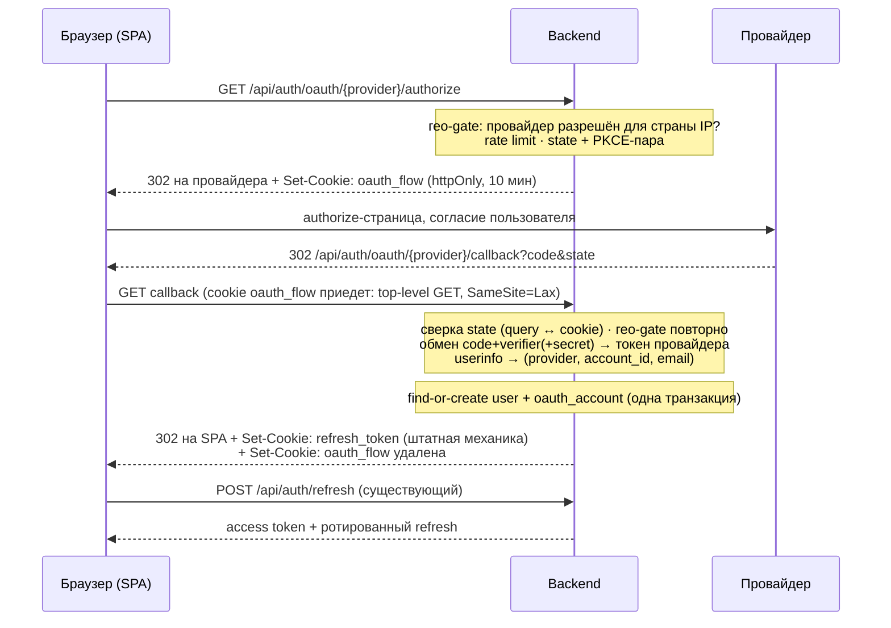
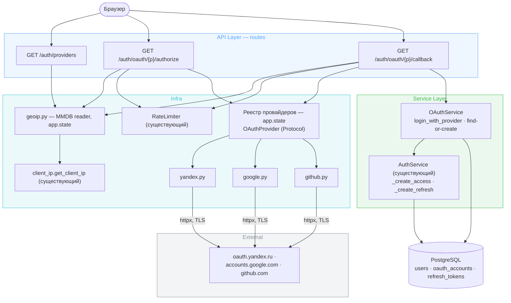
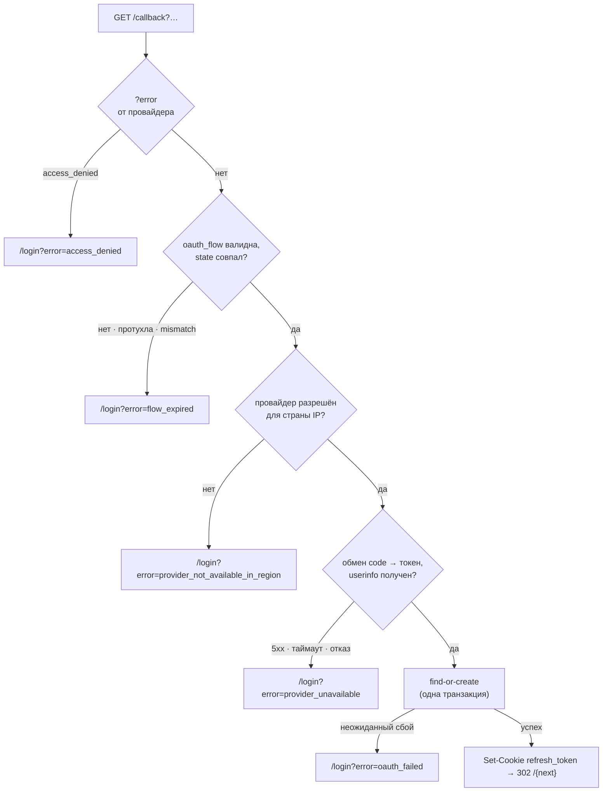
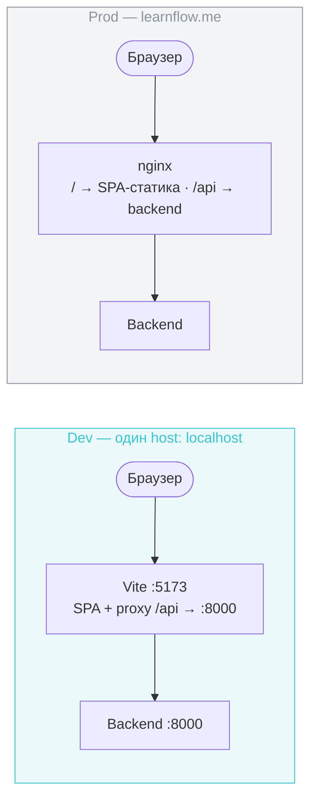
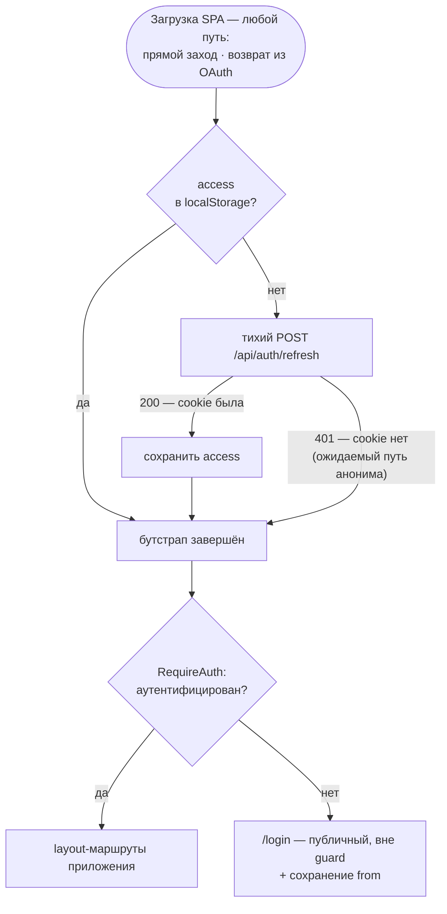

# Design Brief: OAuth-вход — Яндекс ID / Google / GitHub с гео-разделением + каркас `/login`

**Итерация:** dogfooding feat-008 (I) — [tasklist-dogfooding.md](../../../tasklist-dogfooding.md)
**Scope:** cross-cutting (Frontend + Backend + Design-branding)
**Ресёрч-артефакты:** [research-legal-geo.md](research-legal-geo.md) · [research-data-model.md](research-data-model.md) · [research-provider-libs.md](research-provider-libs.md)

## Контекст и цель

Сегодня единственный способ входа — логин/пароль в блокирующей модалке `AuthGate` над роутером. Итерация добавляет вход через внешних провайдеров (пользователь не заводит отдельный пароль) и перестраивает вход на полноценную страницу `/login`. Состав провайдеров продиктован ч. 10 ст. 8 149-ФЗ (штрафы по ст. 13.55 КоАП с 07.07.2026): пользователям из РФ показываются и разрешаются только российские провайдеры (+ пароль), остальным — все активные. Из российских реализуется один Яндекс ID: VK ID исключён решением архитектора — регистрация VK ID-приложения физлицу без бизнес-верификации недоступна, а dev-флоу требовал бы отдельной https-топологии (`dev.learnflow.me` + сертификат + nginx). Итоговый состав: Яндекс ID, Google, GitHub. Юридическая рамка, ответственность и границы — [research-legal-geo.md](research-legal-geo.md).

Ключевая рамка архитектуры: **OAuth заканчивается в момент, когда мы надёжно узнали `(provider, provider_account_id)`**. Дальше без изменений работает существующая сессионная машина (`_create_access` / `_create_refresh`, ротация refresh, replay-детекция) — итерация не трогает [auth.md](../../../../tech/auth.md)-механику токенов.

Утверждённые решения взятия в работу (состав провайдеров, серверный гео-enforcement, модель данных, ручной httpx-слой без authlib, порядок «Яндекс первым», граница с feat-013) — в секции итерации в tasklist; бриф их детализирует, не пересматривает.

## Целевой UX

- **Страница `/login`** заменяет модалку: неаутентифицированный пользователь на любом маршруте попадает на `/login` (с запоминанием исходного пути), после входа возвращается. Логин и регистрация — два режима одной страницы (как сейчас в `AuthGate`), копирайт русский.
- Сверху — **кнопки провайдеров**, состав приходит с бэкенда (`GET /api/auth/providers`, по гео): РФ — только «Войти с Яндексом»; не-РФ — **все три** (решение архитектора: россиянин за VPN входит своим Яндекс-аккаунтом, не выключая VPN; серверный запрет действует только на паре «РФ-IP × иностранный провайдер» и этим не ослабляется). Ниже — парольная форма (для всех).
- Для OAuth-регистрации отдельного шага нет: первый вход провайдером создаёт аккаунт (find-or-create), различие login/register для OAuth-пользователя не существует.
- **Каркас, не дизайн** (граница с feat-013): существующие shadcn-примитивы, целевая FSD-структура `pages/login`, русские тексты; wordmark/иллюстрации/полировка — feat-013 поверх, после merge этой итерации. **Структурный референс каркаса — утверждённый мокап feat-013** (`iterations/dogfooding/feat-013-ui-polish/mockups/ui-polish.html`, экран auth, два гео-варианта): состав и порядок блоков (карточка формы, блок кнопок провайдеров, разделитель «или») берутся из него, чтобы стилизация feat-013 легла краской, а не перестройкой DOM.
- Ошибки OAuth-флоу (отказ пользователя на экране провайдера, гео-запрет, протухший state) возвращают на `/login` с человекочитаемым сообщением — не белый экран.

## Архитектура

### Флоу целиком



Существенное свойство: **access token не передаётся через redirect-URL** (грязный канал). Callback ставит только штатную httpOnly refresh-cookie и редиректит на SPA; SPA получает access существующим `POST /api/auth/refresh`. Ротация одноразового refresh при этом срабатывает штатно — выданный в callback токен гасится первым же refresh. Ноль новых механик доставки токенов.

### Компоненты (backend)

Новые модули и их место в слоях; «существующий» = переиспользуется без изменений:



### Хранение state / PKCE-verifier: подписанная httpOnly-cookie

Решение открытого вопроса. Между `/authorize` и `/callback` бэкенду нужно помнить `state` и `code_verifier` того браузера, который начал флоу. БД-таблица и server-side session не нужны:

- На `/authorize` бэкенд генерит `state` (`secrets.token_urlsafe(32)`) и `code_verifier` (`secrets.token_urlsafe(64)`), кладёт их в **JWT, подписанный существующим `JWT_SECRET`** (pyjwt уже в зависимостях), claims: `{state, verifier, provider, exp: +10 мин}` — и ставит cookie `oauth_flow`: httpOnly, `SameSite=Lax`, `Secure` по `SECURE_COOKIES`, `Path=/api/auth/oauth`, `max_age=600`.
- Redirect от провайдера — top-level GET-навигация, `SameSite=Lax` такую cookie отправляет (ровно кейс, под который Lax спроектирован).
- На `/callback`: декод и валидация подписи/exp/`provider`-совпадения, сверка `state` из query с claim. Cookie удаляется при **любом** терминальном исходе callback'а (успех, гео-отказ, `access_denied`, ошибка обмена) — кроме ветки «cookie отсутствует» (нечего удалять; сюда же попадает повторный заход на callback — cookie уже погашена, флоу завершается `flow_expired`). Подпись исключает подделку содержимого клиентом; httpOnly исключает чтение из JS.
- **Инвариант host'а:** authorize, callback и SPA-origin одного флоу обязаны жить на одном host — обе cookie (`oauth_flow`, `refresh_token`) host-scoped. Следствие для dev: GitHub-dev-приложение регистрируется на `localhost` (не `127.0.0.1` — другой host, cookie не приедет; GitHub `localhost` допускает).
- Ограничение: два параллельных флоу в соседних вкладках перезапишут cookie друг друга — старшая вкладка упадёт на state mismatch (`flow_expired`) с сообщением «попробуйте ещё раз». Принимаем.
- Cookie-механика stateless — multi-worker-безопасна by design (в отличие от in-memory rate limiter, см. § Эндпоинты).

### Провайдер-слой (backend)

Собственная тонкая абстракция на httpx (решение зафиксировано; сравнение с authlib — [research-provider-libs.md](research-provider-libs.md)):

```
app/infra/oauth/
├── base.py        # OAuthProvider (typing.Protocol): authorize_url(state, challenge, redirect_uri) /
│                  #   exchange_code(code, verifier, redirect_uri) / fetch_profile(token) → OAuthProfile
├── yandex.py      # обычный code flow; профиль GET login.yandex.ru/info
├── google.py      # code flow; профиль через userinfo-endpoint (JWKS-валидация id_token не требуется)
└── github.py      # code flow; email добором через /user/emails при null (scope user:email)
```

- `OAuthProfile` — нормализованный результат: `provider`, `provider_account_id: str`, `email: str | None`, `display_name: str | None` (кандидат для `users.name`).
- Интерфейс — `typing.Protocol` (конвенция); реализации — классы с конфигом из `Settings`, без module-level state; реестр активных провайдеров собирается в lifespan и живёт в `app.state` (провайдер активен ⇔ его креды заданы в env — dev-окружение может гонять один Яндекс).
- Сетевые вызовы — httpx AsyncClient с таймаутом; отказ провайдера (5xx, таймаут, невалидный код) — доменное исключение → редирект на `/login?error=provider_unavailable`, `logger.warning`.
- Lifecycle ресурсов: shared `httpx.AsyncClient` создаётся в lifespan → `app.state` (общий пул соединений), закрывается на shutdown до `engine.dispose()` — паттерн существующих ресурсов `main.py`; geoip-reader — `close()` там же. Клиент per-request не создаётся.

### Гео-gate

- `app/infra/geoip.py`: reader MMDB — **пакет `maxminddb`, чтение `Reader.get(ip)`** с извлечением country-кода: high-level API `geoip2` заточен под схему записей MaxMind, у IPinfo Lite структура записей плоская — `maxminddb.get()` совместим с обеими базами (и с GeoLite2-fallback). База **IPinfo Lite**, путь из `GEOIP_DB_PATH`. Reader открывается в lifespan → `app.state` (mmap, микросекунды на запрос). Dev-база уже скачана (см. Ручные шаги); прод — разовое скачивание при деплое; автоматизация регулярного обновления — сознательно вне scope, пункт в backlog (Infra). Процесс читает файл при старте; горячая перезагрузка не нужна.
- IP — строго через существующий `app.infra.client_ip.get_client_ip`.
- **Fallback-страна — `GEOIP_FALLBACK_COUNTRY`, default `RU`** — применяется и при недоступной/несконфигурированной базе, и при **lookup-промахе любого неразрешимого IP** (приватные адреса: dev с `CLIENT_IP_SOURCE=socket` даёт `127.0.0.1`, которого в MMDB нет). Fail-closed в сторону закона: деградация «иностранец видит только Яндекс + пароль» юридически безопасна и функционально не блокирует вход; обратный отказ открыл бы Google/GitHub для РФ. В dev без базы можно выставить `US` для проверки не-РФ ветки. Корректность гео в прод зависит от `CLIENT_IP_SOURCE=x-real-ip` за nginx; misconfig деградирует в тот же fail-closed RU — приемлемо.
- Enforcement в трёх точках: `GET /api/auth/providers` (состав: RU → `{yandex}` **∩ активные** — при незаполненных кредах Яндекса RU-пользователь получает только пароль, а не кнопку в 404; иначе — все активные провайдеры), `/authorize` и `/callback` (отклонение запрещённого провайдера для RU-IP → редирект на `/login?error=provider_not_available_in_region`). Проверка в callback обязательна: смена IP между шагами и прямое обращение к callback мимо UI.
- Атрибуция IPinfo (CC BY-SA) — **в README проекта** (публичный репозиторий) + упоминание в `auth.md`. В футер `/login` сознательно не кладём: экран целиком перекрашивается feat-013, строка в каркасе рисковала бы потеряться при стилизации.

### Эндпоинты и сервисный слой

| Метод | Путь | Назначение | Rate limit | Auth |
|-------|------|-----------|------------|------|
| GET | `/api/auth/providers` | Доступные способы входа по гео: `{providers: ["yandex"], password: true}` | — | — |
| GET | `/api/auth/oauth/{provider}/authorize?next=<path>` | Гео-gate → state/PKCE → cookie `oauth_flow` → 302 на провайдера | 10/мин/IP | — |
| GET | `/api/auth/oauth/{provider}/callback` | Ветки по порядку: `?error` провайдера → cookie/state → гео → обмен → профиль → find-or-create → refresh-cookie → 302 на SPA | 10/мин/IP | cookie `oauth_flow` |

- `{provider}` валидируется по реестру активных провайдеров (неизвестный/выключенный → 404).
- **Транспорт `next`:** кнопка на `/login` передаёт сохранённый guard'ом `from` query-параметром `next`; `/authorize` валидирует его **до записи в claim** (относительный путь: начинается с `/`, не с `//`) и кладёт в `oauth_flow`; callback на успехе редиректит на `/{next}` (default `/`). Клиентское состояние react-router полный уход со страницы не переживает — поэтому транспорт именно сквозной, через query + claim. Для парольного входа `from` остаётся чисто клиентским.
- `OAuthService` (`app/services/oauth.py`): `login_with_provider(profile) → (user, access, refresh)` — одна транзакция: lookup `oauth_accounts` по `(provider, account_id)` → найден: пользователь + освежение `email`; не найден: создание `User` (без пароля) + `OAuthAccount` атомарно; далее — существующие `_create_access`/`_create_refresh` из `AuthService` (переиспользование, не копия). **Оба constraint-пути обрабатываются явно** (тесты покрывают оба): unique violation на `users.name` → суффикс и retry с лимитом попыток ([research-data-model.md](research-data-model.md)); unique violation на `(provider, provider_account_id)` (гонка двойного callback'а из двух вкладок) → деградация в повторный lookup (login-путь), не 500.
- **SIEM** — словарь событий закрытый (`packages/siem-contracts`: `vocabulary.py` + `Literal EventType`), поэтому состав фиксируется здесь, а пакет входит в скоуп backend-части итерации. Новые события: вход через провайдера успех/отказ (поля `provider`, `new_user: bool` — первый вход = создание аккаунта отдельным типом не эмитится, это login-событие с флагом) + rate-limit-событие для oauth-эндпоинтов (существующие `RATE_LIMIT_LOGIN/REGISTER/REFRESH` не переиспользуются — другие эндпоинты). **Маппинг веток callback'а на событие «отказ»:** эмитят `flow_expired` (несовпадение/подделка state — потенциальный CSRF-сигнал, самая security-значимая ветка) и `oauth_failed`; `provider_unavailable` — операционная деградация внешнего сервиса, `logger.warning` без SIEM; `access_denied` — пользователь передумал, не событие; гео-отказ (`provider_not_available_in_region`) — штатная политика показа, structlog-инфо. Имена констант выравниваются по стилю `vocabulary.py` на реализации; состав — не меняется.
- Порядок веток callback'а (cookie `oauth_flow` гасится на **каждой** терминальной ветке, кроме «cookie отсутствует» — см. § Хранение state):



- **Реестр кодов ошибок `/login?error=` — закрытый** (контракт стыка backend↔frontend по ошибкам):

| Код | Когда | Текст на `/login` |
|-----|-------|-------------------|
| `access_denied` | пользователь отказал на экране провайдера (`?error=access_denied`, ветка **до** сверки state) | «Вход отменён. Можно попробовать ещё раз или войти с паролем» |
| `flow_expired` | нет/протухла/не совпала `oauth_flow` (включая повторный заход на callback и параллельные вкладки) | «Сессия входа истекла — попробуйте ещё раз» |
| `provider_not_available_in_region` | гео-запрет провайдера | «Этот способ входа недоступен в вашем регионе» |
| `provider_unavailable` | 5xx/таймаут/невалидный ответ провайдера | «Сервис входа временно недоступен — попробуйте позже» |
| `oauth_failed` | прочее (generic) | «Не удалось войти — попробуйте ещё раз» |

- Rate limit — существующий in-memory `RateLimiter`, per-process допущение то же, что у login/refresh (зафиксировано в backlog «single-worker»). Превышение на браузерных GET отдаёт штатный JSON 429 — сознательное решение: 10/мин/IP честным пользователем недостижимы, отдельный redirect-путь не строим.
- Редирект на SPA: успех — `/{next}`; ошибка — `/login?error=<код>`. Никаких открытых редиректов (валидация `next` выше).

### Модель данных и миграция

Зафиксирована в [research-data-model.md](research-data-model.md) (DDL-эскиз, таблица решений, postgresql-ревью): новая `oauth_accounts`, `users.password_hash → nullable`, `users.email` не вводится, токены провайдера не хранятся. Отступление от research-эскиза: CHECK-constraint `provider IN (...)` реализуется по фактическому составу — `('yandex', 'google', 'github')`, без `vk` (эскиз писался до исключения VK; возврат провайдера = код + тривиальная миграция расширения CHECK — цена, принятая конвенцией db.md). Одна autogenerate-ревизия против запущенной БД. Инвариант «пароль ИЛИ oauth-связка» — сервисный слой (одна транзакция создания). Парольный логин при `password_hash IS NULL` отклоняется тем же 401, что и неверный пароль (без утечки способа входа аккаунта).

Решение модели тянет **ADR** (identity model: отдельная таблица связок, запрет авто-линковки, nullable-пароль) — пишется в итерации на базе research-документа, номер по очереди ADR.

### Конфигурация (env)

Atomic change четырёх мест: `Settings` + `.env.example` + `.env.local.example` + `docker-compose.yml`.

| Переменная | Default | Назначение |
|-----------|---------|-----------|
| `OAUTH_YANDEX_CLIENT_ID` / `OAUTH_YANDEX_CLIENT_SECRET` | `""` | Пара Яндекс OAuth; пусто → провайдер выключен |
| `OAUTH_GOOGLE_CLIENT_ID` / `OAUTH_GOOGLE_CLIENT_SECRET` | `""` | Google |
| `OAUTH_GITHUB_CLIENT_ID` / `OAUTH_GITHUB_CLIENT_SECRET` | `""` | GitHub |
| `OAUTH_REDIRECT_BASE_URL` | `http://localhost:5173` | База для redirect_uri (`{base}/api/auth/oauth/{provider}/callback`). Dev-флоу идёт **целиком через Vite-proxy** (`/api → 8000` уже настроен): redirect_uri провайдеров регистрируются на SPA-origin, и финальный относительный 302 callback'а резолвится против него же — отдельная переменная для адреса фронта не нужна. Прод — `https://learnflow.me` |
| `GEOIP_DB_PATH` | `""` | Путь к MMDB; пусто → fallback-страна |
| `GEOIP_FALLBACK_COUNTRY` | `RU` | Страна при недоступной базе (fail-closed в сторону закона) |

Секреты провайдеров — операционные значения, не бизнес-инварианты; список разрешённых провайдеров для RU (`{"yandex"}`) — бизнес-инвариант, живёт в коде.

Топологии окружений (иллюстрация к `OAUTH_REDIRECT_BASE_URL` и инварианту host'а — в каждом окружении весь флоу живёт на одном host):



### Frontend

- **`AuthGate` умирает.** Вход перестраивается: `BrowserRouter` оборачивает всё приложение; guard-компонент (`RequireAuth`) на layout-маршруте редиректит неаутентифицированных на `/login` с сохранением `from`; `/login` — публичный маршрут.
- **`pages/login`** (FSD): режимы вход/регистрация, парольная форма (существующие `shared/api/auth.ts` функции), блок кнопок провайдеров из `GET /api/auth/providers` (данные — TanStack Query). Кнопка провайдера — **полный переход страницы** `window.location.assign('/api/auth/oauth/{p}/authorize?next=<from>')`, не fetch (флоу редиректный); `from` — сохранённый guard'ом исходный путь (транспорт `next` — § Эндпоинты). Обработка `?error=<код>` — инлайн-сообщение.
- **Возврат из OAuth:** SPA загружается по редиректу callback'а; бутстрап аутентификации один для всех путей и живёт на **app-уровне** (hook `useAuthBootstrap` над роутами, выполняется один раз при загрузке SPA): есть access в localStorage → готово; нет → тихий `POST /api/auth/refresh` (есть refresh-cookie — OAuth её только что поставил → access получен; 401 без cookie — ожидаемый тихий путь анонима, не ошибка). Пока бутстрап не завершён — рендерится существующий паттерн загрузки, не редирект (исключает редирект-луп и мигание `/login`). `RequireAuth` принимает вердикт только после бутстрапа; `/login` — вне guard'а. Отдельный callback-маршрут SPA не нужен.


- **Критерий вердикта `RequireAuth`:** наличие access token после завершения бутстрапа, нереактивно (как сегодня у `AuthGate`). Смерть сессии mid-session (провал refresh в интерцепторе → `clearAccessToken`) наследует текущее поведение — пользователь остаётся на экране до перезагрузки; реактивный редирект — сознательно вне scope.
- **Interceptor (`shared/api/client.ts`) — второй общий файл стыка с feat-013** (их фикс сайдбар-бага меняет правило исключений refresh-retry на семантическое: «в исключениях — только анонимные эндпоинты»). Классификация наших эндпоинтов по этому правилу: `GET /api/auth/providers` — анонимный → в исключениях; `authorize`/`callback` — top-level навигация, не fetch, интерцептора не касаются вовсе. Сам файл эта итерация не правит — при merge после feat-013 классификация сходится без конфликтов. `ensureFreshToken`, ключ localStorage — без изменений.
- Новый auth-стор не заводится: состояние — страница `/login` (локально) + существующий механизм токена; если реализация упрётся в необходимость шаринга — эскалация, не молчаливый стор.
- Тесты: `router.test.tsx` расширяется (редирект на `/login`, публичность `/login`); MSW-хендлеры для `/providers`.

## Контракты (сводно)

| Контракт | Изменение |
|----------|-----------|
| `GET /api/auth/providers` | новый; `{providers: string[], password: bool}` по гео IP; `password` в v1 всегда `true` — задел на будущие политики |
| `GET /api/auth/me` | без изменений (`id`, `name`, `is_admin` — от пароля не зависит); признак «есть ли пароль» в API v1 не выдаётся |
| `GET /api/auth/oauth/{provider}/authorize` | новый; 302 + cookie `oauth_flow` |
| `GET /api/auth/oauth/{provider}/callback` | новый; 302 на SPA + штатная refresh-cookie |
| Cookie `oauth_flow` | новая; httpOnly, Lax, `Path=/api/auth/oauth`, 600 с, JWT-подпись `JWT_SECRET` |
| БД | `oauth_accounts` (новая), `users.password_hash` → nullable; autogenerate-миграция |
| `Settings`/env | 9 переменных (таблица выше), atomic change 4 мест |
| Роутинг SPA | `/login` публичный; guard на layout; `AuthGate` удаляется |
| `router.tsx` | правки только структуры входа — catch-all `path="*"` принадлежит feat-013 |
| `shared/api/client.ts` | этой итерацией не правится; классификация новых эндпоинтов по семантическому правилу feat-013: `/api/auth/providers` — анонимный (в исключениях refresh-retry), authorize/callback — не fetch |

Актуализация документации по итогам: `auth.md` (OAuth-флоу, эндпоинты, cookie `oauth_flow`, env-таблица), `backend.md` (слои: `infra/oauth`, `infra/geoip`, `OAuthService`), `frontend.md` (вход страницей, дерево модулей), `security/architecture.md` (новая поверхность: OAuth-callback, гео-gate), новый ADR.

## Ручные шаги архитектора

**Dev-контур готов:** регистрации всех трёх провайдеров выполнены архитектором, пары client_id/secret лежат в `.env.local`; гео-база IPinfo Lite скачана в `data/geoip/ipinfo_lite.mmdb` (путь — `GEOIP_DB_PATH`). Реализация ни на какие ручные шаги не блокируется.

**Остаток — prod-регистрации, отдельным заходом к деплою.** Redirect URI (host — SPA-origin, dev через Vite-proxy):

| Провайдер | Dev redirect_uri (выполнено) | Prod redirect_uri (к деплою) | Примечания |
|-----------|------------------|-------------------|------------|
| Яндекс | `http://localhost:5173/api/auth/oauth/yandex/callback` | `https://learnflow.me/api/auth/oauth/yandex/callback` | без верификации, работает сразу |
| GitHub | `http://localhost:5173/api/auth/oauth/github/callback` | `https://learnflow.me/api/auth/oauth/github/callback` | два отдельных приложения (один callback на приложение); host строго `localhost`, не `127.0.0.1` (инвариант host'а cookie) |
| Google | `http://localhost:5173/api/auth/oauth/google/callback` | `https://learnflow.me/api/auth/oauth/google/callback` | dev: testing mode, себя в test users; scopes `openid email profile` |

Чек-лист по каждой консоли — [research-provider-libs.md](research-provider-libs.md) § Схема dev/prod-окружений.

## Порядок реализации и завершение

Партиция треков — фаза PARTITION оркестратора при старте реализации, здесь не фиксируется. Рамочные решения архитектора, которые партиция обязана учесть:

- **Порядок провайдер-вертикали:** модель+миграция → абстракция+Яндекс (сквозная проверка на dev-приложении) → гео-gate → Google → GitHub.
- **`packages/siem-contracts` входит в скоуп итерации** (новые event types — словарь закрытый, см. § Эндпоинты).
- **Точка merge:** один PR в `develop` в конце итерации (все три провайдера + каркас `/login`); промежуточный merge после Яндекс-вертикали не делается (полуготовый состав кнопок на проде странен для не-РФ пользователей).
- Сквозной ручной прогон (реальный Яндекс-флоу end-to-end, гео-ветки через `GEOIP_FALLBACK_COUNTRY`) — после интеграции треков.

## Scope boundaries — сознательно вне итерации

- **Ручная линковка провайдеров** к существующему аккаунту (настройки) и **авто-склейка по email** — за скоупом v1; схема БД будущей линковке не мешает.
- **`users.email`** и любые email-фичи (верификация, нотификации).
- **Брендовый дизайн auth-экранов и 404** — feat-013 (контракт стыка — tasklist).
- **VK ID** — исключён решением архитектора: регистрация приложения требует бизнес-верификации (физлицу недоступна), а dev-флоу — отдельной https-топологии; кандидат на возврат при появлении верифицированного профиля. Нестандартности флоу задокументированы в [research-provider-libs.md](research-provider-libs.md).
- **Telegram Login / Sber ID / ЕСИА** — возможные будущие провайдеры; абстракция расширяема, сейчас три.
- **Отвязка/удаление oauth-связки, смена пароля OAuth-пользователем** — вместе с линковкой.
- **Гео-детекция сверх IP** (Accept-Language, история) — перестраховка, не требуется.
- **Смена имени пользователя** — суффиксные имена OAuth-регистрации приняты в v1; user rename — backlog (Frontend / UX).
- **Автоматизация обновления гео-базы** — v1 живёт на разовом скачивании; механика регулярного обновления — backlog (Infra).

## SOFA consulted

Ресёрч проведён (8 запросов: oauth authorization code flow, PKCE state, social login provider, fastapi oauth, geoip country detection, oauth callback redirect, yandex vk id, jwt refresh token). Прямо релевантных Blueprint/TIL по OAuth-флоу, PKCE и гео-gating нет — валидный пустой исход. Касательные: TIL `954f579d` (стейл-данные в JWT-claims при обновлении профиля) — перекликается с известным backlog-пунктом «JWT `is_admin` не освежается», на решения брифа не влияет; TIL `4c12ce92` (subresource-запросы не проходят Bearer-interceptor) — не про наш флоу (OAuth-редиректы — top-level навигация, аутентификация в них cookie-based by design).

## Ревью брифа

**Первый прогон** (2026-08-12, свежий агент с чистым контекстом, чек-лист conventions § Ревью дизайн-брифа): 15 находок (1 blocker, 4 major, 10 minor). Ключевые: dev-топология финального редиректа callback'а (SPA на 5173, callback на 8000 — относительный 302 вёл в JSON-404 бэкенда) → решение архитектора по варианту редиректа; транспорт `next` не был специфицирован → сквозной контракт query→claim→redirect; открытый реестр ошибок → закрытая таблица кодов; SIEM-словарь закрытый → event types зафиксированы, `packages/siem-contracts` в скоупе backend-части; host-scope cookies ломал dev-флоу GitHub (`127.0.0.1`) и VK (на тот момент в составе; позже исключён — с ним снята и https-топология `dev.learnflow.me`) → инвариант «один host на флоу», GitHub-dev на `localhost`. Минорные — учтены правками. Отступление от конвенции UI-мокапа (каркас без собственного мокапа — дизайн и мокап auth-экранов в feat-013) — санкционировано архитектором в рамках решения о границе фич.

**Второй прогон** (2026-08-12, после исключения VK, внесения решений и снятия партиции; включал кросс-сверку с design-brief feat-013): 12 находок (0 blocker, 3 major, 9 minor) — висящие ссылки на T1/T2 после снятия партиции, второй общий файл стыка `shared/api/client.ts` (семантическое правило классификации эндпоинтов интерцептора из feat-013), устаревшая строка артефакта в tasklist, порядок веток в sequence-Note, статус ручных шагов, пересечение RU-ветки с активными провайдерами, `maxminddb.get()` вместо high-level `geoip2` для IPinfo Lite, судьба атрибуции при стилизации feat-013 (→ README), `next` в сниппете кнопки, критерий вердикта `RequireAuth` + mid-session вне scope, маппинг веток callback'а на SIEM-«отказ», VK-хвост в логе первого прогона. Все вправлены; стык с feat-013 в остальном подтверждён чистым (гео-модель, копирайт, `router.tsx`, FSD, порядок merge).
