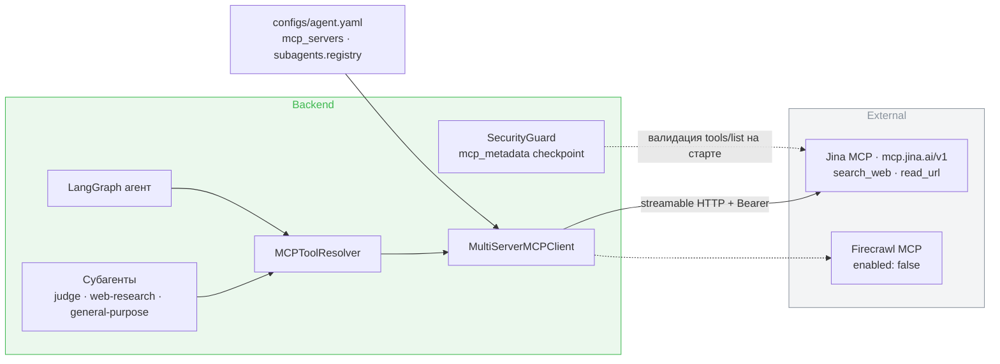

# Design Brief: feat-009 (J) — Web search MCP: замена Firecrawl на Jina AI

## Контекст и проблема

Внешние web-инструменты агента (поиск + чтение URL) подключены через MCP по ADR-007: провайдер — вопрос конфигурации, не кода. Default-провайдером был hosted Firecrawl MCP (free tier, 500 кредитов). Активный догфудинг исчерпал кредиты — сработал триггер из бэклога, итерация сдвинута вперёд относительно плана (исходно стояла за гейтом показа).

Требования к замене:

- покрыть оба сценария: веб-поиск и чтение произвольного URL → markdown — для основного агента и трёх субагентов (`judge`, `web-research`, `general-purpose`);
- официальный remote MCP (streamable HTTP + Bearer) — тогда замена остаётся правкой `configs/agent.yaml`, без кода и без self-hosted инфраструктуры;
- минимальная цена: ориентир архитектора — до ~$10/мес на горизонте первых преподавателей;
- качество не ниже приемлемого: Tavily отвергнут архитектором по качеству ещё на этапе ADR-007.

## Решение

**Провайдер — Jina AI** (remote MCP `https://mcp.jina.ai/v1`). Три firecrawl-инструмента заменяются двумя:

| Было | Стало | Примечание |
|---|---|---|
| `firecrawl_search` | `search_web` | поиск (s.jina.ai), top-5 результатов |
| `firecrawl_scrape` | `read_url` | Reader (r.jina.ai): JS-рендеринг, PDF, markdown |
| `firecrawl_extract` | — | отдельный extract умирает как класс (сам Firecrawl убрал его из MCP v2); извлечение из markdown агент делает сам |

Мотив решения (архитектор): фактически нулевая стоимость (free 10M токенов на ключ, далее ~$0.2–0.5 за 1000 операций) при приемлемом качестве и лучшем в нише reader'е; риски провайдера купируются тем, что замена — одна строчка конфига, лестница отступления зафиксирована ниже.

Self-hosted стек (SearXNG + Crawl4AI) сознательно отложен до масштаба реального продакшна: сейчас приоритет — скорость доставки фич, не операционная независимость.

### Целевая конфигурация

```yaml
mcp_servers:
  jina:
    enabled: true
    transport: http
    url: https://mcp.jina.ai/v1?include_tools=search_web,read_url
    api_key_env: JINA_API_KEY
    allowed_tools:
      - search_web
      - read_url
  firecrawl:            # выключенный fallback — возврат одной правкой
    enabled: false
    ...
```

Фильтрация инструментов двойная: серверная (`?include_tools=` — Jina не отдаёт лишние 17 tools уже на `tools/list`) плюс наш `allowed_tools` как второй рубеж. Блок `tavily` удаляется: провайдер отвергнут по качеству, мёртвый пример в конфиге — шум.

### Архитектура (не меняется — меняется конфигурация)



Весь рантайм-путь (клиент, резолвер, security-валидация `tools/list` при старте, graceful degradation при недоступности сервера) существует и не трогается. Затрагиваются только конфигурация, контракт имён инструментов и документация:

- `configs/agent.yaml` — блок `mcp_servers` + `tools` трёх субагентов в `subagents.registry` (имена резолвятся fail-fast при буте);
- `backend/contracts/agent-tool-names.json` — регенерация каноническим скриптом (`scripts/generate_tool_names_fixture.py`); нюанс: генератор по дизайну собирает `allowed_tools` всех объявленных серверов независимо от `enabled`, поэтому контракт содержит и `search_web`/`read_url`, и firecrawl-имена выключенного fallback-блока;
- `.env.example`, `.env.local.example`, `docker-compose.yml` — `JINA_API_KEY` (FIRECRAWL_API_KEY остаётся для выключенного блока, TAVILY_API_KEY удаляется);
- тесты, где firecrawl-имена зашиты как фикстуры;
- `doc/tech/*` — упоминания конкретных firecrawl-инструментов.

## Системная карта ресёрча (снимок: август 2026)

Ресёрч проведён в два прохода: self-hosted решения и hosted-сервисы (4 deep-dive по финалистам). Здесь — выжимка; цены и факты проверялись по официальным страницам провайдеров на дату снимка.

### Ветка self-hosted — отложена

Лучшая конфигурация: **SearXNG** (метапоиск ~70 движков, MCP-адаптер `ihor-sokoliuk/mcp-searxng`, streamable HTTP) + **Crawl4AI** (Apache-2.0, один контейнер, эталонный URL→markdown, встроенный MCP). +2–3 контейнера к compose, бесплатно и безлимитно. Структурный риск — блокировки upstream-движков (Google фингерпринтит SearXNG-паттерны с datacenter-IP); митигации известны (limiter + Valkey, реплики, outgoing-прокси). Отвергнутые: Firecrawl self-hosted (~7 контейнеров, официально «не production» baseline, для поиска всё равно требует SearXNG), open-webSearch (скрейпинг SERP, «for personal use only»), Perplexica/SurfSense (продукты, не tool-API). Возврат к этой ветке — при масштабе, когда счёт за hosted станет заметным.

### Hosted: дисквалификации

| Сервис | Причина |
|---|---|
| Tavily | качество — решение архитектора (ADR-007) |
| Perplexity | нет чтения URL вообще; 11+ с латентность, 7/8 по качеству (AIMultiple) |
| Brave | лучшее качество/латентность рынка, но только поиск (нет чтения URL) и нет hosted MCP |
| Serper / SerpAPI | сырой шумный SERP, официального MCP нет |
| Firecrawl платный | экономика планов не бьётся с нагрузкой: Hobby (5k кредитов, $16–19) мал вдвое, Standard ($83–99) — 11-кратный запас; `firecrawl_extract` в их MCP v2 уже не существует |

### Hosted: финалисты

| | **Jina** (выбран) | **Linkup** | **Parallel** | **Exa** |
|---|---|---|---|---|
| Поиск | обёртка над SERP, top-5 | свой стек + премиум-издания | свой индекс + кроулер | свой нейро-индекс |
| MCP tools | `search_web`, `read_url` | `linkup-search`, `linkup-fetch` | `web_search`, `web_fetch` | `web_search_exa`, `web_fetch_exa` |
| Цена (1k поисков / 1k чтений) | ~$0.2–0.5 / ~$0.2–0.5 | $5 / $1–5 | $5 (basic) / $1 | $7 / $1 |
| Free tier | 10M токенов на ключ | $20/мес возобновляемо | ~16k запросов старт | $20 старт + $10/мес |
| Качество (независимо) | поиск не верифицирован; reader — лучший в нише | только вендорский SimpleQA 91% | 4-е место AIMultiple (Pro) | 3-е место AIMultiple, топ на техдокументации |
| Латентность | search ~2.5 с; reader ~8 с | 1–3 с (заявлено) | basic ~1 с | ~1.2 с |
| Компания | куплена Elastic (10.2025), API-продукты активно развиваются | seed $10M (Gradient/Google) | $2B, Sequoia, Vertex AI grounding | $2.2B, a16z |

Общее слепое пятно всех четырёх: независимых данных о качестве на **русскоязычных** запросах нет — снимается только собственной эксплуатацией (наш E2E в этой итерации — первый смоук).

### Trade-offs выбора Jina и митигации

| Риск | Оценка | Митигация |
|---|---|---|
| Elastic-консолидация: интерес покупателя — модели в Elasticsearch, не standalone API | горизонт уверенности 12–24 мес; при этом MCP-репозиторий активно коммитится (август 2026) | замена провайдера = правка YAML; лестница отступления ниже |
| Поиск: top-5 результатов, SERP-обёртка, независимых бенчмарков нет | принято осознанно в обмен на цену | E2E-смоук на русскоязычных запросах в этой итерации; при деградации — шаг по лестнице |
| Латентность reader ~8 с/страница | терпимо: агент читает 1–3 URL за ход | — |
| Серия инцидентов s.jina.ai в августе 2026 (error rate до 88% на несколько часов) | аптайм 90-дневный при этом 99.98% | graceful degradation уже в рантайме: сервер недоступен → skip + warning, приложение живёт |
| Анти-бот сайты (Reddit и т.п.) отдают 403 | reader без коммерческого анти-бот слоя | принято; таких источников в образовательном профиле мало |

### Лестница отступления

1. **Linkup** — возобновляемые $20/мес free покрывают текущую нагрузку целиком; качество перед переходом проверить смоук-тестом (подтверждено только вендорским бенчмарком).
2. **Parallel** — мультиязычный basic ~1 с, мощнейший fetch (20 URL/вызов, JS+PDF), ~16k free на старте, далее ~$18/мес на нагрузке 3k+3k.
3. **Exa** — топ-качество на технической документации, $10/мес free-кредитов постоянно; риск: англо-центричный индекс, заметный API-churn (имена MCP-tools уже переименовывались).
4. **Self-hosted SearXNG + Crawl4AI** — при масштабе продакшна (см. выше).

Каждый шаг — правка `mcp_servers` + имён в `subagents.registry` + контракта имён; кода не касается.

## Процессные отметки

SOFA consulted и независимое ревью брифа свежим агентом пропущены по явному решению архитектора: бриф фиксирует уже принятое решение постфактум-финализации, итерация лёгкая (конфигурация без нового кода).
