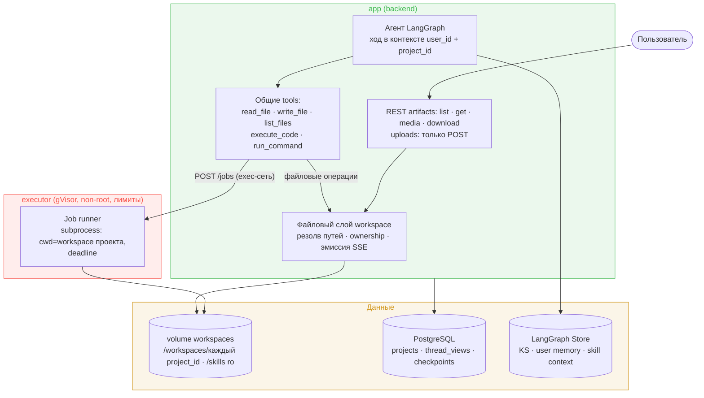
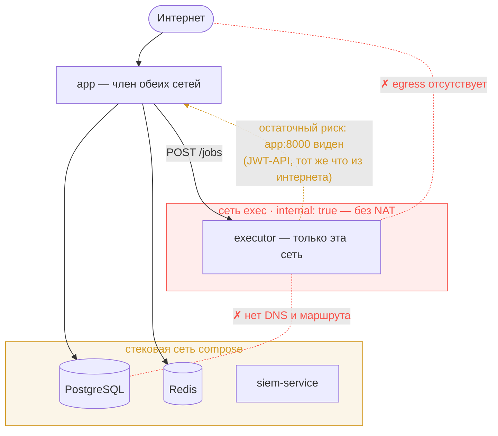
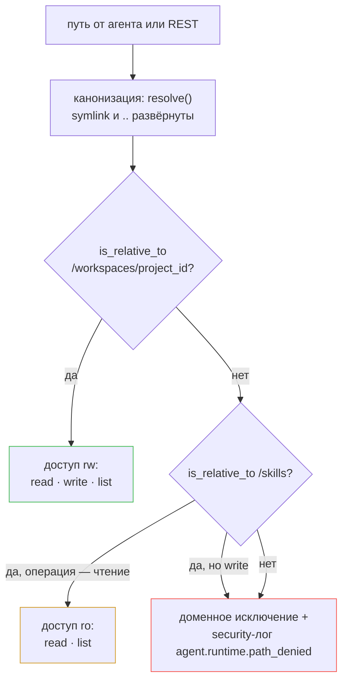
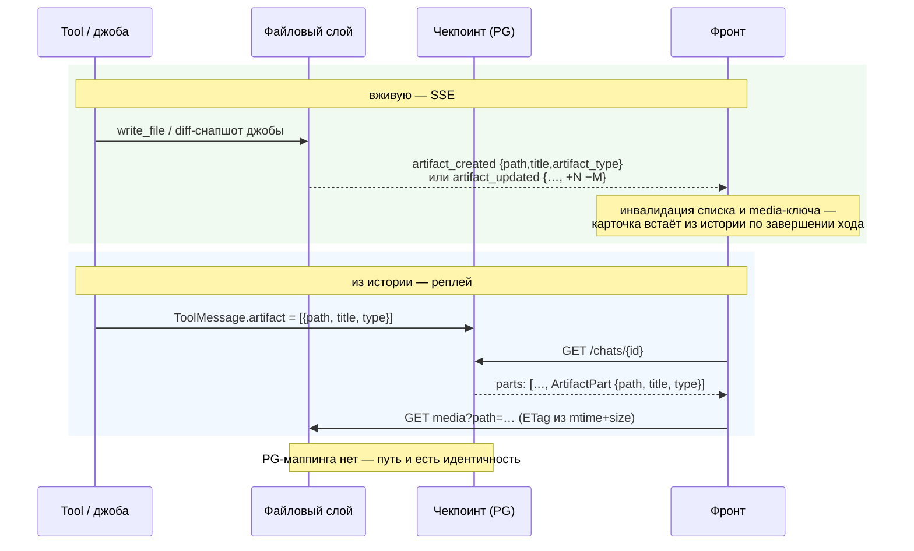
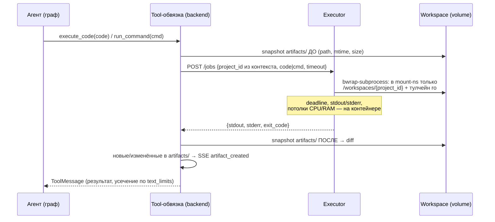
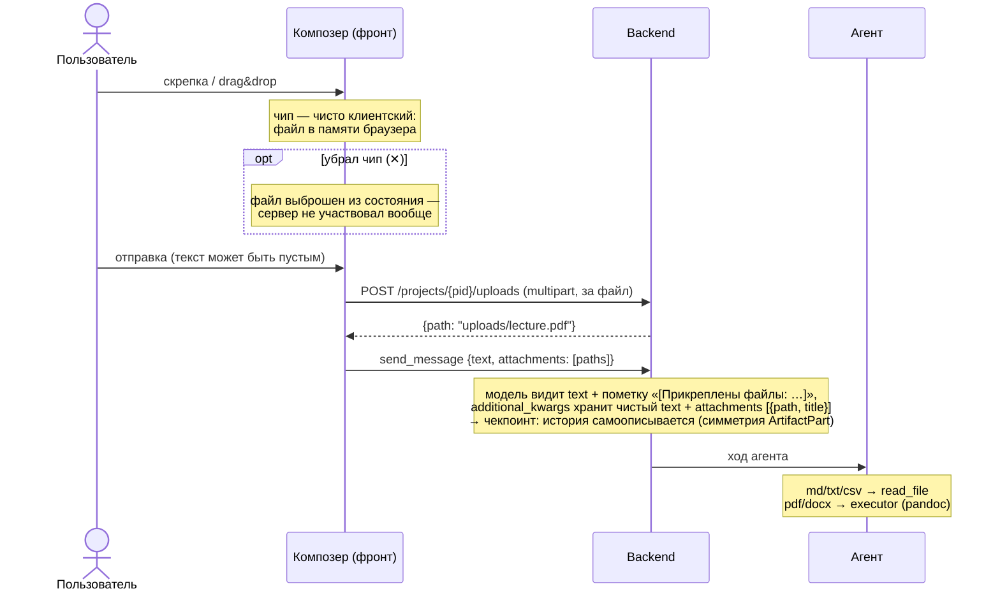
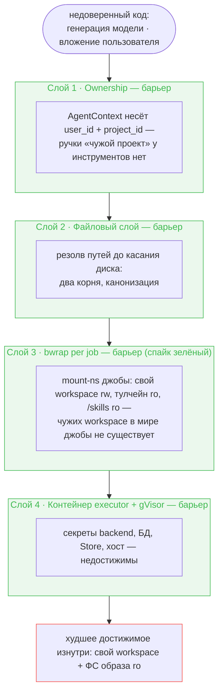

# Design Brief: feat-011 — Execution runtime

## Контекст

Агент получает среду выполнения кода — новую способность, а не точечный инструмент под фичу. Ближайшие потребители — выходные форматы гейта показа: PDF-экспорт (feat-005), слайды (feat-006), ГОСТ-скилл (feat-012); они реализуются поверх runtime как скиллы с готовыми скриптами. Стратегический горизонт — произвольные вычисления (расчёты, matplotlib) и, позже, оркестрация инструментов кодом.

Ключевая рамка, принятая при проработке: **это одна способность, а не три режима**. «Рецепт рендера» раскладывается на знания (скилл), готовый код (файлы скилла) и исполнение (runtime) — среда исполнения одна и та же для «собери PDF по скрипту скилла» и «посчитай статистику по файлу». Отдельного контракта рецептов, whitelist-режимов и второй сущности не существует.

Вместе со средой исполнения появляется **файловый workspace** — рабочее файловое пространство проекта. Он меняет модель хранения артефактов (переезд из PostgreSQL в файлы) и набор инструментов агента. Он же делает тривиальным вход файлов от пользователя — **file attachments (бывшая feat-004) поглощаются этой итерацией**: вложение = файл в workspace, отдельного ingestion-пайплайна не существует (см. § Вложения пользователя).

Решения об изоляции и файловой модели зафиксированы в [ADR-031](../../../../tech/adr/ADR-031-execution-runtime-isolation.md) и [ADR-032](../../../../tech/adr/ADR-032-project-workspace-file-model.md); здесь — полная картина итерации.

## Архитектура



Два принципиально разных канала:

- **Файловые операции** (`read_file`/`write_file`/`list_files`, REST-отдача артефактов) выполняет backend напрямую — volume смонтирован в оба контейнера. Это наш детерминированный код без исполнения LLM-сгенерированных программ; прогон через executor не добавил бы безопасности, но сделал бы песочницу критическим путём продукта (упавший executor = пользователь не открывает артефакты) и потребовал бы файлового RPC-протокола.
- **Исполнение процессов** (`execute_code`, `run_command`) уходит в executor — отдельный сервис compose, единственное место, где запускается недоверенный код.

Файловый слой backend — единая точка: резолв и проверка путей, ownership, лимиты, эмиссия SSE-событий. Executor — намеренно тупой исполнитель без продуктовой логики: не знает о пользователях, исполняет любую джобу из exec-сети (порт наружу не публикуется). Модель доверия — как у PostgreSQL: авторизация происходит уровнем выше, backend думает — executor исполняет.

```mermaid
flowchart LR
    subgraph BE["app «думает» — вся продуктовая логика"]
        direction TB
        B1[Ownership<br/>user_id + project_id из AgentContext]
        B2[Резолв и проверка путей<br/>два корня, канонизация]
        B3[Снапшоты artifacts/ до и после джобы<br/>→ SSE artifact_created]
        B4[Лимиты и таймауты<br/>Settings-knobs, усечение вывода]
    end
    subgraph EX["executor «исполняет» — ноль продуктовой логики"]
        direction TB
        E1[Не знает пользователей и проектов:<br/>project_id — просто имя директории cwd]
        E2[Не отчитывается о файлах:<br/>только stdout · stderr · exit_code]
        E3[Исполняет любую джобу из exec-сети:<br/>авторизация уровнем выше — как у PostgreSQL]
    end
    BE -->|"POST /jobs — единственный канал"| EX

    style BE fill:#3fb9501a,stroke:#3fb950,color:#3fb950
    style EX fill:#f851491a,stroke:#f85149,color:#f85149
```



**Сетевая сегментация (barrier).** Executor вынесен в выделенную сеть `exec` (app ↔ executor) с `internal: true` и исключён из стековой сети compose — db/redis/siem для недоверенного кода джобы недостижимы (нет ни DNS, ни маршрута), **интернета из executor нет вообще** (internal-сеть без NAT: заодно умирает network-exfiltration). App состоит в обеих сетях: stack — для БД, exec — для `POST /jobs`. Остаточный риск: netns привязан к контейнеру, не процессу, поэтому джоба видит `app:8000` (JWT-защищённый API, тот же что в интернете) — закрывается пустым netns джобы через обёртку `unshare -n` вокруг bwrap (родной `--unshare-net` bwrap под gVisor фатален — спайк, см. § Executor), в v1.



## Workspace: файловая модель

**Скоуп — per project.** Совпадает с доменной моделью: артефакты, Knowledge Sphere, настройки и чаты живут в проекте; проект — «рабочая папка курса». Per thread отвергнут (файлы не переживают чат — ломается сценарий «продолжи вчерашнюю работу»), per user отвергнут (свалка файлов всех проектов, удаление проекта не чистит файлы).

```
/workspaces/{project_id}/        ← volume, смонтирован в app и executor
├── artifacts/                   ← зона публикаций: выход агента, то, что видит UI
├── uploads/                     ← вложения пользователя: вход (см. § Вложения)
└── …                            ← рабочие файлы агента: свободная зона
/skills/                         ← отдельный ro-mount из репозитория, вне workspace
```

- **Lifecycle:** workspace создаётся с проектом (лениво — при первом обращении), живёт с ним, удаляется вместе с ним (удаление директории в `ProjectService.delete_project`). Персистентный: файлы переживают чаты и рестарты. Политика ретенции/чистки рабочей зоны не вводится — объёмы текущего масштаба этого не требуют. Удаление проекта не дожидается живых ранов агента: ход, переживший удаление, может пересоздать директорию ленивым `mkdir` — редкая orphan-директория принята (масштаб догфудинга), порядок «отменить раны при delete» не вводится.
- **Границы путей (два корня):** файловый слой держит список разрешённых корней — **workspace `/workspaces/{project_id}` (rw)** и **`/skills` (ro)**. Любой путь от агента резолвится против подходящего корня с проверкой `resolve()` + `is_relative_to()` (паттерн уже стоит в `load_skill`, `agent/tools/skills.py`); резолв идёт по **канонизированному пути** (после `resolve()`), чтобы symlink/подмена компонента не обходили проверку. Выход за оба корня — отказ. `read_file`/`list_files` работают с обоими корнями; `write_file` — **только workspace** (`/skills` read-only, неизменяемость гарантирует ro-mount). `project_id` не параметр инструментов — приходит из `AgentContext` от backend: агент не может назвать чужой проект. Отказ резолва — доменное исключение файлового слоя (не `HTTPException`); для истории безопасности пишется security-лог (класс `agent.runtime.path_denied` — добавить в `siem_contracts/vocabulary.py`).



- **Конкурентность:** два параллельных чата одного проекта делят workspace; конфликты файлов принимаются как норма рабочей директории (аналог поведения Claude Code). Атомарность записи — `tmp + rename`.
- **Store не трогаем:** Knowledge Sphere (per project), user memory, custom instructions, skill-context (per user) остаются в LangGraph Store — специализированное хранилище с семантическим поиском; per-user данным в per-project workspace структурно не место. Будущий перенос KS в файловую модель — зафиксированное направление ([ADR-032](../../../../tech/adr/ADR-032-project-workspace-file-model.md) § Следствия), отдельной итерацией вместе с версионированием сферы.

## Артефакты: переезд из PostgreSQL в workspace

Артефакт = файл в `artifacts/`. Таблицы `artifacts` и `artifact_blobs` упраздняются. **Существующие данные не мигрируются**: артефактов/чатов прод-масштаба нет (личный догфудинг) — старые артефакты и, при необходимости, чаты сносятся; миграция сводится к drop-миграции таблиц, без выгрузки PG→файлы и без маппинга UUID→путь. Обратная совместимость истории до миграции не проектируется.

- **Идентификатор = путь.** Идентичность артефакта — путь относительно зоны `artifacts/` (`lecture-1/slides.md`, без префикса `artifacts/`). Искусственный UUID убирается совсем — источник правды один, файловая система, PG-индекса нет. Вложенность (поддиректории) поддерживается по умолчанию. Переименование/удаление файла агентом делает старые ссылки истории битыми — принято как естественное свойство файловой системы. События удаления нет; чтобы список не копил призраков, фронт инвалидирует список артефактов по завершении каждого хода, а клик по исторической карточке несуществующего файла показывает во вьюере явное состояние «файл больше не существует», не голую ошибку. Полный lifecycle (`artifact_deleted`, версии) — backlog «Версии артефактов».
- **Адресация REST — путь в query-параметре**, не в сегменте URL: `…/artifacts?path=lecture-1/slides.md` (detail), `…/artifacts/media?path=…`, `…/artifacts/download?path=…`, `…/artifacts` без `path` (list = дерево). Причина: путь-как-сегмент конфликтует со слэшами URL (ASGI разворачивает `%2F` до роутинга, суффиксы становятся неоднозначны, React-роут не матчит слэши); query-параметр кодирует слэши штатно и держит любую вложенность. Из detail-ответа уходят `thread_id`/`message_id`; обратная навигация «артефакт → чат» теряется — принято.
- **Связь «артефакт ↝ чат» — `ArtifactPart`.** Вводится typed part нового типа `ArtifactPart` {path, title, type, kind, diff?}, выводимый из `ToolMessage.artifact` при реплее чекпоинта. `kind: created | updated` различает создание и перезапись существующего пути (бейдж «обновлён» на карточке — и вживую, и из истории); `diff {added, removed}` — компактные счётчики строк для текстовых обновлений (`null` для бинарных и создания; см. эмиссию ниже). Путь — сквозная идентичность: запись (diff-снапшот джобы / `write_file` → `ArtifactPart` в чекпоинте) и чтение (реплей → карточка по пути → файл по пути) обходятся без PG-маппинга (`set_message_id`/`list_by_thread`/колонка `message_id` уходят). Фронт переучивается рендерить артефакты на уровне part, не из `message.artifacts`. Джоба с N файлами → N `ArtifactPart` (конверт `content_and_artifact` расширяется до списка).



- **Метаданные:** `title` — имя файла, `type` — расширение (`md`, `png`, …), `updated_at` — mtime (после перезаписи агентом дата обновляется — это `updated_at`, не `created_at`; сортировка list — по нему). Frontmatter не вводится, пока не появится потребность в метаданных сверх этого. **Категорию вьюера определяет фронт** словарём расширение→категория (`png`/`jpg`/`webp` → image, `md` → markdown, …) — сейчас `type` семантический (`"image"`) и фронт ветвится по нему, словарь заменяет эту ветку. Detail для бинарного файла отдаёт метаданные без `content` — тело только через `media`.
- **Эмиссия `artifact_created`:** единая точка — файловый слой backend. Прямая запись агентом (`write_file` в `artifacts/`) эмитит сразу. Появление файлов после джобы определяет **сам backend снапшотом зоны `artifacts/` до и после джобы** (diff по `(path, mtime, size)`) — не manifest от executor: backend доверенная сторона с примонтированным volume, наблюдает ФС напрямую, executor остаётся тупым исполнителем без отчёта о файлах (та же модель доверия «backend думает — executor исполняет», что в ADR-031). Это снимает необходимость валидировать пути из песочницы (их backend не принимает вообще). Тот же снапшот отличает новые пути (`artifact_created`) от изменившихся (`artifact_updated`, см. ниже). **Принятое ограничение:** параллельные джобы одного проекта видят чужие файлы в общем снапшоте `artifacts/` — ложные срабатывания приняты для текущего масштаба (пересмотр при изоляции джоб друг от друга по триггеру).
- **Создание vs обновление — два события.** Перезапись существующего пути эмитится отдельным SSE-событием **`artifact_updated`** (payload = path/title/artifact_type + компактная дельта `{added, removed}` — счётчики строк). **Wire-имя типа файла — `artifact_type`** в обоих событиях: конверт SSE плоский (`{"type": event.type, **event.data}` в `messages.py`), ключ `type` из payload затёр бы тип события; `type` остаётся только в `ArtifactPart` истории, где конверта нет. Распознавание дёшево: `write_file` видит существующий файл и читает старое содержимое перед перезаписью (точные счётчики); для джобы before-снапшот дополняется копией содержимого текстовых файлов зоны `artifacts/` — лимиты `Settings` per-file **и** суммарный на джобу, превышение любого → дельта `null`; копия живёт в памяти процесса на время джобы (для бинарных — тоже `null`; hardlink-трюки не используются: джоба может писать in-place, hardlink-копия отразила бы уже новое содержимое). Принятое ограничение параллельных джоб (см. эмиссию выше) распространяется и на дельты: счётчики могут захватить чужие правки. UI: бейдж «обновлён · +N −M» на карточке; по `artifact_updated` фронт инвалидирует media-ключ пути (связка с ETag-ревалидацией); карточка в ленте — из истории по завершении хода, live-рендер по SSE не вводится (backlog). **Полный дифф-просмотр (канвас-стиль) сознательно не делается** — требует хранения версий; мотивация дописана в backlog «Версии артефактов».
- **REST:** четыре существующих GET-endpoint'а (list, get, media, download) сохраняют семантику, меняется сигнатура (path-query вместо `{artifact_id}`), реализация читает файлы. `download?format=pdf` (сломанный wkhtmltopdf-путь) не переносится — PDF-экспорт становится скиллом поверх runtime в feat-005. **Кэш `media`:** immutable-кэш заменяется на ETag/Last-Modified из (mtime + size) + `Cache-Control: no-cache` — путь-id перезаписываем, immutable отдавал бы вечно старую версию; браузер ревалидирует (304/200), фронт инвалидирует media-ключ по `artifact_created`/`artifact_updated`, а список артефактов — дополнительно по завершении каждого хода (событий удаления/переименования нет).
- **`generate_image`** остаётся специфичным инструментом (вызов image-модели), но результат кладёт файлом в `artifacts/` вместо PG-блоба. Механика вызова и качество не меняются — меняется только «куда положить»: имя файла = слаг от `title` + расширение из mime ответа (`image/png → .png`; маппинг mime→расширение — новый небольшой код). Слаг сохраняет unicode (кириллица легальна — путь-идентичность и REST её держат), вычищая лишь недопустимое для ФС (слэши, управляющие символы); пустой результат → fallback `image-N`; коллизия имён → числовой суффикс. Запись `tmp + rename` после успешного ответа API (замена транзакционного «всё-или-ничего» PG). Промпт отдельной колонки лишается (в PG-модели лежал в `content`) — он и так виден в аргументах вызова инструмента в ленте и в Langfuse-трейсе, дома-колонки ему больше не нужно. По ленте/SSE идёт тем же путём, что остальные артефакты.

## Executor: контракт джобы



- Джоба синхронна: tool ждёт результата под таймаутом. **Иерархия таймаутов** — один `Settings`-knob (deadline джобы); client-timeout httpx-обвязки = deadline + фиксированный запас, чтобы executor всегда успевал убить джобу раньше, чем отвалится клиент. Очередь/асинхронность не вводится — рендер и расчёты укладываются в десятки секунд; пересмотр при появлении многоминутных сценариев.
- Существование workspace до джобы гарантирует tool-обвязка backend (`mkdir(parents=True, exist_ok=True)` перед `POST /jobs` — идемпотентно); executor директорий не создаёт. Все mkdir — на стороне backend: при едином uid (§ Конвенции) владелец каталога автоматически совпадает с uid джобы — требование gVisor к записи выполняется без специальных шагов.
- **Env джобы — чистый**: subprocess стартует со scrubbed env (минимальный PATH/HOME), не наследуя env executor-сервиса; секретов основного стека в env executor нет by design. Auth на `/jobs` не вводится — доступ контролирует exec-сеть.
- **Изоляция per job — bwrap-префикс (спайк зелёный).** Джоба запускается не голым subprocess, а внутри `bwrap`: в mount-namespace джобы биндятся только её workspace (rw), тулчейн образа (ro) и `/skills` (ro) + tmpfs `/tmp` — чужие workspace физически отсутствуют (ни чтения, ни записи/удаления). Пути **внутри** исполняемого кода не парсятся принципиально (любой blacklist обходится обфускацией) — граница проходит по видимости ФС, не по анализу кода. **Спайк подтвердил выполнимость под gVisor** ([spikes/spike-bwrap-gvisor.md](spikes/spike-bwrap-gvisor.md)): изоляция чужих директорий честная (чужой workspace = ENOENT, `/skills` = EROFS), non-root через userns без setuid-bwrap. Два следствия спайка в контракт: (1) родной `--unshare-net` у bwrap под gVisor фатален (в netns нет `lo`) — сеть режется внешней обёрткой `unshare -U --map-current-user -n` перед bwrap (пустой netns → сокеты не создаются, `app:8000` закрыт); (2) **workspace-каталог обязан принадлежать uid джобы** — иначе запись под gVisor падает `EINVAL` даже при mode 777. Прод-перепроверка (docker+runsc+Ubuntu: seccomp/AppArmor на unprivileged userns) — шаг setup/production, не блокер дизайна. Fallback при регрессе на проде — setuid-per-project.
- Параллельные джобы — параллельные subprocess'ы; потолки CPU/RAM ставятся на executor-контейнер целиком (compose `cpus`/`mem_limit` + `pids_limit` от fork-bomb), per-job — только deadline. **Kill-контракт под bwrap — трёхзвенная цепочка**, потому что `--new-session` уводит джобу в другую сессию и `os.killpg` до неё не дотягивается: (1) deadline бьёт `killpg` по группе обёртки (`unshare`+`bwrap`, `start_new_session=True`); (2) `--die-with-parent` (PDEATHSIG) убивает джобу вслед за bwrap; (3) джоба — pid 1 своего pid-namespace (`--unshare-pid`), коллапс namespace добивает внуков (pandoc, shell-конвейеры). Флаги `--new-session` / `--die-with-parent` / `--unshare-pid` — обязательные элементы kill-контракта, не оптимизация. Голодание параллельных джоб (deadline от нехватки CPU неотличим от «плохого кода») принято для текущего масштаба.
- **Потолок вывода джобы — на стороне executor** (`EXECUTOR_`-knob, усечение stdout/stderr с пометкой): без него `cat huge.bin` копит вывод в памяти executor до OOM всего сервиса вместе с параллельными джобами. Усечение `text_limits` в backend остаётся вторым уровнем — под контекст модели.
- Ошибки джобы (ненулевой exit, таймаут) — обычный результат tool'а (`ToolMessage` со stderr/диагностикой), не исключение: агент видит ошибку и чинит код — это рабочий цикл, а не отказ. **Транспортные отказы** (executor недоступен: connect refused, HTTP-таймаут) обвязка ловит узким классом httpx-ошибок и возвращает in-band «execution runtime unavailable — инфраструктурная проблема, не ошибка кода», чтобы агент не ретраил починку кода; прочие исключения — generic `handle_tool_errors` как сейчас.
- **Деплой:** `stop_grace_period` executor-контейнера ≥ deadline джобы — SIGTERM даёт in-flight джобам дожить, SIGKILL не рубит запись на полпути.
- **Отмена (v1 — сироты приняты).** При отмене хода (стоп пользователя, обрыв SSE) `CancelledError` рвёт `await POST /jobs`, но subprocess в executor доживает до deadline и дописывает файлы. v1 executor не убивает джобу по обрыву соединения — джобы короткие (десятки секунд). Следствие: отменённая джоба может оставить файлы в `artifacts/` без `artifact_created` (backend не делает after-снапшот) — «призрачные» артефакты видны в list, но не в ленте чата. Принято для догфудинга; правильный kill-on-disconnect отложен в backlog вместе с развязкой графа от SSE-отдачи (тот же контур дисконнекта).
- Образ executor — **толстый, всё запечено**: Python + научный стек (numpy, pandas, matplotlib) + рендер-тулчейн (pandoc, marp/slidev-класс, python-docx, docxcompose, шрифты) — точный состав финализируют спайки feat-005/006 по ADR-026. **Интернета и pip в рантайме нет** (пересмотр раннего наброска: общий site-packages всех джоб дал бы интерференцию версий между пользователями и плацдарм вредоносных пакетов — ADR-031); недостающий пакет добавляется релизом образа, систематический спрос виден по stderr джоб. **Спайки включают smoke под runsc**: «pandoc + headless-Chromium реально отработали под gVisor на volume-mount» (Chromium под gVisor исторически капризен — syscalls, `/proc`, часто нужен `--no-sandbox`), а не только «runsc установился» — иначе fallback на runc молча станет постоянным, обнулив второй слой изоляции. **Смоук-набор образа как процесс**: сценарии-скрипты в `services/executor/smoke/` (реальные задачи, не import-проверки: matplotlib→png, pandoc md→docx, извлечение текста из pdf, сборка docx через python-docx, наличие шрифтов), прогоняются внутри собранного образа одной make-целью с параметром runtime — ворота двухступенчатые: релиз образа гейтится прогоном под runc (проверяет состав: недостающая транзитивная зависимость ловится смоуком, а не пользователем); gVisor-совместимость тулчейна runc-прогон поймать не может — та же цель с `--runtime=runsc` гоняется на VM как шаг чек-листа деплоя (рядом с прод-верификацией bwrap, § Конвенции). Список сценариев согласуется на этапе plan (автоматизация приёмки B4).

## Инструменты агента: было → стало

| Инструмент | Судьба | Причина |
|---|---|---|
| `read_file` · `write_file` · `list_files` | **новые** | явные файловые операции: дешевле для модели, чем код ради чтения файла; говорящая лента активности |
| `execute_code` · `run_command` | **новые** | Python-код / bash в workspace через executor; `execute_code` — специализация поверх той же механики |
| `create_artifact` | **упраздняется** | артефакт = файл в `artifacts/`, покрыт `write_file` и diff-снапшотом джобы |
| `load_skill` | **остаётся**, меняет реализацию | семантический вход в скилл: читает `SKILL.md` через файловый слой (`/skills`) и докидывает per-user индекс skill-context из Store — механика персонализации сохраняется 1:1; говорящая строка в ленте. Индекс скиллов в системном промпте остаётся (генерится backend'ом при старте из файлов). Остальные файлы скилла (скрипты, референсы) агент читает `read_file` |
| `generate_image` | меняет запись | вызов image-модели остаётся, результат — файл в `artifacts/` |
| KS tools · user memory · skill-context | без изменений | Store-механики |
| `run_subagent` | **меняет контракт входа** | `input_artifact_ids` (UUID → PG) становятся путями; родитель читает файл через файловый слой и вкладывает содержимое субагенту (субагентам файловых инструментов в v1 не даём); description переписывается (`create_artifact` → `write_file`) |
| firecrawl MCP | без изменений | субагентам новые tools в v1 не выдаются |

Следствия для обвязки (чек-лист «добавляешь инструмент» из `conventions/agent.md`): подписи новых инструментов во фронт-реестре `agent-tools.ts`, регенерация фикстуры `agent-tool-names.json`, отражение упразднённых. По инструментам новых SSE-типов провода **не вводится**: новые инструменты покрыты generic `tool_call_*`/`tool_result`, во фронте — только записи реестра подписей + raw-разворот строки ленты (типизированный rich-рендер не вводится). Единственный **новый** SSE-тип — `artifact_updated` (рядом с существующим `artifact_created`, тот же канал reporter'а). `streaming.md` правится в части: источник `artifact_created` (файловый слой), payload (`id`→`path`, wire-имя `artifact_type`), новое событие `artifact_updated`, invalidation-таблица, `ArtifactPart` в истории, уход post-hoc привязки `set_message_id` в `ChatService`.

**Канал эмиссии `artifact_created`/`artifact_updated`** остаётся в reporter'е узла `tools` — за guard-проверкой TOOL_RESULT, в per-call flow (файловый слой не пишет в stream writer в обход). Механика: инструмент возвращает `response_format="content_and_artifact"`, где `artifact` — **список** (не один dict); каждый элемент несёт признак created/updated (+ дельту для updated), reporter эмитит N событий соответствующего типа. `write_file` даёт список из одного; джоба (`execute_code`/`run_command`) — список по diff-снапшоту `artifacts/`. Так N файлов одного вызова корректно доезжают до провода без обхода guard-flow. Работает при одном uvicorn-воркере (tool и SSE-подписчик — один процесс) — допущение фиксируется явно.

## Контракты файловых инструментов

Дефолты по образцу поведения обычной ФС; тонкие детали (точные лимиты) — operational knobs в `Settings`.

- **`read_file(path)`** — текст файла из workspace или `/skills`. Лимит размера чтения — `Settings`-knob (по образцу `text_limits`); превышение — усечение с пометкой. Бинарь на чтение → error-строка «binary file, use media endpoint» (прецедент `load_skill`), не сырые байты в контекст.
- **`write_file(path, content)`** — текстовая запись **только в workspace**. Родительские директории создаются автоматически (`parents=True`); перезапись молчаливая (норма рабочей директории); атомарность `tmp + rename`, tmp — в целевой директории (та же ФС, иначе `rename` через границу ФС падает) с префиксом, исключаемым из list/снапшота. Бинарные артефакты рождаются в джобе или `generate_image`, не через `write_file`.
- **`list_files(path=".")`** — нерекурсивный листинг директории workspace/`/skills` по умолчанию; рекурсия — опциональным флагом. Вывод — относительные пути + признак файл/директория. tmp-файлы записи скрыты.
- **`execute_code(code)` vs `run_command(cmd)`** — обе через executor, `cwd` = workspace. `execute_code` — специализация: `code` пишется во временный файл в workspace через файловый слой (тот же tmp-префикс, что у атомарной записи, — скрыт из `list_files` и diff-снапшота) и исполняется системным Python образа (не `python -c`, чтобы трейсбеки были читаемы и код не упирался в лимиты аргументов); в команде джобы файл адресуется **относительным путём от cwd** — абсолютный backend-путь `/workspaces/{pid}/…` внутри mount-ns джобы не существует; обвязка удаляет файл в `finally` (мусор не копится и агенту не виден); `run_command` — bash-строка. Установка пакетов в рантайме невозможна — сети и pip у executor нет (ADR-031), весь тулчейн из образа; окружение джоб одинаково для всех и меняется только релизом. Рабочие (не-`artifacts/`) файлы джобы остаются в workspace как рабочая память агента.

## Вложения пользователя (file attachments)

Бывшая feat-004, поглощена: workspace снял вопрос хранения (вложение = файл в `uploads/`), runtime снял вопрос ingestion (извлечение текста из бинарных форматов делает агент сам через executor). Остаётся тонкий контракт загрузки и UI.

**Тайминг — ничего не уходит на сервер до отправки сообщения** (UX-эталон — ChatGPT: файл прикреплён чипом в композере, но окружение агента не видит его, пока сообщение не отправлено):



- **Агент** видит пометку с путями в user-сообщении (в живом ходе и во всей истории) и решает сам: текстовые форматы (`md`/`txt`/`csv`) — `read_file` напрямую; бинарные (`pdf`/`docx`) — извлечение текста через executor (pandoc в образе). Конвертации при загрузке нет — runtime и есть ingestion.
- **UI** рендерит чип вложения из metadata, не парся текст: `additional_kwargs` сообщения хранит чистый пользовательский text и список `attachments [{path, title}]`; history-эндпоинт отдаёт их отдельными полями `MessageOut` — пометку «[Прикреплены файлы: …]» видит только модель, дубля «чип + та же пометка текстом» в UI нет; после перезагрузки чипы на местах. Чип в истории некликабелен (v1): REST-чтения `uploads/` нет — uploads-endpoint только `POST`. Интерактивный мокап — [mockups/attachments-artifacts.html](mockups/attachments-artifacts.html): чат с прикреплением (скрепка → системный диалог, drag&drop, чип с прогрессом, ✕), два варианта отображения «артефакт обновлён», дерево артефактов с вложенностью. Токены 1:1 из `index.css`, обе темы.
- Пометку формирует **backend**, не фронт: он единственный знает канонический путь (сам его выдал), фронт лишь возвращает полученное.
- **Имя файла в `uploads/`**: basename пользовательского имени + санитайз до безопасного класса символов (слэши и управляющие вычищаются — поддиректорий из имени не возникает; пустой результат → generated-имя), коллизия → числовой суффикс (симметрия `generate_image`). Повторная загрузка `lecture.pdf` не перезаписывает файл, на который указывает metadata старого сообщения.
- Лимит размера файла — `Settings`-knob; upload идёт через файловый слой (те же границы путей, запись только в `uploads/`).
- Edge: upload прошёл, send упал — файл остаётся в `uploads/` без сообщения; принято (тот же класс, что сироты джоб, ретенции нет).
- Security: вложение — недоверенный вход того же класса, что файлы джоб (принятое ограничение «файлы workspace как вход в контекст», § Безопасность); guard выключен — принято.

## Скиллы: хранение и доступ

Хранение не меняется: директория `skills/` репозитория, деплой через git, bind-mount **read-only** — теперь в оба контейнера (app и executor) по единому пути `/skills`. Копирования в workspace нет — нет и задачи сверки/обновления: деплой обновляет скиллы атомарно для всех. Вход в скилл — `load_skill` (SKILL.md + skill-context); отдельные файлы скилла агент читает `read_file`, скрипты исполняет через `run_command`/`execute_code`. Скиллы вне workspace — они общие и не принадлежат проекту. Неизменяемость гарантирует ro-mount, а не дисциплина. Модель хранения пользовательских скиллов (per user или per project, попадание в стартовый индекс) — открытый вопрос feat-007, здесь не решается; текущая модель двери не закрывает.

## Безопасность: границы и принятые ограничения

Контекст: LLM-защита в проде выключена kill-switch'ем (ADR-029, chore-001) и не планируется к включению — guard-обвязка вокруг новых инструментов не наращивается. Единственное требование — **недоверенный код не исполняется на хосте и не достаёт до основного стека**.

Слои, сверху вниз:

1. **Ownership (существующий):** ход агента привязан к `(user_id, project_id)` через `AgentContext`; у инструментов нет ручки «чужой проект».
2. **Файловый слой (барьер):** path traversal отсекается резолвом путей до касания диска.
3. **bwrap per job (барьер, спайк зелёный):** mount-namespace джобы содержит только её workspace (rw), тулчейн образа (ro) и `/skills` (ro) — чужие workspace недостижимы ни на чтение, ни на запись/удаление. Резолв путей (слой 2) защищает только аргументы файловых инструментов; для путей внутри исполняемого кода границей служит именно этот слой. Спайк подтвердил под gVisor; fallback при прод-регрессе — setuid-per-project.
4. **Граница контейнера executor (барьер, gVisor):** код агента не видит секретов backend, БД, Store, хоста. Худшее достижимое изнутри — файлы других workspace'ов на том же volume.



Cross-project доступ из джоб (чтение **и запись/удаление** чужих workspace абсолютным путём — вплоть до `rm -rf /workspaces`) закрывается bwrap per job в этой же итерации (слой 3) — **спайк подтвердил выполнимость под gVisor** ([spikes/spike-bwrap-gvisor.md](spikes/spike-bwrap-gvisor.md)). Fallback при прод-регрессе — setuid-per-project. Зафиксировано в ADR-031.

Принятое ограничение v1: **файлы workspace — недоверенный вход в контекст агента.** Файл, записанный джобой или загруженный пользователем, на следующем ходу читается агентом обратно как рабочая память — при выключенном guard это канал prompt injection с самоусилением (джоба пишет → агент читает → исполняет). Мера не вводится — реалистичный вектор требует prompt injection при текущем составе пользователей (владелец + доверенные преподаватели); поверхность уже, чем в раннем наброске: сети и pip у executor нет, вредоносный код не может прийти из интернета — только из вложения пользователя или генерации модели. Пересмотр — триггером внешних пользователей.

## Scope boundaries

- **Оркестрация инструментов кодом (code-mode / CodeAct)** — не в этой итерации: требует RPC-моста из среды исполнения к tool-runtime и отдельного узла графа. Фундамент дверь не закрывает (workspace + внутренний HTTP-канал — та же механика). Решение о взятии — при финализации итерации, по фактической цене; иначе — backlog.
- **Knowledge Sphere в файловую модель** — не в этой итерации; направление зафиксировано, делать вместе с версионированием сферы.
- **Квоты диска, очередь джоб, изоляция параллельных джоб друг от друга (общий снапшот `artifacts/`), per-job venv для возврата pip** — по триггерам (внешние пользователи, реальная нагрузка). bwrap per job — **в этой итерации** (не по триггеру): спайк подтвердил выполнимость под gVisor.
- **Субагенты с execution-инструментами** — при спросе.
- **Ретенция/чистка workspace, бэкап volume** — вне итерации; бэкап-контур продумывается ближе к реальному проду.

## Конвенции (фиксируются в реализации)

- Executor — второй standalone-сервис по образцу `siem-service`: `services/executor/`, свой Dockerfile (build context — корень), env-префикс `EXECUTOR_`, healthcheck. Compose: выделенная сеть `exec` (app ↔ executor) с `internal: true` (без NAT — egress в интернет отсутствует), executor вне стековой сети; app — в обеих сетях. Порт executor не публикуется.
- Таймауты джоб — операционные knobs в `Settings` (4 синхронных места по жёсткому правилу: `Settings`, `.env.example`, `.env.local.example`, compose).
- Файловый слой — новый модуль в backend (кандидат: `app/storage/` рядом с `BlobStorage`-соседями), `typing.Protocol` не заводится до второго бэкенда (правило § Интерфейсы).
- Общий volume пишут оба контейнера под **единым uid: app = executor = джоба** — обязательное требование, не вариант: под gVisor запись в каталог требует совпадения владельца (`EINVAL` даже при mode 777, umask не помогает — следствие спайка bwrap). Все mkdir делает backend (создание проекта, tool-обвязка) — владелец каталога автоматически совпадает с job uid. Изоляцию это не ослабляет: границей между проектами служит mount-ns bwrap, не POSIX-права. Единый uid — свойство bwrap-схемы; fallback setuid-per-project разъединяет uid'ы (детерминированный uid проекта, `0770`, `CAP_SETUID`) и переносит mkdir в executor.
- bwrap-префикс джобы (executor): сеть режется внешней обёрткой `unshare -U --map-current-user -n` (родной `--unshare-net` bwrap под gVisor фатален — нет `lo`); mount-набор — `--ro-bind` тулчейна образа, `--bind` своего workspace, `--ro-bind /skills`, `--tmpfs /tmp`, `--clearenv` + минимальный env; setuid-bwrap не нужен (userns). Точный префикс и прод-нюансы — [spikes/spike-bwrap-gvisor.md](spikes/spike-bwrap-gvisor.md).
- На прод-VM volume workspaces выносится на отдельную точку монтирования (шаг setup/production, рядом с установкой runsc): дефолтное размещение в `/var/lib/docker/volumes` делит ФС с `pgdata` и корнем хоста — джоба, заполнившая диск, положила бы Postgres, а не только просмотр артефактов. **Там же — прод-верификация bwrap** (docker+runsc+Ubuntu): `bwrap --unshare-user` от non-root под дефолтным seccomp docker и AppArmor Ubuntu на unprivileged userns — первая проверка при развёртывании (спайк гонялся в `runsc --rootless`, прод-топология отличается).
- `streaming.md` — по чек-листу из § Инструменты (источник, payload `path`/`artifact_type`, `artifact_updated`, invalidation-таблица, `ArtifactPart`, уход `set_message_id`); фронт-реестр подписей — по чек-листу «добавляешь инструмент».
- В Langfuse-спан tool-вызова джобы кладутся `exit_code` и длительность (для дебага рендер-скиллов); LLM-стоимости у джобы нет.
- Полный чек-лист сноса PG-цепочки артефактов (за пределами tools): `services/chat.py` (сбор `artifact_ids`, `set_message_id`), `routes/chats.py` (группировка), `deps.py` (`ArtifactServiceDep`, `BlobStorageDep`), `PgBlobStorage`, `export.py` (wkhtmltopdf), фронт `downloadArtifact(format)` и кнопка PDF во вьюере (снимается до feat-005), тесты `tests/chat/conftest.py` — детализация в `plan.md`.

## Партиция треков

Три трека с непересекающимися файловыми скоупами; все per-track фазы (PLAN → … → TEST(track)) идут параллельно, внутри трека роли строго последовательны. Барьер — перед INTEGRATION_TEST.

| Трек | Содержание | Файловый скоуп (владение на запись) | Тестовый скоуп |
|------|-----------|-------------------------------------|----------------|
| T1 | Backend: файловый слой workspace, переезд артефактов (REST, drop-миграция, снос PG-цепочки), инструменты агента (`read_file`/`write_file`/`list_files`/`execute_code`/`run_command`, судьбы существующих), `ArtifactPart` + SSE `artifact_updated`, вложения (uploads POST + пометка + metadata), словарь security-событий, актуализация промптов/конфигов (`system.txt` — `<internal_tools>`/`<artifacts_guidelines>`, `agent.yaml` — описания субагентов на пути вместо UUID, `security.yaml`), перевод backend-образа на non-root uid (единый uid, см. контракт 4), бинд-маунты `services/executor/pyproject.toml` в обоих существующих Dockerfile | `backend/**` (app, tests, contracts, alembic, Dockerfile), `configs/**`, `packages/siem-contracts/**`, `services/siem-service/Dockerfile` (только строки mount/COPY executor-манифеста), `docker-compose.yml`, `.env.example`, `.env.local.example`, `.gitignore`/`.dockerignore` | `backend/tests/**` + `packages/siem-contracts/tests/**` (`make test-contracts`) |
| T2 | Frontend: рендер артефактов на уровне `ArtifactPart`, бейдж «обновлён · +N −M», адресация path-query, ETag/инвалидации (media-ключ, список по завершении хода), состояние «файл больше не существует», дерево артефактов, вложения (чип композера, upload, чип истории), реестр подписей инструментов, снятие PDF-кнопки | `frontend/**` | vitest co-located (`frontend/src/**/*.test.ts*`) |
| T3 | Executor-сервис: `services/executor/` (job runner `POST /jobs`, bwrap+unshare-префикс, kill-цепочка, scrubbed env, потолок вывода, healthcheck, `EXECUTOR_`-Settings, Dockerfile), смоук-набор `smoke/` + make-цель с параметром runtime | `services/executor/**`, `Makefile`, корневой `pyproject.toml` (workspace member), `uv.lock` | `services/executor/tests/` |

**Вердикт непересечения:** файловые скоупы дизъюнктны (партиция прошла независимое ревью; правки внесены). Спорные файлы закреплены явно: `docker-compose.yml` и `.env*.example` — T1 (пишет и exec-сеть, и блок executor-сервиса по § Конвенции; T3 компоуз не трогает); `Makefile` — T3 (существующих целей T1/T2 достаточно); `uv.lock` + корневой `pyproject.toml` — T3; `backend/contracts/agent-tool-names.json` — T1 (генерируемая фикстура реестра, генератор `scripts/generate_tool_names_fixture.py`); `configs/**` — T1; `services/siem-service/Dockerfile` — T1 (единственная правка — bind-mount executor-манифеста, парная к регистрации workspace-члена).

**Политика зависимостей (uv.lock — один писатель):** `uv lock` в per-track фазах запускает **только T3** (регистрация `services/executor` как workspace-члена, ранняя фаза). T1 манифесты зависимостей в per-track фазах **не трогает**: удаление осиротевших `pdfkit`/`markdown`/`python-markdown-math` из `backend/pyproject.toml`, уборка их mypy-overrides в корневом `pyproject.toml`, явное объявление `python-multipart` (сейчас приезжает транзитивно через `mcp` — uploads работает и без явной декларации) — отдельная фаза **после барьера** (перед CODE_REVIEW), одним агентом, с единственной регенерацией `uv.lock`.

**Межтрековые контракты и read-зависимости (не пересечения — секвенирование):**

1. `frontend/src/shared/config/agent-tools.test.ts` (T2) читает фикстуру `backend/contracts/agent-tool-names.json` (T1). Тесты T2 по реестру подписей зеленеют только после фазы T1, обновляющей реестр инструментов + фикстуру → T1 фронтлоадит эту фазу; GREEN/TEST трека T2 оркестратор пускает после её локального коммита.
2. Tool-обвязка T1 ходит в executor по контракту `POST /jobs {project_id, code|cmd, timeout} → {stdout, stderr, exit_code}` (фиксирован здесь и в § Executor). В per-track тестах T1 executor фейкуется; живая связка — INTEGRATION_TEST.
3. Контракты SSE/REST между T1 и T2 фиксированы брифом (`artifact_updated`, `ArtifactPart`, path-query, uploads); расхождения ловит INTEGRATION_TEST.
4. **Единый uid = 10001** (app = executor = джоба, § Конвенции): T1 реализует в `backend/Dockerfile` (сейчас образ под root — перевод на non-root: владение `/app/.venv`, entrypoint с alembic) и `docker-compose.yml` (`user:`), T3 — в `services/executor/Dockerfile`. Расхождение uid ловится только записью в workspace под gVisor (EINVAL) — INTEGRATION_TEST проверяет явно.
5. Executor-блок compose/env пишет T1, но его содержимое — предметная область T3: имена `EXECUTOR_*`-knobs, `runtime: runsc`, `cpus`/`mem_limit`/`pids_limit`, `stop_grace_period` ≥ deadline, точки монтирования. T3-planner фиксирует точный список knobs в `tracks/T3/plan.md`; оркестратор передаёт его T1 до фазы compose-wiring (T1 ставит её поздней фазой).
6. Регистрация workspace-члена (T3: корневой `pyproject.toml` + `uv.lock`) и bind-mount его манифеста в двух Dockerfile (T1) — парная правка: `docker compose build` зелёный только когда есть обе; per-track гейты (`make check`/`make test`) образов не собирают, сборка проверяется на INTEGRATION_TEST.
7. T3 работает без compose: смоук — прямой `docker build` + `docker run --runtime=…` make-целью; живая топология — INTEGRATION_TEST.

**Вне партиции:** `doc/**` в трековые скоупы не входит — обновляется на DOC_UPDATE после барьера; implementer'ы доки не правят. `tools/**` (arch-checker), `.pre-commit-config.yaml`, `.github/**` в итерации не трогаются (покрытие executor'а arch-checker'ом — кандидат в harvest).

Выход за заявленный скоуп (нужен файл чужого трека) — эскалация оркестратору, не молчаливая правка.

## Приёмка

Верхнеуровневые сквозные сценарии приёмки архитектора (способности агента, границы изоляции, регрессии) — [acceptance.md](acceptance.md); `test-author` разворачивает их в `test-cases.md` при реализации.

## SOFA consulted

Ресёрч проведён (поиск по code execution sandbox / isolation / workspace / programmatic tool calling, а также односложным sandbox, execution, workspace, codeact, gvisor, isolation) — релевантных Blueprint/TIL на площадке не найдено, площадка пуста по теме. Внешний индустриальный ресёрч (CodeAct, Anthropic code execution with MCP, Cloudflare Code Mode, ландшафт изоляции 2026) выполнен отдельно и учтён в ADR-031/032.

## Ревью брифа

Прогон 1 (2026-08-10): четыре независимых ревьюера с чистым контекстом (cross-cutting, безопасность, конкурентность/топология, противоречия), утверждения сверены с кодом. Итог: 10 blocker, 15 question, 8 nit — все решены с архитектором (2026-08-11) и вписаны в тело брифа и ADR-031/032.

Прогон 2 (2026-08-11, после свежего пласта: bwrap + следствия спайка, `artifact_updated`, вложения, `generate_image`, смоук): один независимый ревьюер, сверка с кодом. Итог: 3 blocker, 10 question, 5 nit — все решены с архитектором (2026-08-11) и вписаны в тело брифа, ADR-031/032, acceptance и backlog. Ключевые решения: единый uid app = executor = джоба, все mkdir у backend; карточка артефакта в ленте — из истории по завершении хода (live-рендер → backlog); смоук-ворота двухступенчатые (runc на релизе образа, runsc на VM в чек-листе деплоя); список артефактов инвалидируется по завершении хода (события удаления нет).
