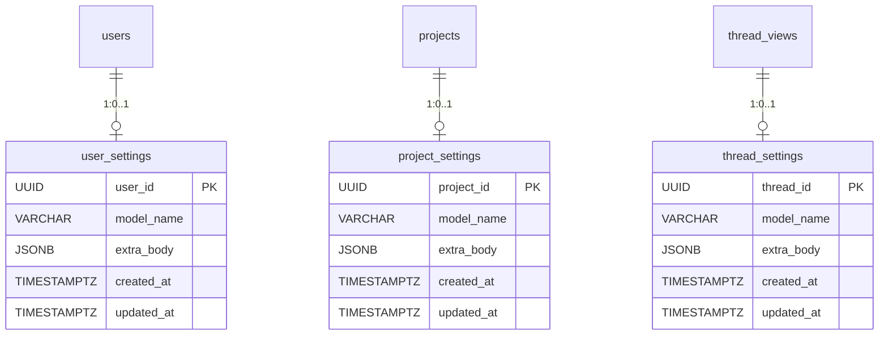
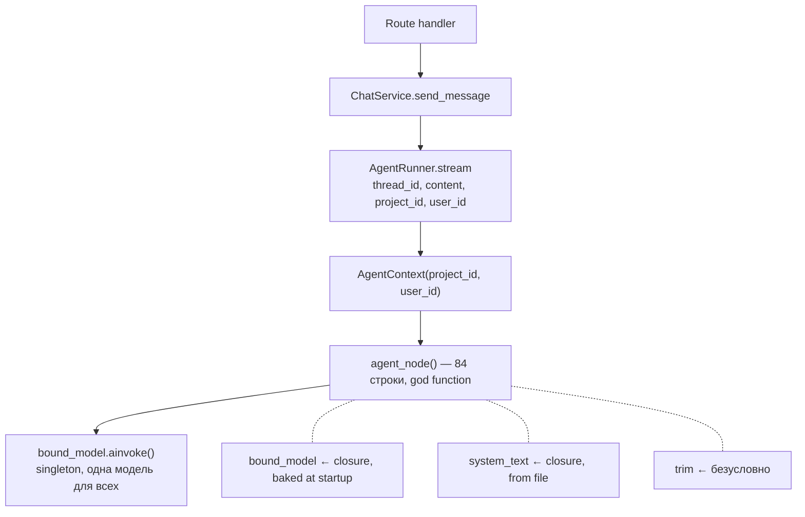
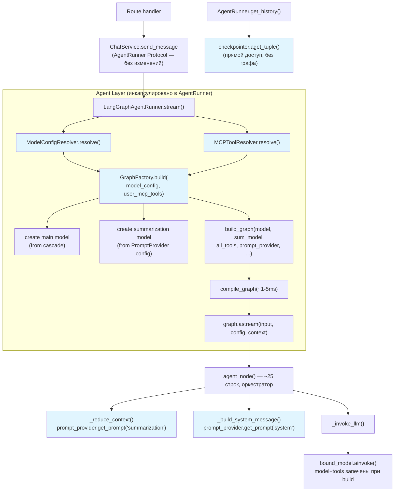
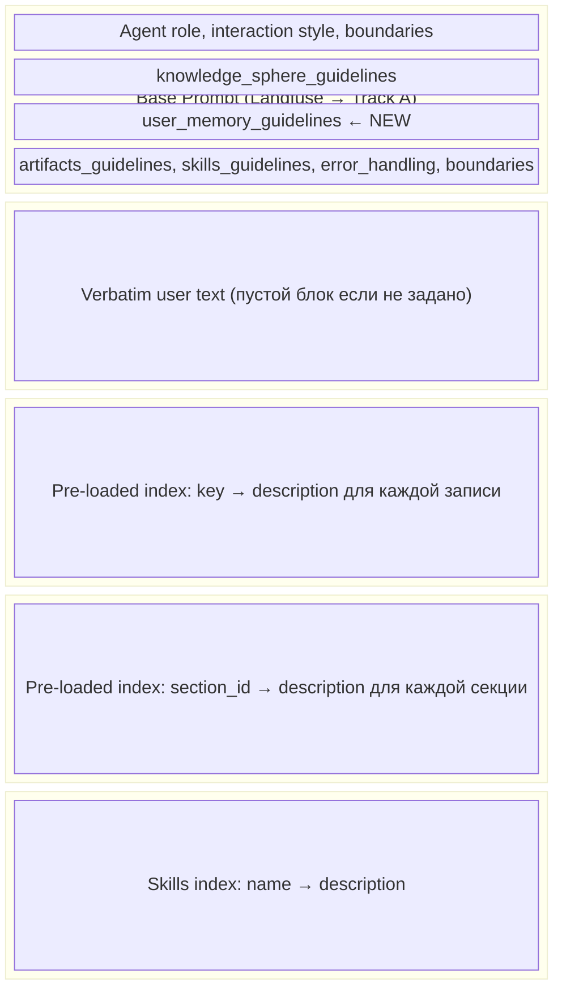
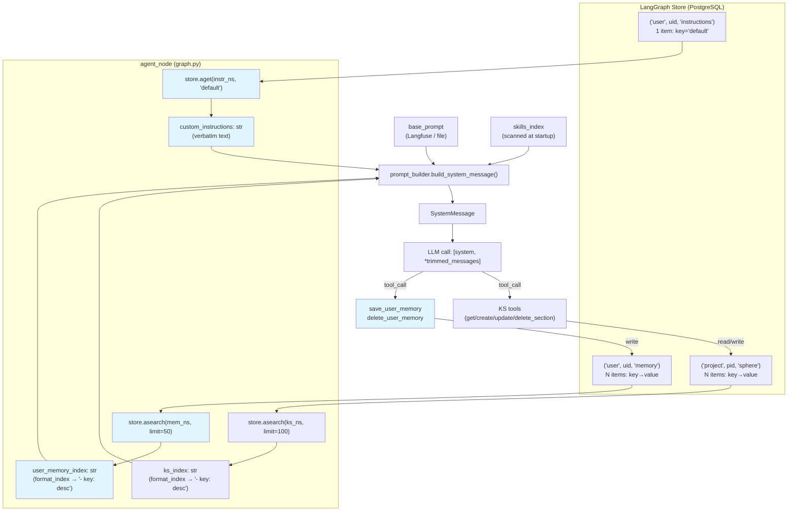
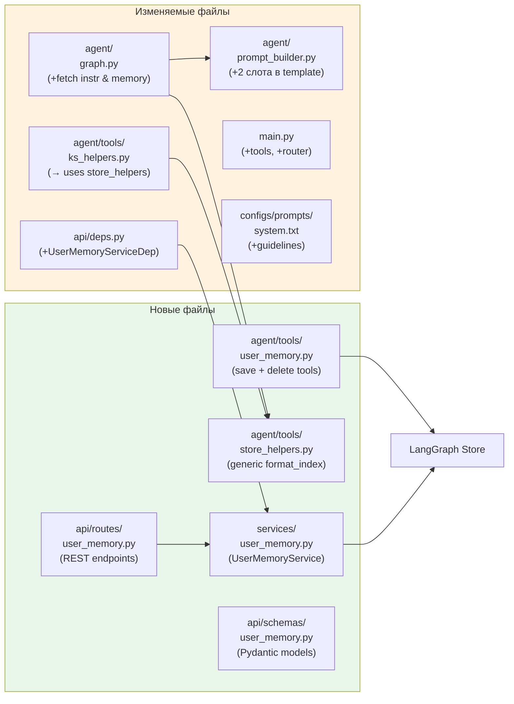
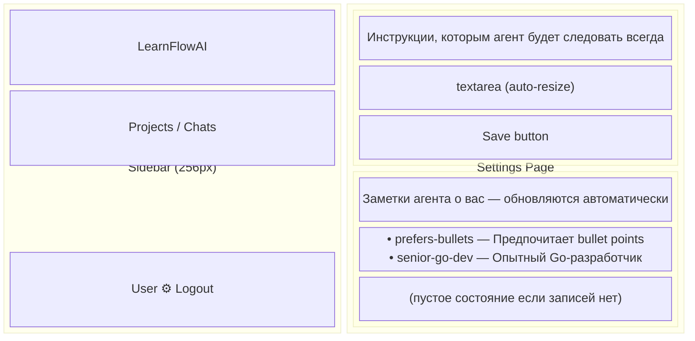
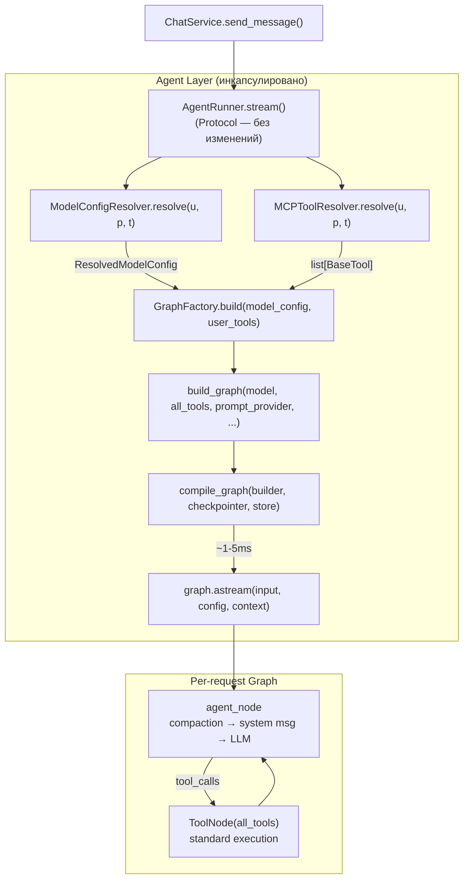
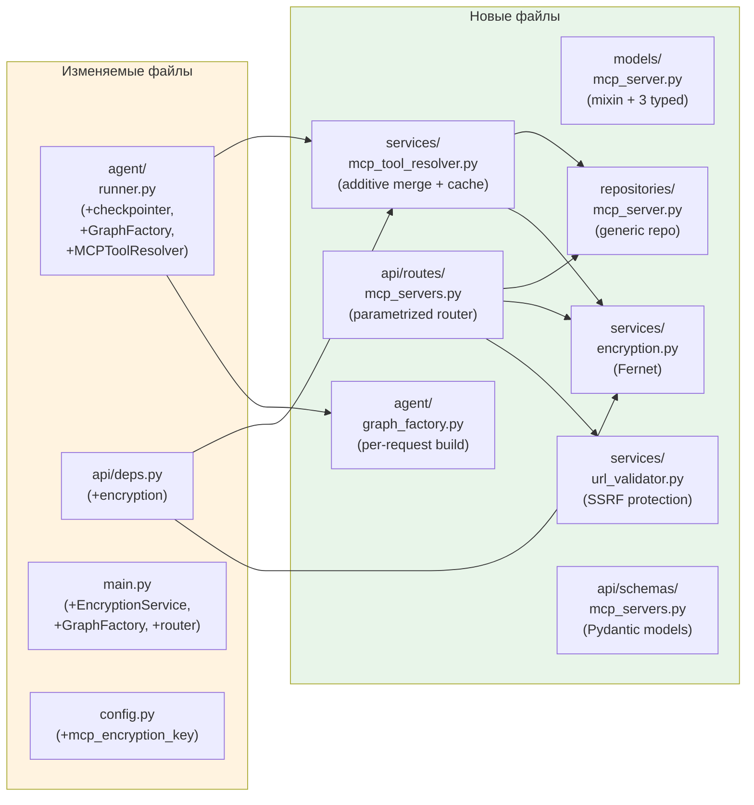
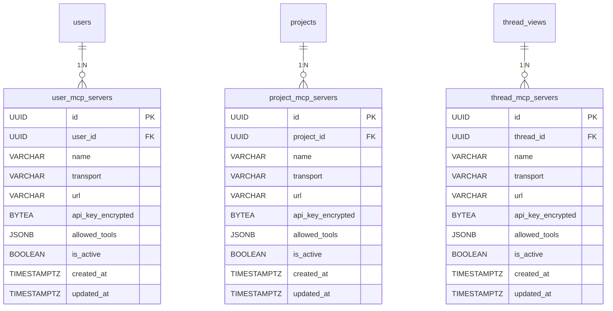

# Design Brief: feat-003 — Runtime Agent Configuration

## Context

Агент сейчас полностью статичен: модель, system prompt, MCP серверы — всё задаётся в `configs/agent.yaml` и `configs/prompts/system.txt` при старте, запекается в LangGraph StateGraph. Любое изменение = перезапуск сервиса. Персонализации пользователей нет.

Цель — runtime-конфигурация без перезапуска + per-user кастомизация.

## Scope

Три трека проектирования, которые прорабатываются независимо и реализуются вместе:

| Track | Scope | Что проектирует |
|-------|-------|----------------|
| **A** | Langfuse Prompt Management + Model Switching | Где живёт prompt/model config, как меняется в runtime, каскад overrides |
| **B** | Memory Architecture | Custom instructions, user memory, agent notes — расширение системы памяти |
| **C** | User MCP Servers | Per-user внешние инструменты через MCP |

### Dependencies

```
Track A (Langfuse + Model) ← фундамент
  ↑                          ↑
Track B (Memory)          Track C (User MCP)
  интерфейс:                принцип:
  "слот в system message"   "dynamic resolution в agent_node"
```

Зависимости сводятся к интерфейсным соглашениям, не к деталям реализации. Проектирование параллельное.

## Decisions (общие)

1. **Langfuse = runtime source of truth** для всех промптов системы (system, summarization, будущие sub-agent) и global model config. File = seed + backup.
2. **Каскад model overrides:** global (Langfuse) → per-user → per-project → per-chat. Первый не-null побеждает.
3. **Custom instructions / user memory** — отдельный уровень абстракции от Knowledge Sphere. KS = проектные знания, memory = cross-project user context.
4. **User MCP** — строится поверх фундамента Track A (dynamic resource resolution в agent_node).
5. **Каскады model и tools — разные принципы по разным причинам.** Model override: specific wins (thread → project → user → global) — персонализация, пользователь выбирает модель под свою задачу. Tool merge: global wins (global tools не могут быть переопределены user tools) — безопасность, user-provided MCP сервер не должен подменять системные инструменты (Knowledge Sphere CRUD, Artifacts, Skills). Направление каскада определяется доменной семантикой: model = preference, tools = capability with security boundary.
6. **User model override — только основная модель агента.** Каскад (thread → project → user → langfuse → file) применяется к модели, используемой для диалога с пользователем. Summarization model — system-managed (конфигурируется архитектором через Langfuse prompt.config или agent.yaml), user override отсутствует.

## Current Architecture (отправная точка)

Ключевые файлы:

| Компонент | Файл | Что делает |
|-----------|------|-----------|
| App startup | `backend/app/main.py` (lifespan) | Загружает config, создаёт LLM, компилирует граф — всё один раз |
| Agent config | `backend/app/agent/config.py` | Pydantic models: LLMConfig, ContextConfig, MCPServerConfig |
| Graph | `backend/app/agent/graph.py` | `build_graph()` — bind_tools на модель, `agent_node` — LLM invocation |
| LLM factory | `backend/app/infra/llm.py` | `create_llm()` — создаёт ChatOpenAI из config |
| MCP factory | `backend/app/infra/mcp.py` | `create_mcp_client()` — MultiServerMCPClient из config |
| Runner | `backend/app/agent/runner.py` | `LangGraphAgentRunner.stream()` — invocation с Langfuse tracing |
| Prompt builder | `backend/app/agent/prompt_builder.py` | Jinja2: based prompt + KS Index + Skills Index |
| System prompt | `configs/prompts/system.txt` | Based prompt (статический текст) |
| Agent config | `configs/agent.yaml` | LLM model, context params, MCP servers, model definitions |

Архитектурные доки: [agent-runtime.md](../../../tech/agent-runtime.md), [knowledge-sphere.md](../../../tech/knowledge-sphere.md), [observability.md](../../../tech/observability.md), [streaming.md](../../../tech/streaming.md).

ADR: [ADR-013 Model Settings Storage](../../../tech/adr/ADR-013-model-settings-storage.md), [ADR-014 Dynamic Model Resolution](../../../tech/adr/ADR-014-dynamic-model-resolution.md).

---

## Track A: Langfuse Prompt Management + Model Switching

### Scope

- Langfuse Prompt Management как runtime source для всех промптов (system, summarization)
- PromptProvider — централизованный компонент (infra layer) для fetch + file fallback
- Environment separation (dev/prod) через labels
- Bidirectional sync: file ↔ Langfuse (все промпты)
- Runtime model switching с per-user/per-project/per-chat overrides
- Summarization model config из Langfuse prompt.config (с agent.yaml fallback)
- Storage для user preferences (model overrides)
- Рефакторинг agent_node: декомпозиция god function → оркестратор + extracted functions
- UI: выбор модели (проектируется при реализации)

### Decisions

#### Source of Truth

- **Langfuse = runtime source** для всех промптов системы (system, summarization, будущие sub-agent). Агент фетчит prompt + config из Langfuse через `PromptProvider` (с клиентским кэшем SDK).
- **File** (`configs/prompts/{name}.txt`, соответствующие секции `agent.yaml`) = initial seed + backup snapshot.
- При первом деплое (Langfuse пуст) — seed из файлов.
- **PromptProvider** (`backend/app/infra/prompt_provider.py`) — единая точка доступа ко всем промптам. Infra-level компонент, аналогичный `infra/llm.py` и `infra/mcp.py`. Один экземпляр создаётся в lifespan, инжектится в `GraphFactory`.

#### Langfuse Prompt Naming & Labels

| Prompt name | Назначение | Label |
|-------------|------------|-------|
| `system` | Основной system prompt агента | `production` / `development` |
| `summarization` | Промпт для context reduction (summarization) | `production` / `development` |
| _(будущее)_ `sub-agent-{name}` | Промпты субагентов | `production` / `development` |

Без namespace-префиксов — промптов в системе немного.

Environment separation: env-переменная `LANGFUSE_PROMPT_LABEL` (`production` в `.env`, `development` в `.env.local`).

#### Langfuse Prompt Cache

- **Механизм:** чисто клиентский кэш в SDK, TTL-based. Нет инвалидации при изменении промпта в UI.
- **Поведение:** TTL истёк → stale prompt отдаётся мгновенно (не блокирует) → фоновый revalidation.
- **TTL:** конфигурируемый через `Settings.langfuse_prompt_cache_ttl` (env var), default 60s. Максимальная задержка подхвата изменений = TTL.
- **Bypass:** `cache_ttl_seconds=0` (программно). Admin endpoint для force-refresh не нужен на MVP.

#### Langfuse Prompt Config — per-prompt model configuration

Каждый промпт в Langfuse имеет независимый `prompt.config` (JSON dict), версионируемый вместе с текстом промпта.

**Промпт "system"** — config хранит global default основной модели (последний уровень каскада перед file fallback):

```json
{
  "model": "z-ai/glm-5",
  "extra_body": {"include_reasoning": true, "reasoning": {"effort": "low"}}
}
```

**Промпт "summarization"** — config хранит модель и параметры для summarization (system-managed, не user-configurable):

```json
{
  "model": "z-ai/glm-4.7-flash",
  "max_tokens": 500
}
```

Каждый промпт имеет независимое версионирование, labels и config. Изменение config "summarization" не затрагивает "system" и наоборот.

#### Model Override Cascade

```
thread_settings.model_name   (если не NULL / запись существует)
  → project_settings.model_name
    → user_settings.model_name
      → Langfuse prompt("system").config.model
        → agent.yaml llm.model   (file fallback)
```

Первый не-NULL побеждает. NULL / отсутствие записи = "наследовать от уровня выше".

#### LangGraph: Graph Factory (per-request build+compile)

**Решение:** Graph Factory — model и tools разрешаются ДО графа, запекаются при `build_graph()` + `compile_graph()` per-request. Совместное решение Track A + Track C (ADR-014).

**Обоснование:**
- Track C добавляет per-user MCP tools — набор tools различается per-request. `ToolNode(tools)` принимает tools при конструкции → нужен per-request graph.
- Раз граф пересоздаётся per-request для tools, модель тоже запекается при build (нет смысла в dynamic resolution внутри agent_node).
- `compile()` для 2-node графа — ~1–5ms (pure Python objects, без I/O). Negligible на фоне MCP get_tools (~100–200ms) и LLM call (~1000–30000ms).
- Checkpointer/store — shared по ссылке. Checkpoints keyed by `thread_id`, не зависят от graph instance.
- LangGraph Platform использует этот паттерн (graph factory per-request).
- `agent_node` упрощается: чистый оркестратор без dynamic model/tool logic.

#### Read Operations — прямой доступ к checkpointer (без графа)

`get_history()` и `get_last_ai_message_id()` читают state из checkpointer. С per-request graph нет смысла компилировать граф для чтения — `checkpointer.aget_tuple(config)` возвращает десериализованные `channel_values` напрямую.

- `graph.aget_state()` внутри вызывает `checkpointer.aget_tuple()`, затем добавляет graph-specific обработку (pending writes, next tasks, subgraphs) — ничего из этого не нужно для чтения истории.
- `AgentRunner` получает `checkpointer` напрямую для read-операций, `GraphFactory` — для stream.
- **base_graph не нужен** — GraphFactory только создаёт per-request графы, не хранит baseline.

**Caveat:** `aget_tuple()` не применяет pending writes. Для текущей архитектуры это не проблема — read-операции вызываются после завершения stream (все writes committed). Если в будущем добавится HITL с `interrupt()` — потребуется пересмотреть (возможно graph-based reads для конкретных операций).

#### Available Models — whitelist

Белый список моделей в `agent.yaml`, секция `available_models`. Не динамически из OpenRouter API.

```yaml
available_models:
  - name: "z-ai/glm-5"
    display_name: "GLM-5"
  - name: "z-ai/glm-4.7-flash"
    display_name: "GLM-4.7 Flash"
  - name: "anthropic/claude-sonnet-4"
    display_name: "Claude Sonnet 4"
```

Frontend получает список через `GET /api/models`. Валидация при смене модели — проверка по этому списку.

#### Graceful Degradation

```
Langfuse prompt fetch:    fail → SDK cache → file fallback → log warning
Model settings DB:        fail → skip level → use next in cascade
Langfuse prompt.config:   fail → agent.yaml llm section
Graph Factory build:      нет degradation (синхронная операция, ~1-5ms)
```

### Prompt Sync Lifecycle

Синхронизация распространяется на **все промпты** системы (system, summarization).

**Langfuse → File (`make sync-prompts`):**
```
For each prompt in [system, summarization]:
  Langfuse API: get prompt "{name}" label=<specified>
    → prompt.prompt  → configs/prompts/{name}.txt
    → prompt.config  → обновить соответствующую секцию в agent.yaml
                        ("system" → llm, "summarization" → summarization)
  → commit вручную
```

**File → Langfuse (deploy step):**
```
For each .txt file in configs/prompts/:
  name = filename stem
  config = load corresponding agent.yaml section
  → hash(prompt_text + config_json)
  → compare with current Langfuse production version hash
  → different? → create_prompt(new version, label="production")
  → same? → no-op
```

**Startup seed:**
```
For each prompt in [system, summarization]:
  Langfuse has prompt with label "production"? → skip
  Langfuse empty for this name? → create from configs/prompts/{name}.txt + agent.yaml config
```

**Use cases:**

| Сценарий | Flow |
|----------|------|
| Итерация через Langfuse UI | Edit in UI (label=development) → test locally → `make sync-prompts` → commit → deploy → file→Langfuse (production) |
| Итерация через файл | Edit `.txt` → commit → deploy → file→Langfuse (production) |
| Hotfix в prod | Edit in Langfuse UI → move "production" label → immediate effect → later `make sync-prompts` (label=production) → commit |
| Первый деплой | Langfuse пуст → startup seed из файлов → label "production" |

### Storage: Per-Scope Settings Tables (ADR-013)

Три unified settings таблицы с proper FK constraints (не polymorphic single table). Начинаются с model config, extensible для будущих scalar preferences:



**Обоснование (3 таблицы vs 1 polymorphic):**
- Ровно 3 entity types, число фиксировано, не будет расти.
- Proper FK с CASCADE DELETE — referential integrity на уровне БД, нет orphaned rows.
- Polymorphic FK (single table) оправдан при динамическом числе entity types (10+, растёт). Не наш случай.
- Code duplication минимизируется через SQLAlchemy mixin + один generic repository.
- Extensible: будущие scalar preferences добавляются как колонки, не как новые таблицы.

**NULL-семантика:** `model_name = NULL` или отсутствие записи в таблице = "наследовать от уровня выше".

### Architecture: Layers & Components

#### Data Model Extensions

```python
# backend/app/agent/config.py — новые типы

@dataclass
class ResolvedModelConfig:
    """Результат каскадного resolve. Immutable."""
    model: str                        # "z-ai/glm-5"
    extra_body: dict[str, Any] | None # {"include_reasoning": true, ...}
    source: str                       # "thread"|"project"|"user"|"langfuse"|"config"

@dataclass
class AgentContext:
    project_id: str
    user_id: str
    # model_config и user_tools НЕ в context — запечены в graph instance (Graph Factory)
```

#### Layer Map: Current → Target

**Текущая архитектура:**



**Целевая архитектура (Graph Factory + PromptProvider, ADR-014):**



Ключевые отличия от текущей архитектуры:
- **ChatService** не знает о resolvers, GraphFactory, model config — вызывает только `AgentRunner` Protocol (без изменений).
- **Resolve + build** инкапсулированы внутри `LangGraphAgentRunner.stream()`.
- **Read-операции** (`get_history`, `get_last_ai_message_id`) обращаются к `checkpointer.aget_tuple()` напрямую — граф не нужен.
- **PromptProvider** (`infra`) прокидывается через `GraphFactory → build_graph() → closure` в `agent_node`.

#### ModelConfigResolver — новый компонент

```python
class ModelConfigResolver:
    """Cascade resolve model config. Stateless, injectable."""

    def __init__(
        self,
        settings_repo: SettingsRepository,
        langfuse_client: Langfuse | None,
        langfuse_config: LangfuseConfig,
        fallback_config: LLMConfig,
    ): ...

    async def resolve(
        self, user_id: UUID, project_id: UUID, thread_id: UUID,
    ) -> ResolvedModelConfig:
        # thread_settings → project_settings → user_settings → Langfuse prompt.config → agent.yaml
```

Inject в `LangGraphAgentRunner` через lifespan (не в ChatService — ChatService не знает о resolvers). Не является сервисом (нет бизнес-логики) — resolver/strategy pattern. Результат передаётся в `GraphFactory.build()`, а не в `AgentContext`.

#### Agent Node Refactoring

Из god function (84 строки, 6 responsibilities) в оркестратор (~25 строк) + extracted functions.
Рефакторинг выполняется **в одной фазе** с новым функционалом.

С Graph Factory (ADR-014) agent_node **не содержит** dynamic model/tool resolution — model и tools уже запечены в closure при `build_graph()`. agent_node — чистый оркестратор.

Extracted functions:

| Функция | Ответственность |
|---------|----------------|
| `_reduce_context()` | Единая функция compaction. If tokens > threshold: summarize (if summarization_model available), else trim. If summarize fails: fallback to trim. Гарантирует messages ≤ max_tokens. Prompt для summarization из `prompt_provider.get_prompt("summarization")`. |
| `_build_system_message()` | KS index из store + custom instructions + user memory index + skills index + base prompt из `prompt_provider.get_prompt("system")` + Jinja template → SystemMessage. |
| `_invoke_llm()` | `ainvoke()` + timing + usage metadata logging. |

```python
# Итоговый agent_node — оркестратор
async def agent_node(state: MessagesState, runtime: Runtime[AgentContext]) -> dict:
    messages = state["messages"]

    messages, context_ops = await _reduce_context(
        messages, summarization_model, context_config, prompt_provider)

    system = await _build_system_message(prompt_provider, runtime, skills_index)

    response = await _invoke_llm(bound_model, [system, *messages])

    return {"messages": [*context_ops, response]}
```

**Примечание:** `prompt_provider.get_prompt()` — sync вызов Langfuse SDK. На cache hit (~99%): dict lookup, ~0μs. На cache miss (раз в TTL): HTTP call ~50-100ms. Для MVP приемлемо; при необходимости — `asyncio.to_thread()` wrap.

### Configuration Changes

#### agent.yaml

```yaml
# Новая секция (добавляется к существующим)

available_models:                  # белый список для UI + валидации
  - name: "z-ai/glm-5"
    display_name: "GLM-5"
  - name: "z-ai/glm-4.7-flash"
    display_name: "GLM-4.7 Flash"
  - name: "anthropic/claude-sonnet-4"
    display_name: "Claude Sonnet 4"

# Секция prompt: УДАЛЕНА — промпты теперь из PromptProvider, не из файла напрямую.
# Секция langfuse: НЕ добавляется — operational config в Settings/.env.
# Секции llm и summarization остаются как fallback для Langfuse prompt.config.
```

#### Settings (config.py) — новые env vars

```python
# Langfuse Prompt Management (operational, env-specific)
langfuse_prompt_label: str = "production"
langfuse_prompt_cache_ttl: int = 60

# MCP Encryption (Track C)
mcp_encryption_key: str = ""
```

```
# .env (production)
LANGFUSE_PROMPT_LABEL=production

# .env.local (local dev override)
LANGFUSE_PROMPT_LABEL=development
```

#### Новый файл: configs/prompts/summarization.txt

Seed/fallback для summarization prompt. Содержимое — текущий hardcoded текст из `graph.py::_summarize()`.

### File Changes Summary

**Новые файлы:**

| Файл | Назначение |
|------|------------|
| `backend/app/infra/prompt_provider.py` | PromptProvider: Langfuse fetch + file fallback для всех промптов |
| `backend/app/models/settings.py` | SQLAlchemy: SettingsMixin + 3 typed модели |
| `backend/app/repositories/settings.py` | Один generic repo для всех 3 таблиц |
| `backend/app/services/model_config_resolver.py` | Cascade resolve |
| `backend/app/agent/graph_factory.py` | GraphFactory: per-request build+compile, summarization model from PromptProvider |
| `backend/app/api/routes/models.py` | `GET /api/models` |
| `backend/app/api/schemas/models.py` | Response schemas |
| `backend/alembic/versions/xxx_add_settings.py` | Migration: 3 таблицы |
| `configs/prompts/summarization.txt` | Seed/fallback для summarization prompt |

**Изменённые файлы:**

| Файл | Изменение |
|------|-----------|
| `backend/app/agent/config.py` | + AvailableModel, ResolvedModelConfig; -PromptConfig (промпты из PromptProvider) |
| `backend/app/agent/graph.py` | Refactor agent_node → оркестратор + extracted functions; +prompt_provider param в `build_graph()` |
| `backend/app/agent/runner.py` | +checkpointer, +graph_factory, +model_resolver, +tool_resolver deps; read ops через checkpointer напрямую; stream через graph_factory.build() |
| `backend/app/services/agent_runner.py` | Protocol: **без изменений** (stream сигнатура та же) |
| `backend/app/services/chat.py` | **Без изменений** (ChatService не знает о resolvers) |
| `backend/app/api/deps.py` | Без изменений для Track A (resolvers не в API layer) |
| `backend/app/main.py` | +PromptProvider init; +GraphFactory init; +resolvers init; -create_llm, -create_summarization_llm, -build_graph, -compile_graph; AgentRunner получает checkpointer+factory+resolvers |
| `backend/app/config.py` | +`langfuse_prompt_label`, +`langfuse_prompt_cache_ttl` |
| `configs/agent.yaml` | +`available_models`; -`prompt` секция |

---

## Track B: Memory Architecture

### Scope

- Unified memory architecture на базе LangGraph Store
- Custom Instructions — per-user поведенческие директивы (user-owned, agent read-only)
- User Memory — per-user cross-project заметки агента (agent-writable)
- Обновлённый prompt builder: +2 слота (custom instructions, user memory index)
- REST API + Frontend UI (страница Settings)

### Research

Проведён ресерч индустриальных паттернов (ChatGPT Memory, Claude Projects, Amazon Bedrock AgentCore, Mem0) и LangGraph Store capabilities. Результаты:
- [agent-memory-architecture.md](../../../../research/agent-memory-architecture.md) — паттерны, таксономия, injection strategies, anti-patterns
- [memory-implementation-guide.md](../../../../research/memory-implementation-guide.md) — операционные решения, схема данных, стратегия тестирования
- [langgraph-store-deepdive.md](../../../../tech/langgraph-store-deepdive.md) — API, namespace design, vector search, limitations

### Decisions

**D1. LangGraph Store — unified backend для всех слоёв памяти.** ([ADR-015](../../../tech/adr/ADR-015-unified-memory-backend.md))
Единая инфраструктура, уже используется для Knowledge Sphere. Namespace-based изоляция покрывает все текущие и будущие потребности. Не нужны отдельные таблицы в PostgreSQL — Store хранит данные в `store_items` через key-value API.

**D2. Memory taxonomy — 5 слоёв.**

| Layer | Тип | Scope | Кто пишет | Кто читает | Инжекция | Storage |
|-------|-----|-------|-----------|-----------|----------|---------|
| 0. System Prompt | Procedural | Global | Архитектор (Langfuse) | Агент | Base prompt | Langfuse (Track A) |
| 1. Custom Instructions | Procedural | Per-user | Пользователь | Агент (read-only) | Verbatim в system msg | Store |
| 2. User Memory | Semantic | Per-user, cross-project | Агент (автономно) | Агент | Pre-loaded index в system msg | Store |
| 3. Knowledge Sphere | Semantic | Per-project | Агент + пользователь | Агент | Index + tool для деталей | Store |
| 4. Conversation | Working | Per-chat | Агент + пользователь | Агент | Messages в context window | Checkpointer |

Layers 3 и 4 уже реализованы. Track B реализует Layers 1 и 2.

**D3. Custom Instructions — один текстовый блок, per-user.**
Один item в Store (`key: "default"`). Простой textarea в UI. Миграция на структурированный формат тривиальна — тот же namespace, другой формат value.

**D4. User Memory — read-only view в UI.**
Пользователь видит, что агент запомнил, но не редактирует. Dashboard для edit/delete — в будущем.

**D5. Семантический поиск — отложен.**
Pre-loaded index (все записи целиком в system message) достаточен при малом числе записей. `IndexConfig` с embeddings добавляется без breaking changes когда записей станет 50+.

**D6. Agent autonomy — автономно с guidelines.**
Агент сам решает, что запоминать. `<user_memory_guidelines>` в system prompt определяет: когда записывать, что записывать, что НЕ записывать, как обновлять вместо дублирования. Лимит — 50 записей.

**D7. Per-chat instructions — не реализуем.**
При необходимости — namespace `("chat", thread_id, "instructions")`, тот же паттерн.

**D8. Progressive disclosure — только для Knowledge Sphere.**
User Memory целиком в system message без tool для чтения (записи короткие, ~200–500 токенов на весь index). KS сохраняет паттерн index + `get_section` tool (секции тяжёлые, тысячи токенов).

### Namespace Scheme

```python
# Layer 1: Custom Instructions (user-set, read-only for agent)
("user", user_id, "instructions")
#   key: "default"
#   value: {"content": "Отвечай по-русски. Не используй эмодзи."}

# Layer 2: User Memory (agent-writable, cross-project)
("user", user_id, "memory")
#   key: slug-id (e.g., "prefers-bullet-points")
#   value: {"description": "краткое описание", "content": "детали"}

# Layer 3: Knowledge Sphere (без изменений)
("project", project_id, "sphere")
#   key: "section:{section_id}"
#   value: {"description": "...", "content": "..."}
```

LangGraph Store namespace — кортеж строк произвольной длины, аналог пути в файловой системе. Каждый namespace содержит любое количество key→value пар. Операции (`aget`, `aput`, `asearch`, `adelete`) работают строго внутри одного namespace — cross-namespace queries нет (by design, изоляция).

### System Message Structure



Порядок сверху вниз отражает приоритет: base prompt (role) → user directives → user context → project context → tools. Модели лучше следуют инструкциям, размещённым ближе к началу.

### Architecture: Data Flow



Синим выделены новые компоненты Track B. Стрелки показывают: custom instructions и user memory читаются из Store при каждом вызове `agent_node`, инжектируются в system message. Агент пишет только в user memory (через tools), custom instructions — read-only.

### Architecture: Backend Components



### Key Interfaces

#### prompt_builder.py — расширение

```python
# Текущий: 3 параметра → Целевой: 5 параметров (backward compatible)
def build_system_message(
    based_prompt: str,
    ks_index: str,
    skills_index: str = "",
    custom_instructions: str = "",     # NEW
    user_memory_index: str = "",       # NEW
) -> str: ...
```

Template добавляет `<custom_instructions>` и `<user_memory>` блоки (conditional — пустые если нет данных).

#### graph.py → agent_node — расширение fetch

```python
async def agent_node(state, runtime):
    # ... compaction (без изменений) ...

    store = runtime.store
    user_id = runtime.context.user_id

    # KS (без изменений)
    ks_items = await store.asearch(build_namespace(runtime.context.project_id), limit=100)
    ks_index = format_index(list(ks_items), title="Knowledge Sphere",
                            key_fn=lambda i: i.key.removeprefix("section:"))

    # NEW: Custom Instructions
    instr_item = await store.aget(("user", user_id, "instructions"), "default")
    custom_instructions = instr_item.value["content"] if instr_item else ""

    # NEW: User Memory
    mem_items = await store.asearch(("user", user_id, "memory"), limit=50)
    user_memory_index = format_index(list(mem_items), title="User Memory")

    content = build_system_message(
        based_prompt=..., ks_index=ks_index, skills_index=skills_index,
        custom_instructions=custom_instructions,
        user_memory_index=user_memory_index,
    )
    # ... trim + LLM call (без изменений) ...
```

#### store_helpers.py — generic helper (рефакторинг)

```python
from collections.abc import Callable
from typing import Any

def format_index(
    items: list,
    title: str,
    key_fn: Callable[[Any], str] = lambda item: item.key,
) -> str:
    """Generic index formatter for any Store namespace.
    
    Used by KS and User Memory. key_fn extracts display key from item.
    """
    if not items:
        return f"{title}: empty"
    sorted_items = sorted(items, key=lambda i: i.created_at)
    lines = [f"- {key_fn(item)}: {item.value.get('description', '')}" for item in sorted_items]
    return f"{title}:\n" + "\n".join(lines)

# Вызов для KS:
# format_index(items, "Knowledge Sphere", key_fn=lambda i: i.key.removeprefix("section:"))
# Вызов для User Memory:
# format_index(items, "User Memory")  # default key_fn
```

`ks_helpers.py` сохраняет KS-специфику (fuzzy patch, `section_key()`, `build_namespace()`), но `format_index()` переезжает в `store_helpers.py`. KS-специфичный `removeprefix("section:")` передаётся через `key_fn`, не хардкодится в generic helper.

#### Agent Tools — user_memory.py

```python
@tool
async def save_user_memory(
    key: str, description: str, content: str, runtime: ToolRuntime,
) -> str:
    """Save a note about the user to persistent cross-project memory.
    
    Use to remember user preferences, work style, expertise, recurring patterns.
    Updates existing key if it already exists. Use descriptive keys
    (e.g., 'prefers-bullet-points', 'senior-go-dev').
    """
    ns = ("user", runtime.context.user_id, "memory")
    await runtime.store.aput(ns, key, {"description": description, "content": content})
    return f"Saved user memory '{key}'."

@tool
async def delete_user_memory(key: str, runtime: ToolRuntime) -> str:
    """Delete a user memory entry that is no longer relevant."""
    ns = ("user", runtime.context.user_id, "memory")
    item = await runtime.store.aget(ns, key)
    if item is None:
        return f"Error: memory '{key}' not found."
    await runtime.store.adelete(ns, key)
    return f"Deleted user memory '{key}'."
```

Permissions: tools имеют доступ только к namespace `("user", uid, "memory")`. Для `("user", uid, "instructions")` tool-ов нет — агент не может менять пользовательские инструкции.

#### UserMemoryService — для REST API

```python
class UserMemoryService(Protocol):
    async def get_instructions(self, *, user_id: UUID) -> str: ...
    async def update_instructions(self, *, user_id: UUID, content: str) -> str: ...
    async def list_memories(self, *, user_id: UUID) -> list[MemoryItemData]: ...

class LangGraphUserMemoryService:
    """Manages user-level data in LangGraph Store."""
    def __init__(self, store: BaseStore) -> None: ...
```

Следует паттерну `SphereService`: Protocol + implementation, inject через `deps.py`.

### REST API

```
Router: APIRouter(tags=["user-memory"])
Prefix: нет (полные пути, как sphere/chats/artifacts)

GET  /api/users/me/instructions     → InstructionsResponse    200
PUT  /api/users/me/instructions     → InstructionsResponse    200
GET  /api/users/me/memories         → MemoryListResponse      200
```

Endpoints следуют REST-принципам:
- Ресурсы — существительные: `instructions` (singular sub-resource), `memories` (collection)
- `users/me` — стандартный alias для текущего пользователя (аналог GitHub `/user`)
- PUT для instructions — idempotent full replace (один текстовый блок, всегда заменяется целиком)
- Memories — read-only через REST (агент пишет через tool); только GET

**Schemas:**

```python
class InstructionsResponse(BaseModel):
    content: str                          # "" если инструкции не заданы

class InstructionsUpdate(BaseModel):
    content: str                          # max_length при реализации

class MemoryItem(BaseModel):
    key: str                              # slug, e.g. "prefers-bullet-points"
    description: str                      # краткое описание
    created_at: datetime                  # когда создана запись

class MemoryListResponse(BaseModel):
    items: list[MemoryItem]               # [] если нет записей
```

### Frontend

**Новая feature:** `features/settings/`

```
features/settings/
├── components/
│   ├── SettingsPage.tsx                  # Основная страница
│   ├── CustomInstructionsSection.tsx     # Textarea + Save
│   └── AgentMemorySection.tsx           # Read-only список
└── hooks/
    ├── useInstructions.ts               # TanStack Query: GET instructions
    ├── useUpdateInstructions.ts         # TanStack mutation: PUT instructions
    └── useMemories.ts                   # TanStack Query: GET memories
```

**Route:** `/settings` — глобальный, не привязан к проекту (per-user данные).

**Sidebar:** иконка ⚙ в user footer (рядом с username) → навигация на `/settings`.

**UI layout:**



Custom Instructions и User Memory — per-user данные, поэтому отдельная страница `/settings`, а не tab внутри project. В будущем сюда же лягут model preferences (Track A) и MCP servers (Track C).

### File Changes Summary

**Новые файлы:**

| Файл | Назначение |
|------|------------|
| `backend/app/agent/tools/user_memory.py` | Agent tools: `save_user_memory`, `delete_user_memory` |
| `backend/app/agent/tools/store_helpers.py` | Generic `format_index(items, title)` — shared между KS и User Memory |
| `backend/app/services/user_memory.py` | `UserMemoryService` (Protocol + LangGraph impl) |
| `backend/app/api/routes/user_memory.py` | REST: `/users/me/instructions`, `/users/me/memories` |
| `backend/app/api/schemas/user_memory.py` | Pydantic: request/response models |
| `frontend/src/features/settings/` | Feature module: page + sections + hooks |
| `frontend/src/shared/api/user-memory.ts` | HTTP client functions |

**Изменяемые файлы:**

| Файл | Изменение |
|------|-----------|
| `backend/app/agent/prompt_builder.py` | Template: +`custom_instructions`, +`user_memory_index`. Function: +2 параметра |
| `backend/app/agent/graph.py` | `agent_node`: +fetch instructions + memory из Store |
| `backend/app/agent/tools/ks_helpers.py` | `format_index()` → import из `store_helpers.py`, KS-специфика остаётся |
| `backend/app/api/deps.py` | +`UserMemoryServiceDep`, +`get_user_memory_service()` |
| `backend/app/api/routes/__init__.py` | +import `user_memory` |
| `backend/app/main.py` | +register user memory tools, +include router |
| `configs/prompts/system.txt` | +`<user_memory_guidelines>` блок |
| `frontend/src/app/router.tsx` | +route `/settings` |
| `frontend/src/app/components/Sidebar.tsx` | +settings icon в user footer |
| `frontend/src/shared/api/types.ts` | +types для instructions и memories |

### Scope Boundaries (NOT in Track B)

- Per-chat / per-project custom instructions
- Edit/delete user memory из UI (только read-only view)
- Semantic search по user memory (`IndexConfig`)
- Memory consolidation / deduplication
- TTL / retention policies
- Memory export (JSON/Markdown)

---

## Track C: User MCP Servers

### Scope

- Per-scope MCP серверы: user, project, thread (3 уровня, как settings)
- Graph Factory: per-request build+compile с нужными model и tools (совместно с Track A)
- Additive merge: thread ∪ project ∪ user ∪ global
- Security: SSRF protection, API key encryption (Fernet), stdio banned
- Connection lifecycle: stateless (langchain-mcp-adapters создаёт сессию per tool call)
- REST CRUD + test connection
- UI: секция MCP Servers на Settings page, project settings, chat settings

### Research (проведён)

- **LangGraph dynamic tools:** исследованы 6 подходов ([langgraph-dynamic-tools-research.md](../../../../research/langgraph-dynamic-tools-research.md)). Результат → Graph Factory (ADR-014 обновлён).
- **langchain-mcp-adapters:** `MultiServerMCPClient` — stateless config holder, НЕ connection pool. Каждый `get_tools()` и `tool.invoke()` создаёт новую сессию (connect → execute → close). Per-user MCP тривиален — создаём client с конфигом пользователя.
- **Industry patterns:** GPT Actions (OpenAPI + auth), Claude MCP (hierarchical config + OS Keychain), Bedrock AgentCore (gateway + session isolation). Общие паттерны: tools = конфигурация (URL + auth), API keys encrypted at rest, per-user isolation через scoping.

### Decisions

**D1. Graph Factory — per-request build+compile (совместно с Track A, ADR-014).**
Track A (model switching) + Track C (user tools) решаются одним механизмом: model и tools разрешаются ДО графа, запекаются при `build_graph(model, all_tools, ...)` + `compile_graph(builder, checkpointer, store)`. Overhead compile ~1–5ms (2-node граф, pure Python objects). Подробности в ADR-014.

**D2. Per-scope MCP серверы — 3 typed таблицы с FK CASCADE (ADR-016).**
`user_mcp_servers`, `project_mcp_servers`, `thread_mcp_servers`. Паттерн аналогичен settings (ADR-013): mixin + typed модели + generic repository. FK CASCADE при удалении parent entity.

**D3. Additive merge с priority dedup.**
Все active серверы со всех уровней объединяются. При конфликте tool names — более специфичный уровень побеждает: thread > project > user > global (из agent.yaml). Global tools всегда имеют приоритет — user tools не могут их переопределить.

**D4. Fernet encryption для API keys (ADR-016).**
Symmetric encryption (`cryptography` package). Ключ из env var `MCP_ENCRYPTION_KEY`. BYTEA column в БД. API никогда не возвращает ключ — только `has_api_key: bool`.

**D5. Только HTTP/SSE транспорты.**
Stdio запрещён для user-provided серверов — subprocess от user-provided config = RCE вектор.

**D6. SSRF protection.**
DNS resolve → IP deny list (127.0.0.0/8, 10.0.0.0/8, 172.16.0.0/12, 192.168.0.0/16, 169.254.0.0/16, IPv6 equivalents). Проверка при API create/update + при подключении (defense in depth vs DNS rebinding).

**D7. Connection lifecycle — stateless.**
`langchain-mcp-adapters` по дизайну stateless: каждый tool call создаёт свежую сессию. Нет connection pool, idle timeout, reconnection logic. Tool definitions кэшируются с TTL (5 min) в `MCPToolResolver`.

### Architecture: Data Flow



### Architecture: Backend Components



### Storage: MCP Server Tables



SQLAlchemy: `MCPServerMixin` для общих колонок + 3 typed модели. Один generic `MCPServerRepository` с typed методами per scope.

### MCPToolResolver — additive merge с cache

```python
class MCPToolResolver:
    """Resolve MCP tools from all scopes. Additive merge with priority dedup."""

    def __init__(
        self,
        repo: MCPServerRepository,
        encryption: EncryptionService,
        global_tools: list[BaseTool],
        cache_ttl_seconds: int = 300,
    ): ...

    async def resolve(
        self, user_id: UUID, project_id: UUID, thread_id: UUID,
    ) -> list[BaseTool]:
        """
        1. Check TTL cache (key: hash of scope IDs)
        2. Collect active servers: thread ∪ project ∪ user
        3. For each server: decrypt API key → MultiServerMCPClient → get_tools()
        4. Dedup by tool name: thread > project > user
        5. Filter conflicts with global tools (global wins)
        6. Cache result, return
        """

    def invalidate(self, scope_type: str, scope_id: UUID) -> None:
        """Called on CRUD operations to force re-fetch."""
```

### GraphFactory — per-request build

```python
class GraphFactory:
    """Build + compile LangGraph per-request with resolved model and tools."""

    def __init__(
        self,
        *,
        settings: Settings,
        agent_config: AgentConfig,
        global_tools: list,
        skills_index: str,
        checkpointer: Any,
        store: Any,
        prompt_provider: PromptProvider,
    ): ...

    def build(
        self,
        model_config: ResolvedModelConfig,
        extra_tools: list[BaseTool],
    ) -> CompiledStateGraph:
        # Main model from user cascade
        model = create_llm_from_config(self._settings, model_config)

        # Summarization model from PromptProvider config → agent.yaml fallback
        sum_config = self._prompt_provider.get_config("summarization")
        if sum_config and "model" in sum_config:
            sum_model = create_summarization_llm_from_prompt_config(self._settings, sum_config)
        else:
            sum_model = create_summarization_llm(self._settings, self._agent_config.summarization)

        all_tools = self._global_tools + list(extra_tools)
        builder = build_graph(
            model=model,
            tools=all_tools,
            agent_config=self._agent_config,
            skills_index=self._skills_index,
            summarization_model=sum_model,
            prompt_provider=self._prompt_provider,
        )
        return compile_graph(builder, checkpointer=self._checkpointer, store=self._store)
```

### AgentRunner — адаптация

```python
class LangGraphAgentRunner:
    def __init__(
        self,
        *,
        checkpointer: BaseCheckpointSaver,    # прямой доступ для read-операций
        graph_factory: GraphFactory,           # per-request graph для stream
        model_resolver: ModelConfigResolver,   # Track A: model cascade
        tool_resolver: MCPToolResolver,        # Track C: MCP tool merge
    ): ...

    async def stream(
        self, *,
        thread_id, content, project_id, user_id,
    ) -> AsyncIterator[StreamEvent]:
        # Resolve — agent layer concern, инкапсулировано от ChatService
        model_config = await self._model_resolver.resolve(user_id, project_id, thread_id)
        user_tools = await self._tool_resolver.resolve(user_id, project_id, thread_id)
        graph = self._graph_factory.build(model_config, user_tools)
        context = AgentContext(project_id=str(project_id), user_id=str(user_id))
        # ... stream logic (same as current, but using per-request graph)

    async def get_history(self, *, thread_id) -> list[Message]:
        config = {"configurable": {"thread_id": str(thread_id)}}
        checkpoint_tuple = await self._checkpointer.aget_tuple(config)
        # ... extract messages from checkpoint_tuple.checkpoint["channel_values"]
```

**AgentRunner Protocol (`services/agent_runner.py`) — без изменений.** Сигнатура `stream()` та же: `thread_id, content, project_id, user_id`. ChatService не знает о resolvers.

Read-операции (`get_history`, `get_last_ai_message_id`) используют `checkpointer.aget_tuple()` напрямую — граф не нужен (см. Track A: Read Operations).

### Security

| Вектор | Защита |
|--------|--------|
| **SSRF** | DNS resolve → IP deny list (private/loopback/link-local/reserved). При API create/update + при connection time (defense in depth vs DNS rebinding) |
| **API key leak** | Fernet encryption at rest. API отдаёт только `has_api_key: bool` |
| **RCE via stdio** | stdio transport запрещён для user-provided серверов. Только `http`/`sse` |
| **Tool name conflict** | Global tools (из agent.yaml) приоритетнее. User tools с совпадающими именами отфильтровываются |
| **Resource abuse** | Max 5 серверов per scope, max 20 tools total, 30s timeout per tool call |

### REST API

```
Router: parametrized by scope_type + scope_param
3 точки монтирования, один generic router

# User level
GET    /api/users/me/mcp-servers                           → MCPServerListResponse
POST   /api/users/me/mcp-servers                           → MCPServerResponse     201
PUT    /api/users/me/mcp-servers/{server_id}                → MCPServerResponse     200
DELETE /api/users/me/mcp-servers/{server_id}                → 204
POST   /api/users/me/mcp-servers/{server_id}/test           → TestConnectionResponse

# Project level
GET    /api/projects/{pid}/mcp-servers                     → MCPServerListResponse
POST   /api/projects/{pid}/mcp-servers                     → MCPServerResponse     201
PUT    /api/projects/{pid}/mcp-servers/{id}                 → MCPServerResponse     200
DELETE /api/projects/{pid}/mcp-servers/{id}                 → 204
POST   /api/projects/{pid}/mcp-servers/{id}/test            → TestConnectionResponse

# Thread level
GET    /api/projects/{pid}/chats/{tid}/mcp-servers         → MCPServerListResponse
POST   /api/projects/{pid}/chats/{tid}/mcp-servers         → MCPServerResponse     201
PUT    /api/projects/{pid}/chats/{tid}/mcp-servers/{id}    → MCPServerResponse     200
DELETE /api/projects/{pid}/chats/{tid}/mcp-servers/{id}    → 204
POST   /api/projects/{pid}/chats/{tid}/mcp-servers/{id}/test → TestConnectionResponse
```

**Авторизация:** Thread-level MCP endpoints требуют двухступенчатой авторизации: (1) user ownership проекта через `UserProject` dependency, (2) проверка `thread_view.project_id == project_id`. Паттерн аналогичен `messages.py::_validate_thread_ownership()`. Project-level endpoints используют только `UserProject` dependency.

**Schemas:**

```python
class MCPServerCreate(BaseModel):
    name: str                             # max_length=100
    transport: Literal["http", "sse"]
    url: HttpUrl
    api_key: str | None = None
    allowed_tools: list[str] = []

class MCPServerUpdate(BaseModel):
    name: str | None = None
    transport: Literal["http", "sse"] | None = None
    url: HttpUrl | None = None
    api_key: str | None = None
    # api_key семантика (через model_dump(exclude_unset=True)):
    #   поле не передано в JSON → не менять
    #   "" (пустая строка) → удалить ключ
    #   "sk-..." (непустая строка) → обновить ключ
    allowed_tools: list[str] | None = None
    is_active: bool | None = None

class MCPServerResponse(BaseModel):
    id: UUID
    name: str
    transport: str
    url: str
    has_api_key: bool                     # never expose actual key
    allowed_tools: list[str]
    is_active: bool
    created_at: datetime
    updated_at: datetime

class MCPServerListResponse(BaseModel):
    items: list[MCPServerResponse]

class TestConnectionResponse(BaseModel):
    success: bool
    tools: list[str] = []                # tool names if success
    error: str | None = None
```

### Encryption Architecture

```
User adds MCP server (API: POST)
  → plaintext API key in request body
  → EncryptionService.encrypt(plaintext) → ciphertext (bytes)
  → store ciphertext in api_key_encrypted (BYTEA column)
  → API response: has_api_key=true (never return key)

Tool resolution (MCPToolResolver.resolve)
  → read ciphertext from DB
  → EncryptionService.decrypt(ciphertext) → plaintext
  → build Authorization header → MCP client → get_tools()
```

`EncryptionService`: Fernet wrapper, inject через FastAPI DI. Ключ из `Settings.mcp_encryption_key`.

### Frontend

```
Settings page (/settings):                    ← user-level
  └── MCPServersSection
        ├── List of servers (name, transport, url, status, tool count)
        ├── Add button → MCPServerForm (dialog)
        ├── Edit / Delete per server
        └── Test connection button

Project view:                                  ← project-level
  └── Project MCP Servers (tab или section)

Chat view:                                     ← thread-level
  └── Chat MCP Servers (modal или side panel)
```

UI проектируется при реализации.

### Graceful Degradation

```
MCP tool listing fail:       → empty tools for that server, log warning, agent works without it
MCP tool execution fail:     → ToolMessage with error (model sees error, can retry/explain)
Encryption key missing:      → startup warning; servers with encrypted keys non-functional
SSRF validation fail:        → reject URL at API level, 400 response
All user MCP servers fail:   → agent works with global tools only
```

### File Changes Summary

**Новые файлы:**

| Файл | Назначение |
|------|------------|
| `backend/app/models/mcp_server.py` | SQLAlchemy: MCPServerMixin + 3 typed модели |
| `backend/app/repositories/mcp_server.py` | Generic repo для всех 3 таблиц |
| `backend/app/services/mcp_tool_resolver.py` | Additive merge resolve + TTL cache |
| `backend/app/services/encryption.py` | Fernet EncryptionService |
| `backend/app/services/url_validator.py` | SSRF protection (DNS resolve + IP deny) |
| `backend/app/agent/graph_factory.py` | GraphFactory: per-request build+compile |
| `backend/app/api/routes/mcp_servers.py` | Parametrized REST router (1 router, 3 mounts) |
| `backend/app/api/schemas/mcp_servers.py` | Pydantic request/response models |
| `backend/alembic/versions/xxx_add_mcp_servers.py` | Migration: 3 таблицы |
| `frontend/src/features/settings/components/MCPServersSection.tsx` | User-level MCP UI |
| `frontend/src/features/settings/components/MCPServerForm.tsx` | Add/edit dialog |
| `frontend/src/features/settings/hooks/useMCPServers.ts` | + create/update/delete/test hooks |
| `frontend/src/shared/api/user-mcp.ts` | HTTP client functions |

**Изменяемые файлы:**

| Файл | Изменение |
|------|-----------|
| `backend/app/agent/runner.py` | +checkpointer, +graph_factory, +tool_resolver deps (совместно с Track A) |
| `backend/app/services/chat.py` | **Без изменений** (resolve инкапсулирован в AgentRunner) |
| `backend/app/services/agent_runner.py` | **Protocol без изменений** (сигнатура stream та же) |
| `backend/app/api/deps.py` | + `get_encryption_service()`, `get_mcp_server_repo()` |
| `backend/app/main.py` | + EncryptionService init, + MCPToolResolver init, + MCP router |
| `backend/app/config.py` | + `mcp_encryption_key` setting (совместно с Track A) |
| `frontend/src/features/settings/components/SettingsPage.tsx` | + MCPServersSection |
| `frontend/src/shared/api/types.ts` | + MCP server types |

### Scope Boundaries (NOT in Track C)

- OAuth 2.1 flow для MCP серверов (только API key auth)
- MCP Resources/Prompts (только tools)
- Connection pooling / persistent connections
- Per-project exclusion of user-level servers
- Per-tool permissions в UI (только allowed_tools filter)
- Tool usage analytics
- MCP server health monitoring
- Encryption key rotation / re-encryption migration

---

## Scope Boundaries (NOT in feat-003)

- Role-based access (admin vs user) — нет ролевой модели
- Per-user billing / usage limits — вне scope
- A/B testing промптов — Langfuse labels позволяют, но не в этой итерации
- Prompt playground / testing UI — Langfuse UI покрывает
