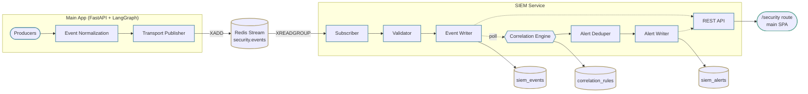
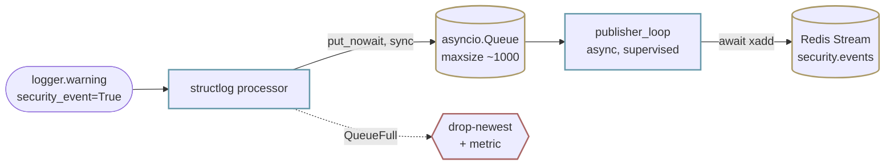

# Design Brief: feat-005 — Security Event Pipeline

## Context

Security 1.0 (feat-004) реализовал трёхуровневую защиту от prompt injection: Input Guard, Prompt Hardening, Canary Output Check. Все компоненты логируют инциденты через `structlog` и отправляют данные наблюдаемости в Langfuse. Однако события безопасности **не сохраняются** в БД, **не коррелируются** между собой и **не отображаются** на админской панели — мониторинг возможен только через Langfuse Cloud.

### Product driver

Backlog P2 "Security Event Pipeline": единая подсистема сбора, хранения и корреляции security-событий из всех источников (auth, rate limiter, security guard). structlog processor как integration point, correlation engine с правилами, PostgreSQL tables, REST API + React monitoring page.

### Academic requirements

Курсовые требования к защищённым информационным системам: SIEM-подсистема + web-клиент управления событиями. Тезисно:

| # | Требование |
|---|-----------|
| R1 | Сбор событий безопасности из нескольких источников (auth, rate limiter, security guard) |
| R2 | Хранение в структурированном виде с нормализованной схемой |
| R3 | Корреляция по правилам с time-window логикой |
| R4 | Формирование инцидентов (алертов) из коррелированных событий |
| R5 | Web-UI мониторинга событий и алертов |
| R6 | CRUD над событиями/алертами с пагинацией и фильтрацией |
| R7 | Ролевая модель доступа (admin-only) к security-панели |
| R8 | Мета-логирование административных действий как security events |
| R9 | Локализация UI (RU) |
| R10 | Расширяемость: добавление новых правил корреляции и типов событий не требует изменения кода SIEM |

### Архитектурный инсайт

SIEM и Security 1.0/2.0 ортогональны. Security layers — **producers** (порождают события через structured logging). SIEM — **consumer** (подхватывает, хранит, коррелирует, показывает). Разделение реализовано на процессном уровне: producer'ы живут в основном app, consumer — отдельный backend-сервис. Контракт событий (`event_id`, `event_type`, `severity`, `identifiers`, `metadata`) — единственная стабильная граница между ними. Пока контракт соблюдается, новые security-компоненты автоматически интегрируются в SIEM без изменений его кода.

### Forward compatibility с Security 2.0

Добавление KS Write Guard, Tool Result Guard, Output Classifier и других компонентов Security 2.0 потребует лишь новых значений `event_type` в Literal-vocabulary и log-вызовов на новых checkpoint'ах. Архитектура SIEM, схема БД, correlation engine и UI не требуют изменений.

## Scope

### MVP (feat-005)

| Компонент | Что делает | Req |
|-----------|------------|-----|
| **Event Collection** | structlog processor нормализует log-вызовы с маркером `security_event=True` в Pydantic-модель `SecurityEvent`; transport publisher отправляет в Redis Stream | R1 |
| **Transport** | Redis Streams + Consumer Group обеспечивают durable доставку между producer-процессом и SIEM-сервисом с at-least-once семантикой | R1 |
| **Normalization** | Единая Pydantic-схема: `event_id`, `event_type` (`Literal[...]`), `severity`, `timestamp`, `identifiers` (submodel), `metadata` (`dict[str, Any]`) | R2 |
| **Storage** | Изолированная PostgreSQL БД SIEM-сервиса: `siem_events`, `siem_alerts`, `correlation_rules` | R2 |
| **Correlation Engine** | asyncio background task, polling-цикл по правилам с time window + grouping по идентификатору или без группировки | R3 |
| **Alerting** | `siem_alerts` с open-alert dedup: `rule_id`, `severity`, `matched_events`, status workflow (new → acknowledged → resolved) | R4 |
| **Monitoring UI** | REST API SIEM-сервиса + React страница `/security` в основном SPA (events list + alerts list + rules) | R5, R6 |
| **RBAC + meta-logging** | JWT с claim `is_admin` (выпускает основной app); CRUD для alerts; CRUD-операции мета-логируются как security events | R7, R8 |
| **Localization** | UI-labels на странице `/security` на русском | R9 |
| **Rules extensibility** | Добавление новых correlation rules — INSERT в `correlation_rules` через REST API; новых event_type — расширение Literal-vocabulary в shared-пакете | R10 |

### Producer-side delta

Producer-side требует не просто нормализации существующих логов:

- Auth-handlers и rate-limiter сейчас не пишут security events — добавляются с нуля.
- `SecurityGuard` рефакторится под канонический `event_type` (текущие log-вызовы не выставляют его и хардкодят `identifiers={}`).
- HTTP middleware расширяется биндингом `ip` и `user_agent_hash`; auth dep — `user_id` и `session_id`; chat route — `thread_id` и `project_id` (сейчас в `contextvars` привязан только `request_id`).
- `_security_event_processor` строит Pydantic `SecurityEvent` и публикует через transport publisher — сейчас только нормализует поля в `identifiers` / `metadata` подсловари.

### Deferred to feat-007 (SIEM Extensions)

Продуктовые улучшения, не требуемые для MVP, реализуются отдельной итерацией:

- Dashboard & Metrics — агрегатные endpoint'ы + графики (events/hour, severity distribution, trends)
- Basic response actions — manual-trigger блокировка (ban IP / user) из алерта админом
- Расширенный Search — полнотекстовый поиск, timeline-view, drill-down
- Notifications — in-app уведомления при новых алертах
- Export & Reporting — CSV/PDF экспорт

### Out of scope (not planned)

Threat Intelligence, UEBA, SOAR automation, Log Forwarding, Compliance Framework mapping, Agent-based Collection — overkill для текущего масштаба, не планируются.

### Сознательно заложено для расширения

Архитектура MVP проектируется так, чтобы feat-007 функции добавлялись без перелопачивания:

| Что | Как закладывается |
|-----|-------------------|
| Dashboard | JSONB `identifiers` + `metadata` → любые SQL-агрегаты; REST API с pagination + filters → агрегатный эндпоинт поверх тех же таблиц |
| Response actions | `siem_alerts.status` workflow расширяется экшеном; manual trigger из UI создаёт запись в отдельной таблице блокировок, auth middleware читает её — SIEM остаётся точкой наблюдения, не исполнения |
| Search | `metadata` JSONB → GIN index; detail-эндпоинт = `GET /security/events/:id` |
| Контракт событий | Literal-vocabulary в shared-пакете расширяется без поломки wire format; `metadata` эволюционирует в discriminated union per `event_type` без изменения формата сообщений |

## Функциональная карта SIEM

### Phase 1 — MVP (feat-005)

| # | Функция | Суть |
|---|---------|------|
| 1 | Event Collection | structlog processor + Transport Publisher — единственная точка входа; нулевая инвазивность в бизнес-код |
| 2 | Normalization | Единая Pydantic-схема: `event_id`, `event_type`, `severity`, `timestamp`, `identifiers`, `metadata` |
| 3 | Transport | Redis Streams + Consumer Group, at-least-once с дедупом по `event_id` |
| 4 | Storage | PostgreSQL изолированной БД: `siem_events`, `siem_alerts`, `correlation_rules` |
| 5 | Correlation Engine | asyncio background task, polling SQL time-window queries. Типы правил: Threshold, Sequence, Aggregate |
| 6 | Alerting | `siem_alerts` с open-alert dedup и status workflow (new → acknowledged → resolved) |
| 7 | Monitoring UI | REST API SIEM-сервиса + React `/security` (events + alerts + rules) |
| 8 | RBAC + meta-logging | JWT `is_admin` claim; CRUD для alerts; мета-логирование |
| 9 | Localization | RU labels в UI |
| 10 | Rules extensibility | Новые правила/event_type — без изменения кода SIEM |

### Phase 2 — feat-007 (SIEM Extensions)

Dashboard & Metrics, Basic response actions (ban IP/user), расширенный Search, Notifications, Export. Реализуются отдельной итерацией после MVP.

### Not planned

Threat Intelligence, UEBA, SOAR automation, Log Forwarding, Compliance Frameworks, Agent-based Collection — overkill для масштаба.

### Границы ответственности

В MVP (Phase 1) SIEM — чистый observer. Разделение усиливается процессным изолированием: SIEM-сервис не имеет доступа к security-логике агента и не может вмешаться в обработку запроса.

| SIEM **не** | SIEM |
|---|---|
| Блокирует запросы | Наблюдает за security-компонентами |
| Валидирует ввод | Запоминает события |
| Проверяет вывод LLM | Находит паттерны (корреляция) |
| Управляет MCP/skills | Сигнализирует админу |
| Харденит промпты | Показывает картину в UI |

В Phase 2 (feat-007) добавятся manual response actions (ban из UI). Это сознательное расширение ответственности под продуктовую необходимость, не нарушение жёсткого принципа — индустриальные SIEM (Splunk, Sentinel, Elastic) штатно включают SOAR-функции. Сепарация observer/responder важна как дисциплина MVP, не как догма.

## Контракт событий

Контракт — публичный интерфейс между producer-процессом (main app) и consumer-процессом (SIEM-сервис). Реализован как Pydantic-модель в shared-пакете `packages/siem-contracts/` (uv workspace member). Импортируется и producer'ом, и consumer'ом — единый источник правды без дублирования.

### SecurityEvent — каноническая модель

| Поле | Тип | Назначение |
|------|-----|-----------|
| `event_id` | `UUID` | Идемпотентность для at-least-once транспорта; UNIQUE на consumer-стороне |
| `event_type` | `Literal[...]` | Дискриминатор события из централизованного vocabulary |
| `severity` | `Literal["info", "warning", "critical"]` | Уровень для фильтров и приоритизации |
| `timestamp` | `datetime` (UTC) | Момент порождения события на producer-сайде |
| `identifiers` | `SecurityEventIdentifiers` | Pydantic submodel с фиксированным набором identifiers |
| `metadata` | `dict[str, Any]` | Event-specific детали; форма документируется per `event_type` |

Поле `source` намеренно отсутствует. `SecurityGuard` универсален и работает на разных checkpoint'ах, поэтому `source="security_guard"` неинформативен. Дискриминация полностью идёт через структуру `event_type`.

### event_type — иерархическое vocabulary

Имя события — строка вида `<domain>.<subject>.<outcome>`:

| Уровень | Значения |
|---------|----------|
| `domain` | `auth`, `rate_limit`, `agent.guard`, `agent.runtime`, `siem` |
| `subject` (для `agent.guard`) | checkpoint: `input`, `output`, `tool_call`, `tool_result`, `ks_write`, `mcp_metadata`, ... |
| `subject` (для остальных domains) | действие: `login`, `refresh`, `register`, `alert`, `rule`, ... |
| `outcome` | `failed`, `injection`, `suspicious`, `replay_detected`, `canary_leak`, `acknowledged`, ... |

Примеры:

- `auth.login.failed`
- `auth.refresh.replay_detected`
- `rate_limit.login.exceeded`
- `agent.guard.input.classifier_injection`
- `agent.guard.input.deterministic_hit`
- `agent.guard.output.canary_leak`
- `agent.guard.mcp_metadata.injection`
- `agent.runtime.canary.stream_aborted`
- `siem.alert.acknowledged`
- `siem.rule.created`

Полный vocabulary — в `doc/tech/security-events.md` (pre-implementation deliverable, см. Open Questions). Иерархическое имя даёт корреляционным правилам wildcard-семантику без дополнительного поля domain/checkpoint в БД: `event_type LIKE 'agent.guard.%.injection'` — любая injection на любом checkpoint'е.

### identifiers

Канонический набор `SecurityEventIdentifiers` — Pydantic submodel с фиксированным списком опциональных полей:

| Поле | Назначение |
|------|-----------|
| `ip` | Корреляция по источнику (brute force, географические паттерны) |
| `user_id` | Targeted user attack, abuse |
| `request_id` | Drill-down связка с обычными app-логами |
| `thread_id` | Multi-turn attack в рамках одной чат-беседы |
| `project_id` | Scope-attack |
| `session_id` | Refresh token id; abuse в рамках одной логин-сессии (концептуально отличается от `thread_id`) |
| `user_agent_hash` | Бот-кластеризация (опционально) |

Identifiers доставляются через `structlog.contextvars` из верхних слоёв. Producer-сайт не пишет identifiers вручную — нормализующий processor подмешивает их из контекста:

| Слой | Биндит |
|------|--------|
| HTTP middleware | `ip`, `request_id`, `user_agent_hash` |
| Auth dependency | `user_id`, `session_id` |
| Chat route | `thread_id`, `project_id` |

Это снимает с producer'а заботу «какие identifiers положить» и устраняет основной источник пустых identifiers (текущая реализация `app/agent/security/guard.py` пишет `identifiers={}` в большинстве вызовов).

**NULL group_key.** Если корреляционное правило указывает `group_key=user_id`, а в событии `user_id` отсутствует (например, `auth.login.failed` для несуществующего юзера), engine **пропускает событие** в окне правила. By design: правило группируется по конкретной сущности, без неё агрегирование бессмысленно.

**Add-time checkpoints.** Operations вне chat-контекста (`mcp_metadata`, `custom_instructions_write`, `ks_write_rest`) не имеют `thread_id`. Корреляционные правила с `group_key=thread_id` к ним не применяются.

### metadata

Форма `metadata` зависит от `event_type` и фиксируется в vocabulary-документе. Для удобства фильтров и UI-фасетов структурные компоненты `event_type` дублируются в `metadata`:

| Поле | Когда применимо |
|------|-----------------|
| `domain` | Всегда (дублирует префикс `event_type`) |
| `checkpoint` | Только для `agent.guard.*` |
| `detection_layer` | Для guard: `deterministic`, `llm_classifier`, `canary` |
| `verdict` | Для guard: `injection`, `suspicious`, `clean` |
| `reason` | Human-readable причина срабатывания |
| Event-specific | `retries`, `detector`, `tool`, ... — по словарю per `event_type` |

Дублирование структурных компонентов `event_type` в `metadata` — для удобства SQL-фильтров через JSONB-операторы и индексов; без дубля per-domain UI-фасеты пришлось бы строить парсингом строки `event_type` на каждый запрос.

Для MVP — `dict[str, Any]`, runtime-валидация формы не делается. Эволюционный путь — discriminated union per `event_type` через `Field(discriminator="event_type")` (Pydantic v2) — без поломки wire format.

### Strictness

Validation двухслойная:

- **Producer-side, vocabulary: строго.** `event_type` типизирован как `Literal[...]` из централизованного vocabulary в shared-пакете. Опечатка не пройдёт mypy.
- **Consumer-side, schema: строго.** Pydantic-валидация `SecurityEvent` обязательна. На validation error (битый `severity`, missing `event_id`) — событие отбрасывается, метрика `siem_events_invalid`, raw payload в warning-лог, XACK для предотвращения зацикливания передоставки.
- **Consumer-side, vocabulary: мягко.** Неизвестный `event_type` принимается, пишется в БД, инкрементируется метрика `unknown_event_type`. Это позволяет добавлять новые producer'ы без блокирующей синхронизации SIEM, но даёт наблюдаемый сигнал «vocabulary дрейфует, пора актуализировать».

В текущем monorepo-режиме (backend и siem-service — workspace members одного репо) drift между producer и consumer невозможен: оба импортируют контракт из локального workspace-источника. Версия пакета — фиксированный `0.1.0`. При выходе сервисов в разные репозитории вернётся semver и согласованный bump.

### Расширение при добавлении нового producer'а

```
1. Добавить event_type в Literal-vocabulary (shared-пакет, один файл).
2. Producer пишет logger.warning("...", security_event=True, event_type=..., ...).
3. (Опционально) INSERT в correlation_rules под новый event_type.
Schema БД, transport, processor, engine, REST API, UI — без изменений.
```

### Типы правил корреляции

| Тип | Логика | Пример |
|-----|--------|--------|
| **Threshold** | `COUNT(event_type) >= N` за `T` сек по ключу `K` | ≥5 `auth.login.failed` за 60 сек с одного IP |
| **Sequence** | Событие A, затем событие B за `T` сек по ключу `K` | `auth.login.failed` → `agent.guard.input.classifier_injection` за 10 мин с одного IP |
| **Aggregate** | `COUNT(*) >= N` за `T` сек по фильтру (без группировки) | ≥10 событий с `event_type LIKE 'agent.guard.%.injection'` за 5 мин |

Группировка задаётся per rule: `ip` (brute force), `user_id` (targeted), `thread_id` (multi-turn) или без `GROUP BY` (массовая аномалия). Новые типы правил добавляются расширением engine; MVP покрывает эти три.

Семантически Aggregate = Threshold с `group_key=NULL`. В UX/документации различение оставляем (Aggregate более естественно описывает «массовая аномалия без привязки к ключу»), но в engine — единая стратегия с опциональным `GROUP BY`. Sequence-rule использует stateless self-join по таблице events за окно; повторные срабатывания на одну пару (A, B), пока окно не сдвинется, дедуплицируются через open-alert policy.

## Decisions

### Топология и развёртывание

| ID | Решение | Обоснование |
|----|---------|------------|
| D1 | SIEM — отдельный backend-сервис | Изоляция blast radius; выделенный event loop под фоновые задачи; физическое Producer/Consumer-разделение |
| D2 | Frontend — роут `/security` в основном SPA (lazy chunk + RBAC guard) | UI пассивен, изолировать нечего; reuse дизайн-системы, JWT, навигации; отдельный SPA дублирует инфраструктуру без выгоды |
| D3 | SIEM = один процесс, фоновые задачи в одном `asyncio` loop | Subscriber, EventWriter, CorrelationEngine — `asyncio.create_task`; масштабирование по процессам — отложено до реальной нагрузки |
| D4 | БД SIEM — отдельная PostgreSQL-БД на том же инстансе | Логическая изоляция, отдельные миграции; никаких cross-DB join'ов; UI-показ username по `user_id` — back-channel вызов в основной API |

### Транспорт

| ID | Решение | Обоснование |
|----|---------|------------|
| D5 | Транспорт — Redis Streams + Consumer Group `siem-readers` | Redis уже в стеке; durability и ack-семантика встроены. In-proc queue невозможен после процессного разделения; file tail хрупок при rotation и concurrent writers; RabbitMQ/Kafka — лишняя инфра ради SIEM |
| D6 | Транспортная семантика — at-least-once после XADD, с дедупом по `event_id` | At-least-once гарантируется на участке Redis Stream → SIEM (XACK после успешной записи, pending list переживает рестарт). Producer-side буфер до XADD — best-effort (см. D17/D18). Идемпотентность через UNIQUE constraint на `event_id` |
| D7 | Retention Redis Stream — `MAXLEN ~` 100 000 entries | Покрывает простой SIEM на часы при типичной нагрузке; параметр конфигурируется |

### Storage

| ID | Решение | Обоснование |
|----|---------|------------|
| D8 | Правила корреляции — таблица `correlation_rules` + CRUD API + idempotent seed при старте | Runtime-добавление без деплоя (R10); CRUD естественно ложится на admin-панель; seed обеспечивает baseline после миграций |
| D9 | Открытая схема: `event_type` = VARCHAR без CHECK; `identifiers` / `metadata` = JSONB без enforcement формы | Расширяемость без миграций при добавлении новых event_type (R10 + forward compat с Security 2.0); риск опечаток митигируется типизацией на producer-сайде |
| D10 | Retention `siem_events` — 90 дней | Стандарт SIEM-продуктов; tradeoff между дисковым ростом и историей; cron-task на удаление по timestamp |

### Корреляция и алерты

| ID | Решение | Обоснование |
|----|---------|------------|
| D11 | Корреляционный движок — polling (10 сек, configurable), не event-driven | Проще; детерминированно для time-window логики; не требует LISTEN/NOTIFY; latency 10 сек приемлема |
| D12 | Три типа правил: Threshold, Sequence, Aggregate | Покрывают практические сценарии MVP; стратегии расширяемы при добавлении новых типов без перелопачивания engine |
| D13 | Дедупликация алертов — open-alert policy с возрастным лимитом 24 часа | Один инцидент = один алерт со счётчиком и временной шкалой; решает сигнал/шум для одного админа без 24/7 SOC-команды; после resolve следующее срабатывание создаёт новый алерт; алерт старше 24h не «приклеивает» новый инцидент |

### Контракт событий

| ID | Решение | Обоснование |
|----|---------|------------|
| C1 | Контракт = Pydantic-модель `SecurityEvent` | Pydantic — стандарт проекта (API schemas, Settings, agent config); runtime-валидация + типизация без отдельной абстракции |
| C2 | Контракты живут в shared-пакете `packages/siem-contracts/` (uv workspace) | Единый источник правды; импорт и producer'ом, и consumer'ом из локального workspace-источника. В monorepo-режиме drift невозможен (см. Strictness); semver вернётся при разделении сервисов по разным репозиториям |
| C3 | `event_type` — иерархическая строка `<domain>.<subject>.<outcome>` | Дискриминация без шумового поля `source`; wildcard для агрегатных правил |
| C4 | `event_type` типизирован `Literal[...]` из централизованного vocabulary | mypy ловит опечатки на producer-сайде |
| C5 | Поле `source` упразднено | Universal `SecurityGuard` делает его неинформативным; дискриминация — через `event_type` |
| C6 | Domains: `auth`, `rate_limit`, `agent.guard`, `agent.runtime`, `siem` | Покрывает фактический producer landscape |
| C7 | Для `agent.guard` subject = checkpoint | Естественная дискриминация по уровню защиты графа |
| C8 | `identifiers` — Pydantic submodel с фиксированными опциональными полями | Стабильный набор для корреляции по любому ключу |
| C9 | `session_id` — отдельный identifier (не сливается с `thread_id`) | Концептуально отличается: логин-сессия (refresh token id) ≠ чат |
| C10 | `metadata` — `dict[str, Any]` для MVP, форма per `event_type` документируется отдельно | Эволюционный путь к discriminated union без поломки wire format |
| C11 | metadata дублирует структурные компоненты `event_type` (`domain`, `checkpoint`, `detection_layer`, `verdict`) | Удобство фильтров и UI-фасетов; индексы JSONB |
| C12 | Identifiers доставляются через `structlog.contextvars` из верхних слоёв | Producer не пишет identifiers вручную; ловит «забытые» поля; снимает дисциплинарную нагрузку с call-site'ов |
| C13 | Strictness двухслойная: producer-vocabulary строго (Literal), consumer-schema строго (Pydantic, drop+метрика на validation error), consumer-vocabulary мягко (unknown event_type принимается + метрика) | Producer не пройдёт mypy с битым именем; consumer защищён от битых сообщений и не падает при отставании синхронизации vocabulary |
| C14 | `event_id` (UUID) присваивается producer'ом при создании | Идемпотентность для at-least-once; UNIQUE на consumer |

### Identity и RBAC

| ID | Решение | Обоснование |
|----|---------|------------|
| D14 | Identity в SIEM — JWT основного app (HS256, общий `JWT_SECRET` в env обоих сервисов), `is_admin` claim | SIEM позиционируется как trusted-class сервис; не дублирует таблицу users; нулевой runtime coupling. Переход на RS256 — отдельный ADR при появлении менее доверенных интеграций |
| D15 | Admin bootstrap — миграция `users.is_admin BOOLEAN` + env-переменная `INITIAL_ADMIN_USERNAME` | Идемпотентный seed первого админа при старте основного app |
| D16 | Meta-logging CRUD алертов и правил — через эмиссию `security_event=True` из самого SIEM | Закрывает R8 без отдельного слоя; producer/consumer self-loop намеренный, контракт тот же |

### Reliability и операционные паттерны

| ID | Решение | Обоснование |
|----|---------|------------|
| D17 | Producer-side transport — bounded `asyncio.Queue` (maxsize ~1000) + dedicated background publisher; structlog processor пишет через `put_nowait` (sync, non-blocking), publisher делает `await redis.xadd` | Мост между sync-processor и async-Redis без блокировки hot path; sync-processor работает из любого контекста (async route, sync stdlib log, фоновая корутина) |
| D18 | Overflow-policy producer-буфера — drop-newest + метрика | На overflow буфера downstream уже перегружен; producer-side drop-newest консистентен с MAXLEN ~ 100k на Redis Stream; альтернативный drop-oldest требует ручного rotate, не оправдан |
| D19 | Dual timestamp в `siem_events`: `event_timestamp` (UTC от producer) + `ingested_at` (consumer-side, момент INSERT). Корреляционный engine фильтрует окно по `ingested_at`; `event_timestamp` — для отображения и audit | Детерминизм окна правил при отставании транспорта; устойчивость к NTP-drift между producer и consumer |
| D20 | Background tasks (subscriber, correlation engine, retention cron) обёрнуты в standard async supervisor: try/except + restart с exponential backoff (1s → 60s cap) | FastAPI lifespan не перезапускает упавшие task'и нативно; единый wrapper закрывает availability SIEM |
| D21 | Pydantic validation fail на consumer-сайде — drop + метрика `siem_events_invalid` + warning-лог с raw payload + XACK | XACK предотвращает зацикливание передоставки в Redis Stream. Без отдельной dead-letter таблицы для MVP — метрика и лог достаточны |
| D22 | Username enrichment — `GET /api/internal/users?ids=<csv>` в основном app, admin-only через JWT. SIEM forward'ит admin JWT текущего запроса; кеш TTL 5 мин. При недоступности основного app UI показывает `user_id` без имени (graceful degradation) | Сохраняет изоляцию SIEM (нет cross-DB): authoritative source доступен только через свой публичный контракт; переиспользует существующую auth-машину, без новых секретов |
| D23 | Сетевая безопасность SIEM-pipeline — модель trusted network only (один host, порты не выставлены наружу). Redis без AUTH остаётся приемлемым; s2s между SIEM и main app по HTTP без mTLS | Соразмерно текущему deployment-сценарию; ужесточение (Redis ACL, mTLS) — отдельный ADR при выходе из текущей VM |

## Architecture

### Топология процессов



### Транспорт: Redis Streams + Consumer Group

| Свойство | Значение |
|----------|---------|
| Stream | `security.events` |
| Consumer Group | `siem-readers` |
| Семантика | at-least-once после XADD (см. D6) |
| Идемпотентность | `event_id` UUID + UNIQUE constraint на consumer |
| Retention | `MAXLEN ~ 100 000` (approximate trimming в XADD) |
| Producer-side | structlog processor строит `SecurityEvent` (Pydantic) и кладёт в bounded `asyncio.Queue` через `put_nowait` (sync, non-blocking); background publisher task делает `await redis.xadd`. Hot path не блокируется на сетевом I/O. На QueueFull — drop-newest + метрика. На graceful shutdown — drain очереди с таймаутом |
| Consumer-side | XREADGROUP → process → XACK; pending list переживает рестарт SIEM (передоставка через XCLAIM) |

Consumer Group превращает Stream из «журнала с offset'ом» в очередь с подтверждениями: пока SIEM не подтвердил событие через XACK, оно числится в pending list группы и будет передоставлено при перезапуске. Один consumer в группе достаточно для MVP; масштабирование на несколько worker'ов — без изменения протокола.

#### Producer-side mechanics



Processor работает sync, но никогда не блокирует hot path: `put_nowait` либо успешен, либо моментально бросает `QueueFull` (тогда событие отбрасывается с метрикой). Publisher живёт в lifespan-task'е основного app, читает очередь и публикует в Redis. На graceful shutdown publisher успевает дренировать очередь до таймаута.

### Зоны ответственности компонентов

**Producer-side (main app):**

| Компонент | Ответственность |
|-----------|-----------------|
| Event Normalization | structlog processor: собирает `SecurityEvent` из `logger.*(security_event=True, ...)` + `contextvars`; Pydantic-валидация; non-blocking `put_nowait` в локальную bounded queue |
| Transport Publisher | Background task в lifespan основного app; читает из очереди, делает `await redis.xadd`; обёрнут в supervisor; graceful drain на shutdown |

**Consumer-side (SIEM service):**

| Компонент | Ответственность |
|-----------|-----------------|
| Subscriber | XREADGROUP, ack только после успешной записи в БД; перезапуск перечитывает pending list. Обёрнут в supervisor |
| Inbound Validator | Pydantic-валидация по контракту (schema-strict, см. Strictness); дедуп по `event_id`; unknown `event_type` → метрика + запись (vocabulary-soft) |
| Event Writer | Единственная точка записи в `siem_events` |
| Correlation Engine | Оркестратор: загрузка активных правил, polling-цикл по `ingested_at`, делегирование в стратегии. Обёрнут в supervisor |
| Rule Family | Threshold / Sequence / Aggregate как стратегии; engine не знает детали реализации правила |
| Alert Deduper | Open-alert policy с возрастным лимитом 24h; принимает кандидата, решает append vs new |
| Alert Writer | Единственная точка записи и обновления `siem_alerts` |
| Repositories | CRUD events / alerts / rules; пагинация и фильтры |
| Services | Бизнес-фасад: paged queries, ack/resolve, rule CRUD; внутри — RBAC и meta-event эмиссия |
| REST API | Тонкий слой над services; admin-only |
| Identity Adapter | Валидация JWT основного app по HS256 (общий `JWT_SECRET`); чтение `is_admin` claim |
| Bootstrap | Миграции, seed правил (идемпотентно) |
| Supervisor | Standard async wrapper: try/except + restart с exponential backoff (1s → 60s cap). Используется subscriber, correlation engine, retention-task |

**UI (роут `/security` в основном SPA):**

| Компонент | Ответственность |
|-----------|-----------------|
| Events View | Список событий с фильтрами и временным диапазоном |
| Alerts View | Список алертов с фильтрами по статусу/severity; действия acknowledge / resolve |
| Rules View | CRUD правил корреляции; формы под тип правила |
| API Client | RQ-хуки к REST API SIEM-сервиса |
| RBAC guard | Маршрут доступен только при `is_admin = true` в JWT claims |
| Локализация | RU labels (R9) |

Детальное наполнение страницы (фильтры, layout, drill-down) — отдельный артефакт после имплементации schema БД.

### Жизненный цикл события

```mermaid
sequenceDiagram
  autonumber
  participant SG as SecurityGuard
  participant SL as structlog<br/>processor
  participant Q as asyncio.Queue
  participant Pub as Publisher<br/>loop
  participant Stream as Redis Stream
  participant Sub as Subscriber
  participant EW as Event Writer
  participant CE as Correlation<br/>Engine
  participant AW as Alert Writer
  participant Admin as Admin UI

  SG->>SL: logger.warning(security_event=True, event_type=..., ...)
  SL->>SL: merge contextvars (ip, user_id, thread_id, ...)
  SL->>SL: build SecurityEvent (Pydantic)
  SL->>Q: put_nowait (sync, non-blocking)
  Q->>Pub: await get
  Pub->>Stream: XADD
  Stream-->>Sub: XREADGROUP
  Sub->>EW: validated SecurityEvent
  EW->>EW: INSERT siem_events (event_timestamp, ingested_at) ON CONFLICT(event_id) DO NOTHING
  Sub->>Stream: XACK
  Note over CE: каждые ~10s, фильтр по ingested_at
  CE->>CE: для каждого правила — query за окно
  CE->>AW: AlertCandidate
  AW->>AW: open alert (rule, group_key) младше 24h?<br/>да => append; нет => new
  Admin->>AW: PATCH /alerts/:id (acknowledge | resolve)
  AW-->>SL: logger.info(security_event=True,<br/>event_type='siem.alert.acknowledged')
  Note over AW,SL: meta-event идёт через тот же pipeline
```

### Identity и RBAC

JWT выпускается основным app'ом и содержит claim `is_admin`. SIEM-сервис валидирует подпись по HS256 с тем же `JWT_SECRET` (env обоих сервисов) и читает claim напрямую — **не делает back-channel вызов** в основной API на каждый запрос. Bootstrap первого админа — миграция поля `users.is_admin` + env-переменная `INITIAL_ADMIN_USERNAME` в основном app: при старте, если пользователь с таким именем существует, ему выставляется `is_admin = true` (идемпотентно).

Frontend RBAC guard читает тот же claim из JWT перед рендером роута `/security`. На уровне REST API — admin-only dependency, отказ при отсутствии claim.

### Storage isolation

SIEM хранит данные в отдельной PostgreSQL БД на том же инстансе. Cross-DB join'ы не используются. Для UI-показа username по `user_id` SIEM делает back-channel вызов в основной app: `GET /api/internal/users?ids=<csv>`, admin-only через JWT. SIEM forward'ит admin JWT текущего запроса (собственных credentials в основном app не имеет). Кеш в SIEM — TTL 5 мин. При недоступности основного app UI показывает `user_id` без имени (graceful degradation). Изоляция сохраняется: миграции SIEM не пересекаются с миграциями основного app, backup/restore независимы.

### Контракты в shared-пакете

```
packages/siem-contracts/
├── pyproject.toml
└── siem_contracts/
    ├── events.py        # SecurityEvent, SecurityEventIdentifiers, Severity
    ├── vocabulary.py    # EVENT_TYPES — основа Literal-аннотации
    ├── alerts.py        # AlertDTO, AlertStatus
    └── rules.py         # RuleConfig (discriminated union по rule_type)
```

uv-workspace member. Импортируется и producer-сайдом (main app), и consumer-сайдом (SIEM service) из локального workspace-источника. Изменение контракта = изменение в одном месте; в monorepo-режиме версия фиксированная, drift невозможен.

## Open Questions

Архитектурно открытых вопросов нет — все принятые решения зафиксированы в Decisions. Ниже — параметры и артефакты, детализируемые на следующих этапах:

- **Точная схема БД** — DDL `siem_events` / `siem_alerts` / `correlation_rules`, индексы, партиционирование по timestamp (если делаем) — раскрывается на этапе schema design.
- **Baseline correlation rules** — конкретный состав seed'а (~6 правил: brute_force_auth, password_spray, injection_spike, targeted_user_attack, multi_turn_suspicious, mcp_compromise), значения thresholds и windows — фиксируется при schema design параллельно с DDL.
- **`doc/tech/security-events.md`** — публичный vocabulary (полный список `event_type`, форма `metadata` per type, обязательность identifiers). Pre-implementation deliverable: создаётся до `plan.md`, потому что без vocabulary невозможно собрать producer-сайд (`Literal` в shared-пакете) и описать корреляционные правила.
- **UI-наполнение `/security`** — конкретные фильтры, layout табов, drill-down от алерта к событиям — отдельный артефакт после schema (нужно знать поля для фильтров).
- **Deployment skeleton** — `siem-service` в `docker-compose.yml`, Makefile-таргеты, env-переменные (JWT secret, Redis URL, DB URL) — `plan.md`.
- **ADR** — фиксация ключевых решений (отдельный сервис + Redis Streams + at-least-once + open-alert dedup) в `doc/tech/adr/` — после design-brief.

## Scope Boundaries

В feat-005 **явно НЕ входит:**

- Блокировка, валидация или модификация запросов — это SecurityGuard (Security 1.0/2.0)
- Замена Langfuse для LLM observability — Langfuse остаётся source of truth для traces, prompts, generations
- Response actions (ban IP/user, automated mitigation) — отложено в feat-007
- Dashboard, расширенный Search, Notifications, Export — отложены в feat-007
- Внешние интеграции (Syslog, CEF, external SIEM forwarding)
- ML-based anomaly detection (UEBA)
- Threat Intelligence, Compliance Frameworks, SOAR automation
- Изменение поведения существующего security-кода (`SecurityGuard`, `prompt_builder`, `runner`) — рефакторинг затрагивает log-вызовы и contextvars-биндинг, без изменения бизнес-логики или контрактов модели
- Cross-DB join'ы между основной БД и БД SIEM
- Дублирование таблицы `users` в SIEM-сервисе
- Auto-resolve старых `new`-алертов — отложено в feat-007
- Dead-letter table для invalid events — отложено (метрика + лог достаточны для MVP)

## References

### Architectural docs

- [architecture.md](../../../../security/architecture.md) — архитектура Security 1.0: три слоя защиты
- [observability.md](../../../../tech/observability.md) — Langfuse observability, tracing, security scores
- [conventions.md](../../../../tech/conventions.md) — logging conventions (structlog), типизация, документация
- [ADR-017](../../../../tech/adr/ADR-017-prompt-injection-defense.md) — Prompt Injection Defense
- [backlog.md](../../../../backlog.md) — P2 Security Event Pipeline

### Created during implementation

- `doc/tech/security-events.md` — публичный vocabulary `event_type` + форма `metadata` per type (pre-implementation deliverable, до `plan.md`)
- `packages/siem-contracts/` — shared Pydantic-контракт между producer и consumer (создаётся при имплементации)
- ADR по ключевым решениям feat-005 (создаётся после design-brief)

### Iteration artifacts

- [design-brief.md](design-brief.md) — этот документ
