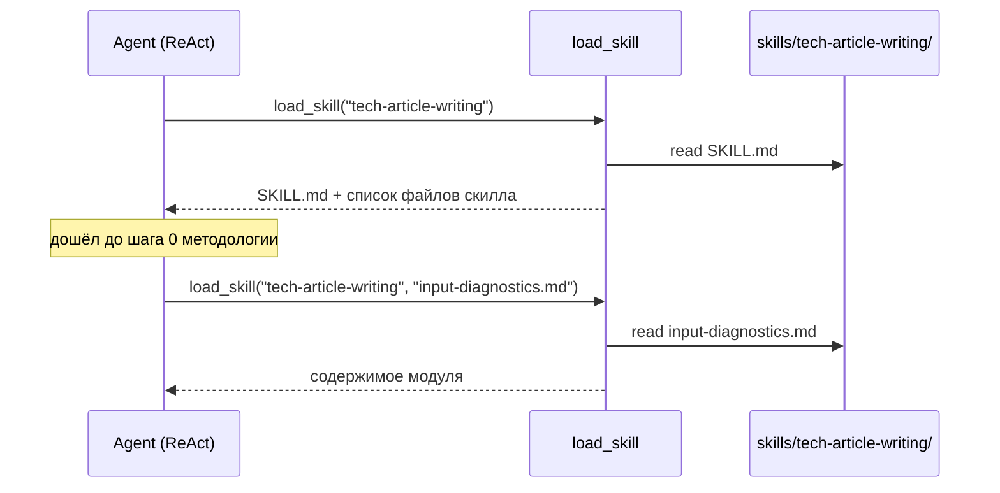

# Design Brief: feat-009 — Многофайловые скиллы + перенос tech-article-writing

## Контекст

Discovery-инициатива SOFA_Habr_Article (Фаза 5a roadmap) прожила полный цикл: методология написания техстатей → скилл `tech-article-writing` → статья написана этим скиллом и опубликована на Хабре. По замыслу инициативы обкатанный скилл переносится в продуктовую библиотеку `skills/` как первый пользовательский актив, добытый через discovery.

Блокер переноса: скилл принципиально многофайловый (SKILL.md + 5 модулей, progressive disclosure — модули подгружаются по шагам методологии), а продуктовый рантайм умеет загружать только `SKILL.md`: `load_skill(skill_name)` в `backend/app/agent/tools/skills.py` читает единственный файл, механизма чтения вспомогательных файлов скилла нет.

## Решение

### Расширение `load_skill`

Один инструмент, необязательный параметр:

```
load_skill(skill_name)         → содержимое SKILL.md + автосписок файлов скилла
load_skill(skill_name, file)   → содержимое модуля file внутри директории скилла
```

Отклонённая альтернатива — отдельный tool `read_skill_file`: плодит инструменты (токены в каждом запросе) при той же семантике. Компаундная загрузка всех файлов разом отклонена: ломает progressive disclosure, ради которого скилл разбит на модули.

Контракт параметра `file`:

- Относительный путь внутри директории скилла; поддиректории допустимы (под будущие скиллы с вложенной структурой), расширение не ограничено `.md`.
- Валидация симметрична существующей и двухслойна: абсолютные пути и `..` отклоняются safe-паттерном на уровне сегментов пути; второй линией — `resolve()` + `is_relative_to(skills_dir/skill_name)` — защита от path traversal.
- Файл не найден → ошибка со списком доступных файлов скилла (паттерн существующей ошибки «skill not found → available skills»).
- Бинарный файл: канал tool-результата текстовый, поэтому не декодируемое как UTF-8 содержимое → внятная ошибка «binary file, cannot load as text». В автосписке такие файлы видны — агент знает об их существовании, даже когда прочитать не может.

### Автосписок файлов

Ответ `load_skill` без параметра всегда содержит список файлов скилла — футером после содержимого SKILL.md. Отдельного вызова или параметра для этого нет: список приходит в момент входа в скилл, ровно когда он впервые нужен. Это робастность progressive disclosure — агент видит доступные модули, даже если ссылка в тексте SKILL.md потерялась.

Контракт автосписка:

- Состав: рекурсивный обход директории скилла, файлы любых расширений; исключаются сам `SKILL.md` и dotfiles.
- Формат: отсортированные пути относительно директории скилла, с подсказкой формы вызова.
- Скилл без модулей → футер не печатается: ответ для однофайловых скиллов (`structure`) не меняется.

```text
<...полное содержимое SKILL.md...>

---
Skill files (load with load_skill(skill_name, file)):
- anti-slop-checklist.md
- habr-platform.md
- input-diagnostics.md
- voice-preservation.md
- voice-profile-builder.md
```

Отклонённые альтернативы размещения списка: Skills Index в system message — раздувает контекст каждого запроса каждого пользователя ради редкого сценария; отдельный tool `list_skill_files` — та же логика, что у отклонённого `read_skill_file` (плодит инструменты). Сценария «список нужен до загрузки скилла» не существует — вход в скилл всегда через SKILL.md. `scan_skills_index` (индекс в system message) не меняется.



### Перенос скилла

Источник: `~/.claude/skills/tech-article-writing/` (7 файлов; текущее состояние подтверждено автором как финальное после ревью — включая позднейшую правку SKILL.md). Правила — по Transfer Brief инициативы (ревью автора пройден):

1. **Методологию не менять.** Содержимое переносится как есть; адаптируется только обвязка: внутренние ссылки между файлами и frontmatter. Конвенция `description` продукта совпадает со стилем Claude Code — «назначение + „Используй когда:" триггеры» (образец — скилл `structure`, семантика срабатывания в system prompt та же: «Load a skill when the user's task matches its description») — поэтому исходный description переносится практически как есть; конвенция фиксируется письменно в `doc/tech/conventions/agent.md` в рамках итерации.
2. **`author-voice/` не переносится** — данные пользователя не живут в коде скилла. Механизм остаётся: режимы A/B (`voice-preservation.md`), процедура `voice-profile-builder.md`. Ссылки на пути `author-voice/…` заменяются на нейтральную формулировку «профиль голоса пользователя, если доступен» — источником профиля станет skill-scoped context (feat-012); до его появления скилл полноценно работает в режиме B (эталон голоса — исходный материал автора; профиль по методологии и рождается только после первой статьи).
3. `habr-platform.md` — остаётся как платформенный модуль (образец добавления других платформ).
4. **Опережающие механики остаются в тексте как есть.** Шаги 3 и 5 методологии предписывают judge-проходы независимым субагентом с чистым контекстом (механика появится в feat-011); процедура `voice-profile-builder.md` завершается сохранением профиля (хранилище появится в feat-012). Формулировки не смягчаются и не адаптируются (замена путей `author-voice/…` из правила 2 — обвязка, не механика): содержимое скилла неприкосновенно (правило 1), а после feat-011/feat-012 всё заработает без повторного переноса. До этого — принятая деградация: judge-проходы агент выполняет сам в своём контексте (без качества «свежих глаз»), профиль голоса не строится.
5. Самопроверка после переноса: все внутренние ссылки скилла живые, ни одна инструкция не ссылается на пути из `~/.claude/`.

## Тесты

- `load_skill` c `file`: happy path, path traversal (`../`, абсолютный путь), несуществующий файл (ошибка содержит список файлов), поддиректория, не-markdown расширение, бинарный файл → ошибка.
- Существующее поведение без `file` не регрессирует; автосписок присутствует (рекурсивный, отсортированный, без SKILL.md и dotfiles); скилл без модулей — футер отсутствует, ответ прежний.

## Scope boundaries

Не входит в итерацию:

- Skill-scoped user context и профиль голоса — feat-012.
- Per-user включение/отключение скиллов, UI по скиллам — backlog (Фаза 5b).
- Judge-проходы скилла через субагентов — feat-011 (до неё агент выполняет judge-шаги сам, с оговоркой качества «свежих глаз»).

## Партиция треков

| Трек | Название | Файловый скоуп | Тестовый скоуп |
|------|----------|----------------|----------------|
| T1 | Расширение `load_skill` (параметр `file`, автосписок) | `backend/app/agent/tools/skills.py` (+ хелперы рядом при необходимости), `doc/tech/agent-runtime.md` (актуализация описания `load_skill`: параметр `file`, автосписок) | `backend/tests/personalization/test_skills.py` (существующие solitary-unit тесты skills-loader'а — расширяются, не дублируются в новом месте; + хелперы рядом при необходимости) |
| T2 | Перенос `tech-article-writing` в `skills/` + конвенция description | `skills/tech-article-writing/**`, `doc/tech/conventions/agent.md` | — (прод-кода нет; проверки переноса — ручные кейсы + cross-cutting в test-cases трека) |

**Вердикт непересечения:** скоупы не пересекаются — T1 живёт в backend-коде, `backend/tests/personalization/` и `agent-runtime.md`, T2 — в контентной директории `skills/` и доменной конвенции. Общих файлов нет. Партиция проверена независимым ревьюером; уточнения по его находкам:

- `doc/tech/conventions/agent.md` — **эксклюзивно за T2**. T1 в него не пишет: механика многофайловой загрузки документируется в `agent-runtime.md` (скоуп T1). В `agent.md` секция `## Skills → Frontmatter description` **уже существует** — T2 дополняет её при необходимости, не дублирует.
- Регистрация tool'а (`backend/app/main.py`) правок не требует: схема `@tool` выводится из сигнатуры, необязательный `file` не тянет main.py. Security-corpus содержимое скиллов не включает — corpus.py вне скоупа.
- `doc/tech/skill-map.md` не трогаем: это реестр dev-time скиллов агента-разработчика, не рантайм-библиотеки `skills/`.

**Параллельность фаз:** все per-track фазы T1 и T2 идут параллельно без ограничений (PLAN ∥ PLAN, IMPLEMENT ∥ IMPLEMENT и т.д.). Автотесты пишет только T1; T2 автотестов не заводит — его проверки (живость внутренних ссылок, отсутствие ссылок на `~/.claude/`, отсутствие `author-voice/`) — ручные кейсы трека, а сквозные проверки (скилл виден в Skills Index, `load_skill("tech-article-writing")` возвращает SKILL.md + автосписок 5 модулей, проходимость в режиме B) — cross-cutting кейсы без префикса трека, формулируются в `tracks/T2/test-cases.md` и прогоняются на INTEGRATION_TEST после барьера.

## SOFA consulted

- `37289096-0746-4af0-9926-fbf5ce097db5` (TIL) — always-loaded файл имеет жёсткий контекст-бюджет, выход — паттерн «index + detail files»: тонкий индекс всегда, тело — по требованию. Взято как подтверждение механики progressive disclosure (индекс скиллов → SKILL.md → модули JIT). Конкретные лимиты (200 строк / 25KB) специфичны для auto-memory Claude Code — не переносим как константы.
- `42d9624a-e0be-4a8c-90d0-1209e5e58d17` (TIL) — прямое чтение перелинкованных markdown-модулей целиком бьёт RAG-per-query до масштаба ~сотен статей. Взято как аргумент «модули скилла читаются файлами, без retrieval». Librarian-ingestion отвергнут — скиллы курируются вручную.
- `b8d220b5-28fd-4efd-867e-4f57ed3fcf2a` (Blueprint) — скилл-папка self-contained и dependency-free, скилл — контракт над capability. Взяты инварианты самодостаточности (самопроверка ссылок после переноса — из этой же логики). Дистрибуция по хостам отвергнута — скиллы у нас server-side.
