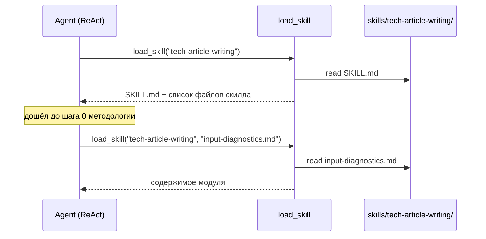

# Design Brief: feat-009 — Многофайловые скиллы + перенос tech-article-writing

## Контекст

Discovery-инициатива SOFA_Habr_Article (Фаза 5a roadmap) прожила полный цикл: методология написания техстатей → скилл `tech-article-writing` → статья написана этим скиллом и опубликована на Хабре. По замыслу инициативы обкатанный скилл переносится в продуктовую библиотеку `skills/` как первый пользовательский актив, добытый через discovery.

Блокер переноса: скилл принципиально многофайловый (SKILL.md + 5 модулей, progressive disclosure — модули подгружаются по шагам методологии), а продуктовый рантайм умеет загружать только `SKILL.md`: `load_skill(skill_name)` в `backend/app/agent/tools/skills.py` читает единственный файл, механизма чтения вспомогательных файлов скилла нет.

## Решение

### Расширение `load_skill`

Один инструмент, необязательный параметр:

```
load_skill(skill_name)         → содержимое SKILL.md + автосписок файлов скилла
load_skill(skill_name, file)   → содержимое модуля file внутри директории скилла
```

Отклонённая альтернатива — отдельный tool `read_skill_file`: плодит инструменты (токены в каждом запросе) при той же семантике. Компаундная загрузка всех файлов разом отклонена: ломает progressive disclosure, ради которого скилл разбит на модули.

Контракт параметра `file`:

- Относительный путь внутри директории скилла (поддиректории допустимы — под будущие скиллы с вложенной структурой).
- Валидация симметрична существующей: safe-паттерн имени + `resolve()` + `is_relative_to(skills_dir/skill_name)` — защита от path traversal.
- Файл не найден → ошибка со списком доступных файлов скилла (паттерн существующей ошибки «skill not found → available skills»).

Автосписок файлов в ответе `load_skill` без параметра — робастность: агент видит доступные модули, даже если ссылка в тексте SKILL.md потерялась. `scan_skills_index` (индекс в system message) не меняется.



### Перенос скилла

Источник: `~/.claude/skills/tech-article-writing/` (7 файлов). Правила — по Transfer Brief инициативы (ревью автора пройден):

1. **Методологию не менять.** Содержимое переносится как есть; адаптируется только обвязка: внутренние ссылки между файлами, frontmatter `description` под конвенции индекса продукта.
2. **`author-voice/` не переносится** — данные пользователя не живут в коде скилла. Механизм остаётся: режимы A/B (`voice-preservation.md`), процедура `voice-profile-builder.md`. Ссылки на пути `author-voice/…` заменяются на нейтральную формулировку «профиль голоса пользователя, если доступен» — источником профиля станет skill-scoped context (feat-012); до его появления скилл полноценно работает в режиме B (эталон голоса — исходный материал автора; профиль по методологии и рождается только после первой статьи).
3. `habr-platform.md` — остаётся как платформенный модуль (образец добавления других платформ).
4. Самопроверка после переноса: все внутренние ссылки скилла живые, ни одна инструкция не ссылается на пути из `~/.claude/`.

## Тесты

- `load_skill` c `file`: happy path, path traversal (`../`, абсолютный путь), несуществующий файл, поддиректория.
- Существующее поведение без `file` не регрессирует; автосписок файлов присутствует.

## Scope boundaries

Не входит в итерацию:

- Skill-scoped user context и профиль голоса — feat-012.
- Per-user включение/отключение скиллов, UI по скиллам — backlog (Фаза 5b).
- Judge-проходы скилла через субагентов — feat-011 (до неё агент выполняет judge-шаги сам, с оговоркой качества «свежих глаз»).

## SOFA consulted

- `37289096-0746-4af0-9926-fbf5ce097db5` (TIL) — always-loaded файл имеет жёсткий контекст-бюджет, выход — паттерн «index + detail files»: тонкий индекс всегда, тело — по требованию. Взято как подтверждение механики progressive disclosure (индекс скиллов → SKILL.md → модули JIT). Конкретные лимиты (200 строк / 25KB) специфичны для auto-memory Claude Code — не переносим как константы.
- `42d9624a-e0be-4a8c-90d0-1209e5e58d17` (TIL) — прямое чтение перелинкованных markdown-модулей целиком бьёт RAG-per-query до масштаба ~сотен статей. Взято как аргумент «модули скилла читаются файлами, без retrieval». Librarian-ingestion отвергнут — скиллы курируются вручную.
- `b8d220b5-28fd-4efd-867e-4f57ed3fcf2a` (Blueprint) — скилл-папка self-contained и dependency-free, скилл — контракт над capability. Взяты инварианты самодостаточности (самопроверка ссылок после переноса — из этой же логики). Дистрибуция по хостам отвергнута — скиллы у нас server-side.
