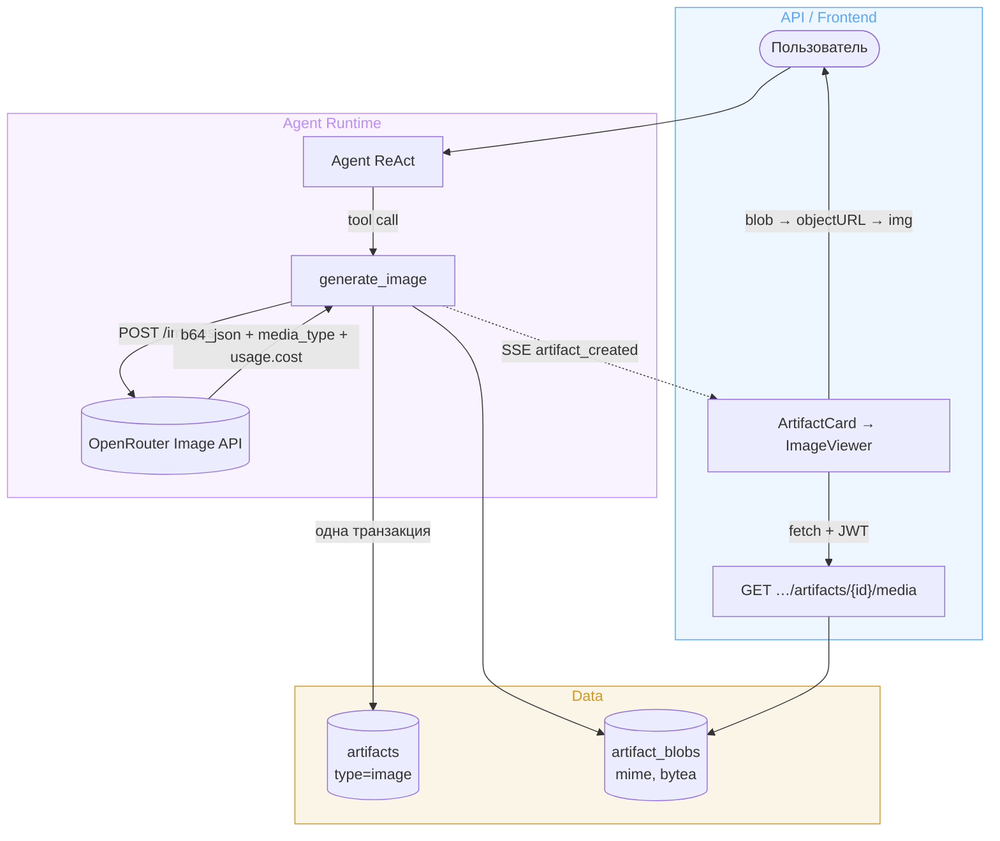

# Design Brief: feat-010 — Генерация изображений агентом

## Контекст

Backlog P2 «Генерация изображений агентом»; требование подтверждено discovery-спайком (Фаза 5a): без генерации изображений автор не начнёт готовить статьи через продукт. Сейчас в системе есть только фронт-заглушка `ImageViewer` за dev-флагом `SHOW_GROUP_B_STUBS` — она не запрашивает тело картинки; на бэкенде типа артефакта `image` не существует, артефакт по всему стеку текстовый (`artifacts.content: Text`), механизмов хранения и отдачи бинарей в системе нет.

## Архитектура

## Решения

### Вызов модели

OpenRouter Image API — `POST {llm_base_url}/images` (выделенный endpoint, канонический путь; legacy-путь через chat completions с `modalities` не используем). Вызов голым `httpx` — openai SDK с этим endpoint несовместим, отдельный пакет `openrouter` ради одного POST не тащим. Ответ: `data[0].b64_json` (голый base64) + `media_type` → декод в bytes. `usage.cost` (USD) — логировать в Langfuse (трек учёта затрат).

Конфигурация — новая секция `image` в `configs/agent.yaml`: модель (дефолт — flash-класс, `google/gemini-2.5-flash-image`, ≈$0.04/картинка; фронтир-генерация ≈$1 не масштабируется), дефолтные параметры. Ключ и base URL — существующие `Settings.llm_*`. Смена модели = правка конфига + перезапуск; выбор image-модели пользователем — backlog (P3).

### Tool

`generate_image(prompt, title, aspect_ratio?)` — фабрика `make_generate_image_tool(...)` по паттерну `make_create_artifact_tool` (замыкание над зависимостями), `response_format="content_and_artifact"` → существующее SSE-событие `artifact_created` работает без изменений (`artifact_type="image"`). Агенту открыт только `aspect_ratio`; размер/формат — из конфига.

### Хранение: таблица `artifact_blobs`

Отдельная таблица `artifact_blobs` (FK на `artifacts` 1:1, `mime_type`, `data bytea`), артефакт `type="image"`, в `content` — prompt/alt-текст. Миграция через `alembic revision --autogenerate`.

Доступ к блобам — за интерфейсом `BlobStorage` (`typing.Protocol`: put/get/delete) с единственной PG-реализацией: страховка от смены бэкенда без переделки tool и API.

Отклонённые альтернативы:

| Вариант | Почему нет |
|---|---|
| bytea-колонка на `artifacts` | блоб в основной таблице: ORM-select рискует тянуть мегабайты, листинг надо ограждать deferred-загрузкой |
| base64 в `content: Text` | мегабайтные JSON, ломает текстовый контракт content (markdown-рендер, download md/pdf), нет кэширования |
| Файловая система + StaticFiles | авторизация статики, volumes, бэкап и консистентность с БД вручную |
| S3/MinIO | правильно на масштабе (presigned URL разгружает backend, прямая отдача), но новая инфраструктура + двухфазность записи; на текущих объёмах PG выигрывает: нулевая инфраструктура, артефакт и блоб пишутся одной транзакцией. Переход — backlog, Фаза 6 |

Таблица переиспользуется будущими потребителями бинарей: file attachments (backlog P1), референсные изображения скилла визуализации (backlog).

### Отдача на фронт

Новый endpoint `GET /projects/{project_id}/artifacts/{artifact_id}/media` — отдаёт bytes с `Content-Type` из `mime_type` (404, если блоба нет). Auth — существующий JWT-слой.

Ключевая деталь: `` не отправляет Authorization-заголовок. Поэтому фронт качает картинку как обычные данные API (axios с interceptor) → `Blob` → `URL.createObjectURL` → ``; react-query кэширует, objectURL освобождается при размонтировании. Отклонено: подписанные короткоживущие URL (новая security-поверхность), cookie-auth (меняет модель авторизации), base64 в JSON деталей артефакта (тяжёлый ответ, нет HTTP-кэша).

### Frontend

`ImageViewer` снимается с мока: хук `useArtifactMedia` (fetch → objectURL), рендер реальной картинки, существующий UI зума сохраняется; ветка `type === "image"` в `ArtifactView` выходит из-под `SHOW_GROUP_B_STUBS` в прод. `ArtifactCard` в чат-ленте остаётся ссылкой (встраивание картинки в ленту — вне scope).

## Тесты

- Tool: успешная генерация (мок httpx) → артефакт + блоб в одной транзакции, SSE-событие; ошибка провайдера → внятная ошибка tool без частичной записи.
- Media endpoint: happy path, mime, 404 без блоба, auth.
- Формат ответа Image API верифицировать при реализации живым вызовом (implementation plan).

## Scope boundaries

Не входит: выбор image-модели пользователем (backlog P3), встраивание изображения в чат-ленту, входные изображения/`input_references`, несколько картинок за вызов, S3/MinIO (backlog, Фаза 6), редактирование сгенерированных изображений.

## SOFA consulted

Ресёрч проведён, релевантных постов нет. Запросы: image generation (tool), binary artifact storage, bytea/object storage, file storage postgres, blob, attachment, authenticated endpoint, presigned; теги `object-storage`, `image-generation`, `file-storage`, `s3`. Единственный тангенциальный кандидат — TIL `80cdf267` (S3 pre-signed PUT 403 при несовпадении ContentLength) — отвергнут: про подпись upload'а, не про выбор хранилища/отдачу.
