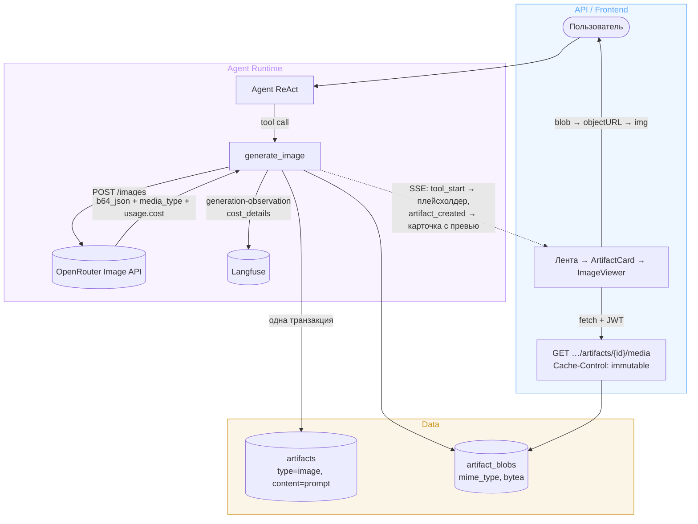

# Design Brief: feat-010 — Генерация изображений агентом

## Контекст

Backlog P2 «Генерация изображений агентом»; требование подтверждено discovery-спайком (Фаза 5a): без генерации изображений автор не начнёт готовить статьи через продукт. Сейчас в системе есть только фронт-заглушка `ImageViewer` за dev-флагом `SHOW_GROUP_B_STUBS` — она не запрашивает тело картинки; на бэкенде типа артефакта `image` не существует, артефакт по всему стеку текстовый (`artifacts.content: Text`), механизмов хранения и отдачи бинарей в системе нет. Главная техническая новизна итерации — в системе впервые появляются бинарные данные.

UI-референс — интерактивный мокап [mockups/image-artifacts.html](mockups/image-artifacts.html) (открывать локально; конвенция — conventions.md § UI-мокапы). Все UI-решения ниже согласованы архитектором по мокапу.

## Архитектура



## Решения

### Вызов модели

OpenRouter Image API — `POST {llm_base_url}/images` (выделенный endpoint; сверено с доками OpenRouter: гайд по генерации изображений построен только вокруг него, legacy-путь через chat completions с `modalities` не используем). Вызов голым `httpx`: openai SDK совместимость с этим endpoint не заявлена; официальный пакет `openrouter` с `images.generate` существует, но новая зависимость ради одного POST не оправдана. Ответ: `data[0].b64_json` (голый base64) + `media_type` → декод в bytes; `usage.cost` — фактическая стоимость вызова в USD. Биллинг all-or-nothing: неудачная генерация возвращает 502 и не тарифицируется.

**Модель — `google/gemini-3.1-flash-image`** (Nano Banana 2). Тариф per-token ($60/1M output-image-токенов); стоимость картинки по прайс-странице Google: 512px — $0.045, 1K — $0.067, 2K — $0.101, 4K — $0.151. В доках Google таблицы токенов расходятся (гайд vs прайс-страница) — канон прайс-страница, фактический расход сверить по `usage` живым вызовом при реализации. `n` у модели жёстко 1.

Конфигурация — новая секция `image` в `configs/agent.yaml`: `model` + `params` (словарь произвольных дефолт-параметров, прокидывается в запрос as-is — паттерн `extra_body` из `LLMConfig`; в v1 пуст, страхует смену модели на другую с иным веером параметров без изменения кода). Ключ и base URL — существующие `Settings.llm_*`. Смена модели = правка конфига + перезапуск; выбор image-модели пользователем — backlog (P3).

### Tool

`generate_image(prompt, title, aspect_ratio?, resolution?)` — фабрика `make_generate_image_tool(...)` по паттерну `make_create_artifact_tool` (замыкание над зависимостями), `response_format="content_and_artifact"`. Текст ToolMessage — подтверждение: title, id, разрешение, стоимость.

Разделение параметров — «творческое агенту, операционное оператору»:

- **Агент**: `prompt` (содержание), `aspect_ratio` (композиция: обложка 16:9, схема 4:3...), `resolution` (с инструкцией в docstring не задирать без причины — см. блок промптинга ниже). Валидация значений не дублируется: у каждой модели свой enum, ошибка 400 провайдера транслируется во внятную ошибку tool.
- **Конфиг**: `model`, дефолт-параметры (`params`).
- **Не даём**: `n` (у модели 1; несколько вариантов обложки = несколько вызовов tool с осознанно разными промптами — вариативность выше, чем у сэмплинга, каждый вариант — отдельный артефакт), `input_references` (image-to-image; понадобится для «апскейла выбранного» и скилла визуализации — backlog), `seed`, `stream`.

SSE: маппер `stream_events.py` эмитит `artifact_created` по имени tool'а `create_artifact` — **расширяется на `generate_image`** (само событие и его поля не меняются). События `tool_start`/`tool_end` уже в протоколе и не меняются.

### Изображение в контекст агента не попадает

ToolMessage текстовый; байты уходят в БД мимо контекста. Агент работает «вслепую»: сочинил промпт, получил подтверждение, результат глазами не видит — оценивает пользователь, правки идут словами («перегенери темнее»), агент корректирует промпт и вызывает tool снова. Осознанный v1: основная модель может быть не-vision, а картинка в истории диалога стоила бы токенов на каждый ход. Возврат изображения в контекст (мультимодальный ToolMessage / vision-judge субагент / обходной паттерн для не-vision моделей) — backlog.

### Учёт стоимости в Langfuse

Штатный cost-учёт (token usage из `CallbackHandler` × прайсы `pricing.yaml`) image-вызов не покрывает — он идёт голым httpx мимо колбэка, без явной записи затраты выпали бы из учёта. Внутри tool открывается generation-observation (паттерн `security/observer.py`: `start_as_current_observation(as_type="generation", ...)` — вызов уже внутри спана agent-run) с `cost_details` из `usage.cost` — фактическая цена от OpenRouter точнее производного расчёта. В БД затраты не пишутся: Langfuse — единственный источник учёта затрат в системе; продуктовый учёт/квоты — вне scope.

### Хранение: таблица `artifact_blobs`

Отдельная таблица `artifact_blobs` (FK на `artifacts` 1:1, `mime_type`, `data bytea`), артефакт `type="image"`, в `content` — prompt генерации (он же alt-текст и caption во вьюере). Миграция через `alembic revision --autogenerate`.

Доступ к блобам — за интерфейсом `BlobStorage` (`typing.Protocol`: put/get/delete) с единственной PG-реализацией: страховка от смены бэкенда без переделки tool и API. **Реализация конструируется вокруг session** — как репозитории (`PgBlobStorage(session)`): tool открывает `session.begin()` и передаёт сессию `ArtifactRepository` и `PgBlobStorage` — атомарность «артефакт + блоб одной транзакцией» получается естественно. Отклонено: `put(session, ...)` у stateless-инстанса — PG-деталь протекает в сигнатуру протокола (S3-реализация игнорировала бы параметр).

Отклонённые альтернативы:

| Вариант | Почему нет |
|---|---|
| bytea-колонка на `artifacts` | блоб в основной таблице: ORM-select рискует тянуть мегабайты, листинг надо ограждать deferred-загрузкой |
| base64 в `content: Text` | мегабайтные JSON, ломает текстовый контракт content (markdown-рендер, download md/pdf), нет кэширования |
| Файловая система + StaticFiles | авторизация статики, volumes, бэкап и консистентность с БД вручную |
| S3/MinIO | правильно на масштабе (presigned URL разгружает backend, прямая отдача), но новая инфраструктура + двухфазность записи; на текущих объёмах PG выигрывает: нулевая инфраструктура, артефакт и блоб пишутся одной транзакцией. Переход — backlog, Фаза 6 |

Таблица переиспользуется будущими потребителями бинарей: file attachments (backlog P1), референсные изображения скилла визуализации (backlog).

### Отдача на фронт

Новый endpoint `GET /projects/{project_id}/artifacts/{artifact_id}/media` — отдаёт bytes с `Content-Type` из `mime_type` (404, если блоба нет). Auth — существующий JWT-слой.

Ответ кэшируется агрессивно: `Cache-Control: private, max-age=31536000, immutable`. Право на это даёт иммутабельность блоба по построению: путей редактирования изображения нет, «перегенерация» рождает новый артефакт с новым id (= новым URL), поэтому контент по данному URL измениться не может — браузер кэширует навсегда без риска устаревания. `private` — контент под авторизацией, кэш только в браузере пользователя.

Ключевая деталь: `` не отправляет Authorization-заголовок. Поэтому фронт качает картинку как обычные данные API (паттерн `downloadArtifact`: axios с interceptor, `responseType: "blob"`) → `Blob` → `URL.createObjectURL` → ``; react-query кэширует, objectURL освобождается при размонтировании. Отклонено: подписанные короткоживущие URL (новая security-поверхность), cookie-auth (меняет модель авторизации), base64 в JSON деталей артефакта (тяжёлый ответ, нет HTTP-кэша).

### Frontend

По мокапу [mockups/image-artifacts.html](mockups/image-artifacts.html):

- **`ImageViewer` снимается с мока**: хук `useArtifactMedia` (react-query: fetch → objectURL, общий query-key с карточкой ленты), существующий UI зума сохраняется; caption под картинкой = `content` артефакта (prompt; человекочитаемая подпись от агента — backlog); кнопка «.png» скачивает уже полученный blob; кнопка «Открыть в окне» удаляется. Состояния: загрузка (скелетон на месте изображения), 404 без блоба (пустое состояние). Ветка `type === "image"` в `ArtifactView` выходит из-под `SHOW_GROUP_B_STUBS` в прод.
- **Карточка в чат-ленте с превью**: `ArtifactCard` для `type === "image"` показывает миниатюру 64×40. Превью — то же изображение с того же media-endpoint, ужатое CSS: отдельного thumbnail-эндпоинта и хранения нет (react-query дедуплицирует запрос с вьюером, immutable-кэш браузера снимает повторные загрузки; thumbnail-вариант блоба — backlog при росте объёмов).
- **Плейсхолдер на время генерации** (10–30 сек): по `tool_start` с `tool === "generate_image"` в ленту встаёт pending-карточка (шиммер-миниатюра, «Генерирую изображение…», indeterminate прогресс-бар), ключ — `call_id`; по `tool_end` с тем же `call_id` снимается (приходит и при ошибке tool — плейсхолдер не зависает), реальная карточка встаёт по `artifact_created`. Целиком фронтовая логика на существующих событиях — протокол и бэкенд не меняются. Title на плейсхолдере не показывается (`tool_start` не несёт аргументов; расширение события ради косметики отклонено).

### Промптинг и выбор параметров (блок для docstring tool)

Модель — нативно мультимодальная LLM без отдельного prompt-переписчика: промпт агента уходит в неё как есть, ответственность за качество описания — на вызывающем. Правила (по официальным гайдам Google; при реализации перенести в docstring, редактируя под формат):

```text
Промпт — связный абзац ~50–120 слов, не список тегов.
Структура: субъект → действие → окружение → композиция/камера → стиль → освещение.
- Конкретика в деталях (материалы, цвета) и назначение картинки
  («обложка технической статьи о ...») — модель использует интент.
- Только позитивные формулировки: вместо «без людей» — «пустая улица».
- Композиция языком фотографа: wide-angle, macro, low-angle, golden hour,
  shallow depth of field.
- Текст на картинке: точную надпись в двойных кавычках, шрифт описать словами
  («bold sans-serif»). Русский поддержан; надписи держать короткими (1–4 слова).

resolution: "1K" — дефолт, иллюстрация в тексте ($0.067); "512" — черновики
и варианты ($0.045); "2K" — обложки/hero ($0.101); "4K" — только по явной
просьбе пользователя ($0.151).
aspect_ratio: "16:9" — обложка статьи (Хабр кропит превью ~2:1 — ключевые
элементы держать по центру); "4:3"/"16:9" — иллюстрация; "1:1" — иконки;
"21:9", "4:1" — баннеры.
```

## Тесты

- Tool: успешная генерация (мок httpx) → артефакт + блоб в одной транзакции; ошибка провайдера → внятная ошибка tool без частичной записи; generation-observation с cost записывается.
- SSE-маппер: `generate_image` эмитит `artifact_created` (+ существующие `tool_start`/`tool_end` не регрессируют).
- Media endpoint: happy path, mime, 404 без блоба, auth, заголовок `Cache-Control`.
- Frontend: stream-store — плейсхолдер добавляется по `tool_start`/снимается по `tool_end` (расширение существующих тестов стора).
- Живой вызов Image API при реализации: формат ответа + фактический токен-расход по разрешениям (сверка с прайсом).

## Scope boundaries

Не входит: выбор image-модели пользователем (backlog P3), изображение в контексте агента (backlog), полноразмерное встраивание картинки в ленту/лайтбокс (в ленте — только превью в карточке), thumbnail-вариант блоба (backlog), человекочитаемая подпись-caption от агента (backlog; в MVP caption = prompt), входные изображения/`input_references` и «апскейл выбранного варианта» (backlog), несколько картинок за вызов (`n` = 1), `seed`/`stream`, S3/MinIO (backlog, Фаза 6), редактирование сгенерированных изображений.

## SOFA consulted

Ресёрч проведён, релевантных постов нет. Запросы: image generation (tool), binary artifact storage, bytea/object storage, file storage postgres, blob, attachment, authenticated endpoint, presigned; теги `object-storage`, `image-generation`, `file-storage`, `s3`. Единственный тангенциальный кандидат — TIL `80cdf267` (S3 pre-signed PUT 403 при несовпадении ContentLength) — отвергнут: про подпись upload'а, не про выбор хранилища/отдачу.
