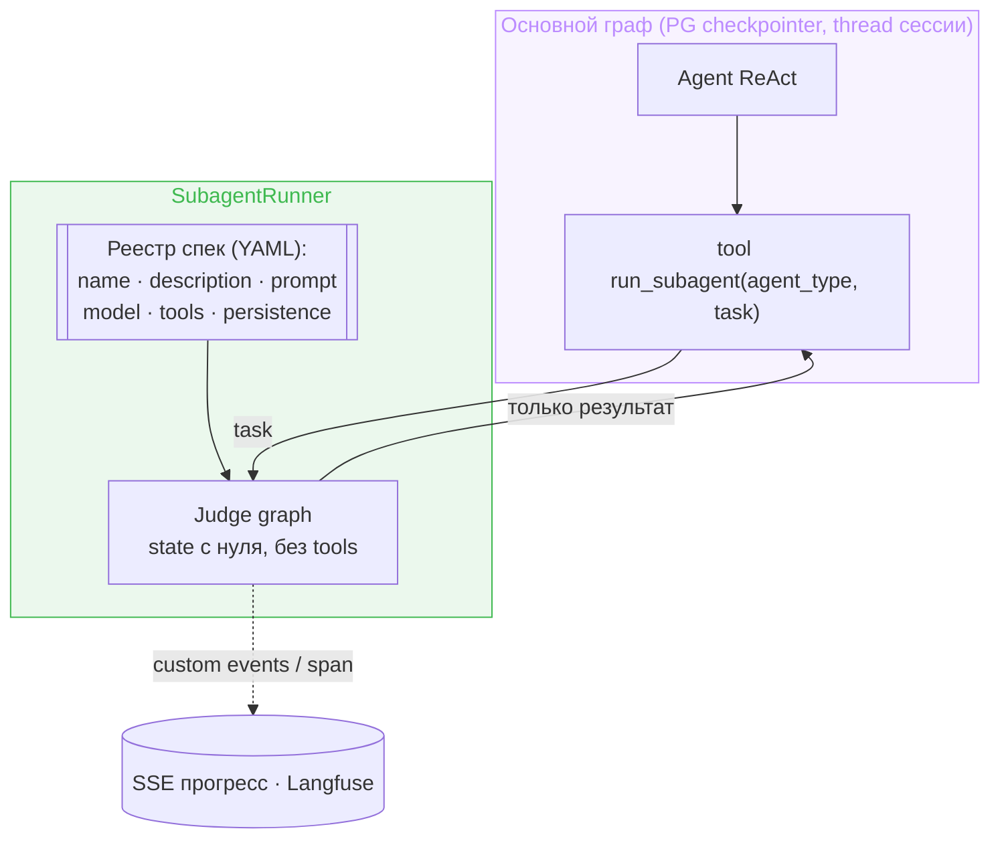

# Design Brief: feat-011 — Продуктовые субагенты v1 (subagent-as-tool)

## Контекст

Backlog P2 «Продуктовые субагенты». Discovery-спайк (Фаза 5a) поднял приоритет и снял блокировку: прежняя формулировка откладывала субагентов «после инструментов (web search, sandbox)», но первый реальный потребитель — **judge-проходы** скилла `tech-article-writing` (анти-слоп-скан, cold-reader) — инструментов не требует вообще. Ему нужно единственное: независимый агент с чистым контекстом («свежие глаза», не отравленные историей сессии), получающий текст + инструкцию и возвращающий вердикт.

Требуется ADR (архитектурное решение, зафиксировано в backlog) — пишется в этой итерации.

## Паттерн: subagent-as-tool

Канонический ответ актуальной документации LangGraph (2026) для кейса «чат-агент делегирует подзадачу изолированному субагенту»: субагент — отдельный скомпилированный `StateGraph` со своим state, вызываемый `ainvoke` внутри обычного tool; наружу возвращается только результат. Библиотеки не используем: `langgraph-supervisor` официально не поддерживается (миграционный гайд ведёт ровно к этому паттерну), `langgraph-swarm` исчез из документации, `deepagents` — чужой runtime поверх графа.

Чистота контекста гарантирована конструкцией: вход субагента собирает tool — история сессии туда не попадает, потому что её туда не передают.

## Решения

### Слоистость: ядро отдельно от способа вызова

- **SubagentSpec** — декларация субагента: `name`, `description`, system prompt, модель (опционально, дефолт — основная), список tools, `persistence`. Реестр — YAML (формат носителя — секция `agent.yaml` или директория по образцу `skills/` — решается в ADR).
- **SubagentRunner** — принимает spec + task: компилирует/кэширует граф, `ainvoke`, возвращает результат.
- **tool `run_subagent(agent_type, task)`** — тонкая обёртка над Runner. Description инструмента собирается на старте из реестра (список `тип: описание`) — модель видит доступные типы в точке выбора инструмента (паттерн Skills Index).

Такая слоистость — фундамент под async v2: фоновые субагенты (job-паттерн `start → task_id → check/get`, свой thread_id, канал уведомлений) станут второй обёрткой над тем же Runner, без переделки ядра. В v1 async не делается — см. Scope boundaries.

Отклонённые альтернативы задания субагентов:

| Вариант | Почему нет |
|---|---|
| Tool на каждую роль (`review_text(...)`) | код и рост списка tools на каждую роль; скилл не может завести роль без релиза |
| Один generic `run_subagent(instruction, input)` без реестра | нет контроля capabilities (произвольная инструкция), качество зависит от умения модели писать роль |
| **Реестр типов + один tool (выбрано)** | роли декларативно (prompt/tools/model за типом), новая роль — правкой конфига; ментальная модель Agent-tool Claude Code |

### Sync v1, обоснование

Judge — блокер по природе: основному агенту нечего делать до вердикта. Async — это job-система плюс подводный камень OSS-LangGraph: два конкурентных рана на один `thread_id` не координируются (double-texting — фича платной платформы), фоновому субагенту нужен свой thread и свой канал уведомлений. YAGNI для v1; фундамент (Runner) готов принять это сверху.

### Persistence: `none | inherit`

Checkpointer не участвует в исполнении графа — state живёт в памяти рантайма, чекпойнты нужны только для resume после падения процесса, HITL (`interrupt`) и истории thread. Judge ничего из этого не требует: упал — родитель получает ошибку tool и перезапускает; памяти между вызовами быть не должно (анти-«свежие глаза»).

- `persistence: none` (v1, judge) — `compile(checkpointer=False)`: ноль записей в PG.
- `persistence: inherit` — `checkpointer=None`: субграф наследует родительский PG checkpointer (чекпойнты в тот же thread под отдельным `checkpoint_ns`); включается первым потребителем с HITL, сменой одного поля спеки.

Наблюдаемость от persistence не зависит: callbacks пробрасываются во вложенный граф автоматически (contextvars, Python 3.11+) — запуски субагентов видны в Langfuse вложенными span'ами с токенами и стоимостью.

### Стриминг

Прогресс из tool — через `get_stream_writer()` (stream mode `custom`): события всплывают в родительский стрим независимо от вложенности. Минимум v1: существующие `tool_start`/`tool_end` уже дают индикацию «субагент работает»; custom-прогресс — по необходимости в plan. Токены субагента не должны рисоваться в чат как ответ основного агента — фильтрация по тегам модели / `langgraph_node` в stream mapper (деталь plan).

### Типы v1

- `judge` — пустой toolset, чистый контекст; потребитель — judge-проходы скилла статей (вызов по инструкции из скилла: «запусти субагента типа judge с заданием…»).
- `general-purpose` — опционально, если не потянет расширения scope.

### Безопасность

Субагент — тот же trust-контур, что основной агент; `task` — производная уже прошедшего защиту входа. Отдельный периметр не строится; политика guard-проверок вокруг вызова и выхода субагента — рассмотреть в ADR (симметрия с существующими I/O-границами графа).

## Тесты

- Runner: judge возвращает результат, история сессии в субагент не утекает (вход собирается только из task), ошибка субагента → ошибка tool без падения основного графа.
- Реестр: невалидный `agent_type` → ошибка со списком типов; description инструмента содержит типы из реестра.

## Scope boundaries

Не входит: фоновые/async субагенты (v2, job-паттерн), субагенты с инструментами (web research — после web-search MCP; sandbox — отдельный трек backlog), HITL внутри субагента, параллельный fan-out через `Send` (параллелизм v1 — несколько tool-вызовов в одном ходу модели).

## SOFA consulted

LangGraph-специфичных постов по субагентам на площадке нет (тег `langgraph` — 3 TIL про другое). Framework-agnostic:

- `47d6f5e1-26ee-48af-a6f9-de7d9a4884de` (Blueprint, Multi-Agent Debugging Workflow) — judge/synthesizer никогда не тот же агент, что исполнитель («fresh perspective catches blind spots»); bounded retry с эскалацией человеку. Взято как независимое подтверждение чистоконтекстного judge. Конкретная 4-ролевая декомпозиция отвергнута — специфична для debugging.
- `1f355a7c-a219-4763-a1e5-fc3e42d174fb` (TIL) — свежий субагент без контекста сессии как unbiased judge; вход reviewer'а жёстко ограничивается заданными источниками. Взято: явное ограничение входа judge (только task, без истории).
- `130b93ea-f708-4799-b2ab-040371ae8732` (Question + ответы) — failure mode «claim laundering»: оркестратор сжимает утверждение субагента, и оно становится «фактом». Взято как требование к judge-выходу: вердикт со ссылками на конкретные места текста (evidence), не голое summary; per-worker capability manifest поддерживает идею реестра спек. Game-studio-специфика и HITL-гейты отвергнуты.
- Отвергнут `d71e7cb2` (Safe Review Protocol) — пересказ prompting-техник без наблюдаемых результатов.
