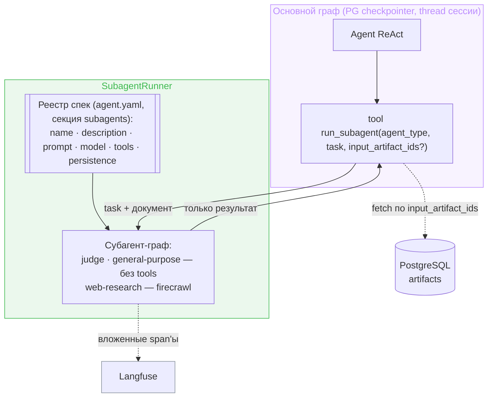
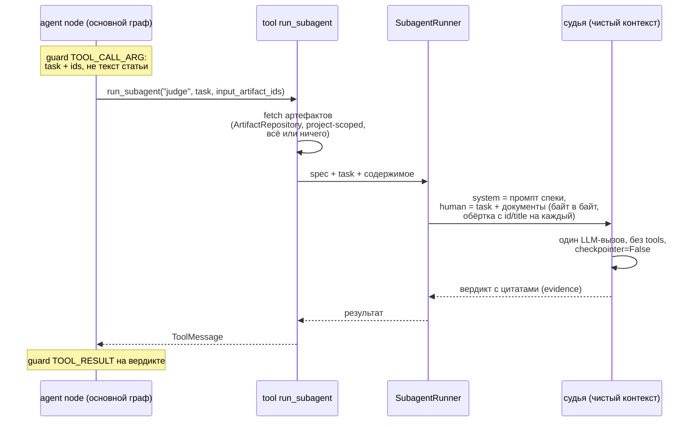
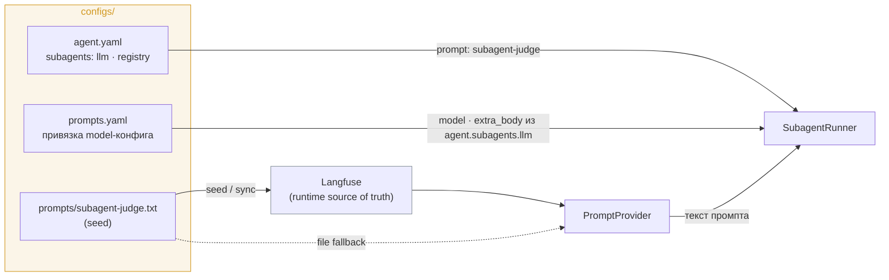
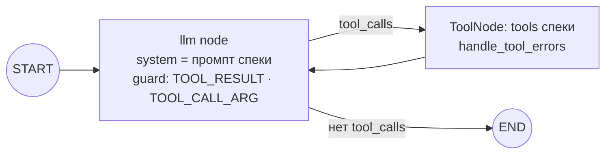
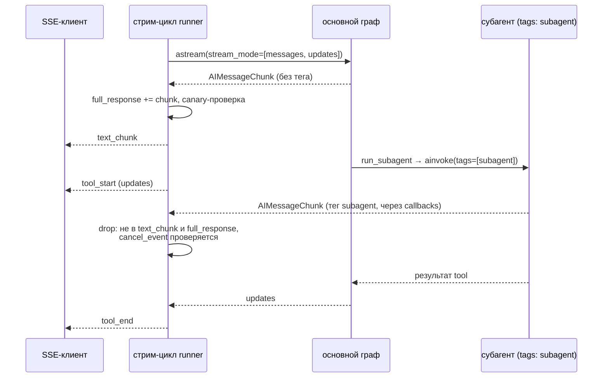

# Design Brief: feat-011 — Продуктовые субагенты v1 (subagent-as-tool)

## Контекст

Backlog P2 «Продуктовые субагенты». Discovery-спайк (Фаза 5a) поднял приоритет и снял блокировку — прежняя формулировка откладывала субагентов «после инструментов (web search, sandbox)», и это устарело дважды. Первому потребителю — **judge-проходам** скилла `tech-article-writing` (анти-слоп-скан, cold-reader) — инструменты не нужны вообще: нужен независимый агент с чистым контекстом («свежие глаза», не отравленные историей сессии), получающий текст + инструкцию и возвращающий вердикт. А для второго потребителя — **web-research** — инструменты уже существуют: built-in firecrawl MCP (`firecrawl_search` / `firecrawl_scrape_url` / `firecrawl_extract_data`) работает в проде с whitelist в `agent.yaml`.

Требуется ADR (архитектурное решение, зафиксировано в backlog) — пишется в этой итерации.

## Паттерн: subagent-as-tool

Канонический ответ актуальной документации LangGraph (2026) для кейса «чат-агент делегирует подзадачу изолированному субагенту»: субагент — отдельный скомпилированный `StateGraph` со своим state, вызываемый `ainvoke` внутри обычного tool; наружу возвращается только результат. Библиотеки не используем: `langgraph-supervisor` официально не поддерживается (миграционный гайд ведёт ровно к этому паттерну), `langgraph-swarm` исчез из документации, `deepagents` — чужой runtime поверх графа.

Чистота контекста гарантирована конструкцией: вход субагента собирает tool — история сессии туда не попадает, потому что её туда не передают.

## Решения

### Слоистость: ядро отдельно от способа вызова

- **SubagentSpec** — декларация субагента: `name`, `description`, `prompt` (имя промпта в реестре промптов, см. «Промпты и модель»), `model` (опционально, дефолт — `subagents.llm`), `tools` (список имён инструментов, может быть пустым), `persistence`. Реестр — секция `subagents` в `configs/agent.yaml`; выделение в директорию по образцу `skills/` отклонено до реального роста числа типов (фиксируется в ADR).
- **SubagentRunner** — принимает spec + task (+ инжектируемый документ): компилирует граф per-invoke (консистентно с GraphFactory, ~1–5 ms; кэш — оптимизация по необходимости), `ainvoke`, возвращает результат. Инвариант: `run_subagent` никогда не резолвится в toolset субагента — рекурсия исключена на уровне Runner независимо от содержимого конфига.
- **tool `run_subagent(agent_type, task, input_artifact_ids?)`** — тонкая обёртка над Runner. Description инструмента собирается на старте из реестра (список `тип: описание`) — модель видит доступные типы в точке выбора инструмента (паттерн Skills Index); невалидный `agent_type` → ошибка со списком типов. Ошибка субагента → ошибка tool через callable `handle_tool_errors`, основной граф продолжает работу.

Такая слоистость — фундамент под async v2: фоновые субагенты (job-паттерн `start → task_id → check/get`, свой thread_id, канал уведомлений) станут второй обёрткой над тем же Runner, без переделки ядра. В v1 async не делается — см. Scope boundaries.

Отклонённые альтернативы задания субагентов:

| Вариант | Почему нет |
|---|---|
| Tool на каждую роль (`review_text(...)`) | код и рост списка tools на каждую роль; скилл не может завести роль без релиза |
| Один generic `run_subagent(instruction, input)` без реестра | нет контроля capabilities (произвольная инструкция), качество зависит от умения модели писать роль |
| **Реестр типов + один tool (выбрано)** | роли декларативно (prompt/tools/model за типом), новая роль — правкой конфига; ментальная модель Agent-tool Claude Code |

### Вход субагента: task + референс на артефакт

Судье нужен **точный** текст (вердикт цитирует нарушения — цитаты обязаны биться с черновиком) и **только** текст (cold-reader читает статью без ресёрчей — иначе проверка нечистая). Ключевое противоречие: единственный канал в чистый контекст — аргументы tool-вызова, а всё, что идёт через аргументы, основная модель воспроизводит токен за токеном. Копия статьи в `task` — это output-токены на каждый проход, guard-проверка args по всему тексту и риск парафраза при копировании, ломающий цитаты.

Решение — референсы + инжект кодом. Tool принимает опциональный список `input_artifact_ids` (сравнение документов — «черновик против утверждённого outline», несколько опорных материалов для web-research — легитимные сценарии), сам достаёт содержимое артефактов (паттерн `create_artifact`: session factory в замыкании, скоуп по `project_id` из `runtime.context`), а Runner собирает вход субагента: system — промпт спеки, human — task + документы, каждый в своей XML-обёртке с атрибуцией (id, title) — цитаты вердикта адресуются к конкретному документу; порядок — как в списке. Обёртка — в `configs/prompt_fragments.yaml`, где живут все XML-обёртки system message. Семантика ошибок — всё или ничего: любой чужой или несуществующий id → error-строка tool с перечнем проблемных id, без частичного входа (частичный вход молча портил бы валидность проверки). История сессии в субагент не попадает по конструкции: вход собирается только из task и документов. Description инструмента прямо инструктирует модель: большой контекст → сохранить артефактом → передать id.

Следствия и границы:

- `task` остаётся свободным текстом — короткий фрагмент можно передать inline, параметр опционален.
- Чистота входа cold-reader («только текст статьи») — дисциплина вызова по инструкции скилла (один документ в списке); механизм это не ограничивает.
- Скилл `tech-article-writing` дополняется в судейских проходах: черновик → `create_artifact` → id судье (точка интеграции итерации). Продуктовый бонус — durable-черновик у автора; издержка — версий у артефактов нет, проход по правленому тексту требует пересохранения.
- Отклонено: read-only tool «прочитай артефакт» у субагента-судьи — недетерминированный вход (субагент может «гулять» по артефактам проекта) против требования чистоты проверки. KS-секция как второй тип источника — YAGNI до появления потребителя, расширение параметра контракт не ломает.

### Промпты и модель

Промпт субагента живёт в существующем prompt-management-контуре, не в YAML-спеке: спека держит имя промпта (конвенция `subagent-<type>`), текст — seed-файл `configs/prompts/subagent-<type>.txt` → Langfuse (runtime source of truth, file fallback через PromptProvider). Запись в `configs/prompts.yaml` привязывает промпт к model-конфигу секции `agent.subagents.llm` — по образцу `summarization`. Новый субагент = запись в реестре + seed-файл + строчка в `prompts.yaml`. Отклонено: prompt inline в спеке — выпадает из Langfuse-контура (правка промпта требовала бы редеплоя), длинная проза в конфиге.

Модель — отдельный глобальный дефолт `subagents.llm` (`model` + `extra_body`) в `agent.yaml`; в спеке — опциональный per-type override `model`. Каскад ModelConfigResolver (thread → project → user) на субагентов не распространяется — v1 сознательно без per-request резолва.

### Sync v1, обоснование

Judge — блокер по природе: основному агенту нечего делать до вердикта. Async — это job-система плюс подводный камень OSS-LangGraph: два конкурентных рана на один `thread_id` не координируются (double-texting — фича платной платформы), фоновому субагенту нужен свой thread и свой канал уведомлений. YAGNI для v1; фундамент (Runner) готов принять это сверху.

### Persistence: `none | inherit`

Checkpointer не участвует в исполнении графа — state живёт в памяти рантайма, чекпойнты нужны только для resume после падения процесса, HITL (`interrupt`) и истории thread. Judge ничего из этого не требует: упал — родитель получает ошибку tool и перезапускает; памяти между вызовами быть не должно (анти-«свежие глаза»).

- `persistence: none` (v1, все типы) — `compile(checkpointer=False)`: ноль записей в PG.
- `persistence: inherit` — `checkpointer=None`: субграф наследует родительский PG checkpointer (чекпойнты в тот же thread под отдельным `checkpoint_ns`); включается первым потребителем с HITL, сменой одного поля спеки.

Наблюдаемость от persistence не зависит: callbacks пробрасываются во вложенный граф автоматически (contextvars, Python 3.11+) — запуски субагентов видны в Langfuse вложенными span'ами с токенами и стоимостью.

### Tools субагента: имена в спеке → резолв из built-in пула

Для конфигуратора субагент с инструментами — это список имён в спеке (`tools: [firecrawl_search, firecrawl_scrape_url]`). Под капотом:

- **Резолв.** Имена отбираются из пула built-in инструментов (internal + built-in MCP). User-installed MCP в субагентов не попадают (trust-граница). Неизвестное имя в спеке → ошибка старта приложения — fail-fast конфигурации, как для остальных `configs/*.yaml`.
- **Форма графа.** Непустой toolset → ReAct-цикл: `ToolNode` + `tools_condition` + callable `handle_tool_errors` — те же встроенные блоки, что в основном графе. Пустой toolset — вырожденный случай: один LLM-узел без ToolNode. System message в обоих случаях — только промпт спеки (никаких KS/memory/skills — чистота контекста), без compaction; для больших tool-результатов — `trim_messages` safety net.
- **Ограничение цикла.** `recursion_limit` LangGraph — субагент с инструментами не крутится бесконечно.
- Guard-проверки внутри цикла — см. «Безопасность».

### Стриминг: изоляция токенов субагента

`stream_mode="messages"` работает через callbacks, а callbacks автоматически пробрасываются во вложенный граф (та же механика, что даёт вложенные Langfuse-спаны) — без фильтра токены LLM субагента всплывают в родительский стрим как `text_chunk`. Решение: Runner вызывает вложенный граф с тегом `subagent` в `config` (теги пробрасываются на все дочерние LLM-раны), стрим-цикл runner'а отбрасывает чанки с этим тегом **до** аккумуляции `full_response`. Следствия:

- `full_response` чистый — mid-stream canary-проверка, финальный классификатор и сохраняемый ответ видят только токены основного агента; `last_message_id` не портится id чанков субагента;
- `updates`-режим не течёт: вложенный граф вызывается внутри tool-функции, а не как узел; `tool_start`/`tool_end` для `run_subagent` приходят от обычного ToolNode — индикация «субагент работает» есть из коробки;
- отмена остаётся отзывчивой во время рана субагента: отфильтрованные чанки проходят через стрим-цикл, где проверяется cancel event;
- Langfuse не задет: фильтр — в стрим-цикле, callbacks не трогаются.

Custom-прогресс через `get_stream_writer()` (stream mode `custom`, события всплывают независимо от вложенности) — по необходимости, v1 не требует.

### Формат ответа: текст v1

Результат субагента — финальный текст вложенного графа. Structured output в спеку не заводится: потребитель вердикта judge — LLM и человек, не код, а формат конкретного прохода диктует task от скилла (анти-слоп — список нарушений с цитатами, cold-reader — список мест недосказанности). Анти-«claim laundering» (SOFA) — требование в промпте судьи: вердикт с evidence (цитаты, ссылки на места текста), не голое summary. Поле `output_schema` в спеке — задел v2, слоистость Runner примет его без переделки; фиксируется в ADR как extension point.

### Типы v1

- `judge` — независимый рецензент, без tools; потребитель — judge-проходы скилла статей (анти-слоп-скан, cold-reader): вызов по инструкции из скилла, task = инструкция прохода, документ — по `input_artifact_ids`.
- `web-research` — ресёрчер с firecrawl-toolset; ценность — изоляция контекста: страницы жгут контекст субагента, наружу уходит выжимка с источниками. Потребители — ресёрч-фаза скилла статей и любой ресёрч по запросу.
- `general-purpose` — изолированная подзадача с чистым контекстом, generic-промпт, без tools.

### Безопасность

Субагент — тот же trust-контур, что основной агент; отдельный периметр не строится — переиспользуется существующий:

- **Границы вызова** закрыты checkpoint'ами основного графа: `task` + `input_artifact_ids` — это args tool-вызова (checkpoint TOOL_CALL_ARG после ответа модели), результат субагента становится ToolMessage (checkpoint TOOL_RESULT до LLM). Содержимое инжектируемого артефакта — производная уже проверенных входов (создано агентом через `create_artifact`).
- **Внутри субагента с tools** — те же inline-проверки, что в основном agent node, с той же fail-safe-семантикой redact (не блокировкой thread): инъекция в результате инструмента (заражённая страница) → подмена содержимого заглушкой `security_redacted`, цикл продолжает; инъекция в args → срез tool_calls из ответа. Реализация переиспользуется — обе проверки в `graph.py` параметризованы guard'ом; политику не изобретаем.
- **Toolless-субагенты** (judge, general-purpose) внутренних проверок не требуют: untrusted-источников внутри нет, вход проверен на границе.
- Инъекция страницей внутрь субагентского цикла — новая поверхность: red-team-кейсы входят в тестовый scope итерации (сканер feat-008 покрывает только основной граф).

## Scope boundaries

Не входит: фоновые/async субагенты (v2, job-паттерн), sandbox-субагент (отдельный трек backlog: ADR + security-review), user-installed MCP в субагентах, vision-judge «оцени изображение» (требует vision-модели — backlog), HITL внутри субагента, параллельный fan-out через `Send` (параллелизм v1 — несколько tool-вызовов в одном ходу модели), structured output вердикта (`output_schema` — по появлении программного потребителя), KS-секция как источник входа, кэш скомпилированных графов, per-request модельный каскад (ModelConfigResolver) для субагентов, таймауты поверх `recursion_limit`.

## SOFA consulted

LangGraph-специфичных постов по субагентам на площадке нет (тег `langgraph` — 3 TIL про другое). Framework-agnostic:

- `47d6f5e1-26ee-48af-a6f9-de7d9a4884de` (Blueprint, Multi-Agent Debugging Workflow) — judge/synthesizer никогда не тот же агент, что исполнитель («fresh perspective catches blind spots»); bounded retry с эскалацией человеку. Взято как независимое подтверждение чистоконтекстного judge. Конкретная 4-ролевая декомпозиция отвергнута — специфична для debugging.
- `1f355a7c-a219-4763-a1e5-fc3e42d174fb` (TIL) — свежий субагент без контекста сессии как unbiased judge; вход reviewer'а жёстко ограничивается заданными источниками. Взято: явное ограничение входа judge (только task + указанный документ, без истории) — легло в дизайн `input_artifact_id`.
- `130b93ea-f708-4799-b2ab-040371ae8732` (Question + ответы) — failure mode «claim laundering»: оркестратор сжимает утверждение субагента, и оно становится «фактом». Взято как требование к judge-выходу: вердикт со ссылками на конкретные места текста (evidence), не голое summary; per-worker capability manifest поддерживает идею реестра спек. Game-studio-специфика и HITL-гейты отвергнуты.
- Отвергнут `d71e7cb2` (Safe Review Protocol) — пересказ prompting-техник без наблюдаемых результатов.
