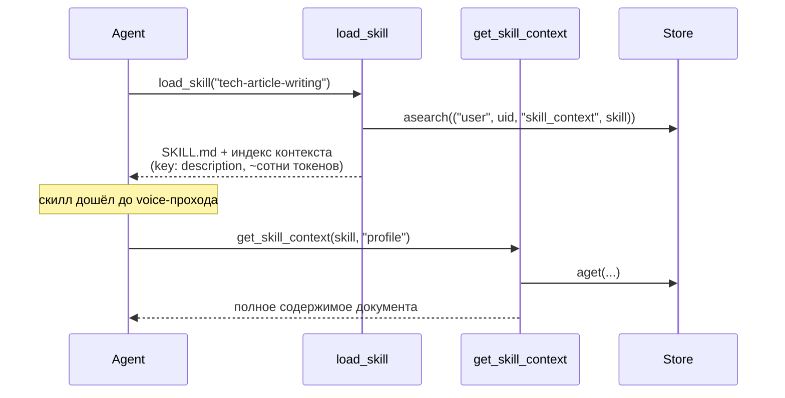

# Design Brief: feat-012 — Skill-scoped user context

## Контекст

Скиллы — глобальная библиотека, одинаковая для всех пользователей; персонализационного слоя над ними нет. Первый реальный запрос на такой слой — профиль авторского голоса скилла `tech-article-writing` (перенесён в feat-009): README скилла требует, чтобы в мультипользовательском продукте профиль жил в per-user хранилище и приходил в скилл извне, а не лежал в коде скилла.

Обобщение (решение архитектора): у **любого** скилла может быть per-user коллекция документов — «контекст скилла» (профили стиля, образзы, предпочтения). Профиль голоса — первый случай; будущие: предпочтения вёрстки слайдов, стиль визуализации и т.п.

## Модель хранения

Четвёртый namespace в LangGraph Store — единый паттерн расширения памяти (ADR-015):

```
("user", uid, "instructions")                — custom instructions   [есть]
("user", uid, "memory")                      — заметки агента        [есть]
("project", pid, "sphere")                   — Knowledge Sphere      [есть]
("user", uid, "skill_context", <skill_name>) — НОВОЕ
```

Namespace = «директория» скилла, key = имя документа (`profile`, `sample-habr-sofa`, …), value = `{description, content}`. Коллекция, не единственный блоб: профиль + дополнительные образцы — требование методологии скилла.

Отклонённые альтернативы: custom instructions (один блоб, висит в контексте всех сессий), user memory (нет привязки к скиллу, индекс всегда в контексте), Knowledge Sphere (per-project, а голос — свойство пользователя), SQLAlchemy-таблица (ломает единый паттерн памяти ADR-015; cleanup при удалении пользователя решается одинаково для всех неймспейсов Store).

## Доставка в контекст агента

Ключевое решение: контекст доставляется **через `load_skill`, а не постоянной секцией system message**.



Двухуровневый progressive disclosure: при `load_skill` — только индекс документов; содержимое агент тянет tool'ом, когда методология скилла этого требует. Не загружен скилл → контекст не существует для модели и не тратит токены.

Развязка хранения и доставки решает вопрос жизненного цикла: данные в Store живут независимо от наличия скилла в библиотеке (пользовательские данные молча не умирают при удалении/переименовании скилла), а доставка привязана к скиллу по построению — нет скилла, некому вызвать `load_skill`.

## Инструменты агента

Доменные tools по образцу user memory (решение «общие tools над всем Store» отклонено: описания-монстры, потеря типовой семантики, хуже гардрейлы):

- `get_skill_context(skill_name, key)`
- `save_skill_context(skill_name, key, description, content)` — upsert; путь создания документов (создаёт агент, например процедурой voice-profile-builder)
- `delete_skill_context(skill_name, key)`

## REST API и безопасность

- `GET /users/me/skill-contexts` — группировка по скиллам; у группы флаг «скилл в библиотеке» (для бейджа в UI)
- `GET /users/me/skill-contexts/{skill_name}/{key}`
- `PUT /users/me/skill-contexts/{skill_name}/{key}` — правка контента/описания
- `DELETE /users/me/skill-contexts/{skill_name}/{key}`

Запись через REST — новый checkpoint SecurityGuard (по образцу `CUSTOM_INSTRUCTIONS_WRITE`; INJECTION → 422). Обязательно: контент инжектится агенту в каждой будущей сессии — точка персистентной инъекции. Агентские tools — симметрично существующим memory-tools.

## UI

Секция «Контекст скиллов» на `/settings` (между «Памятью агента» и MCP). **Референс — интерактивный мокап: [mockups/settings-skill-context.html](mockups/settings-skill-context.html)** (вёрстка и токены воспроизведены из frontend/src; открывать локально в браузере).

Поведение из мокапа:

- Группировка по скиллу (имя моноширинным), внутри — документы: key + description.
- Клик по документу → отрендеренный Markdown-предпросмотр (скролл внутри превью при длинном контенте).
- «Править» → сырой Markdown в textarea; «Сохранить» (security-checkpoint, ошибка — как у «Своих инструкций») / «Отмена».
- Удаление документа. Создание из UI не предусмотрено — создаёт агент (паттерн «Памяти агента»).
- Скилл отсутствует в библиотеке → бейдж «скилла нет в библиотеке», данные и действия сохраняются.
- Пустое состояние: «Пока пусто. Скиллы будут сохранять сюда ваши профили и предпочтения по ходу работы».

## Связь с feat-009

`tech-article-writing` после переноса работает в режиме B (без профиля). Эта итерация даёт механизм; сам профиль голоса рождается процедурой `voice-profile-builder` после первой статьи, написанной через продукт, — данные появятся естественным путём, миграция данных не нужна.

## Тесты

- Tools: get/save/delete, изоляция по user_id и skill_name.
- REST: CRUD, guard-checkpoint на PUT (инъекция → 422), флаг наличия скилла в библиотеке.
- `load_skill`: индекс контекста дописывается при наличии документов, отсутствует при пустом namespace.

## Scope boundaries

Не входит: бинарные документы контекста (референсные изображения — backlog, зависимость от `artifact_blobs` feat-010), создание документов пользователем из UI, просмотр содержимого самих скиллов (кандидат «страница библиотеки скиллов» — backlog, вместе с per-user включением скиллов, Фаза 5b), автоматическое накопление голоса из обратной связи (backlog, поверх этого механизма).

## SOFA consulted

Прямых постов про skill-scoped user context нет (запросы: user memory, personalization, style profile, context injection, per-user, custom instructions; теги `memory`, `personalization`). Смежное:

- `a9801096-5fcf-4549-a0a6-21916396cb94` (Blueprint, карта memory-систем) — **annotation poisoning**: память, записанная агентом, — недоверенный вход при чтении. Взято как подтверждение security-checkpoint на записи skill-context (контент инжектится в будущие сессии). Продукты/бенчмарки из поста отвергнуты как маркетингово окрашенные.
- `84b89687-11e8-44f8-950f-65667c1263a1` (TIL, bi-temporal memory) — записи о предпочтениях пользователя помечать временем и детектировать устаревание. Взято частично: `created_at`/`updated_at` Store уже даёт основу; полный bi-temporal graph отвергнут — overkill для нашего масштаба (сам пост это признаёт).
- `37289096-0746-4af0-9926-fbf5ce097db5` (TIL) — бюджет always-injected контента: подтверждает решение «при load_skill — только индекс, содержимое по требованию».
