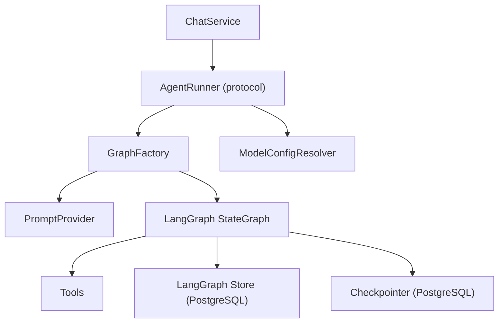
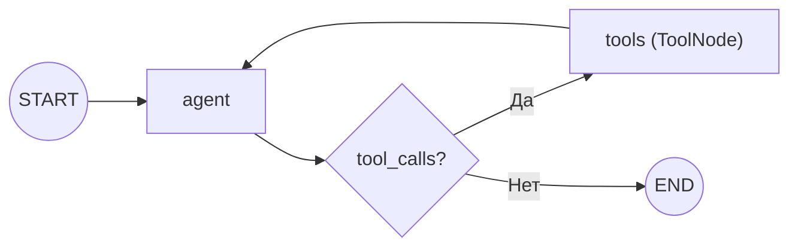
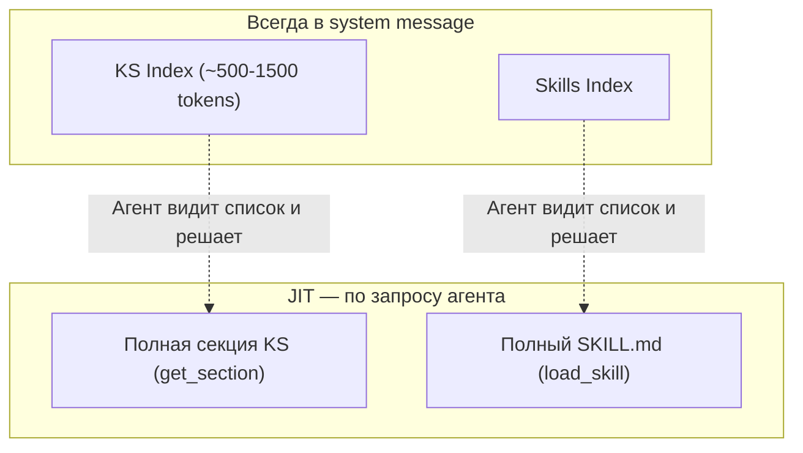
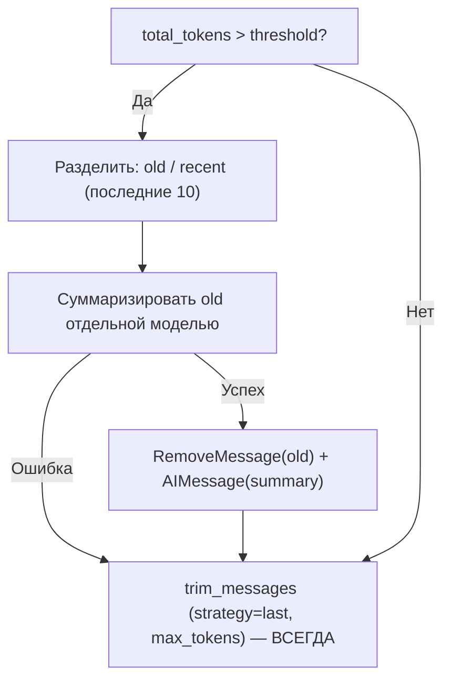

# Agent Runtime

Ядро AI-функциональности: LangGraph-граф с ReAct-паттерном, context engineering, tools, skills, MCP-интеграция. Инкапсулирован в Agent Layer — наружу выходят только доменные типы (`StreamEvent`, `Message`), не LangGraph-специфичные. Стриминг событий — [streaming.md](streaming.md).

## Architecture Overview



**AgentRunner** — protocol-интерфейс взаимодействия с Service Layer:

| Метод | Назначение |
|-------|------------|
| `stream(thread_id, content, project_id, user_id, session?, model_config?)` | Генерация ответа, поток `StreamEvent` |
| `get_history(thread_id)` | История сообщений (HumanMessage + AIMessage без tool_calls) |
| `get_last_ai_message_id(thread_id)` | ID последнего ответа агента (для привязки артефактов) |
| `cancel(thread_id)` | Отмена генерации через `asyncio.Event` |

Реализация: `LangGraphAgentRunner`. ChatService оркестрирует (thread mapping, artifact linking, trace saving), AgentRunner — генерация.

### Runtime Configuration (feat-003)

**GraphFactory** — per-request build+compile граф с resolved model config. Вместо одного pre-built графа на старте, GraphFactory строит новый граф для каждого запроса с нужной моделью и набором tools.

**ModelConfigResolver** — каскадное разрешение модели: thread → project → user → Langfuse prompt.config → agent.yaml.

**PromptProvider** — фетчинг промптов из Langfuse с file fallback. При старте — seed промптов в Langfuse из файлов (idempotent, duplicate-safe).

### System Message Structure

```
base_prompt (from PromptProvider)
<custom_instructions> (per-user, from LangGraph Store)
<user_memory> (per-user memories, from LangGraph Store)
<knowledge_sphere> (per-project sections)
<available_skills> (from skills directory scan)
```

## Agent Graph

`StateGraph(MessagesState)` — single key `messages`, reducer `add_messages`.



- **agent** — основной узел: compaction → system message → trimming → LLM invocation
- **tools** — `ToolNode` (prebuilt), выполнение tool calls
- **tools_condition** (prebuilt) — routing: AIMessage с tool_calls → tools, иначе → END

**Context schema:** `AgentContext(project_id, user_id)` — передаётся через `context=` параметр `astream()`, доступен в nodes и tools через `runtime.context`.

**Compile:**
- `checkpointer=AsyncPostgresSaver` — персистентная история сообщений (PostgreSQL)
- `store=AsyncPostgresStore` — key-value хранилище для Knowledge Sphere

**Invocation:**
```
graph.astream(input_msg, config, stream_mode=["messages", "updates"], context=context)
```
- `stream_mode=["messages"]` — потоковые токены от LLM → `text_chunk` events
- `stream_mode=["updates"]` — результаты узлов → `tool_start`, `tool_end`, `artifact_created` events

## System Message

Jinja2 template, собирается из трёх частей на каждый вызов agent node:

```
┌─────────────────────────────────┐
│ Based Prompt                    │  ← configs/prompts/system.txt
│ (стиль, guidelines, boundaries) │
├─────────────────────────────────┤
│ <knowledge_sphere>              │
│   KS Index                      │  ← LangGraph Store (pre-loaded)
│ </knowledge_sphere>             │
├─────────────────────────────────┤
│ <available_skills>              │
│   Skills Index                  │  ← skills/ directory (scanned at startup)
│ </available_skills>             │
└─────────────────────────────────┘
```

- **Based prompt** — статический текст: стиль взаимодействия (expert-to-expert), guidelines по Knowledge Sphere, артефактам, skills, error handling
- **KS Index** — список секций Knowledge Sphere с описаниями, загружается из Store каждый вызов (может измениться между вызовами)
- **Skills Index** — список skill name + description, формируется при старте из YAML frontmatter `skills/*/SKILL.md`

Пересборка на каждый вызов гарантирует актуальность KS Index (агент мог создать/удалить секции в предыдущей итерации).

## Context Engineering

Стратегия: **Progressive Disclosure + JIT Loading.**



| Уровень | Что | Когда | Размер |
|---------|-----|-------|--------|
| Pre-loaded | KS Index, Skills Index | Каждый вызов agent node | ~500-1500 tokens |
| JIT | Полная секция KS | `get_section(section_id)` | Variable |
| JIT | Полный SKILL.md | `load_skill(skill_name)` | Variable |
| Managed | Message history | Trimming + compaction | До `max_tokens` budget |

Агент видит индексы в system message и решает, какой контекст подтянуть для текущей задачи. Полные данные загружаются только когда нужны — минимизирует расход контекстного окна.

## Message Compaction

Управление длинными сессиями: суммаризация старых сообщений при превышении порога.

**Trigger:** `total_tokens > max_tokens × compaction_threshold_ratio`

| Параметр | Default | Назначение |
|----------|---------|------------|
| `max_tokens` | 100 000 | Бюджет контекстного окна |
| `compaction_threshold_ratio` | 0.75 | Порог (75k tokens) |
| `recent_messages_to_keep` | 10 | Сколько последних сообщений оставить |
| `max_summary_tokens` | 500 | Лимит на summary |

**Два механизма, работающих последовательно:**



**Compaction** (условный) — умная суммаризация: старые сообщения заменяются на summary отдельной моделью. Сохраняет ключевые решения, нерешённые вопросы, текущий фокус; отбрасывает промежуточные tool outputs и reasoning. При ошибке суммаризации — пропускается (graceful degradation).

**Trimming** (безусловный) — safety net после compaction. `trim_messages(strategy="last")` гарантирует, что финальный набор сообщений не превышает `max_tokens`. Если всё влезает — no-op. Нужен потому, что compaction считает только messages, а system message (based prompt + KS Index + Skills Index) тоже занимает место в контекстном окне.

**Checkpointer хранит полную историю** — оба механизма оптимизируют контекстное окно, не уничтожают данные.

## Tools

Три категории, объединяются при компиляции графа:

### Internal Tools

**Knowledge Sphere** — CRUD для пользовательской базы знаний (подробнее — [knowledge-sphere.md](knowledge-sphere.md)):

| Tool | Назначение |
|------|------------|
| `get_section` | Получить полный контент секции |
| `create_section` | Создать новую секцию |
| `update_section` | Обновить секцию (fuzzy patch или overwrite) |
| `delete_section` | Удалить секцию |

**Artifacts:**

| Tool | Назначение |
|------|------------|
| `create_artifact` | Сохранить результат работы агента как артефакт проекта |

`response_format="content_and_artifact"` — tool возвращает и текстовый ответ, и metadata артефакта (`id`, `title`, `type`). Metadata передаётся через SSE как `artifact_created` event.

**Skills:**

| Tool | Назначение |
|------|------------|
| `load_skill` | Загрузить полный SKILL.md по имени |

### External Tools (MCP)

Динамически загружаются из configured MCP-серверов, конвертируются в `BaseTool` через `langchain_mcp_adapters`. Объединяются с internal tools: `all_tools = ks_tools + [load_skill, create_artifact] + mcp_tools`.

## Skills System

Skill — модуль специализированных знаний, загружаемый агентом по запросу.

**Формат:** директория с `SKILL.md` (YAML frontmatter `name` + `description`, затем контент). Совместим с Claude Code skill format.

**Lifecycle:**
1. **Discovery** (при старте): `scan_skills_index()` сканирует `skills/`, парсит frontmatter → формирует Skills Index
2. **Index** (в system message): агент видит список `name: description`
3. **Loading** (JIT): агент вызывает `load_skill(skill_name)` → полный контент SKILL.md в контексте

**Безопасность:** валидация имени `^[a-z0-9_-]+$`, проверка `is_relative_to(skills_dir)` — защита от path traversal.

## MCP Integration

Расширение агента внешними инструментами через Model Context Protocol.

**Конфигурация:** `configs/agent.yaml`, секция `mcp_servers`. Per-server настройки:

| Поле | Назначение |
|------|------------|
| `transport` | Тип соединения: `stdio`, `sse`, `http` |
| `url` | URL для sse/http транспортов |
| `api_key_env` | Имя env-переменной с API ключом |
| `command` / `args` | Команда запуска для stdio |
| `allowed_tools` | Whitelist инструментов (фильтрация после получения) |

**Транспорты:**
- `stdio` — subprocess, локальные серверы
- `sse` — Server-Sent Events
- `http` → `streamable_http` — HTTP-based

**Client:** `MultiServerMCPClient` из `langchain_mcp_adapters`. Создаётся при старте приложения, shared across invocations.

**Allowed tool filtering:** после получения tools от сервера отфильтровываются только разрешённые. Позволяет ограничить scope без изменения конфигурации MCP-сервера.

## Observability

Опциональная интеграция с Langfuse (подробнее — [observability.md](observability.md)).

- `CallbackHandler` инжектируется в `config["callbacks"]` графа — автоматическое логирование LLM calls
- Root span `agent-run` с propagation атрибутов: `user_id`, `session_id` (thread_id), `project_id`
- `trace_id` передаётся через SSE для привязки user feedback
- Model definitions с pricing — cost tracking per invocation

**Graceful degradation:** при недоступности Langfuse или отсутствии ключей — `_NoOpSpan` (no-op методы), приложение работает без трейсинга.

## Graceful Degradation

| Компонент | При отказе | Поведение |
|-----------|-----------|-----------|
| LLM | Исключение в stream | `error` event клиенту, state сохранён в checkpointer |
| MCP-серверы | Ошибка при инициализации | Приложение стартует без внешних tools |
| Summarization model | Ошибка суммаризации | Fallback на trim-only |
| Langfuse | Недоступен / не сконфигурирован | No-op span, приложение работает без трейсинга |

Каждый компонент деградирует изолированно, не роняя систему.

## Configuration

Два файла конфигурации агента:

**`configs/agent.yaml`** — параметры runtime:

| Секция | Что настраивает |
|--------|----------------|
| `llm` | Модель, extra_body (reasoning effort и т.д.) |
| `context` | max_tokens, compaction_threshold_ratio, recent_messages_to_keep |
| `prompt` | Путь к файлу system prompt |
| `summarization` | Модель суммаризации, max_summary_tokens |
| `mcp_servers` | MCP-серверы: transport, URL, API keys, allowed_tools |
| `models` | Model definitions для Langfuse (pricing, match patterns) |

**`configs/prompts/system.txt`** — текст based prompt (загружается при старте, инжектируется в system message).

Application-level настройки (LLM credentials, Langfuse keys, Redis) — в `backend/app/config.py` через Pydantic Settings.
