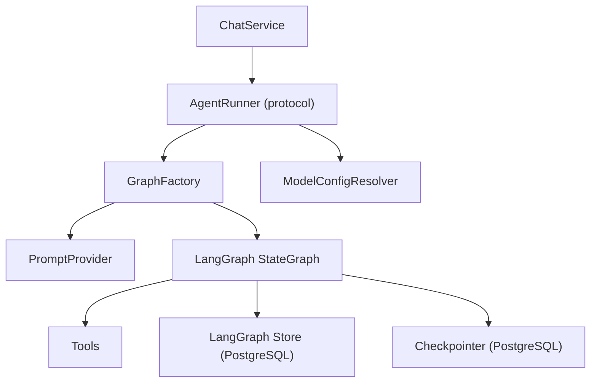
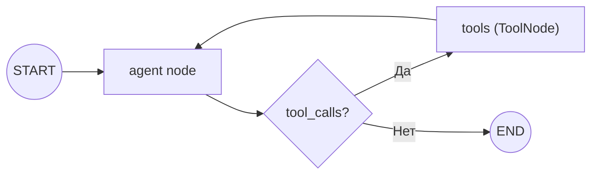
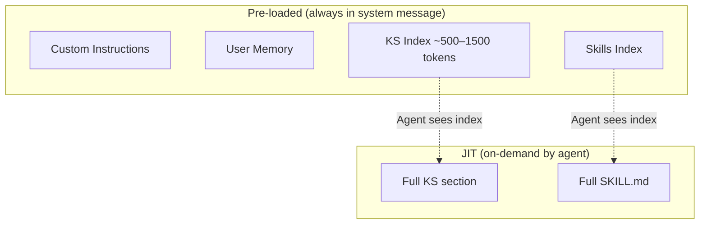
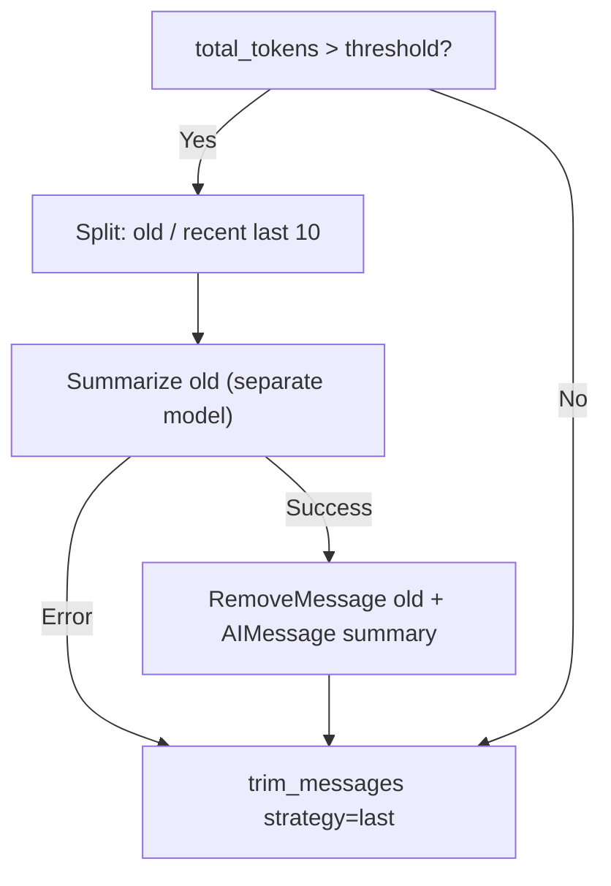

# Agent Runtime

Ядро AI-функциональности: LangGraph StateGraph с ReAct-паттерном, context engineering, tools, skills, MCP-интеграция. Инкапсулирован в Agent Layer — наружу выходят только доменные типы (`StreamEvent`, `Message`), не специфичные для LangGraph. Стриминг событий описан в [streaming.md](streaming.md).

## Architecture Overview



**AgentRunner** — контрактный интерфейс взаимодействия с Service Layer:

| Метод | Назначение |
|-------|------------|
| `stream(thread_id, content, project_id, user_id, session?, model_config?)` | Генерация ответа, поток `StreamEvent` |
| `get_history(thread_id)` | История сообщений (HumanMessage + AIMessage без tool_calls) |
| `get_last_ai_message_id(thread_id)` | ID последнего ответа агента (для привязки артефактов) |
| `cancel(thread_id)` | Отмена генерации через `asyncio.Event` |

Реализация: `LangGraphAgentRunner`. ChatService оркестрирует (thread mapping, artifact linking, trace saving), AgentRunner — генерация.

### Per-Request Flow

```
ChatService
  → ModelConfigResolver.resolve(user_id, project_id, thread_id)
  → GraphFactory.build(model_config, mcp_tools)
  → graph.astream(input, config, context)
```

**GraphFactory** строит и компилирует новый `StateGraph` для каждого запроса с resolved model config и набором tools. Overhead ~1-5ms на компиляцию 2-node графа. Checkpointer и Store — shared, не пересоздаются.

**ModelConfigResolver** — каскадное разрешение модели: thread → project → user → Langfuse prompt config → agent.yaml. Первый non-null уровень побеждает. Whitelist доступных моделей — из `configs/agent.yaml`.

**PromptProvider** — фетчинг системных промптов из Langfuse с file fallback. Подробнее — [prompt-management.md](prompt-management.md).

## Agent Graph

`StateGraph(MessagesState)` — один ключ `messages` с reducer `add_messages`.



- **agent node** — основной узел: compaction → system message assembly → trimming → LLM call
- **tools** — встроенный `ToolNode`, выполнение tool calls
- **tools_condition** — встроенный router: AIMessage с tool_calls → tools node, иначе → END

**Context schema:** `AgentContext(project_id, user_id, canary_token, user_installed_tool_names)` — передаётся через параметр `context=` в `astream()`, доступен в nodes и tools через `runtime.context`. `canary_token` вычисляется для каждого запроса; `user_installed_tool_names` нужен prompt-builder'у для дифференциации built-in / user-installed MCP-инструментов (→ [architecture.md](../security/architecture.md)).

**Compilation:** GraphFactory на каждый запрос настраивает:
- `checkpointer=AsyncPostgresSaver` — shared, персистentна история в PostgreSQL
- `store=AsyncPostgresStore` — shared, key-value хранилище для Knowledge Sphere и User Memory

**Invocation:**
```
graph.astream(input_msg, config, stream_mode=["messages", "updates"], context=context)
```
- `stream_mode=["messages"]` — потоковые токены от LLM → `text_chunk` SSE events
- `stream_mode=["updates"]` — результаты узлов → `tool_start`, `tool_end`, `artifact_created` events

## System Message

Собирается секционно (Python, не Jinja-template) на каждый вызов agent node. Структура отражает trust- и disclosure-границы; маркировка обёртками — вход в [Security](#security):

```
<system_instructions>           ← hardening preamble + canary token
[base prose]                    ← PromptProvider (→ prompt-management.md)
<tools>
  <internal_tools>              ← capability-only описания internal non-MCP tools
  <builtin_mcp_tools>           ← descriptions vendored MCP-серверов
  <user_installed_mcp_tools>    ← per-user MCP, обёрнутые в <untrusted_tool_description>
</tools>
<knowledge_sphere>              ← Knowledge Sphere Index (per-project)
<custom_instructions>           ← user-provided (per-user)
[guidelines: artifacts, skills, user_memory, error_handling]
<instruction_reminder>          ← sandwich defense
```

| Раздел | Источник | Область | Обновление |
|--------|----------|--------|-----------|
| System instructions | hardening preamble + base prose из Langfuse | Global | Canary token per-request |
| Base prose | PromptProvider (Langfuse → file fallback) | Global | При изменении в Langfuse (SDK cache TTL) |
| Tools (3 подсекции) | static + agent.yaml + DB (per-user MCP) | Mixed | На сборку prompt'а |
| Custom instructions | LangGraph Store | Per-user | При сохранении через REST API |
| User memory | LangGraph Store | Per-user | Автономно агентом (tools) |
| Knowledge Sphere Index | LangGraph Store | Per-project | При изменении секций (agent tools / REST API) |
| Instruction reminder | hardening preamble | Global | Статический |
| Skills Index | filesystem scan | Global | При старте приложения |

Пересборка на каждый вызов гарантирует актуальность динамических частей (Knowledge Sphere Index, memories, набор user MCP). Подробнее о trust-обёртках и disclosure-границе — [security/architecture.md](../security/architecture.md).

## Context Engineering

Стратегия: **Progressive Disclosure + JIT Loading.**



| Уровень | Содержимое | Когда | Размер |
|---------|-----------|-------|--------|
| Pre-loaded | Custom Instructions, User Memory | Каждый вызов agent node | Variable (user-dependent) |
| Pre-loaded | Knowledge Sphere Index, Skills Index | Каждый вызов agent node | ~500–1500 tokens |
| JIT | Полная секция Knowledge Sphere | `get_section(section_id)` | Variable |
| JIT | Полный SKILL.md | `load_skill(skill_name)` | Variable |
| Managed | Message history | Trimming + compaction | До `max_tokens` budget |

Агент видит индексы в системном промпте и решает, какой контекст подтянуть для текущей задачи. Полные данные загружаются только когда нужны — минимизирует расход контекстного окна.

## Message Compaction

Управление длинными сессиями: суммаризация старых сообщений при превышении порога.

**Trigger:** `total_tokens > max_tokens × compaction_threshold_ratio`

| Параметр | Default | Назначение |
|----------|---------|------------|
| `max_tokens` | 100 000 | Бюджет контекстного окна |
| `compaction_threshold_ratio` | 0.75 | Порог срабатывания (75k tokens) |
| `recent_messages_to_keep` | 10 | Сколько последних сообщений оставить |
| `max_summary_tokens` | 500 | Лимит на summary |

**Два механизма, работающих последовательно:**



**Compaction** (условный) — умная суммаризация: старые сообщения заменяются summary отдельной моделью. Сохраняет ключевые решения, нерешённые вопросы, текущий фокус; отбрасывает промежуточные tool outputs и reasoning. При ошибке суммаризации — пропускается (graceful degradation).

**Trimming** (обязательный) — safety net после compaction. `trim_messages(strategy="last")` гарантирует, что финальный набор сообщений не превышает `max_tokens`. Если всё влезает — no-op. Нужен потому, что compaction считает только messages, а система сообщения (base prompt + Knowledge Sphere Index + Skills Index) тоже занимает место в контексте.

**Checkpointer хранит полную историю** — оба механизма оптимизируют контекстное окно, не удаляют данные.

## Tools

Четыре категории, объединяются при компиляции графа. Internal non-MCP tools — PROTECTED implementation surface: их имена, параметры и схемы не должны попадать в final output (→ [security/architecture.md](../security/architecture.md)).

### Internal Tools

**Knowledge Sphere** — CRUD для проектной базы знаний (подробнее — [knowledge-sphere.md](knowledge-sphere.md)):

| Tool | Назначение |
|------|------------|
| `get_section` | Получить полный контент секции |
| `create_section` | Создать новую секцию |
| `update_section` | Обновить секцию (fuzzy patch или overwrite) |
| `delete_section` | Удалить секцию |

**Artifacts:**

| Tool | Назначение |
|------|------------|
| `create_artifact` | Сохранить результат работы агента как артефакт проекта |

`response_format="content_and_artifact"` — tool возвращает текстовый ответ и metadata артефакта (`id`, `title`, `type`). Metadata передаётся через SSE как `artifact_created` event.

**User Memory** — автономное управление фактами о пользователе (подробнее — [user-memory.md](user-memory.md)):

| Tool | Назначение |
|------|------------|
| `save_user_memory` | Сохранить/обновить факт о пользователе |
| `delete_user_memory` | Удалить запись из памяти |

Агент решает самостоятельно, когда сохранять информацию. Память кросс-проектна — доступна во всех чатах пользователя.

**Skills:**

| Tool | Назначение |
|------|------------|
| `load_skill` | Загрузить полный SKILL.md по имени |

### External Tools (MCP)

Загружаются из MCP-серверов через **MCPToolResolver**. Итоговый набор tools для графа:

```
all_tools = internal_tools + mcp_tools(resolved)
```

Подробнее об MCP-архитектуре — раздел [MCP Integration](#mcp-integration).

## Skills System

Skill — модуль специализированных знаний, загружаемый агентом по запросу.

**Формат:** директория с `SKILL.md` (YAML frontmatter `name` + `description`, затем контент). Совместим с Claude Code skill format.

**Lifecycle:**
1. **Discovery** (при старте): `scan_skills_index()` сканирует `skills/`, парсит frontmatter → формирует Skills Index
2. **Index** (в system message): агент видит список `name: description`
3. **Loading** (JIT): агент вызывает `load_skill(skill_name)` → полный контент SKILL.md в контексте

**Безопасность:** валидация имени `^[a-z0-9_-]+$`, проверка `is_relative_to(skills_dir)` — защита от path traversal.

## MCP Integration

Расширение агента внешними инструментами через Model Context Protocol. Двухуровневая архитектура: built-in + per-user. Trust-различие проводится по источнику: built-in vendored в репо TRUSTED, user-installed — UNTRUSTED. Защита симметричная для обеих категорий — [security/architecture.md](../security/architecture.md).

### Built-in MCP Servers

Конфигурируются в `configs/agent.yaml`, секция `mcp_servers`. Доступны всем пользователям.

При старте каждый `enabled` remote-сервер проходит fetch `tools/list` и проверку через `mcp_metadata`-checkpoint. Сервера с INJECTION или ошибкой fetch попадают в `app.state.disabled_builtin_mcp` и не экспонируются в runtime tools — приложение стартует.

| Поле | Назначение |
|------|------------|
| `transport` | Тип соединения: `stdio`, `sse`, `streamable_http` |
| `url` | URL для sse/http транспортов |
| `api_key_env` | Имя переменной окружения с API ключом |
| `command` / `args` | Команда запуска для stdio |
| `allowed_tools` | Whitelist инструментов (фильтрация после получения) |
| `enabled` | Включён/выключен без удаления конфигурации |

Client: `MultiServerMCPClient` из `langchain_mcp_adapters`. Создаётся при старте, используется для всех запросов.

### Per-User MCP Servers

Пользователи добавляют собственные MCP-серверы через REST API на трёх уровнях: user → project → thread. Хранятся в БД с шифрованием API-ключей (Fernet). Регистрация и обновление проходят `mcp_metadata`-checkpoint — INJECTION → HTTP 422, запись не сохраняется.

Ограничения безопасности:
- Только HTTP-транспорты (`streamable_http`, `sse`) — `stdio` запрещён (удалённое выполнение кода)
- Защита от SSRF: DNS resolve + deny list приватных IP-диапазонов
- API-ключи зашифрованы, API возвращает только `has_api_key: bool` + `api_key_hint`

User MCP-tools передаются модели в секции `<user_installed_mcp_tools>` system message, обёрнутые в `<untrusted_tool_description>` — модель различает источник descriptions при принятии решений.

CRUD и каскадная видимость — [backend.md](backend.md).

### MCPToolResolver

Центральный компонент разрешения MCP tools для каждого запроса.

**Additive merge:** thread ∪ project ∪ user ∪ global — tools от всех уровней объединяются.

**Dedup:** при конфликте имён инструментов built-in выигрывает (security boundary — пользовательский MCP не может подменить системный tool).

**Cache:** TTL-кэш с targeted invalidation по scope tuple `(user_id, project_id, thread_id)`. CRUD-операции над MCP-серверами инвалидируют соответствующий scope (избирательная инвалидация).

**Graceful degradation:** недоступный MCP-сервер → skip + warning в логах, остальные tools работают.

## Security

`SecurityGuard` проверяет данные на семи checkpoint'ах: четыре в runtime (user input до графа, tool result до LLM, tool call args после ответа, final output на стриме) и три на add-time write paths в service-слое (MCP-регистрация, custom instructions, KS write через REST). При INJECTION — `security_block` SSE event и блокировка thread'а в runtime, или HTTP 422 на add-time. Подробнее — [security/architecture.md](../security/architecture.md), обоснование — [ADR-017](adr/ADR-017-prompt-injection-defense.md), [ADR-022](adr/ADR-022-protected-disclosable-boundary.md), [ADR-023](adr/ADR-023-two-level-detection.md), [ADR-024](adr/ADR-024-streaming-security-guard.md).

Топология графа из-за защиты не меняется: проверки inline в `agent_node` и в runner, `tools_condition` сохранён.

## Observability

Опциональная интеграция с Langfuse (подробнее — [observability.md](observability.md)).

- `CallbackHandler` инжектируется в `config["callbacks"]` графа — автоматическое логирование LLM calls
- Root span `agent-run` с propagation атрибутов: `user_id`, `session_id` (thread_id), `project_id`
- `trace_id` передаётся через SSE для привязки user feedback
- Model definitions с pricing — cost tracking per invocation

Langfuse выполняет две роли: tracing (observability) + prompt management (runtime source of truth для системных промптов). Подробнее — [prompt-management.md](prompt-management.md).

**Graceful degradation:** при недоступности Langfuse — `_NoOpSpan` (no-op tracing), промпты переключаются на file fallback. Приложение работает без трейсинга.

## Graceful Degradation

| Компонент | При отказе | Поведение |
|-----------|-----------|-----------|
| SecurityGuard (LLM) | Guard LLM недоступен | CLEAN verdict, warning в логах, запрос проходит |
| LLM | Исключение в stream | `error` event клиенту, state сохранён в checkpointer |
| PromptProvider (Langfuse) | Langfuse недоступен | File fallback → `configs/prompts/` |
| Global MCP-серверы | Ошибка при инициализации | Приложение стартует без внешних tools |
| Per-user MCP-сервер | Сервер не отвечает | Skip + warning, остальные tools работают |
| Model override | Модель не в whitelist | Validation error → 422 до запуска графа |
| Summarization model | Ошибка суммаризации | Fallback на trim-only |
| Langfuse | Недоступен / не сконфигурирован | No-op span + file fallback для промптов |

Каждый компонент деградирует изолированно, не роняя систему.

## Configuration

Четыре источника конфигурации агента:

| Источник | Что настраивает | Приоритет |
|----------|----------------|-----------|
| `configs/agent.yaml` | LLM defaults, context params, summarization, built-in MCP | Base defaults |
| `configs/security.yaml` | Guard model, детекторы, per-checkpoint config, user-facing messages | Base defaults для security |
| `configs/pricing.yaml` | Model pricing для cost tracking в Langfuse (shared agent + guard) | — |
| `configs/prompts.yaml` | Реестр промптов (`name → source файл`) | — |
| `configs/prompt_fragments.yaml` | XML-обёртки и заголовки секций system message | — |
| `configs/error_messages.yaml` | Нормализованные сообщения SSE error events и заглушки | — |
| `configs/prompts/*.txt` | Seed-файлы промптов | Seed → Langfuse |
| Langfuse | Runtime промпты, model config в prompt metadata | Runtime override |
| DB (settings tables) | Per-scope model overrides, per-user MCP servers | Per-request override |

**`configs/agent.yaml`** — параметры runtime:

| Секция | Что настраивает |
|--------|----------------|
| `llm` | Модель по умолчанию, extra_body (reasoning effort и т.д.) |
| `context` | max_tokens, compaction_threshold_ratio, recent_messages_to_keep |
| `prompt` | Путь к файлу system prompt (seed) |
| `summarization` | Модель суммаризации, max_summary_tokens |
| `mcp_servers` | Built-in MCP-серверы: transport, URL, API keys, whitelist инструментов |

Security-конфиги, model pricing и реестр промптов вынесены отдельными файлами — детали в соответствующих документах ([security/architecture.md](../security/architecture.md), [observability.md](observability.md), [prompt-management.md](prompt-management.md)).

**Prompt files** — seed-файлы в `configs/prompts/`. Источник истины для промптов — Langfuse; файлы используются для seeding и как fallback. Подробнее — [prompt-management.md](prompt-management.md).

Application-level настройки — `backend/app/config.py` через Pydantic Settings. Ключевые env vars:
- `MCP_ENCRYPTION_KEY` — Fernet-ключ для шифрования API-ключей пользовательских MCP-серверов
- `LANGFUSE_PROMPT_LABEL` — label для получения промптов (по умолчанию: `development`)
- `CANARY_SECRET` — HMAC secret для canary token (пустой = canary отключён + warning)
