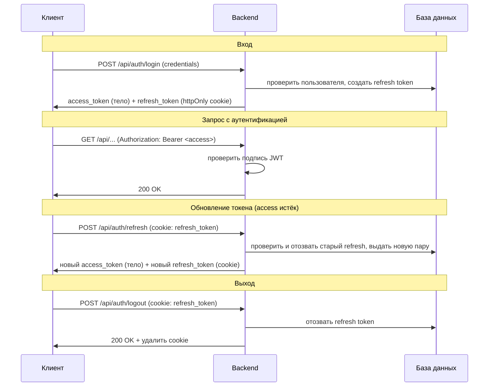
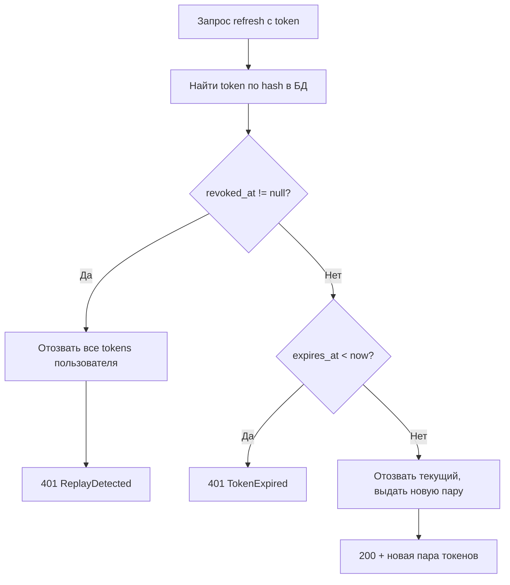
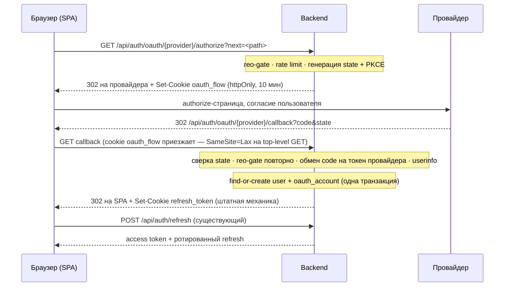
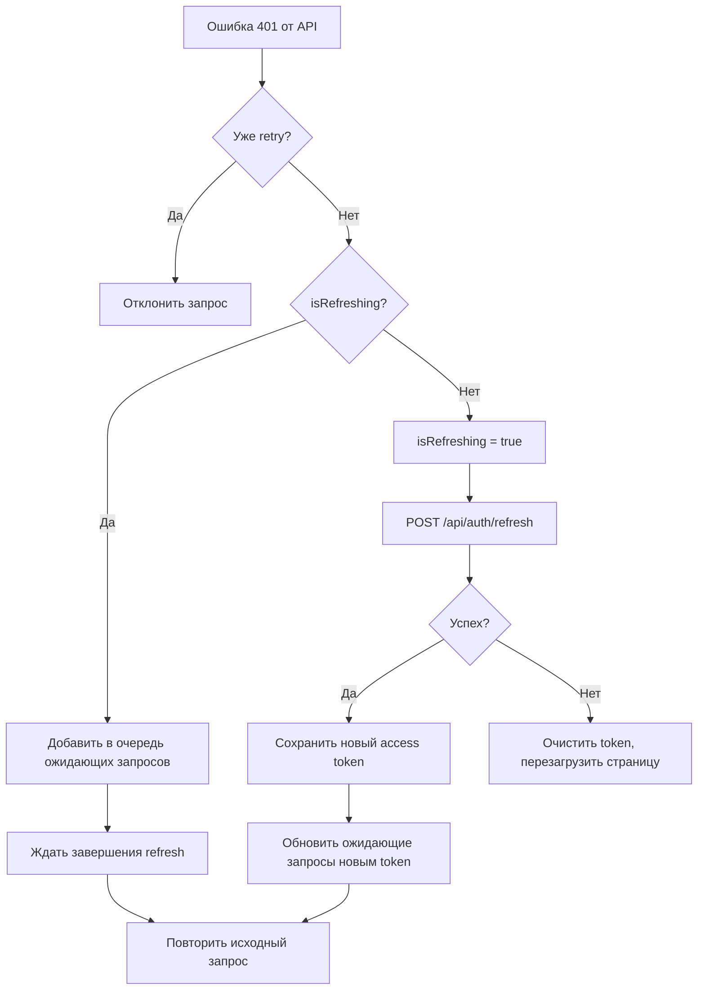

# Аутентификация и управление сессией

Система защищает доступ к API и инструментам на основе JWT access token (краткосрочный, без обращения к БД) и refresh token (долгосрочный, один раз переиспользуется, хранится в БД). Реализована кросс-сервисно: backend отвечает за выдачу и валидацию, frontend — за хранение и обновление. Обоснование архитектуры и выбора технологий — [ADR-011](adr/ADR-011-auth-architecture.md).

Вход возможен паролем либо через внешнего провайдера (§ OAuth-вход ниже) — оба пути завершаются одинаковой выдачей access/refresh. Обоснование identity-модели OAuth — [ADR-033](adr/ADR-033-oauth-identity-model.md).

## Auth Scheme Overview

Гибридная схема: access token (JWT, без состояния) + refresh token (opaque, хранится в БД).

Access token верифицируется по подписи без обращения к БД. Refresh token позволяет мгновенно отозвать все сессии при компрометации. Максимальное окно уязвимости при краже access token равно его lifetime; по истечении требуется refresh, который можно отозвать.

| Token | Хранилище | Lifetime | XSS | CSRF |
|-------|---------|----------|-----|------|
| Access | localStorage | 30 мин | Уязвим, но краткосрочный | Защищён (не отправляется автоматически) |
| Refresh | httpOnly cookie | 30 дней | Защищён (JS не имеет доступа) | Ограничен: SameSite=Lax + Path=/api/auth |

Access token передаётся через заголовок `Authorization: Bearer` — единообразно для браузерного приложения, CLI, любого клиента. Refresh token отправляется автоматически через cookie только при обращении к эндпоинтам `/api/auth/*`.

## Жизненный цикл токена

## Ротация и обнаружение повторного использования refresh token

Refresh tokens одноразовые и ротируются при каждом использовании:

1. Старый token помечается как revoked (устанавливается `revoked_at`)
2. Выдаётся новая пара access + refresh token
3. Raw token не хранится в БД — в БД хранится SHA256 hash

**Обнаружение replay-атак:** повторное использование уже revoked token триггерит принудительный logout для всех сессий пользователя — признак компрометации.

Окно обнаружения: если refresh token был украден и использован атакующим, первый использовавший получает новую пару, а второй (злоумышленник) получает 401 и триггерит блокировку всех сессий пользователя.

## Хеширование паролей

Используется Argon2id (реализация argon2-cffi) — одновременно memory-hard и CPU-hard, рекомендуется OWASP и RFC 9106.

| Параметр | Значение |
|----------|----------|
| Алгоритм | Argon2id |
| memory_cost | 65536 (64 МиБ) |
| time_cost | 3 |
| parallelism | 4 |
| Целевое время | ~50 мс |

OAuth-пользователь пароля не имеет: `password_hash` для такого аккаунта — `NULL` (не sentinel-значение). Парольный вход при `password_hash IS NULL` отклоняется тем же 401 `InvalidCredentialsError`, что и неверный пароль — способ входа аккаунта (пароль vs OAuth-провайдер) наружу не раскрывается. Обоснование модели — [ADR-033](adr/ADR-033-oauth-identity-model.md).

## Ограничение частоты запросов

Используется in-memory sliding window rate limiter. При превышении лимита возвращается HTTP 429 с заголовком `Retry-After`.

| Эндпоинт | Лимит | Окно | Ключ |
|----------|-------|--------|-----|
| `/api/auth/register` | 3 | 1 час | IP |
| `/api/auth/login` | 5 | 1 мин | username + IP |
| `/api/auth/refresh` | 10 | 1 мин | IP |
| `/api/auth/oauth/{provider}/authorize` | 10 | 1 мин | IP |
| `/api/auth/oauth/{provider}/callback` | 10 | 1 мин | IP |

Составной ключ для login (username + IP) предотвращает как brute force на один аккаунт, так и credential stuffing с одного IP. `authorize`/`callback` держат раздельные бюджеты (ключи `oauth_authorize:{ip}` / `oauth_callback:{ip}`) — исчерпание одного не блокирует другой.

Клиентский IP для всех трёх лимитов резолвится единственной функцией `app.infra.client_ip.get_client_ip` — источник (`socket` / `x-real-ip` / `x-forwarded-for`) задаёт `CLIENT_IP_SOURCE`, не код на месте вызова. Наивное чтение `X-Forwarded-For`/`X-Real-IP` в auth-роутах запрещено — подробности режимов и grep-абельное правило: [conventions.md](conventions.md#logging-conventions), эксплуатационный контекст — [setup/production.md](setup/production.md).

## Конфигурация cookie

Атрибуты refresh token cookie:

| Атрибут | Значение | Назначение |
|---------|----------|------------|
| httpOnly | true | JavaScript не имеет доступа (защита от XSS) |
| secure | configurable | HTTPS-only в production |
| samesite | lax | Блокирует передачу cookie при cross-origin POST |
| path | /api/auth | Cookie отправляется только на эндпоинты `/api/auth/*` |
| max_age | 30 дней (в сек) | Совпадает с lifetime refresh token |

CORS: `allow_credentials: true` требуется для отправки httpOnly cookie при cross-origin запросах (фронтенд на другом порту в режиме dev).

### Cookie `oauth_flow`

Между `/authorize` и `/callback` backend хранит `state` и PKCE `code_verifier` того браузера, который начал OAuth-флоу — без БД-таблицы и server-side session:

| Атрибут | Значение | Назначение |
|---------|----------|------------|
| httpOnly | true | JavaScript не имеет доступа |
| secure | configurable (`SECURE_COOKIES`) | HTTPS-only в production |
| samesite | lax | Пропускает cookie на top-level GET-редиректе от провайдера (ровно кейс, под который Lax спроектирован) |
| path | `/api/auth/oauth` | Только oauth-эндпоинты |
| max_age | 600 сек (10 мин) | Окно одного флоу |

Значение — JWT (HS256, тем же `JWT_SECRET`), claims `{state, verifier, provider, next, exp}`; подпись исключает подделку содержимого клиентом. Cookie гасится на каждом терминальном исходе callback'а (успех, гео-отказ, `access_denied`, ошибка обмена, `flow_expired`), кроме случая «cookie отсутствует» — гасить нечего. Инвариант host'а: authorize, callback и SPA-origin одного флоу обязаны жить на одном host (обе cookie — `oauth_flow`, `refresh_token` — host-scoped).

## OAuth-вход

Вход через внешних провайдеров — Яндекс ID, Google, GitHub — без завода отдельного пароля. Идентичность пользователя = `(provider, provider_account_id)`; первый вход через провайдера создаёт `User` (без пароля) и связку `oauth_accounts` одной транзакцией (find-or-create), различия login/register для OAuth-пользователя не существует. Коллизия имени пользователя разрешается суффиксом; повторный вход по той же связке обновляет закешированный `email`. Модель данных и её обоснование — [ADR-033](adr/ADR-033-oauth-identity-model.md).

Доступность провайдеров зависит от страны IP клиента (гео-gate ниже) — юридическое требование ч. 10 ст. 8 149-ФЗ (с 07.07.2026): пользователям из РФ доступны только российские провайдеры (в составе — Яндекс ID) и пароль; остальным — все активные провайдеры.

Access token никогда не проходит через redirect-URL (грязный канал): callback ставит только штатную httpOnly refresh-cookie и редиректит на SPA; SPA получает access существующим `POST /api/auth/refresh`. Ротация одноразового refresh срабатывает штатно — выданный в callback токен гасится первым же refresh.

### Провайдер-слой

Собственная тонкая абстракция на httpx (без authlib): `OAuthProvider` (`typing.Protocol`) с методами `authorize_url` / `exchange_code` / `fetch_profile`, реализации — по одной на провайдера. Реестр активных провайдеров собирается в lifespan из `Settings` и живёт в `app.state`: провайдер активен ⇔ обе его credential-переменные заданы (dev-окружение может гонять один Яндекс). Отказ провайдера (5xx, таймаут, невалидный ответ) — доменное исключение, гасится до HTTP-барьера и уводит callback в код `provider_unavailable`.

### Гео-gate

`app/infra/geoip.py` резолвит страну IP по MMDB-базе (IPinfo Lite; лицензия — CC BY-SA 4.0, атрибуция в README проекта), reader открывается в lifespan → `app.state`, IP — строго через `app.infra.client_ip.get_client_ip`. **Fail-closed**: любая деградация (несконфигурированная/недоступная/битая база, lookup-промах, нераспарсиваемый IP) резолвится в `GEOIP_FALLBACK_COUNTRY` (default `RU`) — не в «без ограничений». Деградация в сторону РФ юридически безопасна (иностранец видит только Яндекс + пароль) и не блокирует вход; обратный fail-open открыл бы Google/GitHub для РФ.

Enforcement — в трёх точках: `GET /api/auth/providers` (состав = `{yandex} ∩ активные` для RU, иначе все активные), `authorize` (запрещённый для страны провайдер отклоняется до генерации state и до `Set-Cookie`) и `callback` (повторная проверка обязательна — смена IP между шагами и прямое обращение к callback мимо UI).

### Реестр кодов ошибок `/login?error=`

Закрытый контракт стыка backend↔frontend — редирект на `/login?error=<код>` не расширяется произвольным текстом провайдера:

| Код | Когда |
|-----|-------|
| `access_denied` | Пользователь отказал на экране провайдера |
| `flow_expired` | Cookie `oauth_flow` отсутствует, протухла или `state` не совпал (включая повторный заход на callback и параллельные вкладки) |
| `provider_not_available_in_region` | Гео-запрет провайдера |
| `provider_unavailable` | 5xx/таймаут/невалидный ответ провайдера, включая мисконфиг клиента (`invalid_client`, `redirect_uri_mismatch`) |
| `oauth_failed` | Прочее (в т.ч. неожиданный сбой find-or-create) |

## Поверхность атаки OAuth

`GET /api/auth/oauth/{provider}/callback` — inbound-эндпоинт, принимающий внешний redirect с параметрами, которые контролирует третья сторона (провайдер либо атакующий, подделывающий переход). Митигации:

- **CSRF на callback** — `state` из query сверяется с подписанным claim'ом в httpOnly `oauth_flow`; несовпадение или отсутствие cookie уводит в `flow_expired`, не в обработку запроса.
- **Открытый редирект через `next`** — денилист (относительный путь, не начинающийся с `//`) валидируется до записи в подписанный claim; Starlette `RedirectResponse` дополнительно квотирует URL на выдаче.
- **Утечка токена через грязный канал** — access token не покидает redirect-URL ни на одном шаге (см. § OAuth-вход); успешный callback ставит только httpOnly refresh-cookie.
- **Гео-обход** — enforcement дублирован на `authorize` и на `callback` (не только на первом шаге), закрывая смену IP между шагами и прямые обращения к callback мимо UI.
- **Pre-account-takeover через email** — авто-линковка OAuth-аккаунта к существующему пользователю по email запрещена архитектурно (`users.email` не вводится, связка identity — только `(provider, provider_account_id)`); обоснование — [ADR-033](adr/ADR-033-oauth-identity-model.md).
- **Мисконфиг провайдера не проходит незамеченным** — коды ошибок провайдера, отличные от штатного `access_denied` (отозванный secret, `invalid_client` и т.п.), логируются `logger.warning` перед редиректом на `provider_unavailable`, а не тихо сводятся к «пользователь передумал».
- **Rate limiting** — `authorize`/`callback` разделяют бюджет с остальными auth-эндпоинтами по тому же механизму (§ Ограничение частоты запросов).

## Поток аутентификации на frontend

### Axios interceptor

Request interceptor добавляет заголовок `Authorization: Bearer` с access token из localStorage (ключ `learnflow-access-token`).

Response interceptor перехватывает 401-ошибки и инициирует обновление токена. Исключение из refresh-flow — не по префиксу пути, а семантическое: эндпоинты, не требующие access token (`CREDENTIAL_ENDPOINTS` в `shared/api/client.ts` — `/auth/refresh`, `/auth/login`, `/auth/register`), 401 от них не значит «сессия истекла» и в refresh не идёт; `/auth/refresh` остаётся в списке отдельно — иначе refresh рекурсировал бы сам в себя. `/auth/me` и `/auth/logout` вызываются от имени уже аутентифицированного пользователя и проходят стандартный single-flight refresh + retry наравне с остальными запросами. Правило переформулировано с префиксного на семантическое из-за бага «сайдбар без user-футера на холодной сессии»: старое условие `!url.includes("/auth/")` случайно накрывало и `GET /auth/me`, поэтому 401 от нативно протухшего токена не ретраился, `user` оставался `undefined`, и футер сайдбара не рендерился до ручного reload. Классификация для будущих OAuth-эндпоинтов (feat-008) — тот же принцип: анонимные start/callback-эндпоинты, достижимые до выдачи токена, идут в исключения; эндпоинты, вызываемые с токеном, — под refresh-retry (комментарий с правилом — `client.ts:53-67`, рядом с константой).

**Защита от "thundering herd":** флаг `isRefreshing` гарантирует ровно один запрос refresh при нескольких параллельных 401. Остальные запросы встают в очередь и выполняются после получения нового токена.

### Вход: страница `/login`, guard `RequireAuth`, бутстрап

Вход — публичная страница `/login` (не блокирующая модалка): режимы вход/регистрация одной формы плюс блок кнопок провайдеров по составу `GET /api/auth/providers`. Кнопка провайдера — полный переход страницы (`window.location.assign`, не fetch — флоу редиректный), не axios-запрос, интерцептора не касается.

Неаутентифицированный пользователь на защищённом маршруте перенаправляется на `/login` guard-компонентом `RequireAuth` (на layout-маршруте, оборачивающем всё приложение кроме `/login`), с сохранением исходного пути (`from`) для возврата после входа. Вердикт `RequireAuth` — нереактивное синхронное чтение access token из localStorage, как раньше делал удалённый `AuthGate`.

**Бутстрап аутентификации** — однократный app-уровневый hook, выполняется до монтирования любых маршрутов (гейтит рендер `AppRoutes`, не отдельная redirect-логика): есть access в localStorage → готово; иначе — один тихий `POST /api/auth/refresh` напрямую через `fetch`, **мимо `apiClient`** (интерцептор `client.ts` безусловно пишет `logger.error` на 401, а 401 здесь — ожидаемый путь анонима, не ошибка). Этот же вызов подхватывает refresh-cookie, только что поставленную OAuth-callback'ом при возврате из внешнего флоу — отдельного callback-маршрута SPA не заводится, обработка одна для прямого захода и для возврата из OAuth.

## Управление токеном при SSE

SSE-соединения используют raw `fetch()` (не axios) для работы с потоком — axios interceptor не действует. Поэтому refresh инициируется явно:

**Упреждающий refresh:** перед инициацией SSE вызывается `ensureFreshToken()`:
1. Декодирует JWT payload (клиент, без проверки подписи)
2. Если до истечения ≥ 30 сек — возвращает текущий token
3. Если до истечения < 30 сек — выполняет refresh и возвращает новый token

**Резервный вариант:** если во время потока приходит 401 — повторный вызов `ensureFreshToken()` и переподключение.

Порог 30 сек выбран с запасом: SSE-соединение может длиться минуты, а refresh во время передачи разрывает поток.

## API endpoints

| Метод | Путь | Назначение | Rate limit | Auth |
|--------|------|-----------|------------|------|
| POST | `/api/auth/register` | Регистрация | 3/час/IP | — |
| POST | `/api/auth/login` | Аутентификация | 5/мин/user+IP | — |
| POST | `/api/auth/refresh` | Обновление токенов | 10/мин/IP | cookie |
| GET | `/api/auth/me` | Информация о пользователе | — | Bearer |
| POST | `/api/auth/logout` | Завершение сессии | — | cookie |
| GET | `/api/auth/providers` | Доступные способы входа по гео IP: `{providers: string[], password: bool}` | — | — |
| GET | `/api/auth/oauth/{provider}/authorize` | Инициирует OAuth-флоу: гео-gate → state/PKCE → 302 на провайдера + cookie `oauth_flow` | 10/мин/IP | — |
| GET | `/api/auth/oauth/{provider}/callback` | Завершает флоу: обмен кода → find-or-create → 302 на SPA либо `/login?error=<код>` | 10/мин/IP | cookie `oauth_flow` |

Все эндпоинты возвращают стандартные HTTP-коды: 200 (успех), 401 (не авторизован), 404 (`{provider}` неизвестен/выключен), 409 (username уже зарегистрирован), 422 (ошибка валидации), 429 (превышен rate limit).

## Конфигурация

| Переменная | Обязательна | Default | Назначение |
|-----------|-------------|---------|------------|
| `JWT_SECRET` | Да | — | Ключ подписи HS256. Компрометация позволяет подделать любой токен |
| `ACCESS_TOKEN_EXPIRE_MINUTES` | Нет | 30 | Lifetime access token в минутах |
| `REFRESH_TOKEN_EXPIRE_DAYS` | Нет | 30 | Lifetime refresh token в днях |
| `SECURE_COOKIES` | Нет | true | Флаг Secure для cookie (false при локальной разработке без HTTPS) |
| `OAUTH_YANDEX_CLIENT_ID` / `OAUTH_YANDEX_CLIENT_SECRET` | Нет | `""` | Пара Яндекс OAuth; пусто — провайдер выключен |
| `OAUTH_GOOGLE_CLIENT_ID` / `OAUTH_GOOGLE_CLIENT_SECRET` | Нет | `""` | Пара Google OAuth |
| `OAUTH_GITHUB_CLIENT_ID` / `OAUTH_GITHUB_CLIENT_SECRET` | Нет | `""` | Пара GitHub OAuth |
| `OAUTH_REDIRECT_BASE_URL` | Нет | `http://localhost:5173` | База для `redirect_uri` провайдеров (`docker-compose.yml` переопределяет на `http://localhost:8000` — разные топологически верные host для local dev и docker) |
| `OAUTH_HTTP_TIMEOUT_SECONDS` | Нет | 10 | Таймаут httpx-запросов к провайдерам |
| `GEOIP_DB_PATH` | Нет | `""` | Путь к MMDB-базе (IPinfo Lite); пусто — все lookup'ы уходят в fallback-страну |
| `GEOIP_FALLBACK_COUNTRY` | Нет | `RU` | Страна при недоступной/несконфигурированной базе или lookup-промахе (fail-closed) |
