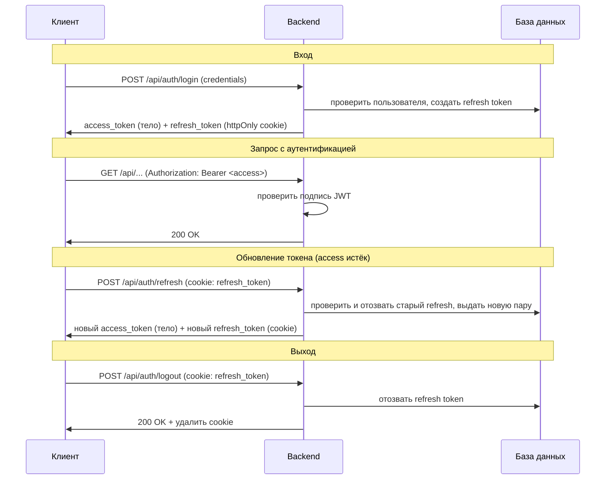
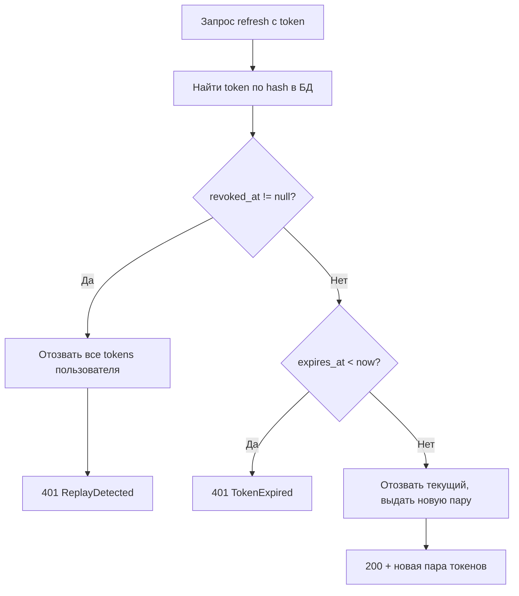
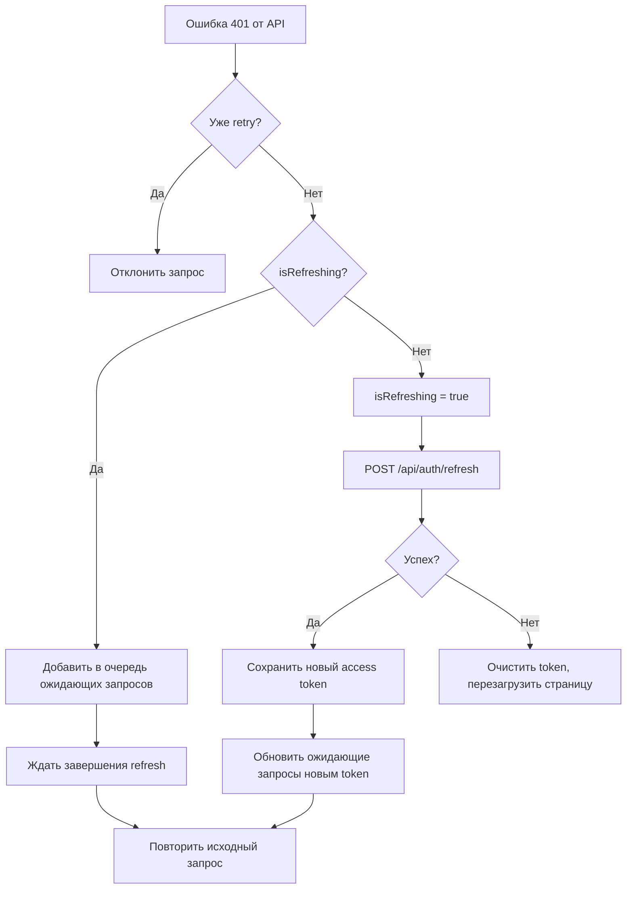

# Аутентификация и управление сессией

Система защищает доступ к API и инструментам на основе JWT access token (краткосрочный, без обращения к БД) и refresh token (долгосрочный, один раз переиспользуется, хранится в БД). Реализована кросс-сервисно: backend отвечает за выдачу и валидацию, frontend — за хранение и обновление. Обоснование архитектуры и выбора технологий — [ADR-011](adr/ADR-011-auth-architecture.md).

## Auth Scheme Overview

Гибридная схема: access token (JWT, без состояния) + refresh token (opaque, хранится в БД).

Access token верифицируется по подписи без обращения к БД. Refresh token позволяет мгновенно отозвать все сессии при компрометации. Максимальное окно уязвимости при краже access token равно его lifetime; по истечении требуется refresh, который можно отозвать.

| Token | Хранилище | Lifetime | XSS | CSRF |
|-------|---------|----------|-----|------|
| Access | localStorage | 30 мин | Уязвим, но краткосрочный | Защищён (не отправляется автоматически) |
| Refresh | httpOnly cookie | 30 дней | Защищён (JS не имеет доступа) | Ограничен: SameSite=Lax + Path=/api/auth |

Access token передаётся через заголовок `Authorization: Bearer` — единообразно для браузерного приложения, CLI, любого клиента. Refresh token отправляется автоматически через cookie только при обращении к эндпоинтам `/api/auth/*`.

## Жизненный цикл токена

## Ротация и обнаружение повторного использования refresh token

Refresh tokens одноразовые и ротируются при каждом использовании:

1. Старый token помечается как revoked (устанавливается `revoked_at`)
2. Выдаётся новая пара access + refresh token
3. Raw token не хранится в БД — в БД хранится SHA256 hash

**Обнаружение replay-атак:** повторное использование уже revoked token триггерит принудительный logout для всех сессий пользователя — признак компрометации.

Окно обнаружения: если refresh token был украден и использован атакующим, первый использовавший получает новую пару, а второй (злоумышленник) получает 401 и триггерит блокировку всех сессий пользователя.

## Хеширование паролей

Используется Argon2id (реализация argon2-cffi) — одновременно memory-hard и CPU-hard, рекомендуется OWASP и RFC 9106.

| Параметр | Значение |
|----------|----------|
| Алгоритм | Argon2id |
| memory_cost | 65536 (64 МиБ) |
| time_cost | 3 |
| parallelism | 4 |
| Целевое время | ~50 мс |

## Ограничение частоты запросов

Используется in-memory sliding window rate limiter. При превышении лимита возвращается HTTP 429 с заголовком `Retry-After`.

| Эндпоинт | Лимит | Окно | Ключ |
|----------|-------|--------|-----|
| `/api/auth/register` | 3 | 1 час | IP |
| `/api/auth/login` | 5 | 1 мин | username + IP |
| `/api/auth/refresh` | 10 | 1 мин | IP |

Составной ключ для login (username + IP) предотвращает как brute force на один аккаунт, так и credential stuffing с одного IP.

Клиентский IP для всех трёх лимитов резолвится единственной функцией `app.infra.client_ip.get_client_ip` — источник (`socket` / `x-real-ip` / `x-forwarded-for`) задаёт `CLIENT_IP_SOURCE`, не код на месте вызова. Наивное чтение `X-Forwarded-For`/`X-Real-IP` в auth-роутах запрещено — подробности режимов и grep-абельное правило: [conventions.md](conventions.md#logging-conventions), эксплуатационный контекст — [setup/production.md](setup/production.md).

## Конфигурация cookie

Атрибуты refresh token cookie:

| Атрибут | Значение | Назначение |
|---------|----------|------------|
| httpOnly | true | JavaScript не имеет доступа (защита от XSS) |
| secure | configurable | HTTPS-only в production |
| samesite | lax | Блокирует передачу cookie при cross-origin POST |
| path | /api/auth | Cookie отправляется только на эндпоинты `/api/auth/*` |
| max_age | 30 дней (в сек) | Совпадает с lifetime refresh token |

CORS: `allow_credentials: true` требуется для отправки httpOnly cookie при cross-origin запросах (фронтенд на другом порту в режиме dev).

## Поток аутентификации на frontend

### Axios interceptor

Request interceptor добавляет заголовок `Authorization: Bearer` с access token из localStorage (ключ `learnflow-access-token`).

Response interceptor перехватывает ошибки 401 (кроме запросов к `/auth/*`) и инициирует обновление токена:

**Защита от "thundering herd":** флаг `isRefreshing` гарантирует ровно один запрос refresh при нескольких параллельных 401. Остальные запросы встают в очередь и выполняются после получения нового токена.

### AuthGate

Компонент-страж оборачивает приложение и разрешает доступ только с действительным access token. При отсутствии токена показывает блокирующее модальное окно входа/регистрации (невозможно закрыть).

## Управление токеном при SSE

SSE-соединения используют raw `fetch()` (не axios) для работы с потоком — axios interceptor не действует. Поэтому refresh инициируется явно:

**Упреждающий refresh:** перед инициацией SSE вызывается `ensureFreshToken()`:
1. Декодирует JWT payload (клиент, без проверки подписи)
2. Если до истечения ≥ 30 сек — возвращает текущий token
3. Если до истечения < 30 сек — выполняет refresh и возвращает новый token

**Резервный вариант:** если во время потока приходит 401 — повторный вызов `ensureFreshToken()` и переподключение.

Порог 30 сек выбран с запасом: SSE-соединение может длиться минуты, а refresh во время передачи разрывает поток.

## API endpoints

| Метод | Путь | Назначение | Rate limit | Auth |
|--------|------|-----------|------------|------|
| POST | `/api/auth/register` | Регистрация | 3/час/IP | — |
| POST | `/api/auth/login` | Аутентификация | 5/мин/user+IP | — |
| POST | `/api/auth/refresh` | Обновление токенов | 10/мин/IP | cookie |
| GET | `/api/auth/me` | Информация о пользователе | — | Bearer |
| POST | `/api/auth/logout` | Завершение сессии | — | cookie |

Все эндпоинты возвращают стандартные HTTP-коды: 200 (успех), 401 (не авторизован), 409 (username уже зарегистрирован), 422 (ошибка валидации), 429 (превышен rate limit).

## Конфигурация

| Переменная | Обязательна | Default | Назначение |
|-----------|-------------|---------|------------|
| `JWT_SECRET` | Да | — | Ключ подписи HS256. Компрометация позволяет подделать любой токен |
| `ACCESS_TOKEN_EXPIRE_MINUTES` | Нет | 30 | Lifetime access token в минутах |
| `REFRESH_TOKEN_EXPIRE_DAYS` | Нет | 30 | Lifetime refresh token в днях |
| `SECURE_COOKIES` | Нет | true | Флаг Secure для cookie (false при локальной разработке без HTTPS) |
