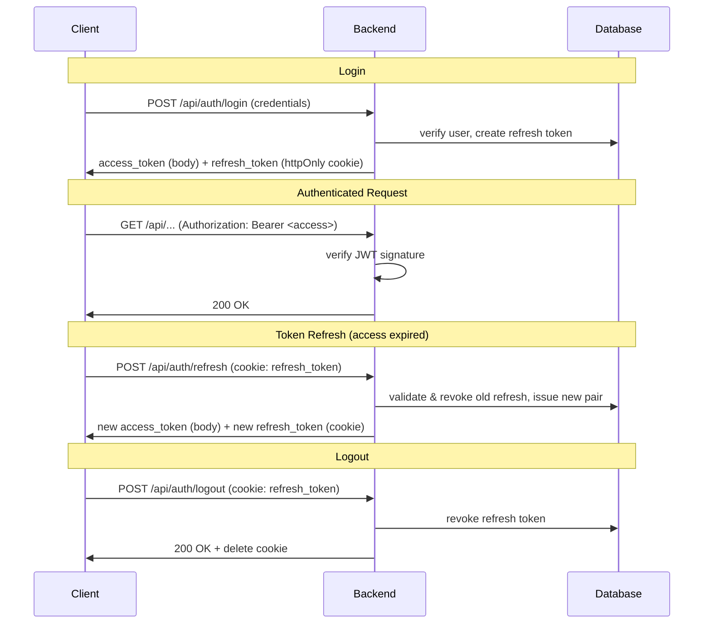
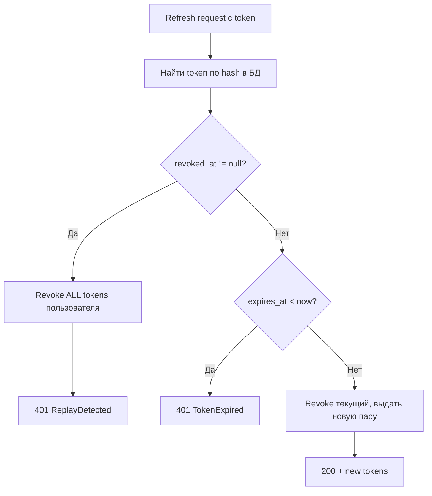
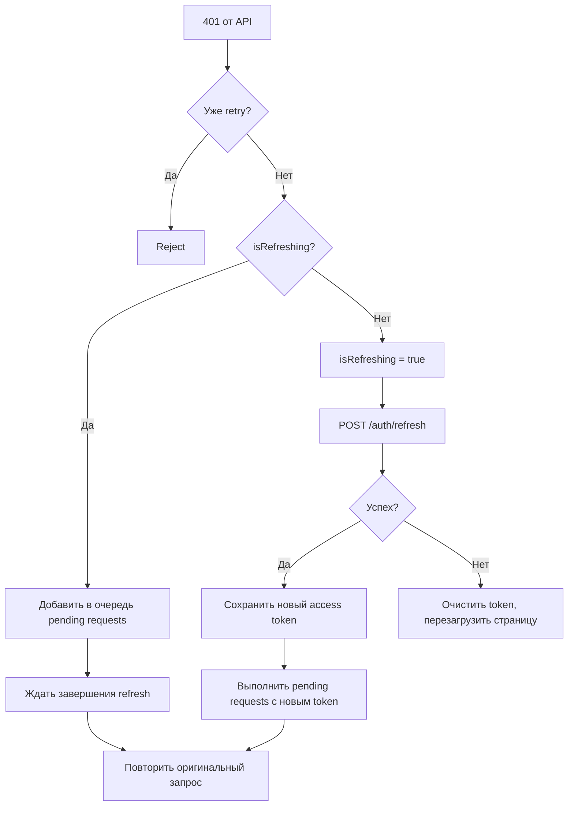

# Authentication

Кросс-сервисный концепт: backend (выдача/валидация токенов, хранение сессий) + frontend (хранение, обновление, передача токенов). Обоснование выбора схемы и технологий — [ADR-011](adr/ADR-011-auth-architecture.md).

## Auth Scheme Overview

Гибридная схема: stateless access token (JWT) + stateful refresh token (opaque, хранится в БД).

Access token не требует обращения к БД — сервер верифицирует подпись. Refresh token даёт возможность мгновенного отзыва. Максимальное окно уязвимости при компрометации access token = его lifetime, после чего требуется refresh, который можно отозвать.

| Token | Storage | Lifetime | XSS | CSRF |
|-------|---------|----------|-----|------|
| Access | localStorage | 30 min | Уязвим, но short-lived | Иммунен (не отправляется автоматически) |
| Refresh | httpOnly cookie | 30 days | Защищён (JS не имеет доступа) | Mitigated: SameSite=Lax + Path=/api/auth |

Access token передаётся через `Authorization: Bearer` header — единообразно для SPA, CLI, любого клиента. Refresh token отправляется автоматически через cookie только на auth-эндпоинты.

## Token Lifecycle

## Refresh Token Rotation & Replay Detection

Refresh tokens — одноразовые. При каждом использовании:

1. Старый token помечается как revoked (`revoked_at` timestamp)
2. Выдаётся новая пара access + refresh
3. Raw token не хранится в БД — хранится SHA256 hash

**Replay detection:** повторное использование уже revoked token — сигнал компрометации.

Окно обнаружения: если атакующий и реальный пользователь оба имеют один refresh token, первый использовавший получает новую пару, второй триггерит alarm и force re-login для всех сессий.

## Password Hashing

Argon2id (argon2-cffi) — memory-hard + CPU-hard, рекомендация OWASP, RFC 9106.

| Параметр | Значение |
|----------|----------|
| Algorithm | Argon2id |
| memory_cost | 65536 (64 MiB) |
| time_cost | 3 |
| parallelism | 4 |
| Target time | ~50ms |

## Rate Limiting

In-memory sliding window rate limiter. При превышении — HTTP 429 с заголовком `Retry-After`.

| Endpoint | Limit | Window | Key |
|----------|-------|--------|-----|
| `/auth/register` | 3 | 1 hour | IP |
| `/auth/login` | 5 | 1 min | username + IP |
| `/auth/refresh` | 10 | 1 min | IP |

Составной ключ для login (username + IP) предотвращает как brute force на один аккаунт, так и credential stuffing с одного IP.

## Cookie Configuration

Атрибуты refresh token cookie:

| Атрибут | Значение | Назначение |
|---------|----------|------------|
| httpOnly | true | JS не имеет доступа |
| secure | configurable | HTTPS-only в production |
| samesite | lax | Блокирует cross-origin POST |
| path | /api/auth | Cookie отправляется только на auth-эндпоинты |
| max_age | 30 days (сек) | Совпадает с lifetime refresh token |

CORS: `allow_credentials: true` — необходим для отправки httpOnly cookie в cross-origin запросах (frontend на другом порту в dev-режиме).

## Frontend Auth Flow

### Axios Interceptor

Request interceptor добавляет `Authorization: Bearer` header из localStorage (`learnflow-access-token`).

Response interceptor перехватывает 401 (кроме запросов к `/auth/*`):

**Thundering herd protection:** флаг `isRefreshing` гарантирует один refresh-запрос при нескольких параллельных 401. Остальные запросы встают в очередь и выполняются после получения нового токена.

### AuthGate

Компонент-guard: оборачивает всё приложение, рендерит children только при наличии access token. Без токена — блокирующая модалка login/register (не dismissible).

## SSE Token Management

SSE-соединения используют raw `fetch()` (не axios) для работы с `ReadableStream` — axios interceptor не действует.

**Проактивный refresh:** перед инициацией SSE вызывается `ensureFreshToken()`:
1. Декодирует JWT payload (client-side, без верификации подписи)
2. Если до expiry >= 30 секунд — возвращает текущий token
3. Если до expiry < 30 секунд — выполняет refresh, возвращает новый token

**Reactive fallback:** если во время стрима приходит 401 — повторный вызов `ensureFreshToken()` и retry соединения.

Порог 30 секунд выбран с запасом: SSE-соединение может длиться минуты, refresh во время стрима невозможен без разрыва.

## API Endpoints

| Method | Path | Назначение | Rate Limit | Auth |
|--------|------|-----------|------------|------|
| POST | `/api/auth/register` | Регистрация | 3/hour/IP | — |
| POST | `/api/auth/login` | Аутентификация | 5/min/user+IP | — |
| POST | `/api/auth/refresh` | Обновление токенов | 10/min/IP | cookie |
| GET | `/api/auth/me` | Текущий пользователь | — | Bearer |
| POST | `/api/auth/logout` | Завершение сессии | — | cookie |

Все эндпоинты возвращают стандартные HTTP-коды: 200 (успех), 401 (не авторизован), 409 (username занят), 422 (валидация), 429 (rate limit).

## Configuration

| Переменная | Обязательна | Default | Назначение |
|-----------|-------------|---------|------------|
| `JWT_SECRET` | Да | — | Ключ подписи HS256. Компрометация = forge любого токена |
| `ACCESS_TOKEN_EXPIRE_MINUTES` | Нет | 30 | Lifetime access token |
| `REFRESH_TOKEN_EXPIRE_DAYS` | Нет | 30 | Lifetime refresh token |
| `SECURE_COOKIES` | Нет | true | Флаг Secure на cookie (false для local dev без HTTPS) |
