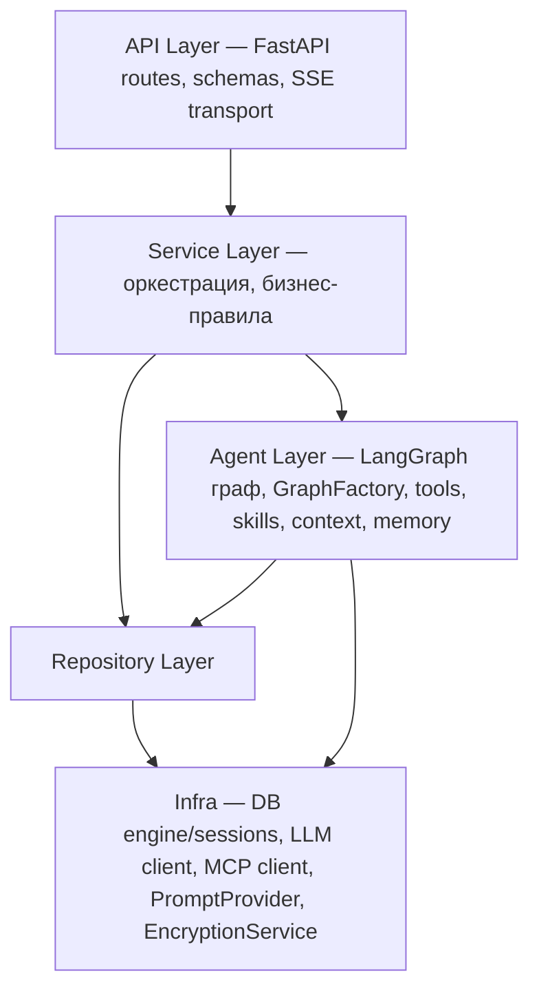

# Backend

Архитектура верхнего уровня и стек — в [vision.md](../vision.md). Здесь — детальное описание бэкенда: слоистая архитектура, API, Agent Runtime, Persistence.

## Layered Architecture

### Слои



- **API Layer** — HTTP/SSE-интерфейс, Pydantic-валидация, маршрутизация. Не содержит бизнес-логики.
- **Service Layer** — CRUD-сервисы (ProjectService, ArtifactService, UserMemoryService, MCPServerService) + thin ChatService для chat-операций. ChatService оркестрирует взаимодействие с AgentRunner (маппинг chat_id → thread_id, model resolution, обновление thread_views, формирование config). ModelConfigResolver — каскадное разрешение модели per-request.
- **Agent Layer** — LangGraph-граф, GraphFactory (per-request build+compile), tools, skills, context engineering, memory, security (input guard, prompt hardening, canary check — [architecture.md](../security/architecture.md)). LangGraph-связанность сдержана внутри этого слоя: наружу выходят только доменные типы, не LangGraph-специфичные.
- **Repository Layer** — SQLAlchemy, доступ к app-managed таблицам.
- **Infra** — не слой с правилами вызовов, а утилитарный пакет с сконфигурированными клиентами внешних сервисов.

### Правила вызовов

| Вызов | Разрешён |
|-------|----------|
| API → Service | ✅ всегда (включая chat через ChatService) |
| Service → Repository | ✅ |
| Service → Agent Layer | ✅ (ChatService → AgentRunner) |
| Agent tools → Repository | ✅ прямой доступ |
| Agent → LangGraph Store / Checkpointer | ✅ нативно |
| Repository / Agent → Infra | ✅ клиенты |
| Repository → Service | ❌ |
| API → Repository | ❌ |
| API → Agent Layer | ❌ (только через Service) |

## API Layer

### Auth

JWT + Refresh Token. Access token (short-lived, localStorage) для API-запросов, refresh token (long-lived, httpOnly cookie) для обновления. Подробнее: [auth.md](auth.md), обоснование — [ADR-011](adr/ADR-011-auth-architecture.md).

### Endpoints

Все API-эндпоинты доступны под префиксом `/api` (например, `/api/projects`). Пути в таблицах ниже — относительно этого префикса. Health check (`GET /health`) — на root level, без префикса.

#### Projects

| Метод | Путь | Назначение |
|-------|------|-----------|
| POST | `/projects` | Создать проект |
| GET | `/projects` | Список проектов пользователя |
| GET | `/projects/{id}` | Получить проект |
| PUT | `/projects/{id}` | Обновить (название и т.д.) |
| DELETE | `/projects/{id}` | Удалить проект |

#### Chats

| Метод | Путь | Назначение |
|-------|------|-----------|
| POST | `/projects/{id}/chats` | Создать чат в проекте |
| GET | `/projects/{id}/chats` | Список чатов проекта |
| GET | `/projects/{id}/chats/{cid}` | История чата (сообщения) |
| GET | `/chats/recent?limit=10` | Недавние чаты пользователя (across projects, для sidebar) |

#### Messages (ядро)

| Метод | Путь | Назначение |
|-------|------|-----------|
| POST | `/projects/{id}/chats/{cid}/messages` | Отправить сообщение → SSE stream с ответом агента |
| POST | `/projects/{id}/chats/{cid}/cancel` | Отменить генерацию |

Стриминг через SSE (Server-Sent Events) — индустриальный стандарт для LLM-проектов. LangGraph нативно поддерживает SSE через `stream_events`.

#### Knowledge Sphere

| Метод | Путь | Назначение |
|-------|------|-----------|
| GET | `/projects/{id}/sphere` | Текущий шар (полный) |
| PUT | `/projects/{id}/sphere` | Перезаписать шар |

Для разработки, отладки и будущего UI. PATCH (частичное обновление секций) — при необходимости.

#### Artifacts

| Метод | Путь | Назначение |
|-------|------|-----------|
| GET | `/projects/{id}/artifacts` | Список артефактов проекта |
| GET | `/projects/{id}/artifacts/{aid}` | Получить артефакт (метаданные + content) |
| GET | `/projects/{id}/artifacts/{aid}/download?format=md\|pdf` | Скачать в формате |

PDF — конвертация из Markdown на бэкенде (pandoc / weasyprint).

#### Models & Settings

| Метод | Путь | Назначение |
|-------|------|-----------|
| GET | `/models` | Список доступных моделей (whitelist из agent.yaml) |
| GET | `/users/me/settings` | Настройки пользователя (model override) |
| PUT | `/users/me/settings` | Обновить настройки пользователя |
| GET | `/projects/{id}/settings` | Настройки проекта |
| PUT | `/projects/{id}/settings` | Обновить настройки проекта |
| GET | `/projects/{id}/chats/{cid}/settings` | Настройки чата |
| PUT | `/projects/{id}/chats/{cid}/settings` | Обновить настройки чата |

Каскад разрешения модели: thread → project → user → Langfuse → agent.yaml. `model_name: null` = inherit.

#### User Memory

| Метод | Путь | Назначение |
|-------|------|-----------|
| GET | `/users/me/instructions` | Пользовательские инструкции |
| PUT | `/users/me/instructions` | Обновить инструкции (max 5000 chars) |
| GET | `/users/me/memories` | Список записей памяти агента |
| DELETE | `/users/me/memories/{key}` | Удалить запись памяти |

Инструкции включаются в system message каждого чата. Записи памяти создаются агентом через `save_user_memory` / `delete_user_memory` tools, удаляются пользователем через UI.

#### MCP Servers

| Метод | Путь | Назначение |
|-------|------|-----------|
| GET | `/users/me/mcp-servers` | Список MCP серверов пользователя |
| POST | `/users/me/mcp-servers` | Добавить MCP сервер |
| PUT | `/users/me/mcp-servers/{sid}` | Обновить |
| DELETE | `/users/me/mcp-servers/{sid}` | Удалить |
| POST | `/users/me/mcp-servers/{sid}/test` | Тест подключения |

Аналогичные эндпоинты для project (`/projects/{id}/mcp-servers/...`) и thread (`/projects/{id}/chats/{cid}/mcp-servers/...`).

Cascade visibility: project/thread list endpoints поддерживают `?include_inherited=true` — возвращает inherited серверы из вышестоящих scope с `is_disabled` флагом. Toggle inherited серверов: `PUT .../mcp-servers/inherited/{sid}/toggle` с `{ disabled: bool }`.

Ограничения: max 5 серверов per scope, transport = http|sse (stdio запрещён), SSRF-защита (private IPs → 400), API key шифруется Fernet, `api_key_hint` хранит маску (первые/последние 4 символа) для отображения.

### Schemas

Pydantic request/response модели. Сквозные соглашения:
- **ID** — UUID для всех app-managed сущностей (включая ThreadView.thread_id). При вызовах LangGraph API — `str(thread_id)`.
- **Списки** — обёртка `{ items: [...] }`, расширяемая пагинацией позже.
- **Ошибки** — дефолт FastAPI (`{ detail: "..." }`, 422 с полями валидации).

#### Projects

```
POST /projects
  Request:  { name: str }
  Response: { id: UUID, name: str, created_at: datetime, updated_at: datetime }

GET /projects
  Response: { items: [{ id, name, created_at, updated_at }] }

GET /projects/{id}
  Response: { id, name, created_at, updated_at }

PUT /projects/{id}
  Request:  { name: str }
  Response: { id, name, created_at, updated_at }

DELETE /projects/{id}
  Response: 204 No Content
```

#### Chats

```
POST /projects/{id}/chats
  Request:  { title?: str }
  Response: { thread_id: UUID, title: str, created_at: datetime, updated_at: datetime }

GET /projects/{id}/chats
  Response: { items: [{ thread_id: UUID, title, created_at, updated_at }] }

GET /projects/{id}/chats/{cid}
  Response: { thread_id: UUID, title, messages: [{ id, role, content, created_at?, artifacts: [{ id, title, type, created_at }] }] }

GET /chats/recent?limit=10
  Response: { items: [{ thread_id: UUID, title, project_id, project_name, updated_at }] }
```

`role`: `"user" | "assistant"`. Messages достаются из checkpointer. Tool-сообщения на фронт не отдаются.

Recents — последние чаты пользователя across all projects, сортировка по `updated_at` desc. Для sidebar.

#### Messages

```
POST /projects/{id}/chats/{cid}/messages
  Request:  { content: str }
  Response: SSE stream (формат — см. SSE Streaming Protocol)

POST /projects/{id}/chats/{cid}/cancel
  Response: { ok: bool }
```

#### Knowledge Sphere

```
GET /projects/{id}/sphere
  Response: { project_id: UUID, content: str, updated_at: datetime }

PUT /projects/{id}/sphere
  Request:  { content: str }
  Response: { project_id, content, updated_at }
```

#### Artifacts

```
GET /projects/{id}/artifacts
  Response: { items: [{ id, title, type, created_at }] }

GET /projects/{id}/artifacts/{aid}
  Response: { id, title, type, content, thread_id?, message_id?, created_at }

GET /projects/{id}/artifacts/{aid}/download?format=md|pdf
  Response: файл (Content-Disposition: attachment)
```

В списке — только метаданные, без content.

### SSE Streaming Protocol

Формат: type-in-data (индустриальный стандарт LLM-стриминга — OpenAI, Anthropic). Event types, lifecycle, cancellation, frontend consumption — [streaming.md](streaming.md).

## Module Structure

Горизонтальная нарезка по слоям. Конкретные файлы внутри пакетов выводятся из сущностей (Persistence), tools (Agent Runtime) и endpoints (API) — здесь не дублируются.

```
app/
├── main.py              # FastAPI app factory, lifespan
├── config.py            # Settings (pydantic-settings)
│
├── api/                 # API Layer
│   ├── routes/          # FastAPI роутеры (по ресурсам)
│   ├── schemas/         # Pydantic request/response модели
│   └── deps.py          # Dependencies: DB session, current user, инъекция сервисов
│
├── services/            # Service Layer
│
├── agent/               # Agent Layer
│   ├── security/        # Input guard, detectors, canary (→ security/architecture.md)
│   └── tools/           # Реализации tools
│
├── repositories/        # Repository Layer
│
├── models/              # SQLAlchemy ORM-модели (app-managed таблицы)
│
└── infra/               # Клиенты внешних сервисов, DB engine/sessions
```

**api/** — HTTP/SSE-интерфейс. Роутеры сгруппированы по ресурсам, каждый вызывает соответствующий сервис. Schemas — Pydantic-контракт с фронтендом. deps.py — FastAPI dependencies для инъекции зависимостей в роутеры.

**services/** — Оркестрация и бизнес-правила. CRUD-сервисы (Project, Artifact, UserMemory, MCPServer) + thin ChatService для chat-операций (маппинг chat_id → thread_id, model resolution, делегирование в AgentRunner, управление ThreadView). ModelConfigResolver — каскадное разрешение модели. Зависимости (repositories, AgentRunner) — через конструктор, wiring в deps.py.

**agent/** — LangGraph-граф, GraphFactory (per-request build+compile), tools, context engineering, промпт. Публичный интерфейс — AgentRunner (stream, get_history, cancel). LangGraph-типы не выходят за пределы этого пакета. tools/ — суб-пакет с внутренней группировкой (KS, artifacts, user memory, skills).

**skills/** — директория в корне репозитория (`skills/`, рядом с `backend/`, `configs/`). Каждый skill — поддиректория с `SKILL.md` (Claude Code compatible формат). Вынесены из backend, чтобы пользователь мог добавлять skills без необходимости лезть в код приложения.

**repositories/** — CRUD-доступ к app-managed таблицам через SQLAlchemy async session. По репозиторию на сущность.

**models/** — SQLAlchemy ORM-модели для app-managed таблиц (User, Project, ThreadView, Artifact).

**infra/** — Сконфигурированные клиенты и сервисы: DB engine/session factory, LLM client, MCP client (`MultiServerMCPClient`), MCPToolResolver, PromptProvider (Langfuse SDK wrapper), EncryptionService (Fernet), HTTP client. Импортируется из Repository Layer и Agent Layer.

## Agent Runtime

LangGraph-граф с ReAct-паттерном, context engineering, tools, skills, MCP-интеграция, security. Детальное описание — [agent-runtime.md](agent-runtime.md). Связанные концепты: [knowledge-sphere.md](knowledge-sphere.md), [user-memory.md](user-memory.md), [prompt-management.md](prompt-management.md), [observability.md](observability.md), [architecture.md](../security/architecture.md).

Ключевые ADR: [ADR-001](adr/ADR-001-general-agent.md) (General Agent), [ADR-002](adr/ADR-002-skills-system.md) (Skills), [ADR-003](adr/ADR-003-knowledge-sphere.md) (KS), [ADR-004](adr/ADR-004-progressive-disclosure.md) (Progressive Disclosure), [ADR-005](adr/ADR-005-ks-update-mechanism.md) (KS Updates), [ADR-006](adr/ADR-006-custom-stategraph.md) (Custom StateGraph), [ADR-007](adr/ADR-007-mcp-external-tools.md) (MCP), [ADR-013](adr/ADR-013-per-scope-settings-storage.md) (Settings Storage), [ADR-014](adr/ADR-014-dynamic-model-resolution.md) (Graph Factory), [ADR-015](adr/ADR-015-langgraph-store-unified-memory.md) (Store Memory), [ADR-016](adr/ADR-016-per-scope-mcp-servers.md) (MCP Servers), [ADR-017](adr/ADR-017-prompt-injection-defense.md) (Security).

## Persistence

Одна PostgreSQL база, два механизма управления: LangGraph-managed и app-managed. Миграции app-managed таблиц — через Alembic (async engine).

### LangGraph-managed

Управляется фреймворком, таблицы создаются автоматически.

**Checkpointer** — полный state агента, включая историю сообщений. Сообщения не дублируются в отдельную app-таблицу: checkpointer хранит полную историю, доступную через `get_state()`. Таблицы: `checkpoints`, `checkpoint_blobs`, `checkpoint_writes`, `checkpoint_migrations`.

**Store** — Knowledge Sphere (per-project) и User Memory (per-user: custom instructions, agent memory). Таблицы: `store`, `store_vectors` (будущее: embeddings). Namespace-based изоляция — [user-memory.md](user-memory.md#storage).

### App-managed

Управляется нашим Repository Layer через SQLAlchemy.

```
User
├── id, name, created_at

Project
├── id, user_id, name, created_at, updated_at

ThreadView
├── thread_id (PK, UUID — при вызовах LangGraph конвертируется в str), project_id, title, created_at, updated_at

Artifact
├── id, project_id, thread_id, message_id, title, type (markdown | ...), content, created_at

UserSettings / ProjectSettings / ThreadSettings
├── user_id|project_id|thread_id (PK, FK CASCADE), model_name, extra_body (JSONB), created_at, updated_at

UserMCPServer / ProjectMCPServer / ThreadMCPServer
├── id (UUID PK), user_id|project_id|thread_id (FK CASCADE), name, transport, url, api_key_encrypted, api_key_hint, allowed_tools (JSONB), is_active, created_at, updated_at
├── UNIQUE(scope_id, name)

MCPServerDisable
├── scope_type + scope_id + server_id (composite PK) — disables inherited server at child scope
```

**ThreadView** — легковесная индексная таблица для UI (листинг чатов, заголовки, даты). OSS LangGraph не предоставляет API для листинга threads, поэтому метаданные чатов хранятся отдельно.

### Связи

```
User 1 → N Project
Project 1 → N ThreadView
Project 1 → N Artifact
ThreadView.thread_id = str(UUID) → LangGraph thread_id (связь с checkpointer)
Artifact.thread_id → ThreadView.thread_id (артефакт создаётся в контексте чата)
```

## Logging

Централизованное логирование на базе structlog поверх stdlib через `ProcessorFormatter`. Обоснование — [ADR-009](adr/ADR-009-logging-strategy.md). Стиль и семантика уровней — [conventions.md](conventions.md#logging-conventions). Трейсинг и observability — [observability.md](observability.md).

### Setup

Единая точка входа: `backend/app/infra/logging.py` → `setup_logging()`. Вызывается в `lifespan()` до инициализации сервисов.

Конфигурация:
- `configs/logging.yaml` — формат вывода (`human-readable` / `json`), per-library overrides для шумных библиотек
- `LOG_LEVEL` env var — уровень логирования (default: `info`)

### Structlog + stdlib интеграция

Подход "Rendering using structlog-based formatters within logging": structlog loggers (наш код) и stdlib loggers (uvicorn, sqlalchemy, httpx) проходят через единый `ProcessorFormatter` → единый формат вывода.

### Request ID

FastAPI middleware генерирует UUID для каждого HTTP-запроса → `structlog.contextvars`. Все лог-записи в контексте запроса автоматически содержат `request_id`.

## Error Handling

Основные сценарии покрываются фреймворками: ToolNode возвращает ошибку как ToolMessage (агент видит и решает сам в ReAct loop), FastAPI — стандартные HTTP-ошибки, SSE — терминальный `error` event. Детали (retry policy для LLM, поведение при disconnect, cancel semantics) — определяются при реализации.

## Configuration

`pydantic-settings` с загрузкой из env vars. Набор параметров выводится из стека: DB URL, LLM API key/model, CORS origins, Langfuse credentials. Механика env-файлов — в [conventions.md](conventions.md#docker).

Ключевые env vars:
- `MCP_ENCRYPTION_KEY` — Fernet-ключ для шифрования API-ключей per-user MCP серверов
- `LANGFUSE_PROMPT_LABEL` — label для фетча промптов (default: `development`)
- `LANGFUSE_PROMPT_CACHE_TTL` — TTL кэша промптов в секундах (default: `60`)
- `CANARY_SECRET` — HMAC secret для canary token (→ [architecture.md](../security/architecture.md))

Agent-специфичная конфигурация (модель, контекст, промпт, summarization, MCP) — отдельный YAML-файл, не env vars. Prompt management — [prompt-management.md](prompt-management.md).
