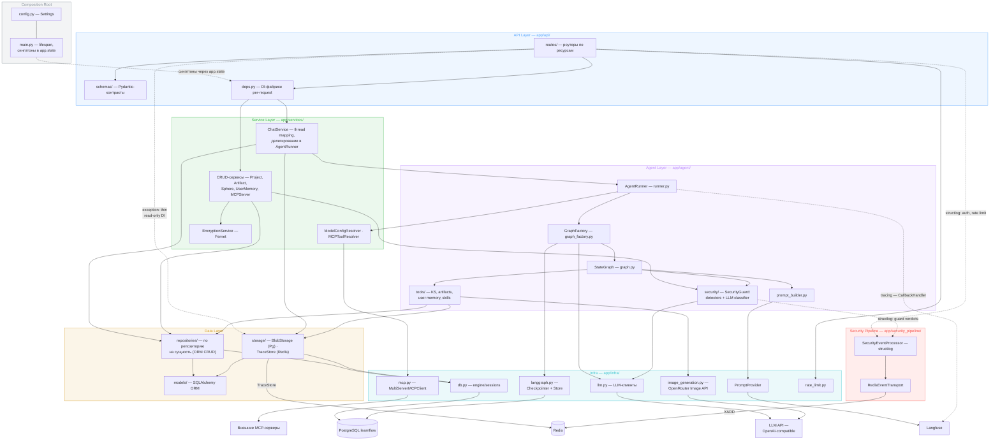
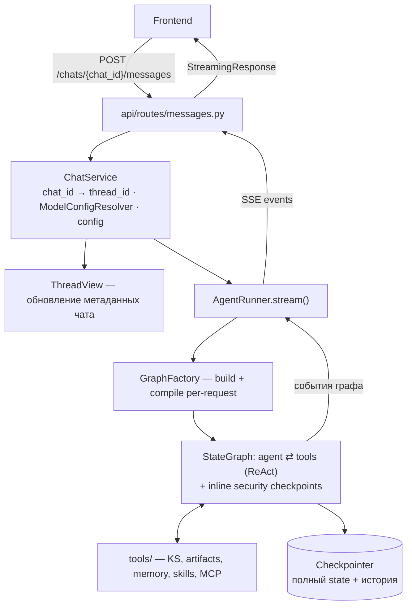
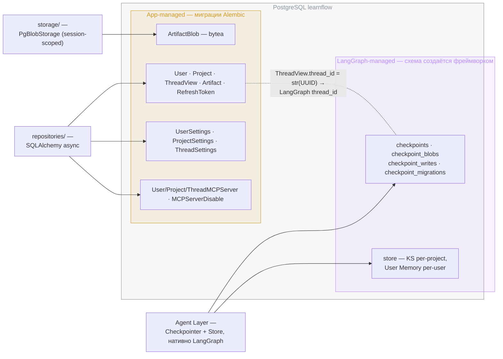

# Backend

Архитектура верхнего уровня и стек — в [vision.md](../vision.md). Здесь — детальное описание бэкенда: слоистая архитектура, API, Agent Runtime, Persistence.

## Layered Architecture

### Слои

Слои показаны цветными подложками поверх компонентов и их связей; внизу — внешние системы:



Composition root — `app/main.py`: lifespan инициализирует синглтоны (engine, AgentRunner, guard и т.д.) в `app.state`; `app/api/deps.py` — per-request фабрики поверх `app.state`.

- **API Layer** — HTTP/SSE-интерфейс, Pydantic-валидация, маршрутизация. Не содержит бизнес-логики.
- **Service Layer** — CRUD-сервисы (ProjectService, ArtifactService, UserMemoryService, MCPServerService, SphereService) + thin ChatService для chat-операций. ChatService оркестрирует взаимодействие с AgentRunner (маппинг chat_id → thread_id, model resolution, обновление thread_views, формирование config). Write-методы для persistent storage (MCP-серверы, custom instructions, KS write через REST) первыми вызывают security guard — INJECTION → HTTP 422, до endpoint-специфичных валидаций ([security/architecture.md](../security/architecture.md)). ModelConfigResolver — каскадное разрешение модели per-request.
- **Agent Layer** — LangGraph-граф, GraphFactory (per-request build+compile), tools, skills, context engineering, memory, security (inline-проверки в графе и стриминге — [architecture.md](../security/architecture.md)). LangGraph-связанность сдержана внутри этого слоя: наружу выходят только доменные типы, не LangGraph-специфичные.
- **Repository Layer** — SQLAlchemy, CRUD-доступ к app-managed таблицам, по репозиторию на ORM-сущность.
- **Storage Layer** — абстракции хранилища с заменяемым бэкендом или не-ORM семантикой (blob, key-value); независимый сосед Repository Layer, не наследует и не оборачивает его. `BlobStorage` (`typing.Protocol`, реализация `PgBlobStorage`) и `TraceStore` (Redis) — нейминг и граница с Repository Layer см. [conventions.md § Именование](conventions.md#именование).
- **Infra** — не слой с правилами вызовов, а утилитарный пакет с сконфигурированными клиентами внешних сервисов.

### Правила вызовов

| Вызов | Разрешён |
|-------|----------|
| API → Service | ✅ всегда (включая chat через ChatService) |
| Service → Repository | ✅ |
| Service → Storage | ✅ (`ChatService` → `TraceStore`) |
| Service → Agent Layer | ✅ (ChatService → AgentRunner) |
| Agent tools → Repository | ✅ прямой доступ |
| Agent tools → Storage | ✅ прямой доступ (`image_generation`-tool → `PgBlobStorage`) |
| Agent → LangGraph Store / Checkpointer | ✅ нативно |
| Repository / Storage / Agent → Infra | ✅ клиенты |
| Repository → Service | ❌ |
| API → Repository | ❌, кроме тонкого read-only исключения (см. ниже) |
| API → Storage | ❌, кроме тонкого read-only исключения (см. ниже) |
| API → Agent Layer | ❌ (только через Service) |

Известное локализованное исключение: `services/mcp_server.py` импортирует схему из `api/schemas/mcp_servers.py` — против направления, без цикла.

**Исключение — тонкий read-only инжект в route-handler.** API → Repository/Storage в обход Service-слоя допустим, когда выполнены все три условия: (1) только чтение; (2) ноль бизнес-логики в handler'е — он только достаёт данные и отдаёт их; (3) авторизация уже выполнена существующими dependencies (ownership-проверки и т.п.) до обращения к хранилищу. Появление бизнес-логики или записи требует Service-слоя.

Прецеденты:
- `get_artifact_media` (`GET /projects/{id}/artifacts/{aid}/media`, `api/routes/artifacts.py`) — после ownership-проверки через `ArtifactServiceDep` читает блоб напрямую через `BlobStorageDep`.
- `list_user_servers` и симметричные list-хендлеры (`GET /users/me/mcp-servers` и project/thread-эквиваленты, `api/routes/mcp_servers.py`) — листинг напрямую через `MCPServerRepository`, без бизнес-логики.

Write-хендлеры `mcp_servers.py` (create/update/delete) под это исключение не попадают — там есть бизнес-логика (guard, лимиты на scope, инвалидация резолвера); они остаются известным долгом R1 ([arch-checker.md](arch-checker.md#известные-исключения-allowlist)).

### Сквозной поток: сообщение в чат

Главный сценарий системы через все слои. Протокол SSE и lifecycle стрима — [streaming.md](streaming.md), внутренности графа — [agent-runtime.md](agent-runtime.md).



## API Layer

### Auth

JWT + Refresh Token. Access token (short-lived, localStorage) для API-запросов, refresh token (long-lived, httpOnly cookie) для обновления. Подробнее: [auth.md](auth.md), обоснование — [ADR-011](adr/ADR-011-auth-architecture.md).

### Endpoints

Все API-эндпоинты доступны под префиксом `/api` (например, `/api/projects`). Пути в таблицах ниже — относительно этого префикса. Health check (`GET /health`) — на root level, без префикса.

#### Projects

| Метод | Путь | Назначение |
|-------|------|-----------|
| POST | `/projects` | Создать проект |
| GET | `/projects` | Список проектов пользователя |
| GET | `/projects/{id}` | Получить проект |
| PUT | `/projects/{id}` | Обновить (название и т.д.) |
| DELETE | `/projects/{id}` | Удалить проект |

#### Chats

| Метод | Путь | Назначение |
|-------|------|-----------|
| POST | `/projects/{id}/chats` | Создать чат в проекте |
| GET | `/projects/{id}/chats` | Список чатов проекта |
| GET | `/projects/{id}/chats/{cid}` | История чата (сообщения) |
| GET | `/chats/recent` | Недавние чаты пользователя (across projects, для sidebar) |

#### Messages (ядро)

| Метод | Путь | Назначение |
|-------|------|-----------|
| POST | `/projects/{id}/chats/{cid}/messages` | Отправить сообщение → SSE stream с ответом агента |
| POST | `/projects/{id}/chats/{cid}/cancel` | Отменить генерацию |

Стриминг через SSE (Server-Sent Events) — индустриальный стандарт для LLM-проектов. LangGraph нативно поддерживает SSE через `stream_events`.

#### Knowledge Sphere

| Метод | Путь | Назначение |
|-------|------|-----------|
| GET | `/projects/{id}/sphere` | Текущий шар (полный) |
| PUT | `/projects/{id}/sphere` | Перезаписать шар |

Для разработки, отладки и будущего UI. PATCH (частичное обновление секций) — при необходимости.

#### Artifacts

| Метод | Путь | Назначение |
|-------|------|-----------|
| GET | `/projects/{id}/artifacts` | Список артефактов проекта |
| GET | `/projects/{id}/artifacts/{aid}` | Получить артефакт (метаданные + content) |
| GET | `/projects/{id}/artifacts/{aid}/download?format=md\|pdf` | Скачать в формате |
| GET | `/projects/{id}/artifacts/{aid}/media` | Бинарные данные image-артефакта (bytes + `Content-Type` из `mime_type`) |

PDF — конвертация из Markdown на бэкенде (pdfkit + wkhtmltopdf); блокирующий вызов уводится из event loop через `anyio.to_thread`.

Media endpoint отдаёт содержимое `artifact_blobs` (404, если блоба нет — артефакт не типа `image` либо запись не залита). Ответ несёт `Cache-Control: private, max-age=31536000, immutable`: блоб иммутабелен по построению (редактирования нет, перегенерация создаёт новый артефакт = новый id = новый URL), поэтому браузер кэширует агрессивно без риска устаревания. `X-Content-Type-Options: nosniff` — `mime_type` приходит от внешнего провайдера и echo-нится в заголовок без валидации.

#### Models & Settings

| Метод | Путь | Назначение |
|-------|------|-----------|
| GET | `/models` | Список доступных моделей (whitelist из agent.yaml) |
| GET | `/users/me/settings` | Настройки пользователя (model override) |
| PUT | `/users/me/settings` | Обновить настройки пользователя |
| GET | `/projects/{id}/settings` | Настройки проекта |
| PUT | `/projects/{id}/settings` | Обновить настройки проекта |
| GET | `/projects/{id}/chats/{cid}/settings` | Настройки чата |
| PUT | `/projects/{id}/chats/{cid}/settings` | Обновить настройки чата |

Каскад разрешения модели: thread → project → user → Langfuse → agent.yaml. `model_name: null` = inherit.

#### User Memory

| Метод | Путь | Назначение |
|-------|------|-----------|
| GET | `/users/me/instructions` | Пользовательские инструкции |
| PUT | `/users/me/instructions` | Обновить инструкции (max 5000 chars) |
| GET | `/users/me/memories` | Список записей памяти агента |
| DELETE | `/users/me/memories/{key}` | Удалить запись памяти |

Инструкции включаются в system message каждого чата. Записи памяти создаются агентом через `save_user_memory` / `delete_user_memory` tools, удаляются пользователем через UI.

#### MCP Servers

| Метод | Путь | Назначение |
|-------|------|-----------|
| GET | `/users/me/mcp-servers` | Список MCP серверов пользователя |
| POST | `/users/me/mcp-servers` | Добавить MCP сервер |
| PUT | `/users/me/mcp-servers/{sid}` | Обновить |
| DELETE | `/users/me/mcp-servers/{sid}` | Удалить |
| POST | `/users/me/mcp-servers/{sid}/test` | Тест подключения |

Аналогичные эндпоинты для project (`/projects/{id}/mcp-servers/...`) и thread (`/projects/{id}/chats/{cid}/mcp-servers/...`).

Cascade visibility: project/thread list endpoints поддерживают `?include_inherited=true` — возвращает inherited серверы из вышестоящих scope с `is_disabled` флагом. Toggle inherited серверов: `PUT .../mcp-servers/inherited/{sid}/toggle` с `{ disabled: bool }`.

Ограничения: max 5 серверов per scope, transport = http|sse (stdio запрещён), SSRF-защита (private IPs → 400), API key шифруется Fernet, `api_key_hint` хранит маску (первые/последние 4 символа) для отображения.

### Schemas

Pydantic request/response модели. Сквозные соглашения:
- **ID** — UUID для всех app-managed сущностей (включая ThreadView.thread_id). При вызовах LangGraph API — `str(thread_id)`.
- **Списки** — единый envelope `{ items, total, limit, offset }` (generic `Page[T]` в `app/api/schemas/common.py`); query-параметры `limit` (default 50, max 200) и `offset` через общий dependency `Pagination`.
- **Ошибки** — RFC 9457 Problem Details (`application/problem+json`): `{ type, title, status, detail, …extensions }`; глобальные handlers в `app/api/problem.py`. Детали — [conventions/api.md](conventions/api.md#rest-api).
- **Ownership** — path-цепочка валидируется зависимостями `UserProject` / `UserThread` (404 на чужой ресурс).

#### Projects

```
POST /projects
  Request:  { name: str }
  Response: { id: UUID, name: str, created_at: datetime, updated_at: datetime }

GET /projects
  Response: { items: [{ id, name, created_at, updated_at }] }

GET /projects/{id}
  Response: { id, name, created_at, updated_at }

PUT /projects/{id}
  Request:  { name: str }
  Response: { id, name, created_at, updated_at }

DELETE /projects/{id}
  Response: 204 No Content
```

#### Chats

```
POST /projects/{id}/chats
  Request:  { title?: str }
  Response: { thread_id: UUID, title: str, created_at: datetime, updated_at: datetime }

GET /projects/{id}/chats
  Response: { items: [{ thread_id: UUID, title, created_at, updated_at }] }

GET /projects/{id}/chats/{cid}
  Response: { thread_id: UUID, title, messages: [{ id, role, content, created_at?, artifacts: [{ id, title, type, created_at }] }] }

GET /chats/recent?limit=10
  Response: { items: [{ thread_id: UUID, title, project_id, project_name, updated_at }] }
```

`role`: `"user" | "assistant"`. Messages достаются из checkpointer. Tool-сообщения на фронт не отдаются.

Recents — последние чаты пользователя across all projects, сортировка по `updated_at` desc. Для sidebar.

#### Messages

```
POST /projects/{id}/chats/{cid}/messages
  Request:  { content: str }
  Response: SSE stream (формат — см. SSE Streaming Protocol)

POST /projects/{id}/chats/{cid}/cancel
  Response: { ok: bool }
```

#### Knowledge Sphere

```
GET /projects/{id}/sphere
  Response: { project_id: UUID, content: str, updated_at: datetime }

PUT /projects/{id}/sphere
  Request:  { content: str }
  Response: { project_id, content, updated_at }
```

#### Artifacts

```
GET /projects/{id}/artifacts
  Response: { items: [{ id, title, type, created_at }] }

GET /projects/{id}/artifacts/{aid}
  Response: { id, title, type, content, thread_id?, message_id?, created_at }

GET /projects/{id}/artifacts/{aid}/download?format=md|pdf
  Response: файл (Content-Disposition: attachment)

GET /projects/{id}/artifacts/{aid}/media
  Response: bytes, Content-Type = mime_type блоба (404 без блоба)
```

В списке — только метаданные, без content. `type` включает `image` — у image-артефактов `content` несёт prompt генерации (alt-текст/caption), а бинарь доступен отдельно через `/media`.

### SSE Streaming Protocol

Формат: type-in-data (индустриальный стандарт LLM-стриминга — OpenAI, Anthropic). Event types, lifecycle, cancellation, frontend consumption — [streaming.md](streaming.md).

## Module Structure

Горизонтальная нарезка по слоям. Конкретные файлы внутри пакетов выводятся из сущностей (Persistence), tools (Agent Runtime) и endpoints (API) — здесь не дублируются.

```
app/
├── main.py              # FastAPI app factory, lifespan
├── config.py            # Settings (pydantic-settings)
│
├── api/                 # API Layer
│   ├── routes/          # FastAPI роутеры (по ресурсам)
│   ├── schemas/         # Pydantic request/response модели
│   └── deps.py          # Dependencies: DB session, current user, инъекция сервисов
│
├── services/            # Service Layer
│
├── agent/               # Agent Layer
│   ├── security/        # SecurityGuard, detectors, classifier, observer, prompt-builder helpers (→ security/architecture.md)
│   └── tools/           # Реализации tools
│
├── repositories/        # Repository Layer
│
├── storage/             # Storage Layer
│
├── models/              # SQLAlchemy ORM-модели (app-managed таблицы)
│
├── infra/               # Клиенты внешних сервисов, DB engine/sessions
│
└── security_pipeline/   # SecurityEventProcessor + Redis-транспорт (→ siem-service.md)
```

**api/** — HTTP/SSE-интерфейс. Роутеры сгруппированы по ресурсам, каждый вызывает соответствующий сервис. Schemas — Pydantic-контракт с фронтендом. deps.py — FastAPI dependencies для инъекции зависимостей в роутеры.

**services/** — Оркестрация и бизнес-правила. CRUD-сервисы (Project, Artifact, UserMemory, MCPServer) + thin ChatService для chat-операций (маппинг chat_id → thread_id, model resolution, делегирование в AgentRunner, управление ThreadView). ModelConfigResolver — каскадное разрешение модели; MCPToolResolver — резолв MCP-инструментов per-request (оба инжектятся в AgentRunner). EncryptionService (Fernet) — шифрование API-ключей user MCP-серверов. Зависимости (repositories, AgentRunner) — через конструктор, wiring в deps.py.

**agent/** — LangGraph-граф, GraphFactory (per-request build+compile), tools, context engineering, промпт. Публичный интерфейс — AgentRunner (stream, get_history, cancel). LangGraph-типы не выходят за пределы этого пакета. tools/ — суб-пакет с внутренней группировкой (KS, artifacts, user memory, skills).

**skills/** — директория в корне репозитория (`skills/`, рядом с `backend/`, `configs/`). Каждый skill — поддиректория с `SKILL.md` (Claude Code compatible формат). Вынесены из backend, чтобы пользователь мог добавлять skills без необходимости лезть в код приложения.

**repositories/** — CRUD-доступ к app-managed таблицам через SQLAlchemy async session. По репозиторию на сущность.

**storage/** — абстракции хранилища с заменяемым бэкендом или не-ORM семантикой: `BlobStorage` (`typing.Protocol`, реализация `PgBlobStorage`) для бинарей артефактов, `TraceStore` (Redis) для маппинга trace_id/feedback. Независимый сосед `repositories/` — ни один из двух пакетов не импортирует другой; нейминг и граница между ними — [conventions.md § Именование](conventions.md#именование).

**models/** — SQLAlchemy ORM-модели для app-managed таблиц (User, Project, ThreadView, Artifact).

**infra/** — Сконфигурированные клиенты внешних сервисов: DB engine/session factory, Checkpointer + Store (`langgraph.py`), LLM-клиенты, клиент OpenRouter Image API (`image_generation.py` — голый `httpx`, без LangChain-обёртки), MCP client (`MultiServerMCPClient`), PromptProvider (Langfuse SDK wrapper), rate limiting, Redis client. Импортируется из Repository Layer, Service Layer и Agent Layer. MCPToolResolver и EncryptionService живут в `services/`, не здесь.

## Agent Runtime

LangGraph-граф с ReAct-паттерном, context engineering, tools, skills, MCP-интеграция, security. Детальное описание — [agent-runtime.md](agent-runtime.md). Связанные концепты: [knowledge-sphere.md](knowledge-sphere.md), [user-memory.md](user-memory.md), [prompt-management.md](prompt-management.md), [observability.md](observability.md), [architecture.md](../security/architecture.md).

Ключевые ADR: [ADR-001](adr/ADR-001-general-agent.md) (General Agent), [ADR-002](adr/ADR-002-skills-system.md) (Skills), [ADR-003](adr/ADR-003-knowledge-sphere.md) (KS), [ADR-004](adr/ADR-004-progressive-disclosure.md) (Progressive Disclosure), [ADR-005](adr/ADR-005-ks-update-mechanism.md) (KS Updates), [ADR-006](adr/ADR-006-custom-stategraph.md) (Custom StateGraph), [ADR-007](adr/ADR-007-mcp-external-tools.md) (MCP), [ADR-013](adr/ADR-013-per-scope-settings-storage.md) (Settings Storage), [ADR-014](adr/ADR-014-dynamic-model-resolution.md) (Graph Factory), [ADR-015](adr/ADR-015-langgraph-store-unified-memory.md) (Store Memory), [ADR-016](adr/ADR-016-per-scope-mcp-servers.md) (MCP Servers), [ADR-017](adr/ADR-017-prompt-injection-defense.md) (Sec 1.0), [ADR-018](adr/ADR-018-siem-service-topology.md) (SIEM Topology), [ADR-020](adr/ADR-020-security-event-contract.md) (Event Contract), [ADR-022](adr/ADR-022-protected-disclosable-boundary.md) (Confidentiality Boundary), [ADR-023](adr/ADR-023-two-level-detection.md) (Detection Layers), [ADR-024](adr/ADR-024-streaming-security-guard.md) (Streaming Guard).

## Persistence

Одна PostgreSQL база, два механизма управления: LangGraph-managed и app-managed. Миграции app-managed таблиц — через Alembic (async engine).



### LangGraph-managed

Управляется фреймворком, таблицы создаются автоматически.

**Checkpointer** — полный state агента, включая историю сообщений. Сообщения не дублируются в отдельную app-таблицу: checkpointer хранит полную историю, доступную через `get_state()`. Таблицы: `checkpoints`, `checkpoint_blobs`, `checkpoint_writes`, `checkpoint_migrations`.

**Store** — Knowledge Sphere (per-project) и User Memory (per-user: custom instructions, agent memory). Таблицы: `store`, `store_vectors` (будущее: embeddings). Namespace-based изоляция — [user-memory.md](user-memory.md#storage).

### App-managed

Управляется нашим Repository Layer через SQLAlchemy.

```
User
├── id, name, password_hash, is_admin, created_at

RefreshToken
├── id (UUID PK), user_id (FK CASCADE), token_hash (indexed), expires_at, created_at, revoked_at

Project
├── id, user_id, name, created_at, updated_at

ThreadView
├── thread_id (PK, UUID — при вызовах LangGraph конвертируется в str), project_id, title, security_blocked (bool), created_at, updated_at

Artifact
├── id, project_id, thread_id, message_id, title, type (markdown | image | ...), content, created_at

ArtifactBlob
├── id (UUID PK), artifact_id (FK CASCADE, unique — 1:1 к Artifact), mime_type, data (bytea)

UserSettings / ProjectSettings / ThreadSettings
├── user_id|project_id|thread_id (PK, FK CASCADE), model_name, extra_body (JSONB), created_at, updated_at

UserMCPServer / ProjectMCPServer / ThreadMCPServer
├── id (UUID PK), user_id|project_id|thread_id (FK CASCADE), name, transport, url, api_key_encrypted, api_key_hint, allowed_tools (JSONB), is_active, created_at, updated_at
├── UNIQUE(scope_id, name)

MCPServerDisable
├── scope_type + scope_id + server_id (composite PK) — disables inherited server at child scope
```

**ThreadView** — легковесная индексная таблица для UI (листинг чатов, заголовки, даты). OSS LangGraph не предоставляет API для листинга threads, поэтому метаданные чатов хранятся отдельно. `security_blocked` маркируется при INJECTION на любом runtime checkpoint'е; FastAPI-зависимость на POST `/messages` отдаёт 403 пока флаг стоит ([security/architecture.md](../security/architecture.md)).

**ArtifactBlob** — бинарные данные артефактов (сейчас — сгенерированные изображения), отдельная таблица от `Artifact`, чтобы обычный select/listing артефактов не тянул мегабайты. Доступ — за протоколом `BlobStorage` (`app/storage/blob_storage.py`, `put`/`get`/`delete`), единственная реализация — `PgBlobStorage`, конструируется вокруг сессии как репозитории (не принимает `session` параметром метода) — атомарность «артефакт + блоб одной транзакцией» получается естественным образом при записи. Таблица рассчитана на переиспользование будущими потребителями бинарей (file attachments, референсные изображения). Обоснование выбора PostgreSQL вместо S3/файловой системы — [ADR-027](adr/ADR-027-artifact-blob-storage.md).

### Связи

```
User 1 → N Project
Project 1 → N ThreadView
Project 1 → N Artifact
Artifact 1 → 0..1 ArtifactBlob (только type="image")
ThreadView.thread_id = str(UUID) → LangGraph thread_id (связь с checkpointer)
Artifact.thread_id → ThreadView.thread_id (артефакт создаётся в контексте чата)
```

## Logging

Централизованное логирование на базе structlog поверх stdlib через `ProcessorFormatter`. Обоснование — [ADR-009](adr/ADR-009-logging-strategy.md). Стиль и семантика уровней — [conventions.md](conventions.md#logging-conventions). Трейсинг и observability — [observability.md](observability.md).

### Setup

Единая точка входа: `backend/app/infra/logging.py` → `setup_logging()`. Вызывается в `lifespan()` до инициализации сервисов.

Конфигурация:
- `configs/logging.yaml` — формат вывода (`human-readable` / `json`), per-library overrides для шумных библиотек
- `LOG_LEVEL` env var — уровень логирования (default: `info`)

### Structlog + stdlib интеграция

Подход "Rendering using structlog-based formatters within logging": structlog loggers (наш код) и stdlib loggers (uvicorn, sqlalchemy, httpx) проходят через единый `ProcessorFormatter` → единый формат вывода.

### Request ID

FastAPI middleware генерирует UUID для каждого HTTP-запроса → `structlog.contextvars`. Все лог-записи в контексте запроса автоматически содержат `request_id`.

### Security Event Logging Convention

Структурированное логирование security-событий для SIEM pipeline. Логирование вызывается с флагом `security_event=True` и canonical `event_type` из vocabulary:

```python
logger.warning(
    "injection detected",
    security_event=True,
    event_type="agent.guard.input.classifier_injection",
    severity="critical",
    metadata={"checkpoint": "user_input", "detector": "llm_classifier"}
)
```

**Обработка:** `SecurityEventProcessor` перехватывает лог-записи с `security_event=True`, нормализует в `SecurityEvent`, пубирует в Redis Stream. Context binding (ip, user_id, request_id, thread_id и т.д.) вытягивается из contextvars автоматически.

**Vocabulary:** Полный набор `event_type` и их metadata-формы — [security-events.md](security-events.md). Типизация via Literal для mypy-проверяемости.

## SIEM Service

Отдельный FastAPI backend-сервис (порт 8001, собственная PostgreSQL siem-db): потребляет security-события из Redis Stream, коррелирует, генерирует алерты, отдаёт admin-only REST API для мониторинга. Main app — producer событий (см. Security Event Logging Convention выше); процессная изоляция и blast radius — [ADR-018](adr/ADR-018-siem-service-topology.md).

Полное описание сервиса (слои, pipeline, correlation engine, persistence, API, конфигурация) — [siem-service.md](siem-service.md).

## Error Handling

Конвенции выбора сигнала, барьерный стек, graceful degradation vs fail-fast, таймауты — [conventions.md](conventions.md#обработка-ошибок).

Main app реализует: иерархию `AppError` в `services/exceptions.py` (доменные исключения без знания о HTTP-транспорте); барьерный стек на `app/api/problem.py` (3 слоя: `AppError` → инфра-исключения → generic 500); SSE-барьер в `api/routes/messages.py` (терминальный `error`-event для непойманных исключений в стриме агента).

## Configuration

`pydantic-settings` с загрузкой из env vars. Набор параметров выводится из стека: DB URL, LLM API key/model, CORS origins, Langfuse credentials. Механика env-файлов — в [conventions.md](conventions.md#docker).

Ключевые env vars:
- `MCP_ENCRYPTION_KEY` — Fernet-ключ для шифрования API-ключей per-user MCP серверов
- `LANGFUSE_PROMPT_LABEL` — label для фетча промптов (default: `development`)
- `LANGFUSE_PROMPT_CACHE_TTL` — TTL кэша промптов в секундах (default: `60`)
- `CANARY_SECRET` — HMAC secret для canary token (→ [architecture.md](../security/architecture.md))

Agent-специфичная конфигурация (модель, контекст, промпт, summarization, MCP) — отдельный YAML-файл, не env vars. Prompt management — [prompt-management.md](prompt-management.md).
