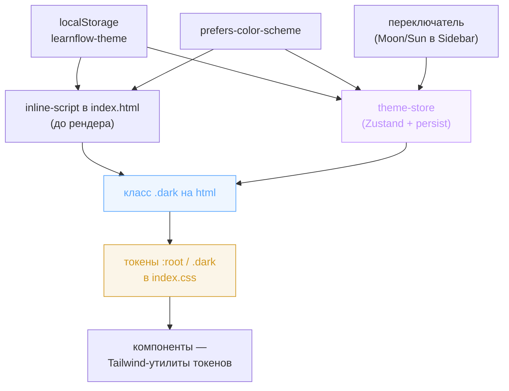

# Design System — «Чернила / Электрик»

Визуальный язык продукта: токены, типографика, темизация, бренд-примитивы, иллюстрации и error UX. Документ — контракт для фронтенда: что есть, зачем и где граница между «фирменным» и «сгенерированным». Раскладка FSD, состояние и стек — в [frontend.md](frontend.md); выбор стека — в [ADR-008](adr/ADR-008-frontend-stack.md).

## Видение

**«Чернила / Электрик»** — тёплая бумажная основа (кремовый фон, чернильный текст) плюс один плоский фиолетовый акцент (`#7434F4`), serif-акценты в заголовках и **сфера знаний как визуальное ядро бренда**. Характер: спокойный, умный, тёплый, собранный. Анти-цели: детскость, корпоративный холод, generic-AI-эстетика.

**Жёсткое правило: фиолетовый в UI всегда плоский.** Радиальный градиент живёт ровно в одном месте — внутри Сферы-орба (компонент `SphereOrb`, токены `--orb-*`). Любой фиолетовый градиент на фоне кнопки, чипа, карточки или панели — нарушение бренда. Это правило — главный водораздел системы; токены и компоненты построены так, чтобы его соблюдение было дефолтом, а не дисциплиной.

## Дизайн-токены

Источник истины по значениям — CSS-переменные в `frontend/src/index.css`: light в `:root`, dark в `.dark`, маппинг в Tailwind-утилиты — в блоке `@theme inline`. Цвета заданы в hex (приоритетный формат при конвертации) и rgba; `--destructive` и chart-токены остались в OKLCH из базовой палитры shadcn. Ниже — контракт (роль токена), не дамп CSS.

### Семантическая палитра

| Токен | Роль | Light → Dark |
|-------|------|--------------|
| `--background` / `--foreground` | фон рабочей зоны (тёплая бумага) и основной текст (чернила) | `#FAF7F1`/`#2E2A24` → `#181420`/`#EDE8E2` (крем, не белый) |
| `--card` / `--popover` | карточки, инпут-бары, панели вьюеров, поповеры | `#FFFEFA` → `#221C30` |
| `--primary` / `--primary-foreground` | заливка кнопок, send-круг, активные состояния | `#7434F4`/`#F6F1FF` → `#8A5CF6`/`#F7F4FF` |
| `--secondary` / `--accent` | лавандовый фон чипов, tool-call'ов, подсветок | `#EFE7FE` → `rgba(177,148,255,0.15)` |
| `--muted` / `--muted-foreground` | вторичные плоскости и вторичный текст | `#F1EDE3`/`#8B8370` → `#1E1929`/`#9A90A8` |
| `--border` / `--input` | hairline-границы и границы контролов | `#E2DCD0`/`#D8D1C2` → `#322A44`/`#3A3150` |
| `--ring` | акцент фокуса и текстовый акцент | `#7434F4` → `#B194FF` |
| `--destructive` | ошибки, деструктивные действия (кнопки) | OKLCH red (light/dark) |
| `--sidebar*` | палитра sidebar (фон, акцент, граница) | `#F1EDE3` → `#1E1929` |

**Ключевой нюанс dark-темы:** акцент расщеплён. Текст, иконки и ссылки используют `--ring` (`#B194FF` — осветлённый на 2 ступени для читаемости на тёмном), а заливка кнопок — `--primary` (`#8A5CF6`). В light оба совпадают (`#7434F4`). Бренд-примитивы и акцентные подчёркивания опираются на `--ring` именно поэтому — он автоматически даёт правильный оттенок в каждой теме.

### Дополнительные бренд-токены

Поверх семантической палитры заведены доменные токены — там, где роль уже, чем абстрактный «secondary/destructive», и значение должно меняться с темой в одной точке:

| Токен | Роль |
|-------|------|
| `--brand-lavender` | сиреневые маркеры: неактивные точки-статусы, искры орба, обрамление аватара агента, строка вызова субагента в ленте активности (`#C5A9F9` → `#B194FF`) |
| `--bubble-user` | фон bubble сообщения пользователя (`#EDE7DA` → `#262031`) |
| `--destructive-warm` | терракота для деструктивных текстовых ссылок («Удалить проект», «Откатить») — мягче красной кнопки (`#B0573F` → `#D06050`) |
| `--success` | цвет успеха общего назначения: галочка завершённого шага в ленте активности (`ActivityRow`), иконка success-тоста `sonner`, подтверждение inline-сохранения имени проекта (`#3D7A45` → `#6FBF78`). Не путать с `--mcp-connected` — тот узкоспециальный (точка статуса MCP-соединения), `--success` — общий семантический зелёный для положительного исхода где угодно в продукте |
| `--mcp-connected` / `--mcp-disabled` | точки статуса MCP-серверов: зелёная / серая |
| `--shadow-input` | единственная штатная тень UI — инпут-бары и карточки ввода |
| `--shadow-lens` / `--scrim-overlay` | тень и скрим оверлея-линзы сферы (S2) |
| `--orb-gradient` / `--orb-shadow` / `--orb-ring-1` / `--orb-ring-2` | радиальный градиент, тень/свечение и концентрические кольца Сферы-орба — **единственный санкционированный градиент** |
| `--slides-bg` / `--slides-fg` | палитра вьюера презентаций — намеренно тёмная **независимо от темы приложения** (по бренду слайды всегда dark `#181420`) |
| `--content-max-w` | ширина центр-колонки: 680px по умолчанию, 520px под классом `.studio-open` |

Тени почти не используются: штатно — только инпут-бар, модал линзы и свечение орба в dark. Эмодзи в UI нет; иконки — lucide в тон текста.

### Радиусы

Базовый `--radius: 0.7rem`; шкала `--radius-sm…4xl` выводится множителями в `@theme inline`. Ориентиры из хэндоффа: кнопки 9–11px, карточки 11–14px, модалы 14–18px, чипы — `999px` (pill).

### Скроллбары и `color-scheme`

Глобальная стилизация в `index.css` — единый тонкий скроллбар на токене `--border` для всех ~19 нативных `overflow-auto`-контейнеров продукта, без точечных классов по местам: `::-webkit-scrollbar` шириной 10px, прозрачный трек, thumb `background-color: var(--border)` с `background-clip: padding-box` (даёт видимую полосу уже дорожки — тот же приём, которым Base UI `ScrollArea` рисует свой thumb), hover-усиление через `color-mix(in srgb, var(--muted-foreground) 45%, var(--border))`. Firefox не поддерживает `::-webkit-scrollbar`: под `@supports not selector(::-webkit-scrollbar)` — `scrollbar-width: thin` + статичный `scrollbar-color`; точная ширина 10px и hover-акцент там недостижимы, расхождение принято как норма, обходов не искать.

**Инвариант: глобальный стиль подогнан под `ScrollArea`, менять один — проверять второй.** `shared/ui/scroll-area.tsx` — сгенерированный shadcn-примитив (не правится, см. § Границы), его thumb уже `bg-border rounded-full`; глобальные правила выше специально держат ту же ширину/радиус/цвет, иначе на соседних экранах видны две разные полосы. Правка любой стороны требует сверки визуального паритета в обеих темах.

`color-scheme: light` / `color-scheme: dark` объявлены на `:root`/`.dark` рядом с токенами — без этого нативные UA-виджеты (в т.ч. системный скроллбар до применения кастомного стиля) рендерятся в светлой палитре независимо от темы приложения и светятся белым на тёмном фоне.

`scrollbar-gutter: stable` — на основных скролл-контейнерах с центрированным `max-width`-контентом (лента сообщений чата, `main` в `AppLayout`): резервирует место под полосу, чтобы её появление/исчезновение на переходах не двигало центрированный контент по горизонтали.

## Типографика

Три семейства, подключены через `@fontsource` (импорты по нужным весам в `index.css`), маппинг в `--font-*`:

- **Source Serif 4** (600/700) → `--font-serif`: заголовки экранов, имена сущностей (проекты, артефакты, «Сфера знаний»), H-уровни в markdown.
- **Instrument Sans** (400/500/600/700) → `--font-sans`: весь UI и body-текст (дефолт на `<html>`).
- **IBM Plex Mono** (400/500) → `--font-mono`: версии (`v2.4.1`), таймкоды, тех-метки. Не для body.

Serif как маркер «сущность / заголовок», mono как маркер «техническая метка» — смысловая нагрузка шрифта, а не только декоративная. Markdown-контент сферы и артефактов получает serif-заголовки и акцентные маркеры списков через класс `.sphere-prose` (определён в `index.css`).

## Темизация и переключатель

Тема — клиентское состояние в `stores/theme-store.ts` (Zustand + `persist`, ключ localStorage `learnflow-theme`). Переключение вешает/снимает класс `.dark` на `<html>`; все токены живут в `:root` / `.dark`, поэтому смена темы — это смена одного класса, без пересборки или подписок в каждом компоненте.

Инициализация: сначала persisted-значение из localStorage, иначе системное `prefers-color-scheme`. Чтобы избежать FOUC (вспышки светлой темы до гидрации React), инлайн-скрипт в `<head>` (`index.html`) применяет `.dark` ещё до первого рендера, читая тот же ключ. Переключатель темы — иконка Moon/Sun в user-строке sidebar.

Компоненты тему напрямую не читают — они потребляют токены через Tailwind-утилиты (`bg-background`, `text-foreground`, …), а значение токена меняет класс `.dark`. Исключения, которым нужно знать тему явно: `Illustration` (выбирает light/dark PNG) и обёртка `sonner` (тема тостов) — оба читают её shared-хуком `useTheme` (`shared/lib/use-theme.ts`, `useSyncExternalStore` над классом `.dark` на `<html>`), а не подпиской на `theme-store` напрямую: `shared/ui` не имеет права зависеть от `stores` (граница FSD — `shared` импортирует только `shared`), поэтому источник истины (стор, который вешает/снимает класс) и точка чтения результата (DOM) разведены.

## Бренд-примитивы

Логотип и знак собраны кодом (не картинками) и живут в `shared/ui` — переиспользуемые композиции поверх примитивов:

- **`Wordmark`** — логотип (комбинация K5). Вместо «o» во Flow — мини-орб с орбитальным кольцом и искрой; «AI» обведено рукописным кружком из двух наклонённых эллипсов. Размеры в `em` — масштабируется с font-size родителя. Prop `short` убирает «AI» и кружок (для sidebar/шапок). Цвет акцента берётся из `--ring` — автоматически верен в обеих темах. Заменяет текстовый «LearnFlowAI».
- **`SphereOrb`** — параметризованный орб (`size`, `showRings`, `showSparks`). Градиент, тень и кольца берутся из CSS-переменных `--orb-*`, поэтому орб реагирует на тему без подписки на стор. Кольца добавляются при крупном размере, искры-ромбы — геометрически вокруг сферы. **Единственное место с радиальным градиентом.**
- **`BrandMark`** — знак-аватар агента: `SphereOrb` в круглом контейнере с тонким `--brand-lavender`-кольцом.
- **SVG-фавиконы** (`frontend/public/`): `favicon.svg` (чистый орб), `favicon-32x32.svg` (орб + искра), `apple-touch-icon.svg` (орб на тёплом фоне). Прилинкованы в `index.html`.

## Иллюстрации

Растровые сцены — `welcome-hero`, `sidebar-vignette`, `empty-chats`, `empty-sphere`, `empty-artifacts`, `error-state`, `not-found`, `artifacts-select`, `auth-hero` — лежат в `shared/assets/illustrations/{light,dark}/`, по теме на сцену. Доступ — **только через централизованную карту** `shared/assets/illustrations/index.ts`: функция `getIllustration(scene, theme)` возвращает URL ассета, тип `Scene` — источник истины по составу сцен. Компоненты PNG напрямую не импортируют.

Обёртка `shared/ui/Illustration` принимает `{ scene, alt, className }`, читает тему из `theme-store` и рендерит правильный `` — переключение light↔dark реактивно вместе с темой.

**Канонические ширины подачи** — зафиксированы мокапом, каждый потребитель передаёт их через `illustrationClassName` на `StateScreen`:

| Сцена | Ширина | Потребитель |
|-------|--------|-------------|
| `error-state` | 280px | `ErrorBoundary`, error-состояния чата/сферы/артефакта |
| `artifacts-select` | 300px | `NoArtifactSelected` (empty-state «Артефакты») |
| `not-found` | 360px | `NotFoundPage` (404) |
| `empty-sphere` | 440px | `SphereViewer` (empty-state «Сфера знаний») |
| `auth-hero` | 460px | `AuthLayout` (брендовая колонка auth-экрана) |

Карта — **единственная точка свапа ассетов.** Это сознательное проектное решение: production-версии иллюстраций (чистый cutout, возможно SVG) заменят текущие точечной правкой карты, а не охотой по кодовой базе. Текущие ассеты — `soft-balanced` cutout с дефектами края; production-свап вынесен в предпродакшн-гейт (см. ниже).

## Error UX

Единый шаблон «не-контента» — три соседних примитива в `shared/ui/StateScreen.tsx` (плюс `Skeleton` в `shared/ui/skeleton.tsx`), а не варианты одного пропа: у каждого своя геометрия и набор слотов.

- **`StateScreen`** — композиция «иллюстрация (опционально) + serif-заголовок (опционально) + подпись + действие (опционально)», полноэкранная или встроенная в панель форма (`flex-1`, базовая геометрия перекрывается классом потребителя под компактные панели). Потребители: 404 (`pages/not-found`), empty-state сферы (`empty-sphere`) и артефактов (`artifacts-select`), полноэкранные/панельные error-состояния чата/сферы/артефакта (`error-state`), `ErrorBoundary`.
- **`LoadingState`** — компактный центрированный блок без иллюстрации: `Loader2` (`lucide-react`, `animate-spin`) + подпись (дефолт — «Загрузка…»). Для панельных и Suspense-загрузок (роутер, `SecurityRouteGuard`, `ChatThread`, `SphereView`, `ArtifactView`, `SkillContextSection`) — загрузка переходное состояние, сцена здесь лишняя.
- **`ErrorCard`** — канонная карточная форма ошибки: `rounded-lg border border-destructive/30 bg-destructive/10` + сообщение + действие «Повторить» (`onRetry`, вызывает `refetch()` квери — без него кнопка не рисуется). Для списков (`ProjectList`, `ChatList` в проекте, `ArtifactList`) и других per-query ошибок с путём восстановления.
- **`Skeleton`** (`bg-muted animate-pulse`, канонический shadcn-примитив) — списочные загрузки: 2–3 плейсхолдера по форме будущей строки (карточка чата, строка артефакта, пункт проекта) вместо спиннера — сохраняет геометрию экрана, честнее относительно того, что появится.

**Инвариант расстановки:** списки грузятся скелетонами по форме будущей строки; панели и страницы — `LoadingState`; per-query ошибки — инлайновые с путём восстановления (`ErrorCard`/`StateScreen`); тосты остаются только за мутациями.

- **Тосты `sonner`** — только на мутациях. `MutationCache.onError` (`app/providers/QueryProvider.tsx`) показывает `toast.error` с сообщением из общего парсера `shared/lib/api-error.ts`, иконка успеха тостов красится токеном `--success`. `QueryCache.onError` тост **не** показывает (только логирует) — иначе фоновые refetch'и спамят, а инлайн error-состояния дублируют сообщение. `<Toaster/>` монтируется один раз в провайдерном слое; тема тостов следует за `theme-store`.
- **`ErrorBoundary`** (`app/components/ErrorBoundary.tsx`) — fallback при непойманной ошибке рендера: композиция поверх `StateScreen` (иллюстрация `error-state` + сообщение + кнопка «обновить страницу»), своей вёрстки не несёт; `componentDidCatch → logger.error` сохранён отдельно от визуальной унификации.

Security-специфичный UX (runtime block в чате, add-time block в формах) — в [frontend.md](frontend.md#security-ux).

## Границы

**Токены vs захардкоженное.** Любой цвет, тень, радиус, ширина центр-колонки — через CSS-переменную и Tailwind-утилиту токена. Хардкод hex/rgba в `.tsx` запрещён (статический греп — часть quality-gate). Когда значение должно жить вне темы (тёмные слайды, скрим линзы) — оно всё равно заводится CSS-переменной (`--slides-*`, `--scrim-overlay`), а не инлайн-литералом, чтобы граница «нет hex в компонентах» оставалась абсолютной.

**shadcn в `shared/ui`.** Примитивы генерируются CLI и руками не правятся (перегенерация затрёт) — кастомизация бренда идёт через токены и наши композиции поверх (`Wordmark`, `SphereOrb`, `Illustration`, `MarkdownRenderer`). Полное правило — [conventions/frontend.md § Граница shadcn](conventions/frontend.md). Санкционированное исключение: `shared/ui/sonner.tsx` — CLI генерирует его с зависимостью от `next-themes` (Next.js-специфично), которой в проекте нет; источник темы заменён на `theme-store`. Остальное содержимое сгенерированного файла не тронуто.

## Предпродакшн-гейт

Часть UI намеренно построена на заглушках (группа B дизайн-системы — семвер сферы, студия-панель, линза, вьюеры slides/audio, rich-редактор): бэкенд-контрактов под них пока нет, фронт работает на mock-данных и локальном состоянии.

Бо́льшая часть этих заглушек закрыта флагом `SHOW_GROUP_B_STUBS` (`shared/config/feature-flags.ts`, opt-in только в dev; механика гейта — [conventions/frontend.md § Гейтинг незрелых фич](conventions/frontend.md)). За флагом сегодня: чип версии и статуса сферы в шапке проекта, сохранение версии и панель истории версий в Сфере, студия-панель с её тогглом в шапке чата и её инертным футером, линза, fake contribution-чипы в списке чатов проекта («N артефакта», «+N в сферу»), вьюеры slides и audio. В прод-сборке эти ветки мертвы, мок-данные выпадают из бандла.

Флагом не закрыто и рендерится в проде:

- **инертная кнопка** «Перегенерировать» (фидбэк) — без обработчика;
- **всегда-включённый Switch** памяти агента (`AgentMemorySection`) — визуальный тоггл без управления;
- **тулбар-префиксы** rich-редактора сферы не работают как toggle (наслаивают `## ##`).

Запись агента в Сферу отдельной заглушкой-карточкой больше не показывается: она видна обычной строкой ленты активности — вызовом инструмента записи с его аргументами и результатом (→ [frontend.md](frontend.md#компонентная-архитектура)).

Отдельный отложенный пункт — **свап иллюстраций** на production-качество (см. § Иллюстрации).
