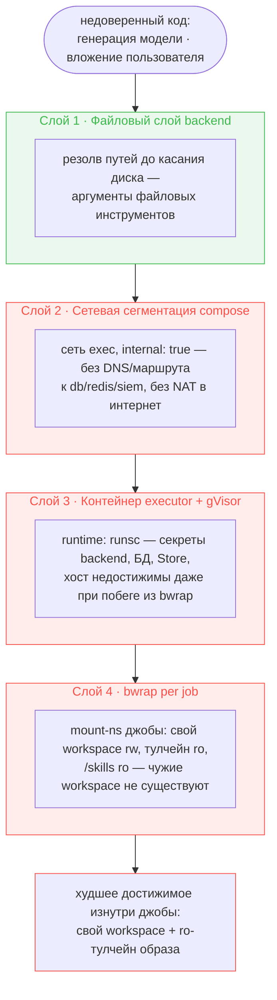
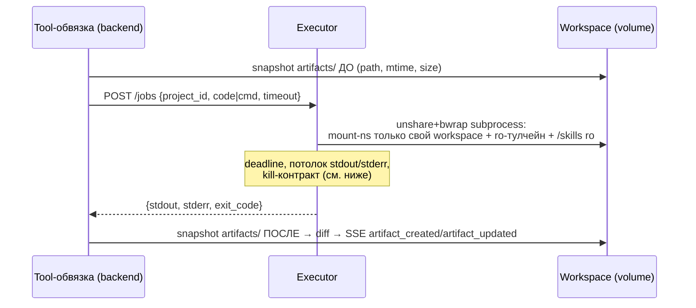

# Executor Service

Отдельный FastAPI-сервис, исполняющий недоверенный код агента (Python/bash, генерируемый LLM) — единственное место платформы, где такой код запускается. Backend сам не исполняет код: он резолвит пути, снимает diff зоны `artifacts/` и решает, что показать пользователю (модель доверия «backend думает — executor исполняет», как у PostgreSQL).

Контракт джобы фиксирован здесь; обоснование выбора изоляции (gVisor vs альтернативы, bwrap per job, сетевая сегментация) — [ADR-031](adr/ADR-031-execution-runtime-isolation.md). Файловая модель, которую executor читает и пишет (workspace per project, `artifacts/`/`uploads/`), — [ADR-032](adr/ADR-032-project-workspace-file-model.md). Пять инструментов агента, вызывающих этот сервис (`execute_code`, `run_command`) или файловый слой напрямую (`read_file`, `write_file`, `list_files`) — [agent-runtime.md](agent-runtime.md).

## Топология и границы изоляции

Executor — четвёртый standalone-сервис (по образцу [siem-service.md](siem-service.md)): свой контейнер, свой порт (8002, не публикуется наружу), свой Dockerfile (`services/executor/Dockerfile`, build context — корень репозитория). Единственный клиент — backend, единственный канал — `POST /jobs`; авторизацию делает backend (executor не знает о пользователях и проектах, `project_id` — просто имя директории cwd).

Изоляция — четыре независимых барьера, каждый следующий защищает то, что не закрывает предыдущий:



Слой 1 (резолв путей) — уже в backend, не в executor: он защищает только аргументы файловых инструментов (`read_file`/`write_file`/`list_files`), не пути *внутри* исполняемого кода (`open()`, `rm -rf` абсолютным путём резолв не видит принципиально — обфускация обходит любой blacklist). Для кода, который исполняется, границей служит видимость файловой системы — слои 2–4, целиком в этом сервисе.

- **Сетевая сегментация.** Executor живёт в выделенной сети `exec` (compose), `internal: true`, исключён из стековой сети — БД/Redis/SIEM недостижимы (ни DNS-имени, ни маршрута), выхода в интернет нет вообще (internal-сеть без NAT). Backend состоит в обеих сетях: стековая — для БД, `exec` — для `POST /jobs`. Остаточный риск: netns привязан к контейнеру, не процессу — job-subprocess наследует сеть executor'а и видит `app:8000` (тот же JWT-защищённый API, что публикуется в интернет). Закрывается пустым netns самой джобы (см. § Sandbox ниже), не сетью compose.
- **gVisor (`runtime: runsc`).** Между контейнером executor и ядром хоста — user-space Sentry, перехватывающий syscalls; побег из контейнера требует пробить два слоя (Sentry + ядро хоста), а не один. Прод-дефолт; dev-хосты без установленного `runsc` переопределяют `EXECUTOR_RUNTIME=runc` в своём `.env` (compose-интерполяция `runtime: ${EXECUTOR_RUNTIME:-runsc}`, не app-настройка — переменная не заводится ни в одном `Settings`).
- **bwrap per job.** Изолирует джобы друг от друга *внутри* одного контейнера executor: mount-namespace джобы содержит только её workspace (rw), read-only тулчейн образа и `/skills` (ro) — чужие workspace недостижимы ни на чтение, ни на запись/удаление. Без этого слоя одна джоба могла бы снести `/workspaces` целиком (rw-volume смонтирован в контейнер полностью). Детали — § Sandbox.

## Контракт `POST /jobs`



Запрос — ровно одно из `code`/`cmd` (валидируется схемой, не `if` в handler'е), плюс `project_id` и опциональный `timeout`. Ответ — фиксированная тройка `{stdout, stderr, exit_code}`; расширять её без пересогласования обеих сторон (backend tool-обвязка, executor) нельзя — это межсервисный контракт. `code` пишется во временный файл вне workspace и ro-бинduется в песочницу по фиксированному пути (читаемые трейсбеки), `cmd` идёт как `bash -c` (не `-lc` — login shell пересобрал бы `PATH` из `/etc/profile`, ломая scrubbed-env инвариант).

Executor не создаёт workspace-директории и не знает про артефакты: существование workspace до джобы гарантирует backend (`mkdir` перед `POST /jobs`); diff зоны `artifacts/` (что нового/изменённого появилось) снимает backend снапшотом до/после — executor остаётся тупым исполнителем без отчёта о файлах, той же модели доверия, что в ADR-031.

**Ошибки джобы** (ненулевой exit, таймаут) — обычный `JobResult`/`ToolMessage`, не исключение: агент видит stderr и чинит код, это рабочий цикл. **Транспортные отказы** (executor недоступен — connect refused, HTTP-таймаут) backend ловит узким классом httpx-исключений и возвращает in-band «execution runtime unavailable», чтобы агент не пытался чинить код вместо инфраструктуры.

## Sandbox: unshare + bwrap

Джоба запускается не голым subprocess, а под префиксом `unshare -U --map-current-user -n bwrap …`:

- **Пустой netns джобы** — внешней обёрткой `unshare -n`, не родным `bwrap --unshare-net` (тот фатален под gVisor — в его netns нет `lo`, спайк подтвердил). Сокеты в джобе не создаются вовсе: сеть закрыта на уровне джобы, независимо от сетевой сегментации compose.
- **Mount-набор bwrap**: `--bind` собственного workspace (rw), `--ro-bind` тулчейна образа (venv, `/usr`, набор symlink'ов merged-usr layout, суженный `/etc`), `--ro-bind /skills`, `--tmpfs /tmp`, `--proc`/`--dev` свои. Чужие workspace физически не существуют в mount-ns джобы (не «нельзя прочитать» — ENOENT), `/skills` — EROFS на попытку записи.
- **Kill-контракт — три обязательных флага**, не оптимизация: `--new-session` уводит джобу в свою сессию (значит `os.killpg` группы-обёртки её не достанет без остального), `--die-with-parent` доставляет PDEATHSIG джобе при гибели bwrap, `--unshare-pid` делает джобу pid 1 своего pid-namespace — коллапс namespace при её гибели добивает внуков (shell-конвейеры, pandoc). Раннер (`executor/runner.py`) владеет частью контракта вне bwrap: `start_new_session=True` кладёт обёртку (`unshare`+`bwrap`) в собственную группу процессов, чтобы deadline мог `killpg` её без риска задеть чужую сессию.
- **Workspace обязан принадлежать uid джобы** — иначе запись под gVisor падает `EINVAL` даже при mode 777 (umask не помогает, `EINVAL` вызывается владельцем, не правами). Отсюда — единый uid 10001 для backend, executor и самой джобы: все `mkdir` workspace-директорий делает backend, владелец автоматически совпадает. Именованный volume `workspaces` дополнительно запекается с `chown 10001:10001` в оба образа (backend и executor, до `USER 10001`) — свежий volume иначе получает root-владение точки монтирования от того контейнера, который стартовал первым.
- **`tini` как PID 1 образа.** Каждая джоба оставляла в контейнере зомби `bwrap` (родитель — сам subprocess-обёртка, но при выходе процесс реперентится на PID 1 контейнера; `uvicorn` из `CMD` не является init-процессом и не жнёт сирот) — под `pids_limit` compose это медленная утечка PID-слотов. `ENTRYPOINT ["tini", "--"]` — гарантия держится везде, где запускается образ (смоук, ручной `docker run`, compose, прод), не только там, где не забыт compose-флаг `init: true`; сигналы (включая SIGTERM на `stop_grace_period`) tini пробрасывает в `CMD`-процесс без изменений — kill-контракт джобы не затронут.
- **`security_opt` контейнера executor — не граница изоляции джобы.** Дефолтные seccomp/AppArmor-профили docker блокируют userns и masked-path-монтирования, которые bwrap использует для песочницы, — без снятия профилей executor не может запустить ни одну джобу. `security_opt: [seccomp=unconfined, apparmor=unconfined, systempaths=unconfined]` на сервисе `executor` снимает это ограничение контейнера целиком; сама граница для недоверенного кода — gVisor (прод, `runtime: runsc`) и bwrap на джобу, а не seccomp-профиль контейнера executor. `--privileged` сознательно не используется — он расширил бы привилегии сверх необходимого и создал бы ложное впечатление, что контейнерный seccomp входит в периметр безопасности джобы.
- **Dev-фолбэк без sandbox.** `EXECUTOR_SANDBOX_ENABLED=false` запускает джобу голым subprocess (без unshare/bwrap) — для сред без поддержки userns; каждое использование логирует WARNING, значение никогда не выставляется в compose (дефолт `true` обязателен во всех задеплоенных окружениях).

Точный argv, найденные при спайке ограничения переноса и матрица проверок под gVisor — [spikes/spike-bwrap-gvisor.md](../tasks/iterations/dogfooding/feat-011-execution-runtime/spikes/spike-bwrap-gvisor.md).

## Образ и тулчейн

Образ — толстый, всё запечено при сборке: Python + научный стек (numpy, pandas, matplotlib, pillow, lxml) + рендер-тулчейн (pandoc, python-docx, docxcompose, pypdf) + шрифты с кириллицей и математикой (DejaVu, Liberation, Noto, `fontconfig`). Интернета и `pip install` в рантайме нет (ADR-031: общий site-packages одного контейнера на все джобы дал бы интерференцию версий между пользователями и плацдарм для вредоносных пакетов) — недостающий пакет добавляется релизом образа, систематический спрос виден по stderr джоб. Состав тулчейна отражён агенту в системном промпте (`<execution_environment>`), чтобы он не пробовал несуществующие утилиты.

**Смоук-набор как ворота релиза.** `services/executor/smoke/` — сценарии реальных задач тулчейна (matplotlib → png, pandoc md → docx, извлечение текста из pdf, сборка docx через python-docx, наличие шрифтов, полный sandbox-прогон), не import-проверки: недостающая транзитивная зависимость или отсутствующий шрифт ловится смоуком, а не пользователем в проде. Цель `make smoke-executor` (параметр `RUNTIME`) гоняет набор внутри уже собранного образа — двухступенчатые ворота: релиз образа гейтится прогоном под `runc` (проверяет состав тулчейна, доступно без gVisor на хосте), `runsc` — шаг чек-листа деплоя на VM (проверяет gVisor-совместимость тулчейна отдельно — runc-прогон её поймать не может).

## Configuration

`pydantic-settings`, env-префикс `EXECUTOR_`. Это ручки *контейнера* executor — отдельные от одноимённых по смыслу client-side knob'ов httpx-обвязки backend'а (`EXECUTOR_BASE_URL`, `EXECUTOR_JOB_TIMEOUT_SECONDS`, `EXECUTOR_CLIENT_TIMEOUT_GRACE_SECONDS` — те живут в `Settings` backend'а, см. [backend.md](backend.md#configuration)).

| Переменная | Назначение | Default |
|-----------|-----------|---------|
| `EXECUTOR_WORKSPACES_ROOT` | корень workspace-volume внутри контейнера | `/workspaces` |
| `EXECUTOR_SKILLS_ROOT` | ro-mount скиллов | `/skills` |
| `EXECUTOR_DEFAULT_TIMEOUT_SECONDS` | deadline джобы, если `timeout` не передан | 60 |
| `EXECUTOR_MAX_TIMEOUT_SECONDS` | потолок клампа для запрошенного `timeout` | 300 |
| `EXECUTOR_MAX_OUTPUT_BYTES` | потолок вывода **на поток** (stdout/stderr раздельно) — защита от OOM сервиса на `cat huge.bin` | 262144 |
| `EXECUTOR_KILL_GRACE_SECONDS` | пауза между SIGTERM и SIGKILL при истечении deadline | 5 |
| `EXECUTOR_LOG_LEVEL` | уровень логирования | `info` |
| `EXECUTOR_SANDBOX_ENABLED` | dev-эскейп без bwrap (см. § Sandbox); никогда не выставляется в compose | `true` |

Мount-набор bwrap (список bind'ов, symlink'ов, `/etc`-путей) — security-инвариант, живёт в коде (`executor/sandbox.py`), не в `Settings`/env.

**Deployment:** сервис `executor` в `docker-compose.yml` — `build` из `services/executor/Dockerfile`, `runtime: ${EXECUTOR_RUNTIME:-runsc}`, `user: "10001:10001"`, лимиты `cpus`/`mem_limit`/`pids_limit`, `stop_grace_period` ≥ `EXECUTOR_MAX_TIMEOUT_SECONDS` + `EXECUTOR_KILL_GRACE_SECONDS` (SIGTERM должен успеть дойти до in-flight джоб раньше, чем compose форсирует SIGKILL), healthcheck на `GET /health`, сеть только `exec` (без стековой сети). Порт 8002 не публикуется наружу.

## Module Structure

```
services/executor/
├── Dockerfile
├── pyproject.toml            # workspace member
├── smoke/                    # ворота релиза образа (см. § Образ и тулчейн)
└── executor/
    ├── main.py                # FastAPI app + барьерные exception-handler'ы
    ├── config.py               # Settings, env-префикс EXECUTOR_
    ├── sandbox.py              # build_job_argv (unshare+bwrap), resolve_workspace
    ├── runner.py               # run_job — Popen, kill-контракт, потолок вывода per stream
    ├── logging.py              # structlog-обвязка
    ├── exceptions.py           # InvalidProjectIdError, WorkspaceMissingError
    └── api/                    # schemas.py (JobRequest/JobResponse), routes.py, deps.py
```
