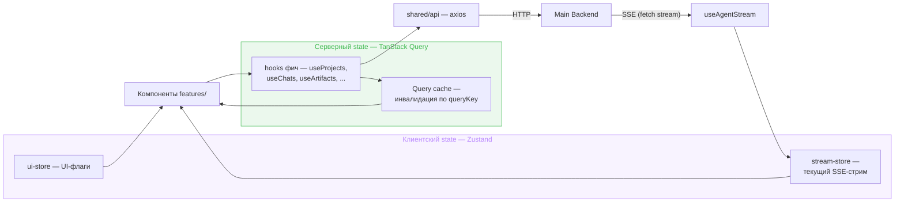
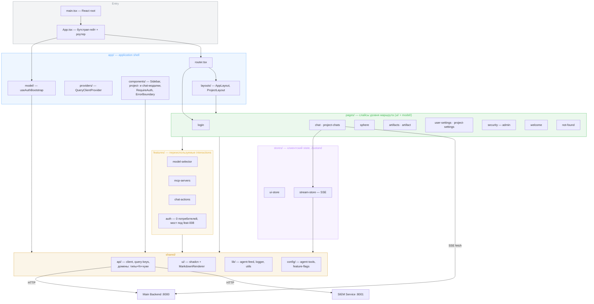

# Frontend

Архитектура верхнего уровня и стек — в [vision.md](../vision.md). Здесь — детальное описание фронтенда: экраны и навигация, компоненты, state management, API-интеграция, SSE-стриминг.

## Экраны и навигация

### Навигационная модель

Chat-first SPA с постоянным sidebar. Паттерн навигации: **Sidebar → Project → Chats/Sphere/Artifacts → Chat**. Референсы: ChatGPT Projects, Claude.ai Projects — знакомый пользователям паттерн.

### Layout

```
┌──────────┐ ┌────────────────────────────────────────────┐
│ Sidebar  │ │                                            │
│ (const)  │ │  Центральная область                       │
│          │ │  (меняется в зависимости от маршрута)       │
│          │ │                                            │
│          │ │                                            │
│          │ │                                            │
└──────────┘ └────────────────────────────────────────────┘
```

**Sidebar (постоянный):**
- New chat (доступна с любого экрана — открывает модалку выбора проекта, даже когда пользователь уже внутри проекта; пустой список проектов → empty-state с переходом в создание проекта) / New project
- Список проектов пользователя
- Recents — недавние чаты (быстрое переключение между чатами разных проектов; rename/delete через `ChatActions`)

**Центральная область** — контент текущего маршрута.

### Маршруты

| Маршрут | Центральная область |
|---------|---------------------|
| `/login` | Вход/регистрация — публичный маршрут вне guard'а (§ Layout ниже); неаутентифицированный доступ к любому другому маршруту редиректит сюда |
| `/` | Welcome (без input; чат создаётся на странице проекта или через композер) |
| `/settings` | Пользовательские настройки: модель, инструкции, память, MCP серверы |
| `/projects/:id` | Проект: табы **Chats** / **Sphere** / **Artifacts** / **Settings** |
| `/projects/:id/chats/new` | Композер: draft-режим чата до отправки первого сообщения (записи в БД ещё нет) |
| `/projects/:id/chats/:cid` | Чат: ChatHeader (← project, model selector, tools dialog) + сообщения + SSE-стриминг + input |
| `/projects/:id/sphere` | Knowledge Sphere: просмотр и редактирование (Markdown) |
| `/projects/:id/artifacts` | Дерево артефактов проекта; выбранный файл (`?path=`) — во вложенном `index`-роуте |
| `/projects/:id/settings` | Настройки проекта: model override, MCP серверы |
| `/security` | Мониторинг безопасности (admin-only, RBAC guard): Events / Alerts / Rules. Маршрут существует только при включённом флаге `SIEM_ENABLED`; несимметричное поведение по намерению — флаг выключен → маршрута нет, попадает под catch-all 404, флаг включён + не-admin → редирект на `/` от `SecurityRouteGuard`, не 404 |
| `*` (любой непойманный путь внутри `AppLayout`) | Брендовый 404 (`pages/not-found`) — не редирект, sidebar остаётся видимым |

### Экраны

**Вход (`/login`):** режимы вход/регистрация одной формы (парольная, как раньше в `AuthGate`) + блок кнопок провайдеров по составу `GET /api/auth/providers` (пусто, если гео-gate не оставил ни одного — форма при этом не блокируется). Клик по кнопке провайдера — полный переход браузера на `/api/auth/oauth/{provider}/authorize`, не fetch. `?error=<код>` из OAuth-редиректа — инлайн-сообщение по закрытому реестру кодов. Backend-механика (гео-gate, cookie `oauth_flow`, реестр кодов) — [auth.md](auth.md#oauth-вход).

**Главная (`/`):** welcome-экран без input. Проекты доступны через sidebar; создание чата — с поля первого сообщения на странице проекта или через кнопку «+ Новый чат» в sidebar (модалка выбора проекта → композер).

**Проект (`/projects/:id`):** имя проекта, поле первого сообщения для нового чата в этом проекте (не поле названия — само название генерируется после отправки), табы:
- **Chats** (default) — список чатов проекта (название, превью, дата; rename/delete через `ChatActions`)
- **Sphere** — Knowledge Sphere
- **Artifacts** — артефакты проекта
- **Settings** — настройки проекта (model override, MCP серверы)

Табы Sphere, Artifacts, Settings — те же экраны, что и по прямым маршрутам, но встроены в контекст проекта через табы.

**Чат (`/projects/:id/chats/:cid`):** полноценный chat view на всю центральную область. Sidebar остаётся для навигации назад.

**Композер (`/projects/:id/chats/new`):** draft-режим того же chat view — пустая история, заголовок «Новый чат», обычный `ChatInput`; thread-scoped контролы (селектор модели, чип MCP-инструментов) скрыты — чата в БД ещё нет. Отправка первого сообщения создаёт чат (`POST /projects/:id/chats`, без тела) и однократно переводит на `/projects/:id/chats/{thread_id}` с авто-отправкой этого сообщения.

**Модалка выбора проекта:** открывается кнопкой «+ Новый чат» в sidebar с любого экрана. Список проектов пользователя — клик ведёт в композер выбранного проекта; пустой список — empty-state с переходом в создание проекта (переиспользует модалку создания проекта).

**Создание проекта:** модалка поверх текущего экрана. Один input (название) + кнопка создания. При необходимости расширяется дополнительными полями.

## Компонентная архитектура

Организация по FSD: код группируется по слоям и слайсам (`pages/` — экраны маршрутов, `features/` — переиспользуемые interactions), не по техническим типам. Раскладка по дереву — в [Module Structure](#module-structure) ниже; ниже — функциональное описание экранов и компонентов.

### Layout

- **RequireAuth** — guard на layout-маршруте, оборачивающем всё приложение кроме `/login`: неаутентифицированного редиректит на `/login` с сохранением исходного пути. Вердикт нереактивный (синхронное чтение access token). Подробнее — [auth.md](auth.md#вход-страница-login-guard-requireauth-бутстрап).
- **useAuthBootstrap** (`app/model/`) — app-уровневый hook, гейтит монтирование всех маршрутов до однократной проверки/тихого refresh сессии.
- **AppLayout** — корневой layout: sidebar + центральная область. Рендерится на всех маршрутах.
- **Sidebar** — проекты пользователя, recents, кнопки создания (new chat / new project), user footer с logout.
- **ProjectLayout** — обёртка для project-level маршрутов: имя проекта, табы (Chats / Sphere / Artifacts / Settings).

### Features

**projects** — CRUD проектов.
- Список проектов (элементы sidebar)
- Модалка создания проекта
- Карточка проекта в sidebar (с контекстным меню rename/delete)

**chat** — ядро приложения.
- ChatHeader — название чата (посимвольная печать через `TypedTitle` при замене плейсхолдера сгенерированным title), ссылка на проект, model selector (dropdown per-thread), tools dialog; в draft-режиме (`chats/new`) — заголовок всегда «Новый чат», model selector и tools dialog не рендерятся
- Список сообщений (scroll, auto-scroll при стриминге)
- Сообщение — user и assistant рендерятся по-разному: ассистентское собирается из `parts` хода (текстовые блоки — Markdown через Streamdown, блоки действий — лента активности), при пустых `parts` остаётся плоский рендер по `content`
- Input с отправкой (Enter / кнопка); в draft-режиме — тот же компонент, отправка создаёт чат и однократно переигрывает сообщение на новом маршруте
- Лента активности (`ActivityFeed` / `ActivityRow` / `ActivityDetails`) — след работы агента: строки рассуждений, вызовов инструментов и доменных записей с человекочитаемой подписью из реестра `shared/config/agent-tools.ts`, статусом, длительностью и разворотом в зоны «Вызов» / «Результат»; шаги субагента идут вложенной лентой внутри строки его вызова. Один и тот же компонент рисует живой ход и сохранённый — данные у них одной формы (см. [streaming.md](streaming.md#frontend-потребление-стрима))
- Живые элементы ленты: бегущие точки и счётчик времени у идущего действия (`LiveDots`), строка-пауза в любом промежутке хода без движения (`ActivityPauseRow`), индикатор ревью ответа (`ReviewIndicator`)
- Чем закончился ход, если он закончился не ответом (`StreamEndNotice`): нейтральная «Генерация остановлена» на отмене и generic-карточка на security-блокировке (деталей блокировки контракт не отдаёт). Единственная красная плашка в чате — ошибка соединения
- Карточка артефакта (инлайн в чате) — рендерится из typed part `ArtifactPart` хода (не из отдельного поля сообщения), последним блоком после текста ответа: порядок задаёт бэкенд составом `parts` (→ [streaming.md § История: typed parts](streaming.md#история-typed-parts)), фронт рисует их как есть. С бейджем «обновлён · +N −M» при перезаписи существующего пути; категория превью (картинка vs иконка) — по словарю расширений `shared/lib/artifact-category.ts`, общему с вьюером и списком артефактов
- Чипы вложений пользователя — некликабельный ряд над текстом user-сообщения, из metadata сообщения (не парсинг текста); композер (скрепка, drag&drop, клиентский чип с прогрессом до отправки) — см. «Вложения» ниже
- Плейсхолдер генерации изображения — выводится из ленты, а не из отдельного состояния: незакрытый вызов `generate_image` даёт pending-карточку (шиммер, indeterminate-прогресс), результат того же вызова её снимает
- Кнопка cancel
- Tools dialog — просмотр и управление MCP серверами per-thread (inherited + собственные, toggle)

**chat-actions** — rename/delete чата, переиспользуется на 2+ хостах (список чатов проекта, recents в sidebar).
- Dropdown по hover (`MoreHorizontal`) → «Переименовать» (диалог с полем) / «Удалить» (диалог-подтверждение, destructive)
- Доступны и для `security_blocked` чатов — блокировка ограничивает только продолжение диалога (`POST /messages`), не управление самим чатом
- Удаление открытого чата — переход на страницу проекта

**settings** — пользовательские настройки и per-scope конфигурация.
- SettingsPage (`/settings`) — user-level: ModelSelector, CustomInstructionsSection, AgentMemorySection, SkillContextSection, MCPServersSection
- ProjectSettingsTab — project-level: ModelSelector, MCPServersSection
- Компоненты переиспользуются на разных уровнях с параметром scope (user / project / thread)
- SkillContextSection — секция «Контекст скиллов»: группировка документов по скиллу, раскрытие в Markdown-превью, правка raw-content, удаление, бейдж для скиллов, отсутствующих в библиотеке
- Подробнее о custom instructions, agent memory и skill context — [user-memory.md](user-memory.md)

**sphere** — Knowledge Sphere. Viewer (Markdown) + Editor (textarea). Подробнее — [knowledge-sphere.md](knowledge-sphere.md).

**artifacts** — артефакты проекта. Идентичность артефакта — путь относительно зоны `artifacts/` (ADR-032), не UUID; список получает от бэкенда плоский набор путей и строит дерево сам.
- Список — дерево: плоский ответ бэкенда группируется на фронте по сегментам пути в раскрывающиеся директории (счётчик — файлы всего поддерева), файлы отсортированы по `updated_at`; выбор строки и вьюер синхронизированы через query-параметр `?path=`, не сегмент маршрута
- Просмотр артефакта — диспетчер по категории из словаря `shared/lib/artifact-category.ts` (расширение → `markdown`/`image`/`text`/`binary`, не по семантической метке): Markdown render + скачивание по фактическому расширению для текстовых типов (`.pdf` как отдельный формат экспорта не существует — PDF стал выходом джобы execution runtime, не бэкенд-фичей); `image` — `ImageViewer` (fetch bytes с JWT → objectURL, зум, скачивание с фактическим расширением); `binary` — шапка метаданных + кнопка «Скачать» без предпросмотра
- Клик по исторической карточке файла, которого больше нет (переименован/удалён агентом) — явное состояние «Файл больше не существует» (`isArtifactNotFound`), отдельное от сетевой/5xx-ошибки

**security** — admin-only мониторинг SIEM-подсистемы. Подробнее о backend-стороне — [backend.md](backend.md#siem-service), [observability.md](observability.md#siem-observability-security-event-pipeline).
- SecurityPage (`/security`) — три таба: Events, Alerts, Rules
- SecurityRouteGuard — guard на `is_admin` claim из JWT (читает `/auth/me` с fallback на декодирование токена); non-admin → редирект
- SecurityEvents — таблица событий с фильтрами (event_type, severity, time range), пагинация, диалог Details
- SecurityAlerts — таблица алертов с фильтрами (severity, status), действия `Acknowledge` / `Resolve`
- SecurityRules — таблица rules с CRUD через RuleForm (Threshold / Sequence / Aggregate), toggle `enabled`
- Сейчас отображает `user_id` напрямую, без username enrichment

**вложения** — file attachments композера (design-brief § Вложения пользователя), три точки входа: `ChatInput` (чат), `ChatDraft` (draft-режим, переиспользует `ChatInput`), поле первого сообщения `ChatList` (project-chats, свой composer shell). Общая логика вынесена в `shared`, так как кросс-импорт между слайсами `pages` запрещён FSD-границами:
- Тайминг — ничего не уходит на сервер до отправки сообщения: скрепка/drag&drop добавляют файл в чисто клиентское состояние композера (`shared/lib/use-composer-attachments.ts`, `use-file-drop.ts`), чип с прогрессом и ✕ — презентационные `shared/ui/AttachmentChip.tsx`/`DragOverlay.tsx`
- Отправка: файлы грузятся (`shared/api/uploads.ts`, `uploadFile` — multipart `POST /projects/:id/uploads`, императивный вызов без TanStack Query — вложения только пишутся, кэшировать нечего) до создания оптимистичной копии сообщения; пути загруженных файлов уходят в теле `POST /messages` рядом с текстом
- Чип в истории — некликабельный ряд над текстом user-сообщения, из metadata сообщения (`Message.attachments: {path, title}[]`), без размера; отдельная от карточки артефакта иконка (файл без «читаемого» агентом содержимого на месте, а не выход агента)

### Shared

- **ui/** — shadcn/ui примитивы (Button, Input, Dialog, Tabs, ScrollArea и т.д.)
- **MarkdownRenderer** — обёртка над Streamdown. Переиспользуется в chat (ответы агента), sphere (просмотр), artifacts (просмотр)
- **StateScreen / LoadingState / ErrorCard / Skeleton** — единая система состояний «не-контента» (loading/error/empty). Контракт — [design-system.md § Error UX](design-system.md#error-ux)

## State Management

Серверные данные не дублируются в клиентский store. Активный таб, текущий проект/чат — derived from URL (React Router `useParams`), store не нужен.

Две оси состояния и путь данных к компонентам:



### TanStack Query — серверный state

Кеширование, рефетч, loading/error — автоматически. Query keys иерархические, для префиксной инвалидации.

**Источник истины по ключам — фабрика `shared/api/query-keys.ts`** (объект `queryKeys`); инлайн-литералов в хуках нет. Таблица ниже отражает её структуру.

**Queries:**

| Фабрика | Ключ | Endpoint |
|---------|------|----------|
| `queryKeys.projects.all` | `["projects"]` | `GET /projects` |
| `queryKeys.projects.detail(id)` | `["projects", id]` | `GET /projects/:id` |
| `queryKeys.projects.chats(id)` | `["projects", id, "chats"]` | `GET /projects/:id/chats` |
| `queryKeys.projects.chat(id, cid)` | `["projects", id, "chats", cid]` | `GET /projects/:id/chats/:cid` |
| `queryKeys.projects.sphere(id)` | `["projects", id, "sphere"]` | `GET /projects/:id/sphere` |
| `queryKeys.projects.artifacts(id)` | `["projects", id, "artifacts"]` | `GET /projects/:id/artifacts` |
| `queryKeys.projects.artifact(id, path)` | `["projects", id, "artifacts", path]` | `GET /projects/:id/artifacts?path=…` |
| `queryKeys.projects.artifactMedia(id, path)` | `["projects", id, "artifacts", path, "media"]` | `GET /projects/:id/artifacts/media?path=…` |
| `queryKeys.chats.recent` | `["chats", "recent"]` | `GET /chats/recent` |
| `queryKeys.models` | `["models"]` | `GET /models` |
| `queryKeys.instructions` | `["instructions"]` | `GET /users/me/instructions` |
| `queryKeys.memories` | `["memories"]` | `GET /users/me/memories` |
| `queryKeys.skillContexts` | `["skill-contexts"]` | `GET /users/me/skill-contexts` |
| `queryKeys.settings(scope, projectId?, threadId?)` | `["settings", scope, …]` | settings по scope (user/project/thread) |
| `queryKeys.mcpServers(scope, projectId?, threadId?)` | `["mcp-servers", scope, …]` | mcp-servers по scope |
| `queryKeys.auth.me` | `["auth", "me"]` | `GET /auth/me` (route guard, user footer) |
| `queryKeys.auth.providers` | `["auth", "providers"]` | `GET /auth/providers` (блок кнопок провайдеров на `/login`) |
| `queryKeys.auth.bootstrap` | `["auth", "bootstrap"]` | Внутренний ключ `useAuthBootstrap` (не HTTP-эндпоинт напрямую — дедупликация тихого `POST /auth/refresh` под `StrictMode`) |
| `queryKeys.security.*` | `["security", …]` | SIEM events/alerts/rules (siem-service) |

Settings и MCP-серверы используют единый ключ с осью `scope` (`user` / `project` / `thread`) + `projectId`/`threadId`, отфильтрованными через `.filter(Boolean)` — не отдельные ключи на каждый уровень.

`artifactMedia` — потомок `artifact(id, path)` в иерархии ключей, так что префиксная инвалидация артефакта задевает и media-запись. Путь-идентичность перезаписываема (агент может перезаписать файл по тому же пути), поэтому `staleTime: Infinity` не используется — свежесть держат точечная инвалидация по SSE (см. ниже) и HTTP-ревалидация media-эндпоинта (`ETag`/`Last-Modified` из `mtime`+`size`, `Cache-Control: no-cache` — см. [streaming.md](streaming.md)); карточка ленты и `ImageViewer` читают один и тот же ключ — react-query дедуплицирует сетевой запрос между потребителями.

**Mutations → инвалидация:**

| Действие | Инвалидирует |
|----------|-------------|
| Создать/обновить/удалить проект | `queryKeys.projects.all` |
| Создать чат | `queryKeys.projects.chats(id)` (`exact: true`), `queryKeys.chats.recent` |
| Переименовать чат | `queryKeys.projects.chats(id)` (`exact: true`), `queryKeys.chats.recent`, + точечный `setQueryData`-патч `queryKeys.projects.chat(id, cid)` |
| Удалить чат | `queryKeys.projects.chats(id)` (`exact: true`), `queryKeys.chats.recent` |
| Обновить sphere | `queryKeys.projects.sphere(id)` |
| Событие `title_updated` (стрим) | — `setQueryData`-патч поля `title`, не инвалидация: `queryKeys.projects.chats(id)`, `queryKeys.chats.recent`, `queryKeys.projects.chat(id, cid)` |
| Стрим завершён (`done` / `cancelled` / `error`) | `queryKeys.projects.chat(id, cid)`, `queryKeys.projects.chats(id)` (`exact: true`, fallback на случай непришедшего `title_updated`), `queryKeys.chats.recent`, `queryKeys.projects.artifacts(id)` (`exact: true` — контракт не даёт событий удаления/переименования, список довозится по факту завершения хода) |
| Событие `artifact_created` / `artifact_updated` | `queryKeys.projects.artifact(id, path)` (префикс задевает и `artifactMedia`), `queryKeys.projects.artifacts(id)` (`exact: true`) |
| Обновить settings (any scope) | `queryKeys.settings(scope, …)` |
| Обновить instructions | `queryKeys.instructions` |
| Удалить memory | `queryKeys.memories` |
| Обновить/удалить skill context | `queryKeys.skillContexts` |
| CRUD MCP server (any scope) | `queryKeys.mcpServers(scope, …)` |
| Ack/resolve alert, CRUD rule | `queryKeys.security.alerts` / `queryKeys.security.rules` |

**Инвариант:** любая инвалидация `queryKeys.projects.chats(id)` идёт с `exact: true` — этот ключ является префиксом detail-ключей `queryKeys.projects.chat(id, cid)`, префиксная инвалидация зарефетчила бы открытый чат посреди активного стрима (в т.ч. на своём же `title_updated`/`done`) и задвоила бы optimistic-копию user-сообщения в клиентском стриминговом состоянии.

### Zustand — клиентский state

Два store с разным lifecycle.

**UI Store** — живёт всю сессию:

```
uiStore
├── sidebarOpen: boolean
└── toggleSidebar()
```

**Stream Store** — эфемерный, существует только во время SSE-стрима. Ленту активности держит не он сам: её форма и правила сборки живут чистой моделью `shared/lib/agent-feed.ts` (`AgentFeedState` = `feed` + `redacted`), стор эту модель хранит и отдаёт подписчикам.

```
streamStore
├── isStreaming: boolean
├── streamingChatId: string | null
├── feed: AgentFeedItem[]                          — лента хода: рассуждения, текст, вызовы, доменные события
├── redacted: boolean                              — ход схлопнут в заглушку security-блокировкой
├── isReviewing: boolean
├── startStream(chatId)
├── applyEvent(ownerChatId, event)                 — единственная точка мутации ленты: событие уходит
│                                                     редьюсеру модели, но только для владельца стрима
├── redact(ownerChatId, stubText)                  — терминальная редакция: закрывает стрим, ленту не стирает
├── setReviewing(ownerChatId, value)
├── endStream(ownerChatId)
└── reset()                                        — неохраняемый сброс для cleanup на unmount
```

Скаляров «текущий текст» / «текущий инструмент» в сторе нет — параллельные вызовы адресуются по `call_id` внутри самой ленты и закрываются независимо; всё производное (pending-карточка генерации, активная строка, сигнал автопрокрутки) считается из ленты на рендере.

**Owner-guard.** `ChatThread` не перемонтируется при переключении чата, поэтому поток чата A, не оборванный при переходе на B, может продолжать слать события уже после `startStream(B)`. Четыре охраняемых действия (`applyEvent`, `redact`, `setReviewing`, `endStream`) принимают владельца первым аргументом и сверяют его со `streamingChatId` — несовпадение делает вызов no-op, инвариант держит сам стор, а не дисциплина вызывающего. `reset()` — исключение: неохраняемый сброс для cleanup на unmount, отдельный от `endStream()` намеренно («мой поток закончился» и «экран ушёл» — разная семантика с разной защитой). Причины и границы всей раскладки, а также контракт владельца в колбэках `useAgentStream` — [conventions/frontend.md § Состояние стрима](conventions/frontend.md#состояние-стрима-модель-ленты-чистая-стор--её-держатель).

После `endStream(ownerChatId)`, вызванного владельцем, — сброс в initial state (вызов от уже не владеющего потока — no-op). Полное сообщение приходит с сервера через инвалидацию chat query: сохранённый ход отдаёт `parts`, из которых собирается та же лента.

## API-интеграция

Два транспорта: **axios** для REST (14 endpoints), **fetch** для SSE-стриминга (1 endpoint). SSE требует чтения `ReadableStream` по мере поступления — axios спроектирован под "запрос → полный ответ" и для этого не подходит.

### HTTP-клиент

Единый axios instance: base URL `/api`, `withCredentials: true` (для refresh token cookie). Request interceptor добавляет `Authorization: Bearer` header. Response interceptor: 401 → автоматический refresh + retry. Подробнее о token management, interceptor logic и `ensureFreshToken()` — [auth.md](auth.md).

### TypeScript типы

Ручные, 1:1 со schemas из [backend.md](backend.md). DTO-типы дробятся по доменам и лежат рядом с API-функциями ресурса (`shared/api/<domain>.ts`), а не единым файлом. Generic-envelope `ListResponse<T>` — `shared/api/pagination.ts`, типы SSE-событий — `shared/api/sse.ts`. Генерация из OpenAPI — при росте API.

### API-модули и хуки

По доменному модулю на ресурс в `shared/api/`. Каждый модуль — самодостаточный домен: DTO-типы + API-функции + TanStack Query data-хуки. CRUD/data-fetch — инфраструктура, по FSD её место в `shared/api`, а не в слайсах.

```
shared/api/
├── client.ts        — axios instance, interceptor, ensureFreshToken
├── query-keys.ts    — фабрика queryKeys (единый источник ключей)
├── pagination.ts    — ListResponse<T>
├── sse.ts           — SSEEvent
├── projects.ts      — Project + getProjects… + useProjects, useProject, useCreate/Update/DeleteProject
├── chats.ts         — Chat/ChatDetail/Message… + DEFAULT_CHAT_TITLE/CHAT_TITLE_MAX_LENGTH (доменные
│                       константы плейсхолдера и лимита названия) + createChat (без тела)/updateChat/
│                       deleteChat + useChats, useChat, useCreateChat, useUpdateChat, useDeleteChat,
│                       useRecentChats
├── sphere.ts        — Sphere + getSphere/updateSphere + useSphere, useUpdateSphere
├── artifacts.ts     — Artifact/ArtifactDetail (path-адресация, ADR-032) + getArtifacts/getArtifact/
│                       downloadArtifact/getArtifactMedia + useArtifacts, useArtifact, useArtifactMedia,
│                       isArtifactNotFound
├── uploads.ts       — UploadedFile + uploadFile (POST-only, без data-хука — вложениям нечего кэшировать)
├── models.ts        — AvailableModel + getModels + useModels
├── settings.ts      — Settings… + get/updateSettings + useSettings, useUpdateSettings (per scope)
├── user-memory.ts   — Instructions/MemoryItem + … + useInstructions, useUpdateInstructions, useMemories
├── skill-context.ts — SkillContextDocument/SkillGroup + getSkillContexts/update/delete + useSkillContexts,
│                       useUpdateSkillContext, useDeleteSkillContext
├── mcp-servers.ts   — MCPServer… + CRUD per scope + useMCPServers, useMCPServerMutations
├── feedback.ts      — setFeedback, deleteFeedback
├── auth.ts          — register/login/refresh/getMe/logout + getAuthProviders/useAuthProviders
└── security.ts      — SIEM типы + siemClient + listEvents/Alerts/Rules… + useEvents, useAlerts, useRules, …
```

Без `messages.ts` — отправка сообщений через SSE (см. ниже). Компоненты вызывают хуки, не API-функции напрямую. Страница-специфичная оркестрация (SSE-стрим) живёт в слайсе: `pages/chat/model/useAgentStream.ts`.

**downloadArtifact** — axios blob download с Bearer token (через interceptor). Не через TanStack Query (императивный вызов из onClick).

**getArtifactMedia / useArtifactMedia** — тот же `responseType: "blob"`-паттерн, но через TanStack Query (не императивный вызов): `` не шлёт Authorization header, поэтому картинка качается как обычные API-данные (Blob) и превращается в `URL.createObjectURL` на стороне потребителя (`ImageViewer`, превью в `ArtifactCard`), а не отдаётся напрямую браузеру по URL. `isArtifactNotFound` — типизированный предикат по `AxiosError.status === 404`, общий для detail и media, отличает «файла больше нет» от сетевой/5xx-ошибки для выбора пустого состояния во вьюере и в карточке истории.

## SSE-стриминг

Кастомный хук `useAgentStream` поверх native `fetch`. Полная спецификация протокола, event types, lifecycle, cancellation — [streaming.md](streaming.md).

Связь с frontend state: событие целиком уходит в модель ленты, Zustand stream store держит результат, TanStack Query инвалидируется после `done`/`cancelled`/`error` и `artifact_created`/`artifact_updated` (таблица в секции State Management выше). `security_block` — terminal event ([architecture.md](../security/architecture.md)): см. Security UX ниже.

Хук отвечает и за живучесть транспорта: между чтениями тела потока он уступает событийному циклу, иначе накопленный сервером бэклог, приехавший разом, упирается в сторож вложенных обновлений React и рвёт ход целиком — механизм и замеры в [conventions/frontend.md § Состояние стрима](conventions/frontend.md#состояние-стрима-модель-ленты-чистая-стор--её-держатель).

## Security UX

Frontend различает две точки взаимодействия с системой защиты — runtime (чат) и add-time (формы записи).

**Runtime block (чат).** На SSE `security_block` хук агент-стрима делает оптимистичный patch `chat.security_blocked=true` и инвалидирует кеш чата. ChatInput блокируется кастомным placeholder'ом «Чат заблокирован системой безопасности»; ход закрывается generic-карточкой «остановлен системой безопасности» (не красной — красная плашка остаётся за ошибкой соединения), а заглушка `Message.redacted` приезжает из истории и переживает reload — единый источник правды, без транзиентного error-баннера. Причины блокировки в UI нет и быть не может: payload события пустой, `checkpoint` / `detection_layer` не покидают сервер.

**Add-time block (формы записи).** Custom Instructions, Knowledge Sphere editor, MCP server form: при HTTP 422 с маркером security violation (helper `isSecurityViolation(error)`) форма показывает inline-сообщение под кнопкой Save. Текст в форме не сбрасывается — пользователь редактирует и пробует ещё раз. Конкретная причина детекции в UI не раскрывается.

## Дизайн-система и темизация

Визуальный язык продукта — система «Чернила / Электрик»: тёплая бумажная основа, один плоский фиолетовый акцент, serif-акценты, Сфера-орб как ядро бренда. Токены light/dark, типографика, бренд-примитивы (`Wordmark`, `SphereOrb`), иллюстрации и error UX — в [design-system.md](design-system.md). Здесь — только точки интеграции:

- **Темизация.** Тема — клиентское состояние `stores/theme-store.ts` (Zustand + persist, ключ `learnflow-theme`); переключение вешает класс `.dark` на `<html>`, no-FOUC инлайн-скрипт в `index.html`. Переключатель — в user-строке Sidebar.
- **Иллюстрации.** Сцены (welcome-hero, sidebar-vignette, empty-states, error-state, not-found, artifacts-select, auth-hero) идут через централизованную карту `shared/assets/illustrations/index.ts` (обёртка `shared/ui/Illustration`) — единственная точка свапа ассетов.
- **Error UX.** Единая система состояний «не-контента» — `StateScreen`/`LoadingState`/`ErrorCard`/`Skeleton` (`shared/ui/StateScreen.tsx`, `shared/ui/skeleton.tsx`); тосты `sonner` остаются отдельным каналом за мутациями. Контракт — [design-system.md § Error UX](design-system.md#error-ux).

## Стек и инструменты

Обоснование выбора, альтернативы и риски — в [ADR-008](adr/ADR-008-frontend-stack.md). Визуальный язык и токены — в [design-system.md](design-system.md).

| Категория | Технология |
|-----------|-----------|
| Сборка | Vite |
| Язык | TypeScript (strict mode) |
| UI-компоненты | shadcn/ui |
| Стилизация | Tailwind CSS v4 |
| HTTP-клиент (REST) | axios |
| HTTP-клиент (SSE) | native fetch |
| Серверный state | TanStack Query v5 |
| UI state | Zustand v5 |
| Роутинг | React Router v7 (library mode) |
| Markdown/стриминг | Streamdown |
| Тосты/уведомления | sonner |
| Шрифты | @fontsource (Source Serif 4, Instrument Sans, IBM Plex Mono) |
| Иконки | Lucide React |
| Линтер | ESLint |
| Форматер | Prettier |

## Module Structure

Слои FSD показаны цветными подложками поверх компонентов и их связей. Импорт строго вниз по слоям: `app → pages → features → shared`; `stores/` — cross-cutting клиентское состояние.



Структура каноническая по FSD с осознанными отступлениями (зафиксированы в [conventions/frontend.md](conventions/frontend.md#frontend)): `stores/` на верхнем уровне (`stream-store` cross-feature), `shared/` импортируется по доменным файлам без barrel-индексов, слои `widgets/` и `entities/` не вводятся, `features/auth` временно без потребителей — презентационный мост под каркас параллельной итерации feat-008.

```
frontend/
├── index.html
├── vite.config.ts
├── tsconfig.json
├── components.json                — shadcn/ui конфиг
│
├── src/
│   ├── main.tsx                   — entry point: React root, providers
│   ├── App.tsx                    — бутстрап-гейт (useAuthBootstrap) + роутер
│   ├── index.css                  — Tailwind + shadcn theme variables
│   │
│   ├── app/                       — application shell
│   │   ├── layouts/               — AppLayout (sidebar + центр), ProjectLayout (табы)
│   │   ├── components/            — Sidebar, ProjectList/ProjectCard/ProjectActions/
│   │   │                            CreateProjectModal, NewChatModal (модалка выбора проекта,
│   │   │                            единственный хост — Sidebar), RequireAuth, ErrorBoundary
│   │   ├── model/                 — useAuthBootstrap (app-уровневый бутстрап сессии)
│   │   ├── providers/             — QueryClientProvider, прочие провайдеры
│   │   └── router.tsx             — конфигурация маршрутов (`/login` — публичный, вне RequireAuth);
│   │                                `ArtifactsViewerSlot` — диспетчер
│   │                                `?path=` → `<ArtifactView/>`/пустое состояние, вложенным
│   │                                index-роутом под `artifacts` (`pages/artifacts` не может
│   │                                импортировать `pages/artifact` напрямую — FSD-граница
│   │                                `boundaries/dependencies` запрещает кросс-слайс внутри `pages`)
│   │
│   ├── pages/                     — слайсы уровня маршрута (ui/ + при нужде model/), public API в index.ts
│   │   ├── login/                 — /login (парольная форма + блок кнопок провайдеров)
│   │   ├── welcome/               — /
│   │   ├── project-chats/         — /projects/:id (ChatList — список + поле первого сообщения + вложения)
│   │   ├── chat/                  — /projects/:id/chats/:cid, /projects/:id/chats/new
│   │   │   ├── ui/                — ChatView (тонкий диспетчер по наличию `cid`) → ChatThread
│   │   │   │                        (обычный режим) | ChatDraft (композер, без useChat/
│   │   │   │                        useAgentStream/useStudio); ChatHeader (проп `draft`),
│   │   │   │                        ChatInput (скрепка/drag&drop вложений, опциональный
│   │   │   │                        контролируемый режим value/onValueChange), MessageList,
│   │   │   │                        MessageItem (чипы вложений + карточки ArtifactPart),
│   │   │   │                        ActivityFeed/ActivityRow/ActivityDetails (лента активности),
│   │   │   │                        ActivityPauseRow, LiveDots, StreamEndNotice, ReviewIndicator,
│   │   │   │                        ArtifactCard, FeedbackButtons
│   │   │   └── model/             — useAgentStream (SSE-оркестрация)
│   │   ├── sphere/                — /projects/:id/sphere (SphereView/Viewer/Editor)
│   │   ├── artifacts/             — /projects/:id/artifacts (ArtifactList — дерево по `?path=`)
│   │   ├── artifact/              — вложенный index-роут artifacts (ArtifactView, диспетчер
│   │   │                            по `?path=`; ImageViewer — единственный нетекстовый вьюер)
│   │   ├── user-settings/         — /settings (SettingsPage, CustomInstructions, AgentMemory, SkillContext)
│   │   ├── project-settings/      — /projects/:id/settings (ProjectSettingsPage)
│   │   ├── security/              — /security, admin (SecurityPage, RouteGuard, Events/Alerts/Rules,
│   │   │                            RuleForm, Filter, Pagination, Severity/StatusBadge)
│   │   └── not-found/             — catch-all `path="*"` внутри AppLayout (NotFoundPage, брендовый 404)
│   │
│   ├── features/                  — переиспользуемые interactions (2+ страниц), public API в index.ts
│   │   ├── model-selector/        — ModelSelector (chat + user/project settings)
│   │   ├── mcp-servers/           — MCPServersSection (+ MCPServerForm, приватный)
│   │   ├── chat-actions/          — ChatActions (rename/delete dropdown + диалоги; хосты —
│   │   │                            project-chats/ChatList и app/components/Sidebar recents)
│   │   └── auth/                  — LoginScreenView (презентационная сборка входа/регистрации,
│   │                                без auth-логики); осознанное исключение из критерия 2+ страниц —
│   │                                мост под каркас параллельной итерации feat-008, сегодня ноль
│   │                                потребителей (design-brief feat-013 § 8)
│   │
│   ├── shared/
│   │   ├── api/                   — HTTP-слой: домен = типы + API-функции + data-хуки
│   │   │   ├── client.ts          — axios instance, interceptor, ensureFreshToken
│   │   │   ├── query-keys.ts      — фабрика queryKeys (единый источник ключей)
│   │   │   ├── pagination.ts      — ListResponse<T>
│   │   │   ├── sse.ts             — SSEEvent
│   │   │   ├── projects.ts  chats.ts  sphere.ts  artifacts.ts  uploads.ts  models.ts
│   │   │   ├── settings.ts  user-memory.ts  skill-context.ts  mcp-servers.ts  feedback.ts  auth.ts
│   │   │   └── security.ts        — SIEM типы + siemClient + хуки (siem-service API)
│   │   ├── ui/                    — shadcn/ui примитивы + MarkdownRenderer + TypedTitle
│   │   │                            (посимвольная печать auto-title, домен-нейтральный) + система
│   │   │                            состояний StateScreen/LoadingState/ErrorCard/skeleton +
│   │   │                            брендовые примитивы auth-экрана AuthLayout/ProviderButton +
│   │   │                            AttachmentChip, DragOverlay (композер вложений)
│   │   ├── assets/                — illustrations/{light,dark}/ (растровые сцены по теме) +
│   │   │                            index.ts (карта getIllustration(scene, theme))
│   │   ├── config/                — agent-tools (реестр подписей инструментов, включая
│   │   │                            read_file/write_file/list_files/execute_code/run_command),
│   │   │                            feature-flags (гейт незрелых фич)
│   │   └── lib/                   — утилиты (logger, utils, security-error) + agent-feed
│   │                                (модель ленты активности: редьюсер SSE, адаптер parts) +
│   │                                artifact-category (словарь расширение → категория вьюера) +
│   │                                use-composer-attachments, use-file-drop (состояние вложений
│   │                                композера, переиспользуются между тремя точками входа)
│   │
│   └── stores/                    — Zustand stores (ui-store, stream-store)
```

**Принципы:** `pages/` — композиция уровня маршрута, каждая изолирована и закрыта `index.ts`. `features/` — только реально переиспользуемое между страницами (`model-selector`, `mcp-servers`, `chat-actions`); кросс-импортов между слайсами одного слоя нет — страницы тянут общие куски вниз, из `features/`. Компонент с одним хостом (`NewChatModal`) остаётся в `app/components/`, а не заводит `features/` — критерий 2+ страниц не выполнен. Осознанное исключение — `features/auth`: `LoginScreenView` заведён туда решением архитектора как презентационный мост под каркас параллельной итерации feat-008, сегодня без единого потребителя в `pages/`; критерий 2+ страниц здесь не выполнен намеренно, не по недосмотру (design-brief feat-013 § 8) — feat-008 соберёт из него `pages/login` при merge. `shared/api` держит data-хуки и фабрику ключей. `app/` — shell (layouts, providers, router, постоянный Sidebar с управлением проектами), не бизнес-логика. `stores/` отдельно — `stream-store` cross-feature.

## Logging

Backend observability (Langfuse, tracing, feedback loop) — [observability.md](observability.md).

### Logger-обёртка

`frontend/src/shared/lib/logger.ts` — обёртка над `console.*` с фильтрацией по уровню.

- **Dev** (`import.meta.env.DEV`): debug, info, warn, error — все видны
- **Prod**: только warn и error

```typescript
import { logger } from "@/shared/lib/logger";

logger.info("event description", data);
logger.error("[context]", error);
```

Отдельная `VITE_LOG_LEVEL` не нужна — `DEV`/`PROD` из Vite достаточно (compile-time).

### Error Boundary

`frontend/src/app/components/ErrorBoundary.tsx` — React class component, оборачивает корень приложения. При непойманной ошибке рендера показывает брендовый fallback — композиция `StateScreen` (иллюстрация `error-state` + сообщение + кнопка «обновить страницу») вместо белого экрана; своей вёрстки не несёт, вся форма приходит из `StateScreen`. `componentDidCatch` по-прежнему логирует ошибку через `logger.error`. Ошибки API доводятся тостами `sonner` (мутации) и `ErrorCard`/инлайн-состояниями per-query — см. [design-system.md § Error UX](design-system.md#error-ux).
