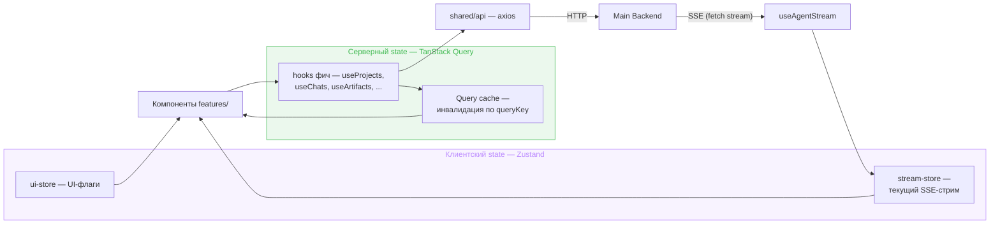
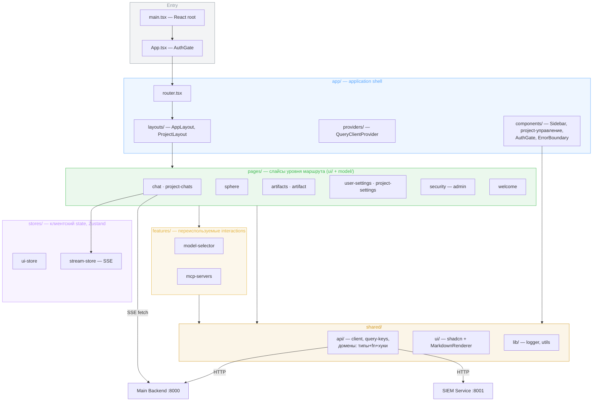

# Frontend

Архитектура верхнего уровня и стек — в [vision.md](../vision.md). Здесь — детальное описание фронтенда: экраны и навигация, компоненты, state management, API-интеграция, SSE-стриминг.

## Экраны и навигация

### Навигационная модель

Chat-first SPA с постоянным sidebar. Паттерн навигации: **Sidebar → Project → Chats/Sphere/Artifacts → Chat**. Референсы: ChatGPT Projects, Claude.ai Projects — знакомый пользователям паттерн.

### Layout

```
┌──────────┐ ┌────────────────────────────────────────────┐
│ Sidebar  │ │                                            │
│ (const)  │ │  Центральная область                       │
│          │ │  (меняется в зависимости от маршрута)       │
│          │ │                                            │
│          │ │                                            │
│          │ │                                            │
└──────────┘ └────────────────────────────────────────────┘
```

**Sidebar (постоянный):**
- New chat (активна только в контексте проекта — project_id из URL) / New project
- Список проектов пользователя
- Recents — недавние чаты (быстрое переключение между чатами разных проектов)

**Центральная область** — контент текущего маршрута.

### Маршруты

| Маршрут | Центральная область |
|---------|---------------------|
| `/` | Welcome (без input — создание чата только из проекта) |
| `/settings` | Пользовательские настройки: модель, инструкции, память, MCP серверы |
| `/projects/:id` | Проект: табы **Chats** / **Sphere** / **Artifacts** / **Settings** |
| `/projects/:id/chats/:cid` | Чат: ChatHeader (← project, model selector, tools dialog) + сообщения + SSE-стриминг + input |
| `/projects/:id/sphere` | Knowledge Sphere: просмотр и редактирование (Markdown) |
| `/projects/:id/artifacts` | Список артефактов проекта |
| `/projects/:id/artifacts/:aid` | Просмотр артефакта + скачивание (md/pdf) |
| `/projects/:id/settings` | Настройки проекта: model override, MCP серверы |
| `/security` | Мониторинг безопасности (admin-only, RBAC guard): Events / Alerts / Rules |

### Экраны

**Главная (`/`):** welcome-экран без input. Создание чата — только из контекста проекта (`/projects/:id`). Проекты доступны через sidebar.

**Проект (`/projects/:id`):** имя проекта, input для нового чата в этом проекте, табы:
- **Chats** (default) — список чатов проекта (название, превью, дата)
- **Sphere** — Knowledge Sphere
- **Artifacts** — артефакты проекта
- **Settings** — настройки проекта (model override, MCP серверы)

Табы Sphere, Artifacts, Settings — те же экраны, что и по прямым маршрутам, но встроены в контекст проекта через табы.

**Чат (`/projects/:id/chats/:cid`):** полноценный chat view на всю центральную область. Sidebar остаётся для навигации назад.

**Создание проекта:** модалка поверх текущего экрана. Один input (название) + кнопка создания. При необходимости расширяется дополнительными полями.

## Компонентная архитектура

Организация по FSD: код группируется по слоям и слайсам (`pages/` — экраны маршрутов, `features/` — переиспользуемые interactions), не по техническим типам. Раскладка по дереву — в [Module Structure](#module-structure) ниже; ниже — функциональное описание экранов и компонентов.

### Layout

- **AuthGate** — app-level auth gate: блокирующая модалка login/register если не аутентифицирован. Подробнее — [auth.md](auth.md).
- **AppLayout** — корневой layout: sidebar + центральная область. Рендерится на всех маршрутах.
- **Sidebar** — проекты пользователя, recents, кнопки создания (new chat / new project), user footer с logout.
- **ProjectLayout** — обёртка для project-level маршрутов: имя проекта, табы (Chats / Sphere / Artifacts / Settings).

### Features

**projects** — CRUD проектов.
- Список проектов (элементы sidebar)
- Модалка создания проекта
- Карточка проекта в sidebar (с контекстным меню rename/delete)

**chat** — ядро приложения.
- ChatHeader — название чата, ссылка на проект, model selector (dropdown per-thread), tools dialog
- Список сообщений (scroll, auto-scroll при стриминге)
- Сообщение — user и assistant рендерятся по-разному (assistant → Markdown через Streamdown)
- Input с отправкой (Enter / кнопка)
- Индикаторы: стриминг текста, tool use (`tool_start`/`tool_end`)
- Карточка артефакта (инлайн в чате, по событию `artifact_created`)
- Кнопка cancel
- Tools dialog — просмотр и управление MCP серверами per-thread (inherited + собственные, toggle)

**settings** — пользовательские настройки и per-scope конфигурация.
- SettingsPage (`/settings`) — user-level: ModelSelector, CustomInstructionsSection, AgentMemorySection, MCPServersSection
- ProjectSettingsTab — project-level: ModelSelector, MCPServersSection
- Компоненты переиспользуются на разных уровнях с параметром scope (user / project / thread)
- Подробнее о custom instructions и agent memory — [user-memory.md](user-memory.md)

**sphere** — Knowledge Sphere. Viewer (Markdown) + Editor (textarea). Подробнее — [knowledge-sphere.md](knowledge-sphere.md).

**artifacts** — артефакты проекта.
- Список артефактов (название, тип, дата)
- Просмотр артефакта (Markdown render + кнопки скачивания md/pdf)

**security** — admin-only мониторинг SIEM-подсистемы. Подробнее о backend-стороне — [backend.md](backend.md#siem-service), [observability.md](observability.md#siem-observability-security-event-pipeline).
- SecurityPage (`/security`) — три таба: Events, Alerts, Rules
- SecurityRouteGuard — guard на `is_admin` claim из JWT (читает `/auth/me` с fallback на декодирование токена); non-admin → редирект
- SecurityEvents — таблица событий с фильтрами (event_type, severity, time range), пагинация, диалог Details
- SecurityAlerts — таблица алертов с фильтрами (severity, status), действия `Acknowledge` / `Resolve`
- SecurityRules — таблица rules с CRUD через RuleForm (Threshold / Sequence / Aggregate), toggle `enabled`
- Сейчас отображает `user_id` напрямую, без username enrichment

### Shared

- **ui/** — shadcn/ui примитивы (Button, Input, Dialog, Tabs, ScrollArea и т.д.)
- **MarkdownRenderer** — обёртка над Streamdown. Переиспользуется в chat (ответы агента), sphere (просмотр), artifacts (просмотр)

## State Management

Серверные данные не дублируются в клиентский store. Активный таб, текущий проект/чат — derived from URL (React Router `useParams`), store не нужен.

Две оси состояния и путь данных к компонентам:



### TanStack Query — серверный state

Кеширование, рефетч, loading/error — автоматически. Query keys иерархические, для префиксной инвалидации.

**Источник истины по ключам — фабрика `shared/api/query-keys.ts`** (объект `queryKeys`); инлайн-литералов в хуках нет. Таблица ниже отражает её структуру.

**Queries:**

| Фабрика | Ключ | Endpoint |
|---------|------|----------|
| `queryKeys.projects.all` | `["projects"]` | `GET /projects` |
| `queryKeys.projects.detail(id)` | `["projects", id]` | `GET /projects/:id` |
| `queryKeys.projects.chats(id)` | `["projects", id, "chats"]` | `GET /projects/:id/chats` |
| `queryKeys.projects.chat(id, cid)` | `["projects", id, "chats", cid]` | `GET /projects/:id/chats/:cid` |
| `queryKeys.projects.sphere(id)` | `["projects", id, "sphere"]` | `GET /projects/:id/sphere` |
| `queryKeys.projects.artifacts(id)` | `["projects", id, "artifacts"]` | `GET /projects/:id/artifacts` |
| `queryKeys.projects.artifact(id, aid)` | `["projects", id, "artifacts", aid]` | `GET /projects/:id/artifacts/:aid` |
| `queryKeys.chats.recent` | `["chats", "recent"]` | `GET /chats/recent` |
| `queryKeys.models` | `["models"]` | `GET /models` |
| `queryKeys.instructions` | `["instructions"]` | `GET /users/me/instructions` |
| `queryKeys.memories` | `["memories"]` | `GET /users/me/memories` |
| `queryKeys.settings(scope, projectId?, threadId?)` | `["settings", scope, …]` | settings по scope (user/project/thread) |
| `queryKeys.mcpServers(scope, projectId?, threadId?)` | `["mcp-servers", scope, …]` | mcp-servers по scope |
| `queryKeys.auth.me` | `["auth", "me"]` | `GET /auth/me` (route guard, user footer) |
| `queryKeys.security.*` | `["security", …]` | SIEM events/alerts/rules (siem-service) |

Settings и MCP-серверы используют единый ключ с осью `scope` (`user` / `project` / `thread`) + `projectId`/`threadId`, отфильтрованными через `.filter(Boolean)` — не отдельные ключи на каждый уровень.

**Mutations → инвалидация:**

| Действие | Инвалидирует |
|----------|-------------|
| Создать/обновить/удалить проект | `queryKeys.projects.all` |
| Создать чат | `queryKeys.projects.chats(id)`, `queryKeys.chats.recent` |
| Обновить sphere | `queryKeys.projects.sphere(id)` |
| Стрим завершён (`done`) | `queryKeys.projects.chat(id, cid)`, `queryKeys.chats.recent` |
| Событие `artifact_created` | `queryKeys.projects.artifacts(id)` |
| Обновить settings (any scope) | `queryKeys.settings(scope, …)` |
| Обновить instructions | `queryKeys.instructions` |
| Удалить memory | `queryKeys.memories` |
| CRUD MCP server (any scope) | `queryKeys.mcpServers(scope, …)` |
| Ack/resolve alert, CRUD rule | `queryKeys.security.alerts` / `queryKeys.security.rules` |

### Zustand — клиентский state

Два store с разным lifecycle.

**UI Store** — живёт всю сессию:

```
uiStore
├── sidebarOpen: boolean
└── toggleSidebar()
```

**Stream Store** — эфемерный, существует только во время SSE-стрима:

```
streamStore
├── isStreaming: boolean
├── streamingText: string
├── activeTool: string | null
├── streamingChatId: string | null
├── streamingArtifacts: StreamingArtifact[]
├── startStream(chatId)
├── appendText(chunk)
├── setTool(name | null)
├── addArtifact(artifact)
└── endStream()
```

После `endStream()` — сброс в initial state. Полное сообщение приходит с сервера через инвалидацию chat query.

## API-интеграция

Два транспорта: **axios** для REST (14 endpoints), **fetch** для SSE-стриминга (1 endpoint). SSE требует чтения `ReadableStream` по мере поступления — axios спроектирован под "запрос → полный ответ" и для этого не подходит.

### HTTP-клиент

Единый axios instance: base URL `/api`, `withCredentials: true` (для refresh token cookie). Request interceptor добавляет `Authorization: Bearer` header. Response interceptor: 401 → автоматический refresh + retry. Подробнее о token management, interceptor logic и `ensureFreshToken()` — [auth.md](auth.md).

### TypeScript типы

Ручные, 1:1 со schemas из [backend.md](backend.md). DTO-типы дробятся по доменам и лежат рядом с API-функциями ресурса (`shared/api/<domain>.ts`), а не единым файлом. Generic-envelope `ListResponse<T>` — `shared/api/pagination.ts`, типы SSE-событий — `shared/api/sse.ts`. Генерация из OpenAPI — при росте API.

### API-модули и хуки

По доменному модулю на ресурс в `shared/api/`. Каждый модуль — самодостаточный домен: DTO-типы + API-функции + TanStack Query data-хуки. CRUD/data-fetch — инфраструктура, по FSD её место в `shared/api`, а не в слайсах.

```
shared/api/
├── client.ts        — axios instance, interceptor, ensureFreshToken
├── query-keys.ts    — фабрика queryKeys (единый источник ключей)
├── pagination.ts    — ListResponse<T>
├── sse.ts           — SSEEvent
├── projects.ts      — Project + getProjects… + useProjects, useProject, useCreate/Update/DeleteProject
├── chats.ts         — Chat/ChatDetail/Message… + getChats… + useChats, useChat, useCreateChat, useRecentChats
├── sphere.ts        — Sphere + getSphere/updateSphere + useSphere, useUpdateSphere
├── artifacts.ts     — Artifact… + getArtifacts/getArtifact/downloadArtifact + useArtifacts, useArtifact
├── models.ts        — AvailableModel + getModels + useModels
├── settings.ts      — Settings… + get/updateSettings + useSettings, useUpdateSettings (per scope)
├── user-memory.ts   — Instructions/MemoryItem + … + useInstructions, useUpdateInstructions, useMemories
├── mcp-servers.ts   — MCPServer… + CRUD per scope + useMCPServers, useMCPServerMutations
├── feedback.ts      — setFeedback, deleteFeedback
├── auth.ts          — register/login/refresh/getMe/logout
└── security.ts      — SIEM типы + siemClient + listEvents/Alerts/Rules… + useEvents, useAlerts, useRules, …
```

Без `messages.ts` — отправка сообщений через SSE (см. ниже). Компоненты вызывают хуки, не API-функции напрямую. Страница-специфичная оркестрация (SSE-стрим) живёт в слайсе: `pages/chat/model/useAgentStream.ts`.

**downloadArtifact** — axios blob download с Bearer token (через interceptor). Не через TanStack Query (императивный вызов из onClick).

## SSE-стриминг

Кастомный хук `useAgentStream` поверх native `fetch`. Полная спецификация протокола, event types, lifecycle, cancellation — [streaming.md](streaming.md).

Связь с frontend state: Zustand stream store обновляется на каждое событие, TanStack Query инвалидируется после `done` и `artifact_created` (таблица в секции State Management выше). `security_block` — terminal event ([architecture.md](../security/architecture.md)): см. Security UX ниже.

## Security UX

Frontend различает две точки взаимодействия с системой защиты — runtime (чат) и add-time (формы записи).

**Runtime block (чат).** На SSE `security_block` хук агент-стрима делает оптимистичный patch `chat.security_blocked=true` и инвалидирует кеш чата. ChatInput блокируется кастомным placeholder'ом «Чат заблокирован системой безопасности»; заглушка `Message.redacted` остаётся в истории при reload — единый источник правды, без транзиентного error-баннера. Generic-текст в UI; `checkpoint` / `detection_layer` доступны только в developer console.

**Add-time block (формы записи).** Custom Instructions, Knowledge Sphere editor, MCP server form: при HTTP 422 с маркером security violation (helper `isSecurityViolation(error)`) форма показывает inline-сообщение под кнопкой Save. Текст в форме не сбрасывается — пользователь редактирует и пробует ещё раз. Конкретная причина детекции в UI не раскрывается.

## Стек и инструменты

Обоснование выбора, альтернативы и риски — в [ADR-008](adr/ADR-008-frontend-stack.md).

| Категория | Технология |
|-----------|-----------|
| Сборка | Vite |
| Язык | TypeScript (strict mode) |
| UI-компоненты | shadcn/ui |
| Стилизация | Tailwind CSS v4 |
| HTTP-клиент (REST) | axios |
| HTTP-клиент (SSE) | native fetch |
| Серверный state | TanStack Query v5 |
| UI state | Zustand v5 |
| Роутинг | React Router v7 (library mode) |
| Markdown/стриминг | Streamdown |
| Иконки | Lucide React |
| Линтер | ESLint |
| Форматер | Prettier |

## Module Structure

Слои FSD показаны цветными подложками поверх компонентов и их связей. Импорт строго вниз по слоям: `app → pages → features → shared`; `stores/` — cross-cutting клиентское состояние.



Структура каноническая по FSD с осознанными отступлениями (зафиксированы в [conventions.md](conventions.md#frontend)): `stores/` на верхнем уровне (`stream-store` cross-feature), `shared/` импортируется по доменным файлам без barrel-индексов, слои `widgets/` и `entities/` не вводятся.

```
frontend/
├── index.html
├── vite.config.ts
├── tsconfig.json
├── components.json                — shadcn/ui конфиг
│
├── src/
│   ├── main.tsx                   — entry point: React root, providers
│   ├── App.tsx                    — AuthGate + роутер
│   ├── index.css                  — Tailwind + shadcn theme variables
│   │
│   ├── app/                       — application shell
│   │   ├── layouts/               — AppLayout (sidebar + центр), ProjectLayout (табы)
│   │   ├── components/            — Sidebar, ProjectList/ProjectCard/ProjectActions/
│   │   │                            CreateProjectModal, AuthGate, ErrorBoundary
│   │   ├── providers/             — QueryClientProvider, прочие провайдеры
│   │   └── router.tsx             — конфигурация маршрутов
│   │
│   ├── pages/                     — слайсы уровня маршрута (ui/ + при нужде model/), public API в index.ts
│   │   ├── welcome/               — /
│   │   ├── project-chats/         — /projects/:id (ChatList)
│   │   ├── chat/                  — /projects/:id/chats/:cid
│   │   │   ├── ui/                — ChatView, ChatHeader, ChatInput, MessageList, MessageItem,
│   │   │   │                        ToolIndicator, ReviewIndicator, ArtifactCard, FeedbackButtons
│   │   │   └── model/             — useAgentStream (SSE-оркестрация)
│   │   ├── sphere/                — /projects/:id/sphere (SphereView/Viewer/Editor)
│   │   ├── artifacts/             — /projects/:id/artifacts (ArtifactList)
│   │   ├── artifact/              — /projects/:id/artifacts/:aid (ArtifactView)
│   │   ├── user-settings/         — /settings (SettingsPage, CustomInstructions, AgentMemory)
│   │   ├── project-settings/      — /projects/:id/settings (ProjectSettingsPage)
│   │   └── security/              — /security, admin (SecurityPage, RouteGuard, Events/Alerts/Rules,
│   │                                RuleForm, Filter, Pagination, Severity/StatusBadge)
│   │
│   ├── features/                  — переиспользуемые interactions (2+ страниц), public API в index.ts
│   │   ├── model-selector/        — ModelSelector (chat + user/project settings)
│   │   └── mcp-servers/           — MCPServersSection (+ MCPServerForm, приватный)
│   │
│   ├── shared/
│   │   ├── api/                   — HTTP-слой: домен = типы + API-функции + data-хуки
│   │   │   ├── client.ts          — axios instance, interceptor, ensureFreshToken
│   │   │   ├── query-keys.ts      — фабрика queryKeys (единый источник ключей)
│   │   │   ├── pagination.ts      — ListResponse<T>
│   │   │   ├── sse.ts             — SSEEvent
│   │   │   ├── projects.ts  chats.ts  sphere.ts  artifacts.ts  models.ts
│   │   │   ├── settings.ts  user-memory.ts  mcp-servers.ts  feedback.ts  auth.ts
│   │   │   └── security.ts        — SIEM типы + siemClient + хуки (siem-service API)
│   │   ├── ui/                    — shadcn/ui примитивы + MarkdownRenderer
│   │   └── lib/                   — утилиты (logger, utils, security-error)
│   │
│   └── stores/                    — Zustand stores (ui-store, stream-store)
```

**Принципы:** `pages/` — композиция уровня маршрута, каждая изолирована и закрыта `index.ts`. `features/` — только реально переиспользуемое между страницами (`model-selector`, `mcp-servers`); кросс-импортов между слайсами одного слоя нет — страницы тянут общие куски вниз, из `features/`. `shared/api` держит data-хуки и фабрику ключей. `app/` — shell (layouts, providers, router, постоянный Sidebar с управлением проектами), не бизнес-логика. `stores/` отдельно — `stream-store` cross-feature.

## Logging

Backend observability (Langfuse, tracing, feedback loop) — [observability.md](observability.md).

### Logger-обёртка

`frontend/src/shared/lib/logger.ts` — обёртка над `console.*` с фильтрацией по уровню.

- **Dev** (`import.meta.env.DEV`): debug, info, warn, error — все видны
- **Prod**: только warn и error

```typescript
import { logger } from "@/shared/lib/logger";

logger.info("event description", data);
logger.error("[context]", error);
```

Отдельная `VITE_LOG_LEVEL` не нужна — `DEV`/`PROD` из Vite достаточно (compile-time).

### Error Boundary

`frontend/src/app/components/ErrorBoundary.tsx` — React class component, оборачивает корень приложения. При непойманной ошибке рендера показывает fallback UI (сообщение + кнопка "обновить страницу") вместо белого экрана. Логирует ошибку через `logger.error`.
