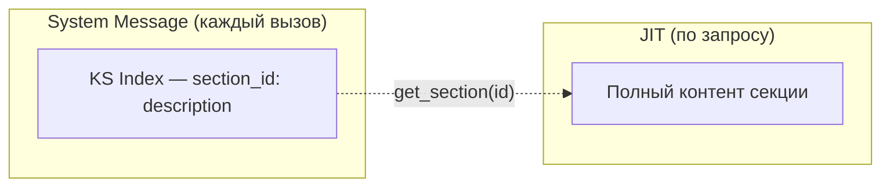

# Knowledge Sphere

Персистентная проектная память — структурированная коллекция секций, хранящая решения, контекст и накопленные знания между сессиями. Shared state: агент автономно поддерживает (через tools), пользователь может просматривать и редактировать (через UI). Обоснование дизайна — [ADR-003](adr/ADR-003-knowledge-sphere.md), стратегия progressive disclosure — [ADR-004](adr/ADR-004-progressive-disclosure.md), механизм обновления — [ADR-005](adr/ADR-005-ks-update-mechanism.md).

## Concept Overview

Knowledge Sphere — cross-session project memory для AI-агента. Каждый проект имеет свою изолированную сферу.

**Ключевые свойства:**
- **Shared state** — два равноправных способа доступа: агент (tools) и пользователь (REST API + UI)
- **Per-project** — каждый проект имеет собственную сферу, изолированную namespace
- **Autonomous maintenance** — агент создаёт, обновляет и удаляет секции самостоятельно по мере работы
- **MVP: structured Markdown** — секции как Markdown-текст, не Knowledge Graph

Единица хранения — **секция**: `section_id` + `description` + `content`.

## Storage Model

**LangGraph Store** (`AsyncPostgresStore`) — key-value хранилище с namespace-иерархией поверх PostgreSQL.

| Элемент | Формат | Пример |
|---------|--------|--------|
| Namespace | `("project", project_id, "sphere")` | `("project", "a1b2c3d4-...", "sphere")` |
| Key | `"section:{section_id}"` | `"section:talk-audience"` |
| Value | `{"description": str, "content": str}` | `{"description": "Целевая аудитория доклада", "content": "## Аудитория\n..."}` |

Каждый Item дополнительно содержит `created_at` и `updated_at` timestamps (управляются Store).

## Section Format

- **section_id** — descriptive kebab-case slug: `talk-audience`, `research-serverless`, `outline-v2`
- **description** — краткое описание секции (1-2 предложения), отображается в KS Index
- **content** — полный Markdown-контент

Принцип: one concern per section, concise but complete.

**Markdown-представление** (как видит/редактирует пользователь через UI):

```markdown
## talk-audience

_Целевая аудитория доклада и уровень подготовки_

Доклад рассчитан на middle+ разработчиков...

## research-serverless

_Результаты исследования serverless-платформ_

Сравнение AWS Lambda, Cloudflare Workers...
```

Парсинг при сохранении из UI: H2 header → section_id (slugify), italic line → description, остальное → content. Секции, отсутствующие в новом Markdown — удаляются из Store.

## Agent Integration

Два уровня доступа (progressive disclosure, подробнее — [agent-runtime.md](agent-runtime.md)):



- **KS Index** (pre-loaded) — список всех секций с описаниями, инжектируется в system message в тег `<knowledge_sphere>`. Агент видит оглавление и решает, что подтянуть.
- **Full section** (JIT) — загружается через `get_section` tool только когда контент нужен для текущей задачи.

**Agent guidelines** (из system prompt): автономное поддержание сферы — create при появлении значимого контекста (goals, decisions, constraints, findings), update при изменении, keep focused. Пользователь тоже может редактировать — treat as shared state.

## Tools (Agent API)

| Tool | Параметры | Назначение |
|------|-----------|------------|
| `get_section` | `section_id` | Получить полный контент секции |
| `create_section` | `section_id, description, content` | Создать новую секцию (проверяет уникальность) |
| `update_section` | `section_id, content, target?, description?` | Patch или overwrite секции |
| `delete_section` | `section_id` | Удалить секцию |

### update_section — два режима

**Patch** (target provided): fuzzy find-and-replace фрагмента внутри секции. Агент указывает `target` (что заменить) и `content` (на что). Устойчив к минорным расхождениям благодаря fuzzy matching.

**Overwrite** (no target): полная замена content секции. Используется когда секция переписывается целиком.

Опциональный `description` — обновляет описание секции при необходимости.

## Fuzzy Patch Mechanism

Fuzzy find-and-replace обеспечивает устойчивость patch-режима: агент мог неточно воспроизвести фрагмент из памяти, и точное совпадение не найдётся.

| Параметр | Значение | Назначение |
|----------|----------|------------|
| Threshold | 0.85 | Минимальная similarity для match |
| Library | fuzzysearch | Levenshtein distance |
| Short target (<10 chars) | Exact match only | Fuzzy на коротких строках ненадёжен |
| Long target (≥10 chars) | Fuzzy match | `max_distance = max(1, int(len(target) × (1 - threshold)))` |
| Adaptive clamping | target >100 chars → max_distance ≤ 15 | Предотвращает слишком вольные замены в длинных фрагментах |

Similarity: `1 - (match.dist / len(target))`. При similarity ≥ threshold — замена выполняется, иначе — ошибка.

## REST API (User API)

| Method | Path | Назначение |
|--------|------|-----------|
| GET | `/api/projects/{id}/sphere` | Получить всю сферу как Markdown-документ |
| PUT | `/api/projects/{id}/sphere` | Обновить всю сферу (полная перезапись) |

**Service layer** (`LangGraphSphereService`) — мост между REST API и LangGraph Store:

- **GET:** собирает все секции из Store → сортирует по `created_at` → форматирует в единый Markdown
- **PUT:** парсит входящий Markdown на секции → пишет каждую в Store → удаляет секции, отсутствующие в новом контенте (reconciliation)

Агент и пользователь работают с одним Store — изменения через UI немедленно видны агенту (KS Index обновляется на каждый вызов agent node).

## Frontend

- **SphereView** — контейнер: toggle между view/edit mode
- **SphereViewer** — рендер Markdown через MarkdownRenderer, empty state
- **SphereEditor** — textarea (monospace), save/cancel
- **TanStack Query:** `useSphere(projectId)` для чтения, `useUpdateSphere()` для сохранения с invalidation

Пользователь видит и редактирует сферу как единый Markdown-документ. Разбиение на секции происходит на backend при сохранении.
