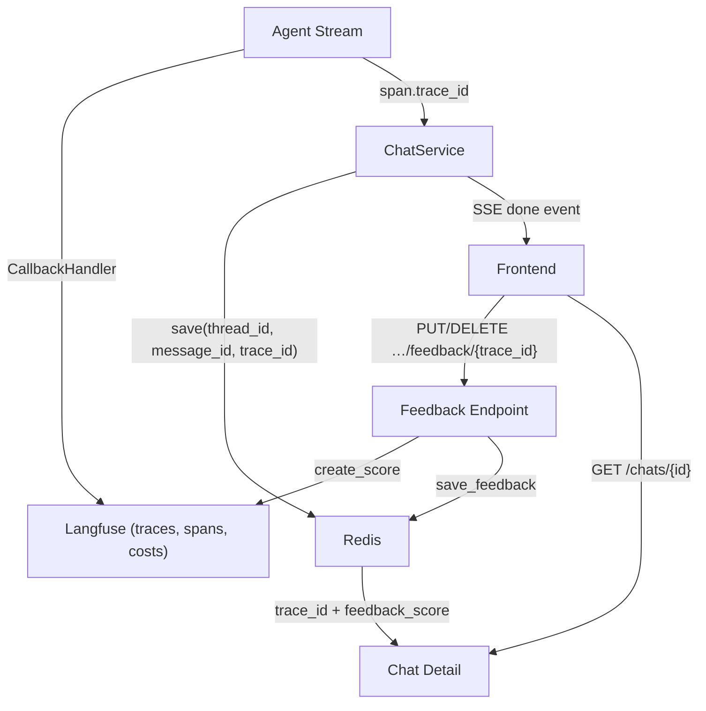
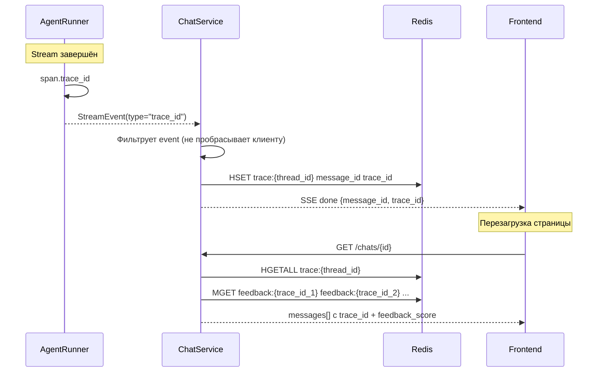
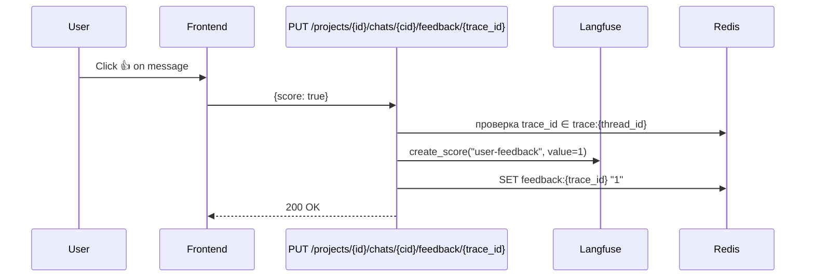

# Observability

Наблюдаемость AI-агента: трейсинг LLM-вызовов, cost tracking, user feedback loop. Построена на Langfuse (cloud). Обоснование выбора — [ADR-010](adr/ADR-010-langfuse-observability.md). Logging conventions — [conventions.md](conventions.md#logging-conventions).

Langfuse выполняет **dual role** в системе: observability (этот документ) и prompt management — runtime source of truth для системных промптов. Подробнее — [prompt-management.md](prompt-management.md).

## Architecture Overview

## Tracing

Интеграция через Langfuse SDK v4 (observation-centric model).

**Root span:** `agent-run` — создаётся через `start_as_current_observation()` context manager на время всего стрима. Input — сообщение пользователя, output — полный ответ агента.

**Automatic capture:** `CallbackHandler` инжектируется в `config["callbacks"]` графа — автоматически ловит все LLM calls (модель, токены, latency), tool executions, node transitions. Никакой ручной инструментации внутри графа не требуется.

**Attribute propagation:** `propagate_attributes()` пушит metadata на все вложенные observations:

| Атрибут | Значение | Назначение в Langfuse |
|---------|----------|----------------------|
| `user_id` | UUID пользователя | Фильтрация по пользователю |
| `session_id` | UUID thread | Группировка traces в сессию (чат) |
| `trace_name` | `"agent-run"` | Имя trace |
| `metadata.project_id` | UUID проекта | Фильтрация по проекту |

## Trace ID Flow

**Redis storage:**

| Key | Type | TTL | Содержимое |
|-----|------|-----|------------|
| `trace:{thread_id}` | HASH | 30 days | `{message_id: trace_id, ...}` |
| `feedback:{trace_id}` | STRING | 30 days | `"1"` (like) \| `"0"` (dislike) |

Frontend получает trace_id двумя путями: из SSE `done` event (при стриме) и из GET chat detail (при перезагрузке). Оба пути ведут к одним данным в Redis.

## User Feedback Loop

**UI:** FeedbackButtons (ThumbsUp / ThumbsDown) на каждом AI-сообщении, имеющем trace_id.

**Toggle-поведение:**
- Click like → `PUT {score: true}`
- Click like повторно → `DELETE` (снятие оценки)
- Click dislike → `PUT {score: false}`
- Click dislike повторно → `DELETE` (снятие оценки)

Feedback — подресурс чата: `PUT | DELETE /projects/{id}/chats/{cid}/feedback/{trace_id}`. Ownership-цепочка (user → project → chat) валидируется зависимостями, принадлежность trace чату — по Redis-маппингу `trace:{thread_id}`.

**Score config:** `user-feedback` (data type BOOLEAN, 1=like / 0=dislike). Создаётся idempotently при старте приложения через `_ensure_score_config()`.

**Dual storage:**
- **Langfuse:** `create_score()` с `score_id = "{trace_id}-user-feedback"` — idempotent upsert, queryable в Langfuse dashboard
- **Redis:** persistence между перезагрузками страницы (feedback_score возвращается в chat detail)

**Удаление feedback:** `DELETE`-endpoint — удаление score в Langfuse API (404 проглатывается, идемпотентно) + DEL key в Redis, ответ 204.

## Security Observability: Langfuse Tracing

Мониторинг security incidents и detector-действий через Langfuse. Архитектура защиты — [architecture.md](../security/architecture.md).

**Score:** `security_verdict` (CATEGORICAL: `CLEAN` / `SUSPICIOUS` / `INJECTION`) на уровне trace. Создаётся при старте через `ensure_security_score_config()`. Применяется и к agent-trace (runtime checkpoints), и к top-level traces `security.<checkpoint>` (add-time checkpoints в service-слое).

**Guardrail observation:** type `guardrail`, name `guard-<checkpoint>` — иконка щита в timeline. Вложенные observations: deterministic-детекторы как events, LLM classifier как generation. Observation levels: DEFAULT (CLEAN), WARNING (SUSPICIOUS, graceful degradation), ERROR (INJECTION).

**Два режима эмиссии** (`GuardObserver`):
- **Nested** — guardrail вкладывается в текущий agent-trace (runtime checkpoints).
- **Top-level** — guard создаёт собственный trace `security.<checkpoint>` (add-time checkpoints в service-слое); root trace получает score, output и metadata блокировки.

**Metadata на trace** (при INJECTION): `blocked`, `checkpoint`, `detection_layer`. **На guardrail observation:** модель classifier'а, raw verdict, reasoning, детали детекторов (например, найденные fragment-окна или paired tools).

`detection_layer` принимает значения `canary`, `unicode`, `fragment`, `paired`, `llm_classifier`, `graceful_degradation` — стабильные машинно-читаемые идентификаторы для дашбордов и SIEM-pipeline'а ([architecture.md](../security/architecture.md), [ADR-020](adr/ADR-020-security-event-contract.md)).

Guard LLM generation регистрируется внутри guardrail-observation; cost tracking guard-модели изолирован от main LLM. Mid-stream проверки на стриме создают одну ретроспективную observation на инцидент, чтобы не плодить per-chunk шум в trace tree.

## SIEM Observability: Security Event Pipeline

Дополнительный слой наблюдаемости: структурированный сбор и корреляция security-событий из всех источников (SecurityGuard, auth, rate limiter, SIEM-администраторы). Отличается от Langfuse: SIEM наблюдает за самой системой безопасности, отловляет паттерны атак, генерирует алерты. Langfuse остаётся инструментом для трейсинга LLM и отладки логики.

**Архитектура:** Producer-сторона → Redis Stream (`security.events`) → Consumer-сторона (SIEM-сервис). Подробнее: [design-brief](../tech/adr/ADR-018-siem-service-topology.md), [ADR-018..021](../tech/adr/).

### Producer Side

**Event Creation:** Генерирование security-событий через структурированный логгинг (structlog). Каждый checkpoint — event с canonical `event_type` из shared vocabulary ([security-events.md](security-events.md)), severity (info/warning/critical), identifiers (ip, user_id, thread_id, project_id, request_id и др.), metadata (checkpoint-специфичные детали).

**Examples:**
- SecurityGuard INPUT checkpoint → `agent.guard.input.classifier_injection` + severity=critical
- Auth login failed → `auth.login.failed` + severity=warning  
- Rate limiter triggered → `rate_limit.login.exceeded` + severity=warning
- SIEM admin acknowledges alert → `siem.alert.acknowledged` + severity=info

**Transport:** `RedisEventTransport` публирует events как JSON в Redis Stream `security.events` с MAXLEN для ограничения памяти. Наличие bounded queue upstream предотвращает backpressure на request-processing.

**Context Binding:** Identifiers вытягиваются из contextvars (bind в HTTP middleware, auth dependency, chat route) автоматически `structlog.contextvars`. Processor-сторона не требует явной передачи context — это infrastructure concern.

### Consumer Side

**Subscriber:** SIEM-сервис читает stream через XREADGROUP (Consumer Group `siem-readers`, at-least-once semantics). Валидирует события через Pydantic (vocabulary-soft: неизвестные `event_type` логируются, но допускаются).

**Event Storage:** Inserting в `siem_events` таблицу через EventWriter. Dual timestamps (event_timestamp от producer, ingested_at от consumer) для детерминистичных time-window правил. JSONB поля для extensibility.

**Correlation Engine:** Polling loop (10-сек интервал) оценивает включённые rules (Threshold/Sequence/Aggregate strategies), генерирует candidates, применяет deduplication (open-alert policy с 24h age limit), пишет alerts в `siem_alerts` таблицу.

**Meta-Events:** SIEM admin-действия (acknowledge/resolve alert, CRUD rule) эмитятся как `siem.*` события обратно в Redis Stream (через MetaEmitter singleton). Замыкают цикл: main app subscriber может читать их как наблюдаемые события.

### Metrics

| Метрика | Слой | Описание |
|---------|------|---------|
| `producer_drop_newest` | Producer | События, выброшенные из bounded queue при overflow |
| `siem_events_ingested` | Consumer | Новые события, успешно inserted |
| `siem_events_duplicate` | Consumer | Повторно-пришедшие события (на основе event_id дедупа) |
| `siem_events_invalid` | Consumer | Validation failures — poison-события, dropped + XACK |
| `siem_events_transient` | Consumer | Транзиентные инфра-сбои (OperationalError); сообщение не XACK'd, остаётся в PEL |
| `siem_events_failed_terminal` | Consumer | Терминальные сбои: drop + XACK после исчерпания `max_delivery_attempts` |
| `siem_unknown_event_type` | Consumer | События с неизвестным event_type (accepted, monitored) |
| `alerts_created_total` | CorrelationEngine | Всего сгенерировано alerts |

Метрики собираются в памяти (встроенные counters), возможен export в `/metrics` endpoint для Prometheus.

### Difference from Langfuse Observability

| Аспект | Langfuse | SIEM |
|--------|----------|------|
| **Что мониторит** | LLM calls, tokens, latency, reasoning | Security events, attack patterns, alerts |
| **Когда создаётся** | Во время agent-выполнения | Непрерывно (любой момент, даже без agent) |
| **Granularity** | Per-trace, per-generation | Per-event (детальнее) |
| **State** | Traces, spans — доступны через dashboard | Events → alerts (состояние + история) |
| **Audience** | Developers, product team | Security team, ops |

SIEM не заменяет Langfuse; они ортогональны. Langfuse трейсит логику, SIEM наблюдает безопасность.

## Model Definitions & Cost Tracking

Конфигурация — `configs/pricing.yaml` (shared между agent и security: cost tracking guard-модели нужен симметрично main LLM). Per-model:

| Поле | Назначение | Пример |
|------|------------|--------|
| `name` | Имя модели | `z-ai/glm-5` |
| `match_pattern` | Regex для matching | `(?i)^z-ai/glm-5` |
| `unit` | Единица биллинга | `TOKENS` |
| `prices` | Цены за единицу: `input`, `output`, `output_reasoning`, `input_cache_read` | `{input: 0.000001, output: 0.0000032, ...}` |

Регистрация в Langfuse при старте (`ensure_model_definitions()`): сравнивает зарегистрированную definition с ожидаемой; при diff — пересоздаёт. Langfuse считает cost per trace на основе token usage из `CallbackHandler` + зарегистрированных prices. Reasoning-токены учитываются через `usage.completion_tokens_details.reasoning_tokens` и поле `output_reasoning` в pricing — подробнее о reasoning-моделях см. [conventions.md](conventions.md).

## Graceful Degradation

| Компонент | При отказе | Поведение |
|-----------|-----------|-----------|
| Langfuse credentials missing | `langfuse_enabled = false` | No-op span, приложение работает без трейсинга |
| Langfuse API unavailable | Callback буферизирует async | Стрим не блокируется; PUT/DELETE feedback → 503 |
| Redis unavailable | `trace_store = None` | Trace persistence отключена, feedback только в Langfuse |

Каждый компонент деградирует изолированно. Отсутствие Langfuse не влияет на основную функциональность агента.

## Configuration

| Переменная | Обязательна | Default | Назначение |
|-----------|-------------|---------|------------|
| `LANGFUSE_PUBLIC_KEY` | Нет | `""` | Public key (пустой = tracing disabled) |
| `LANGFUSE_SECRET_KEY` | Нет | `""` | Secret key |
| `LANGFUSE_BASE_URL` | Нет | `https://cloud.langfuse.com` | Host (cloud или self-hosted) |

Model definitions (pricing) — в `configs/pricing.yaml`.
