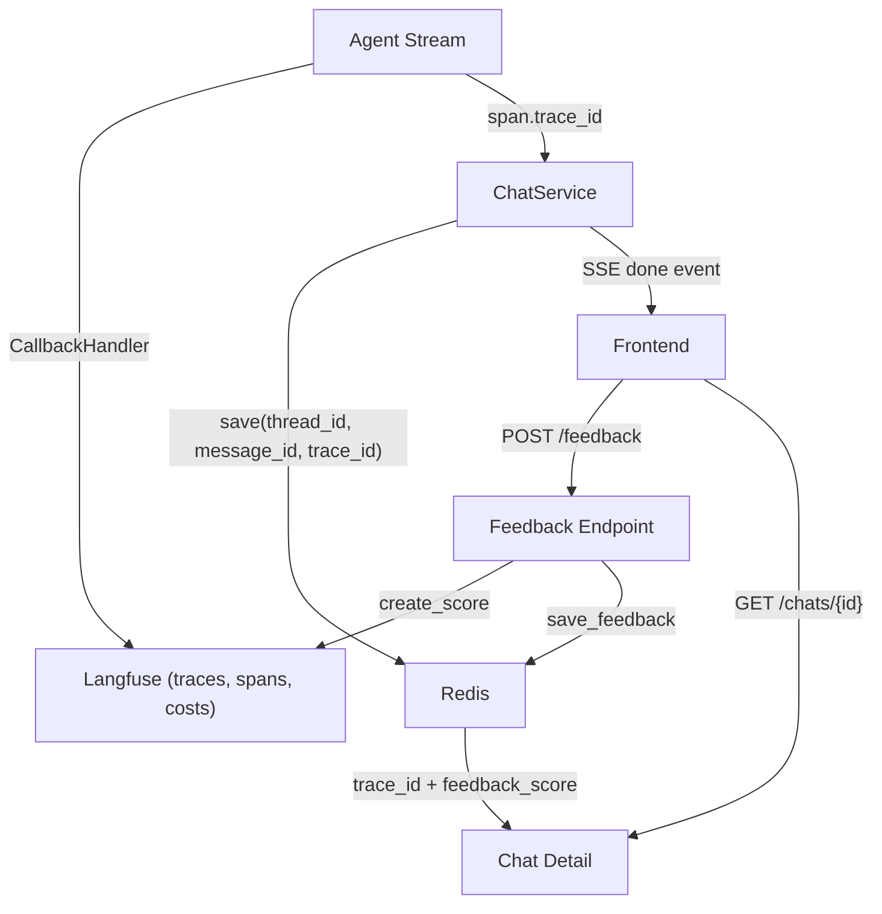
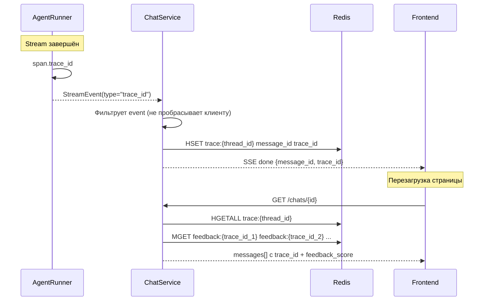
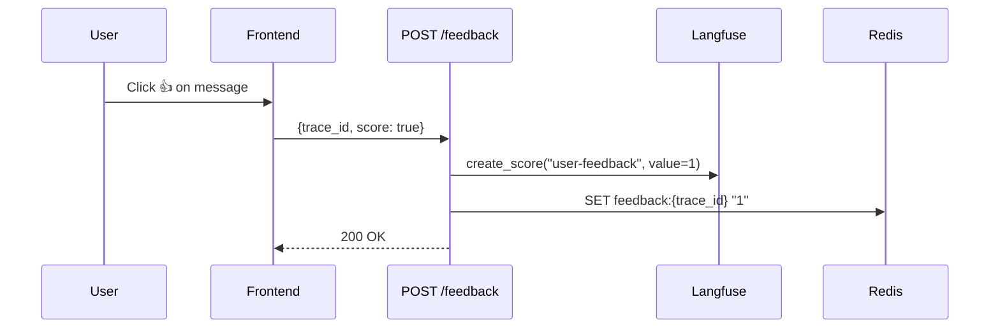

# Observability

Наблюдаемость AI-агента: трейсинг LLM-вызовов, cost tracking, user feedback loop. Построена на Langfuse (cloud). Обоснование выбора — [ADR-010](adr/ADR-010-langfuse-observability.md). Logging conventions — [conventions.md](conventions.md#logging-conventions).

Langfuse выполняет **dual role** в системе: observability (этот документ) и prompt management — runtime source of truth для системных промптов. Подробнее — [prompt-management.md](prompt-management.md).

## Architecture Overview

## Tracing

Интеграция через Langfuse SDK v4 (observation-centric model).

**Root span:** `agent-run` — создаётся через `start_as_current_observation()` context manager на время всего стрима. Input — сообщение пользователя, output — полный ответ агента.

**Automatic capture:** `CallbackHandler` инжектируется в `config["callbacks"]` графа — автоматически ловит все LLM calls (модель, токены, latency), tool executions, node transitions. Никакой ручной инструментации внутри графа не требуется.

**Attribute propagation:** `propagate_attributes()` пушит metadata на все вложенные observations:

| Атрибут | Значение | Назначение в Langfuse |
|---------|----------|----------------------|
| `user_id` | UUID пользователя | Фильтрация по пользователю |
| `session_id` | UUID thread | Группировка traces в сессию (чат) |
| `trace_name` | `"agent-run"` | Имя trace |
| `metadata.project_id` | UUID проекта | Фильтрация по проекту |

## Trace ID Flow

**Redis storage:**

| Key | Type | TTL | Содержимое |
|-----|------|-----|------------|
| `trace:{thread_id}` | HASH | 30 days | `{message_id: trace_id, ...}` |
| `feedback:{trace_id}` | STRING | 30 days | `"1"` (like) \| `"0"` (dislike) |

Frontend получает trace_id двумя путями: из SSE `done` event (при стриме) и из GET chat detail (при перезагрузке). Оба пути ведут к одним данным в Redis.

## User Feedback Loop

**UI:** FeedbackButtons (ThumbsUp / ThumbsDown) на каждом AI-сообщении, имеющем trace_id.

**Toggle-поведение:**
- Click like → score = true
- Click like повторно → score = null (удаление)
- Click dislike → score = false
- Click dislike повторно → score = null (удаление)

**Score config:** `user-feedback` (data type BOOLEAN, 1=like / 0=dislike). Создаётся idempotently при старте приложения через `_ensure_score_config()`.

**Dual storage:**
- **Langfuse:** `create_score()` с `score_id = "{trace_id}-user-feedback"` — idempotent upsert, queryable в Langfuse dashboard
- **Redis:** persistence между перезагрузками страницы (feedback_score возвращается в chat detail)

**Удаление feedback:** при score = null — DELETE score в Langfuse API + DEL key в Redis.

## Security Observability

Мониторинг security incidents через Langfuse. Архитектура защиты — [security.md](security.md).

**Score:** `security_verdict` (CATEGORICAL: `CLEAN` / `SUSPICIOUS` / `INJECTION`) на уровне trace. Создаётся при старте через `ensure_security_score_config()`.

**Guardrail observation:** type `guardrail`, name `input-guard` — иконка щита в timeline. Вложенные observations: event `unicode-detector`, generation `llm-classifier`. Observation levels: DEFAULT (CLEAN), WARNING (SUSPICIOUS, degradation), ERROR (INJECTION, canary leak).

**Metadata на trace** (только при инцидентах): `blocked` (bool), `detection_layer` (str), `block_reason` (str). **На guardrail observation:** `guard_model`, `verdict_raw`, `unicode_chars_found`.

Guard LLM generation регистрируется как отдельная generation внутри guardrail — cost tracking guard-модели изолирован от main LLM.

## Model Definitions & Cost Tracking

Конфигурация: `configs/agent.yaml`, секция `models`. Per-model:

| Поле | Назначение | Пример |
|------|------------|--------|
| `name` | Имя модели | `z-ai/glm-5` |
| `match_pattern` | Regex для matching | `(?i)^z-ai/glm-5` |
| `unit` | Единица биллинга | `TOKENS` |
| `prices` | Цены за единицу | `{input: 0.000001, output: 0.0000032, ...}` |

Регистрация в Langfuse при старте (`ensure_model_definitions()`). Idempotent — повторные запуски не дублируют. Langfuse автоматически считает cost per trace на основе token usage из `CallbackHandler` + зарегистрированных prices.

## Graceful Degradation

| Компонент | При отказе | Поведение |
|-----------|-----------|-----------|
| Langfuse credentials missing | `langfuse_enabled = false` | No-op span, приложение работает без трейсинга |
| Langfuse API unavailable | Callback буферизирует async | Стрим не блокируется; POST /feedback → 503 |
| Redis unavailable | `trace_store = None` | Trace persistence отключена, feedback только в Langfuse |

Каждый компонент деградирует изолированно. Отсутствие Langfuse не влияет на основную функциональность агента.

## Configuration

| Переменная | Обязательна | Default | Назначение |
|-----------|-------------|---------|------------|
| `LANGFUSE_PUBLIC_KEY` | Нет | `""` | Public key (пустой = tracing disabled) |
| `LANGFUSE_SECRET_KEY` | Нет | `""` | Secret key |
| `LANGFUSE_BASE_URL` | Нет | `https://cloud.langfuse.com` | Host (cloud или self-hosted) |

Model definitions (pricing) — в `configs/agent.yaml`, секция `models`.
