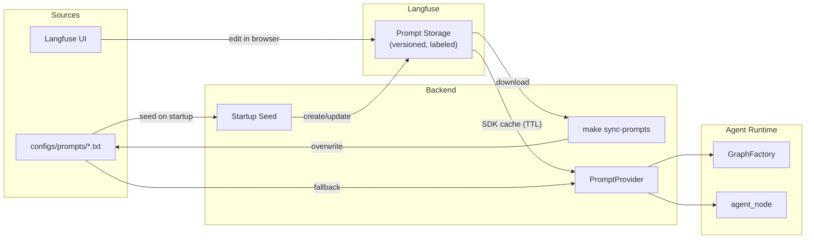

# Prompt Management

Управление системными промптами: lifecycle, sources, dev/prod разделение. Промпты хранятся в Langfuse (runtime source of truth) с file fallback. Интеграция с agent runtime — [agent-runtime.md](agent-runtime.md).

## Architecture Overview



Два направления потока:
- **Development:** файлы → seed → Langfuse → PromptProvider → agent (нормальный путь)
- **Sync:** Langfuse → файлы (обратная синхронизация для backup / deployment)

## Prompt Lifecycle

### Seed (при старте)

Startup seed загружает промпты из файлов в Langfuse:

1. Читает текст из `configs/prompts/{name}.txt`
2. Извлекает config из `configs/agent.yaml` (модель, параметры)
3. Вычисляет SHA256 hash `(text + config)` для дедупликации
4. Проверяет существование промпта в Langfuse:
   - **Новый** → создаёт промпт с текущим label
   - **Существует, hash совпадает** → skip (duplicate-safe)
   - **Существует, hash отличается** → создаёт новую версию

Idempotent: повторный запуск не создаёт дубликатов.

### Runtime Fetch

**PromptProvider** — единая точка доступа к промптам.

| Метод | Назначение |
|-------|------------|
| `get_prompt(name)` → `str` | Текст промпта (Langfuse → file fallback) |
| `get_config(name)` → `dict \| None` | Конфигурация из prompt metadata (model, tokens) |

Кэширование на уровне Langfuse SDK (TTL, по умолчанию 60s). При обновлении промпта в Langfuse UI — автоподхват через cache refresh.

### Update

Два пути редактирования промптов:

| Путь | Когда | Что происходит |
|------|-------|----------------|
| Langfuse UI | Итерации на production | Редактирование в браузере → автоподхват через SDK cache TTL |
| Файл + restart | Локальная разработка | Правка `.txt` → restart → seed обновляет Langfuse |

### Sync (обратная)

`make sync-prompts` — скачивает промпты из Langfuse (label `production`) в локальные файлы:
- Перезаписывает `configs/prompts/*.txt`
- Обновляет `configs/agent.yaml` (модель, параметры из prompt config)

Применение: backup, deploy на окружение без Langfuse, version control seed-файлов.

## Dev / Production Separation

Label-based изоляция: каждый промпт в Langfuse имеет label, определяющий окружение.

**Naming convention:** `{name}--{label}`

```
system--development       # dev-окружение
system--production        # production
summarization--development
summarization--production
```

Двойной дефис (`--`) обеспечивает полную изоляцию: каждое окружение имеет собственную историю версий. Evaluator видит только промпты своего окружения.

**`LANGFUSE_PROMPT_LABEL`** — env var, определяющий текущее окружение (default: `development`). Fail-safe: забытая переменная → development, не production.

**Workflow продвижения:**

```
dev: edit file → restart (seed) → test → validate in Langfuse UI
                        ↓
prod: copy content in Langfuse UI under production label
                        ↓
sync: make sync-prompts → commit updated seed files
```

## Prompt Inventory

| Name | Seed file | Config source | Назначение |
|------|-----------|---------------|------------|
| `system` | `configs/prompts/system.txt` | `agent.yaml` → `llm` (model, extra_body) | Base system prompt агента |
| `summarization` | `configs/prompts/summarization.txt` | `agent.yaml` → `summarization` (model, max_tokens) | Суммаризация при message compaction |

Prompt config хранится в Langfuse metadata вместе с текстом. `get_config()` используется ModelConfigResolver как нижний уровень каскада (Langfuse prompt config → agent.yaml default).

## Configuration

**Env vars:**

| Variable | Default | Назначение |
|----------|---------|------------|
| `LANGFUSE_PROMPT_LABEL` | `development` | Label для фетча промптов |
| `LANGFUSE_PROMPT_CACHE_TTL` | `60` | TTL кэша SDK (секунды) |
| `LANGFUSE_PUBLIC_KEY` | — | Langfuse credentials |
| `LANGFUSE_SECRET_KEY` | — | Langfuse credentials |
| `LANGFUSE_HOST` | — | Langfuse host URL |

**Файлы:**
- `configs/prompts/*.txt` — seed-файлы (source для initial load + fallback)
- `configs/agent.yaml` → секции `llm`, `summarization` — config для prompt metadata

**Makefile:**
- `make sync-prompts` — обратная синхронизация Langfuse → файлы

## Graceful Degradation

| Ситуация | Поведение |
|----------|-----------|
| Langfuse недоступен (runtime) | File fallback → `configs/prompts/{name}.txt`, warning в логах |
| Langfuse недоступен (seed) | Seed пропускается, warning. Промпты работают через file fallback |
| Seed file отсутствует | Startup warning (промпт не будет создан в Langfuse) |
| Langfuse + file оба недоступны | Ошибка при первом вызове `get_prompt()` |
