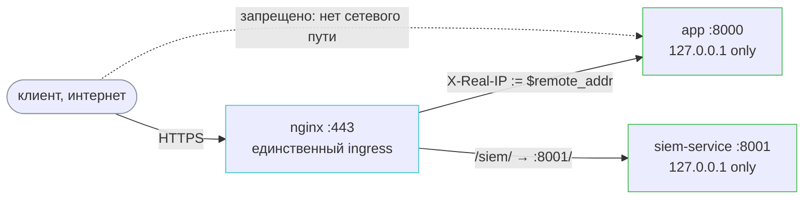

# Production setup — nginx-периметр, execution runtime и клиентский IP

Документ фиксирует контракт периметра прод-VM: топологию доверия, от которой зависит корректность и безопасность режима `CLIENT_IP_SOURCE=x-real-ip`, референсную копию боевого nginx-конфига, подготовку хоста под изолированный execution runtime (executor, gVisor, workspace) и ручные шаги, которые нельзя вывести из репозитория автоматически.

## Топология и инвариант доверия

Единственный ingress в систему — nginx, слушающий `:443` на прод-VM. Порты самого приложения и SIEM-сервиса опубликованы только на loopback (`docker-compose.yml`):

```yaml
127.0.0.1:${APP_PORT:-8000}:8000
127.0.0.1:${SIEM_PORT:-8001}:8001
```

Это значит, что снаружи VM подключиться к приложению или к SIEM-сервису напрямую, минуя nginx, нельзя — сокет слушает только `127.0.0.1`, а не `0.0.0.0`.

На этом факте держится вся модель доверия к клиентскому IP. Приложение в режиме `CLIENT_IP_SOURCE=x-real-ip` безоговорочно доверяет заголовку `X-Real-IP`, потому что единственный, кто может его выставить, — nginx на том же хосте (`proxy_set_header X-Real-IP $remote_addr`, см. референс ниже). Если у запроса появляется путь до приложения в обход nginx, это доверие ломается: клиент присылает `X-Real-IP` сам, и приложение принимает подделанное значение как источник истины — rate limiting по IP (`register:{ip}`, `refresh:{ip}`) и `ip` в security-событиях обходятся тривиально.

**Что конкретно ломает инвариант** (любое из перечисленного достаточно):

- проброшенный наружу порт контейнера (`0.0.0.0:8000:8000` вместо `127.0.0.1:8000:8000`);
- прямой доступ к приложению по IP-адресу VM, минуя доменное имя и nginx;
- ещё один контейнер в той же docker-сети, у которого нет причин ходить через nginx, но есть сетевой доступ к `app:8000`.

**Edge — фильтр, а не замок.** Nginx защищает только тот трафик, который реально через него прошёл; он не создаёт границу сам по себе — границу создаёт то, что альтернативных путей до приложения не существует. Публикация портов на loopback — механизм, которым эта граница сегодня обеспечена; при её проверке смотреть не только на nginx-конфиг, но и на фактическую публикацию портов (`docker compose ps`, `docker-compose.yml`).



## Референс nginx-конфига

Ниже — копия боевого файла `/etc/nginx/sites-available/learnflow` (в `sites-enabled` — симлинк на него). Содержимое TLS-ключей не переносится и никогда не переносилось; сами пути к сертификату — стандартные certbot'овские, секретов не содержат. Это копия as-is, снятая read-only с одобрения архитектора, а не желаемое состояние — фактические расхождения с контрактом фиксируются пометками рядом, без предложений «как исправить». Блоки и строки с пометкой `# managed by Certbot` вписаны certbot'ом при выпуске сертификата и обновляются им же при продлении — руками их не редактировать.

```nginx
server {
    if ($host = www.learnflow.me) {
        return 301 https://$host$request_uri;
    } # managed by Certbot

    if ($host = learnflow.me) {
        return 301 https://$host$request_uri;
    } # managed by Certbot

    listen 80;
    server_name learnflow.me www.learnflow.me;
    return 301 https://$host$request_uri;
}

server {
    listen 443 ssl;
    server_name learnflow.me www.learnflow.me;
    ssl_certificate /etc/letsencrypt/live/learnflow.me/fullchain.pem; # managed by Certbot
    ssl_certificate_key /etc/letsencrypt/live/learnflow.me/privkey.pem; # managed by Certbot

    location = /health {
        proxy_pass http://127.0.0.1:8000/health;
    }

    location /siem/ {
          proxy_pass http://127.0.0.1:8001/;
          proxy_set_header Host $host;
          proxy_set_header X-Real-IP $remote_addr;
          proxy_set_header X-Forwarded-For $proxy_add_x_forwarded_for;
          proxy_set_header X-Forwarded-Proto $scheme;
      }

    location / {
        proxy_pass http://127.0.0.1:8000;
        proxy_set_header Host $host;
        proxy_set_header X-Real-IP $remote_addr;
        proxy_set_header X-Forwarded-For $proxy_add_x_forwarded_for;
        proxy_set_header X-Forwarded-Proto $scheme;

        # SSE streaming
        proxy_buffering off;
        proxy_cache off;
        proxy_read_timeout 300s;
        proxy_http_version 1.1;
        proxy_set_header Connection '';
    }
}
```

Элементы контракта, на которые опирается приложение:

- **`proxy_set_header X-Real-IP $remote_addr`** в `location /` — это **замена** заголовка целиком, не дописывание. Присланный клиентом `X-Real-IP` уничтожается nginx до того, как запрос дойдёт до приложения; в значении, которое видит `get_client_ip()`, нет ни одного байта, подконтрольного клиенту.
- **`proxy_set_header X-Forwarded-For $proxy_add_x_forwarded_for`** — nginx дописывает `$remote_addr` в конец существующего значения. Заголовок остаётся в конфиге для форензики и ручной отладки, но кодом приложения не читается ни в одном режиме, кроме явного `CLIENT_IP_SOURCE=x-forwarded-for` (см. ниже).
- **`location = /health` не ставит ни одного `proxy_set_header`.** Health-запросы, прошедшие через nginx, приходят без `X-Real-IP` и без `X-Forwarded-For` — факт, а не недосмотр: `get_client_ip()` для health-пути IP не резолвит и WARNING не пишет вообще (см. `app.infra.client_ip.is_health_path`), поэтому отсутствие заголовков здесь безопасно.
- **`location /siem/` срезает префикс**: `proxy_pass http://127.0.0.1:8001/` с завершающим слэшем переписывает `/siem/<путь>` в `/<путь>` на upstream. Факт с VM: при выключенном SIEM-сервисе (`COMPOSE_PROFILES` без `siem`, upstream не поднят) этот location отдаёт `502 Bad Gateway` — фиксируется здесь как наблюдаемое поведение; рекомендация, что с этим делать, — в [§ SIEM](#siem) runbook'а ниже.

**Пара `sites-available` / `sites-enabled` приведена в порядок.** Канонический конфиг живёт в `/etc/nginx/sites-available/learnflow`, `sites-enabled/learnflow` — симлинк на него (восстановлен по шагу 3 runbook «Клиентский IP» ниже). Дисциплина: правки nginx-конфига на VM вносятся в `sites-available`; появление в `sites-enabled` обычного файла вместо симлинка — сигнал нового дрейфа (пара уже дважды расходилась, история — `doc/tasks/iterations/production/chore-001-ci-cd/summary.md`, находка 5).

## Режимы `CLIENT_IP_SOURCE` в эксплуатации

`CLIENT_IP_SOURCE` называет источник клиентского IP явно, а не переключает булев «доверяем прокси». Единственная точка чтения — `app.infra.client_ip.get_client_ip()`; подробности реализации и fallback-поведения — в `doc/tech/conventions.md` § Logging Conventions → Security Event Logging.

- **`socket` (дефолт).** `request.client.host` — адрес TCP-соединения, каким его видит приложение. Дефолт безопасен именно потому, что не доверяет ни одному заголовку: там, где прокси нет (`make dev`, тесты), это настоящий IP клиента; там, где прокси есть, а `CLIENT_IP_SOURCE` не выставлен, — это адрес nginx-контейнера (или docker-gateway), и все клиенты схлопываются в один rate-limit-бакет. Отказ в таком виде шумный и заметен сразу, а не тихая дыра — поэтому дефолт остался безопасным даже для развёртывания без явной настройки.
- **`x-real-ip` (прод).** Значение заголовка `X-Real-IP` целиком, без парсинга списка. Безопасность режима держится **только** на инварианте выше: единственный, кто пишет этот заголовок, — nginx на loopback-адресе. Если заголовка нет или он пуст, `get_client_ip()` откатывается на `socket` и пишет WARNING — это сигнал дрейфа nginx-конфига (например, кто-то убрал `proxy_set_header X-Real-IP` из `location /`), а не штатный путь.
- **`x-forwarded-for`.** Берёт `CLIENT_IP_XFF_HOPS`-й элемент справа (при `hops=1` — последний, дописанный ближайшим прокси). Известное ограничение: фиксированный отступ справа корректен только тогда, когда **весь** трафик идёт одним путём с одинаковым числом дописывающих прокси. При смешанных точках входа — например, часть трафика приходит через CDN или балансировщик, а часть напрямую на nginx, — запросы короткого пути содержат меньше настоящих элементов, и отступ `N` попадает внутрь части заголовка, подконтрольной клиенту: дыра открывается заново и молча. У этой топологии смешанность уже есть в мелком виде — `location = /health` вообще не проставляет `X-Forwarded-For`. Общего решения «всегда верно при любых точках входа» не существует: переход на этот режим требует либо единственной точки входа для всего трафика, либо явного списка доверенных прокси-адресов (которых в текущей топологии нет — в docker источником оказался бы плавающий gateway bridge-сети).

## Runbook ручных шагов на прод-VM

Оба раздела ниже привязаны к моменту **до merge PR в `main`**: `.github/workflows/deploy.yml` реагирует на push в `main` и сразу выполняет `git pull && docker compose build && docker compose up -d` без паузы на ручную подготовку. Окно между merge и подготовленной VM означает прод, поднятый с дефолтами репозитория, — в части клиентского IP это `CLIENT_IP_SOURCE=socket`, то есть все клиенты схлопываются в один rate-limit-бакет.

Раздел разбит по подсистемам периметра; шаги новых подсистем добавляются как отдельные подзаголовки, не переписывая существующие.

### Клиентский IP

Выполнить на прод-VM до merge PR, вводящего `CLIENT_IP_SOURCE`, в `main`:

1. Открыть боевой `.env` в `~/learnflow-ai/` (файл вне git, правится руками) и добавить строку `CLIENT_IP_SOURCE=x-real-ip`. `CLIENT_IP_XFF_HOPS` не трогать — режим `x-real-ip` его не читает.
2. Сверить в `/etc/nginx/sites-enabled/learnflow`, что `location /` содержит `proxy_set_header X-Real-IP $remote_addr` без изменений (см. референс выше). Если строки нет или заголовок не заменяется, а дописывается, — режим `x-real-ip` небезопасен, включать его нельзя до исправления nginx-конфига.
3. Привести пару `sites-available` / `sites-enabled` в порядок, не потеряв боевой конфиг. Источник истины — `/etc/nginx/sites-enabled/learnflow` (обычный файл, содержимое которого нигде больше не хранится: в репозитории его нет, в `sites-available` лежит устаревшая версия). Поэтому сначала снимается резервная копия и содержимое переносится в `sites-available`, и только потом файл в `sites-enabled` заменяется симлинком:

   ```bash
   cp /etc/nginx/sites-enabled/learnflow /root/learnflow.nginx.bak
   cp /etc/nginx/sites-enabled/learnflow /etc/nginx/sites-available/learnflow
   rm /etc/nginx/sites-enabled/learnflow
   ln -s ../sites-available/learnflow /etc/nginx/sites-enabled/learnflow
   ```

   Второй `cp` перезаписывает устаревшее содержимое `sites-available` боевым — это и есть синхронизация; симлинк после неё указывает на файл с тем же содержимым, что работало до правки. Дисциплина синхронизации: канонический конфиг живёт в `sites-available`, `sites-enabled` — симлинк на него; последующие правки nginx-конфига на VM вносятся в `sites-available`, не в `sites-enabled`.
4. Проверить и применить конфиг — обязательный завершающий шаг после **любой** правки nginx на VM, включая шаг 3:

   ```bash
   nginx -t && systemctl reload nginx
   ```

   `nginx -t` разбирает конфиг и не даёт применить сломанный (при ошибке `reload` не выполнится из-за `&&`, а nginx продолжит работать на старом конфиге). Именно `reload`, а не `restart`: reload поднимает новые worker'ы и даёт старым дожить свои соединения, restart рвёт живые запросы, включая открытые SSE-стримы. Если `nginx -t` ругается — восстановить конфиг из резервной копии (`cp /root/learnflow.nginx.bak /etc/nginx/sites-available/learnflow`) и разобраться до применения.
5. После деплоя (`docker compose up -d` из `deploy.yml`) проверить, что переменная действительно попала в контейнер: `docker compose exec app env | grep CLIENT_IP_SOURCE` должен показать `x-real-ip`.

### TLS и домен

Продакшн живёт на домене **learnflow.me** (регистратор Porkbun, WHOIS privacy включён, auto-renew включён). DNS хостится у Porkbun: две A-записи — `@` и `www` — указывают на публичный IP прод-VM. Nameserver'ы Porkbun'овские, отдельного DNS-провайдера нет.

TLS — Let's Encrypt, сертификат один на оба имени (SAN: `learnflow.me`, `www.learnflow.me`), выпущен и обслуживается certbot'ом с nginx-плагином:

- Пути: `/etc/letsencrypt/live/learnflow.me/{fullchain,privkey}.pem` — на них ссылается nginx-конфиг (строки `# managed by Certbot` в референсе выше).
- Авто-продление: systemd-таймер `certbot.timer` (ставится пакетом, два прогона в сутки); при фактическом продлении certbot перезагружает nginx сам (nginx-installer в renewal-конфиге). Ручных шагов в цикле продления нет.
- Проверка здоровья продления: `systemctl list-timers certbot.timer` (таймер активен) и `sudo certbot renew --dry-run` (полный прогон без выпуска).
- Добавление имени в сертификат (например, поддомена): `sudo certbot --nginx -d learnflow.me -d www.learnflow.me -d <new> --expand`.

Смежные факты периметра:

- **Доступ по голому IP VM остаётся работать** — server-блок единственный и потому default: запрос по IP обслуживается, но с браузерным предупреждением о несовпадении имени сертификата. Это служебный путь (диагностика «жив ли nginx, когда DNS сломан»), не пользовательский; инвариант доверия из § Топология он не ломает — трафик всё равно идёт через nginx.
- **`CORS_ORIGINS` в боевом `.env`** — `https://learnflow.me,https://www.learnflow.me`. Формат — CSV без кавычек и скобок: `parse_cors_origins` в `Settings` сплитит строку по запятой, JSON-запись превращается в мусорный origin. Практического эффекта CORS сейчас не имеет (фронт отдаётся same-origin из того же приложения), значение поддерживается корректным на случай появления cross-origin потребителей.

### SIEM

Выполнить на прод-VM до merge PR, вводящего SIEM kill-switch, в `main`:

1. Открыть боевой `.env` в `~/learnflow-ai/` (файл вне git, правится руками) и дописать две строки: `SIEM_ENABLED=false` и `COMPOSE_PROFILES=` (пустое значение). Обе строки нужны: первая гасит эмиссию security-событий в Redis Stream из процесса `app`, вторая — SIEM-контейнеры; вывести вторую из первой compose не умеет, это две независимые переменные.

   **Писать именно `false` в нижнем регистре.** Значение уходит во фронтовый build-arg `VITE_SIEM_ENABLED` сырым passthrough, а фронт считает выключением только литеральное `false`: `0` или `False` бэкенд как falsy примет и эмиссию погасит, но кнопка «Безопасность» и роут `/security` останутся в бандле — и упрутся в `502` на `/siem/`.

2. Остановить уже запущенные SIEM-контейнеры явно и только их:

   ```bash
   docker compose --profile siem down siem-service siem-db
   ```

   Важны обе части команды. `--profile siem` нужен, чтобы compose вообще увидел эти сервисы: после перевода их в профиль он перестаёт ими управлять, а `restart: unless-stopped` оставляет уже запущенные контейнеры работать — голый `docker compose down` их не заметит. Список сервисов (`siem-service siem-db`) нужен, чтобы `down` не снёс всё остальное: compose берёт набор сервисов из конфига после фильтрации по профилям, поэтому без явного списка `down` останавливает и удаляет **все сервисы активного набора** — с `--profile siem` это `app`, `db`, `redis` плюс оба SIEM-сервиса, и прод лежит от этого шага до `up -d` на деплое. Команда с явными `siem-service siem-db` — не то же самое, что голый `--profile siem down`; разница здесь принципиальна, не стилистическая.
3. UI-флаг «Безопасность» вшивается в бандл при сборке, а не читается в рантайме: после merge `deploy.yml` выполняет `docker compose build`, и `VITE_SIEM_ENABLED` возьмётся из уже подготовленного `SIEM_ENABLED=false` через `build.args`. Если `.env` не был подготовлен до merge — потребуется отдельный `docker compose build && docker compose up -d` после правки, обычного рестарта недостаточно.
4. Проверка после деплоя:
   - `docker compose ps` не показывает `siem-service`/`siem-db`, но показывает живые `app`, `db`, `redis` — шаг 2 их не трогал, список сервисов в команде на это и рассчитан.
   - `docker compose exec app env | grep SIEM_ENABLED` → `false`.
   - в логах приложения при старте есть строка `siem event emission disabled by flag`.
   - в UI кнопка «Безопасность» отсутствует (флаг вшит при сборке шагом 3).
5. Обратное включение стоит двух строк в `.env` (`SIEM_ENABLED=true`, `COMPOSE_PROFILES=siem`) плюс `docker compose build && docker compose up -d`. Данные не теряются: volume `siem_pgdata` сохраняется, правила корреляции остаются в БД как есть.

Два факта, зафиксированных здесь как наблюдаемое поведение, а не как задачи на исправление:

- **Рассинхрон `SIEM_ENABLED=true` при пустом `COMPOSE_PROFILES` безобиден.** Если строка 1 руками дописана, а строка `COMPOSE_PROFILES=` — нет (или наоборот), эмиссия идёт в Redis Stream без консьюмера (siem-service не поднят). Рост буфера ограничен `MAXLEN ~100_000` (`transport.py:28`) — это буфер, а не утечка. Чинить нечего; окно рассинхрона ограничено периодом до merge PR, описанным выше.
- **`location /siem/` в nginx после выключения SIEM отдаёт `502 Bad Gateway`** (upstream не поднят, см. § Референс nginx-конфига выше). Рекомендация — оставить `location` как есть, ничего не удалять: маршрут admin-only, UI на него больше не ссылается при выключенном флаге, а удаление строки удорожило бы обратное включение и разошлось бы с референсной копией конфига в этом же документе.

### Execution runtime: gVisor, отдельный volume workspaces, bwrap-верификация

Три шага подготовки VM для сервиса `executor` (ADR-031, ADR-032). Выполняются один раз, до первого `docker compose up`, поднимающего `executor` в составе стека, — то есть до merge PR, вводящего сервис в `main`, аналогично разделам «Клиентский IP»/«SIEM» выше.

#### Установка gVisor (runsc)

Executor обязателен к запуску под gVisor — второй слой изоляции поверх границы контейнера (ADR-031). `docker-compose.yml` объявляет `runtime: ${EXECUTOR_RUNTIME:-runsc}`: дефолт fail-closed, без зарегистрированного в docker-демоне рантайма `runsc` контейнер `executor` не стартует вовсе (`unknown or invalid runtime name: runsc`). Dev-override `EXECUTOR_RUNTIME=runc` (см. `.env.local.example`, для хостов без gVisor) **на проде недопустим** — он снимает слой gVisor, оставляя только контейнерную границу и bwrap. Обязательная к правке в боевом `.env` переменная одна — `EXECUTOR_AUTH_TOKEN`: общий секрет backend'а и executor'а (`Authorization: Bearer` на `POST /jobs`, [executor.md](../executor.md) § Аутентификация вызывающего). Дефолта у него нет ни в одном `Settings`, в compose он пробрасывается как `${EXECUTOR_AUTH_TOKEN:?…}` обоим сервисам — без строки в `.env` стек не поднимется вовсе. Значение — случайная строка ≥ 32 символов, генерируется на VM (`openssl rand -hex 32`) и не совпадает с `JWT_SECRET`. Вторая переменная, которую задаёт оператор, — `EXECUTOR_MEM_LIMIT` (потолок памяти контейнера executor, `mem_limit:` в compose). Она подбирается под машину, а не под продукт: дефолт `2g` рассчитан на выделенный хост, а на VM, где рядом живут другие сервисы, он забирает половину RAM — одна тяжёлая джоба упирается в предел общей памяти, и OOM-killer выбирает жертву среди соседей, а не среди джоб. Правило: не больше четверти RAM машины (на VM с 4 ГБ — `1g`), тогда джоба, дошедшая до потолка, умирает одна. Остальные `EXECUTOR_*`-переменные (`EXECUTOR_WORKSPACES_ROOT`, `EXECUTOR_SKILLS_ROOT`, `EXECUTOR_DEFAULT_TIMEOUT_SECONDS`, `EXECUTOR_MAX_TIMEOUT_SECONDS`, `EXECUTOR_MAX_OUTPUT_BYTES`, `EXECUTOR_KILL_GRACE_SECONDS`, `EXECUTOR_LOG_LEVEL`, `EXECUTOR_BASE_URL`, `EXECUTOR_JOB_TIMEOUT_SECONDS`, `EXECUTOR_CLIENT_TIMEOUT_GRACE_SECONDS`) правки не требуют — дефолты в `docker-compose.yml`/`.env.example` уже прод-безопасны. Исключение — `EXECUTOR_SANDBOX_ENABLED`: намеренно не задаётся нигде (дефолт `true` обязан держаться во всех окружениях) — kill-switch bwrap для локальной отладки, на проде выставлять нельзя; сервис, поднятый с ним, пишет ERROR на старте и отдаёт `sandbox: disabled` в `GET /health`.

1. Скачать статический релиз gVisor и проверить контрольную сумму:

   ```bash
   ARCH=$(uname -m)
   URL=https://storage.googleapis.com/gvisor/releases/release/latest/${ARCH}
   wget "${URL}/gvisor.tar.bz2" "${URL}/gvisor.tar.bz2.sha512"
   sha512sum -c gvisor.tar.bz2.sha512
   ```

   Архив содержит `runsc`, `containerd-shim-runsc-v1` и `gvisor-bin/` одним целым — распаковывать как есть, не разносить компоненты по разным путям.

2. Распаковать в `/usr/local/bin` (системный путь — требует sudo; бинарь должен быть читаем/исполняем всем, `runsc` переисполняет себя от непривилегированного пользователя):

   ```bash
   sudo tar -xjf gvisor.tar.bz2 -C /usr/local/bin
   rm -f gvisor.tar.bz2 gvisor.tar.bz2.sha512
   ```

3. Зарегистрировать `runsc` в docker-демоне. `runsc install` правит `/etc/docker/daemon.json` (дописывает секцию `runtimes`) — снять резервную копию до правки на случай, если файл придётся откатывать вручную:

   ```bash
   sudo cp /etc/docker/daemon.json /root/daemon.json.bak 2>/dev/null || true
   sudo /usr/local/bin/runsc install
   sudo systemctl reload docker
   ```

   `reload`, не `restart`: `runtimes` — один из ключей `daemon.json`, перечитываемых демоном по `SIGHUP` без остановки уже запущенных контейнеров (наравне с `insecure-registries`, `default-runtime` и т.п.; полный список — референс Docker `dockerd`). Уже работающие на VM контейнеры (`app`, `db`, `redis`, nginx-хост-процесс) `reload` не трогает — в отличие от установки runsc в среде, где сам docker ещё не запущен, здесь простоя не требуется. Если `reload` сообщает о конфликте (обычно синтаксическая ошибка в `daemon.json`) — демон остаётся на старой конфигурации, а не падает; исправить файл и повторить `reload`.

4. Проверить, что рантайм действительно доступен:

   ```bash
   docker run --rm --runtime=runsc hello-world
   ```

   Отдельно про SELinux: на хостах с SELinux в `enforcing` (Fedora/RHEL-семейство) `docker run --runtime=runsc` может падать по меткам — gVisor не умеет проставлять SELinux-метки процессам внутри Sentry. Известный обход — снять маркировку для конкретного контейнера:

   ```bash
   docker run --rm --runtime=runsc --security-opt label=disable hello-world
   ```

   На Ubuntu (действующий AppArmor, не SELinux) этот шаг не нужен — но именно эта комбинация ОС/профиля первой проверяется на прод-VM следующим шагом (bwrap-верификация ниже), а не только smoke-тестом `hello-world`.

#### Отдельная точка монтирования для volume `workspaces`

Дефолтное размещение именованного volume — `/var/lib/docker/volumes/…`, та же файловая система, что `pgdata` и корень хоста. Джоба, заполнившая диск (рендер, случайный бесконечный вывод), кладёт Postgres и сам хост, а не только просмотр артефактов — квоты на джобу сознательно не реализованы (design-brief feat-011 § Scope boundaries), поэтому отдельная файловая система для `workspaces` — единственная защита от этого сценария на сегодня. `docker-compose.yml` объявляет `workspaces` как обычный именованный volume без `driver_opts`/`external` (секция `volumes:` в конце файла) — довести его до отдельной ФС нужно подготовкой самого volume до первого поднятия стека, не правкой compose-файла.

1. Подготовить отдельный раздел или диск и смонтировать его в постоянную точку, например `/mnt/workspaces-disk` (конкретное устройство и точка — на усмотрение оператора; условие одно — отдельная файловая система, не путь внутри `/var/lib/docker` и не корень хоста). Прописать в `/etc/fstab`, чтобы монтирование пережило перезагрузку.

   Когда добавить диск нельзя (тариф VM без расширения, единственный раздел), ту же гарантию даёт файл-образ на существующем диске, поданный через loop-устройство: размер файла фиксирован, поэтому переполнение зоны артефактов упирается в его границу, а не в свободное место хоста. Защита от «джоба положила Postgres» сохраняется полностью; теряется только возможность расширения без пересоздания.

   ```bash
   sudo fallocate -l 10G /var/lib/workspaces.img
   sudo mkfs.ext4 -q -m 0 /var/lib/workspaces.img
   sudo mkdir -p /mnt/workspaces-disk
   echo '/var/lib/workspaces.img /mnt/workspaces-disk ext4 loop,defaults,nofail 0 2' | sudo tee -a /etc/fstab
   sudo mount /mnt/workspaces-disk
   ```

   `-m 0` отдаёт под данные и те 5% ёмкости, что ext4 по умолчанию резервирует под root: резерв осмыслен на системном разделе, где нехватка места роняет демонов, и бесполезен на томе с одними артефактами. `nofail` не даёт хосту застрять в аварийном режиме загрузки, если образ окажется недоступен. После правки `/etc/fstab` — `sudo systemctl daemon-reload`, иначе systemd продолжает работать со старой копией таблицы монтирования.

   Действующая прод-VM использует именно этот вариант: образ `/var/lib/workspaces.img` на 10 ГБ, точка `/mnt/workspaces-disk`, единственный раздел `/dev/sda1` на 59 ГБ — расширение диска у тарифа недоступно.

2. Владелец точки монтирования — uid 10001 (единый uid `app`/`executor`/джобы, ADR-031): под gVisor запись в каталог с другим владельцем падает `EINVAL` даже при mode 777 (подтверждено спайком, `spikes/spike-bwrap-gvisor.md`).

   ```bash
   sudo mkdir -p /mnt/workspaces-disk
   sudo chown 10001:10001 /mnt/workspaces-disk
   ```

3. Создать docker volume с именем, которое иначе создал бы compose, но с `local`-драйвером, указывающим на подготовленный путь. Имя volume, которое соберёт compose, — `<имя_проекта>_workspaces`; при чек-ауте в `~/learnflow-ai/` (путь, на который ссылается этот документ выше) имя проекта по умолчанию — `learnflow-ai`, то есть volume называется `learnflow-ai_workspaces`. Если каталог чек-аута на конкретной VM называется иначе или задан `COMPOSE_PROJECT_NAME`, проверить фактическое имя заранее: `docker compose config --format json | grep -m1 '"name"'`.

   ```bash
   docker volume create --driver local \
     --opt type=none --opt o=bind \
     --opt device=/mnt/workspaces-disk \
     learnflow-ai_workspaces
   ```

   Compose не пересоздаёт volume с уже существующим именем — при первом `docker compose up`, поднимающем `app`/`executor`, он использует то, что уже создано этим шагом.

4. Проверить, что точка монтирования резолвится верно, и что оба контейнера пишут именно туда:

   ```bash
   docker volume inspect learnflow-ai_workspaces --format '{{ .Options.device }}'   # → /mnt/workspaces-disk
   docker compose exec app sh -c 'touch /workspaces/.mount-check'
   ls -la /mnt/workspaces-disk/.mount-check   # файл виден с хоста
   ```

   Смотреть именно `.Options.device`, не `.Mountpoint`: у local-драйвера `Mountpoint`
   всегда показывает служебный путь `/var/lib/docker/volumes/<имя>/_data` — туда docker
   bind-монтирует `device` в момент использования volume контейнером, и это не признак
   ошибки конфигурации.

   Если сервис `executor` уже разворачивался на этой VM раньше под volume по умолчанию (данные успели накопиться в `/var/lib/docker/volumes/…`) — перед пересозданием volume перенести содержимое: остановить стек (`docker compose down`), скопировать данные (`docker run --rm -v learnflow-ai_workspaces:/from -v /mnt/workspaces-disk:/to alpine sh -c 'cp -a /from/. /to/'` — на старом volume под старым именем, до его удаления), удалить старый volume, выполнить шаг 3, поднять стек заново.

#### Прод-верификация bwrap первым шагом развёртывания

Спайк bwrap-под-gVisor гонялся в `runsc --rootless` на Fedora (`spikes/spike-bwrap-gvisor.md`) — прод-топология (docker + `runsc` + дефолтные seccomp/AppArmor дистрибутива, unprivileged userns) отличается и явно помечена спайком как непроверенная. Первый шаг развёртывания на новой прод-VM — прогон смоук-набора внутри уже собранного образа executor:

```bash
make docker-build-executor
make smoke-executor RUNTIME=runsc
```

Зелёный прогон подтверждает, что весь bwrap-префикс (userns, mount-ns, урезанная сеть) реально работает под конкретной комбинацией ядра/seccomp/AppArmor этой VM, а не только под тестовым `runsc --rootless`. На действующей прод-VM (Ubuntu, ядро 6.8, docker 28.5, AppArmor) набор проходит целиком, все шесть сценариев. Прогонять смоук удобно отдельным `git worktree` рядом с прод-чек-аутом: набор требует кода и собранного образа, а прод-чек-аут при этом остаётся нетронутым. При отказе — не снимать/ослаблять ничего в `docker-compose.yml` в качестве попытки почини́ть: у сервиса `executor` уже стоит набор `security_opt: [seccomp=unconfined, apparmor=unconfined, systempaths=unconfined]` — это разрешение для *контейнера* создавать userns и монтировать то, что нужно bwrap внутри него (дефолтный docker-профиль это блокирует и без gVisor); периметр изоляции джобы держат `runtime: runsc` и bwrap внутри контейнера, а не seccomp/AppArmor-профиль самого контейнера executor (ADR-031). Снятие этого `security_opt` не усиливает изоляцию — оно останавливает bwrap ещё до того, как джоба успевает запуститься. Третий флаг, `systempaths=unconfined`, закрывает конкретно и только `/proc`: без него Docker по умолчанию накрывает `/proc` контейнера полутора десятками masked/readonly over-mount'ов (в `mountinfo` — 14 записей вместо 1 без маскировки), а ядро запрещает монтировать свежий procfs в новом user-namespace поверх такой картины — падает именно `bwrap --proc /proc`, а не создание самого namespace. Без этого уточнения два первых флага выглядят достаточными, и отладка «почему всё равно падает» начинается заново на каждой новой VM. Отказ смоука на новой VM — сигнал эскалировать архитектору с логами прогона, не менять периметр самостоятельно.

## Бэкап

Бэкап-контур на прод-VM не реализован — фиксация здесь ограничена требованием к его будущему составу (ADR-032), не описанием существующей процедуры.

С переездом артефактов и вложений пользователя на файловую модель (ADR-032) дамп PostgreSQL один больше не покрывает данные продукта: таблиц `artifacts`/`artifact_blobs` не существует, публикации агента и вложения пользователей живут только как файлы на volume `workspaces` (точка монтирования — см. § Execution runtime выше). Когда бэкап-контур будет разворачиваться, он обязан включать резервное копирование volume `workspaces` наравне с дампом PostgreSQL — восстановление одной БД без содержимого volume вернёт структуру чатов и историю, но ни одного файла с результатом работы агента.

## Related docs

- [tech/conventions.md](../conventions.md) § Logging Conventions → Security Event Logging — правило единственной точки чтения клиентского IP.
- [tech/security-events.md](../security-events.md) — поле `ip` в каталоге security-событий.
- [tech/siem-service.md](../siem-service.md) — устройство SIEM-подсистемы, которую гасит § SIEM выше.
- [tech/adr/ADR-031-execution-runtime-isolation.md](../adr/ADR-031-execution-runtime-isolation.md) — изоляция executor: gVisor, bwrap per job, сетевая сегментация.
- [tech/adr/ADR-032-project-workspace-file-model.md](../adr/ADR-032-project-workspace-file-model.md) — файловый workspace, переезд артефактов из PostgreSQL.
- [tech/setup/codex-cloud.md](codex-cloud.md) — соседний setup-мануал, cloud-окружение.
