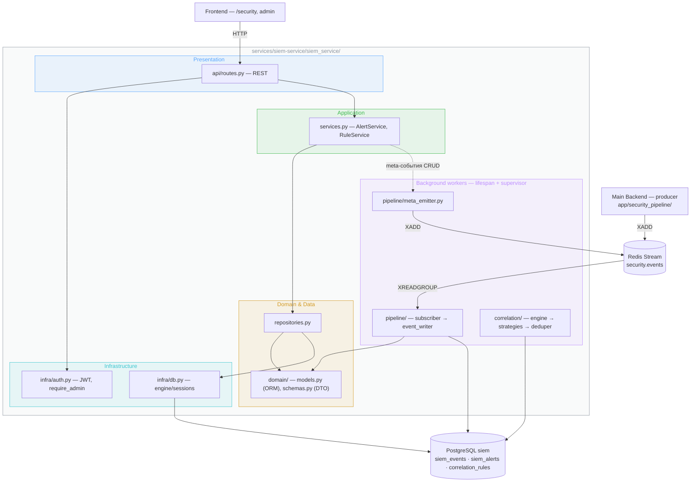
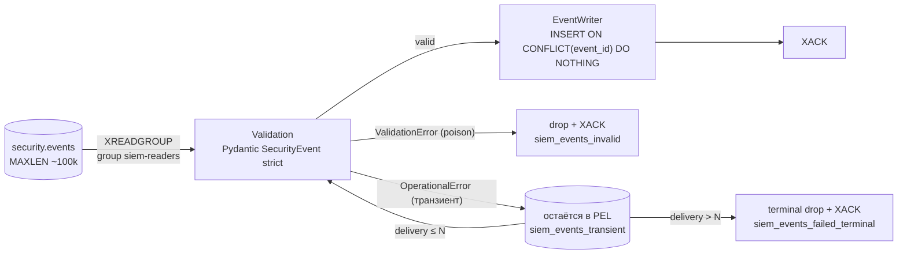
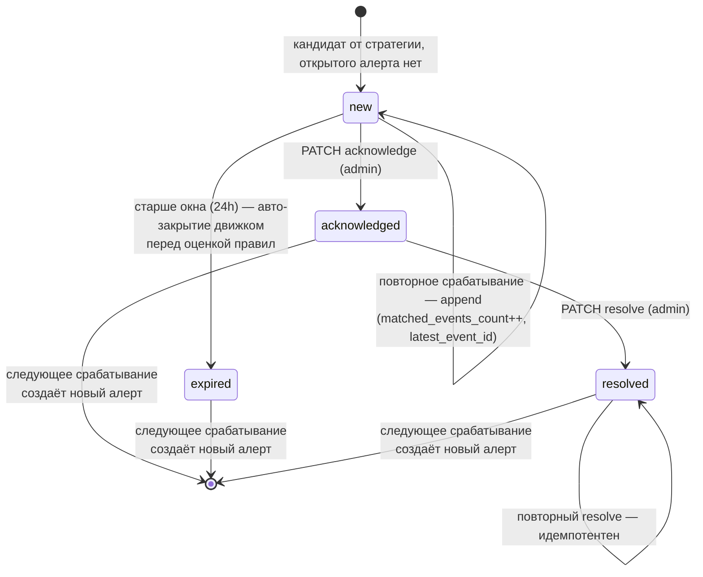

# SIEM Service

Отдельный FastAPI backend-сервис для security-мониторинга: потребляет security-события main app из Redis Stream, хранит их в изолированной PostgreSQL, коррелирует по правилам, генерирует алерты и отдаёт admin-only REST API для мониторинга UI (страница `/security` основного SPA).

Producer-сторона (нормализация событий, vocabulary, structlog-конвенция) описана в [backend.md](backend.md#security-event-logging-convention) и [security-events.md](security-events.md). Обоснования архитектурных решений — в ADR: [ADR-018](adr/ADR-018-siem-service-topology.md) (топология), [ADR-019](adr/ADR-019-security-event-transport.md) (транспорт), [ADR-020](adr/ADR-020-security-event-contract.md) (контракт события), [ADR-021](adr/ADR-021-siem-correlation-engine.md) (correlation engine).

## Топология

Сервис процессно изолирован от main app (отдельный контейнер, порт 8001, своя БД siem-db :5434). Ключевые следствия (детали и альтернативы — ADR-018):

- **Blast radius isolation** — крах SIEM не влияет на main app; тот продолжает публиковать события в Redis Stream.
- **Выделенный event loop** — time-window SQL корреляции не конкурирует с user-facing запросами за CPU и connection pool.
- **Один процесс, один asyncio loop** — subscriber и correlation engine являются синглтонами, multi-worker не используется.
- **Отдельная БД** — cross-DB join'ы невозможны принципиально; это enforcement изоляции, а не ограничение.
- **Кросс-сервисный identity без back-channel** — JWT main app валидируется локально тем же `JWT_SECRET` (HS256), доступ только с claim `is_admin`.
- **Trusted network** — один хост, порты не выставлены наружу; Redis без AUTH, mTLS нет (осознанное допущение).

## Layered Architecture

Слои показаны цветными подложками; внешняя рамка — граница сервиса, всё снаружи — внешние системы:



Composition root — `siem_service/main.py`: lifespan инициализирует по порядку Settings → DB engine/session factory → Redis client → background-задачи subscriber и correlation engine (обе под supervisor).

## Event Pipeline

Доставка at-least-once с идемпотентным consumer'ом (детали и альтернативы — ADR-019):



- **`pipeline/subscriber.py`** — consumer group `siem-readers`; на старте дочитывает pending list (unacked после краха). Разделяет классы отказа: `ValidationError` (poison) → drop + XACK; `OperationalError`/`DBAPIError` (транзиент) → **не XACK** (остаётся в PEL на переобработку) + bounded delivery-count (после `max_delivery_attempts` — terminal drop + XACK + `logger.error`); успешная запись → XACK. Конвенция разделения — [conventions.md](conventions.md#siem-event-pipeline).
- **`pipeline/event_writer.py`** — единственная точка INSERT; идемпотентность по `event_id` (UNIQUE + `ON CONFLICT DO NOTHING`).
- **`pipeline/meta_emitter.py`** — back-channel: admin-CRUD операции сервиса сами порождают события (`siem.alert.acknowledged`, `siem.rule.created` и т.д.) через XADD в тот же stream — петля через собственный subscriber, дедуп по `event_id`.
- **`pipeline/supervisor.py`** — рестарт background-задач с exponential backoff (1s → cap 60s), бесконечно; пропускает только `CancelledError`.

Контракт события (`SecurityEvent`: `event_id`, иерархический `event_type`, `severity`, `timestamp`, `identifiers`, `metadata`) — shared-пакет [`packages/siem-contracts/`](../../packages/siem-contracts/), общий для producer и consumer. Vocabulary event_type'ов — [security-events.md](security-events.md), решение по контракту — ADR-020.

## Correlation Engine

Asyncio background-задача, polling каждые `SIEM_POLL_INTERVAL_SECONDS` (default 10s): загружает enabled-правила, для каждого выполняет стратегию, кандидатов прогоняет через дедупликацию (обоснование polling vs event-driven — ADR-021).

**Три типа правил** (`correlation/strategies.py`), конфигурация правила — JSONB:

| Тип | Семантика | Механика |
|-----|-----------|----------|
| `threshold` | ≥ N событий за окно T по ключу группировки K | выборка окна по `ingested_at`, группировка по `identifiers->>K` в Python |
| `sequence` | событие A, затем B за окно T (по K) | выборка обоих паттернов, поиск пар A→B в Python |
| `aggregate` | ≥ N событий за окно T без группировки | threshold с `group_key = NULL` |

Стратегии считают в Python над выборкой окна — на текущих объёмах это читаемее; перевод на SQL-агрегаты (`GROUP BY ... HAVING`, self-join) заведён в backlog как оптимизация под нагрузку.

**Дедупликация алертов** (`correlation/deduper.py`) — open-alert policy: открытый (status `new`) алерт с тем же `(rule_id, group_key)` получает append (инкремент счётчика, обновление `latest_event_id`), иначе создаётся новый. Реализована одним атомарным upsert'ом (`INSERT ... ON CONFLICT DO UPDATE`) поверх частичного уникального индекса `uq_siem_alerts_open_alert` — инвариант «не больше одного открытого алерта на ключ» держит БД, гонка реплик исключена. Возрастной лимит обслуживает движок: перед оценкой правил открытые алерты старше `SIEM_ALERT_OPEN_WINDOW_SECONDS` (default 24h) переводятся в `expired`, чтобы многодневная атака не схлопывалась в один бесконечный алерт — следующее срабатывание поднимает свежий алерт.

**Lifecycle алерта:**



**Baseline-правила** засеяны идемпотентной миграцией: `brute_force_auth` (5 × `auth.login.failed` / 60s по ip), `injection_spike` (10 × `agent.guard.%.injection` / 300s), `targeted_user_attack` (3 × `agent.guard.%` / 600s по user_id), `mass_suspicious` (15 × `agent.guard.%.suspicious` / 600s).

## Persistence

Собственная PostgreSQL (siem-db), миграции Alembic (`services/siem-service/alembic/`).

| Таблица | Назначение | Ключевое |
|---------|-----------|----------|
| `siem_events` | immutable-хранилище событий | `event_id` UNIQUE (идемпотентность); двойные таймстемпы `event_timestamp` (producer) / `ingested_at` (consumer); JSONB `identifiers` (GIN-индекс) и `event_metadata` |
| `siem_alerts` | алерты от правил | FK → правило и первое/последнее событие; `status`, `group_key`, `matched_events_count`; частичный уникальный индекс `uq_siem_alerts_open_alert (rule_id, group_key) WHERE status='new'` (NULLS NOT DISTINCT) — инвариант open-alert политики и опора ON CONFLICT |
| `correlation_rules` | определения правил | `rule_type` + JSONB `config`, `enabled`, `severity` алерта |

Окна корреляции считаются по `ingested_at` (детерминизм при отставании producer-таймстемпов). Retention — `SIEM_DELETE_AFTER_DAYS` (default 90).

## REST API

Все эндпоинты admin-only (`require_admin`: JWT HS256 + claim `is_admin`, иначе 403). Зрелый REST: плюральные ресурсы, `PaginatedXResponse`, PATCH-семантика. Ошибки — RFC 9457 Problem Details (`application/problem+json`), формат един с main app — см. [conventions/api.md](conventions/api.md#rest-api).

| Метод | Путь | Назначение |
|-------|------|-----------|
| GET | `/api/security/events` | список событий; фильтры event_type, severity, период; пагинация |
| GET | `/api/security/alerts` | список алертов; фильтры severity, status; пагинация |
| GET | `/api/security/alerts/{id}` | детали алерта |
| PATCH | `/api/security/alerts/{id}` | смена статуса (acknowledge/resolve) → meta-событие |
| GET | `/api/security/rules` | список правил |
| POST | `/api/security/rules` | создание правила → meta-событие |
| PATCH | `/api/security/rules/{id}` | изменение правила → meta-событие |
| DELETE | `/api/security/rules/{id}` | удаление правила → meta-событие |

Добавление нового правила корреляции — это INSERT через REST, без деплоя; расширение набора event_type — расширение Literal-vocabulary в `siem-contracts`.

Frontend-потребитель — feature `security` основного SPA (lazy-loaded маршрут `/security`, RBAC-guard по `is_admin`): [frontend.md](frontend.md#компонентная-архитектура).

## Module Structure

```
services/siem-service/
├── Dockerfile
├── pyproject.toml            # workspace member
├── alembic/versions/         # 001 events → 002 alerts+rules → 003 baseline seed → 004 локализация
└── siem_service/
    ├── main.py               # FastAPI app + lifespan (subscriber + engine под supervisor)
    ├── config.py             # Settings, env-префикс SIEM_
    ├── api/                  # REST endpoints
    ├── pipeline/             # subscriber, event_writer, meta_emitter, supervisor
    ├── correlation/          # engine, strategies, deduper
    ├── domain/               # ORM-модели + Pydantic DTO
    ├── infra/                # db (engine/sessions), auth (JWT, require_admin)
    ├── repositories.py       # запросы: списки, фильтры, пагинация
    └── services.py           # AlertService, RuleService
```

## Configuration

`pydantic-settings`, env-префикс `SIEM_`:

| Переменная | Назначение | Default |
|-----------|-----------|---------|
| `SIEM_DATABASE_URL` | PostgreSQL siem-db (asyncpg) | localhost/siem |
| `SIEM_REDIS_URL` | Redis (streams) | redis://localhost:6379 |
| `SIEM_JWT_SECRET` | общий с main app секрет JWT | — |
| `SIEM_XREAD_BATCH_SIZE` / `SIEM_XREAD_BLOCK_MS` | батч и блокировка consumer'а | 100 / 1000 |
| `SIEM_POLL_INTERVAL_SECONDS` | период корреляции | 10 |
| `SIEM_ALERT_OPEN_WINDOW_SECONDS` | возрастной лимит open-alert | 86400 |
| `SIEM_DELETE_AFTER_DAYS` | retention событий | 90 |
| `SIEM_REDIS_SOCKET_TIMEOUT` / `SIEM_REDIS_SOCKET_CONNECT_TIMEOUT` | таймауты Redis-сокета; инвариант: `socket_timeout > xread_block_ms/1000` | 5.0 / 5.0 |
| `SIEM_DB_STATEMENT_TIMEOUT_SECONDS` | statement_timeout PostgreSQL (per-statement) | 120 |
| `SIEM_MAX_DELIVERY_ATTEMPTS` | максимум переобработок транзиентного сообщения через PEL | 5 |

**Deployment:** контейнер `siem-service` + контейнер `siem-db` (PostgreSQL :5434) в docker-compose; зависит от siem-db и redis (healthy). CORS — origins main app и dev-фронта.
